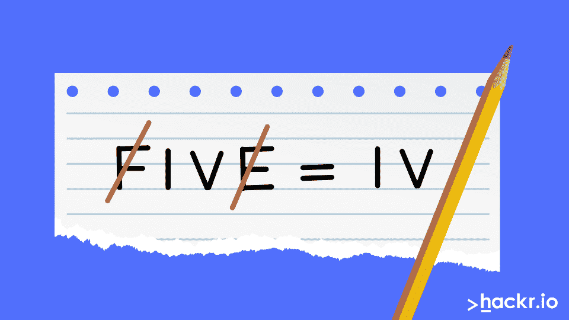
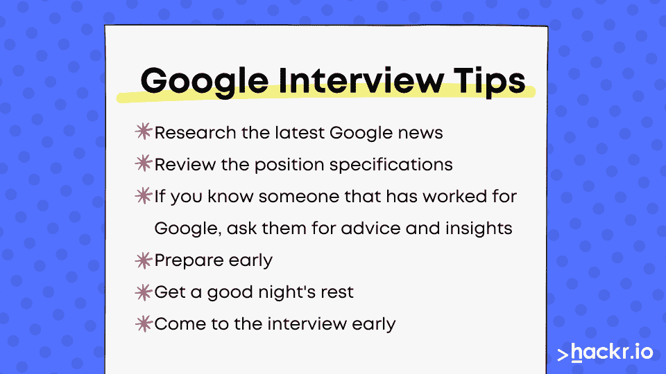

# 热门谷歌面试问答:谷歌面试准备 2023

> 原文：<https://hackr.io/blog/google-interview-questions>

作为世界上最强大的科技巨头之一，谷歌无需介绍。不足为奇的是，许多有抱负的开发人员、工程师、分析师和其他专业人士都会喜欢为谷歌工作的机会，并成为该组织的一部分，在推动当今的 it 世界方面发挥重要作用。

现在，谷歌在挑选候选人中最有才华的人方面毫不逊色。因此，谷歌的招聘过程漫长而复杂，需要充分的准备和出色的表现才能成功通过。

在面试之前，回顾一下谷歌面试中可能出现的问题是非常重要的。无论是谷歌软件工程师面试问题，谷歌行为面试问题，还是谷歌编码面试问题 2023——你都需要做好准备。被恐吓？别担心，我们会掩护你的。今天，我们将浏览 2023 年所有可能的谷歌面试问题，以帮助你做好准备。

通读每一个谷歌假设面试问题，并定期练习谷歌面试问题和答案，以获得最佳效果！

我们开始吧！

## **谷歌面试流程**

谷歌以进行一些奇怪的采访而闻名。一些未来的候选人回忆起被问到的奇怪问题，感觉更像是谜语，比如“一辆校车能装多少高尔夫球。”查看一些账户和谷歌面试的 [评论](https://www.geeksforgeeks.org/tag/google/) 来自经历过这个过程的候选人！

谷歌还有一个坏名声，那就是它的面试过程是最长的，有人说在 6 个月的时间里有 6-9 次面试。如今，你不必经历那么多面试，但你仍然会比其他雇主面临更多的过程。以下是谷歌面试流程的各个阶段:

*   1-2 次电话筛选
*   4-5 场现场面试
*   招聘委员会审核
*   执行审查

根据你想得到的角色，你可能会面临各种各样的问题。作为补充学习材料，来看看这些 [数据结构面试题](https://hackr.io/blog/data-structure-interview-questions) 和 [编程面试题](https://hackr.io/blog/programming-interview-questions) 。

准备在白板上解释你对逻辑、编码和算法问题的答案。你还会面临一些谷歌行为面试问题。

让我们深入一些谷歌流程面试问题吧！

## **谷歌面试问答排行榜**

让我们按类别来看看一些谷歌假设面试问题。

### **常见谷歌面试问答**

#### **1。你最喜欢的谷歌产品是什么，你会如何改进它？**

**可能答案:** 我最喜欢的谷歌产品是谷歌地图。当我在城里或旅途中迷路时，它帮我找到了路，我喜欢它告诉我哪里有交通堵塞或其他潜在的延误原因。为了改善这一点，我会向客户提供一个付费的实时地图版本，不需要数据就可以看到特定区域的路径。这将有助于在偏远社区旅行、无法访问数据的人们。

**注:** 这个问题玩得开心！我们加了一个产品例子，但是这个答案有那么多 [谷歌产品](https://about.google/intl/ALL_us/products/) 可供选择。

#### **2。简单解释一下编码和编程的区别。**

**回答** :编码严格来说是指为实现某个问题的解决方案而编写代码。虽然编程与编码被错误地互换使用，但它是一个更广泛的过程，涉及编码以及提出解决特定问题的方法和其他程序开发任务，如测试。

**了解更多:** [**编码与编程**](https://hackr.io/blog/coding-vs-programming-difference-you-should-know)

### **谷歌行为面试问题**

#### **3。你如何保持责任感？**

除了我自己的诚信，我还有一些工具可以帮助我保持责任感。我喜欢使用日历应用程序和 Asana 等项目管理工具来跟踪我的交付成果，并确保我跟踪我的截止日期。我提前留出时间完成每一项任务，在极端情况下需要更多时间的话会和上级同事沟通。我还确保在项目到期日之前安排好与利益相关者或团队成员的会议，以确保我们在项目上意见一致。

#### **4。告诉我你设定并实现目标的一次经历？**

在我上一份 X 的工作中，我的主管告诉我们，由于人手不足，我们无法完成定额。虽然工作量的减少得到了我和我的同事们的赞赏，但我认为尽管缺少一名团队成员，我们还是能更好地实现最初的目标。我和我的同事们组织了一次会议，讨论了推动我们的工作量以实现我们最初的预期目标。我尽最大努力鼓励他们参与，这样我们就可以作为一个团队来完成这项工作。通过加强沟通和协调额外任务的额外努力，我们完成了年终配额，并遵守了最初的承诺。

### **谷歌假想面试问答:编码、工程、逻辑、数据的技术问题**

#### **5。在这种情况下，你如何用最少的提问次数了解一个人的身份？有多少种方法可以解决这个问题？**

一个聚会正在进行，有“n个出席者，每个聚会出席者只认识一个人。这个认识的人可能会出席聚会。但是，这个人在聚会上谁都不认识，我们只能问这样的问题，A 认识 B 吗？如何用最少的提问次数得知陌生人的身份？有多少种方法可以解决这个问题？

**回答** : 为了解决问题，我们需要考虑一个有 N 个元素的数组，代表所有的聚会出席者。我们还可以考虑一个函数，已知是(A，B)。如果 A 知道 B，它将返回 true 否则为假。我们可以通过三种方式解决 **中的问题。**

##### **第一种解法——暴力搜索法**

类似于 [蛮力搜索](https://www.freecodecamp.org/news/brute-force-algorithms-explained/) ， 使用图形对解进行建模，并将每个顶点的 indegree 和 outdegree 初始化为 0。如果 A 知道 B，那么画一条从 A 到 B 的有向边。将 B 的入度和 A 的出度增加 1。接下来，为每个可能的对构建图的所有边。如果这个人在场，那么我们将有一个入度为 N-1、出度为 0 的 sink 节点，因为这个人在聚会上不认识任何人。  寻找汇聚节点所需的总时间，即人将为(n)，问题的整体复杂度将为 O(N^2).

##### **第二种解决方案——使用递归**

递归允许我们将整个问题分解成更小实例的组合。这里，我们在 divide 步骤中解决了较小实例的问题。当返回时，我们将从较小的实例中找到该人，如果存在的话。

在组合步骤中，确保(检查)每个人都认识这个人，而她不认识任何人。递归分解的递归将是 T(N) = O(N2)。

##### **第三种解决方案-使用堆栈**

根据 [淘汰法](https://en.wikipedia.org/wiki/Elimination_theory)我们有如下观察:

*   如果 A 认识 B，那么 A 不是那个人，而 B 可能是。因此，丢弃 A.
*   如果 A 不认识 B，那么 B 就不是那个人，而 A 可能是。所以，丢弃 B.
*   重复上述两个步骤，直到只剩下一个人。
*   确保剩下的人就是我们要找的人。

为了确保剩下的人就是我们要找的人，我们可以使用如下堆栈:

*   **第一步:** 将所有参加聚会的人推到一个堆栈中。
*   第二步: 从堆栈中弹出两个人。基于已知(A，B)函数的返回状态，丢弃其中一个并将剩余的人推入堆栈。
*   **第三步:** 继续重复第二步，直到堆栈中只剩下一个人。
*   **步骤 4:** 检查剩下的人是否认识任何其他的聚会参加者。

假定这个人出现在聚会上，Areknown (A，B)函数将被调用 3(N-1)次。

#### **6。井盖可以是除了圆形以外的任何形状吗，比如矩形？**

**回答** :不可以，井盖必须是圆的，以免掉进人孔里。只有圆形的井盖不会掉进下水道。如果盖子是长方形或正方形，那么它很容易掉进去。

#### 7 .**。下列哪一组不属于？**

*   **【甲、乙、丙、丁】**
*   **【a，f，b，g】**
*   **【h，I，a，b】**
*   **【j，k，l，m】**

**答案:**【j，k，l，m】不属于数列。剩下的三个集合是这个系列的一部分，因为它们都有[a，b]子集。

#### **8。什么是 DEADBEEF？**

**答案** : DEADBEEF 对应 32 位数字的十六进制表示，3735928559。在汇编/主机时代，它被用作神奇的调试值 。在十六进制转储页中查找和标记特定内存时，DEADBEEF 使其易于识别。

#### **9。解释两和问题。有多少种方法可以解决？**

**回答** :我们可以用两种方法解决这个问题。二和问题是 [子集和问题](https://www.geeksforgeeks.org/subset-sum-problem-dp-25/) 的变种。 这个问题涉及到从一个未排序的数组中找出两个整数的所有对，其总和为 s。

例如，如果未排序的数组是[22，24，36，-3，5，-17，14]并且总和是 19，那么程序必须返回[22，-3]，[36，-17]，[5，14]。

**解决方案 1(正常):** 这个问题的简单解决方案是遍历整个数组两次，第二次寻找总和为 s 的一对。这个解决方案的总运行时间将是 O(N^2).

**解决方案 2(更快):** 这种方法使用哈希表。在传递数组的每个元素时，该方法检查 S(当前元素)是否存在于哈希表中。因此，我们只需要遍历数组一次。所以，这个解的运行时间是 O(N)。

#### 10。解释寻找给定集合的幂集的算法。

**答案** :给定集合的幂集包含元素的所有可能组合，即给定集合的所有子集、空集、给定集合本身。例如，如果 S = [0，1，2，3]是给定的集合，那么它的幂集将是:

**P【S】**=[[]，[0]，[1]，[2]，[3]，[0，1]，[0，2]，[0，3]，[1，2]，[1，3]，[2，3]，[0，1，2，2]，[0，1，3]，[0，2，3]，[1，2，3]，[0，1，2，3]，[0，1，2，3]。

下面是求给定集合的幂集的算法:

对于一个有 N 个元素的集合，总的子集将是 2N 个。因此，求给定集合的幂集的算法包含以下步骤:

*   **第一步:** 从 0 到 2N 循环。
*   **第二步:** 对于每个数字，求二进制表示。例如，四在二进制中表示为 0100。
*   **第三步:** 使用二进制表示检查是否包含集合中的一个数，例如 0100 = [exclude，include，exclude，exclude]。

#### **11。有没有可能五减二等于四？如果是，如何实现？**

**回答** :是的，如果我们从五个字母中去掉两个字母，即 f 和 e，我们得到 IV。IV 是代表 4 的罗马数字。



#### **12。假设你有一个输入字符串 1？？0，哪里？是通配符。解释寻找所有可能的字符串组合的算法**

**回答** :输入的字符串是 1？？0.现在，第一个和最后一个数字是固定的。中间两个是通配符，这意味着它们可以是 0 或 1。

这里有一个寻找给定字符串所有可能组合的通用算法:

*   **第一步:** 用字符串和一个空集调用函数开始(这里我们会推送 0 和 1)。
*   **第二步:** 一旦控制达到 a？，制作每个字符串集的副本，一半加 0，另一半加 1。
*   **第三步:** 用一个更小的字符串继续递归调用函数，直到字符串运行为空。

为 1？？0 输入字符串，算法是这样工作的:

初始集合= [](步骤 1 中调用的空集)

*   第一个字符= 1，所以 set = [1]
*   第二个字符=？
*   因此，将制作每个字符串集的副本，即[1]，[1]。接下来，将 0 添加到一半的集合中，将 1 添加到另一半集合中。因此，集合= [1，0]，[1，1]
*   第三个字符=？，因此将再次复制每个字符串集，即[1，0]，[1，0]，[1，1]，[1，1]。接下来，将 0 添加到一半的字符串集合，将 1 添加到另一半。因此，集合= [1，0，0]，[1，1，0]，[1，0，1]，[1，1，1]
*   第 4 个字符= 0，所以最后一组是[1，0，0，0]，[1，0，1，0]，[1，1，0，0]，[1，1，1，0]。

13。你会如何向一个 10 岁的孩子解释编程和编程语言？

**回答** :编程可以让我们教会计算机做具体的事情。一种 [编程语言](https://hackr.io/blog/what-is-programming-language) 就像是我们说的一种语言，除了电脑会说。

#### **14。编写代码来搜索数组是否有多数元素。如果是，打印出来。**

**回答** :下面的 [C++](https://hackr.io/blog/what-is-cpp) 程序在一个数组[10，22，22，21，22，23，22]中查找多数元素然后打印出来:

```
#include <iostream>

using namespace std;

void findMajorityElement(int arr[], int n)

{

   int maxCount = 0;  

   int index = -1;

   for(int i = 0; i < n; i++) 

   { 

       int count = 0; 

       for(int j = 0; j < n; j++) 

       { 

           if(arr[i] == arr[j]) 

           count++; 

       }

       if(count > maxCount) 

       { 

           maxCount = count; 

           index = i; 

       } 

   }

   if (maxCount > n/2) 

      cout << arr[index] << endl;

   else

       cout << "No Majority Element Exists in the Array" << endl; 

}

int main()

{

   int arr[] = {10, 22, 22, 21, 22, 23, 22};

   int n = sizeof(arr) / sizeof(arr[0]);

   findMajorityElement(arr, n);

   return 0; 

}
```

**输出:**

22

#### 15。对 3，3，7，7 使用数学运算+，-，*，和/得到 24。

**答案**:3 除以 7，再加 3。之后，将结果乘以 7 得到 24:

7 x ((3/7) + 3) = 24

#### 16。区间(3，7)是否覆盖这些位置坐标，[[1，3]，[2，5]，[5，7]]？是否包含在此列表[[2，3]，[3，4]，[5，6]，[6，7]]中？

**答案**:3 到 7 点都包含在列表里[[1，3]，[2，5]，[5，7]]因为 2 到 5 和 5 到 7 都包含了。然而，列表[[2，3]，[3，4]，[5，6]，[6，7]]中不包括点 3 到 7，因为这里不包括 4 到 5 之间的距离。

#### **17。假设你有六个玻璃杯排成一排，前三个装满果汁，后三个是空的。你怎么能只交换一次就把玻璃杯排列成交替模式呢？**

**回答** :让我们用 J 来代表装满果汁的玻璃杯，用 E 来代表空玻璃杯:

J J J J E E E

现在，我们希望有:

J E J E J E J E

或

E J E J E J

对于 the E J E J E J 模式，我们至少需要交换两次，用第一个替换第四个玻璃，用第二个替换第五个。

为了实现 the J E J E J E 模式，我们只需要一次交换，即用第 5 块玻璃替换第 2 块玻璃。


#### 18。在给定的 n 个不同元素的和等于 0 的数组中，有多少种方法可以找到所有的三元组？

**回答** :这里有三种方法可以找到给定的不同元素数组中所有和为零的三元组:

**方法 1(朴素方法):** 运行三个独立的循环，逐一检查三个元素之和是否为零。打印总和等于 0 的所有三元组，否则打印未找到。

辅助空间:O(1)

时间复杂度:O(n3)

**方法 2(散列):** 在这种方法中，我们遍历每个元素。对于每个元素 arr[i]，我们需要找到一个 0 - arr[i]的对。该方法包括以下步骤:

*   运行从 i = 0 到 i = n - 2 的循环
*   创建一个空哈希表
*   运行从 j = i + 1 到 j = n -1 的内循环
*   如果- (arr[i] + arr[j])出现在哈希表中，则打印 arr[i]，arr[j]和-(arr[I]+arr[j])  否则将 arr[j]插入哈希表

辅助空间:O(n)

时间复杂度:O(n2)

**方法 3(排序)** :我们可以用 [排序](https://hackr.io/blog/quick-sort-in-c) 来寻找和等于零的三胞胎。它包括以下步骤:

*   对数组进行排序。
*   运行一个从 i = 0 到 i = n - 2 的循环，初始化两个索引变量，l = i + 1 和 r = n - 1。
*   While (l < r)，检查 arr[i]，arr[l]，arr[r]的和是否为零。
*   如果和为 0，那么打印三联体，做 l++和 r-。
*   如果总和小于 0，则 l++。
*   如果和大于 0，那么 r-。
*   如果数组中不存在总和，则打印未找到。

辅助空间:O(1)

时间复杂度:O(n2)

#### **19。多少个月有 28 天或 29 天？**

**回答** :所有的 12 个月都有 28 或 29 天。

#### 20。时钟的分针和时针在一天中什么时候重叠，重叠多少次？用数学解释。

**回答** :对于 T 小时:

*   分针完成的总圈数= T
*   时针完成的总圈数= T/12

分针和时针在一天中第一次重叠是在凌晨 12 点以后。前者将比后者多跑一圈。因此，对于一个重叠，时间段 T 将是:

T = T/12 + 1 - (i)

求解它得到 T，

T = (12+T)/12

12T = 12 + T

12T - T = 12

11T = 12

T = 12/11

所以，

T = (12/11) * 60 = 65，也就是凌晨 1:05

65 分钟也是每次连续重叠的间隙。现在，时针和分针第二次相互重叠；分针将比时针多完成两圈。因此，对 N 个重叠应用相同的逻辑，我们得到:

T = T/12 + N - (ii)

我们一天有 24 小时，即 T = 24。因此，求解(ii)将给出时针和分针在一天中相互重叠的总数:

24 = 24/12 + N

24 = 2 + N

N = 24 -2

N = 22

因此，分针和时针将在一天的相互重叠 22 次

*   上午 12 点
*   上午 01:05
*   凌晨 02 点 10 分
*   上午 03:15
*   上午 04:20
*   上午 05:25
*   上午 06:30
*   上午 07:35
*   上午 08:40
*   上午 09:45
*   上午 10 点 50 分
*   中午 12 点
*   下午 01:05
*   下午 02 点 10 分
*   下午 03:15
*   下午 04:20
*   下午 05:25
*   下午 06:30
*   下午 07:35
*   晚上 08:40
*   晚上 09:45
*   晚上 10 点 50 分

#### **21。这个数列的下一个数字是什么:10，9，60，90，70，66**

**回答** :如果我们拼写这些数字，那么我们会发现每个连续的数字都比前一个数字多一个字母:

10:十(3 个字母)

9:九(4 个字母)

60:六十(5 个字母)

90:九十(6 个字母)

七十(7 个字母)

66:六十六(8 个字母)

因此，66 后面的数字将是 9 个字母的数字，如 91(91)或 92(92)。

#### **22。如果前天是周六后三天，那么今天是星期几？**

**答案** :周六后三天是周二，使得前天成为周二。所以:

*   前天是星期三，而
*   昨天是星期四。

因此，今天是星期五。

#### **23。加里今年 16 岁，比他的弟弟詹姆斯大 4 倍。当加里的年龄是詹姆斯的两倍时，他会有多大？**

**答案** :加里 16 岁，是弟弟詹姆斯的 4 倍。所以，詹姆斯是 4 岁，或 16/4。

这意味着 16 岁的加里比詹姆斯大 12 岁。

我们假设 Garry 的年龄是他弟弟的两倍时，他是 X 岁。让我们用 y 年来代表詹姆斯当时的年龄。现在，由于加里的年龄将是詹姆斯的两倍，我们得到:

x = 2y - (I)

也:

x = 12 + y - (II)

x = 2y = 12 + y

2y - y = 12

y = 12

所以，当他的哥哥盖瑞的年龄是他的两倍时，詹姆斯将是 12 岁。于是，当时麦威利的年龄将是 2×12 =**24 岁。**

#### **24。只加 8 怎么能得出 10000 的总数？**

**回答** :要想只加 8 得到 10000，必须把 8 加三次，然后是 88，888:

8 + 8 + 8 + 88 + 888 = 10000

#### **25。假设你有 8 个球。7 号一样重，8 号略重。只比较两次球，怎么能找到更重的球？**

**回答**:8 个球中，拿 6 个。现在，把它们分成三个一组，放在称重机的两边。如果重量相等，较重的球一定是剩下的两个球中的一个。否则，重量较重的一方将拥有较重的球。

如果这个球是剩下的两个球中的一个，那么:

将它们分别放在称重机的两侧，找出较重的球。

如果球是三连击之一:

从三个球中取出两个球，分别放在称重机的两侧。如果它们重量相等，那么剩下的球是较重的一个；否则，较重的一方将拥有较重的球。

#### **26。哪个数字不属于这个数列:0，1，1，2，3，4，5，8，13，21**

**答** :这个数列表示的是前两个数之和。数字 4 不属于这个数列，因为 3 和 2 加起来不等于 4。正确的顺序应该是:，0，1，1，2，3，5，8，13，21。

## **准备谷歌面试的技巧**

****

查看谷歌面试问答是你面试准备的良好开端。以下是一些需要准备的有用提示:

*   研究关于谷歌的最新新闻，包括新的发展和产品，扩张，法律问题，以及任何其他相关的东西。
*   在你面试之前，非常详细地回顾一下工作职位的详细说明。
*   和你的关系网谈谈，看看是否有人经历过谷歌面试过程，向他们请教一些技巧。
*   早做准备。
*   好好休息一晚，早点去参加面试。

## **面试结束时问的最佳问题**

在谷歌面试结束时，面试官可能会问你是否有问题要问他们。你能做的最糟糕的事情就是说“不”。通过向他们提出一些深思熟虑的问题来展示你的兴趣、承诺和参与。

这里有几个例子:

*   对于我这个职位的人来说，平常的一天是怎样的？
*   你如何衡量我面试的这个职位的成功？
*   在谷歌工作，你最喜欢的部分是什么？
*   这个职位最具挑战性的部分是什么？

## **结论**

这些谷歌面试问题应该会让你对谷歌如何处理他们的面试和招聘过程有一个大致的了解。

不要指望你的面试官会滔滔不绝地说出这篇文章中列出的谷歌面试问题。这个想法是让你自己习惯这些谷歌假设面试问题的感觉，以帮助你使用相同的技能来回答类似的问题。

对其他人在谷歌面试中的表现感到好奇？看看这个新毕业生的 [谷歌面试流程](https://medium.com/coding-blocks/google-interview-experience-new-grad-2021-sde-33058f7e856f) 的账号。

### 通过本课程赢得谷歌面试！

[](https://click.linksynergy.com/deeplink?id=jU79Zysihs4&mid=39197&murl=https%3A%2F%2Fwww.udemy.com%2Fcourse%2Fmaster-the-coding-interview-big-tech-faang-interviews%2F)

**人也在读:**