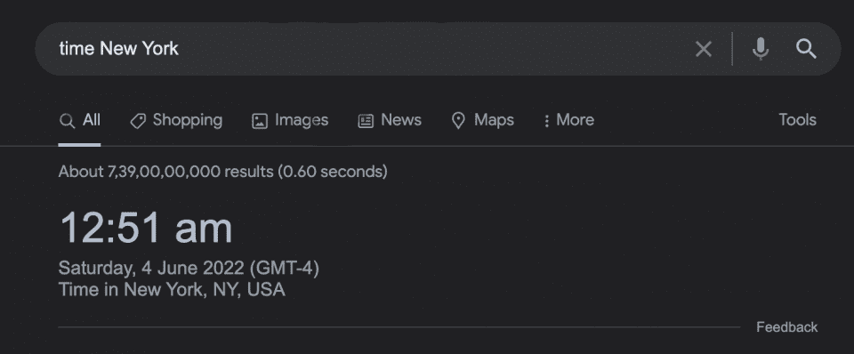
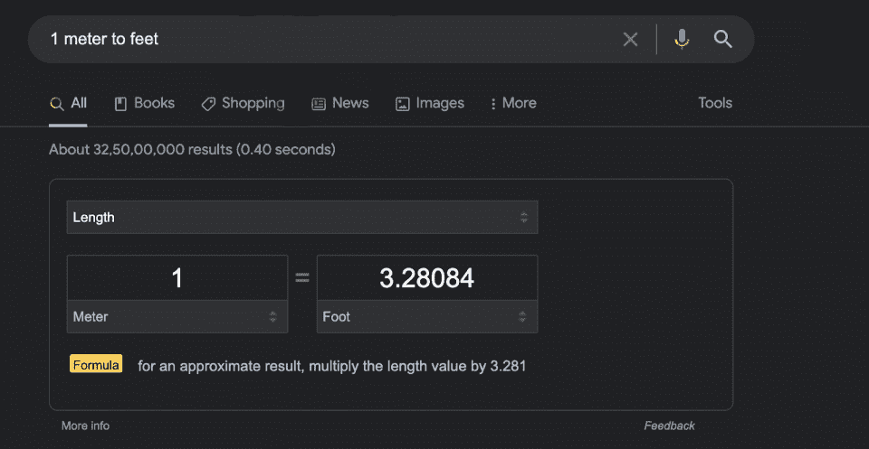
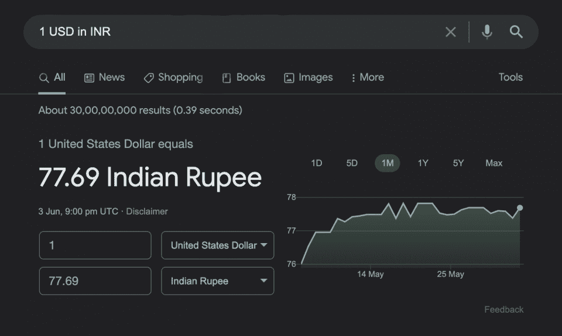
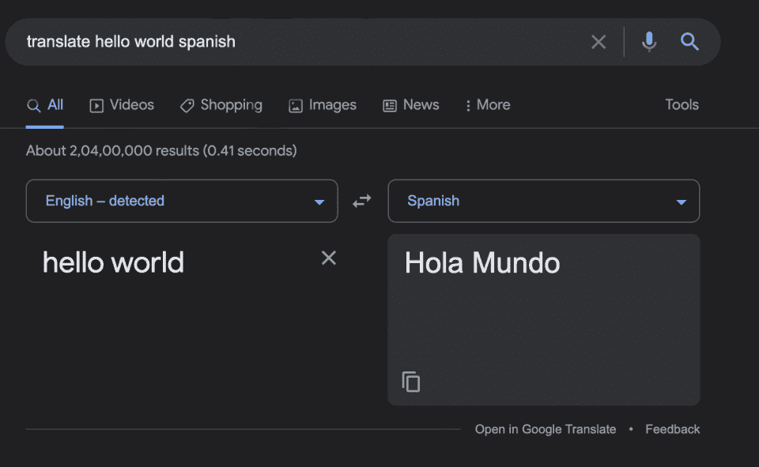
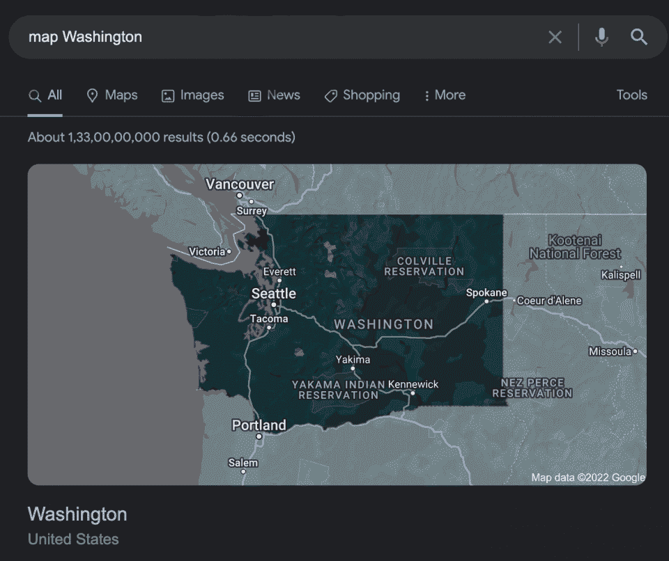
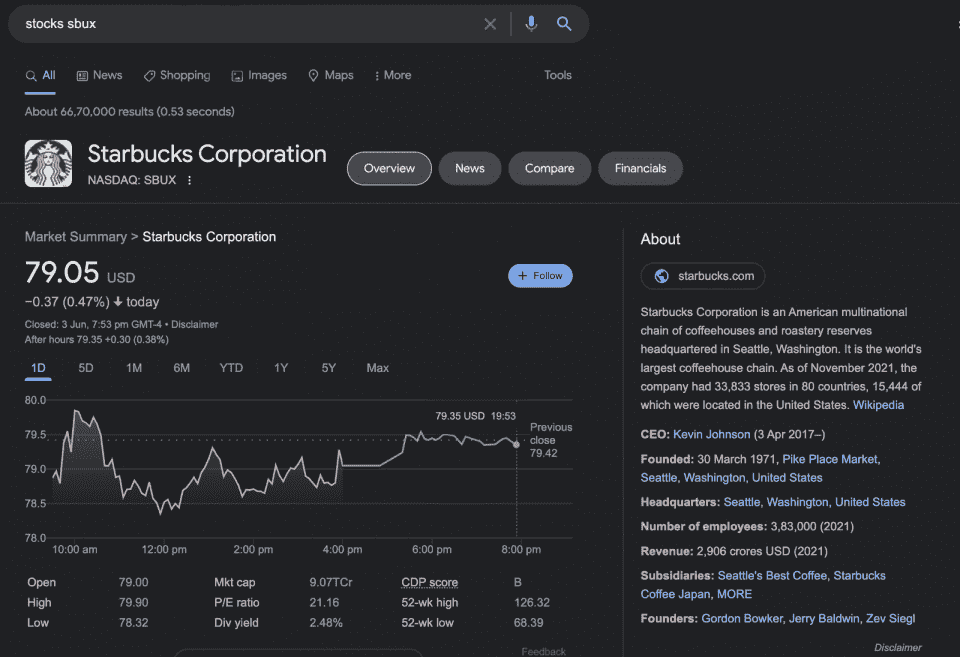
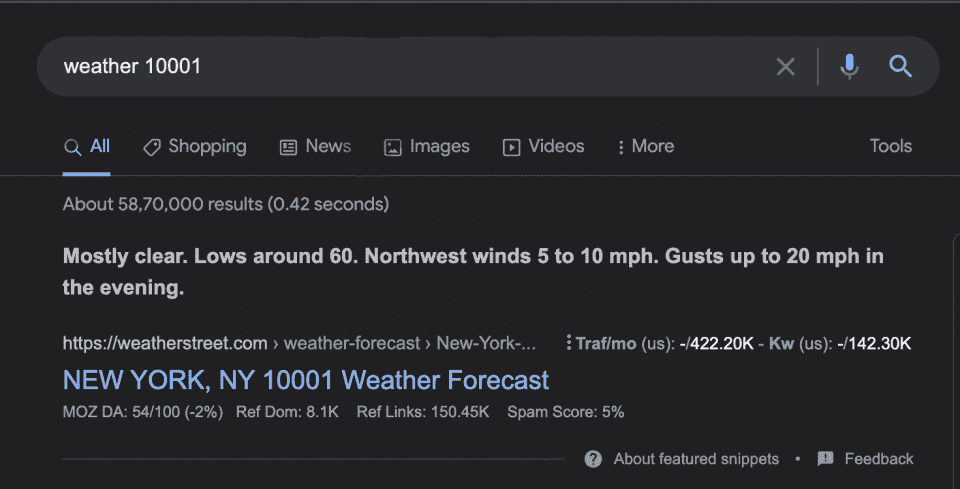

# 下载谷歌搜索运营商备忘单 PDF 快速参考

> 原文：<https://hackr.io/blog/google-search-operators-cheat-sheet>

我们大多数人通过谷歌来寻找我们需要的东西。然而，我们并不总是得到我们想要的结果。只有在筛选出不正确和不相关的结果后，我们才能找到我们的关键研究，如果有的话。如果你有一个方便的谷歌搜索备忘单来告诉你在哪里可以找到你的搜索结果就好了！

这就是谷歌搜索运营商发挥作用的地方。

谷歌搜索操作符是独特的指令和命令，帮助您执行高效的谷歌搜索。你可以很快得到你想要的结果，帮助你以闪电般的速度完成任务！

对所有的搜索运营商感到好奇吗？那么这个谷歌搜索运营商的备忘单就是给你的。

在这份 Google 操作符备忘单中，我们将讨论所有重要的 Google 搜索操作符、命令和提示，以帮助您快速找到理想的结果。

点击此处下载我们的谷歌搜索运营商备忘单 [PDF](https://drive.google.com/file/d/1EZhzW0rVLjbnn6_lUQXJ1a3bBAydWIne/view?usp=sharing) 。

## **谷歌搜索运营商备忘单:你应该知道的提示、操作符和命令**

让我们从基本的搜索操作符及其描述开始我们的 Google 搜索语法备忘单。第一步？搜索查询。

#### **信息搜索查询**

*   **define:** 将它放在搜索词之前，会返回指定单词的定义。

例子:定义华丽

*   **time:** 该查询为您提供特定位置的当前时间。

例如:时间斯德哥尔摩

*   **to:** 该运算符将测量值从一种单位转换为另一种单位。

例如:1 米到 1 英尺

*   **in:** 这将货币从一种单位转换成另一种单位。

例如:1 美元的印度卢比

*   **translate:** 这个操作符将查询的术语翻译成另一种语言。

示例:翻译 hello world 西班牙语

*   **map:** 这个操作符返回你指定位置的地图。

例如:华盛顿地图

*   **股票:**该谷歌搜索引擎为您的搜索查询提供股票信息(包括价值)。

示例:股票 sbux

*   **天气:**您可以检索给定位置或邮政编码的天气预报。

例如:天气 90210

搜索结果能比短词运算符更方便吗？我们甚至可以用仅仅*符号*做更多的事情！让我们看看 Google 搜索过滤器备忘单的操作符部分。

#### **基本谷歌搜索符号**

以下是可以用来缩小搜索结果范围的特殊 Google 符号:

*   **-** 使用此符号**从您的搜索结果中排除**特定的术语。

例如:最佳手机——苹果

*   **|** 这个符号的作用类似于**或**。搜索结果将包含您在此符号左侧和右侧指定的任一术语。

例如:手机|耳机

*   **@** 此符号为您提供与特定**社交媒体网站匹配的搜索结果。**

比如:@facebook

*   **#** 这将返回包含您在**标签**中指定的术语的搜索结果。

例如:#blackbeauty

*   **""** 它返回的搜索结果中，所有词语都以**连续的**顺序放在引号内。

示例:“信任流程”

*   ***** 返回任何符合星号位置**的单词。**

例如:纽约最佳*

*   **..**该符号提供与指定范围内的任何值或价格**匹配的搜索结果。**

例如:200 美元的 macbook..$500

*   **()** 你可以**将搜索词**分组，用这个符号控制查询的搜索逻辑。

示例:(最佳|最差)办公套件

*   **$** 这个符号返回你指定的搜索词的**价格**。

例如:chrome book 1000 美元

现在，让我们更深入地研究一下更高级的操作符。

#### **谷歌高级搜索运营商备忘单**

Google 搜索备忘单的这一部分重点介绍了各种高级搜索操作符及其描述。

您可以使用该操作符为某个网站收集几个可比较的站点。

#### **2。和**

搜索提供的所有术语。这将给出两个术语的结果。

#### **3。缓存**

该操作符检索网站的最新缓存版本(只要页面被编入索引)。

#### **4 .螺纹型〔t1〕**

显示特定文件类型的结果，如 DOCX、PDF、PPT、TXT 等。)

#### **5。站点**

将结果限制在单个网站上。

#### **6。已连接**

寻找互相连接的网站。

#### **7。标题**

寻找标题中有特定术语的站点。

#### **8。all title**

与“intitle”类似，它搜索包含页面标题中所有术语的在线网站。

#### **9。inurl**

在 URL 中查找包含特定术语的页面。

#### 10。allinurl

像“inurl”一样，它搜索包含 url 中所有术语的网站。

#### **11.  intext**

在内容中查找包含指定术语的页面。

#### **12.  allintext**

查找包含页面上所有特定术语的结果。

#### 13。【T1 左右(N)】

这种邻近搜索寻找具有两个单词(或短语)的站点，这两个单词(或短语)彼此在 N 个单词之内。

#### **14。站点:[网站]关键词**

你可以用这个在你指定的网站中用一个词或短语搜索一个相关的关键词，谷歌会返回相关的页面，你可以在你的网站内部链接。这将增强你的网站的搜索引擎优化。

#### 15。站点:[网站]

这将搜索您在某个网站上决定的任何内容，并将您的所有搜索结果限制在该网站。我们的建议？用这个来定位页面链接，提高你的搜索引擎优化！

#### 16。-【期限】

减号用在搜索查询中提供的短语之前，用于从搜索结果中删除特定的关键字。当你在寻找有几个意思的东西，想去掉其中一个的时候，这很有用。

#### **17。期限 1+期限 2**

您可以在某个短语前使用+运算符，以确保某些关键字总是包含在搜索结果中。

#### 18。缓存:[网站]

如果您使用缓存操作符，谷歌搜索将提供可在谷歌上访问的网页的最新缓存版本。这就是缓存的目的。调查结果保存在一个数据结构中，以便快速检索。

#### **19。inurl:[关键词]**

该运算符与关键字一起使用时，将返回在 URL 中包含该关键字的所有搜索结果。

#### 20。标题:

该搜索操作返回包含页面标题中的术语或短语的结果。

#### **21。all title:**

如果您在查询开始时使用这个操作符，Google 将只返回包含您给出的页面标题中所有短语的结果。

#### **22.  Intext:**

如果你用 allintitle 开始搜索，Google 只会返回包含你提供的页面标题中所有短语的结果。

#### **23.  Allintext:**

该操作符将允许您在页面文本中搜索完整的短语或关键字。

假设你记得在一篇文章中提到一个术语或短语，但你想不起是哪一个。要进行检查，请使用该运算符。

#### **24。金融机构:**

当涉及到 SEO 时，这个操作符就派上了用场。搜索操作符返回包含您在锚文本中输入的词语的页面的结果。

#### **25。Alli anchor:**

使用这个谷歌搜索操作符，整个关键词/短语显示为锚文本。

#### **26。Inurl:**

该操作将返回在 URL 某处包含您指定的关键字的结果。

这对于试图记住一个 URL 或者寻找关于一个给定主题的站点是很有用的。

#### **27。Allinurl:**

该运算符显示在 URL 中找到的关键字。不过，这一次，它将显示您输入的完整关键字或短语。

#### **28。帖子作者:**

这个搜索操作符帮助您快速定位内容作者。只需在谷歌上输入他们的名字，你就可以轻松访问他们写的博客文章和文章。

#### **29。位置:**

这个操作符(带有指定的位置)将帮助您将结果缩小到那个区域。

这两者的结合有助于缩小搜索结果的范围，这样你就可以浏览网站的子域。

#### 31。文件类型:[扩展名]

该操作符有助于发现具有特定文件扩展名的目标页面。

#### 32。条款 1/条件 1 或条款 2/条件 2

您可以使用 OR 搜索运算符来查找符合许多要求或搜索短语之一的搜索结果。

#### 33。关键字 1 *关键字 2

星号*通配符可以用于从提供的单词中获取更多匹配。当您在一个短语中使用通配符时，您将得到该短语的所有可能版本。我们用作通配符的 REGEX *操作符与此极其相似。

#### 34。第一项(X)第二项

两个关键字之间的最大距离可以使用 ROUND(N)运算符来定义。括号中的 N 表示可用于划分这两个术语的最大字数。

#### 35。日期范围:[日期 1-日期 2]

提供的运算符将显示您选择的日期范围的搜索结果。它使用儒略日格式。

#### 36。[第一年]..【第二年】

这个 Google 搜索操作符允许你在你的查询中添加一个用点分隔的年份范围过滤器。

#### 37。【流感疫苗分机:pdf 网站:edu】

该操作员帮助从 Google 搜索中获取相关文档。

您可以使用此操作符来定位在您的站点上被编入索引的非 HTTPS 页面。

#### 39。【你好世界-标题:你好-标题:世界】

只需在结果中找到提到给定术语的文章。

我们可以使用上面的运算符组合在多个网站上同时执行给定术语的搜索。

#### 41。【内容】

上面的操作符让你搜索给定内容在其他网站上是否存在重复

#### **42。文件类型:pdf seo**

很容易忘记您添加到站点的页面和资源，如 pdf、Word 文档和幻灯片。您可以选择一种文件类型，然后使用 file type 搜索操作符在您的站点(或整个网站)中搜索关键字，结果将显示匹配的文件。

#### **43。inurl:resources inttitle:resources 山地车**

资源页面是关于某一主题的最大资源的集合。

#### **44。[主题]标题:信息图标题:信息图**

在你的网站上，信息图是一个奇妙的视觉元素。

该搜索操作符可用于在社交媒体上定位某个人。

#### **46。英特尔:[竞争对手]或英特尔:[竞争对手]-site:website . com-site:website . com**

你可能会发现提到竞争对手的网站使用了 site:和 intext:和 OR 的组合...然而，你是个例外。

### **使用谷歌搜索操作符的技巧**

想充分利用这个谷歌搜索运营商备忘单吗？以下是一些需要记住的重要提示:

*   **删除搜索运算符和搜索词之间的空格**。
*   **结合基本和高级搜索运算符**来缩小搜索结果的范围。
*   确保**排除无意义的术语或短语**。
*   使用谷歌搜索运营商来定位那些剽窃你自己网站的网站。

[GCP 协理云工程师-谷歌云认证](https://click.linksynergy.com/link?id=jU79Zysihs4&offerid=1045023.3827154&type=2&murl=https%3A%2F%2Fwww.udemy.com%2Fcourse%2Fgoogle-cloud-certification-associate-cloud-engineer%2F)

## **结论**

我们已经到了谷歌搜索运营商备忘单的末尾。简单回顾一下，为了便于参考，我们已经介绍了操作符、语法和命令。任何时候你需要加快你的研究过程，请随意使用这个谷歌搜索语法备忘单。

对于离线使用，考虑下载这个[谷歌搜索提示 PDF](https://drive.google.com/file/d/1EZhzW0rVLjbnn6_lUQXJ1a3bBAydWIne/view?usp=sharing) 供你快速参考。如果你有兴趣了解更多关于谷歌的内部运作，学习不止于此！

## **常见问题解答**

#### **1。我如何用运营商搜索谷歌？**

以下是用运营商搜索谷歌的方法:

*   选择您想要搜索的主题。
*   决定是否要从搜索中排除一些术语，或者从特定网站获取精确的、逐字逐句的信息。
*   选择最符合您需求的适当搜索运算符。
*   输入搜索运算符和要搜索的术语。
*   按回车键，瞧！你会得到你想要的结果。

#### **2。我如何使用谷歌高级搜索运营商？**

Google 高级搜索操作符(ASO)是一种特殊的命令，与基本搜索操作符相比，它需要额外的参数，以便缩小搜索结果的范围并获得所需的结果。

#### **3。谷歌搜索命令有哪些？**

Google 搜索命令只是 Google 搜索操作符，我们用它来缩小搜索结果的范围。

#### **4。在 Google 中可以使用布尔运算符吗？**

是的，你可以使用布尔运算符 Google:

#### **5。谷歌搜索运营商有多少？**

有 60 多个谷歌搜索运营商。

#### **6。搜索运营商是如何工作的？**

谷歌搜索操作符将单词和符号结合起来，使你能够快速检索到准确的结果。

**人也在读:**