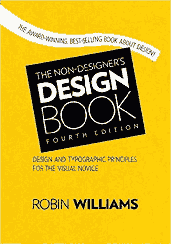
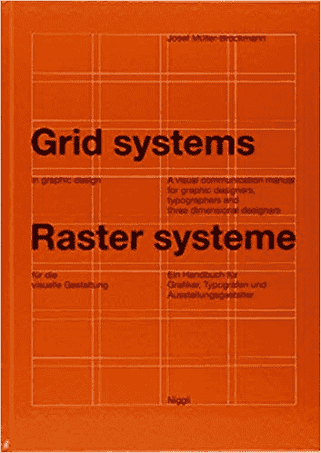
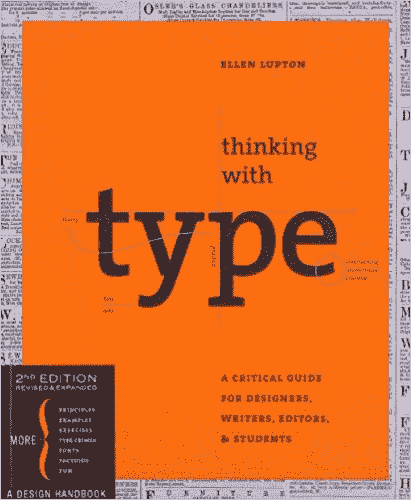
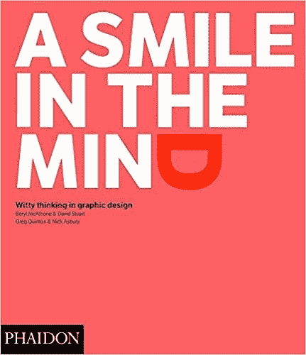
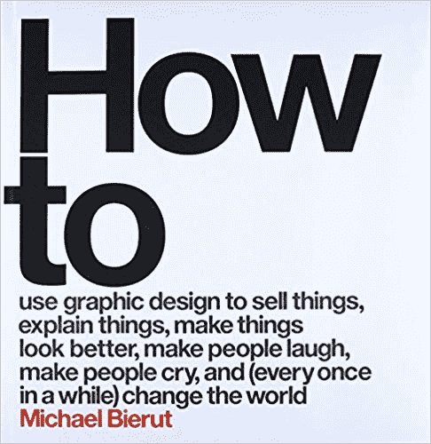
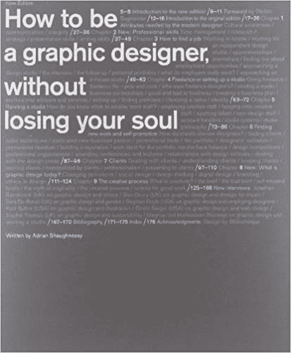
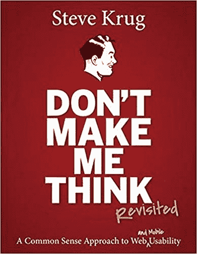

# 2023 年阅读的 10 本最佳平面设计书籍[更新]

> 原文：<https://hackr.io/blog/graphic-design-books>

平面设计是企业和消费者之间的一种视觉交流形式。一个经过深思熟虑的**图形设计**可以增强商业内容的可读性。设计不仅仅是基于图形。其他因素同样重要。它是文本、排版技巧、图像和页面布局技术的结合。最终的设计应该是干净的、清晰的、可用的，能引起用户的反应。

如果你打算学习平面设计，回顾并学习下面的顶级书籍。我们开始吧！

## 最佳平面设计书籍

我们在这里整理了十本最好的平面设计书籍。这些久经考验的书籍将帮助你重新构思你的设计方法，并推动你朝着创新的方向前进。

作者姓名:罗宾·威廉姆斯

这本书介绍了设计的基本原理。它分解设计概念，并通过例子一步一步地演示它们。但是，它不包括网格和徽标。本书面向初学者和中级设计师。

它涵盖了诸如设计原理、色彩设计、字体设计、字体组合设计等主题。它还包括字体使用技巧、专业设计方法、品牌设计技巧和其他项目。

你可以在这里买到这本书。

 作者姓名:蒂莫西·萨马拉

网格是图形设计过程中必不可少的一部分。这本书将让学习者掌握网格的基础知识，如柱、化合物和模块化网格。这本书通过解释网格的规则以及如何使用和打破它们来构建布局，从而指导构建内聚的布局。

这些页面由数百个彩色布局概念和图表组成，旨在教育和启发学生掌握建筑布局艺术。在这本书里，你会学到网格是如何工作的，

受到启发，探索使用或不使用网格的新概念，发现枯燥布局的可能替代方案，并使用新的设计元素获得您想要的结果。你还可以通过有趣的案例学习设计师的设计过程，看到许多成功的有网格和无网格布局的例子，使用视觉语言有效地交流思想。

你可以在这里买到这本书。

 作者姓名:约瑟夫·穆勒·布罗克曼

网格系统使设计者能够以一种逻辑的、结构良好的、平衡的方式组织内容信息。字体被证明是品牌建立和加强视觉形象的常用手段。这些字体超越了美学，通过有效地表达独特的个性或支持一项活动，实现了为品牌建立长期价值的营销目标。

本书通过概念层面的例子展示了使用网格系统的指导方针和规则。它深入到网格系统和排版，使设计师能够有效地。它整理了世界上一些最好的定制印刷作品，展示了创造性和商业独创性。它以封面故事为特色，提供业内顶级设计工作室的见解以及激动人心的项目和技术相关细节，以激励设计师和客户。

你可以在这里买到这本书。

 作者姓名:艾伦·勒普顿

如果你渴望成为一名印刷工人，这是必备的。 这本书通过生动的例子来指导你在图形中使用排版。它提供了样式表、装饰、标题、字体许可、混合使用字体和手写字母的最新信息。这是一本专门使用文字进行设计的书。

你可以在这里买到这本书。

 作者姓名:贝丽尔·麦卡龙，大卫·斯图尔特，格雷格·昆顿，尼克·阿斯伯里

这本书是一种巧妙的平面设计方法。它用插图展示了机智在设计技术中的应用。它汇集了世界上最好的项目，包括 1000 个项目、500 名设计师和创造性思维。它通过鼓舞人心的例子考察了设计师实施的不同方法。它以采访设计师为特色，揭示了他们经典作品背后的灵感来源。这本书是一个老式作品和当代设计的汇编，具有将智慧融入设计的权威指南。这本书是引发机智想法的来源，以幽默的设计者友好的词汇写成，

你可以在这里买到这本书。

 作者姓名:迈克尔·比鲁特

这是作者的第一部专著、设计手册和宣言，展示了他最值得广泛客户关注的项目。这本书是对他折衷设计方法背后的主要哲学的精彩探索。在整本书中，作者提供了对他的创作过程和努力带来创新思想的见解。这本书为艺术家和设计师提供了如何将不同的元素放在一起创造出非凡的设计的见解和灵感。

你可以在这里买这本书。

 作者姓名:阿德里安·沙乌格内西

这本书是结合哲学指导的实用建议的来源，帮助年轻的专业人士走上他们的职业生涯。它汇集了专业技能，创作过程和现代全球趋势的重要章节。它提供了一个简明的指南，以建立，运行和促进自己的设计业务。这是一本高级读物，非常适合经常参考。

你可以在这里买到这本书。

 作者姓名:约瑟夫·艾伯斯，尼古拉斯·福克斯·韦伯

这本书解释了复杂颜色理论的原理。它提供了 60 个颜色研究的选择，并侧重于颜色相关性，颜色强度和温度，透明的错觉，振动和消失的边界，以及反转的背景等原则。对于更倾向于色彩策略的艺术家、画家、设计师来说，这是一本好书。

你可以在这里买到这本书。

 作者姓名:大卫·舍温

这是一套 80 个创造性的挑战，从创造字体到设计网页。这些挑战旨在加强设计技能，提高您的创新能力，同时牢记时间限制。它迫使你走出舒适区，想出新的概念。这本书还包括有益的头脑风暴技术和知名设计师的提示。

你可以在这里买到这本书。

 作者姓名:史蒂夫·克鲁格

可用性是设计中最关键的因素之一。客户端不会从最佳可用选项中进行选择；相反，他们想从唯一可用的选项。这是一本给网页设计师和网页开发者的书。它从客户的角度评估设计。它侧重于直观导航和信息设计的原则。这本书指出了常见的设计错误，并给出了网页设计的最佳实践。这本书更倾向于测试、可访问性、可用性和设计的 UI/UX 元素。这本书不是一次性阅读；相反，这是一本经常参考的书。

你可以在这里买到这本书。

## 结论

上面列出的书籍涵盖了个人设计的各个方面。从最初的草图到最终的信息布局，每个元素都是必不可少的。

上述书籍通过一次专注于一个设计元素而相互补充。

建议从初学者到高级者查阅多本书，以获得全面的知识。你可能想从那些概述中提到平面设计师的书籍开始，最终成为一名专业设计师。

如果你正在寻找建立和设计自己的网站，我们发现了一些伟大的

[discounts on NameCheap](https://www.namecheap.com/promos/?clickID=wUoTbQ3KtxyNR9L3K50RiSEKUkAx6nztkXBZwI0&irgwc=1&utm_source=IR&utm_medium=Affiliate&utm_campaign=2890636&affnetwork=ir&ref=ir)

域名和虚拟主机。

**人也在读:**