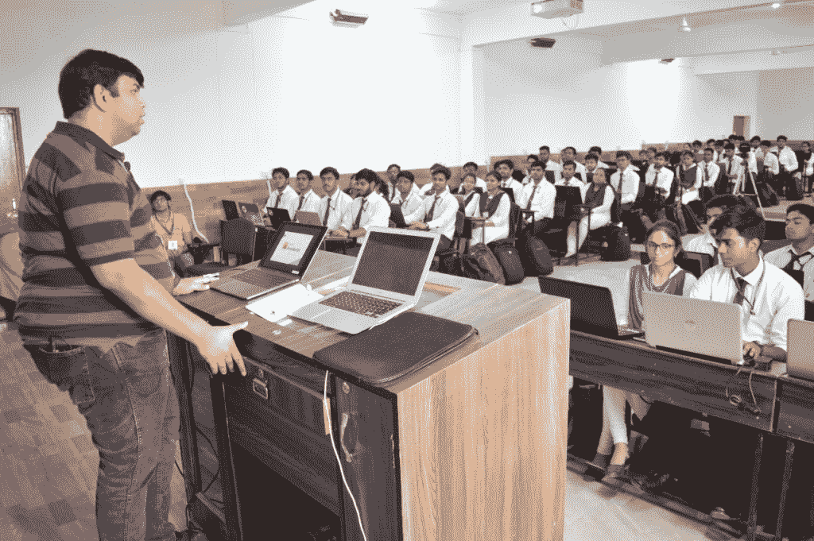
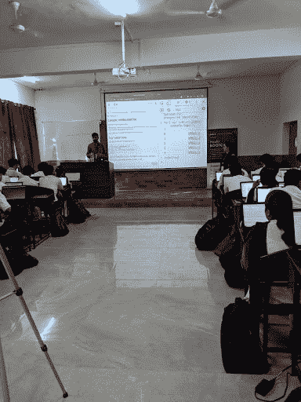
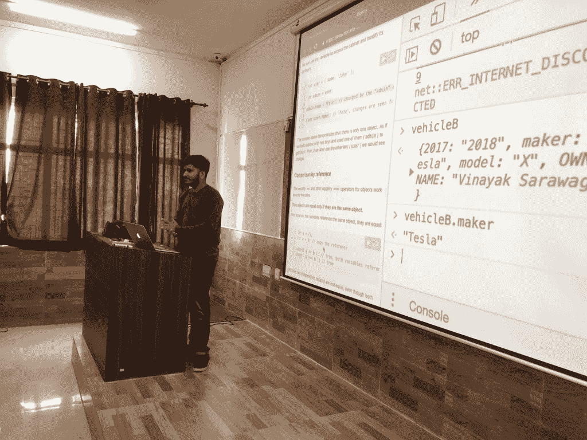
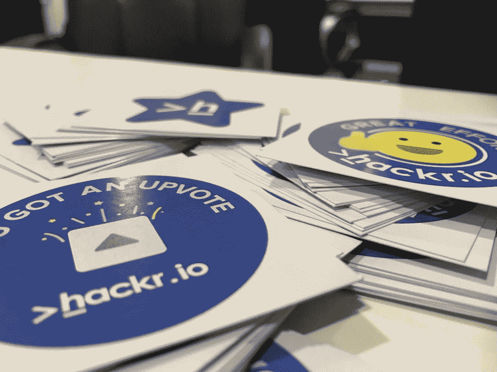
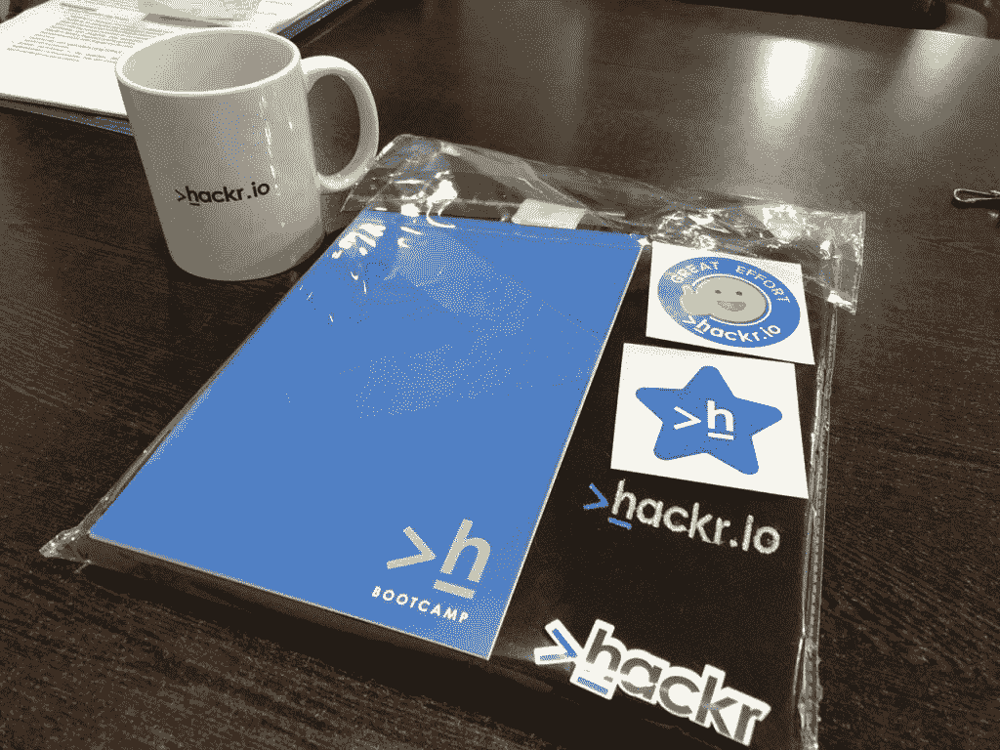
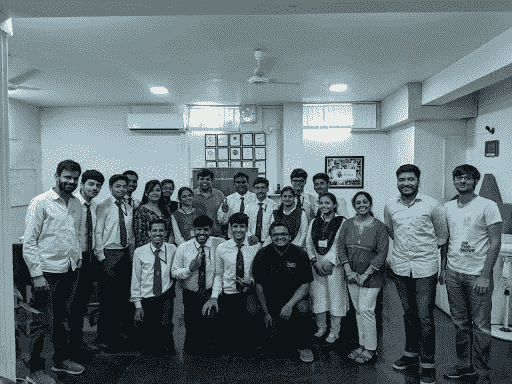

# 马图拉 GLA 大学 Hackr 训练营

> 原文：<https://hackr.io/blog/hackr-bootcamp-at-gla-university-mathura>

2019 年 6 月 7 日至 8 日，Hackr.io 在马图拉的 GLA 大学举办了首次为期两天的 Hackr 训练营。

训练营的任务是在初创公司和学生之间架起一座桥梁，在这里，崭露头角的人才会浮出水面，并被寻找聪明头脑的公司所认可。

参加 Hackr 训练营的都是即将进入大学最后一个学期或即将毕业的学生。这些学生需要一个能够理解他们的天赋、认识到它、定义它并给出最适合他们的方向的导师。

训练营课程让学生们为这个行业做好了准备，无论是满足现实世界中严格的最后期限，处理客户还是在团队中工作。Hackr Bootcamps 让学生们体验了真实世界的工作环境。

## 我们做得怎么样？

训练营议程

*   欢迎词 Hackr.io 创始人 Gaurav Gupta 的介绍
*   评估回合
*   动手实验室会议-第 1 天
    *   JS 简介| JS 分析| JS 需求市场研究
    *   基本 JS 编程
    *   项目-秘密消息传递
*   动手实验室会议-第 2 天
    *   回顾上一节课
    *   关于 JS 的高级主题
    *   项目费用经理&聊天机器人
    *   奖励&赞赏

### **第一天**

第一天以 Gaurav Gupta 的励志主题演讲开始，旨在激励孩子们将计算机科学作为职业，以及训练营将如何指导他们设计职业路线图。

对**的 450 多名学生进行了一轮书面评估，基于分析、逻辑和技术意识问题。从 450 多名学生中， **120 名** 入围了 **为期两天的 Hackr****

 **### **训练营**

训练营以 Gaurav Gupta 的 Javascript 互动介绍会开始。Gaurav 解释了为什么 Javascript 是趋势，为什么世界上所有的大公司都在生产中使用 JS 和 JS 框架。

会议的第二部分概述了 Javascript 的基本概念，由软件工程师 aa kash Yadav @ hackr . io 主讲。他讲解了 JS 编程的构建模块。

第一天结束时，所有学生都被分配了一个“秘密信息”项目。Aakash 首先演示了项目中要做什么，然后讨论了如何使用第一天解释的概念来完成。

学生们很兴奋能建造这个项目，并与他们的朋友分享秘密信息。这一天以完成项目的巨大热情结束，并期待着第二天会发生什么令人兴奋的工作。

当 Hackr 团队晚上睡觉的时候，项目提交开始蜂拥而至，持续了一整夜——凌晨 1 点..凌晨 2 点..凌晨 4 点！如此惊人的热情震撼了我们的头脑，让我们为训练营的第二天准备了更多的能量。

### **第二天**

第二天以更多的兴奋和活力开始，互相传递微笑和早上好，并希望在这一天有更多的乐趣。我们也很高兴看到第二天 100%的出席率！

Vinayak Sarawagi，软件工程师@ Hackr.io 回顾了前一天的情况，并将其提升到一个更高的层次，同时谈到:

*   JS 对象和本地存储
*   漫步大教堂
*   文档对象模型

下一个环节由 Swapnil Banga 主讲，他是高级软件工程师@ Hackr.io。他演示了一个聊天机器人，学生可以通过一个简单的聊天界面管理日常开支和储蓄。

Swapnil 和他的团队在指导和帮助学生解决问题的过程中，给了学生 3 个小时来构建聊天机器人。

我们很高兴地看到，大多数学生能够在 3 个小时内完成聊天机器人，很少有人在舞台上向所有观众展示他们的项目！

### **奖励&赞赏**

在整个环节中，学生对演讲者所提问题的每一个正确答案都获得了“支持票”,这激励了学生参与并回答更多的问题。整个车间的气氛绝对是电！

获得最高 Hackr Upvotes 的学生后来用他们的 upvots 兑换了这些令人敬畏的 Hackr 套件！

拥有最佳项目、最高票数、最佳简历以及在评估中表现突出的学生获得了“邀请函”,可以在招聘日前往古尔冈的 Hackr.io 办公室参加个人面试！

### **招聘日-6 月 12 日**

我们邀请了印度三家最知名的初创公司参加招聘日，以便能够与学生们进行一对一的互动，了解他们的能力和职业动机。

学生们被选中与这些正在重新定义体育和教育行业的创业公司一起工作。

| **3 放置在** | **3 放置在** | **2 放置在** |
|  |  |  |

### **训练营整体成功统计数据**

还有许多比萨饼..自拍...冷却..笑..幸福的...笑脸，我们有:

*   **450+** 参与者
*   **120** 入围训练营
*   **60**hacker boot camper 获得认证
*   **15** 入围招聘日
*   **8** 献诏赐

特别要感谢 Hackr.io 的人力资源经理 Ayushi Rathour，感谢他管理了整个活动并使其令人难忘。

### **人们对 Hackr Bootcamp 的看法**

*这里是如何领导、进取&有远见的组织的颠覆现状&开拓创新的方式来吸引人才。*——拉利特塞斯，GLA 大学。

## **Hackr Plus**

## 在 Hackr Bootcamp 取得巨大成功后，两天只是一个名为 **Hackr Plus** 的大画面的小预告片，在这里将为各种其他技术举办长期研讨会，包括 Python、React、Angular、机器学习、PHP、Javascript 以及类似 Hackr Bootcamp 的格式。

## Hackr Plus 将提供实用的实践学习，由最好的行业专家一对一指导，10 多个实践行业项目，代码评审 和大量评估和测验。

以下是快速洞察:

Hackr Plus will provide practical hands-on learning with With one to one mentoring from the best Industry Experts, 10+ Hands-on Industry projects with Code Reviews and lots of Assessment and Quizzes.

Here's quick insights:

[https://www.youtube.com/embed/IbgvfjZqZZU](https://www.youtube.com/embed/IbgvfjZqZZU)

VIDEO**If you are interested in knowing more about Hackr Bootcamps for your college or university, please email us on [bootcamp@hackr.io](mailto:bootcamp@hackr.io)****