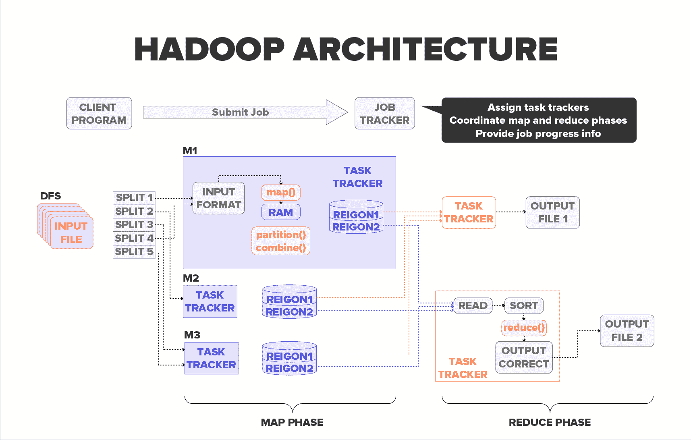
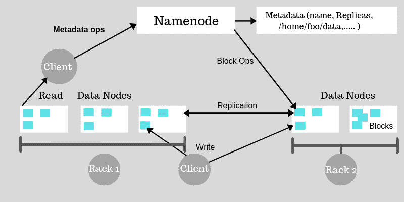
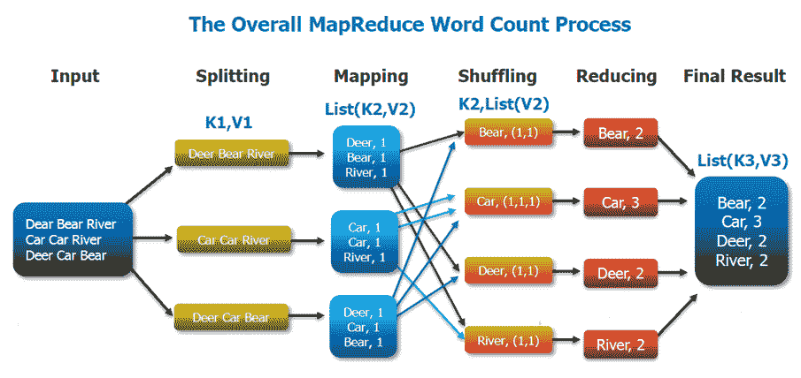
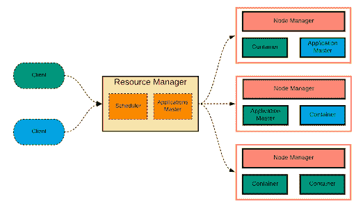

# Hadoop 架构:HDFS、Yarn 和 MapReduce - Hackr.io

> 原文：<https://hackr.io/blog/hadoop-architecture>

随着技术的快速变化，世界变得越来越信息化。据估计，仅在过去两年中，世界上就有大约 90%的数据库被创建。此外，80%的信息是非结构化的，并且可以通过变化很大的结构来访问，这使得对其进行分析的过程几乎是不可能的。

此外，问题并没有到此为止；随着大量数据的出现，最大的挑战是这些数据没有特定的排列或格式。它有文本、图片、视频、音频、GPS 跟踪细节、传感器记录等等。简而言之，它的非结构化数据！传统系统适用于有限的结构化数据集，但不适用于大量的非结构化数据，这就是 Hadoop 的用武之地。

Hadoop 提供了一种解决方案，可以处理、处理和组合大量的非结构化、结构化和半结构化数据，或者更准确地说是大数据。Hadoop 是大数据的解决方案。Hadoop 旨在利用大数据提供的可能性，并克服可能遇到的挑战。它是一个开源的、基于 Java 的编程框架，管理分布式或集群环境中大型数据集的处理。大数据室中的小象现已成为全球最受欢迎的大数据解决方案。

## **Hadoop 架构**

****

一个公平的 Hadoop 架构需要在网络、计算能力和存储方面进行多样化的设计考虑。它遵循主从架构来处理和分析大型数据集。在构建和设计 Hadoop 集群时，需要考虑以下因素:

### **1。Hadoop 分布式文件系统(HDFS)**

HDFS 是设计用于在商用硬件上运行的主要数据存储系统。它是一个分布式文件系统，可以轻松地在集群上运行以处理大数据。它在具有数千个节点的分布式系统上运行很少的应用程序，这些节点包含数 Pb 的信息。由于 HDFS 的这一特性，它具有高度的健壮性和容错性。它在多个位置存储数据，因此在任何存储位置出现故障的情况下，可以从另一个位置恢复数据，从而确保数据安全。它采用 NameNode 和 DataNode 结构来执行分布式文件系统，该文件系统可以跨高度可扩展的 Hadoop 结构提供非常高效和快速的数据访问。

### **2。Hadoop MapReduce**

传统系统过去使用中央服务器来检索和存储数据，只要数据是结构化的和小的，这是没问题的，但是随着数据的指数级增长，它的容纳对于标准数据库服务器来说是一个大问题。这个问题首先引起了谷歌的兴趣，因为他们的搜索引擎数据，由于互联网行业的革命，这些数据爆炸式增长。他们使用并行处理理论巧妙地解决了这个难题，并设计了一种叫做 MapReduce 的算法。它将任务分成小块，并将这些小块分配给通过网络连接的许多机器，并将所有事件集合起来形成最后的事件数据集。MapReduce 使用的基本信息单元是一个键值对。所有的数据，无论是否结构化，都需要在通过 MapReduce 模型之前转换成键值对。在 MapReduce 框架中，处理单元是数据的移动者，而不是将数据移动到处理单元。

### **3。又一个资源导航器(YARN)**

Apache Hadoop YARN 是开源 Hadoop 分布式处理框架中的作业调度和资源管理技术。Yarn 允许不同的数据处理引擎，如流处理、交互式处理以及批处理，来处理和执行存储在 HDFS (Hadoop 分布式文件系统)中的数据。它是 Hadoop 的核心[组件之一，将 Hadoop 的功能扩展到其他不断发展的技术，以便他们可以从当代技术世界最著名和最受欢迎的存储系统 HDFS 中受益。除了资源管理之外，YARN 是 Hadoop 2.x 的数据操作系统，还可以进行作业调度。它便于 Hadoop 处理除 MapReduce 之外的其他专用数据处理系统。它允许在部署 Hadoop 的同一硬件上处理多个框架。](https://hackr.io/blog/hadoop-ecosystem-components)

[终极动手 Hadoop:驯服您的大数据！](https://click.linksynergy.com/link?id=jU79Zysihs4&offerid=1045023.996228&type=2&murl=https%3A%2F%2Fwww.udemy.com%2Fcourse%2Fthe-ultimate-hands-on-hadoop-tame-your-big-data%2F)

尽管 Hadoop 在数据处理和计算方面非常精通，但它也有一些缺点，比如可扩展性问题、批处理延迟等。因为它依赖 MapReduce 来处理大数据集。有了 YARN，Hadoop 现在能够支持多种处理方法，并且有了更多的应用。Hadoop YARN 集群现在能够流式交互查询，并与 MapReduce 批处理作业并行运行数据处理。YARN framework 甚至可以在非 MapReduce 应用程序上运行，从而克服了 Hadoop 1.0 的缺点。******Hadoop 的优势**

1.  **可扩展:** Hadoop 是一个高度可扩展的存储平台，因为它可以在几个并行工作的经济型服务器上存储和分散大量数据集。相比之下，传统的[关系数据库系统](https://techterms.com/definition/rdbms) (RDBMS)无法处理大量数据。
2.  **经济高效:** Hadoop 同样为致力于数据集的组织提供了非常经济高效的存储解决方案。关系数据库管理系统的问题在于，为了处理如此巨大的数据量，扩展到如此大的规模会受到难以置信的成本限制。出于降低成本的最终目标，过去许多组织需要对数据进行降采样，并根据关于哪些数据最重要的某些假设对数据进行分组。原始数据将会被删除，因为保存这些数据成本太高。
3.  **适应性:** Hadoop 使组织能够毫不费力地访问新的数据源，并利用各种类型的数据(结构化和非结构化)从这些数据中创造激励。这意味着组织可以利用 Hadoop 从数据中获取有利可图的业务统计数据，例如社交媒体、电子邮件对话等。
4.  **Quick:** Hadoop 的一种存储方法依赖于一个分布式文件系统，该系统从根本上“映射”数据，无论数据位于群集的哪个位置。数据处理工具通常位于数据所在的同一台服务器上，从而大大加快了数据处理速度。如果您正在管理大量的非结构化数据，Hadoop 可以在几分钟内熟练地处理万亿字节的信息。
5.  **对故障的弹性:** 使用 Hadoop 的一个主要优势是它对内部故障的适应能力和容错能力。当数据被发送到单个节点时，该数据也被复制到群集中的其他节点，这意味着在出现故障时，有另一个副本可供使用。

**人也在读:**