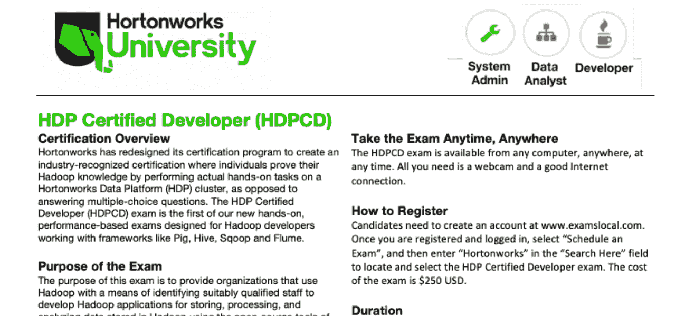
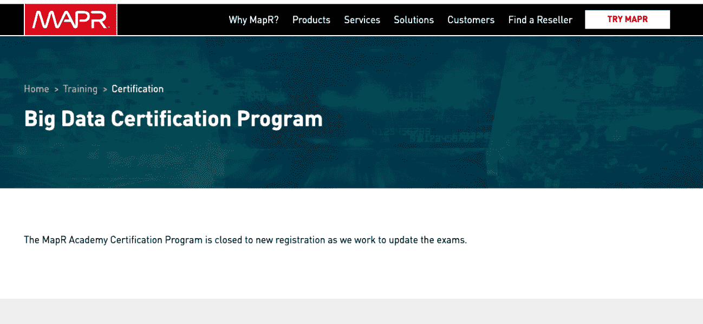
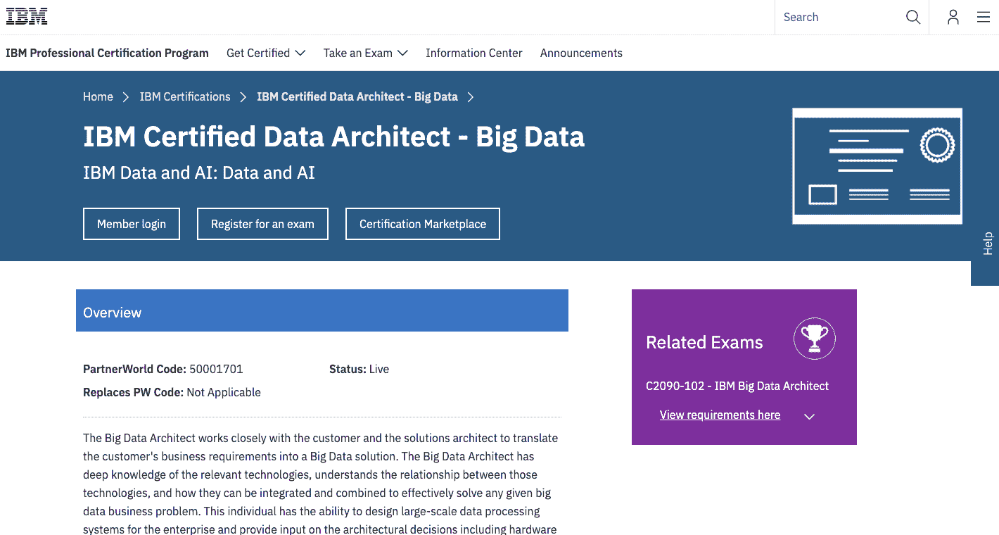
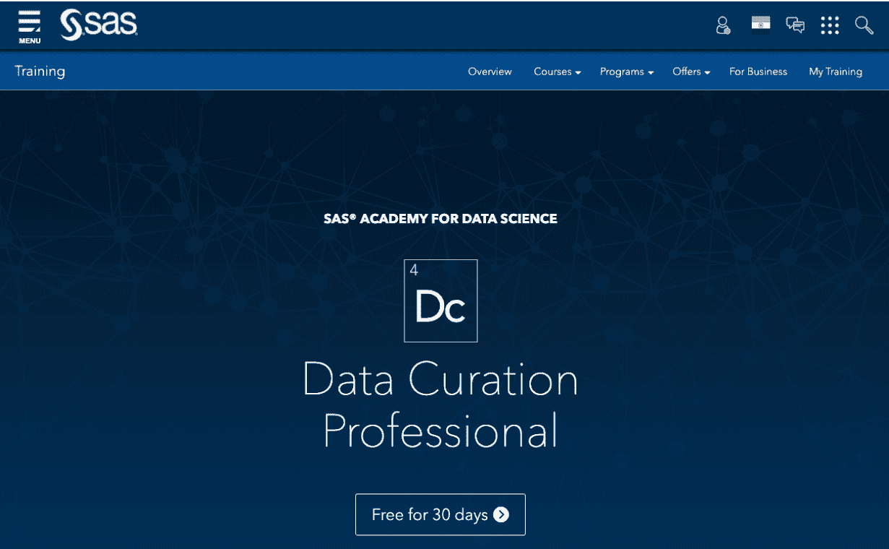

# 2023 年要选择的 5 个最佳 Hadoop 认证[更新]

> 原文：<https://hackr.io/blog/hadoop-certifications>

这和大数据一样吗？

拿到认证后哪个工作机会多？

如果以上是你想到的或别人问你的问题，那么你就是得到确切正确答案的正确地方。在本文中，我们将仔细阅读关于 Hadoop 和大数据的解释，并揭示哪一个更有工作潜力。

### **Hadoop 和大数据有什么区别？**

Hadoop 和大数据没有区别。Hadoop 认证的实际名称是大数据 Hadoop。这些名称作为同义词使用，但是与相同的课程和认证过程相关。

### **我们为什么需要大数据 Hadoop 认证？**

大数据 Hadoop 认证证明此人具备 IT 行业最需要的技能，即部署、使用和利用大数据 Hadoop。大数据 Hadoop 认证课程是针对 Hadoop 开发人员、Hadoop 管理员、Hadoop 测试以及使用 [Apache Spark](https://hackr.io/blog/what-is-apache-spark) 进行分析的培训课程的组合。

大数据是一种存储、分析和利用大量数据输入的新方法，跨国组织使用这些数据来制定政策和战略。这些庞大的数据输入有助于根据全球目标市场制定战略。根据大数据中更新和存储的输入，开发以客户为中心的产品，提供服务，并进行更改。云计算过程不提供巨大的数据存储空间，而且成本也很高。另一方面，大数据 Hadoop 是一种更便宜、更大的数据空间，在 IT 界需求量很大。

每一家跨国公司，如麦当劳、百胜餐饮集团、汉堡王、埃里克森、Cognizant、索尼、渣打银行、圣戈班、Cicso 和其他各种各样的公司，都在使用大数据来存储、分析和审查信息，然后为全球不同地区的企业制定组织政策和战略。

### **我将从大数据 Hadoop 培训和认证中学到什么？**

1.  您将学习和编写 Hadoop 和 YARN 的各种基础应用程序。
2.  学习概念和应用程序，如 Zookeeper、HBase、Oozie、Pig、Hive、MapReduce 等。
3.  能够在 Amazon EC2 上设置伪节点和多节点集群。
4.  学习使用 Avro 数据格式。
5.  熟练编写 Spark 应用程序，如 Spark、Spark SQL、Data Frame、GraphX、MLlib 和 Streaming。
6.  能够配置 ETL 工具，包括 Pig，Hive，MapReduce 和其他各种使用 Pentaho，Talend 工作的工具。
7.  应用 Hadoop 测试应用程序来使用 MRUnit 和各种其他自动化工具。
8.  通过使用 Hadoop 和 Apache Spark，您将能够处理各种实际的、真实的项目。

## **在线大数据 Hadoop 认证有哪些？**

在线大数据 Hadoop 认证包括以下内容:

Cloudera 已经获得 Hadoop 认证很多年了。它提供三种 Hadoop 认证，

1.  Cloudera 认证专业数据科学家(CCP DS)
2.  Hadoop 的 Cloudera 认证管理员(CCAH)
3.  Cloudera 认证 Hadoop 开发人员(CCDH)。

你可以在这里注册。

众所周知，Hortonworks 为他们感兴趣的个人特定和相关的工作职位提供 Hadoop 认证。他们提供认证，即:

1.  Hortonworks 认证的 Apache Hadoop 开发人员(HCAHD)
2.  Hortonworks 认证 Apache Hadoop 管理员(HCAHA)

你可以在这里注册。

MapR Hadoop 认证通过在候选人中测试高级集群知识和技能，提供特定于行业的 Hadoop 认证。提供的认证有:

1.  MapR 认证 Hadoop 开发人员(MCHD)
2.  MapR 认证 Hadoop 管理员(MCHA)
3.  MapR 认证 HBase 开发人员(MCHBD)

你可以在这里注册。

IBM Hadoop 认证附带 Hadoop 培训和实时行业项目，需要通过这些项目才能获得认证。候选人通过了应用 Hadoop 工具和概念的深入知识的高级知识、技能和培训流程的验证。IBM Hadoop 认证的最大好处是它没有有效期。这意味着你不必每两年进行一次又一次的测试。认证的名称是:

1.  IBM 大数据架构师认证。
2.  IBM 大数据工程师认证。

你可以在这里注册。

SAS 以提供分析认证而闻名。他们的认证具有很高的成本效益，并由高度专业和经验丰富的教师提供课程支持。SAS 的认证包括:

1.  使用 SAS 9 认证的大数据专家。
2.  使用 SAS 9 认证的高级分析专家。

你可以在这里注册。

### **大数据 Hadoop 认证的前提条件是什么？**

大数据 Hadoop 认证的先决条件包括:

1.  学生必须是在这个领域有相关经验的编程开发人员和系统管理员。
2.  学生应具备专业背景、知识、技能，并担任过项目经理，具有使用大数据 Hadoop 的相关经验。
3.  作为开发人员，学生应该能够应用大数据 Hadoop 的功能，包括测试、管理和分析。
4.  学生应该是分析专家。
5.  需要商业智能和数据仓库方面的知识。
6.  候选人可能是研究生或本科生，但对学习大数据有奉献精神和承诺。
7.  UNIX、SQL 和 JAVA 的基础知识有助于快速学习大数据 Hadoop。

### **获得大数据 Hadoop 认证的专业人士所获得的工作岗位数据是怎样的？**

1.  根据 Allied Market Research 的研究，预计在未来两年内，全球大数据 Hadoop 市场将增长至 846 亿美元。
2.  据 Indeed 观察，Hadoop 管理员的平均工资为 123，000 美元，Hadoop 开发人员的平均工资为 100，000 美元，Hadoop 架构师的平均工资为 172，000 美元。对于一个 IT 新手来说，这是最高的薪水。
3.  最后，IBM 报告指出，美国数据专业人员预计每年将增加 270 万个工作岗位。

### **要获得大数据 Hadoop 认证方面的专业知识，需要学习哪些课程内容？**

大数据 Hadoop 认证的课程内容包括:

1.  Hadoop 安装和设置。
2.  大数据 Hadoop 简介。
3.  深入了解 MapReduce。
4.  蜂巢简介。
5.  关于蜂巢和黑斑羚的高级学习
6.  猪的介绍。
7.  关于 PIG 的高级学习，包括 Flume、Sqoop 和 HBase。
8.  Scala 写的 Spark 应用程序。
9.  关于 Spark 框架的高级学习
10.  火花中的 RDD。
11.  了解 Spark SQL 和数据框架。
12.  将结果与 Apache Flume 和 Apache Kafka 集成

## **最受欢迎的大数据 Hadoop 认证类型有哪些？**

大数据 Hadoop 认证有五种最受欢迎的类型。这些情况说明如下:

### **1。大数据 Hadoop 开发者证书**

该认证旨在验证候选人在 Spark SQL 查询和 Spark 流处理过程中的能力和技能。

该认证的特点是:

| 考试模式 | 它由 8 到 12 项基于绩效的任务组成 |
| 持续时间 | 2 小时 |
| 通过考试所需的分数 | 70% |
| 认证考试的语言 | 英语 |
| 认证费用 | 295 美元 |
| 先决条件 | 能够使用 Spark SQL 以编程语言与元存储进行交互，使用应用程序进行数据分析。 |

### **2。数据分析师**

该认证验证候选人的数据处理能力。它测试的是数据准备、非结构化数据格式化以及之后使用最新工具和技术进行数据分析的技能。考试的特点是:

| 考试模式 | 它由 8 到 12 项基于绩效的任务组成 |
| 持续时间 | 2 小时 |
| 通过考试所需的分数 | 70% |
| 认证考试的语言 | 英语 |
| 认证费用 | 295 美元 |
| 先决条件 | 能够准备数据，为数据提供结构，并在 Hive 和 Impala 中应用查询语言语句作为数据分析技能的一部分。 |

### **3。数据管理员**

该认证验证了候选人在核心系统和集群管理员技能方面的知识，这是处理当今业务流程不断变化的虚拟需求所必需的。考试的特点是:

| 考试模式 | 它由 8 到 12 项基于绩效的任务组成 |
| 持续时间 | 2 小时 |
| 通过考试所需的分数 | 70% |
| 认证考试的语言 | 英语 |
| 认证费用 | 295 美元 |
| 先决条件 | 能够安装生态系统项目、配置 NameNode HA、ResourceManager HA 以及管理、保护、测试和故障排除数据。 |

## **与 Hadoop 相关的课程项目有哪些？**

有各种各样的课程项目可供选择，您需要努力学习以获得 Hadoop 方面的技能。其中包括:

1.  MapReduce、Sqoop 和 Hive 上的项目。
2.  电影镜头数据项目。
3.  Hadoop YARN 和端到端概念验证项目。
4.  Hive 中的表分区项目。
5.  将 Pentaho 与 Hadoop 生态系统连接起来的项目
6.  多节点集群设置项目。
7.  使用 MRUnit 的 Hadoop 测试项目
8.  Hadoop 维护项目。
9.  Hadoop web 日志分析项目
10.  Twitter 情绪分析项目等等

[Hadoop 的终极实践:驯服您的大数据！](https://click.linksynergy.com/link?id=jU79Zysihs4&offerid=1045023.996228&type=2&murl=https%3A%2F%2Fwww.udemy.com%2Fcourse%2Fthe-ultimate-hands-on-hadoop-tame-your-big-data%2F)

## **结论**

总之，大数据 Hadoop 认证是 IT 行业需要的最佳认证。它将确保你有一个稳定的职业生涯，并为你在知名的 It 组织中的职业发展提供巨大的机会。认证过程非常经济高效，并有课程支持，帮助您从行业专业人士那里学习并获得所需的知识和技能。你将获得终身访问权，并在你的证书中获得一张王牌，这将帮助你在世界任何地方你选择的著名 IT 公司找到一份理想的工作。

如果你有任何问题或疑问，请在下面的评论中回复。

**人也在读:**