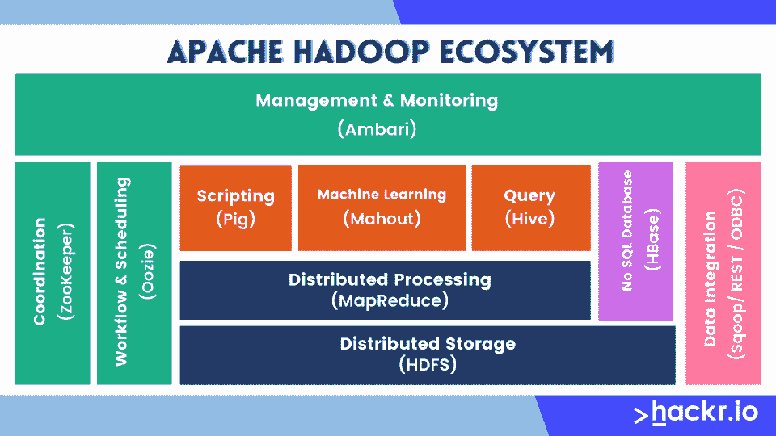
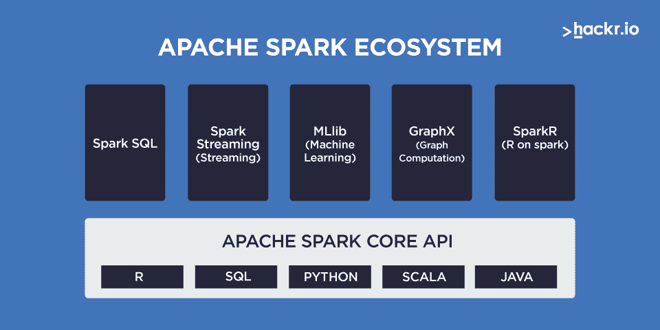

# Hadoop vs Spark:2023 年势均力敌

> 原文：<https://hackr.io/blog/hadoop-vs-spark>

您是否想知道对大数据使用哪个框架？这种 Hadoop 与 Spark 的比较将使您清楚哪个最适合您的需求。

互联网导致了海量数据的不断产生，这就是众所周知的大数据。这些结构化和非结构化形式的数据是从社交网络、物联网(IoT)和传统交易业务等主要来源生成的。

分布式计算促进了大数据的新一代数据管理，是硬件和软件技术的革命性创新。分布式数据处理有助于存储、处理和访问这种高速、大容量和多种多样的数据。

随着分布式计算在大数据生态系统中占据主导地位，两个强大的产品 Apache Hadoop 和[Spark](https://spark.apache.org/)-变得非常重要。有了 Hadoop 和 Spark，大数据管理专业人员的生活变得轻松多了。但是为什么和如何？

我们先来看看 Hadoop 和 Spark 是什么，Hadoop 和 Spark 的关键区别，在头对头的比较中哪个更好。

## Hadoop 与 Spark:面对面的比较

下面的表格总结了 Hadoop 和 Spark 之间的差异，以及一些相似之处。

| 特征 | Hadoop | 火花 |
| 开放源码 | 是 | 是 |
| 容错 | 是 | 是 |
| 数据集成 | 是 | 是 |
| 速度 | 低性能 | 更高的性能(快 100 倍) |
| 易用性 | 冗长的代码，缓慢的开发周期 | 更快的开发周期 |
| 应用 | 成批数据处理 | 实时和批量数据处理 |
| 潜伏 | 高的 | 低的 |
| 开发者社区支持 | 是 | 是 |
| 费用 | 降低总拥有成本 | 更高的总拥有成本 |
| 内存消耗 | 基于磁盘的 | 基于 RAM 的 |

## 什么是 Hadoop 框架？

Apache Hadoop 软件库是一个框架，用于使用简单的编程模型跨计算机集群分布式处理大型数据集。它旨在从一台服务器扩展到数千台机器，每台机器都提供本地计算和存储。

该框架本身不是依赖硬件来提供高可用性，而是设计用于检测和处理应用层的故障。简单来说，Hadoop 在一个计算机集群之上提供了一个高度分布式的处理服务。

以下是主要的 [Hadoop 组件](https://hackr.io/blog/hadoop-ecosystem-components):

*   Hadoop Common:支持其他 Hadoop 模块的公共工具
*   Hadoop 分布式文件系统(HDFS):Hadoop 应用程序使用的主要数据存储。它是一个分布式文件系统，提供对应用程序数据的高吞吐量访问。
*   Hadoop YARN:作业调度和集群资源管理框架
*   Hadoop MapReduce:基于 YARN 的大数据集并行处理系统
*   Hadoop Ozone:Hadoop 的对象存储
*   Hadoop 潜水艇:Hadoop 的机器学习引擎

## 什么是 Spark 框架？

Apache Spark 是一个通用的分布式数据处理框架，其核心引擎适用于各种计算环境。在 Spark 核心之上，有 SQL、机器学习、图形计算和流处理的库，它们可以在一个应用程序中一起使用。弹性分布式数据集(RDD)是 Spark 的基本数据结构。

[Spark 支持的编程语言](https://hackr.io/blog/best-programming-languages-to-learn)包括 Java、Python、Scala 和 r，应用程序开发人员和数据科学家将 Spark 集成到他们的应用程序中，以快速查询、分析和转换大规模数据。Spark 最常见的任务包括跨大型数据集的 ETL 和 SQL 批处理作业，处理来自传感器、物联网或金融系统的流数据，以及机器学习任务。

两者都来自 Apache 产品架。那么是什么为 Apache Spark 铺平了道路呢？Apache Hadoop MapReduce 是一个极其著名且广泛使用的执行引擎。然而，用户一直抱怨 Hadoop MapReduce 的高延迟问题，指出这些实时应用程序的批处理模式响应在处理和分析数据时很慢。

这导致了 Spark，一个比 Hadoop MapReduce 更强大、更灵活的后继系统。

Spark 可以运行在 Hadoop、Apache Mesos、Kubernetes 上，可以独立运行，也可以运行在云中。它可以访问各种数据源，包括 HDFS、Alluxio、Apache Cassandra、Apache HBase、Apache Hive 和数百个其他数据源

### Hadoop 比 Spark 好吗？

这两者协同工作，因此 Hadoop 是否优于 Spark 的问题有些悬而未决。大多数时候，Spark 会在 Hadoop 集群上运行。

但是，在某些情况下，您可能希望明确地选择一个而不是另一个。例如，如果内存不足或只是一个较旧的集群，您可能希望选择 Hadoop。

### Spark 和 Hadoop 是一样的吗？

不，它们不是，尽管它们都是大数据框架，尽管 Spark 属于 Hadoop。

Hadoop 允许您通过跨计算机集群的分布式计算来管理大数据。Spark 帮助您处理这些计算机上的数据。

### Spark 是否正在取代 Hadoop？

不，但 Spark 在行业中找到了更多的用途，因为它取代了 Hadoop 的 MapReduce 功能。Spark 运行在 Hadoop 之上，两者都有特定的目的，它们以各自的成功程度实现不同的目标。

### 为什么 Spark 比 Hadoop 快？

Spark 在内存上理论上快 100 倍，在磁盘上快 10 倍。它比 Hadoop 的 MapReduce 更快，因为它在 RAM 中进行处理，减少了读写操作。

### Spark 需要 Hadoop 吗？

Sparkdocumentation 说 Spark 可以在没有 Hadoop 的情况下运行。您可以在没有任何资源管理器的情况下以独立模式运行它。但是如果你想在一个多节点系统中运行，你需要一个像 YARN 或 Mesos 这样的资源管理器和一个像 HDFS 或 S3 这样的分布式文件系统。

## Hadoop vs Spark:哪个更好？

现在我们知道了 Hadoop 和 Spark 的基本原理，让我们来看看哪个在各个方面优于另一个。

### 1.开源- Tie

Hadoop 和 Spark 都是 Apache 产品，都是可靠的可扩展分布式计算的开源软件。

### 2.容错- Tie

故障是指失败，Hadoop 和 Spark 都是容错的。即使集群中的一个节点出现故障，Hadoop 系统也能正常运行。容错主要通过使用数据复制和心跳消息来实现。rdd 是 Apache Spark 的构建块，并且在其中提供容错。

### 3.数据集成- Tie

企业中不同系统产生的数据很少足够清晰或一致，无法简单方便地组合起来进行报告或分析。提取、转换和加载(ETL)过程通常用于从不同的系统中提取数据，对其进行清理和标准化，然后将其加载到单独的系统中进行分析。

Spark 和 Hadoop 都用来降低这个 ETL 过程所需的成本和时间。

### 4.速度火花获胜

Spark 运行工作负载的速度比 Hadoop 快 100 倍。Apache Spark 使用最先进的 DAG 调度程序、查询优化器和物理执行引擎，为批处理和流数据实现了高性能。Spark 是为速度而设计的，既可以在内存中运行，也可以在磁盘上运行。

一个经典的速度对比是，Data bricks 团队能够在十分之一的机器上仅用 23 分钟处理存储在固态驱动器上的 100 数据。前一名获胜者使用 Hadoop 和不同的集群配置花费了 72 分钟。

但是，如果 Spark 在带有其他共享服务的 YARN 上运行，性能可能会下降，并导致 RAM 开销内存泄漏。出于这个原因，如果用户有批处理的用例，Hadoop 被认为是一个更高效的系统。

### 5.易用性- Spark 胜出

Hadoop MapReduce 代码相对较长。在 Spark 中，你可以用 Java、Scala、Python、R 和 SQL 快速编写应用。Spark 提供了 80 多种高级操作符，可以轻松构建并行应用程序，您可以从 Scala、Python、R 和 SQL shells 中交互使用它。

Spark 的功能可以通过一组丰富的 API 来访问，所有这些 API 都是专为快速轻松地与大规模数据交互而设计的。这些 API 都有很好的文档和结构，使得数据科学家和应用程序开发人员可以直接快速地将 Spark 投入使用。

### 6.一般用法- Spark Wins

在 Hadoop MapReduce 的情况下，只能处理一批存储的数据。但是使用 Spark，也可以通过 Spark 流实时修改数据。

借助 Spark Streaming，您可以通过各种软件功能传递数据——例如，在收集数据时执行数据分析。开发人员还可以利用 Apache Spark 进行图形处理，它可以映射各种实体(如人和对象)之间的数据关系。组织可以利用 Spark 和预定义的[机器学习库](https://hackr.io/blog/best-machine-learning-libraries)，以便可以对存储在不同 Hadoop 集群中的数据执行机器学习。

Spark 支持一系列库，包括 SQL 和 DataFrames、用于机器学习的 MLlib、GraphX 和 Spark Streaming。您可以在同一个应用程序中无缝地组合这些库。

### 7.延迟-火花胜出

Hadoop 是一个没有交互模式的高延迟计算框架，而 Spark 是一个可以交互处理数据的低延迟框架。

### 8.支撑结

由于是开源的，Hadoop 和 Spark 都有大量的支持。Apache Spark 社区是一个大型的、活跃的国际性社区。

越来越多的商业提供商，包括 Databricks、IBM 和所有主要的 Hadoop 供应商，为基于 Spark 的解决方案提供全面的支持。

提供大数据 Hadoop 解决方案的顶级供应商有 Cloudera、Hortonworks、Amazon Web Services Elastic MapReduce、Microsoft、MapR 和 IBM InfoSphere Insights。

### 9.成本 Hadoop 胜出

Hadoop 和 Spark 都是 Apache 开源项目，所以它们是免费的。唯一增加的成本是与基础设施相关的成本。这两种产品都设计成可以在低 TCO(总拥有成本)的商用硬件上运行。然而，Spark 的成本仍然较高。

### 10.内存消耗- Tie

Hadoop 中的存储和处理是基于磁盘的，Hadoop 使用标准的内存量。对于 Hadoop，我们需要大量的磁盘空间以及更快的磁盘。Hadoop 还需要多个系统来分配磁盘 I/O。

由于 Apache Spark 的内存处理，它需要大量的内存。由于多个 RAM 单元相对昂贵，火花系统导致更高的成本。

换句话说，Spark 可能更快，但会产生更高的成本。这就是权衡。

[Hadoop 的终极实践:驯服您的大数据！](https://click.linksynergy.com/link?id=jU79Zysihs4&offerid=1045023.996228&type=2&murl=https%3A%2F%2Fwww.udemy.com%2Fcourse%2Fthe-ultimate-hands-on-hadoop-tame-your-big-data%2F)

## Hadoop 和 Spark 对于大数据都至关重要

那么，Spark 和 Hadoop 哪个更好呢？

事实是，Hadoop 和 Spark 并不相互排斥，可以协同工作。没有 Spark，Hadoop 中的实时和更快的数据处理是不可能的，而后者不需要 Hadoop 集群来工作。

另一方面，Spark 没有用于分布式存储的文件系统，但它可以读取和处理来自其他文件系统的数据，例如 HDFS。然而，在 Hadoop (HDFS + YARN)上运行 Spark 有很多优势，但这不是强制性的。

当前的趋势和来自用户反馈的报告支持内存技术，这意味着 Apache Spark 通常是首选。

然而，这并不是非黑即白的，你会选择一个而不是另一个。如果你要学习大数据框架，你会想两者都学。

**人也在读:**