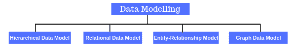
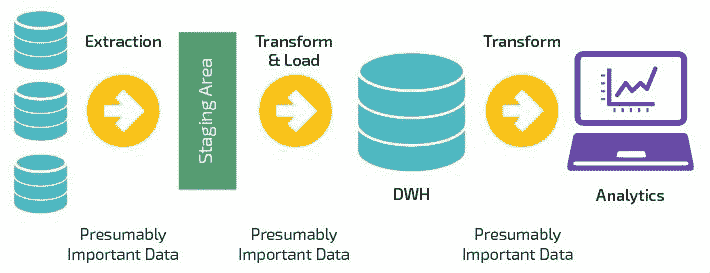
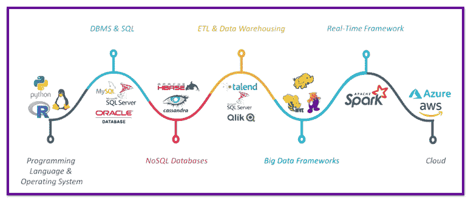

# 如何成为一名数据工程师？-谁是数据工程师？

> 原文：<https://hackr.io/blog/how-to-become-a-data-engineer>

## **谁是数据工程师？**

每个数据驱动的业务都需要一个用于[数据科学和数据分析](https://hackr.io/blog/data-science-vs-data-analytics)管道的框架。负责构建和维护这个框架的人被称为数据工程师。这些工程师负责服务器和应用程序之间的不间断数据流。

因此，数据工程师为大规模数据密集型应用程序的数据接收、处理和部署构建、测试和维护数据结构和架构。

数据工程师通过数据可视化和讲述故事与数据架构师、数据分析师和数据科学家协同工作。数据工程师最重要的角色是设计、开发、建造、安装、测试和维护完整的数据管理和处理系统。

那么他们到底是做什么的呢？他们创建了一个框架，使数据可供数据科学家和分析师使用，以便他们可以使用数据从中获得洞察力。所以，数据工程师是数据系统的建设者。

### **数据工程师的职责**

#### **管理**

数据工程师通过创建最佳数据库、实施模式变更以及维护所有企业数据库的数据架构标准来管理这一职位。数据工程师还负责实现不同服务器和不同数据库之间的数据迁移，例如，从 SQL 服务器到 MySQL 的数据迁移。他还根据系统需求和用户需求定义和实现数据存储。

#### **系统设计**

数据工程师应该始终构建一个可伸缩、健壮和容错的系统。因此，系统可以在不增加数据源数量的情况下进行扩展，并且可以处理大量数据而不会出现任何故障。例如，想象一下这样一种情况，一个数据源增加了一倍或两倍，但是系统无法扩展，因此构建一个系统来接收大量数据将花费更多的时间和资源。大数据工程师在这里有一个角色:他们处理提取转换和加载流程，这是如何处理收集的原始数据并将其转换为可供分析的数据的蓝图。

#### **分析**

数据工程师对存储在企业数据库中的数据进行特别分析，并编写 SQL 脚本、存储过程、函数和视图。他负责排除企业内部和企业之间的数据问题，并提出这些问题的解决方案。数据工程师主动分析和评估企业的数据库，以确定和建议改进和优化。他准备关于业务数据库状态和健康的活动和进度报告，这些报告随后提交给高级数据工程师进行审查和评估。此外，数据工程师分析复杂的数据系统和元素、相关性、数据流和关系，以便为概念性的物理和逻辑数据模型做出贡献。

其他一些职责还包括改进基础数据程序，将新的数据管理技术和软件集成到现有系统中，以及构建数据收集管道，最后还包括性能调整和提高整个系统的效率。

数据工程师被认为是数据仓库的“图书管理员”，负责对元数据进行编目和组织，定义从数据仓库中归档或提取数据的过程。如今，元数据管理和工具已经成为现代平台的重要组成部分。

### **数据工程师的目标**

#### **开发数据管道**

该技能集涉及将数据从一个点传输到另一个点。换句话说，从操作系统中获取数据，然后将其移动到分析师或数据科学家可以分析的地方，从而实现管理表和数据集的下一个目标。

#### 管理表格和数据集

通过管道传输的数据填充了某种类型的表集，然后由分析师或数据科学家用来从数据中提取他们所有的见解。分析任何产品的信息，例如，一个博客网站的问题，如人们在读什么？他们是怎么读的？他们在特定文章上停留的时间。

#### 设计产品

数据工程师最终在理解用户希望从大型数据集获得什么方面扮演了重要角色。考虑开发时用户在使用产品时可能会遇到的问题。例如，开发仪表板，人们将如何使用仪表板？还有哪些功能可以添加，有多牵强。

## **成为数据工程师所需的概念技能**

数据工程中最需要的技能是设计和构建数据仓库的能力，在数据仓库中收集、存储和检索所有的原始数据。如果没有数据仓库，数据科学家做的所有工作都将过时。要么太贵，要么规模太大。但是，还需要其他技能:

### **1。数据建模**

数据模型是数据科学管道的重要组成部分。它是将复杂软件系统设计的文档转换为可以理解的图表的过程，使用文本和符号来表示数据流。数据模型是在项目的分析和设计阶段构建的，以确保完全理解新应用程序的需求。这些模型也可以在数据生命周期的后期调用，以使最初由程序员临时创建的数据设计合理化。

#### **数据建模阶段**

*   **概念性:**这是数据模型处理的第一步，它在数据与实体的关系中对数据施加逻辑顺序。
*   **逻辑:**逻辑建模过程试图通过将离散的实体、基本值和关系建立成逻辑结构来强加秩序。
*   **物理:**这一步将数据分解成数据存储所需的实际表、簇和索引。

**分层数据模型**:这种数据模型以树状结构排列，一对多的排列标志着这些努力，已经取代了基于文件的系统。例如 IBM 的信息管理系统(IMS ),该系统在像银行这样的商业中得到广泛应用。

关系数据模型:它们取代了层次模型，因为与基于文件的系统相比，它降低了程序的复杂性，也不需要开发人员定义数据路径。

**实体-关系模型**:与关系模型密切相关，这些模型使用图表和流程图来图形化地说明数据库的元素，以便于理解底层模型。

**图形数据模型**:层次模型的高级版本，与图形数据库一起用于描述数据集内的复杂关系。

### 2.自动化

各行业使用自动化来提高生产率、改善质量和一致性、降低成本和加快交付速度。它为组织中的每个团队成员提供了更大的好处，包括测试人员、质量分析师、开发人员，甚至商业用户。

自动化可以提供以下好处:

*   速度:它很快，因此极大地减少了团队开发时间。
*   **灵活性**:快速轻松地响应不断变化的业务需求。
*   y:自动化工具产生经过测试的高性能、完整且可读的代码。
*   一致性:开发者很容易理解另一个人的代码。

在数据科学中，设计数据仓库和数据仓库体系结构需要很长时间才能完成，而且半自动化的步骤会导致数据仓库的局限性和不灵活性。因此，数据工程师想出了一个解决方案来自动化数据仓库，包括其生命周期中的每一步，从而减少管理数据仓库所需的工作。随着数据仓库自动化(DWA)工具消除了规划、设计、构建和记录决策支持基础设施的手工编码和定制设计，对数据工程师实施这些工具的需求正在增长。

### 3.提取、转换和加载(ETL)

ETL 被定义为将数据从一个或多个源复制到目标系统的过程，目标系统以不同于源的方式或在不同于源的上下文中表示数据。ETL 常用于数据仓库。

数据提取是从异构或同质源中提取数据的概念；数据转换通过清理数据并将其转换为适当的存储结构来处理数据，以便进行查询和分析，最后，数据加载描述了将数据插入到最终目标数据库中，如操作数据存储、数据集市、数据湖或数据仓库。

在数据科学中，ETL 涉及从 MySQL 或 Oracle 等操作系统中提取数据，并将其移动到 SQL server 等数据仓库或 Hadoop 或 RedShift 等现代数据仓库中，然后以分析师可以获取的方式对其进行格式化。最终，ETL 过程从分析数据层开始，分析数据层不仅仅是提取数据，它还执行聚合数据、对数据运行指标和算法等操作，以便可以轻松地将数据输入到未来的仪表板中。

[Azure Databricks &面向数据工程师的 Spark Core(Python/SQL)](https://click.linksynergy.com/link?id=jU79Zysihs4&offerid=1045023.4182538&type=2&murl=https%3A%2F%2Fwww.udemy.com%2Fcourse%2Fazure-databricks-spark-core-for-data-engineers%2F)

### 4.产品理解

数据工程师将数据视为他们的产品，因此数据是以用户可以使用的方式制造的。如果我们为机器学习工程师或数据科学家建立数据集，我们需要了解他们将如何使用它，他们想要建立什么模型，是否在客户级别提供了足够的信息。这是必需的，因为数据工程师在粒度上观察事物，并且自己聚集事物。

## **成为数据工程师**

1.  **编程语言**:从[开始学习编程](https://hackr.io/blog/how-to-learn-programming)语言，比如 Python，因为它有清晰可读的语法、多功能性、广泛可用的资源和非常支持的社区。
2.  **操作系统**:建议掌握至少一种操作系统，如 Linux 和 UNIX 操作系统，RHEL 是业界普遍采用的操作系统，也可以学习。
3.  **DBMS** :提高你的 DMBS 技能，获得至少一个关系数据库的实践经验，最好是 MySQL 或 Oracle DB。精通数据库管理员技能，以及容量规划、安装、配置、数据库设计、监控安全性、故障排除(如数据备份和恢复)等技能。
4.  **NoSQL** :这是下一个需要关注的技能，因为它会帮助你理解如何处理半结构化和非结构化数据。
5.  **ETL** :理解使用 ETL 和数据仓库工具从各种来源提取数据。根据用户转换和清理数据，然后将数据加载到数据仓库中。这是数据工程师必须具备的一项重要技能。由于我们正处于数据是 21 世纪燃料的革命时代，各种数据源和众多技术在过去二十年中得到了发展，其中主要的是 NoSQL 数据库和大数据框架。
6.  **大数据框架**:大数据工程师需要学习多个大数据框架来创建和设计处理系统。
7.  **实时处理框架**:专注于学习 Apache Spark 之类的框架，这是一个用于实时处理的开源集群计算框架，当涉及到实时数据分析时，Spark 是所有解决方案的首选工具。
8.  **云**:在职业道路的下一步，你必须学习云，这将是一大优势。对云技术的良好理解将提供稳定大量数据的选项，并允许大数据进一步可用、可扩展和容错。

**人也在读:**