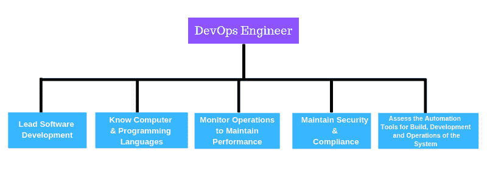
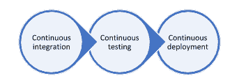
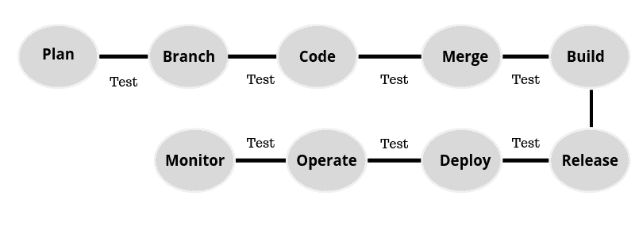

# 如何成为 DevOps 工程师？

> 原文：<https://hackr.io/blog/how-to-become-a-devops-engineer>

软件开发周期包括许多步骤，需要时间。DevOps 是一种实践，旨在减少完成软件开发周期所需的时间。DevOps 的关键是“自动化”。DevOps 实践与敏捷和持续交付方法学配合得很好，使得软件可以在很短的时间内发布。随着 DevOps 的使用，在系统交付、创造力和知识方面有了持续的改进。因此，软件开发人员可以使用这些实践来实现更多的增长。

## **如何成为 DevOps 工程师**

虽然 DevOps 是一种实践，但它现在经常被用作一种职称，因为它涉及到软件开发生命周期各个阶段的知识。

DevOps 是 Dev(开发)和 Ops(运营)的组合术语。DevOps 实践的一些好处是

*   产品或软件随时准备推向市场。
*   有更快的反馈和改进
*   吞吐量更好
*   涉及的风险较小

### **devo PS 工程师的角色和职责**

在我们进入如何成为一名 DevOps 工程师之前，我们应该清楚 DevOps 工程师是做什么的。就像软件工程师一样，DevOps 工程师可以为应用程序创建代码，但是，DevOps 工程师还会在开发代码后，将构建、部署和操作作为一个连续的自动化过程来处理。他们与业务人员协同工作，管理整个工作流程，通过将软件与自动化流程集成来使软件工作。

许多日常工作都与构建和部署、将结果传达给各自的团队、自动化和配置相关。然而，如果需要的话，需要[编程](https://hackr.io/blog/what-is-programming)来弥合开发和运营团队之间的鸿沟。

### **成为 DevOps 工程师所需的技能组合**

要成为一名 DevOps 工程师，有些技能是必须具备的。不要被长长的清单淹没，你不需要一次拥有所有的技能，而是可以通过经验获得一些技能。你可以从其中的一两个开始

#### **编程知识**

DevOps 工程师职位的竞争和同行压力总是很大，如果你必须保持领先，你就必须付出额外的努力。学习一些编码语言，比如 Python、Java、Ruby 或类似的语言，会让你处于一个比仅仅是网络或 IT 人员更好的位置。如果需要，您将能够调试大量代码，解决构建和部署错误，这样开发生命周期就不必在开发和部署之间来回切换，从而节省时间和资源。由于大多数流程，如服务器触发、应用程序安装、配置、验证等都是自动化的，DevOps 工程师肩负着平稳运行和填补空白的巨大责任。编程知识可以应用于构建工具，这将有助于各种过程的自动化。

#### **了解系统管理员了解的内容**

系统管理员有很多事情要做。他每天负责构建、部署、测试、调试和修复服务器。他定期检查系统的健康状况，并解决关键问题。此外，DevOps 专业人员应致力于自动化服务器和基础架构部署流程中最重要的部分。这是 DevOps 工程师最重要的技能之一。

#### **网络和存储**

由于 DevOps 专业人员处理大量的服务器、连接、数据和存储，他们应该能够管理网络问题。这意味着他们应该了解 IT 网络和存储概念。基本的网络知识应该足够好，但是当您使用实时系统时，您应该熟悉各种协议、API 和容量决策，以支持所需的基础设施。

这也意味着，一个对服务器维护有一定了解的网络工程师，只要稍加提升，就可以轻松成为 DevOps 工程师。首先，尝试获取脚本知识并学习各种配置和部署工具。让自己配备 Linux、OpenStack 和任何公共云，如 Azure、AWS。持续集成(与 Jenkins/Kubernetes)是另一个你应该长期学习的领域。

#### **基础设施管理和合规**

新系统可以遵循 DevOps 工作流程。然而，遗留系统需要被关注并带入 DevOps 世界。这些系统应该配置为安全、可扩展、平衡、具有适当的备份和合规性。所有这些都应该在不干扰任何现有企业的情况下发生。简而言之，手动完成的任务必须实现自动化。该过程可能会中断或影响某些功能。因此，DevOps 工程师需要了解集群管理软件和容器化，以确保现有系统和新部署的顺利集成。

许多可用的 DevOps 自动化工具中最受欢迎的 DevOps 工具是 Puppet、Kubernetes 和 Jenkins。自动化是 DevOps 流程的最终目标。从生成代码到构建、测试和部署，每项任务都必须自动化。监控和生产后测试也实现了自动化，提供了持续集成和更快的结果。DevOps 管道包括持续集成、持续测试和持续部署，这是一个循环过程。

此外，基础设施设置、软件部署和配置也可以实现自动化，从而提高速度、可靠性和一致性，最重要的是提高交付的准确性。任何自动化工具的知识都将对成功的 DevOps 职业生涯大有帮助。

#### **虚拟化和云**

虚拟化意味着在从实际硬件中抽象出来的单独层中运行计算机系统的虚拟实例。虚拟化允许将大型系统拆分成较小的系统，以便服务器可以被更多具有不同需求的用户或应用程序使用。它还将一台机器上的任何程序与其他程序隔离开来。

这使得虚拟化对 DevOps 非常重要。想象一下，如果我们可以虚拟化硬件并创建现有网络的副本，开发团队和运营(IT)团队可以协同工作并保持同步。这也将提供一个无缝的测试接口。

网络虚拟化需要公共云、私有云和混合云的知识。不太深，但是一个[基本的工作理解](https://hackr.io/tutorial/devops-on-aws-learn-to-set-up-your-infrastructure-on-cloud?ref=blog-post)绝对有用。

#### **安全**

DevOps 环境的整体安全性涉及通过各种策略、策略和技术构建的某些实践。无论是开发、测试、构建、部署还是监控，安全性都是 DevOps 周期中不可或缺的一部分。每个阶段都有一些风险。例如，大多数部署都是在云环境中完成的，因此应该考虑云安全问题。同样，容器和用于管理它们的工具——如 Docker、Kubernetes 等——也有它们自己的弱点。作为一名 DevOps 工程师，您应该知道不同的帐户应该拥有什么样的权限——root、admin、developer 等。此外，您应该能够:

*   创建并实施易于团队成员理解和遵循的策略，
*   自动化安全流程，
*   管理和控制特权访问，删除休眠帐户，除非绝对需要，否则尽可能少使用特权。
*   在开发生命周期的早期阶段引入安全性，以便可以在所有阶段加强安全性。

#### **测试**

如果你熟悉敏捷方法，你会知道敏捷遵循一个增量和迭代的开发过程。测试和开发携手并进。DevOps 只是更进一步。测试人员不仅仅测试功能，他们测试每个方面——操作、性能、安全性以及数据和日志的分析。测试发生在从计划、分支、编码、合并、构建、发布、部署、操作和监控开始的每个阶段。DevOps 工程师可以使用很多工具来执行持续的测试和集成。

#### **良好的沟通技巧**

最后但同样重要的是，良好的沟通技巧对于 DevOps 工程师来说是必不可少的。这是因为他是 IT 和开发团队之间的协调人，需要很好地协调两者。此外，作为一名 DevOps 工程师，您将永远是一个大型团队的一部分，因此会有很多互动和讨论。在正确的时间传达正确的观点是有效沟通的关键。拥有这项技能可以让你获得任何工作，而不仅仅是 DevOps 工程师。

[Linux for Cloud & DevOps 工程师-动手！](https://click.linksynergy.com/link?id=jU79Zysihs4&offerid=1045023.4327172&type=2&murl=https%3A%2F%2Fwww.udemy.com%2Fcourse%2Flinux-for-cloud-devops-engineers-hands-on%2F)

## **结论**

这份清单似乎包罗万象，没完没了，不是吗？正如我们提到的，你可以是一个领域的专家，而对其他领域一无所知。那很好。这些技能的基础知识应该是一个良好的开端。例如，如果你是一名软件工程师，你肯定擅长编程。对于您来说，处理管理员的工作应该不难，因为您可能已经在开发环境中完成了一些活动。同样，如果您是一名网络工程师，您在学习安全性、虚拟化和基础设施管理方面不会有困难。这些技能都是相关的。成为 DevOps 工程师的旅程是漫长而乏味的，但这是完全值得的——而且没有捷径可走！如果你得到了一份 DevOps 工程师的工作，你一定会获得良好的职业发展和无与伦比的薪水！

**人也在读:**