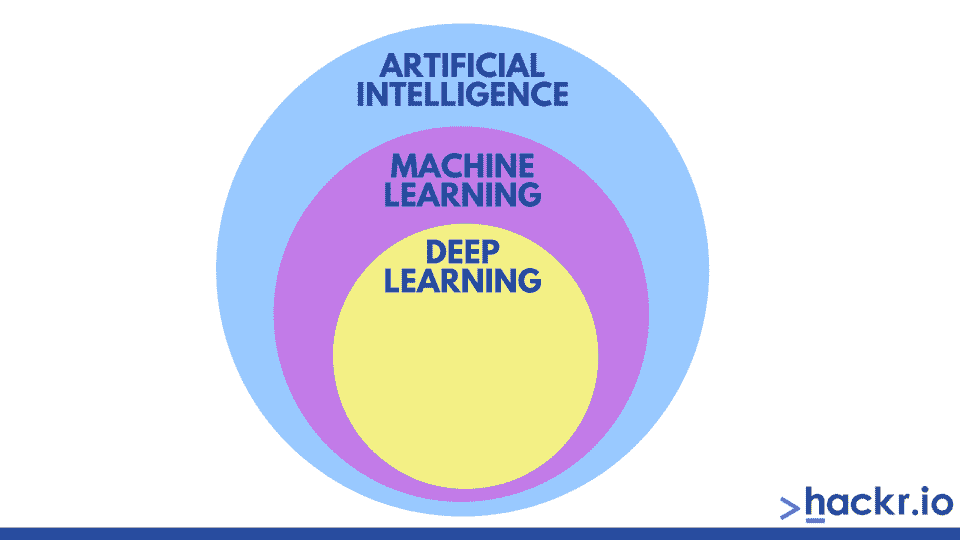
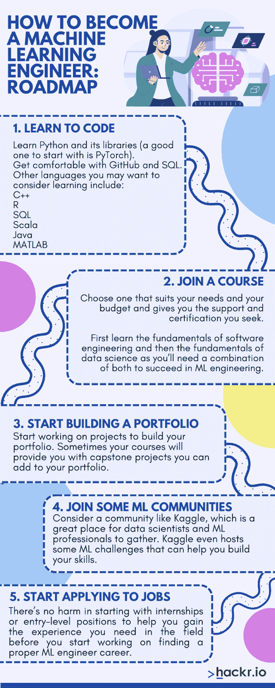
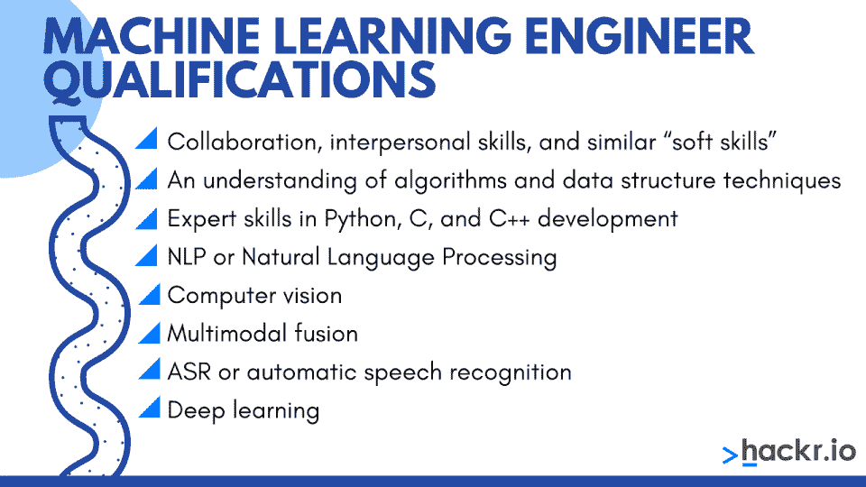

# 如何成为一名机器学习工程师？

> 原文：<https://hackr.io/blog/how-to-become-a-machine-learning-engineer>

到现在，你可能听说过 AI(人工智能)和 ML(机器学习)。如果你在科技行业或者密切关注科技行业，你可能已经注意到，要避开其中任何一个都几乎是不可能的。机器学习和人工智能似乎是未来——越来越多行业的越来越多公司开始采用这些技术来为他们的组织带来效率和自动化。

由于人工智能和人工智能开始变得越来越广泛，对机器学习工程师的需求只是继续增长。如果你在这里，你可能想知道如何成为一名机器学习工程师，以及这是否是一个真正让你感兴趣的领域。

在这份关于如何成为一名机器学习工程师的完整指南中，我们汇集了你需要知道的一切。在这里，我们告诉你所有关于机器学习和工程师做什么。请继续阅读，了解成为一名 ML 工程师的挑战性，成为一名 ML 工程师的要求，以及在这个领域你能找到什么样的工作。

## **什么是机器学习？**

如果你对这个学科完全陌生，理解什么是机器学习可能会很困难。然而，我们也可以简单地说，机器学习是我们称之为[人工智能](https://hackr.io/blog/what-is-artificial-intelligence)的技术的子集。人类开发了人工智能，也称为 AI，来模仿人类行为，在没有太多人类输入的情况下智能地工作。

机器学习是一种技术，通过这种技术，我们应用人工智能来创建能够“分析”数据和“学习”模式的系统。机器学习还能够对数据进行预测、分类、决策或类似的任务——而且这一切都不需要太多的人工干预。在机器学习中，机器使用各种算法从数据和以前的经验中学习。ML 没有明确编程。

用一句话来说，我们可以说 ***机器学习作为人工智能的一个子集，专注于开发能够访问数据并使用这些数据进行学习和改进的计算机程序——而无需被编码或编程来这样做。***

如果这还不清楚，让我们来看一个类比:作为一个人，你经历了一些事情或犯了一个错误，通常从这些过去的经历中学习。你学到的教训让你在未来做出更好的决定。机器学习(ML)训练计算机使用历史数据进行学习，使其在未来更好地执行任务。

但是这如何转化为现实世界的使用呢？

以网上购物为例。在网上购物中，当你访问一个网站并使用你的账户(或者仅仅是你的带有 cookies 和追踪器的浏览器)购买一件商品时，你的信息就变成了 ML 模型的历史数据。ML 模型从这些数据中学习，现在无论你何时访问，它都知道你感兴趣或需要什么。

因此，在您下次访问该网站时，您将会看到展示的类似产品。另一个例子是，如果你定期购买一件商品，ML 模型可以看到这种模式，并识别出什么时候该再次购买该商品。因此，该网站可能会在相同的时间间隔内给你发一封电子邮件，提醒你购买你的商品。

**机器学习的未来**

机器学习有无限的用例，可以改变世界，并对教育、计算机科学、金融等各个领域产生积极影响。目前，机器学习已经应用于医疗保健等关键领域，以降低患者的风险，定位业务中的问题，并找到任何流程中的漏洞。

这项技术不会有任何发展，相反，它将在未来继续发展。因此，对机器学习工程师的需求将呈指数级增长。

## **为什么要学习机器学习？**

我们可以毫不讳言地说，机器学习和人工智能是目前席卷全球的技术。ML 和 AI 是未来。随着如此多的行业开始采用这些技术，不可否认有一天，ML 和 AI 将成为经济能力和增长的主要驱动力之一。

不相信我们？你不必这样做——只要看看这份 [MarketsandMarkets 报告](https://www.marketsandmarkets.com/Market-Reports/machine-learning-market-263397704.html#:~:text=%5B156%20Pages%20Report%5D%20The%20machine,44.1%25%20during%20the%20forecast%20period.)就知道了，该报告显示，从 2016 年到 2022 年，全球机器学习行业预计将增长 77.8 亿。同一份报告指出，我们应该预计 2022 年 ML 市场将从 2016 年的 10.3 亿美元增长到 88.1 亿美元左右。

这些数字本身就令人印象深刻，但如果你看一下这份[财富商业洞察报告](https://www.fortunebusinessinsights.com/machine-learning-market-102226)，它清楚地表明，在 2021 年，全球 ML 市场的价值高达 154.4 亿美元。这比预期高出 66.3 亿英镑，比预期早了整整一年。

这些数据表明，随着越来越多的行业在实践中采用人工智能，机器学习正在呈指数级增长，并将继续增长。不用说，对在机器学习方面有知识的专业人士的需求将继续高速增长。在 S&P 全球市场情报的 2021 年[关于人工智能和机器学习前景的文章](https://www.spglobal.com/marketintelligence/en/news-insights/blog/2021-ai-and-machine-learning-outlook#:~:text=followed%20by%20machine%20learning%20engineers)中，作者 Nick Patience 表示，他们的最新调查发现，机器学习工程师是人工智能中第二受欢迎的角色。

本质上，学习 ML 可以让你在各行各业找到一份高薪、高需求的工作。成为一名机器学习工程师可以成为一个职业支点，引领你走向巨大的成功。

## **什么是机器学习工程师？**

机器学习工程师往往是计算机程序员。他们设计*和*构建人工智能或自运行软件，然后从数据中学习。随着软件从数据和经验中学习，它可以开始自动化预测模型。

一些人在看机器学习工程师的工作描述时，可能会认为这些工程师只是专注于建立模型的数据科学家。虽然他们没有错，但事实是，构建模型只占机器学习工程师整体工作职责的一小部分。

ML 工程师介于数据科学和软件工程之间。当然，他们必须理解数据结构和模型。但是除此之外，他们还必须能够*部署*他们已经构建到软件中的模型。

随着越来越多的行业转向依赖大数据和自动化，以及越来越多的组织寻求让他们的业务更有效地运行，对 ML 工程师的需求将继续增长。

所有这些听起来可能很有吸引力，但在你开始考虑如何获得机器学习方面的工作之前，你应该首先了解更多关于机器学习的工作要求和职责。

## **机器学习工程师做什么？**

简单来说，ML 工程师教会系统和软件在很少或没有人工输入或干预的情况下，自己从数据和经验中学习。

你可能在某个时候遇到过机器学习工程师的工作。如果你听说过“YouTube 算法”，那就是自学模式的一个很好的例子。其他例子是你的社交媒体订阅源，随着时间的推移，它会向你展示你最常互动的事物；还有网上购物建议，它会显示你以前搜索过的商品，甚至是与你刚买的东西相关的商品。

为了完成他们的实际工作，机器学习工程师要完成许多不同的任务，例如—

*   使用[机器学习库](https://hackr.io/blog/best-machine-learning-libraries)和编程语言运行机器学习实验
*   将他们的 ML 模型部署到软件中
*   优化他们的模型以提高性能
*   处理他们的模型并确保可扩展性
*   执行一些数据科学工作，如数据分析
*   提出用例
*   进行数据工程工作，以保持数据库和系统后端流畅

除了各种各样的任务，ML 工程师还与其他同事合作，如研究人员、数据科学家、其他软件工程师，甚至项目或产品经理。

### **机器学习工程师的角色和职责**

机器学习工程师通常通过将数据输入 ML 模型(通常由数据科学家设计，但也可以由 ML 工程师自己设计)来处理大数据。

但是，他们还有许多其他角色和职责，例如:

*   采用理论模型并对其进行扩展，使其能够投入生产，并能够实时处理大量数据
*   构建程序和软件；领导各种软件设计和工程责任
*   在数据建模和评估中使用策略，找出任何现有模式，然后进行预测
*   研究、分析和转换数据科学原型
*   设计新的 ML 系统
*   研究和实现正确的 ML 工具和算法
*   选择和使用正确的数据表示和数据集方法
*   使用各种测试结果进行统计分析、测试、实验和微调
*   扩展现有的 ML 框架和库
*   支持其他利益相关方在产品中实施和应用 ML

机器学习工程师还负责开发必要的算法，使人工智能和软件能够从数据和经验中学习，以便它能够自己“思考”，并教会自己做什么以及如何响应命令。

## **分步指南:如何成为一名机器学习工程师**

甚至开始考虑如何成为一名机器学习工程师都会感到难以置信的恐惧。为了帮助您，我们编写了一份分步指南。本指南将带您通过五个可行的步骤完成这一过程。请参见以下步骤:

### **1。学习编码**

如果你作为一个完全的新手接近机器学习的职业生涯，你可能想从学习编码开始。

你可以学习的第一种语言是 Python，它是现在最流行的编程语言之一。Python 及其库经常用于各种科学、统计和人工智能/机器学习应用程序，这就是为什么在开始时熟悉自己是个好主意。学习 Python 及其库(PyTorch 是一个很好的起点)。

您可能还想熟悉 Github 和 SQL，它们是大多数 ML 工程师、软件工程师和 IT 专业人员使用的工具。

你可能想学习的其他语言包括:

*   C++
*   稀有
*   结构化查询语言
*   斯卡拉
*   Java 语言(一种计算机语言，尤用于创建网站)
*   矩阵实验室

### **2。参加课程**

你总是可以自己学习机器学习。计算机科学领域有很多自学成才的专业人士。然而，如果不参加某种形式的课程、训练营或项目，在这个行业学习和找工作是很有挑战性的。

有各种各样的课程可以帮助你学习成为一名合格的机器学习工程师所需的每一项技能。甚至还有训练营和项目，旨在从头到尾教会你所需要的一切。选择一款适合您的需求和预算，并能为您提供所需支持和认证的产品。

首先学习软件工程的基础知识，然后学习数据科学的基础知识是很重要的，因为你需要两者的结合才能在 ML 工程中取得成功。

### **3。开始建立投资组合**

一旦你完成课程，你应该做的第一件事就是开始做项目来建立你的文件夹。有时你的课程会提供给你一些顶点项目，你可以把它们添加到你的文件夹中。如果没有这些，你可以试着做一个你自己的 ML 项目。

你甚至可以从回顾或重新创建由[在线资源](https://project-awesome.org/ujjwalkarn/Machine-Learning-Tutorials)提供的关于这个主题的项目开始。

### **4。加入一些 ML 社区**

独自学习可能会很有挑战性，尤其是当你最需要反馈的时候，如果没有人可以向你反映想法或寻求反馈。加入一个在线 ML 社区可以解决这个问题。考虑像 [Kaggle](https://www.kaggle.com/) 这样的社区，这是数据科学家和 ML 专业人员聚集的好地方。Kaggle 甚至主办一些可以帮助你提高技能的 ML 挑战。你甚至可以在其中的一些比赛中获得一些奖金。

### **5。开始申请工作**

一旦你对自己的技能足够自信，并且建立了自己满意的作品集，下一步就是开始申请工作了！开始的时候，期待收到拒绝。在开始寻找合适的 ML 工程师职业之前，从实习或入门级职位开始也没有坏处，可以帮助你获得你在该领域所需的经验。

## **成为机器学习工程师的路线图**

## **成为一名机器学习工程师需要多久？**

如果你认为机器学习工程师的职业生涯很容易，你可能会失望——当你开始时，有一个重要的学习曲线。然而，你所面临的学习曲线的陡度将取决于你之前是否有数据科学、计算机编程和统计学方面的经验。

让我们先说:你不需要机器学习工程师学位。大多数时候，你可以参加为期六个月的 ML 课程，这足以让你找到工作。

然而，如果你是从零开始，需要学习编程和数据科学，这可能需要更长的时间，这两者都需要额外的课程和训练营时间。如果你是自学、兼职、按自己的进度学习，你也可以期待花更长的时间。

当然，学习只是成功的一半。如何获得机器学习工作的一部分是获得该领域的经验。您可以通过以下方式获得经验:

*   获得关于机器学习技术各个方面的扎实知识
*   使用真实的数据通过真实的项目获得实用的知识
*   在机器学习项目中寻找实习或初级职位

## **机器学习就业要求**

如果你想成为一名机器学习工程师，你需要满足五个关键要求。你不需要一个学位来获得这些机器学习工程师的要求——事实上，有许多自学成才的程序员、数据科学家和数据专业人士已经成功进入了这个领域。然而，你需要以某种方式展示你对这个主题的理解和专业知识。

成为 ML 工程师的五个重要要求是:

### **1。某些编程语言**

如果你是一名有抱负的机器学习工程师，了解编程语言至关重要。如果你希望能够处理与 ML 相关的不同类型的数据和软件，你需要能够舒适地使用某些[编程语言](https://hackr.io/blog/best-programming-languages-to-learn)。

目前，有几种不同的语言用于 ML 和 AI 应用程序，包括但不限于 Python、C++和 Java。

如果你想知道如何在没有学位的情况下成为一名机器学习工程师，请从这里开始。虽然你有办法在不知道如何编码的情况下[学习机器学习](https://hackr.io/tutorials/learn-machine-learning-ml)，但了解这些编程语言仍然是必要的，因为 ML 中的大多数工作机会都要求你非常熟悉某些编程语言(尽管具体哪种语言可能因公司而异)。

### **2。特定计算机编程技能**

一旦你开始寻找一份 ML 工程师的工作，你遇到的绝大多数招聘职位都要求你具备编程技能。公司倾向于寻找有经验的程序员，因为他们必须能够处理大量的数据。他们还需要能够将 ML 模型扩展和实现到生产水平。

当你想到“计算机编程”时，你可能会想到编码——你没有错。然而，编码只是工作的一部分。公司可能还希望你在其他方面有经验或知识丰富，比如:

*   使用数据结构(堆栈、图形、多维数组、队列、树)
*   算法(优化、排序、动态编程、搜索)
*   可计算性和复杂性(P 与 NP，big-O 符号，NP 完全问题，近似算法)
*   计算机架构(带宽、内存、死锁、缓存、分布式处理)

### **3。数据建模和处理**

如果不熟悉数据建模和处理，你就不可能成为机器学习工程师。拥有与此相关的技能是至关重要的，因为作为一名 ML 工程师，你将处理你的 ML 模型将要学习的数据。

当涉及到数据建模和处理时，ML 工程师要负责一些事情。这些事情包括:

*   寻找模式(相关性、聚类和特征向量)
*   预测最后看不见的实例的属性(分类、异常检测和回归)
*   误差测量过程(分类的对数损失)
*   评估策略(培训-测试分离)

### **4。概率统计**

机器学习工程师可以通过统计和概率找到数据中的关键问题，因为这些方法有助于以可能的最佳数学方式提取信息。

您可能想了解的几件事包括:

*   概率的形式特征(条件概率、贝叶斯规则、似然性、独立性)

*   源自统计的技术(贝叶斯网、马尔可夫决策过程和隐马尔可夫模型)
*   统计测量(均值-方差和中值)
*   分布(均匀分布、二项式分布、泊松分布和正态分布)
*   分析方法(方差分析、假设检验)

### **5。系统设计和软件工程**

机器学习工程师致力于开发能够融入公司服务和产品的更广泛生态系统的软件。这意味着他们必须了解各部分如何工作，并使用不同的方法进行通信。机器学习工程师需要利用系统设计，对任何特定的任务拥有完整的机器学习能力。

### **机器学习工程师资格**

****

机器学习资格类似于领域专家、数据科学家、软件工程师、统计学家以及那些在高等数学和统计基础知识方面拥有大量知识的人的技能。这包括对算法的深刻理解。

下面提到的技能对于在机器学习领域更上一层楼，更快地推进你的职业生涯至关重要。可以考虑通过[在线课程](https://hackr.io/blog/machine-learning-courses)之类的学习以下技能:

*   协作、人际交往技能和类似的“软技能”
*   理解算法和数据结构技术
*   Python、C 和 C++开发方面的专业技能
*   自然语言处理
*   计算机视觉
*   多模态融合
*   ASR 或自动语音识别
*   深度学习

## **学习机器学习可以获得哪些类型的工作？**

如果你想知道如果你开始学习人工智能和机器学习，你可以找到什么类型的工作，那真的有很多。当然可以成为**机器学习工程师**。截至发稿时，Indeed.com 表示，美国机器学习工程师的平均基本工资为[123，755 美元/年](https://www.indeed.com/career/machine-learning-engineer/salaries)。

不过，如果你想从事机器学习方面的工作，但不一定想承担*工程*方面的工作，还有其他职业可以考虑。这些职业通常有重叠的要求和资格，所以你不需要学习太多就可以在这些领域找到工作。

考虑以下工作:

*   **[数据工程师](https://www.indeed.com/career/data-engineer/salaries?from=top_sb)** - Avg。底薪$136，238 -数据工程师通常是软件工程师，他们负责为数据构建系统。这些系统然后收集和管理数据，然后将其转换成可用的信息。对于那些喜欢关注细节和遵循工程指导方针的人来说，数据工程是一个很好的职业。数据工程师也很受欢迎，这通常意味着工作稳定和高薪。

*   **[数据科学家](https://www.indeed.com/career/data-scientist/salaries?from=top_sb)** - Avg。底薪 141，109 美元——数据科学家负责分析数据，从中提取意义。他们使用来自机器学习和统计学的方法和工具来解释数据。通常，身为人类也有助于数据科学家为他们处理的数据赋予意义。一些数据科学家还负责开发可以帮助数据模型预测结果的算法。

*   **[软件工程师](https://www.indeed.com/career/software-engineer/salaries?from=top_sb)** - Avg。基本工资 126，552 美元-软件工程师通常是负责设计和创建各种用途的系统和应用程序的专业人士。通常，他们创建的解决方案用于解决现实世界的问题。软件工程师，有时也被称为软件开发人员，为计算机开发应用程序和程序。

还有其他新兴的工作也可以考虑，比如机器学习研究员和自然语言编程(NLP)科学家。

## **推荐的机器学习课程和项目**

如果你已经下定决心要成为一名机器学习工程师，有一些在线课程和训练营可以帮助你启动这个过程。以下是我们的一些建议:

*   **[机器学习训练营:部署算法并在 6 个月内建立投资组合](https://www.springboard.com/courses/ai-machine-learning-career-track/)** [通过跳板](https://www.springboard.com/courses/ai-machine-learning-career-track/) -跳板为学生提供独特的课程，他们可以在灵活的时间表上学习。特别是这门课程是 100%在线的，而且还提供按需一对一的指导。通过这个训练营，你可以获得成为 ML 工程师的必要资格。你还将开发一个机器/深度学习系统，并获得构建原型和部署原型的实践经验。一旦你毕业，你就会有一个证书和一个作品集。

*   [**AWS 机器学习工程师纳米学位**由 Udacity](https://www.udacity.com/course/aws-machine-learning-engineer-nanodegree--nd189) - Udacity 以“纳米学位”的形式提供高质量的课程和教育而闻名这种特殊的机器学习纳米学位教你所有的工作就绪的机器学习和数据科学技能，你需要转向你的新选择职业。Udacity 的证书通常得到全球许多雇主的认可和接受，因为该平台上的许多课程都是与该领域的科技巨头和权威机构共同开发的。

***如果你更愿意从书籍开始，我们已经整理了一份清单:***

[初学者的 20 本最佳机器学习书籍&专家](https://hackr.io/blog/best-machine-learning-books)

## **结论**

人工智能和机器学习将会继续存在。毫无疑问，未来会有更多的公司开始采用这些技术，尤其是考虑到目前两者都有多大的潜力。随着越来越多的公司采用 AI 和 ML，对机器学习工程师的需求只会继续增长。

我们希望这份关于如何成为机器学习工程师的全面指南已经帮助你明白了你需要采取的步骤。一旦你学会并完善了在该领域开始职业生涯所需的技能，你就可以用这些[机器学习面试问题](https://hackr.io/blog/machine-learning-interview-questions)来为自己的求职面试做准备。

[面向 Python 开发者的机器学习简介](https://click.linksynergy.com/link?id=jU79Zysihs4&offerid=1045023.2092098&type=2&murl=https%3A%2F%2Fwww.udemy.com%2Fcourse%2Fmachine-learning-intro-for-python-developers%2F)

## **常见问题解答**

#### **成为机器学习工程师需要具备什么资格？**

要成为一名机器学习工程师，你至少必须:

*   了解 Python 和 C++等编程语言
*   有编程技能
*   了解数据科学的基础知识，并具备统计和概率方面的知识
*   了解软件工程和系统设计

#### **做一个机器学习工程师需要多长时间？**

成为机器学习工程师的课程和训练营可能需要长达六个月的时间。它可能会花你更短或更长的时间，这取决于你开始的技能和知识。

#### **做机器学习工程师需要博士学位吗？**

一点也不。ML 工程是计算机科学中许多不需要正规教育就可以进入的领域之一，尽管你可能至少想参加一个训练营或认证课程。

#### **大一新生能在机器学习领域找到工作吗？**

当然，如果你有相关的技能和投资组合。参加 ML 的训练营或课程也能给你很大的帮助。

#### **机器学习工程师有需求吗？**

是啊！随着越来越多的行业开始通过人工智能和机器学习来采用自动化，对 ML 工程师的需求只会继续增长——并且呈指数增长。

**人也在读:**