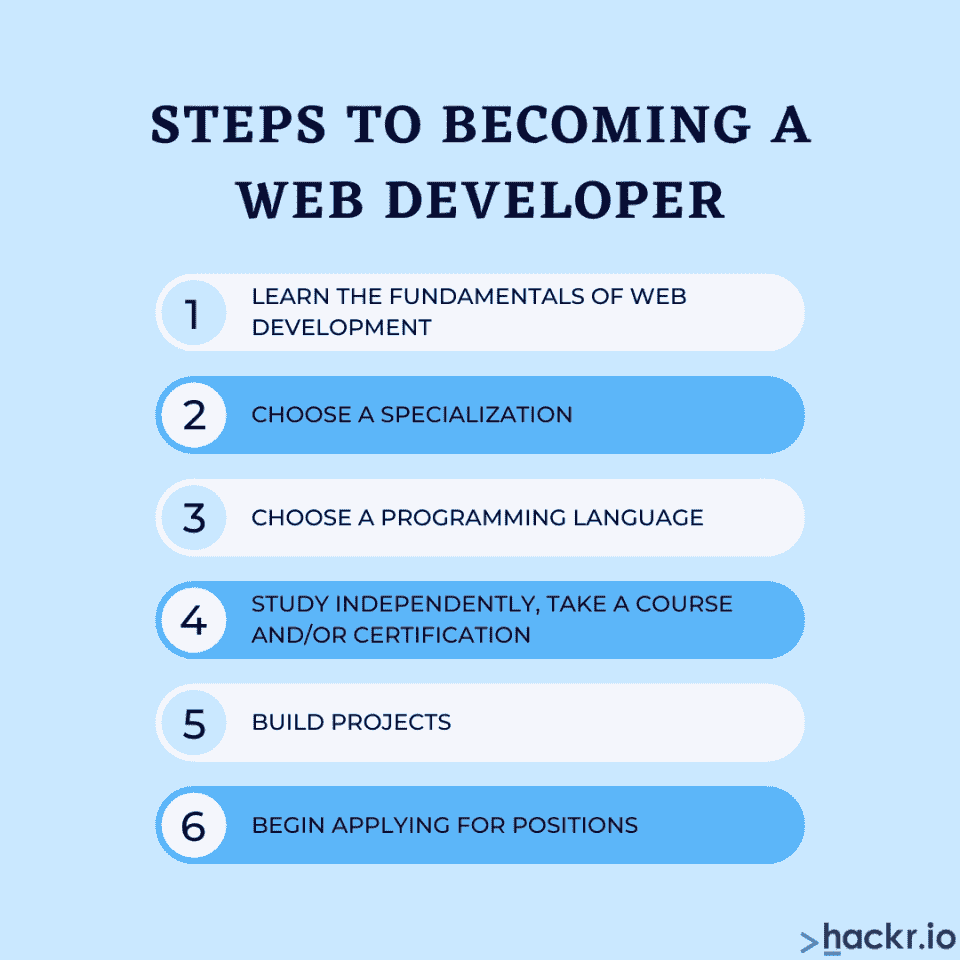

# 2023 年如何成为一名网页开发者？

> 原文：<https://hackr.io/blog/how-to-become-a-web-developer>

所以你想知道如何成为一名网络开发人员？幸运的是，这方面的资源并不缺乏。成为一名优秀的 web 开发人员需要学习、时间，最重要的是通过构建项目进行实践。

您还有几种选择，包括前端、后端，如果您想完善自己，还有全栈开发——即前端和后端开发。职业机会很大，至少与其他编程角色相比，你可以在相对较短的时间内获得一个有报酬的角色。

在这篇文章中，我们将讨论什么是编码，最流行的编程语言和一些关于 web 开发职业的概述。

## 2023 年成为一名网页开发者还值得吗？

当然，如果你要转行，你要问自己的第一个问题是这是否值得。报酬够高吗？你会找到机会吗？在经历了 2020 年那段可怕的时间后，这变得更加重要。

幸运的是，对于那些想成为网页开发者的人来说，即使是跟随新冠肺炎·疫情，职业前景看起来还是不错的。事实上，美国劳工统计局预计未来十年该职业将有 13%的增长，远高于平均水平。

你的薪水会根据你所擅长的编程语言和你所承担的角色而有所不同。但根据 BLS 的数据，2020 年一般网络开发职位的平均薪酬为每年 77200 美元。这远远高于媒体年薪 41950 美元。

## **成为一名网页开发者很难吗？**

简单的答案是否定的(困难对不同的人来说也有不同的含义)。

已经有成千上万的人从零开始学习 web 开发。这并不难，但需要你的耐心和严谨。事实上，web 开发是你能从事的最简单的编程相关的工作之一。你应该问的问题是，“我会喜欢成为一名网页开发者吗？”

成功人士与众不同之处在于，他们坚持学习，即使学习对他们来说似乎过于沮丧。软件职业充满了这样的时刻，你会觉得自己不知道哪里出了问题，所以，如果有什么不同的话，遇到障碍并解决它只是为真正的工作而进行的训练。调试是这个过程的一个重要部分，也是你应该习惯的部分。

## 成为一名网页开发人员需要什么样的教育？

你不需要任何形式的正规教育就能成为一名网页开发者，尽管如果你愿意，你可以选择这条路。通过独立学习，通过 YouTube 上的视频，或者仅仅通过书籍/免费课程和一般文档，你可以非常成功地成为一名 web 开发人员。

具体来说，您将需要学习 HTML 和 CSS，然后学习 JavaScript、Python 或 Ruby on Rails 等编程语言，这取决于您在 web 开发道路上选择的具体路线。稍后，您将了解像 React 和 Node 这样的框架，以及许多其他辅助但却是 web 开发体验中非常重要的部分。

## **成为一名网页开发者需要多长时间？**

这取决于你花在学习上的时间和你自己的网络开发能力。一般来说，期望从大约 3 到 6 个月(甚至更少)中“得到”web 开发过程。你应该在大约 6 个月内建立你的第一个主要项目，给或拿几个月。

在大约 12 到 18 个月的时间里，你会发现自己有资格申请你的第一个职位！这将取决于你的熟练程度，以及你的投资组合中是否有展示你能力的项目。

当谈到成为一名 web 开发人员需要多长时间时，不要把这里提到的任何时间框架作为最终真理。有很多变量在起作用，你可能会发现你自己的旅程大大偏离了所说的时间框架。

你应该关注的是每天学习并变得更好，并致力于值得展示的项目。

## **如何成为一名网页开发者【一步一步指南】**

成为一名 web 开发人员的步骤很简单——是你投入的努力和时间让一切变得不同。从高层次来说，这是你从零开始成为一名 web 开发人员的旅程:

## **第一步:学习 Web 开发的基础知识**

您的 web 开发之旅将从基础开始，即学习 web 如何工作，以及标记语言 HTML 和 CSS。与一些初学者的想法相反，HTML 和 CSS 不是编程语言。这些类型的语言决定了内容的结构，与编程语言相反，编程语言是非正式的，实际上“做”事情。

学习 HTML 和 T2 CSS 很容易，甚至可以在一周内完成——这是最基本的。我们的意思是如何构建一个网页，使内容放在正确的位置，并设计它，使它看起来可以接受。

了解网络是如何工作的很重要，所以不要跳过这一点。关于这个主题有几个可用的资源。至于 HTML 和 CSS，你会发现很多网络课程，包括我们在这里提到的，在他们的课程中包含了这两个。

## **第二步:选择专业**

现在你应该知道网络是如何工作的，以及如何建立一个基本的网站。此时，您将面临这样一个问题:您应该成为前端开发人员还是后端开发人员？如果你已经了解了网络是如何工作的，你应该能够理解其中的区别。

一个前端开发者对你浏览互联网时看到的东西进行处理。他们从 UI/UX 团队获得设计，通过 JavaScript 和 [JavaScript 框架](https://hackr.io/blog/best-javascript-frameworks)创建网页及其风格，以及交互元素。

后端开发人员关注的是幕后发生的事情，包括数据库、服务器请求的处理以及创建相关的应用程序。

还有一个 web 开发角色:全栈开发人员。这些开发人员只需同时具备前端和后端技能，就可以同时担任这两个角色。

## **第三步:选择编程语言**

现在，在我们详细介绍许多在 web 开发领域有用的编程语言之前，我们想先说，在大多数情况下，您应该学习标记语言 HTML 和 CSS，然后是 JavaScript。你可以用这三个，也是最常见的，来构建能让你通过第一次面试的项目。

该领域还使用了其他几种语言，每种语言都有自己特定的功能和在特定应用中的突出地位。这些是:

1.  Java Script 语言
2.  服务器端编程语言（Professional Hypertext Preprocessor 的缩写）
3.  计算机编程语言
4.  Ruby on Rails
5.  去
6.  目标 C 和 Swift
7.  C#
8.  Java/Kotlin

现在，把重点放在 HTML、CSS 和 JavaScript 上。随着您的知识越来越丰富，并且有一些演示要展示，您就可以开始扩展和专门化了。

你还需要知道 SQL，或者结构化查询语言，来操作数据库。这不是很难，或者说不完全是一种编程语言，但它是团队希望你了解的不可或缺的知识。

## **第四步:如何学习 Web 开发**

既然你已经对自己喜欢的专业和通用编程语言有了一个模糊的概念，你就需要真正开始工作了。

好消息是学习 web 开发的课程没有止境。其中许多都是免费的，尽管认证计划确实提供了额外的好处，给你一个证书来证明你的资格(这绝不是强制性的)。

网络开发课程真的不缺乏，所以只要用谷歌搜索一下，你就会看到一些弹出来的课程。您也可以看看 Hackr 上的可用资源。

## **步骤 5:构建 Web 开发项目**

有了这些基础知识，了解了如何应用 HTML、CSS 和 JavaScript 来构建、设计和构建一个可用的应用程序，你就应该开始做项目了。不必太复杂，但一定要强调走出你的舒适区。

这些项目将成为你作品集的一部分，你将在面试中展示。你可以肯定的是，你的面试官会问你的发展过程，你面临的挑战和你如何克服它们，以及你工作背后的一般思维过程。这也将教会你所有重要的调试过程。

在准备发出申请之前，你应该建立一些挑战不同技能的项目——这恰好是最后一步！

## 第六步:开始申请职位

有了项目组合，你就有了一个获得网络开发职位的好机会。你可以发送这些申请的平台没有止境。

但是请记住，在你申请职位的时候，继续学习和做项目——在一个新的发展经常发生的领域，学习永远不会结束。

起初，你可能甚至不需要任何工具来开始编码，因为许多课程提供基于浏览器的环境来运行你的代码。然而，作为潜在职业的良好实践，你应该下载一个代码编辑器。有几个免费选项可用，其中有崇高的文本，原子和 Vim。我们为初学者推荐 [Sublime Text](https://www.sublimetext.com/) 或者 [Atom](https://atom.io/) 。

有几个其他漂亮的工具，使 web 开发和设计工具，使过程更容易，但你会在适当的时候知道这些。

[完整的 2023 年网络开发训练营](https://click.linksynergy.com/link?id=jU79Zysihs4&offerid=1045023.1565838&type=2&murl=https%3A%2F%2Fwww.udemy.com%2Fcourse%2Fthe-complete-web-development-bootcamp%2F)

## **编码永远不会晚**

现年 82 岁的若宫雅子是地球上最老的编码员之一。当她第一次开始写代码时，她正在使用[算盘](https://en.wikipedia.org/wiki/Abacus)进行数学运算。如今，她是世界上最老的 iPhone 应用程序开发者之一，是让老年人使用智能手机的先驱

纵观软件生态系统中发生的高速创新和发展，成为一名程序员永远不会太晚，因为今天的新东西明天就会过时。这个时候，世界比以往任何时候都需要更多的编码员。成为一名程序员永远不会太晚。你所需要的只是付出努力和时间。

如果你想花更多的时间学习 web 开发，可以在 Hackr 上找到一些[课程](https://hackr.io/tutorials/learn-intro-to-programming)。

**人也在读:**