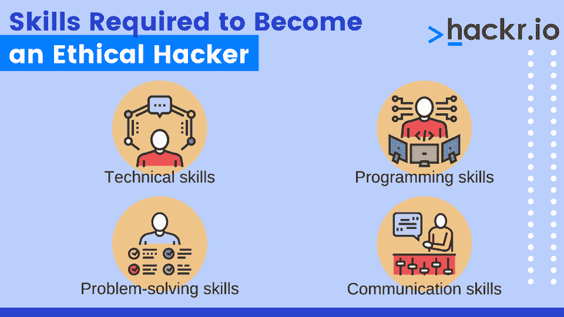
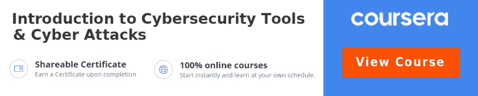

# 如何在 2023 年成为一名有道德的黑客？[完整指南]

> 原文：<https://hackr.io/blog/how-to-become-an-ethical-hacker>

你喜欢解谜吗？你喜欢探究事物是如何工作的吗——尤其是技术和计算系统？或者更好的是:你会把你的朋友拖去密室吗？

如果你对这些问题中的任何一个回答是肯定的，职业道德黑客可能适合你。道德黑客就是寻找计算机系统和网络的弱点并修复它们。一些道德黑客为小公司工作，完成质量保证和渗透测试。其他有道德的黑客为非常大的企业工作——“黑客”银行、政府实体和其他高度安全的组织。

开始你职业道德黑客生涯的一个好地方是参加职业道德黑客课程。然而，这不是唯一的途径。继续阅读，了解如何成为一名有道德的黑客！

## **什么是道德黑客？**

在学习如何成为一名职业黑客之前，你应该学习基础知识。今天,“黑客”一词有负面含义。但是在编程和开发的早期，黑客只是一个高度熟练和有创造力的计算机专家。闯入一个系统需要很多知识，尤其是高度安全的系统。

一个道德黑客使用各种编程技巧和工具试图闯入系统和网络。一旦他们成功突破了系统，他们会提供如何修复他们发现的弱点和缺陷的建议。

与犯罪黑客不同，道德黑客与组织合作来提高他们的安全性。他们用自己的技能使系统和网络更加安全，而不是利用它们。

## **如何成为一名有道德的黑客？**

成为一名有道德的黑客需要技术技能和人际技能的结合。此外，有道德的黑客需要知识渊博，并能创造性地解决问题。他们还需要清晰地交流，包括书面交流和面对面交流。

一些道德黑客甚至专攻“[社会工程](https://en.wikipedia.org/wiki/Social_engineering_(security))”他们不会以数字方式闯入系统。相反，他们试图让人们去*告诉*他们需要知道的事情。

大多数有道德的黑客拥有计算机科学的大学学位，尽管有些人拥有电子工程或信息安全的学位。除了大学学位之外，职业黑客通常还拥有数年 IT 安全专业人员或程序员的工作经验。

一些有道德的黑客是自学成才的；他们通过独立学习和反复试验发展了自己的技能。然而，大多数雇主更愿意雇用受过正规教育和道德黑客培训的候选人。

### **没有经验如何成为一名有道德的黑客**

如果你没有计算机科学方面的经验，成为一名职业黑客的最佳途径就是获得学位。您可以:

*   寻求 IT 安全方面的认证；
*   参加为期四年的计算机科学学位课程；或者
*   参加一个明确侧重于 IT 分析和安全的为期两年的计划。

## **成为一名道德黑客需要哪些技能？**

除了正规的教育和培训，你还需要几项技能来成为一名成功的道德黑客。

*   **技术技能:**你需要对计算机网络及其工作原理有很强的理解，包括对 TCP/IP、以太网等常用协议的理解。您还应该熟悉不同类型的网络硬件，如路由器、交换机和防火墙。
*   **编程技巧:**你不需要成为一个编程高手，但你应该知道如何用至少一种通用编程语言编写代码，比如 Python 或 Java。道德黑客通常需要定制脚本和编码，因此编写代码的能力不是可选的。
*   **解决问题的技巧:**道德黑客就是为难题寻找创造性的解决方案。如果黑客攻击很容易，那么系统就会一直很脆弱。你需要找到程序员和管理员没有考虑到的进入系统的方法。
*   **沟通技巧:**当你发现一个漏洞的时候，一定要向能修复它的人说清楚。这意味着写清楚的报告和口头陈述。通常，和你交谈的人不会有和你一样的技能水平——但是你需要能够传达你的发现的重要性。

如你所见，道德黑客实际上是硬技能和软技能的混合。虽然这让这份职业充满挑战，但也是它吸引许多人的地方。

道德黑客使用与黑帽黑客相同的工具，但目的不同。以下是一些最常见的道德黑客工具:

*   **Nmap** :网络探测工具和安全扫描器。用于查找网络上的主机和服务，以及识别安全问题。
*   **Wireshark:** 一种数据包分析器，可用于网络故障排除、分析、软件开发等。
*   **Metasploit:** 一种渗透测试工具，用于测试系统的安全性，发现漏洞。
*   **Burp Suite:**web 应用安全测试工具，用于发现 web 应用中的漏洞。
*   **Kali Linux:** 一个基于 Debian 的 Linux 发行版，拥有广泛的安全和渗透测试工具。

一个有道德的黑客可能在一个给定的项目中使用几十种工具。成为一名有道德的黑客需要了解这些工具，并学会何时使用它们。

## 成为一名道德黑客需要学位吗？

道德黑客要求各不相同，但总的来说，是的。虽然许多人愿意雇佣没有学位的自学程序员，但一个有道德的黑客必须非常熟练才能在没有学位的情况下被雇佣。相当多的道德黑客行为需要关于网络和安全中使用的系统和过程的正式知识。

但这并不意味着它是必不可少的。你可能会想:没有受过教育，我怎么能成为一个有道德的黑客呢？如果你已经在 IT 行业积累了丰富的经验，并且能够证明你的技能，那么没有正规教育也有可能找到工作。至少，你应该追求你最常使用的技术的认证。例如，思科安全认证对证明技能大有帮助。

## 一个道德黑客的平均工资是多少？

职业道德黑客是非常有利可图的。如果你具备所有的条件，你可以拿到六位数以上的薪水。

根据 Glassdoor 的数据，[道德黑客的平均工资是 114648 美元](https://www.glassdoor.com/Salaries/ethical-hacker-salary-SRCH_KO0,14.htm)。这包括总薪酬。你可能会注意到，道德黑客经常长时间工作或获得基于报酬的奖金，这在软件和 IT 领域很常见。

最优秀的道德黑客可以获得超过 70 万美元的总报酬，因为他们对组织的安全非常重要。

## **如何成为政府的黑客**

一个为政府工作的职业道德黑客和其他任何道德黑客有着一样的基本要求。但是他们也需要通过严格的背景调查。政府实体通常不会专门雇佣“道德黑客”，而是“渗透测试员”和类似的职位。

如果你是政府的道德黑客，你可以很容易地在任何地方找到另一份工作。但要知道，政府使用独特的技术，生产高度专用的基础设施。为了成为政府的黑客，你需要学习政府安全方面的知识。

### **道德黑客和渗透测试者的区别**

渗透测试人员是安全专业人员，他们模拟对系统的攻击来寻找漏洞。

渗透测试是道德黑客的一个子集，但是道德黑客有更广泛的关注点。道德黑客不择手段进入系统——而渗透测试人员则专注于网络渗透。

## **自由职业道德黑客和漏洞奖金**

并非所有有道德的黑客都为特定的组织工作。他们中的一些人是自由职业者，而一些人则参加了 bug bounty 计划。

bug bounty 计划是指一个组织向任何能发现其系统漏洞的人提供现金奖励。这些项目通常对公众开放，这意味着任何有合适技能的人都可以参与。

Bug 奖金是开始道德黑客的一个好方法。他们可以帮助你积累经验和投资组合，以获得一份全职职业道德黑客的工作。如果你没有专业教育背景，Bug 奖金也是进入道德黑客的一种方式。

## **道德黑客的顶级课程和认证**

想了解更多关于道德黑客的知识吗？以下是一些精彩的在线道德黑客课程:

*   [**成为一名道德黑客(LinkedIn)**](https://linkedin-learning.pxf.io/kjXWNL) **:** 这个 LinkedIn 课程向你教授常见的和新兴的系统威胁，并帮助你练习使用工具来识别这些威胁。此外，它还为认证道德黑客考试做准备。对于初学者来说，这是一个理想的选择，对于那些想了解更多关于道德黑客行为是否适合他们的人来说，这是一个很好的理由。
*   [**【渗透测试与道德黑客(Cybrary)**](https://www.cybrary.it/course/ethical-hacking/) **:** 一个 7 小时的中级课程，这个 Cybrary 课程涵盖了道德黑客和渗透测试的基础知识。具有一些安全知识的开发人员和 IT 安全专业人员可以参加这个虚拟课程，重温黑客攻击的基本原理。
*   [**【Udemy】**](https://click.linksynergy.com/deeplink?id=jU79Zysihs4&mid=39197&murl=https%3A%2F%2Fwww.udemy.com%2Fcourse%2Flearn-ethical-hacking-from-scratch%2F)**:**这个综合课程包括 135 个安全视频——总共 16 个小时的自定进度视频学习。将向学生介绍 30 多种黑客工具，并教他们如何侵入安全系统。最后，学生们会收到结业证书。

如果你想向潜在雇主证明你的能力，可以考虑参加认证课程:

除此之外，还可以考虑参加安全和网络方面的课程。一个有道德的黑客首先是计算机安全专家。

## **结论**

现在你知道如何成为一个有道德的黑客了。这不是一条容易的职业道路，但对于那些发现它有吸引力的人来说，它可能是一个令人满意(和有利可图)的职业。

如果你想成为一名道德黑客，你首先需要了解更多关于道德黑客和计算机安全的知识。最好的开始？这门课在下面。

## **常见问题解答**

#### **1。我能成为一名有道德的黑客吗？**

是的，只要有正确的技能和训练，任何人都可以成为一名道德黑客。但这并不意味着这是一个适合所有人的职业。参加基础或初学者课程会让你深入了解这个角色的要求。

#### **2。做一个有道德的黑客需要什么资格？**

道德黑客职业所需的资格可能包括大学学位、两年制学位课程和道德黑客认证。其他人可能会获得相关领域的经验，如 IT 安全。

#### **3。成为一个有道德的黑客需要多久？**

成为一个道德黑客需要的时间取决于你之前的经验和资历。这可能需要几个星期到几年的时间。

#### **4。有道德的黑客有报酬吗？**

是的。有道德的黑客可能是按小时计酬，按项目计酬，或者拿工资。道德黑客也可能通过收集漏洞奖金为自己工作。

#### **5。伦理黑客是个好职业吗？**

道德黑客是一个成长中的领域，也是一个优秀的职业。那些擅长道德黑客的人有很多机会，尽管这需要大量的时间和创造力。

#### **6。道德黑客在家工作吗？**

道德黑客可能在家或在办公室工作。他们还可能去会见客户或进行现场道德黑客服务。