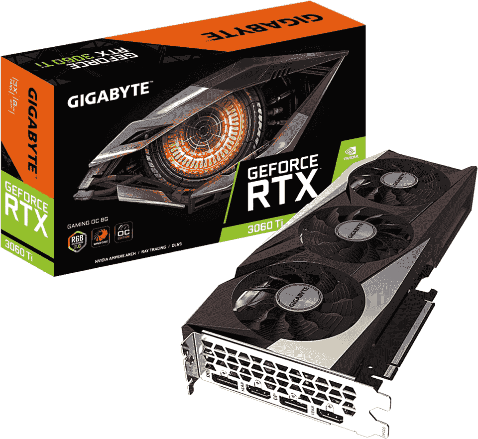
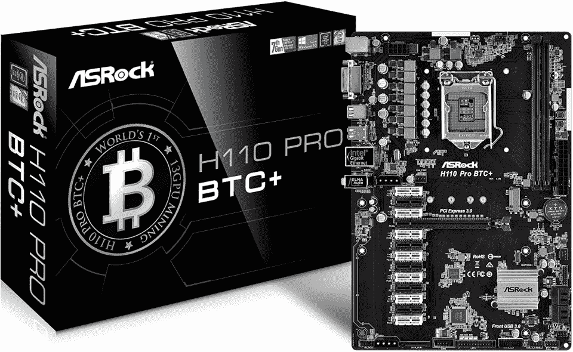
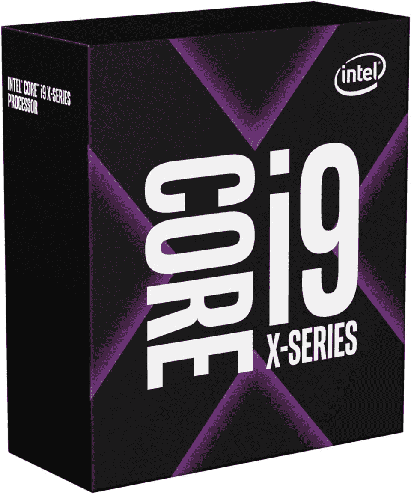
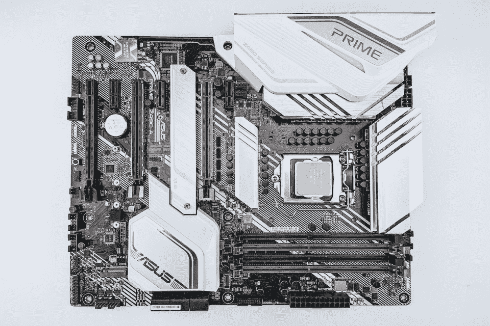
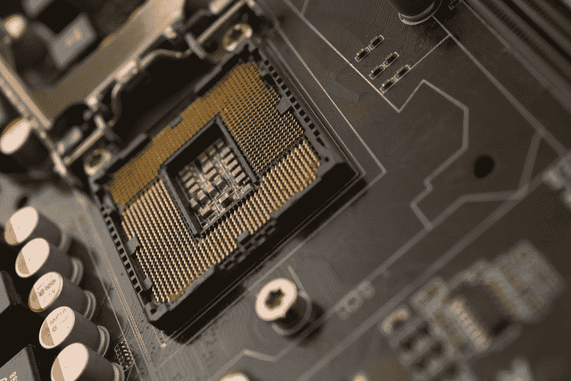
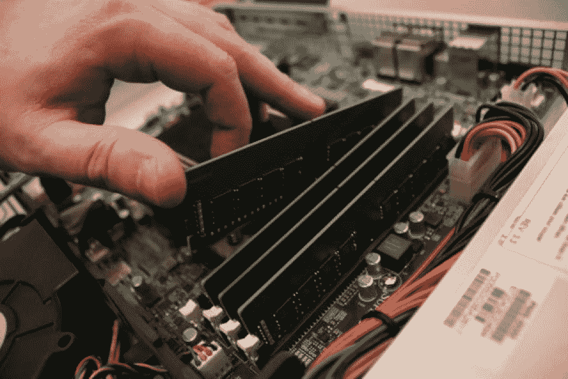
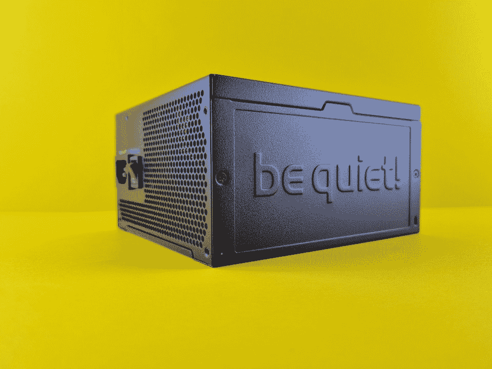
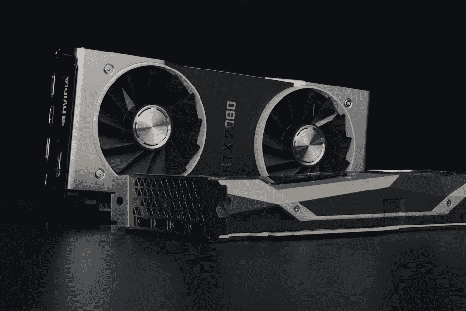

# 如何在 2023 年建造采矿钻机|初学者指南| Hackr.io

> 原文：<https://hackr.io/blog/how-to-build-mining-rig>

加密货币挖掘已经存在多年，始于 2009 年的比特币(BTC)。早些年，比特币开采难度足够低，比特币矿工可以开采大量的数字货币。这使得矿商能够从比特币的升值中赚取可观的利润。

在随后的几年里，一系列其他加密货币以类似于比特币的挖掘模式进入市场。这提供了一个挖掘替代数字货币(替代币)的机会，竞争比比特币少。

无论你选择开采哪种加密货币，你的第一步是购买或建造一个加密开采钻机。在这篇文章中，我们将深入什么是加密货币采矿，什么是采矿钻机，以及如何建立一个采矿钻机。

| **图像** | **钻机组件** | **主要特征** | **链接** |
|  | **GPU**技嘉 GeForce RTX 3060 Ti | 4864 个 Cuda 内核、1410 MHz 内核时钟、8GB GDDR6 256 位内存、WINDFORCE 3X 倍散热 | **[查价格](https://amzn.to/3PevhO1)** |
|  | **主板**华硕 H110 专业版 BTC+ | ATX，支持 13 个 GPU，1 个 PCIe 3.0 x16 和 12 个 PCIe 2.0 x1，DDR4 2400/2133，LGA 1171 插槽 | **[查价格](https://amzn.to/3Hrmt5j)** |
|  | **CPU**英特尔酷睿 i9-10900X X 系列 | 10 个内核，20 条线程，3.7GHz - 4.5GHz，英特尔睿频加速最大技术，19.25 MB 智能高速缓存三级 | **[查价格](https://amzn.to/3YeafD9)** |

## **什么是加密货币挖矿？**

加密货币使用区块链技术来创建由节点组成的去中心化和分布式网络。这些节点中的每一个，无论是由个人还是团体运行，都通过一个称为共识的过程来认证区块链上的数据，从而共同保护网络。

保护这些网络的具体方法各不相同，最流行的两种方法是**采矿**和**打桩**。我们将专注于采矿。

基于采矿的网络使用一种被称为**工作证明**的共识机制。矿工“挖掘”交易数据块，然后将其添加到**区块链总账**。

为了开采这些区块，矿工必须以密码难题的形式执行计算密集型任务。对于他们的努力，他们收到网络的加密货币作为奖励。重复该过程以确保代表最新网络交易的最新分类帐。第一个完成“采矿”任务的矿工将获得奖励。

随着网络上矿工数量的增加或减少，挖掘难度也随之增加。这种机制调节挖掘奖励所需的时间，防止硬币被挖掘得太快或太慢，并确保交易处理时间相对恒定。

如今，采矿需要专门的硬件来执行日益密集的采矿任务。一开始，你可以用普通的计算机硬件来采矿，但难度的不断增加使得没有专门的设备几乎不可能采矿。

事实上，如果你听说过 NVIDIA GPUs 缺货的故事，这是因为矿工购买这些强大的硬件单元来执行采矿！

另一个重要的采矿机制是减半或“减半”。这种想法被用来确保数字货币供应的“稀缺性”，这有助于打击经济通胀(尽管这种做法效果如何是主观的)。

如果以比特币为例，挖矿奖励每四年左右减半。最近一次比特币减半发生在 2020 年 5 月，将采矿奖励从 12 BTC 降至 6.25 BTC。下一次减半预计将发生在 2024 年的某个时候，届时奖金将降至 3.125 BTC。

## **为什么要挖掘加密货币？**

如果采矿需要专门的硬件，而且通常变得越来越困难，你为什么还要费心去做呢？嗯，有几个原因。

首先，你可以选择比特币的替代品进行加密货币挖掘。虽然比特币的挖掘难度可能非常高，但其他“较小”的加密货币可能并非如此。

假设你想知道开采这些其他的密码有多有利可图。在这种情况下，您可以使用在线采矿计算器来估计需要多长时间才能收回您在硬件和电力成本方面的投资。

其次，你开采的加密货币很有可能会升值。发生这种情况所需的时间会因加密市场是处于“牛市”还是“熊市”而异，但在很长一段时间内，它可以提供可观的收入流。

实现盈利需要考虑的两个主要成本是硬件和电费。如果你能挖掘出足够的密码来收回这些费用并获得利润，你可能会看到一个稳定的收入流。

最后，还有一个想法是，你将在保护特定加密货币网络方面发挥作用。如果你相信区块链技术和加密货币的基本原理，这可能很有吸引力。

## 什么是采矿钻机？

加密货币采矿设备是硬件的组合，旨在以最有效的方式执行计算密集型采矿任务。根据采矿设置，这可以通过 CPU、GPU 甚至专用集成电路(ASICs)来实现。

截至 2022 年，CPU 很少用于实际采矿，因为它们几乎完全被 GPU 或 ASIC 采矿钻机取代。这些可能比基于 CPU 的采矿钻机强大几百倍，但它们也贵得多。

归根结底，采矿钻机是一台为特定目的而设计的计算机。如果你想知道如何制作一个加密采矿钻机**，你需要这些组件:**

最重要的是，你需要一个[加密货币钱包](https://amzn.to/3YckM1A)(硬件或软件)来存储你的采矿奖励、采矿软件、可启动的操作系统(Windows、Linux 等)。)加载到一个[闪存驱动器](https://amzn.to/3ULISxu)，一个[监视器](https://amzn.to/3UW1aw8)，当然，还有一个鼠标和键盘来完成软件设置。

## 一台采矿钻机要多少钱？

多种因素决定了你的采矿钻机的预算。到目前为止，GPU 或 ASIC 是该设备中最昂贵的组件，即使是最简单的设置在 2022 年也要花费 1300 美元到 1500 美元之间。

你可能会选择 GPU，因为 ASICs 更贵，但请记住，为了有效地设置，你可能需要至少两个 GPU。

此外，还有不可避免的和持续的电力成本来运行你的钻机，这将取决于你所在的位置。

这里最好的办法是找到你的电费，计算你的钻机 24 小时运行所需的总瓦特数，然后你应该能够估计每月的费用。确保你不要忽视这个成本时，弄清楚你的密码挖掘设置！

## 你能挖掘哪些加密货币？

有几种加密货币可以挖掘。比特币可能是最突出和最受欢迎的选择，但由于巨大的竞争和挖掘难度，这对绝大多数个人来说可能是遥不可及的。

相反，您会希望将注意力转向其他加密令牌，如下表所示。随着时间的推移，每一个奖励块的奖励会有所不同，实际的美元价值取决于代币的当前价格。

但是谁知道如果你能挖掘出一枚受欢迎的硬币或一枚有可能被未来采用的硬币，你会赚多少钱呢？以 DOGE 为例；如果你在 2020 年开采这种矿石，并在 2021 年初价格飙升时卖出，你确实会非常高兴！

| **令牌** | **每区块开采奖励(2022)** |
| Dogecoin (DOGE) | 10，000 多吉 |
| 莱特币 | 12.5 LTC |
| 以太坊经典(等) | 3.2 等 |
| 比特币黄金(BTG) | 12.5 BTG |
| 兹凯什 | 2.5 ZEC(零月) |
| 莫埃罗(XMR) | 1.26 XMR |
| 拉文科恩 | 5000 越南盾 |
| 破折号 | 3.35 DASH |
| 伏特币 | 12.5 职业训练局 |
| 数码宝贝(DGB) | 665 DGB |
| 笑(笑声) | 60 个笑声 |

想要提高你的加密技能吗？

[查看最佳加密货币教程](https://hackr.io/blog/best-cryptocurrency-blockchain-tutorials)

## **如何建造采矿钻机**

 **[https://www.youtube.com/embed/kRKNcyoCSeA](https://www.youtube.com/embed/kRKNcyoCSeA)

视频**

现在你知道了什么是加密货币挖掘，为什么它有用，以及你可以挖掘哪些加密货币，让我们看看如何建立一个挖掘钻机。

我们将专注于构建一个 GPU 采矿钻机，我们将假设您已经从上面的列表中选择了您的组件。

### **1。准备主板**

****

主板是你采矿设备的中心。

首先，您需要将主板放在防静电的表面上。然后你就可以在主板的 CPU 插槽中安装 CPU 了。

### **2。安装 CPU，散热片&风扇**

****

安装 CPU 时要小心。

在进行任何其他操作之前，请确保 CPU 拉杆插座处于松开位置。然后你要把中央处理器放进这个插座。

**重要提示:**确保您可以看到一个箭头，告诉您如何在插槽中定位 CPU。

处理 CPU 时，您需要格外小心，不要弄弯 CPU 针脚，因此请轻轻地将 CPU 放入插槽，然后将拉杆转到锁定位置。

接下来，将导热膏涂在 CPU 的上表面。然后你就可以在 CPU 上安装散热片和风扇了。最后，您可以将风扇的电缆连接到主板上。

**注:**我们建议您参考您的部件手册，了解钻机建造过程中每个阶段的任何具体说明。

### **3。安装闸板**

****

你的采矿钻机不需要太多的活塞。

现在是时候在主板的内存插槽中安装内存了。

首先，打开 RAM 插槽两端的 RAM 支架锁扣。然后，轻轻地但坚定地将内存推入内存插槽。

当末端支架自动锁定在 RAM 模块上时，您会听到咔嗒声，从而知道是否正确安装了 RAM。

### **4。安装主板**

我们会把主板安装在采矿架的下层。

无论您使用的是金属框架，还是您自己构建的木制框架，您都可能希望将主板放在不导电(木制或塑料)的物体上，以防止任何短路或擦伤主板底部。

否则，您必须确保主板只与固定螺丝孔接触。

最后，拧紧主板。

### **5。安装电源单元(PSU)**

****

PSU 为钻机的所有部件提供动力。

接下来，我们将电源装置(PSU)安装在靠近主板的位置。然后，我们可以将 24 针电源线连接到主板，并将 8 针电源线连接到 CPU。

**注:**参考您的 PSU 手册，检查 CPU 的 8 针电缆是否正确。不要将这与 GPU 的 8 针电缆混淆，后者通常更细。

### **6。安装 PCIe USB 接口& GPU**

****

GPU 是采矿钻机的核心。

我们将从 PCIe 竖板开始。

首先，将 USB 竖板的 x1 端连接到主板上的一个空闲 PCIe 插槽；这可以是 x1 或 x16 插槽。

接下来，我们将 GPU 连接到框架的顶部，以确保设备周围良好的气流。然后，您可以将 USB riser 卡的 x16 端连接到 GPU。

riser 卡安装的最后一步是在 x1 和 x16 USB riser 卡之间连接 USB 电缆。这就完成了 GPU 与主板的连接。

这一步剩下的唯一事情就是照顾权力。

首先，您需要将电源线连接到 USB riser 卡的 x16 端(连接到 GPU)。根据您的 PCIe riser 卡型号，这可能是 6 针 PCIe 连接器、15 针 SATA 或 4 针 Molex 电缆。

最后，你需要将 PSU 的 PCIe 6+2 电源线连接到 GPU。

### **7。安装存储(固态硬盘或硬盘)**

现在，您需要选择一个位置来安装您的存储设备(固态硬盘或硬盘)。然后，您需要用 SATA 3 数据线将它连接到您的主板(选择任何空闲的 SATA 3 端口)，它还需要 PSU 的 SATA 电源线。

如果您选择了更新更快的 NVMe 固态硬盘存储，您可以将其连接到免费的 PCIe x16 插槽，无需额外布线。

仅此而已。您已经组装好了您的加密货币采矿设备！

## **如何设置采矿钻机**

现在，是时候专注于设置采矿钻机了。

在做任何其他事情之前，我们需要用合适的电缆(HDMI 或 DP)将 GPU 连接到显示器。然后，我们需要连接鼠标、键盘和以太网电缆来访问互联网。

我们现在准备完成我们的加密挖掘设置。我们来配置矿工吧！

首先，打开你的采矿钻机，然后按 F2 或“删除”进入你的主板的 BIOS 设置。然后按 F7 进入高级设置屏幕。

接下来，我们将配置我们的装备的硬件设置。

*   点击系统代理(SA)配置，选择 DMI/OPI 配置，并**将 DMI 最大链路速度设置为 Gen1**
*   停留在系统代理中访问 PEG 端口配置，并**将所有 PCIEX16_x 更改为 Gen1**
*   进入 PCH 存储配置屏幕，然后**禁用所有未连接到固态硬盘**的【SATA 设备
*   仍在 PCH 配置屏幕中，访问 PCI Express 配置并**将 PCIe 速度设置为 Gen1**
*   进入板载设备配置屏幕，然后**禁用高清音频**控制器设置
*   进入 APM 配置屏幕，然后**将** **【恢复交流电源损耗】设置为【上电】**(此步骤可选)
*   进入 BIOS 引导设置界面，然后**禁用快速引导**和**启用‘4G 以上解码’**

现在，将带有预配置的可启动 Windows 操作系统的 USB 闪存驱动器插入主板上的空闲 USB 插槽。等待它启动，然后按照安装步骤安装操作系统。

**注意:**不要安装 OneDrive 或 Cortana，并确保关闭所有不必要的服务，如位置和广告。

操作系统安装完成后，登录 Windows 并直接访问 Nvidia 网站，为您的 GPU 下载最新的驱动程序。当你安装这些的时候，取消除了图形驱动之外的所有选项(我们不想用不必要的应用和软件来膨胀我们的 miner)。

现在你可以安装你选择的 GPU 采矿软件。按照说明操作，等待安装完成。

最后一步是通过 GPU 采矿软件连接到采矿池，并遵循采矿池网站上的任何说明。

太棒了，你都准备好了，你可以开始挖掘加密货币了！

## **需要牢记的事情**

在构建您的加密挖掘设置之前，有一些事情需要记住。

首先是电费。这对你的采矿设备的盈利能力起着巨大的作用。作为一个保证所有矿工的经常性费用，你需要密切关注它，因为它会侵蚀你的收入。

因此，如果你计划让你的设备硬件 24/7 全天候运行，这导致巨大的电力消耗就不足为奇了。显而易见，知道你的电费是计算你能从采矿中获得多少利润的关键。

当然，您的采矿活动的实际盈利能力取决于加密令牌的当前价值。如果你幸运的话，你将能够驾驭一波疯狂的“牛市”，就像 2020-2021 年那样，这导致了许多密码的巨大升值，包括采矿令牌。

接下来要记住的是冷却。你的装备的硬件组件，尤其是 GPU，会运行得非常热，你必须有效地冷却这些以确保长寿命。

与冷却相关的是采矿钻机的实际物理位置。一般来说，钻机可能是噪音很大的机器，会增加周围的环境温度。

所以，如果可以的话，把你的装备放在它自己的，最好是凉爽的房间里总是一个好主意，因为这可以远离噪音，有助于被动冷却。

对于任何采矿钻机来说，最重要的考虑因素可能是 GPU 或 ASIC 的选择。

不出所料，在这个领域有许多选择，正如你所料，设备越强大，性能越好，价格也越高。如果你正在考虑建立一个 GPU 采矿钻机，但你不确定该选择哪一个，请查看我们关于加密采矿的 8 个最佳 GPU 的文章。

最后，如果你想参与加密挖掘，但不确定你是否准备好建立一个挖掘平台，你也可以考虑云挖掘平台。

这些允许你不需要购买或建立一个物理采矿钻机就可以开采密码，消除了担心电费或硬件维护的需要。你只需购买一份云开采合同，然后就可以出发了！如果你对此感兴趣，可以看看我们关于 8 个最佳云开采网站的文章。

## **故障排除**

让我们来看看几个常见问题及其解决方案，您可能需要在某个时候对您的采矿钻机进行故障排除。

| **问题** | **解决方案** |
| 钻机无法启动 | 显示正常吗？是:CPU 故障、GPU 故障或 GPU/CPU 连接故障；否:启动驱动器故障，数据损坏 |
| GPU 无法识别 | 检查 PCIe 提升器和电缆，检查 GPU，检查 PSU 连接和电缆，重新安装 GPU 驱动程序 |
| 钻机坠毁 | 检查 PSU 是否提供足够的电源，检查超频设置，将 Windows 操作系统重置为出厂设置，检查 BIOS 设置 |
| 钻机过热 | 检查 GPU 冷却风扇，检查 CPU 风扇，检查超频设置，确保足够的房间通风 |

## **结论**

自 2009 年比特币发布以来，加密货币挖掘越来越受欢迎，但挖掘难度和竞争的不断增加意味着比特币挖掘对业余爱好者或个人矿工来说变得越来越不容易。

尽管如此，有抱负的加密矿工可以从其他几种加密货币中进行选择，竞争更少，前期硬件成本更低。

本文介绍了如何在 2022 年为 crypto 构建一个采矿平台的关键步骤。这包括您将需要的主要硬件组件，如何将这些组件连接在一起以创建挖掘装备，以及如何配置您的新装备以开始挖掘加密令牌。

**想了解更多关于区块链技术的信息吗？结账:**

**[最好的区块链课程](https://hackr.io/blog/best-blockchain-courses)**

**或:**

**[区块链编程分步指南](https://hackr.io/blog/blockchain-programming-beginners-guide)**

## **常见问题解答**

#### **1。建造一个采矿钻机要花多少钱？**

采矿钻机的成本可以根据你希望它有多强大而有所不同。一般来说，你可以预计它在 2022 年的价格在 1300 美元到 1500 美元之间。

#### **2。6 GPU 矿用钻机能赚多少？**

6 GPU 采矿钻机有 5-10%的利润潜力。但是，这涉及到许多因素，包括电费和代币的当前或未来价值。

#### **3。2022 年造矿钻机值得吗？**

一些加密货币在 2022 年开采仍然有利可图。但是，您必须计算硬件投资和持续的电力成本是否值得。

#### **4。对我来说最有利可图的密码是什么？**

比特币(BTC)、Monero (XMR)和 Dogecoin (DOGE)是一些更受欢迎和更有利可图的加密货币。但是，您需要自己计算，看看钻机的硬件投资和持续的电力成本需要多长时间才能实现盈利。

#### **5。一台采矿钻机需要多少夯锤？**

在 2022 年，对于加密货币采矿设备来说，4 到 16 GB 的 RAM 应该没问题。初学矿工用 8gb RAM 应该没问题。