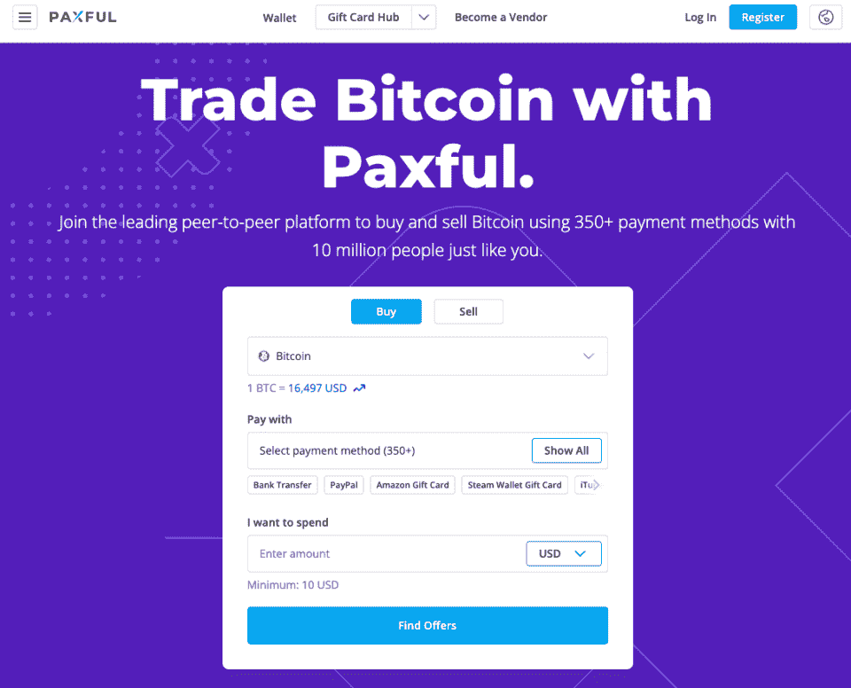
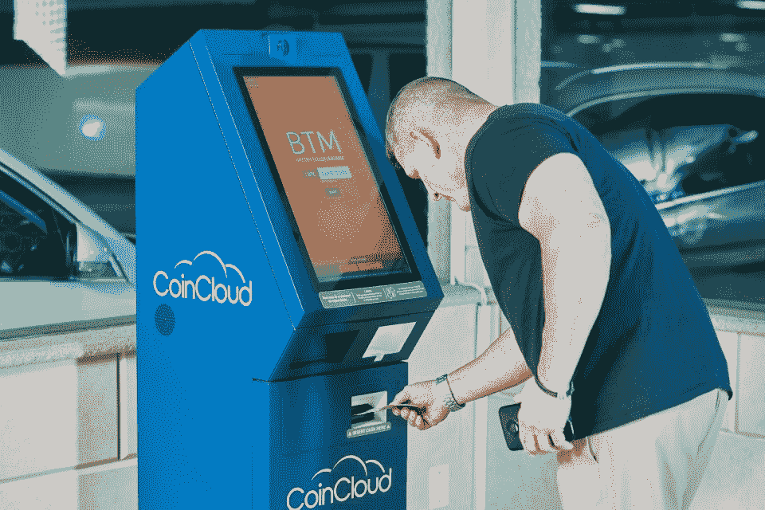
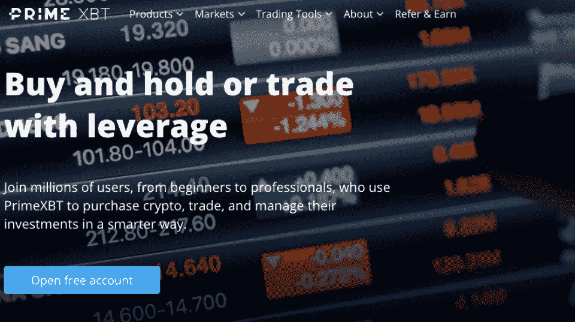

# 如何用借记卡购买比特币【无验证】

> 原文：<https://hackr.io/blog/how-to-buy-bitcoin-with-debit-card>

加密货币(crypto)市场因其涨跌而闻名，是最不稳定的投资类别之一。尽管如此，个人(散户)、冒险公司，甚至几个国家对购买比特币的兴趣比以往任何时候都大(BTC)。

无论是寻求对冲其他经济市场的波动，将其用作价值储存手段，还是从其著名的快速升值中获利，投资者都希望在这一新型资产类别中分得一杯羹。

对许多人来说，匿名购买比特币的选择非常有益，因为这可以帮助他们避免当局不必要的关注，同时也允许他们保持金融交易的私密性。这在购买比特币不容易的几个国家(包括许多将受益于加密货币的国家)尤其有用。

在世界上许多国家开始出现加密法规的时候，匿名购买比特币有很多选择。本指南将向你展示如何用借记卡购买比特币，无需验证。

## **为什么匿名购买比特币？**

在许多国家，比特币要么是非法的，要么受到严格限制。在某些国家，使用比特币交易的人甚至有可能受到严重影响。

具有讽刺意味的是，往往是这些国家严峻的经济问题首先说服了他们的公民购买没有 ID 的比特币。

另一方面，在一个日益公开的世界里，有些人希望尽可能多地保护隐私，无论是在社交媒体上还是在他们的财务生活中。

在大数据时代，金融交易可以提供关于一个人及其习惯的大量信息。所以，对于一些人来说，选择隐藏这些信息是非常有吸引力的，这并不奇怪。

## **买比特币没有鉴定很难吗？**

虽然不经鉴定就购买 BTC 变得越来越困难，但这并非不可能，也永远不会。

我们必须记住，比特币是一个分散的点对点(P2P)网络，采用工作证明(PoW)区块链技术构建。这意味着它不能被一个人或实体关闭或控制(如果你想了解更多，请查看我们的[比特币教程](https://hackr.io/tutorials/learn-bitcoin))。

正如我们将看到的，有几个 P2P 平台可以用来匿名购买比特币，以及其他一些选择。

我们将在本文中介绍的每种方法都有优点和缺点，但它们的一个共同点是能够在不验证和不提供任何个人信息的情况下购买加密。

## **用借记卡去哪里买比特币，不需要验证**

以下选项是无需验证即可购买比特币的一些最可靠的方法。每一个都有利弊，所以在决定购买 BTC 之前要仔细考虑。

### **1。P2P 市场**

****

P2P 市场是你可以通过与其他个人(比特币持有者)直接交易，在没有验证的情况下即时购买和发送比特币的地方。这些市场允许你用借记卡购买 BTC，有些甚至允许现金交易(尽管你应该小心任何购买比特币的面对面会议)。

比特币最受欢迎的两个 P2P 市场是 Paxful 和 LocalBitcoins。

如果你使用 Paxful，你可以选择使用借记卡，也可以在没有验证的情况下用信用卡购买比特币。LocalBitcoins 允许你用预付借记卡购买 BTC。无论你选择哪个平台，这两个平台都可以匿名购买比特币。

P2P 市场的一个关键特征是，卖家会收取 1%的交易费。因此，从这些市场购买时，BTC 价格往往会略高。

### **2。比特币 ATM**

****

如果你在美国或加拿大，你可以在比特币自动取款机上购买 BTC(它的工作原理和普通的自动取款机一样)。虽然全球有近 39，000 台比特币自动取款机，但大多数位于这两个国家。但是，你可以使用[硬币自动取款机雷达](https://coinatmradar.com/)来检查你身边是否有一个。

比特币自动取款机不会要求了解你的客户(KYC)信息，这意味着你使用借记卡立即购买比特币，无需验证。然而，这种方法会给你带来特别高的费用，因为交易费可能在 8%到 20%之间。

### **3。预付卡**

预付卡也是购买无 ID crypto 的一种选择，非常适合匿名购买比特币。

因此，无论你是收到一张这样的卡还是在当地商店购买，你都可以在任何接受它的平台上使用礼品卡来换取 BTC。事实上，一些商家甚至提供预付比特币代金券。

### **4。加密交换**

****

几个无 ID 加密交易所将允许你在没有任何身份验证的情况下购买比特币，尽管这里的选项数量正在减少。

关于 KYC 的确切规则往往会有所不同，如果你不符合他们的 KYC 要求，一些交易所甚至会设置提款限制。

不需要 KYC 验证的最受欢迎的交易所之一是 PrimeXBT T1。这没有提款限制，而且每笔交易的固定佣金率是 0.05%。

另一个常见的选择是 2018 年推出的 [AscendEx](https://ascendex.com/en) (原 BitMax)。该交易所提供了 2 BTC(不含 KYC)的慷慨每日提款限额，允许个人匿名交易比特币。所有交易的佣金率是 0.085%。

还有 TradeOgre，这是市场上较老的交易所之一，对所有交易收取 0.2%的费用。这种交换对于投资其他加密货币也很有用。

#### **用借记卡匿名网购 BTC&无身份证**

| **平台** | **特性** |
| Paxful (P2P) | 借记卡和信用卡支付，没有 KYC，没有身份证 |
| 本地比特币(P2P) | 借记卡支付，没有 KYC，没有身份证 |
| PrimeXBT 交易所 | 没有 KYC，0.05%的费用，BTC 的成本比 P2P 低 |
| 上行交换机 | 无 KYC，0.085%的手续费，每天最多可提取 2 个 BTC |
| 悲剧交易所 | 旧的交换，0.2%的费用，并可以购买其他密码 |

## **匿名购买比特币的技巧**

匿名购买比特币时，有几件事需要记住。其中最重要的是检查你使用的平台是否安全。总的来说，已经执行了几千笔交易的经验证的平台是安全的。

然而，总有一点点可能出错，所以一定要做自己的研究(DYOR！).

您还需要确保平台不会在购买过程的任何阶段要求您提供个人身份信息。有些平台给自己贴上私密的标签，然后却要求提供身份信息。

最后，购买一个硬件钱包作为你的“冷”钱包(长期存储)总是最好的做法。这样做有几个原因，但最重要的是安全性、隐私性和方便访问您的 BTC，如果您以后想出售它。

## **结论:可以用借记卡买比特币，不需要验证**

比特币在个人、公司甚至国家用户中的持续增长证明了这种加密资产作为投资类别的成功。

在经历一个 KYC 过程后，有许多方法可以购买 BTC，但对于那些喜欢隐私的人来说，用借记卡和无验证购买比特币是可能的。我们希望本文中的信息，包括匿名购买比特币的具体方式，能够对你有所帮助。

**[了解更多关于比特币的信息](https://hackr.io/tutorials/learn-bitcoin)**

**[上区块链课程](https://hackr.io/blog/best-blockchain-courses)**

## **常见问题解答**

#### **1。用借记卡买比特币可以不用验证吗？**

是的，你可以用借记卡购买比特币，并且不需要验证。有几种方法，本文展示了如何使用 P2P 市场、ATM、预付卡和加密交换购买无 ID 加密。

#### **2。没有验证 ID 在哪里可以买到比特币？**

你可以在 P2P 市场、自动取款机、预付卡和一些交易所购买没有验证 ID 的比特币。

#### **3。信托钱包需要验证吗？**

不，信任钱包不需要 KYC 验证。这是一个非保管钱包。

#### **4。我可以在没有验证的情况下在比特币基地上购买比特币吗？**

不，你不能在没有验证的情况下在比特币基地购买比特币。比特币基地严格关注合规性。

#### **5。如何在处理加密货币的同时提高私密性？**

为了在处理加密时提高隐私性，请使用 VPN，并且永远不要共享您的个人信息，包括任何种子短语。尝试在 P2P 市场上交易，并使用非托管(最好是硬件钱包)钱包进行存储。

#### **6。用信用卡买比特币安全吗？**

是的，用信用卡买比特币是安全的。一些平台允许你这样做，但是如果你想保持匿名，我们推荐 P2P 市场选项。