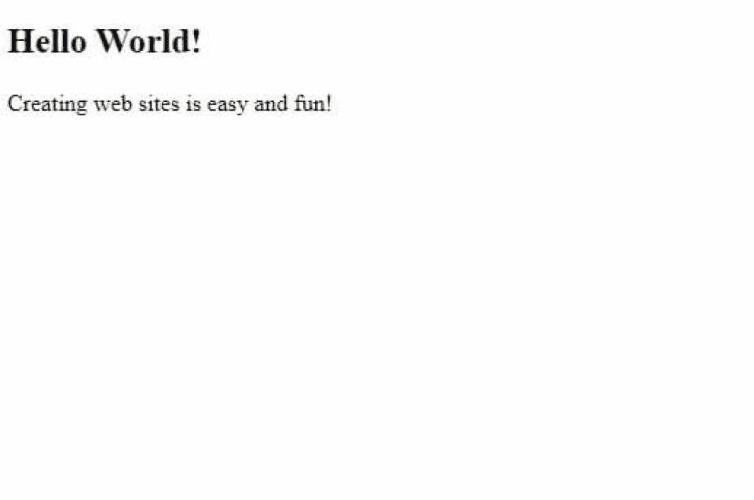
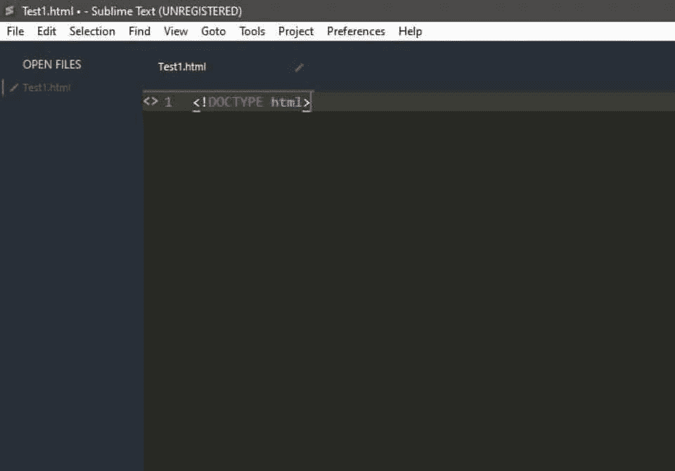
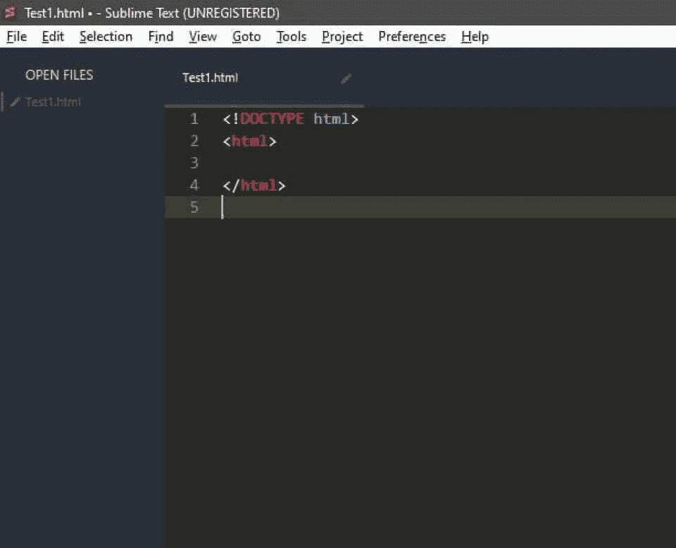
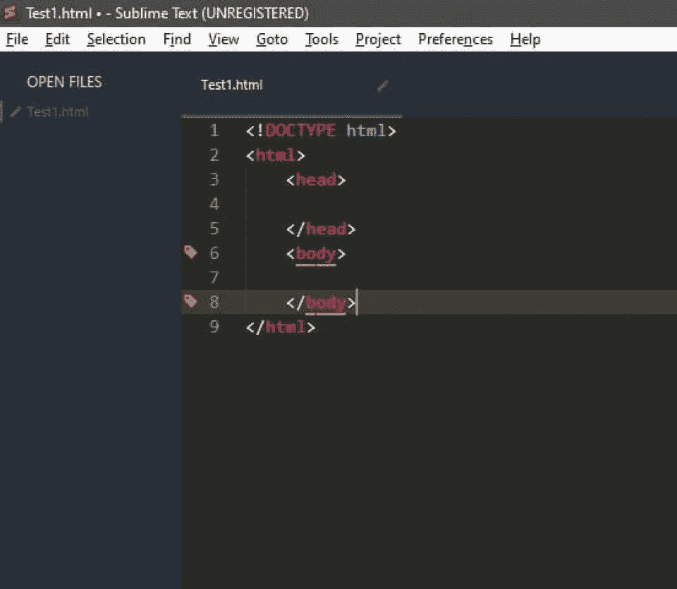
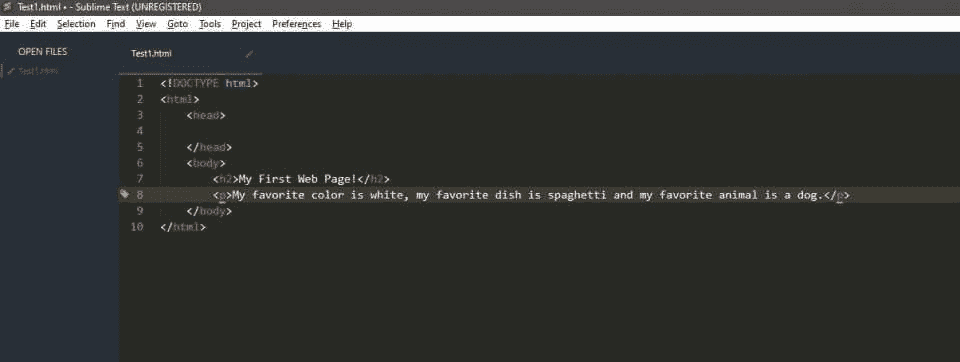
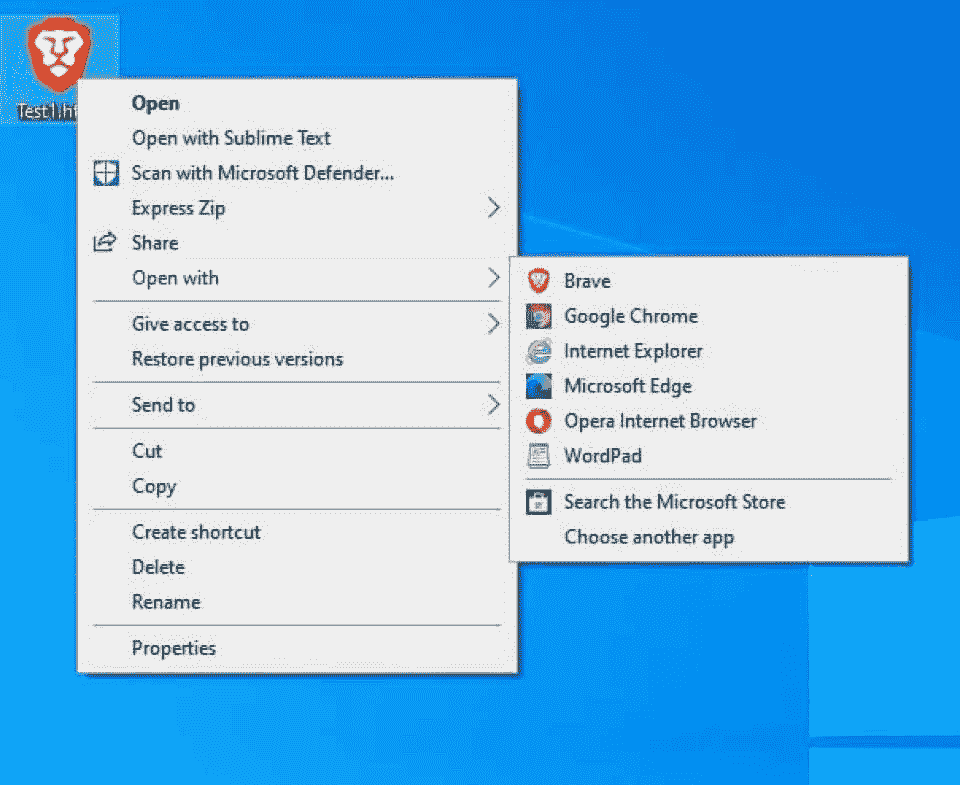

# 如何使用 HTML - Hackr.io 创建网站

> 原文：<https://hackr.io/blog/how-to-create-a-website-using-html>

在上一个教程中，我们简要介绍了客户端和服务器网络模型是如何工作的，并通过一个简短的演示介绍了如何创建一个 [WordPress](https://wordpress.com/) 网站。你也应该对 HTML、 [CSS](https://hackr.io/blog/types-of-css) 和 JavaScript 的功能有个基本的概念。

本课将重点讲述如何使用 [HTML](https://hackr.io/blog/html-cheat-sheet) 创建一个网站，教你标记语言的各种元素，以及它们如何组合起来构建和创建一个简单的网页。

虽然创建 WordPress 网站(或任何其他平台上的网站)有用且方便，但它们也有缺点。在学习 web 开发的过程中，你必须学会如何使用 HTML、CSS 和 JavaScript。了解这些如何工作也会让你更擅长 WordPress 开发。

学习 HTML 将是你创建网站的第一大步，你将独自完成所有的事情。这里的重点将只放在 HTML 上，因为 CSS 和 JavaScript 是两个更广泛的主题，更适合它们自己的教程。您将了解什么是 HTML 以及创建基本 HTML 页面的工具，并查看如何使用 HTML 创建网站的分步过程。

## **什么是超文本标记语言(HTML)？**

**超文本标记语言** ，简称 **HTML** ，是一种描述网页应该如何构造的语言。HTML 规定了什么是内容的主体，以及文本应该放在哪里。换句话说，HTML 决定了内容的显示和顺序。

一个网站只是一系列网页，通过内部链接、按钮、文本等等连接在一起——所有这些都是“元素”

层叠样式表是一种语言。HTML 和 CSS 是携手并进的，毕竟，你不希望网页看起来像这样:

这是只用 HTML 创建的——没有 CSS。

但是我们将把 CSS 的设计能力留给后面的教程。让我们继续讨论 HTML 的重要部分: **元素和标签。**

整个 HTML 文档只是由一系列元素组成。在大多数情况下，这些元素是由开始和结束标记定义的。例如，您创建的第一个元素将是:

<HTML>

。

。

。

< /HTML >

HTML 元素是该页面的根元素，由开始标签< HTML >和结束标签< /HTML >定义。

结束标签是通过在元素名前加一个正斜杠来定义的。一些元素没有结束标签，这些被称为单例标签。一个常见的例子是< img >，它在网页上显示来自某个来源的图像。

一个基本的网页包含哪些元素？

## 如果你想知道如何制作一个网页，你需要知道你需要包含哪些元素。从技术上讲，开始创建网页所需要的只是最简单的 HTML 元素。一个基本的 HTML 页面总是你创建网站的起点。

大多数 HTML 页面都有一组公共组件，它们是使用我们前面提到的元素创建的。这些组件通常如下:

表头

*   页脚
*   导航栏
*   主要内容
*   对于我们今天要练习的演示，我们将着重于创建一个只有正文内容的页面。

**总结一下，你开发的每个网站都会包含以下元素:**

<！博士类型>t1

*   HTML 标签
*   头部标签(不要与标题混淆！)
*   身体标签
*   标题(< H2 >、< H3 >、< H4 >等。)
*   在本练习中，我们将利用所有这些元素来创建一个显示文本信息的简单网页。在整个练习中，我们将了解更多关于这些元素的内容。

了解一些最常见的 HTML 标签是很有价值的，因为你在学习如何创建网站的过程中会经常用到它们。如果你还不确定如何使用其中的一些，不要担心；这只是有用的参考，当然，你可以在需要的时候谷歌这些(这是被鼓励的)。它很快就会变成第二天性。

以下是一些最常用的标签:

**html>...< /html > :** 文档的根，指定文档为 HTML

*   **<头>...< /head > :** 包含关于文档的元数据，包括样式、脚本、字符集和标题等

*   **T4>车身...< /body > :** 定义文档的主体，所有的内容都指向该主体，包括标题、段落、链接和图像

*   **<标题>...< /title > :** 定义网页的标题

*   **< h2 >...< /h2 > :** 将文本定义为标题，可以是 h1 到 h6 之间的任何内容

*   **< p >...< /p > :** 将内容定义为一个段落

*   **< a href =" " >...< /a > :** 定义一个链接在引号内的超链接。开始和结束标签之间的文本将作为超链接

*   **< img src = " " > :** 定义图像，图像来源在引号之间

*   **< b >...< /b > :** 加粗标签之间的文本

*   **<我>...< /i > :** 将标签之间的文本设为斜体

*   **< u >...< /u > :** 给标签之间的文本加下划线

*   **创建 HTML 页面的工具**

## 记事本、写字板和微软 Office 都有文本编辑器的功能，只不过它们更有目的性一些。 **代码编辑器** 像 Sublime Text、Atom、Vim 和 Notepad++都是流行的代码编辑器的例子。其中许多都有免费版本，可以很好地满足你的目标，所以选择你喜欢的吧！

首先，你只需要一个代码编辑器。但是，请注意，一旦您开始使用 CSS 和 JavaScript，您可能会希望使用一些有用的工具来使这个过程更加方便。

现在，下载一个代码编辑器，并按照下面的指导进行操作。如果不知道该挑哪个，那么 [威震文字](https://www.sublimetext.com/) 对于初学者来说是个不错的选择。

如何使用 HTML 创建网站:一步一步来

## 遵循这些步骤，你马上就会知道如何用 HTML 创建一个简单的网页。

**步骤 1:在代码编辑器中，将 Doctype 定义为 HTML**

### 打开你的代码编辑器，创建一个新文件。将此保存为“name.html”，其中的名称可以是您喜欢的任何名称。

你所有的 HTML 文档都将以 **<开头！DOCTYPE >** 声明。这只是告诉您的浏览器这个文档是什么类型的文件。在这种情况下，它是一个 HTML 文件。

我们将文档声明为 HTML 文件，如下所示:

<！doctype html>t1 的类型

在您的代码编辑器中，它看起来会是这样的:

****

**T4！DOCTYPE >被认为是元标签。** 旧版本的 HTML 还有其他的文档类型，但是你不需要担心这些。只要记住 DOCTYPE 通知你的浏览器这是一个 HTML 文件。

现在我们将继续添加 **HTML 标签** ，所有其他元素都将位于其中。你的文本、标记信息、信息— *一切* 都在 HTML 标签下。它通常被称为 HTML 文档的“根”。

HTML 标签有开始和结束标签，定义如下:

<html>

< /html >

你的 [代号](https://hackr.io/blog/coding-for-beginners) 现在应该是这样的:

**第三步:添加头部和身体标签**

### 将我们的文档定义为 HTML 后，我们现在可以添加网页的**【head】**和【body】。这些放在 HTML 标记中，您应该记住它是根标记。

标题代表一个可以添加元数据的部分。这些东西就像你的标题(你在浏览器标签上看到的)，链接的样式表和脚本。在我们的练习中，我们将把它留为空白，但是继续定义 head 部分如下:

<脑袋>

</头>

正文部分是用户浏览的所有内容的去处。你的文本、图像、按钮——所有可交互的元素都在这里。您可以这样定义主体部分:

<正文>

</正文>

你的 HTML 页面现在应该进展顺利了。应该是这样的:

**第四步:添加标题和段落**

### 现在我们将向网页添加一些文本。如果你以前在博客上工作过，你们中的许多人可能已经熟悉了 **的标题和** 的段落。标题是分隔章节的“大文本”,段落是跟随和解释一个观点的常规文本。

但是标题和段落在网络上有更大的用途，告诉搜索引擎如何阅读网页。出于这个原因，当你设计一个网站时，你应该在页面上包含一组明确定义的标题。

有六种标题:h1、h2、h3、h4、h5 和 h6。它们的大小依次减小。标题的实际文本将位于标签之间。通常你会看到标题相互嵌套，例如，h3 标题在 h2 标题之下，这只是一种组织文本的方法。

您可以如下定义标题:

<H2></H2>

< h3 > < /h3 >

您可以类似地定义其他标题。继续将 h2 标签添加到 HTML 文档中，并在其中添加一些文本。

接下来，我们将在页面上添加一段文字。大量的文本放在段落标签中，定义如下:

将段落标签添加到文档中，并将您喜欢的颜色、菜肴和动物作为文本放入其中。应该是这样的:

就是这样！我们现在有了第一个网页。这是一个简单的，但它绝对是一个网页！

**第六步:在浏览器中加载网站**

### 当然，你会想看看你的努力是什么样的。用浏览器打开保存的文件，瞧！如果您已经将文件保存为 html 文件(如第一步中所述)，那么您需要做的就是双击该文件，使其在浏览器中打开。您也可以右键单击该文件，单击“打开方式”并从列表中选择一个浏览器。如果你不确定，请看下图。

你的网页应该加载，在服务器上，它看起来像这样:

**结论**

## 当然，这只是开始。有多少网站看起来像你刚刚创建的那个网站？ **HTML 只定义了网页的结构，没有定义它的外观。**

**[如何创建网站:一个 HTML 教程和 CSS 教程](https://click.linksynergy.com/link?id=jU79Zysihs4&offerid=1045023.957422&type=2&murl=https%3A%2F%2Fwww.udemy.com%2Fcourse%2Fhtml-tutorial%2F)**

为了美化你的网页，你需要更多的 HTML 元素或 CSS，这两者都会给你的网页增加风格，从颜色和按钮到进度条。CSS 也很容易学习，但是当我们在后面的课程中回顾页面样式背后的一些基本概念时，你就会明白了。

现在，继续使用 HTML，看看你还能在你的网页上添加什么。它可以是一张图片，一个文本字段，项目列表——还有更多，谷歌 HTML 标签会教你很多。

如果你想利用你的 HTML 技能来建立自己的网站，我们建议你使用 name cheap[购买域名](https://www.namecheap.com/?clickID=wUoTbQ3KtxyNR9L3K50RiSEKUkAx6n2NkXBZwI0&irgwc=1&utm_source=IR&utm_medium=Affiliate&utm_campaign=2890636&affnetwork=ir&ref=ir)和[虚拟主机服务](https://www.namecheap.com/hosting/shared/?clickID=wUoTbQ3KtxyNR9L3K50RiSEKUkAx6E09kXBZwI0&irgwc=1&utm_source=IR&utm_medium=Affiliate&utm_campaign=2890636&affnetwork=ir&ref=ir)。它们是业内最好的，而且超级实惠。

[用 HTML 探索更多](https://hackr.io/blog/best-html-courses)

[Explore More with HTML](https://hackr.io/blog/best-html-courses)