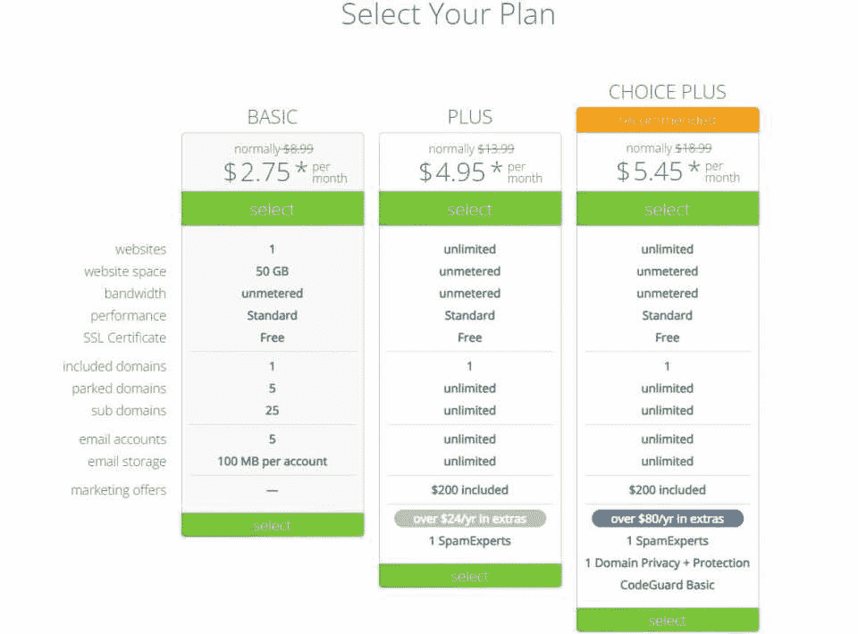
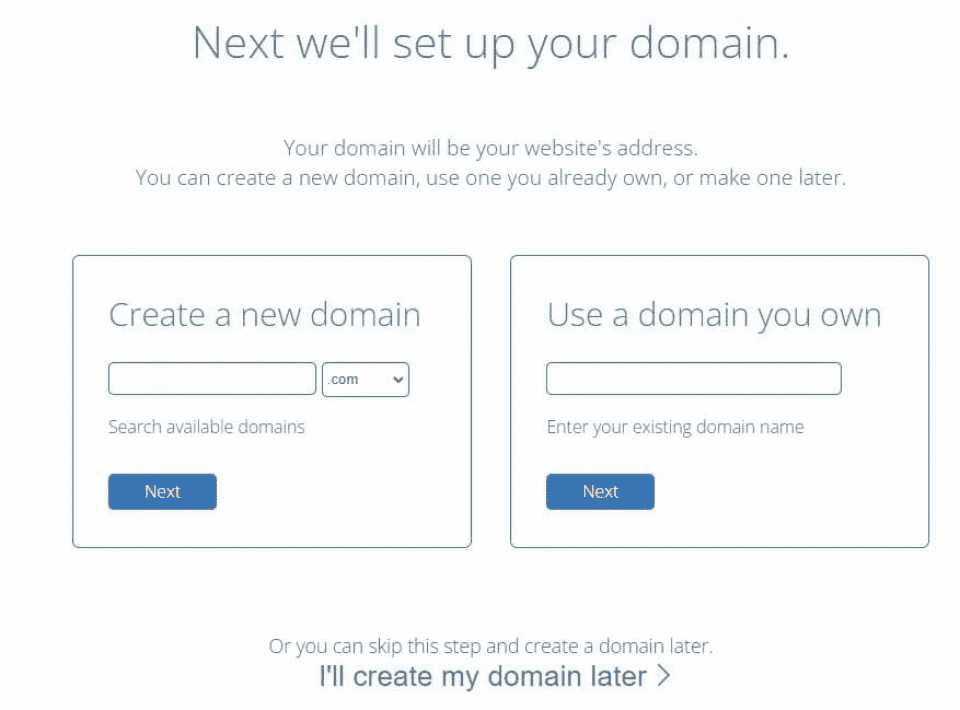
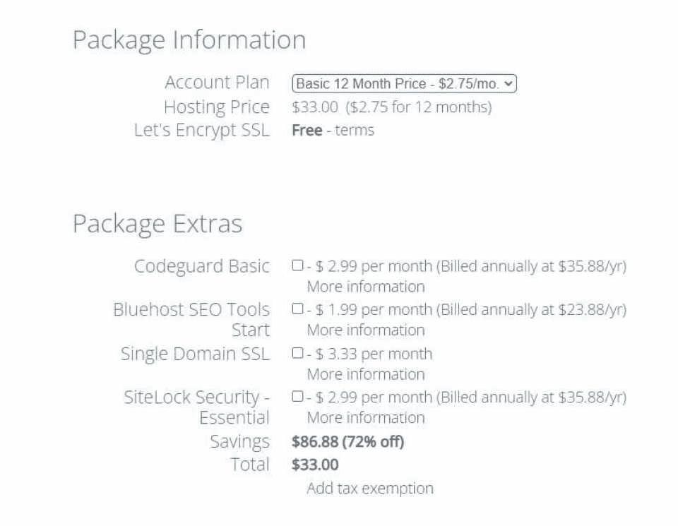
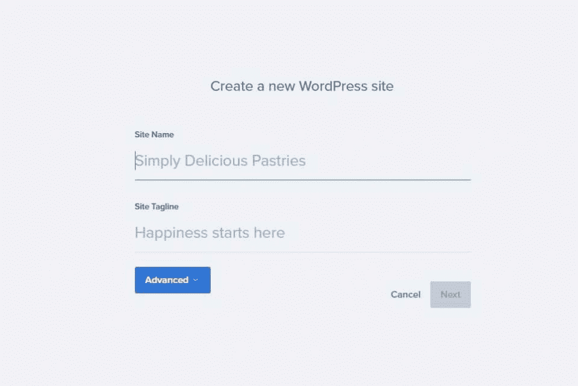
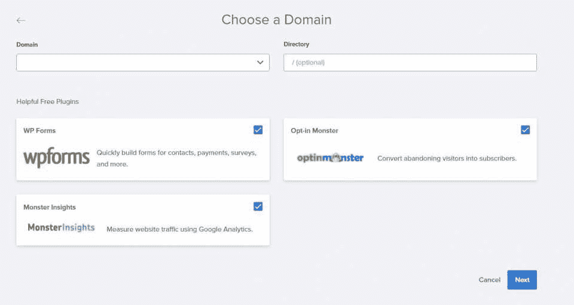
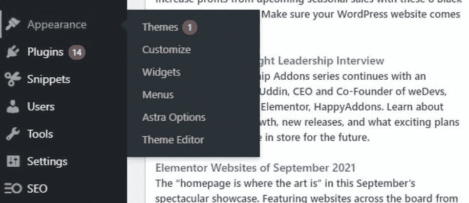

# 如何创建网站-一步一步的指南- Hackr.io

> 原文：<https://hackr.io/blog/how-to-create-a-website>

如今，无论是小型企业还是大型企业，以及任何想要发展品牌的人，网站都是必不可少的。而且，现在创建网站比以往任何时候都更容易。但许多企业都在网站建设的威胁中挣扎，包括制作过程和成本。

幸运的是，整个过程从头到尾都很容易获得，很划算，而且很流畅，有许多有用的平台可用。事实上，有些解决方案是简单的拖放式解决方案，可以帮助你在一天之内创建一个基本但实用的网站！

虽然这些平台非常方便，但了解如何从头开始创建网站也是值得的。从长远来看，这些知识会给你带来许多优势，这些优势是打包解决方案所不具备的。

我们的重点是教你如何制作一个网站，分享你制作网站所需技能的信息，并解释网络作为一个整体是如何运作的。

我们将从如何用像 WordPress 这样的内容管理系统(CMS)建立一个网站的入门书开始，以如何使用 HTML 从头开始建立一个网站的教程结束。

## **创建网站有几种方法**

网站开发已经发展成为一种实践，足以让平台为你包装整个过程。WordPress、Wix、Squarespace——这些都是最知名的平台，它们驱动了所有网站的很大一部分。

使用 WordPress 等工具，你可以轻松地创建从电子商务平台到博客的任何东西，因为它们消除了许多与网站创建相关的痛点。

例如，你不必分配时间和精力来确保你的网站对不同的设备做出响应，因为 WordPress、Square 和 Wix 都为你做了这些。您还可以自由添加有用的第三方工具。最有吸引力的好处是价格——这些平台也比雇佣一个网络开发者更便宜。

但是如果你 [学习流行的标记和编程语言中的编码](https://hackr.io/blog/what-is-coding-used-for) ，你可以做的比上述平台多得多。编码将为你的网站提供更多的可定制性和控制，更好的搜索引擎优化和更容易的故障排除。

## 网络到底是如何工作的？

如果你打算学习如何创建一个网站，那么了解网站的工作原理是很重要的。

两个主要实体描述了计算机如何与网络交互: **客户端和服务器** 。前者可以是你的网络浏览器或手机，而后者只是另一台包含网站上所有信息的电脑。

你可能会注意到，网站可能需要一些时间来加载——这是因为服务器正在努力工作，为你的浏览器(客户端)提取媒体和应用程序。

网站地址也是通过互联网协议(IP)地址存储的——那些像 192.168.1.1 这样的长串数字。但是就像你可能会记住联系人的名字而不是号码一样， **域名系统** 使得访问网站变得很方便。Hackr.io 是我们的 IP 地址的名称，这是一种访问我们唯一的 IP 地址的可读方式。

**HTTP 和 TCP/IP 协议** 本质上是客户端和服务器用来相互通信的语言。HTTP 定义了客户端和服务器之间的通信标准，而 TCP/IP 决定了数据如何在互联网上传输。

综上所述，域名解析系统获取你输入的网站名称，通过客户端访问，并查找网站服务器的真实地址。如果网页是可访问的，客户端要求服务器通过 HTTP 和 TCP/IP 协议发送存储的信息。然后，网站开始在您的浏览器(客户端)上加载。

但是网站本身呢？它们是使用超文本标记语言(HTML)、级联样式表( [CSS](https://hackr.io/blog/best-css-frameworks) )和[JavaScript](https://hackr.io/blog/how-to-learn-java)以及其他技术构建的。

## **建立一个网站需要什么**

不管你是决定为你的网站使用一个平台，还是从头开始，你都需要一些资源，这些资源会产生一些成本。然而，运营一个网站所需的最低成本是可以承受的。在价格范围的低端，预计每年支付不到 100 美元。

本教程着重于使用 WordPress 建立一个简单的网站。您将看到下面的所有步骤，我们将很快对每个步骤进行更详细的介绍。

**第一步:** 选择一个平台

**第二步:** 选择域名

**第三步:** 选择一个托管服务

**第四步:** 安装 WordPress

**第五步:** 定制你的网站

## 如何创建网站:一步一步来

现在你已经准备好了所有的工具，你该如何创建一个网站呢？我们将在这里使用 Bluehost 来引导您完成这个过程，但是您也可以使用 **任何[托管服务](https://www.cloudways.com/en/?id=1347120)** 并且步骤是相同的。按照这些步骤创建一个网站，在接下来的一个小时内，你将拥有自己的网站！

### **第一步:选择平台**

我们将使用 WordPress，但你也可以选择 Wix、Joomla 或 Squarespace，体验相对相似的创建过程。WordPress 是最受欢迎的选择之一，拥有几乎无穷无尽的定制选项。用这些平台中的任何一个来构建你自己的网站都非常简单，不需要任何编码经验。

### **第二步:选择域名**

接下来，你必须选择你网站的名字，也就是域名。你可以从几个地方买到域名，包括 T2、Bluehost、GoDaddy、DreamHost 和谷歌域名。如果尚未声明，您可以创建自己的。努力让你的脱颖而出！

对于域名扩展，你会有几个不同的选择，但是要坚持“.就目前而言。下一步，我们将在 Bluehost 上注册您的域名和网站文件。

### **步骤 3:在托管服务上注册**

有几种虚拟主机服务可供选择，如 [Cloudways](https://www.cloudways.com/en/?id=1347120) 、Bluehost、HostGator、GoDaddy、DreamHost 和 SiteGround。一些服务为托管主机提供多种选择。例如，Cloudways 允许你从几个[托管包](https://www.cloudways.com/en/pricing.php?id=1347120)中进行选择。这些公司在 Digital Ocean、AWS、Google Cloud 和其他流行的云服务器上提供服务器。下面，我们将继续 Bluehost 的教程。

转到 [Bluehost](https://www.bluehost.com/) ，点击“立即开始”创建账户然后你会被要求选择一个计划，基本计划每月 2.75 美元。这将是你的第一笔开销。

接下来，你会被要求设置你的域名。如果您还没有域名，请在“创建新域”栏中输入域名。如果您已经有域名，请在“使用您拥有的域”下输入它

### **第四步:确认购买您的域名和托管服务**

下一个屏幕将要求您确认购买。忽略你可以支付的额外服务，因为你总是可以在以后添加它们。完成购买后，是时候在你的新域名上设置 WordPress 了！

### **第五步:安装 WordPress 并登录你的 WordPress 网站**

下一步是将 WordPress 实际安装到你的域名上。在 Bluehost 仪表板上，点击“创建一个 WordPress 站点”按钮。您将被要求输入一个站点名称(不同于域名)，您想要链接到该站点的电子邮件地址，以及一些关于凭据的信息。

现在，从下拉菜单中选择您购买的域名。您可以取消选中任何可能被选中的插件。点击“下一步”

就是这样！几秒钟后，你就会在这个特定的域上自动安装 WordPress。

接下来，您可以登录网站进行定制和添加内容。

**有两种方法可以访问你的 WordPress 网站** ，要么通过 Bluehost 点击登录按钮，要么进入“websitename.com/wp-admin”并输入相应的凭证。

### **步骤 6:用主题、插件和内容定制你的网站**

现在是时候定制您网站的外观并添加插件了！首先选择左边“外观”选项下的“主题”。它会向你展示各种可用的主题，这些主题会对你的网站的外观产生巨大的影响。

您也可以在安装后通过点击“外观”下的“定制”来定制主题你可以改变一切，从颜色到布局，等等。

这里有很大的灵活性，值得尝试一下视觉特性，看看什么有效。

你也可以选择左边“外观”下的“插件”来安装插件。

最后，你可以点击左边的“添加新内容”来创建“文章”和“页面”。这是您添加基本内容的地方。一篇文章是一段内容，就像一篇博客文章，而一个页面可能包含多种内容。

您可以点击左侧面板上的“页面”，然后点击“添加新页面”来添加页面您可能已经注意到，许多网站都有类似“关于我们”和“联系我们”的公共页面，您也可以创建类似的页面。

恭喜你！你已经完成并创建了你的第一个 WordPress 网站。你可以从内容和设计着手。

接下来，学习更多关于用编程语言进行 web 开发的知识！然而，如果你真的热衷于真正学习 [web 开发](https://hackr.io/blog/best-web-development-projects) ，那么你别无选择，只能学习 HTML、CSS 和 JavaScript。

## **HTML/CSS/JavaScript 呢？**

到目前为止，我们看到的只是一个使用 WordPress 这样的 CMS 的基本网站。但是许多公司和个人选择使用 HTML、 [CSS](https://hackr.io/blog/css-cheat-sheet) 和 [JavaScript](https://hackr.io/blog/how-to-learn-javascript) 来构建他们的网站。这增强了您在维护和兼容性方面的网站体验。而且，如果你计划从事 web 开发，你必须知道如何使用这些编码语言。

简单地说，HTML 决定了网页的结构，CSS 控制了它的外观，JavaScript 控制了它的功能。你可以只用 HTML 做一个最基本的网站。事实上，一些早期的互联网网站仅仅是用 HTML 制作的——那些在 90 年代就能上网的人应该知道。

使用 HTML、CSS 和 JavaScript 创建一个网站一点也不困难，尽管这比使用 WordPress 更具挑战性。

目前，只要知道你可以用 WordPress 在一个小时内建立最简单的网站，甚至添加一些方便的插件来增强它的功能。

[如何创建网站:HTML 教程和 CSS 教程](https://click.linksynergy.com/link?id=jU79Zysihs4&offerid=1045023.957422&type=2&murl=https%3A%2F%2Fwww.udemy.com%2Fcourse%2Fhtml-tutorial%2F)

## 你可以在一个小时内创建一个简单的网站

把网站想象成一项正在进行的工作。它从网页应该表现什么的基本概念开始(记住，网页设计和开发是两个相当排斥的领域)。对于许多企业来说，比如电子商务平台，许多初始设计都是小菜一碟，这使得流程更加简单。

一旦你选择并支付了[域名](https://namecheap.pxf.io/c/2890636/408749/5618)和[虚拟主机](https://www.cloudways.com/en/pricing.php?id=1347120)，你就可以设计并增强你的网页功能。在这里，我们关注 WordPress，它通过主题简化外观，通过插件增加功能。

关键外卖？有许多工具可以在不到一个小时的时间内轻松创建一个网站。除此之外的任何东西都需要通过插件和主题或者编码来增强。

想让你的网站更上一层楼吗？查看 HTML 认证以提高您的编码技能！

[探索 HTML 认证](https://hackr.io/blog/html-certifications)