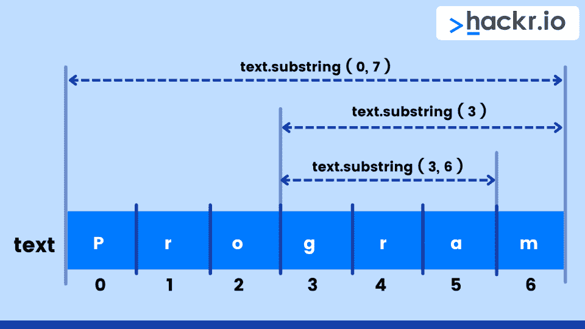

# Java 子串提取[带代码示例]

> 原文：<https://hackr.io/blog/how-to-extract-a-java-substring>

Java *String* 数据类型使用一系列字符(char 数据类型)来存储各种类似文本的数据。作为最广泛使用的数据类型之一，字符串通常是 [Java 编码面试问题](https://hackr.io/blog/java-projects)通过字符串操作问题的焦点，无论是字符串反转、转换、字符串拆分还是提取子字符串。

说到 Java，我们可以访问一系列 string 方法，它们是 *String* 类的一部分。本教程提供了内置 Java 子串方法*的各种代码示例和演练。substring()* 提取一个 Java 子串。

注意:我们在本文中涉及的方法是用 Java 11 编写的。

子字符串表示一个有序的字符序列，我们可以从 Java *String* 对象中提取这个序列。由于 string 数据类型的不变性，我们将不得不在 Java 中将从一个*现有的 String* 对象中提取的任何子串存储在一个*新的 String* 变量中。

**例如:**如果我们有 Java *字符串*:“在 Hackr.io 上学习 Java”，我们可以提取子字符串“Hackr.io”。为此，我们需要将它存储在一个*新字符串*对象中，这意味着我们不需要修改原来的*字符串*。这适用于原始字符串的任何有序子段:我们可以提取“Lear”、“Java”、“on Hac”等。

有了 Java，我们可以访问内置的*。substring()* 方法作为 Java *字符串*类的一部分。幸运的是，这个方法使用起来非常简单，因为它只需要开始和结束索引参数。结果是*原始* *字符串*在*新字符串*对象中的分隔部分，即*子字符串*。



另一种在 Java 中提取子字符串的方法是使用内置的*。split()* 方法(也是 Java *字符串*类的一部分)。该方法将一个*字符串*分割成一个或多个子字符串，由定界字符(空格、逗号、字符值等)分隔。)，并返回数组中的子字符串。

虽然这在某些场景中很有用，但与*相比，它不太适合从现有字符串中提取特定的摘录。substring()* 方法。

## **如何使用 Java？substring()方法**

Java *。substring()* 方法基于我们作为整数参数传递的索引值从现有字符串中提取子字符串。

### 【Java 的语法。子串()

我们可以使用*。substring()* 方法有两种方式。

第一种方法将子字符串作为新的*字符串*对象返回，该对象由起始索引值(包含)和原始字符串结尾之间的字符组成。

```
String strEx = new String("Example");
String subStr = strEx.substring(int startIndex);
```

第二种方式将子字符串作为新的*字符串*对象返回，该对象由原始字符串中从开始索引到结束索引的字符组成，但不包括结束索引。

```
String strEx = new String("Example");
String subStr = strEx.substring(int startIndex, int endIndex);
```

**注意:**如果我们传入大于原始字符串长度或小于 0 的起始索引值，这两种方法都会抛出一个 *IndexOutOfBoundException* 异常。如果开始索引大于结束索引，我们也会抛出这个错误。

让我们看一些使用 Java *的代码示例。substring()* 方法。

### **使用索引值的 Java 子串示例**

在本例中，我们将创建一个 *String* 对象(“在 Hackr.io 上学习 Java”)，我们可以用它作为基础来提取一系列子字符串。然后，我们将整数索引值传递给 Java 的内置 *substring()* 方法。

首先，我们传入了一个起始索引值 0，没有结束索引，这有效地返回了原始字符串，如输出所示。

其次，我们已经传入了开始和结束索引值，结束索引表示原始字符串的长度。现在，因为 Java 使用零索引，并且结束索引是非包含性的，所以它也返回完整的原始字符串，正如您在输出中看到的。

这意味着前两个代码片段是返回相同子字符串(即原始字符串)的等效方式。

接下来，我们传入一个起始索引值 1，它从原始字符串中删除第一个字符以产生一个子字符串。然后，我们传入一个起始索引 0 和一个结束索引 n-1，这将从子字符串的原始字符串中删除最后一个字符，如输出所示。

最后，我们传递了任意的开始和结束索引值来返回不同的子字符串，如输出所示。注意空格也是有效的字符，这意味着我们可以在一个子串中返回这些字符，如最后一个子串示例所示。

```
public class SubstringHackrIO {
  public static void main(String[] args) {
    String strExample = "Learn Java on Hackr.io";
    System.out.println("Original string: " + strExample);

    // Find length of string: n = 25
    int n = strExample.length();

    // Extract and print substrings
    System.out.println("From index 0: " + strExample.substring(0));
    System.out.println("From index 0 to n: " + strExample.substring(0, n));
    System.out.println("From index 1: " + strExample.substring(1));
    System.out.println("From index 0 to n-1: " + strExample.substring(0, n-1));
    System.out.println("From index 0 to 10: " + strExample.substring(0, 10));
    System.out.println("From index 10 to 14: "+ strExample.substring(10, 14));
  }
}​
```

**输出:**

如何用 Java 打印字符串的一部分？indexOf()

```
Original string: Learn Java on Hackr.io
From index 0: Learn Java on Hackr.io
From index 0 to n: Learn Java on Hackr.io
From index 1: earn Java on Hackr.io
From index 0 to n-1: Learn Java on Hackr.i
From index 0 to 10: Learn Java
From index 10 to 14:  on
```

### 在这个例子中，我们使用 Java 的内置*。indexOf()* 方法提取两个不同字符之间的子串，即左方括号和右方括号。

**语法为。indexOf()**

```
String strEx = new String("Example");
int indexVal = strEx.indexOf("x"); // indexVal = 1
```

这种方法很有用，因为根据子字符串与其他字符的接近程度提取子字符串比传递子字符串索引值更直观。

因此，通过将左方括号作为一个*字符串*参数传递给*。indexOf()* ，我们可以返回这个字符在原来的*字符串*中第一次出现的索引值。这将是我们在这个子串 Java 例子中的开始索引。

接下来，我们可以将右方括号作为一个*字符串*参数传递给 *indexOf()* ，后者返回该字符在原始*字符串*中第一次出现的索引值。我们将使用它作为结束索引值来提取子串。

回想一下，开始索引是包含性的，而结束索引是非包含性的。这意味着我们必须将起始索引移动+1，从左方括号右边的第一个字符开始我们的子字符串。end index 已经准备好了，因为它会将第一个字符返回到右方括号的左边。

最后，如输出所示，我们可以将开始和结束索引值与。substring()来提取并打印我们的子字符串。

**输出:**

```
public class SubstringHackrIO {
  public static void main(String[] args) {
    String strExample  = "Learn Java on [Hackr.io]";
    System.out.println("Original string: " + strExample);

    // Get index values for first occurrences of '[' and ']'
    int start = strExample.indexOf("[");
    int end = strExample.indexOf("]");

    // Extract and print substring between '[' and ']'
    String subStr = strExample.substring(start + 1, end);
    System.out.println("Substring: " + subStr);
  }
}​
```

**Java 子串方法的使用。lastIndexOf()**

对于这个例子，我们将使用 Java 的*。indexOf()* 和*。lastIndexOf()* 方法。这次我们将把子串参数传递给这些方法，而不是单个字符。

```
Original string: Learn Java on [Hackr.io]
Substring: Hackr.io​
```

**Syntax for .lastIndexOf() **

我们将从使用*开始。indexOf()* 查找子字符串“Learn”的*第一个*出现处的*第一个*字符的索引。这将是字符“L”的索引。

#### 然后我们将使用*。lastIndexOf()* 查找子字符串‘Java’的*最后*出现处的*第一个*字符的索引值，这将是‘J’的索引。

```
String strEx = new String("Example Example");
int indexVal = strEx.lastIndexOf("x"); // indexVal = 9
```

如果我们使用这两个结果作为我们的开始和结束索引值，我们可以从开始索引(包括)提取字符的子串，直到但不包括结束索引。我们现在可以将这些参数传递给*。substring()* ，在打印结果之前，如输出所示。

**注意:**如果使用*找不到子串。indexOf()* 或*。lastIndexOf()，*返回值将为-1。您应该考虑在生产代码中处理这种可能性，因为它可能会导致*出现异常。substring()*

**输出:**

**结论**

在本教程中，我们介绍了 Java 中的各种子串函数，您可以使用这些函数从现有的带有内置*的*字符串*对象中提取 Java 子串。substring()* 方法。

```
public class SubstringHackrIO {
  public static void main(String[] args) {
    String strExample = "Learn Java on Hackr.io, and enjoy Java!";     
    System.out.println("Original string: " + strExample);

    // Get index of first occurrence of "Learn" substring
    int start = strExample.indexOf("Learn");
    // Get index of last occurrence of "Java" substring
    int end = strExample.lastIndexOf("Java");

    // Extract and print substring
    String subStr = strExample.substring(start, end);
    System.out.println("Substring: " + subStr);
  }										
}​
```

我们从简单的例子开始，这些例子使用起始位置或者起始和结束位置的索引值来帮助我们从原始的*字符串*中提取*子字符串*。

然后我们探索了 Java 的*。indexOf()* 和*。lastIndexOf()* 方法通过搜索 char 值从原始字符串返回子字符串。

```
Original string: Learn Java on Hackr.io, and enjoy Java!
Substring: Learn Java on Hackr.io, and enjoy
```

## 这种“char search”方法使我们能够在原始 stringobject 中找到所需字符(或子字符串)的索引，从而允许我们提取子字符串，而无需显式声明索引值。如果您可以直观地看到想要提取的子字符串周围的单词或字符，这种方法会更直观。

想要让您的 Java 开发更上一层楼吗？

**[查看我们的 Java 小抄](https://hackr.io/blog/how-to-learn-java)**

**[或者这个 Java 项目列表](https://hackr.io/blog/java-projects)**

**常见问题解答**

**1。有什么关系？Java 中的 substring(1) Do？**

这将返回一个新的 substring 对象，相当于从原始字符串中删除第一个字符。

**2。Java 里怎么子串？**

## 您可以使用。substring()方法，带有开始索引或开始和结束索引值，从 Java 中的原始字符串返回子字符串。请注意，结束索引值是非包含性的，这意味着子字符串将达到但不包括此索引处的字符。

#### **3。加拿大 split()在 Java 中用来做子串？**

可以使用 Java *。split()* 将一个字符串拆分成一个子字符串数组的方法，这些子字符串最初在字符串中由一个定界值(逗号、空格、字符等)分隔开。).

#### **4。如何将一个字符串拆分成子字符串？**

Java *字符串*类提供了。 *substring()* 可以用来从原始字符串中提取子字符串的方法。或者，你可以使用内置的*。split* ()方法将一个字符串分割成一个子字符串数组，这些子字符串最初由一个分隔值(逗号、空格、字符等)分隔。).

#### **3\. Can .split() be Used to Make Substrings in Java?**

You can use the Java *.split()* method to split a string into an array of substrings originally separated in the string by a delimiting value (comma, space, char, etc.).

#### **4\. How Do I Split a String Into a Substring? **

The Java *String* class provides the .*substring()* method that you can use to extract a substring from an original string. Alternatively, you can use the built-in *.split*() method to split a string into an array of substrings originally separated by a delimiting value (comma, space, char, etc.).