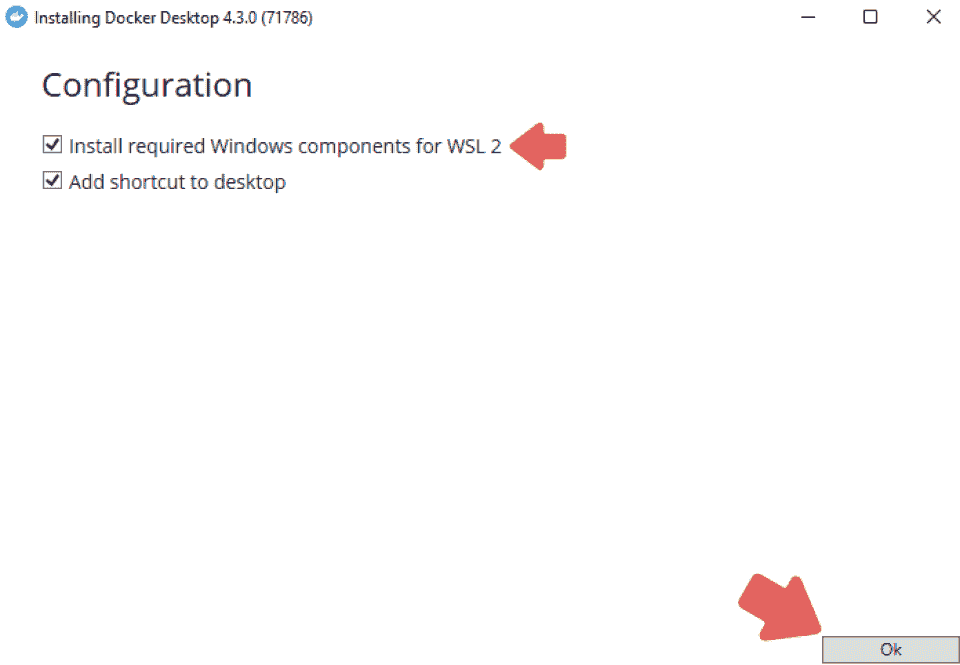
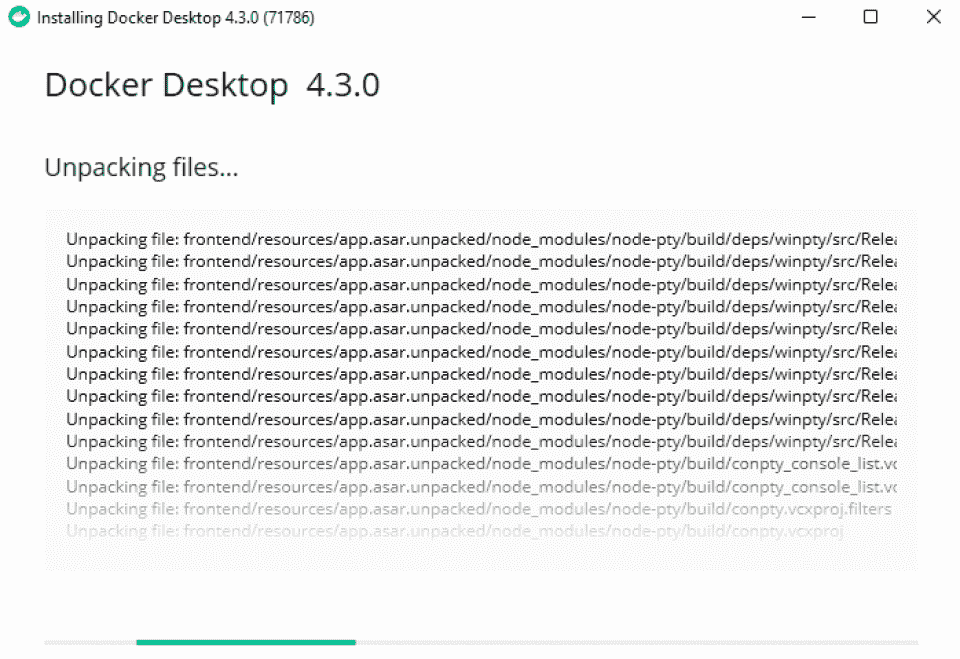
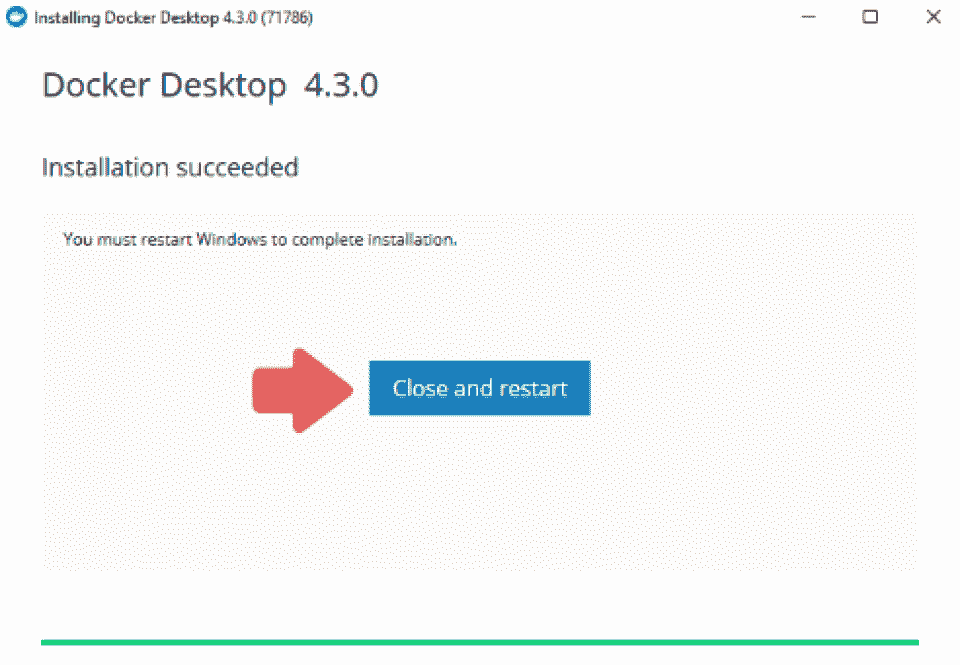
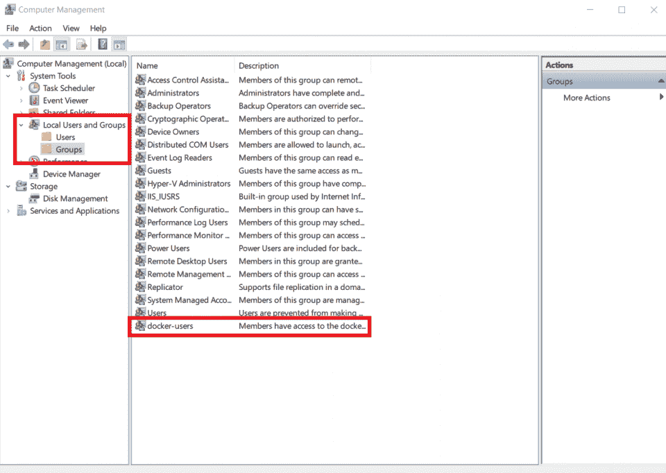
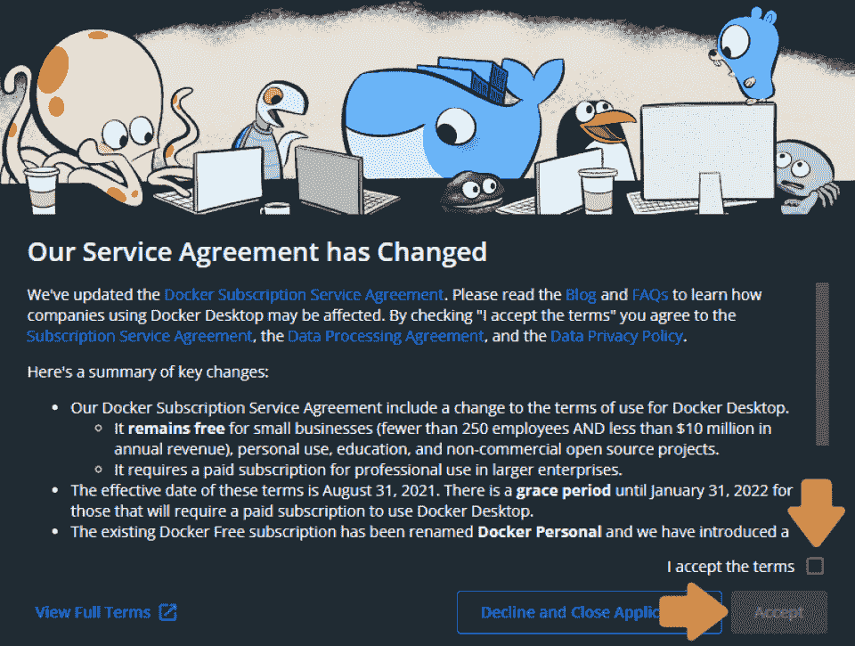
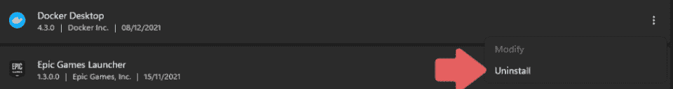
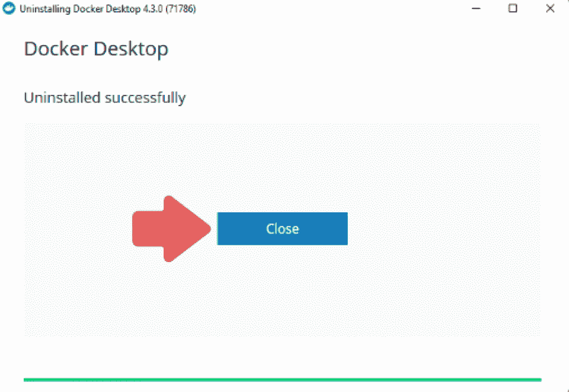

# 如何在 Windows 上安装 Docker？[初学者完全指南]

> 原文：<https://hackr.io/blog/how-to-install-docker-on-windows>

如果你以前没有做过，Docker 的安装过程可能会有点混乱和复杂。随着时间的推移，你可能需要在几个设备上安装它，所以请务必密切关注我们关于如何在 Windows 上安装 Docker 的指南。

## **要求**

### **WSL 2 后端、Hyper-V 后端和 Windows 容器**

要在 Windows 10 上使用 Docker，请确保您拥有 Windows 10 64 位家庭版或专业版(2004 或更高版本)或企业版或教育版(1909 或更高版本)。

**您的电脑需要具备以下规格或更好的规格:**

*   具有二级地址转换的 64 位处理器
*   4GB 系统内存
*   需要在 BIOS 设置中启用 BIOS 级硬件虚拟化支持
*   确保在 Windows 中启用 Hyper-V 和容器功能。
*   确保在 Windows 上启用了 [WSL 2 特性](https://docs.microsoft.com/en-us/windows/wsl/install)。

**注意** : Docker Desktop 只支持微软仍然支持的 Windows 版本，所以要确保你的 Windows 是更新的。

## **如何在 Windows 10 或以上版本上安装 Docker:分步安装指南**

首先，我们需要下载 Docker 文件进行安装。这里是下载文件以便在 Windows 上安装的[链接。](https://desktop.docker.com/win/main/amd64/Docker%20Desktop%20Installer.exe)

1.  安装文件下载后，通常可以在下载文件夹中找到。找到后，右键单击安装文件，然后单击“以管理员身份运行”
2.  安装开始时，您将能够看到配置页面。确保在配置页面上选择以下选项之一:

a)启用 Hyper-V Windows 功能

b)安装 WSL 2
所需的 Windows 组件

3.初始设置后的安装过程相当简单，因此只需按照向导上的说明并授权安装程序继续安装即可。

4.安装完成后，按“关闭”按钮完成安装。

**注意**:如果您的管理员账户与用户账户不同，您需要将用户添加到“docker-users”组中。

1.  以管理员身份运行计算机管理，然后转到“本地用户和组”
2.  从那里，转到“组”，然后转到“docker-用户”
    
3.  现在只需右键单击将用户添加到组中。现在，重新启动您的电脑以使更改生效。

## **基本配置**

现在你已经完成了 Docker compose 在 Windows 上的安装，你需要设置它，因为它不会在安装后自动启动。要启动 Docker 桌面，您需要遵循几个步骤。

1.  首先在开始菜单中搜索 Docker，然后在搜索结果中点击 Docker Desktop。
2.  首次启动时，您将看到 Docker 订阅服务协议窗口。一旦你过了这一关，Docker Desktop 将在你同意条款后立即启动。
    
3.  一旦你完成了初始化，Docker Desktop 将启动“快速入门指南”这包括帮助你开始的简单练习。一些例子包括构建一个 Docker 映像，将它作为一个容器运行，将它推送到 Docker Hub 并保存。

如果您需要再次查看快速入门指南，只需右键单击右下角通知托盘中的 Docker 图标，打开 Docker 桌面菜单并选择快速入门指南。

## **如何卸载**

要从 Windows 计算机上删除 Docker Desktop，请按照以下简单步骤操作:

1.  按键盘上的 Windows 键打开“开始”菜单。导航到“设置”并前往“应用程序”，然后前往“应用程序与功能”
2.  从那里，找到“Docker 桌面”并点击卸载选项。
    
3.  您将看到一个卸载向导，您只需选择卸载选项来确认您的选择。安装程序一结束，Docker 桌面应用程序就会从您的计算机上卸载。
    

**注意**:Docker Desktop 一旦卸载，就会破坏本地 Docker 容器、卷、映像和所有其他 Docker 相关数据，以及程序创建的文件。了解如何在卸载前[备份重要数据](https://hackr.io/blog/data-science-tools)，以便以后需要时可以恢复数据。

## **什么是 Docker for Windows？**

Docker 是一个开源平台，允许开发人员将他们的应用程序打包成容器。这些是将应用程序源代码和操作系统中的库结合在一起的可执行组件。这允许开发者在任何环境中运行代码。

这些容器有助于使分布式应用程序的交付变得非常简单，并且已经被全世界的开发人员广泛采用。

尽管开发者可以不用 Docker 就能[创建容器](https://hackr.io/tutorial/fundamentals-of-containers-kubernetes-and-red-hat-openshift)，这个平台只是让它变得更加简单、容易和安全。

[Docker & Kubernetes:实用指南【2023 版】](https://click.linksynergy.com/link?id=jU79Zysihs4&offerid=1045023.3490000&type=2&murl=https%3A%2F%2Fwww.udemy.com%2Fcourse%2Fdocker-kubernetes-the-practical-guide%2F)

## **为什么要用 Docker？**

Docker 是如此受欢迎，以至于术语“Docker”和“containers”经常相互替换。以下是 Docker for Windows 10 和 11 如此广泛使用的几个原因:

*   可移植性: Docker 容器具有高度的可移植性，可以在任何桌面环境中无缝使用，无需修改

*   **轻量级:**在 Docker 容器中，一次只允许一个进程在每个容器中运行，这意味着您可以在取出应用程序的部件进行修复或更新时运行应用程序

*   **自动化:** Docker 可以根据应用的源代码快速构建容器。

*   **版本化:**它可以轻松地跟踪、回滚和追踪容器的版本

*   **可重用性:**现有的容器可以被重用为构建新容器的模板

*   共享库:开发者可以很容易地访问包含用户贡献的数千个容器的注册中心

## Docker 桌面是免费的吗？

根据 [Docker 网站](https://docs.docker.com/desktop/faqs/)的消息，Docker 可以免费用于个人用途、小型企业、教育和非商业用途。但是，它需要专业人员付费订阅才能在大型企业中使用。

[Docker Certified Associate 2023:硕士课程](https://click.linksynergy.com/link?id=jU79Zysihs4&offerid=1045023.2074534&type=2&murl=https%3A%2F%2Fwww.udemy.com%2Fcourse%2Fdocker-certified-associate%2F)

## **了解更多关于 Docker 的信息**

现在你已经学会了如何在 Windows 上安装 Docker，是时候掌握程序本身了。我们在 Hackr.io 上有很多课程致力于[学习如何使用 Docker](https://hackr.io/tutorials/learn-docker) 。进入其中一个来学习诀窍，或者提高你已经胜任的技能。