# 如何安装 TensorFlow？[完全的初学者指南]

> 原文：<https://hackr.io/blog/how-to-install-tensorflow>

简而言之，TensorFlow 是一个用于数值计算的开源库，用于增强机器学习的便利性和易用性，是一个完全 Python 友好的库。TensorFlow 可以运行和训练深度神经网络，用于图像识别、手写数字分类、递归神经网络、单词嵌入以及自然语言处理、PDE(偏微分方程)和机器翻译的序列到序列模型。最重要的是，它支持使用用于训练的精确模型进行大规模生产预测。

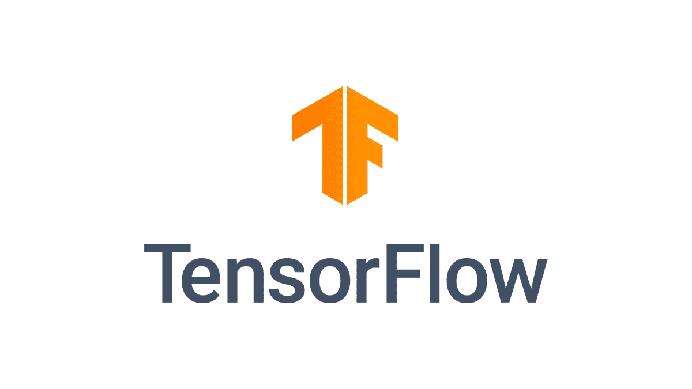 图 1 TensorFlow 标志

## **tensor flow 的五个主要用例**

*   这种技术用于自动图像识别系统，因为它由识别用于建模目的的形状的算法组成。
*   语音和声音识别过程可以通过 TensorFlow 来完成，它还用于情感分析或缺陷检测。
*   TensorFlow 有助于改进基于文本的识别技术，最好的例子是支持各种语言以及将文本从一种语言转换为另一种语言的 Google。
*   它用于分析数据和分离数据的有意义状态，这种使用案例的最佳示例是在线流媒体平台(网飞、YouTube)，它使用统计数据来提供最佳用户体验。
*   TensorFlow 用于视频检测系统，这意味着它有助于运动检测或实时威胁检测系统。

### **安装张量流**

在开始安装的过程之前，让我们了解一下 TensorFlow 支持多个 GPU 和 CPU。这意味着计算过程可以根据设备进行划分，从而在并行化的帮助下提高训练速度。它可以通过训练算法来提供更快的训练。

有两个版本的 TensorFlow 可供 Windows 用户使用，这两个版本是:

**CPU 支持的 TensorFlow:** 如果系统没有在 NVIDIA GPU 上运行，那么用户必须安装这个版本。

**GPU 支持的 TensorFlow:** 该版本用于更快的计算，计算能力强。

用户可以在 Windows 和 macOS 上安装 TensorFlow

**对于 Windows 用户进程是:**

*   安装 Anaconda
*   为安装依赖项创建一个. yml 文件
*   使用 pip 添加张量流
*   启动木星笔记本

**对于 macOS 用户进程是:**

*   安装 Anaconda
*   为安装依赖项创建一个. yml 文件
*   启动木星笔记本

因此，要启动 TensorFlow 安装过程，用户必须安装 Anaconda，因此 macOS 和 Windows 的安装过程如下:

#### **步骤 1:在设备中安装 Anaconda:**

下载所需系统的 Anaconda 版本 4.3.1，这个版本对于 Python 3.6 是必不可少的。现在你必须创造。yml 文件来安装 TensorFlow，过程是:

*   找到蟒蛇的路径
*   将工作目录设置为 Anaconda
*   创建 yml 文件(适用于 macOS 用户)
*   编辑 yml 文件
*   编译 yml 文件
*   激活蟒蛇
*   安装 TensorFlow(仅适用于 Windows 用户)

##### 定位蟒蛇

对于 Anaconda 的安装，用户必须找到它的路径。

用户可以创建一个新的 anaconda 环境，其中包括基本的库。

##### **对于 Windows**

对于 windows，用户可以使用 Anaconda 类型和提示符:

```
C:\>where Anaconda
```

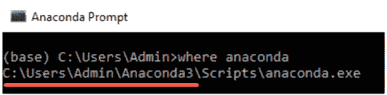

##### **对于 macOS:**

对于 macOS 设备，用户可以使用类型和终端:

用户必须在 Anaconda 中创建一个新文件夹，其中包含 Jupyter、TensorFlow 和 ipython。有一种快速安装库和软件来编写. yml 文件的方法。

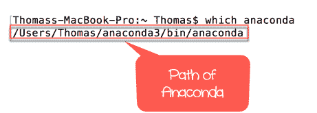

### **第二步:设置并选择工作目录**

用户必须决定一个合适的目录，用户希望在其中创建一个. yml 文件，该文件将位于 Anaconda 中。

#### **对于 macOS:**

对于 macOS，默认的工作目录将是 Users/USERNAME，path anaconda3，并且工作目录完全相同。在 macOS 设备中，最新的文件夹会显示在＄的正前方，终端会将库安装在工作目录中。

如果文本编辑器上的路径与工作目录不匹配，用户可以将路径更改为 cd 路径。将路径包装为“PATH”是很重要的，因为这可以将工作目录转换为 PATH。

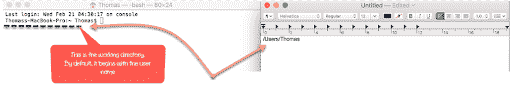

#### **打开终端，输入:**

```
cd anaconda3
```

对于 Windows 用户(确保文件夹放在 Anaconda3 之前):

```
cd C:\Users\Admin\Anaconda3 
```

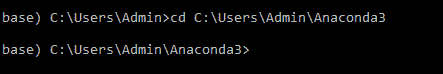

### **步骤 3:为设备创建 yml 文件:**

用户必须在新的工作目录中创建 yml 文件，并且在该过程安装了完整的依赖项之后，用户必须运行 TensorFlow。最后，将代码复制并粘贴到终端中。

#### **对于 macOS 设备:**

对于 macOS 用户，文件名将出现在 anaconda3:

```
'touch hello-tf.yml.'
```

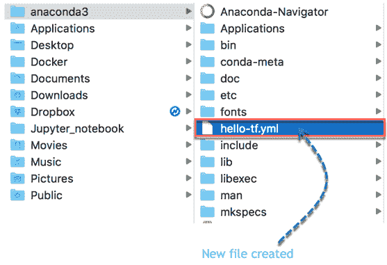

#### **对于 Windows 设备:**

windows 设备的文件名是:

```
'echo.>hello-tf.yml.'
```

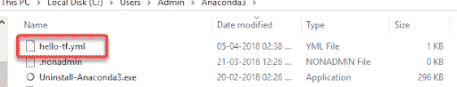

### **第四步:编辑 yml 文件**

#### **对于 macOS 设备:**

用户必须在终端中粘贴给定的代码来编辑该文件，因为 yml 文件已经可以编辑了，或者 macOS 用户可以使用 vim 来编辑 yml 文件。

```
vi hello-tf.yml
```

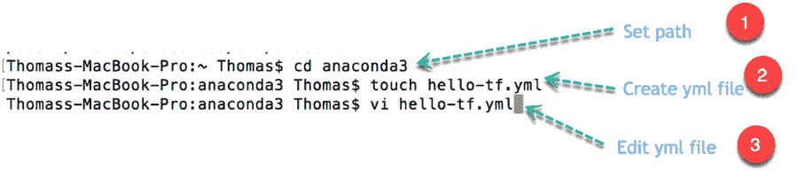

用户必须进入编辑模式才能按 ESC 键:

按 I 编辑
按 w 保存
按 q！退出

在编辑模式下编写上述代码，然后按 ESC 键，再按 w 键

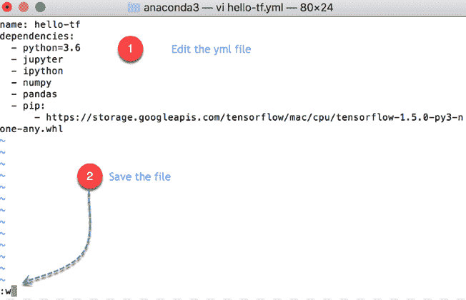

**重要提示:**每个意图后需要两个空格，因为文件是这样的，并且意图也是敏感的。

对于 macOS 设备:

名称:hello-tfdependencies:

- python=3.6

-jupyter
【ipython】 【熊猫】 【pip】

-https://storage . Google APIs . com/tensor flow/MAC OS/CPU/tensor flow-1 . 5 . 0-py3-none-any . whl

以下是上述代码的代码解释:

```
name: hello-tf: Name of the yml file
```

依赖关系:

python = 3.6
jupyter
ipython

pandas:安装 Python 3.6 版、Jupyter、Ipython 和 pandas 库

pip:安装 Python 库

https://storage . googleapis . com/tensorflow/MAC OS/CPU/tensor flow-1 . 5 . 0-py3-none-any . whl:从 Google APIs 安装 tensor flow。

然后，按下 Esc 键，再按下:q！退出编辑模式。

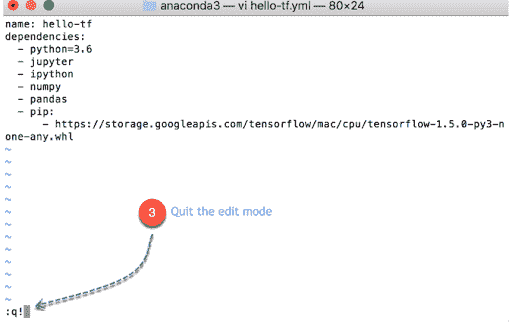

#### **对于 Windows 设备**

记事本对于 Windows 设备来说已经足够了，因为它不支持 vim 程序

```
notepad hello-tf.yml
```

在文件中输入以下内容

名称:hello-of dependencies:

-python = 3.6
【jupyter】 【ipython】熊猫

下面是上述代码的代码解释

```
name: hello-tf: Name of the yml file
```

依赖关系:

python = 3.6
jupyter
ipython

pandas:安装 Python 3.6 版、Jupyter、Ipython 和 pandas 库

它会自动打开记事本；然后，用户可以在那里编辑文件。

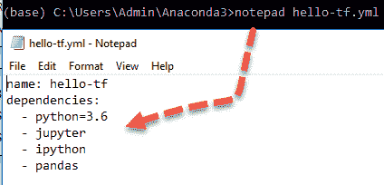

#### **第五步:编译 yml 文件**

用户可以编译。具有给定代码的 yml 文件:

```
conda env create -f hello-tf.yml
```

注意:新环境是在 Windows 设备的当前用户中自动创建的。这可能会占用将近 1.1 GB 的硬盘空间。

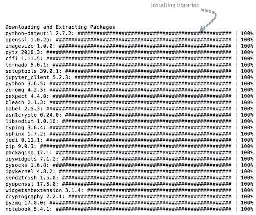

#### **对于 Windows 用户:**

**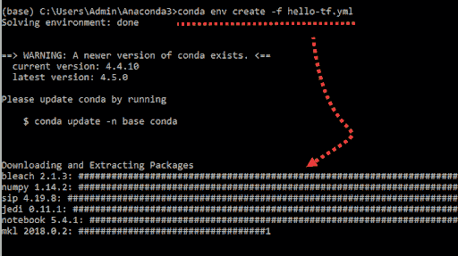**

#### **步骤 6 激活 conda 环境**

现在用户有两个 conda 环境，并且用户已经创建了一个独立的 condo 环境，其中包含用户将在教程中使用的库。这是必需的实践，因为每个机器学习项目都需要不同的库。

```
conda env list
```

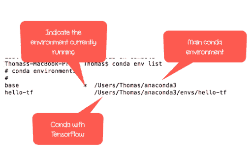

#### **对于 macOS 设备:**

```
source activate hello-tf
```

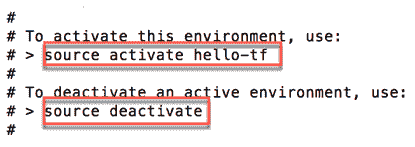

#### **对于 Windows 设备:**

```
activate hello-tf
```

用户可以轻松检查同一环境中的所有依赖项。这是必不可少的，因为它允许 Python 从类似的环境中使用 TensorFlow 和 Jupyter，以防用户看不到这三者，它们位于同一个文件夹中；然后，用户不得不重新开始。

#### **对于 macOS 用户:**

```
which Python
which jupyter
which ipython
```

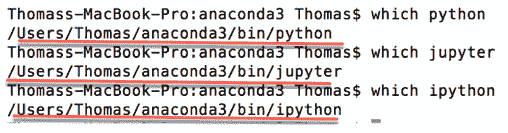

```
pip install --upgrade TensorFlow
```

#### **对于 Windows 设备:**

```
where Python
where jupyter
where ipython
```

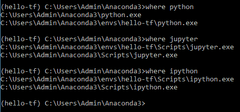

很明显有两个 python 环境，第一个是主环境，另一个是在 hello-tf 上创建的。

用户必须使用以下命令安装 Tensorflow:

```
pip install TensorFlow
```

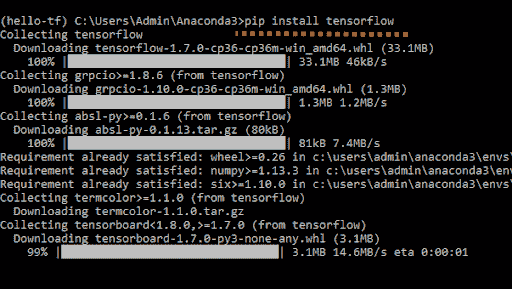

#### **启动 Jupyter 笔记本**

这个过程在 Windows 和 macOS 中都是一样的

用户可以在 Jupyter 的帮助下打开 TensorFlow。

**注意:**用户每次打开 TensorFlow 都要初始化环境。

用户可以进行如下操作:

```
Activate hello-tf Conda environment
Open Jupyter
Import TensorFlow
Delete Notebook
Close Jupyter
```

**激活 conda**

#### **对于 macOS 设备:**

```
source activate hello-tf
```

#### **对于 Windows 设备:**

```
conda activate hello-tf
```

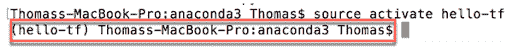

#### **Open Jupyter**

之后，用户可以从终端打开 Jupyter

jupyter 笔记型电脑

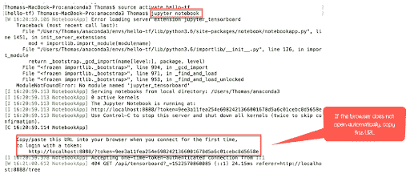

用户设备的网络浏览器应自动打开以下链接，或者用户可以复制终端提供的该链接。 [http://localhost:8888](http://localhost:8888)

在 Jupyter 笔记本中，用户可以看到工作目录中的所有文件。用户可以点击 Python3 来创建新的笔记本，这个新的笔记本会自动保存在工作目录中。


#### **Import Tensorflow**

用户可以在笔记本中导入带有 tf 别名的 TensorFlow，然后用户可以在下面创建新单元时单击运行

import TensorFlow as tf

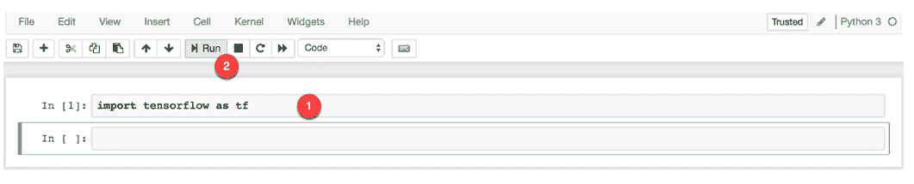

[人工智能- TensorFlow 机器学习](https://click.linksynergy.com/link?id=jU79Zysihs4&offerid=1045023.1845106&type=2&murl=https%3A%2F%2Fwww.udemy.com%2Fcourse%2Ftensorflow-js%2F)

#### **用 TensorFlow 写第一个代码。**

```
hello = tf.constant('Hello, Guru99!')
```

你好

现在产生了一个新的张量。用户在系统中成功安装了带有 Jupyter 的 TensorFlow。

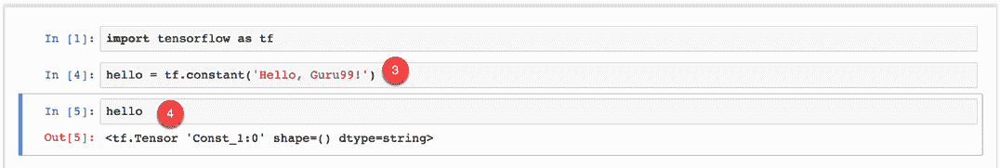

#### **删除文件:**

用户可以删除这个文件，它在 Jupyter 内部被命名为 Untitled.ipynb。

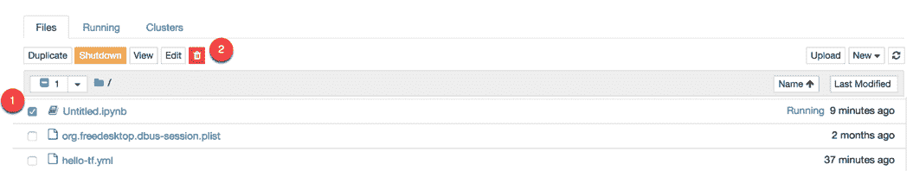

#### **Close Jupyter**

有两种方法可以关闭 Jupyter。第一种是直接从笔记本关闭，第二种是通过终端或者 Anaconda 提示。

#### **来自木星******

点击 Jupyter 笔记本主面板中的注销:

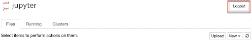

用户将被自动重定向到注销页面。

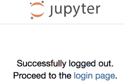

从终端

选择 Anaconda 提示符或终端，并运行两次 ctrl+c。

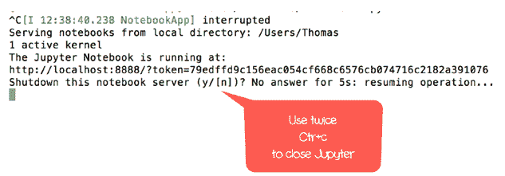

用户第一次按 ctrl+c 时，必须通过重复 ctrl+c 来确认笔记本的关机。

用户已成功注销。

## **结论**

TensorFlow 同时也是一项广泛发展且有益的技术，在 Windows 和 macOS 设备中安装 TensorFlow 时，遵循每一个步骤都是至关重要的。两种操作系统的安装过程和编码不同，上述步骤包含安装 TensorFlow 所需的所有信息。

**人也在读:**