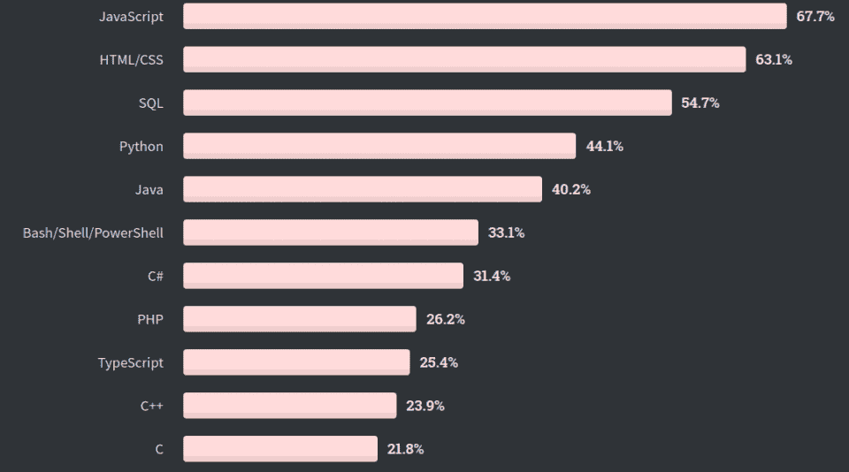
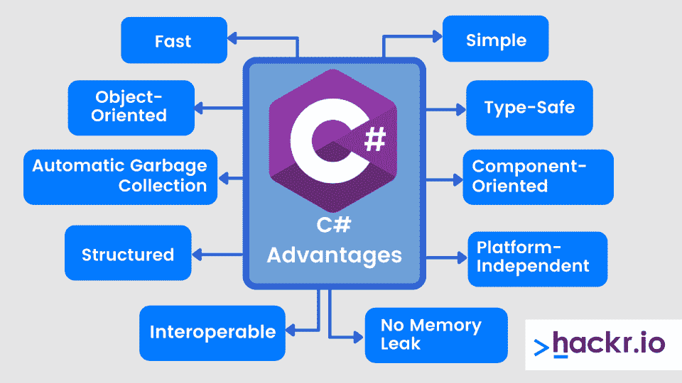
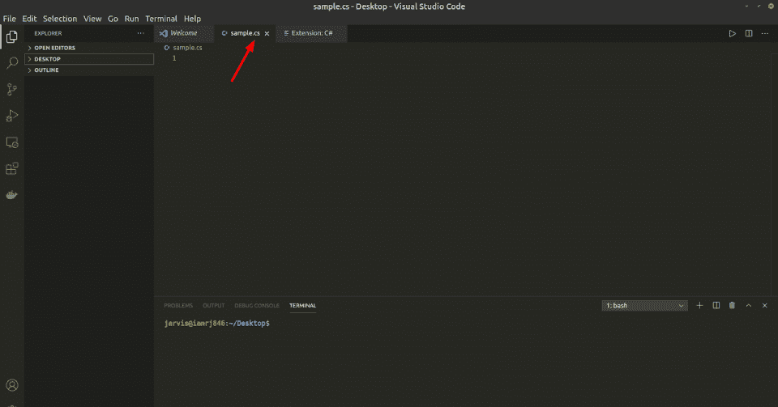
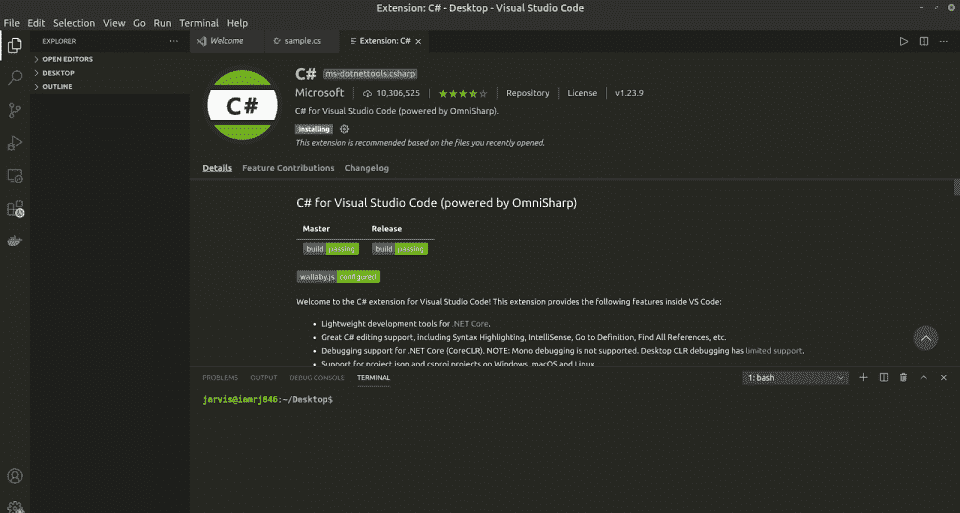
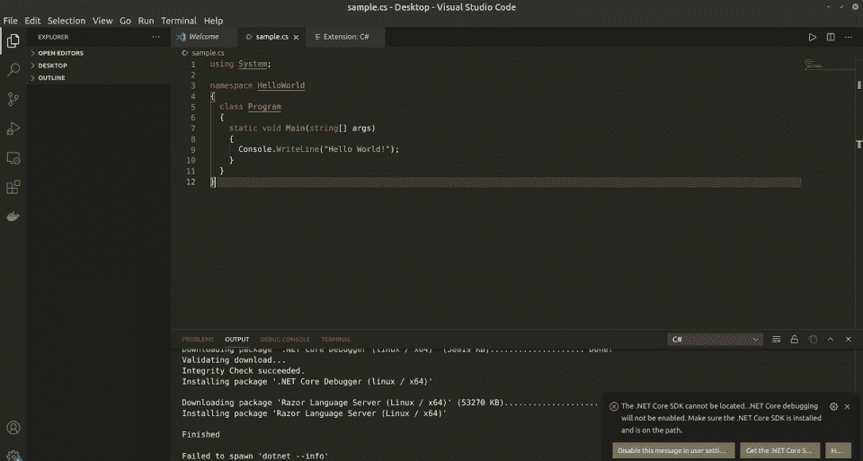

# 2023 初学 C#怎么学

> 原文：<https://hackr.io/blog/how-to-learn-c-as-a-beginner>

想知道如何学习 C#？那你来对地方了。我们会回答你所有的 C#问题，比如:C#有什么特点？C#难学吗？学习 C#最好的方法有哪些？C#程序员就业市场怎么样？还有更多。到本文结束时，你将确切地知道如何轻松地学习 C#。

## **什么是 C#？**

由微软开发的 C#(读作 C Sharp)使用。NET 框架。这是一种现代的面向对象的多用途编程语言。

C#更多的是 C 和 C++编程语言的混合。然而，相比之下，C#语言的语法富于表现力、简单、直观且易于理解。

C++语言带来的复杂性被 C#语言大大简化了。这包括枚举、可空类型、直接内存访问、委托等。，这在 Java 中也找不到。

C#被列为第七大最受欢迎的编程语言。虽然大多数编程语言都是为了执行一组特定的任务而创建的，但 C#是一种通用编程语言。

您可以使用 C#处理数据库、为视频游戏创建高速图形、播放音频/视频效果、控制连接的设备等等。

C#既可以被解释，也可以被编译。与 C++和 Java 不同，C#为 Web 和桌面提供了出色的屏幕处理支持。这就是 C#相对于其他流行编程语言的地位。

## **C #的属性**

在我们继续深入之前，让我们讨论一下 C#编程语言的一些特性，它们将帮助你更好地理解它的流行。

在 C#中数据丢失是不可能的，因为它不支持类型转换。此外，它还支持不可为空和可为空的值类型。因此，开发人员可以安全地编写代码。

*   ### **很现代很直观**

创建 C#的唯一目的是让开发人员能够获得一种通用语言，这种语言易于理解，并且在实现功能方面能够与其他现代语言竞争。

C#编程语言可以为各种领域和平台开发应用程序和软件，包括 Android、iOS、Web 或 Windows。

*   ### **是开源免费的**

C#是微软开发的开源语言；因此它是免费使用的。它有一个巨大的贡献，非常积极和支持的开发人员基础。

## **c#的应用**

C#是一种中级语言，使它对用户友好、直观、易于理解。而且 C#的执行时间更快。这也是它被广泛用于嵌入式编程的原因。

除此之外，C#编程语言还广泛用于构建 Windows 的大型应用程序、桌面和 Web 应用程序、游戏、虚拟现实(VR)、数据库应用程序以及其他 Web 服务。你也可以用它来开发 iOS 和 Android 应用程序。

## **c#的特点和优势**

在讨论为什么应该从 C++、Java 或其他语言转向 C#之前，让我们讨论一下 C#带来的一些特性和优势。

*   #### **快:** C#是一种快速编程语言，执行时间快。

*   #### **简单:** C#不需要你包含头文件——它有一个结构化的方法，允许你把问题分解成几个部分，并且有一组丰富的库和数据类型。

*   #### **面向对象:** 它支持 OOPS 概念，使维护和开发更容易。它支持面向对象编程的所有方面，如继承、多态、抽象、封装、接口等。

*   #### **类型安全:** 它允许你编写和开发类型安全的代码，提高安全性。您将无法执行不安全的强制转换，例如将一个 [double 数据类型](https://hackr.io/blog/float-vs-double)转换为 boolean。它自动将数据类型和对象以及类初始化为零或空值。

2.  #### **结构化** : C#将一个大的程序分成模块、过程或函数来解决特定的问题。

3.  #### **面向组件** : C#是一种面向组件的编程语言，意思是它使用事件、属性、属性、方法等。，以允许和创建称为功能的自包含和描述的组件。

4.  #### **平台无关:** 任何有。NET 安装在上面可以运行 C#。

5.  #### **自动垃圾收集** :系统在执行过程中不会出现混乱或挂起，因为 C#有一个自动垃圾收集，在运行时自动移除悬空项。

6.  #### **无内存泄漏** :与 C++不同，它有强大的高内存备份，有助于避免内存泄漏。

## **2023 年为什么要学 C#？**

我们来讨论一下 2023 年应该学习 C#这样的多用途语言的几个理由。

1.  #### 简单，易用，直观，可读性强。

2.  这是一种强类型语言，它提高了开发人员的生产力，并使普通任务变得简单。
3.  这是一种多范例、面向对象的编程语言，支持通用、命令式、函数式和声明式等编程风格。
4.  #### 您可以创建多个应用，如控制台应用、桌面应用、原生移动应用、人工智能应用、物联网应用和云应用。

5.  C#运行在一个设计良好的、健壮的、坚固的。NET 框架。
6.  #### 它是独立于平台的、现代的、成熟的，并且被非常积极地开发和维护。

7.  它是开源的，有据可查的，并且有一个活跃的、充满活力的社区。
8.  它可以用于软件开发，因为它有内置的设计实践和模式。
9.  #### 执行速度非常快，拥有丰富的库集。

### C#程序员的就业市场

大多数组织，无论大小，都使用 C#来开发关键系统。对于 C#程序员来说，有大量的工作机会，而且由于微软的支持，C#将会越来越受欢迎。

作为一名 C#程序员，你可以创作游戏、音乐/音效，或者你可以成为一名构建 Windows 服务和应用程序的软件开发人员。甚至可以进入 AI 和 IoT 领域。

美国 C#程序员平均工资大致为每年 10.8 万美元。工资范围通常在 96，631 美元到 119，448 美元之间——取决于经验、地点、教育程度等。

## **学习 C#的先决条件**

作为一个初学者开始学习 C#，你需要快速有效地学习 C#的一些基本概念。一些先决条件包括:

1.  #### **基本计算机知识，如使用命令行、文件系统，以及安装应用程序，如编译器、解释器等。**

***   #### **面向对象编程知识。C#是一种面向对象的编程语言，这意味着你需要对封装、多态、抽象、继承、接口等概念有一个基本的了解。**

    *   #### **C、C++、或者 Java 的基础知识** 只是为了对 C#的语法有一点了解。** 

 **## **如何安装 C#**

#### 运行 C#的最佳方式是通过 Visual Studio 代码 IDE。它内置了对调试和运行 C#程序的支持。

让我们看看如何通过 Visual Studio 代码运行 C#程序。为此，你需要从其官方网站下载 IDE。安装非常简单和直观。

安装完 IDE 后，按照以下步骤运行一个 C#程序。

1。用创建一个新文件。CS 扩展。这是 C#文件的扩展名。

2。IDE 会自动建议您安装与之相关的扩展。如果没有，你可以按下面的组合键(ctrl + shift + x)打开扩展并安装下面的扩展。

3。如果你没有。NET Core SDK 安装，那么你将无法调试程序。如果 IDE 在您的系统上找不到它，它会自动建议您安装一个。访问 [**这个链接**](https://docs.microsoft.com/en-us/dotnet/core/install/) 来安装吧。

你现在可以运行和调试 C#程序了。

## **面向 C#的集成开发环境(IDE)**

IDE 或集成开发环境提供了重要的工具，如编辑器、调试器、自动完成工具、自动化设施、扩展、插件等。，帮助您创建一个完美的开发环境。

支持多种编程语言的 ide 数不胜数。让我们讨论一些可以用来调试和执行 C#程序的顶级 ide。

#### **1。Visual Studio 代码**

[**VS 代码**](https://code.visualstudio.com/) 无疑是 C#最流行的 IDE。C#和 Visual Studio 都是微软的产品，它们完美地结合在一起工作。它内置了对的支持。Net 和 C#并有大量的插件，使开发更容易。它有免费和付费版本，但最好从免费社区版开始。

##### **特性:**

*   使用智能感知自动完成代码。
*   内置 Git 命令。
*   用于定制环境的大量扩展。
*   免费且易于安装和使用。

**2。项目附加条款**

[**Project Rider**](https://www.jetbrains.com/rider/) 是一个支持 [的跨平台 IDE。NET](https://hackr.io/blog/what-is-net) ，。网核，还有。NET 框架。它支持 C#、HTML、XAML、JS 等语言。它基于 IntelliJ 和 Resharper，附带导航、单元测试、调试、Nuget 客户端、数据库集成等。

##### **特性:**

*   它是一个很好的基于 Java 的 C#平台，支持最新版本的 C#。
*   它具有统一性。
*   它在 docker 容器中执行调试，并集成了拼写检查器。

## **在线编译器**

如果你不想在本地系统上经历下载、安装、集成和定制 ide 的麻烦，你可以借助在线编译器在浏览器中运行 C#程序。一些最流行的 C#在线编译器有:

## **2023 年如何学习 C#:路线图**

下一步也是最重要的一步是找出一条能帮助你快速高效地学习 C#的学习路径。让我们试着列出掌握 C#概念所需的高级主题。在先决条件一节中，我们已经讨论过，要开始使用 C#，您需要理解面向对象的编程概念。

#### **1。语法、变量和数据类型**

学习语法是开始任何编程语言的基本步骤，同样的道理也适用于 C#。您可以学习如何声明变量、不同的数据类型、注释、输入输出、类型转换等。

#### **2。条件和循环**

掌握语法后，下一步是学习分支和循环语句。循环帮助您创建一个程序，该程序可以自动执行重复的任务，而不是多次手动运行相同的代码。条件帮助你给程序一个流程。一些主题包括:

*   If/Else 条件
*   开关语句
*   比较运算符
*   逻辑运算符
*   用于循环
*   For-each 循环

#### **3。函数/方法和数组**

函数、方法或程序允许你将一段代码组合起来执行一个特定的功能，如将两个数相加等。要多次执行一个特定的操作，不需要在不同的程序段中多次编写相同的代码。您可以为它创建一个简单的函数，并在任何您想要的地方使用它。数组允许你存储数据列表。

您可以在本部分学习的主题包括:

*   定义和调用方法
*   方法中的参数和自变量
*   方法重载
*   创建、访问和操作数组

#### **4。类别和对象**

这些是 OOPS 概念的一部分。类将相关的数据封装在一起，对象提供实例来访问存储在类中的数据。本节教:

*   类
*   物体
*   访问修饰符
*   字段
*   属性
*   构造函数
*   “这个”关键字
*   构造函数重载
*   物体点符号

#### **5。接口和继承**

继承允许你继承一个或多个类的函数和变量。接口允许你创建类似结构的类，你不需要定义方法，只需要声明它们。稍后，当您需要时，您可以在它们的子类中定义这些方法。需要学习的主题包括:

*   建筑界面
*   父/子类
*   访问继承的组件
*   方法覆盖

一旦你学会了所有的基础知识，你就可以继续学习 **高级概念** 比如:

*   多态性
*   抽象类
*   数据结构如 [栈](https://hackr.io/blog/stack-vs-heap) 、队列、哈希表、集合等。
*   阵列列表
*   文件处理
*   序列化
*   数据库连接
*   Windows 窗体应用程序

一旦你掌握了这些话题，你就可以开始下一步了。明白 **掌握理论并不足以学习任何编程语言** 非常重要。您需要通过创建尽可能多的不同级别的项目来获得**，以便对概念有更深入的理解。**

 **但是在进入项目部分之前，让我们讨论一些你可以用来快速有效地学习 C#编程的在线资源。

## **c#在线课程和教程**

让我们来看看一些你可以用来学习 C#的在线课程和教程。这些课程为从初学者到高级水平的系统学习语言提供了指导。最受欢迎的课程有:

Udemy 的这门课程讲述了 C#编程的基础和。NET 框架。它将帮助您学习诸如原始和非原始数据类型、表达式、流控制、数组、列表、文件、面向对象的方法等主题。它对所有的主题都有详细的描述，你将会接触到所有的主题和子主题。它包括真实世界的例子，编程练习等。，来温习你的知识。

**先决条件:** Visual Studio 社区。

**等级:** 初级

**评分:** 4.6

**时长:** 5 小时 24 分钟。

[点击此处访问课程。](https://click.linksynergy.com/deeplink?id=SeYHzlfZEmI&mid=39197&murl=https%3A%2F%2Fwww.udemy.com%2Fcourse%2Fcsharp-tutorial-for-beginners%2F%3FranMID%3D39197%26ranEAID%3DjU79Zysihs4%26ranSiteID%3DjU79Zysihs4-3p0LDTKCltt9kZYIJhGuCw%26LSNPUBID%3DjU79Zysihs4%26utm_source%3Daff-campaign%26utm_medium%3Dudemyads)

[**C#基础训练:语法和面向对象编程**](https://www.linkedin.com/learning/c-sharp-essential-training-1-syntax-and-object-oriented-programming)

LinkedIn Learning 的这门课程将让您创建控制台应用程序，并开始学习 C#的基本语法和面向对象方法。它有最简单的视频，可以帮助初学者在真实世界的例子的帮助下理解概念。您可以访问大量练习，使用离线和自定进度模式进行学习，并参加测验来评估您的知识。本课程涵盖的主题包括:基础知识、变量、数据类型、字符串、类、对象、函数、用户界面、面向对象的方法等等。

**先决条件:** 不需要编码背景。

**等级:** 初级

**评分:** 4.7

**时长:** 3 小时 14 分钟。

[点击此处访问课程。](https://www.linkedin.com/learning/c-sharp-essential-training-1-syntax-and-object-oriented-programming)

Coursera 提供的这门课程可以让你同时学习 C#基础知识和创建 Unity 游戏。它已经被分成几个专业，涵盖的主题有:简介、Unity UI、C#中间产品(如 OOPS 概念)、设计模式、数据结构和一个顶点项目。

它有项目、测验、学习资源、作业、教程，你甚至可以进行实时学习以及自定进度的学习模式。有超过 15 个练习可以让你掌握 C#。

**先决条件:** 不需要编码经验。

**等级:** 初级

**评分:** 4.7

持续时间: 大约 5 个月。

点击 [**此处**](https://coursera.pxf.io/x9jLXR) 访问球场。

查看 2023 年 C#顶级课程 [**。**](https://hackr.io/blog/best-csharp-courses)

## **免费在线资源**

如果你不想在这些课程上花太多钱，你可以去网上找大量免费资源。一些顶级的免费 C#资源有:

这些资源将让你深入了解项目工作所需的所有基础和高级主题。

## **C#书籍**

你也可以开始学习 C#，使用一些好书来帮助你更详细地理解这些主题。这里列出了一些你可以用来开始学习 C#的顶级书籍。

查看[**c#**10 大顶级书籍。](https://hackr.io/blog/csharp-books)

## **文档**

毫无疑问，理解 C#最可靠的方法之一就是直接通过文档。微软在 C#上有很多例子，这是微软开发出来的，不奇怪。您将在文档中找到大量深入的教程、视频、文章和对初学者友好的见解。有两个不同的文件，你可以遵循。这些是:

## **C#项目**

参与项目是学习任何主题的最佳方式，因为它能让你应用从理论中学到的知识。

您应该从基础项目开始，逐步推进到构建中级和高级项目。这样，你不会失去兴趣，并会按顺序学习主题。

这里列出了一些你可以作为初学者开始着手的项目:

*   创建游戏的登录页面或注册页面。
*   您可以创建一个应用程序来存储您收集的明信片列表。
*   你可以开发一个应用程序来为一个团队创建门票。
*   你可以创建一个音乐应用程序或一个简单的类似钢琴拼图的游戏应用程序。
*   你可以创建一个程序来归档文件和目录。

学习 C#的最好方法是用它来构建互动游戏。这将有助于你学到很多你在理论中从未接触过的概念。

## **c#在线认证**

一旦你掌握了所有关于 C#的理论和实践知识，你就可以获得认证，这将帮助你创建一份强大的简历和作品集来验证你的技能。以下是 2023 年你可以做的一些 C#顶级认证的列表。

要获得关于这些认证和其他认证的详细信息，您可以参考本指南上的[**2023 年网上 7 个最佳 C#认证**](https://hackr.io/blog/csharp-certification) 。

## **加入开发者社区**

你可以加入几个开发者社区，这些社区会让你了解最新动态，并帮助你解决学习过程中可能遇到的任何问题。您可以展示自己，更好地了解技术和非技术主题，互相帮助，更好地理解语言。

一些流行的 C#开发者社区有:

## **c#上的面试问题**

现在你已经掌握了 C#语言的所有基础知识，参与了项目，并获得了有价值的认证，是时候为 C#的技术面试做准备了。

到了面试的时候，招聘人员会检查你对主题的基本理论理解，并分析你如何应用这些主题为他们创造更好的解决方案。他们希望您应用这些概念来构建更好的现代应用程序。你可以在下面找到 C#上最常见的面试问题。

这里有完整的 [**Top C#面试问答**](https://hackr.io/blog/c-sharp-interview-questions) 。

## **结束**

在本分步指南中，我们讨论了如何学习 C#，包括 先决条件以及安装 Visual Studio IDE 和运行 C#程序的分步指南。除了其他有用的主题之外，我们还讨论了 Visual Studios 和在线编译器的一些其他替代方案。

现在你有了一个清晰的路线图，可以在 2023 年开始你的 C#之旅。如果你想扩展你的编程语言知识，为什么不多学几门呢？

看看我们列出的 2023 年[最值得学习的编程语言](https://hackr.io/blog/best-programming-languages-to-learn)！

有助于你成功通过面试的问题。

现在你有了一个清晰的路线图，可以在 2023 年开始你的 C#之旅。祝你编程之旅好运！****