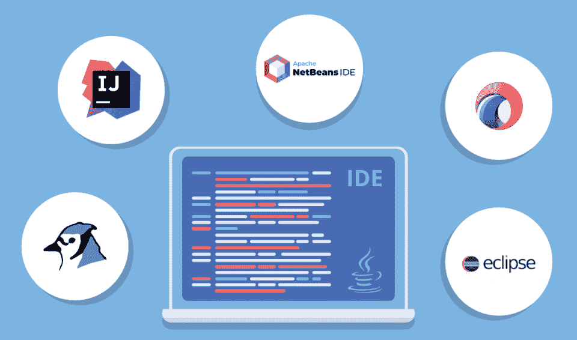

# 2023 年如何学习数据科学【循序渐进指南】

> 原文：<https://hackr.io/blog/how-to-learn-data-science>

数据科学涉及很多技术知识和流程，但也是一个创造性的领域。你需要有批判性思维和商业敏锐性来定义商业问题，并找到相关数据来解决它们。你需要分析技巧和一些创造性的思维来找到创新的方式向利益相关者传达你的见解，以及这些见解如何帮助他们的商业决策。商业智能、机器学习、预测建模、数据分析、数据挖掘、可视化等术语是**数据科学**的一部分，构成了 [**数据科学生命周期**](https://hackr.io/blog/what-is-data-science#life-cycle-of-data-science) 的不同阶段。本文将向您简要介绍如何从头开始学习数据科学。

## **为什么要学数据科学？**

现在数据是商业之王。公司和客户每秒钟都会产生大量的数据，利用这些数据，公司可以获得大量的客户信息。这有助于他们做出更好的商业决策，并在行业中获得更好的地位。数据科学在每个领域都有应用，无论是用于欺诈检测的金融，用于实现更安全交易的银行，医疗保健，零售，物流，供应链管理等等。学习数据科学给你提供了广泛的终身职业机会。你可以探索不同的领域和技能，也可以专攻多个领域。

## **学习数据科学的先决条件**

事实上，大多数课程和教程都是从头开始教的:计算机科学基础、数据结构、算法、统计学、数学、R/Python、SQL 等语言。知道，

*   基本的数学概念，如微分、积分、线性代数等。，无疑会有所帮助。
*   同样，了解基本的统计方法，如中位数、平均值等。，而且随着你选修更高级的课程，概率将变得至关重要。
*   了解至少一门编程语言，OOP 编程的概念，数据结构将会有所帮助。

## **集成开发环境(IDE)**

****

如何学习数据科学主要取决于你如何实践，IDE 是最好的学习方式。它们提供了最多的功能，因此您可以专注于重要的事情。使用 IDE 更容易，因为导入库、设置环境以及代码编译和执行变得很容易。一些顶级 ide 包括:

1.  Jupyter (Python):虽然有很多好的 Python IDE，但是 Jupyter 是我们个人的最爱。我们向所有人推荐它，因为它易于设置和使用。它是轻量级的，因为它基于基于客户机-服务器架构的 web 应用程序。您可以立即开始使用代码来创建可视化和演示。也可以把最终作品转换成 PDF 或者 HTML。
2.  RStudio:对于那些喜欢使用 R 进行数据科学的人来说，RStudio 提供了丰富的经验。它有一个开源版本和一个商业版本。RStudio 提供了丰富的图形和代码完成功能，以及语法高亮和智能缩进。RStudio 还为开发人员提供了详尽的文档和帮助功能。
3.  Eclipse 的 Scala IDE:Eclipse 是一个流行的 Java IDE，也有类似的 Scala 版本。您可以开发纯 Scala 和 Scala-Java 混合应用程序，并添加 Java 到 Scala 的引用，反之亦然。它速度很快，可以在你写的时候发现编译问题。Eclipse 还有一个智能缩进器，可以格式化代码，提供高亮显示支持，包括注释、代码折叠等等。拥有如此多的特性，它是基于 Scala/Java 的数据科学项目的首选 IDE。

### **在线 IDE**

最受欢迎的在线平台之一是 Google Colab，它建立在 Jupyter 之上，运行在 Google 云平台上。它支持 Python 2 和 3。你可以学习编写机器学习和深度学习算法的代码，并与 Keras、OpenCV、TensorFlow 等高级库合作。它是免费的，可以通过浏览器访问。

## **如何学习数据科学**

数据科学需要不同类型的技能，因为它涵盖多个学习领域。如果你想专攻某个特定的领域或工作，例如，你想成为一名数据工程师，你应该专注于那些特定的技能(如 SQL)，然而对于一名数据科学家来说，所有阶段的知识都是必不可少的..例如，您可能不需要编写算法，但您应该知道算法背后的逻辑，或者您可能不参与绘制图形和图表，但您应该知道如何推断和分析可视化效果，以充分利用数据。

您应该了解数据科学的以下阶段:

*   数据发现和收集/获取
*   数据清理和转换
*   探索性数据分析
*   机器学习技术
*   评估和改进结果

数据科学家负责设计数据建模流程，根据趋势和模式创建预测模型，以找到业务问题的解决方案。

### **四大数据科学教程**

对于数据科学的深入知识，没有一门课程本身是完整的。我们写了一篇关于数据科学课程的综合文章。以下是供初学者入门的 5 大数据科学教程，我们重复，*入门，*开始他们的数据科学之旅:

A-Z 是 Udemy 的一门付费初学者课程，涵盖了数据建模、挖掘、使用真实世界示例的可视化。本课程涵盖统计和机器学习技术，如线性回归、逻辑回归、卡方检验、混淆矩阵等。您还将学习如何使用 Tableau 进行可视化，使用 SSIS 进行数据库交互。其方法非常实用和实用。

一个 10 门课程的专业，需要大约 11 个月，每周大约 7 个小时(你可以设置自己的时间表！)是为了初学者展开他们的数据科学生涯。该专业在 80000 多条评论中的评分为 4.5/5。您将学习 R 编程、数据收集、清理、EDA、统计推断、回归模型、机器学习，以及创建可以自动化复杂任务的数据产品。

虽然名为“介绍”，这是一个中级课程，但免费。您将学习如何执行数据操作，使用统计和机器学习进行分析，数据可视化，以及广泛使用大数据(MapReduce)。这门课程要求你具备任何编程语言的基础知识，最好是 Python，以及一些统计学知识。

通过这个为期 35 周的“专业”(付费)课程，您可以从头开始学习数据科学。SQL、python 库等主题也有详细介绍。该课程是基于 Python 的，使用了像 numpy、pandas、matplotlib 和 scikit 这样的库——广泛学习。本课程循序渐进，最后还包括一个文件夹项目。它还涵盖了一些高级主题，如自然语言处理、深度学习和其他 SQL 和数据科学主题，以帮助您准备面试。

### **免费数据科学教程**

除了上述教程和课程，您还可以访问以下免费资源来学习数据科学:

### **正式文件**

Python 和 R 都是数据科学的顶级语言。您可以从以下官方文档页面了解更多关于它们的包和 API 的信息:

## **项目**

项目是在任何领域开始实践的好方法。可以从基于线性回归、k-means 聚类、决策树，或者 Apriori 算法的简单项目开始，相对简单。例如，你可以进行市场购物篮分析，或者承担客户细分项目，或者收集信息以确定一个人是否可能购买保险，等等。在我们的[数据科学项目](https://hackr.io/blog/data-science-projects)文章中有许多不同级别的项目。

## **认证**

数据科学认证将使您比其他具有类似经验的数据科学家更具优势，并帮助您通过具有挑战性的现实项目获得更多曝光率。认证是学习数据科学的重要一步，因为它们可以提升你的简历，展示你在该领域的熟练程度。我们列出了能够帮助你找到理想工作的[顶级数据科学认证](https://hackr.io/blog/data-science-certification)。

## **面试问题**

数据科学非常庞大，您可能会在数据科学生命周期的每个阶段遇到问题。你应该了解机器学习及其类型，了解一点算法(如果你有经验，可能会更多)，深度学习，工具和数据科学技术，如 TensorFlow，Tableau，SQL，Python/R/Java，或任何你用于数据科学的编程语言，等等。大多数面试中被问到的一些典型问题是:

1.  你能列举监督学习和非监督学习的各种不同吗？
2.  你能比较过度适配和不足适配吗？
3.  请解释数据清理在数据分析中的作用。
4.  [请解释特征向量和特征值。](https://hackr.io/blog/data-science-interview-questions#question-please-explain-eigenvectors-and-eigenvalues)
5.  什么是异常值，你如何对待它们？
6.  [你所理解的深度学习是什么？](https://hackr.io/blog/data-science-interview-questions#question-what-do-you-understand-by-deep-learning)
7.  作为一名数据科学家，需要哪些技能来帮助使用 Python 进行数据分析？
8.  [什么是激活功能？](https://hackr.io/blog/data-science-interview-questions#question-what-is-an-activation-function)
9.  LSTM 有哪些不同的步骤？
10.  什么是超参数？

这里是关于[数据科学面试问题](https://hackr.io/blog/data-science-interview-questions)的完整文章。

## **结束**

总结一下，下面是学习数据科学的方法:

*   数据科学浩如烟海，你得决定你想专攻哪个职称。
*   数据科学包括许多子领域，如数据分析、数据工程、数据可视化、机器学习等。数据科学家应该具备数据科学生命周期所有这些阶段的专业知识。
*   通常，所有的入门课程都从统计学、Python/R、SQL 和其他简单的编程概念开始，然后开始数据科学主题。然而，对于更快的学习过程来说，拥有这些的基础知识将是有利的。
*   数据科学涉及多个阶段:问题定义和数据发现、数据收集、数据清理和转换、数据可视化和 EDA、机器学习、模型评估、参数调整、报告生成、向利益相关者展示见解。
*   对于数据科学，有许多不同级别的免费和付费教程和课程。根据您的学习目标和项目要求，您可以选择其中任何一项或全部。
*   大部分课程都有动手项目；然而，做更多的项目会给你更多的曝光和更好的领域知识。
*   你可以为自己设定目标，参加认证课程来测试和挑战自己的能力。认证还将帮助您获得更多实践经验，并了解数据科学行业的正确期望。
*   最后一步，准备面试，非常关键。在这里，您可以了解真正的行业需求以及行业专家通常会问的问题类型。您可以通过我们网站上的问答练习，也可以阅读其他关于数据科学的文章来增强您的知识。

## **角色&职责**

数据科学家的一些关键角色包括:

*   与利益相关者合作，了解企业面临的问题
*   给问题一个适当的定义和结构，并据此收集数据
*   评估数据的准确性和相关性，清理数据并将其转换为可用的形式
*   创建可视化来执行数据的初始分析并找到模式
*   构建算法和数据模型，并评估模型的准确性
*   使用从模型中获得的见解来制定业务决策和改善整体客户体验，从而增加收入和市场份额
*   监控和评估结果，并根据结果处理反馈

## **职位名称**

数据科学职业生涯中的一些常见职称是:

*   数据科学家:通过执行详细的数据分析，设计数据建模并创建算法和预测模型；向利益相关者传达相同的信息；从解决方案中开发新的用户案例
*   数据分析师:使用工具和技术来转换和操作庞大的数据集，发现趋势和模式，并生成有用的见解和结论，从而做出更好的业务决策
*   数据工程师:从多个来源获取原始数据，对数据进行清理、分类和处理，并将其转化为可用于进一步分析的数据
*   数据架构师:规划、设计、创建和管理组织的数据架构

[完成 2023 年数据科学&机器学习训练营](https://click.linksynergy.com/link?id=jU79Zysihs4&offerid=1045023.1318112&type=2&murl=https%3A%2F%2Fwww.udemy.com%2Fcourse%2Fpython-data-science-machine-learning-bootcamp%2F)

许多人对数据分析师和数据科学家的角色感到困惑。然而，在现实中，数据科学家有更多的责任，因为他们参与了端到端的数据科学流程。了解数据分析师和数据科学家之间的更多[差异](https://hackr.io/blog/data-analyst-vs-data-scientist)。

## **未来前景**

数字世界正在快速发展，数据科学在未来几年仍将是业务扩张的重要组成部分。随着人工智能、自然语言处理和其他相关技术的普及，数据科学将在更多领域找到更多需求，从而在数据科学和相关领域产生更多就业机会。对程序员、数据库管理员、大数据工程师、软件架构师和数据分析师的需求将会很高，此外还有数据科学家，他们将在管理上述所有资源以及执行自己的任务方面发挥重要作用。Glassdoor 列出了他们在美国的十大最佳工作中的数据科学家角色。LinkedIn 最近也将数据科学评为 2023 年最热门的新兴工作。

## **动机**

如果以上这些还不足以激励你，让我们告诉你，数据科学家的角色是现在 IT 行业中薪酬最高的工作之一！在美国，数据科学家的平均年薪约为 96，315 美元，最高约为 136，500 美元(针对经理)。不仅如此，根据 PayScale 的评级，大多数数据科学家对自己的工作非常满意(4/5)。数据科学总监的年薪通常为 157095 美元。主要来说，机器学习、大数据分析、 [Python 编程](https://hackr.io/blog/python-programming-language)、算法开发、NLP 是数据科学的精华领域。

**人也在读:**