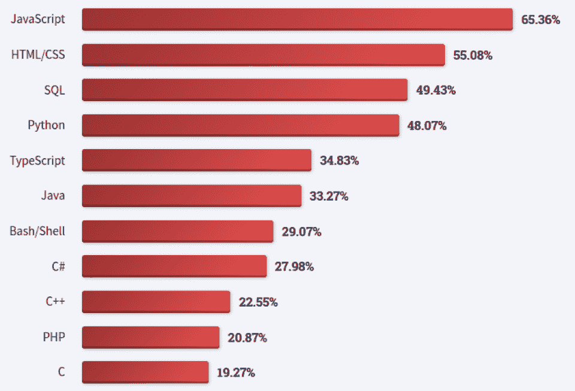

# 2023 年如何学习 JavaScript |初学者的 8 个最佳方法

> 原文：<https://hackr.io/blog/how-to-learn-javascript>

你想学习 JavaScript 但是不知道如何着手吗？或者可能你已经开始学了，但是进展很慢。如果是这样，请继续阅读！

本文总结了 JavaScript 是什么，包括它的优势，然后深入探讨了 2023 年学习 JavaScript 的 8 种最佳方法。因此，如果你一直想知道如何学习 JavaScript，无论你的预算、以前的经验或喜欢的学习方式如何，一定会有适合你的东西。

最重要的是，我们已经介绍了学习 JavaScript 的 IDEs、关于使用 JavaScript 技巧可以获得的工作的建议，以及帮助您快速学习 JavaScript 的附加提示。所以，如果你打算一步一步地学习 JavaScript，你就做对了！

## **JavaScript 是什么？**

JavaScript 是最流行的动态编程语言之一，可用于开发交互式网页、桌面应用、移动应用、游戏等等。

难怪在一年一度的 [Stack Overflow 开发者调查](https://survey.stackoverflow.co/2022/#most-popular-technologies-language)中，JavaScript 连续 10 年被评为最受欢迎的编程语言。

*JavaScript 是最流行的语言-* [*栈溢出开发者调查*](https://survey.stackoverflow.co/2022/#most-popular-technologies-language)

**想了解更多？阅读我们的深度**

**[JavaScript 简介](https://hackr.io/blog/what-is-javascript)**

## **学习 JavaScript 的优势**

*   职业机会:对 JavaScript 开发人员的需求很大。首先，在 T2，98%的网站目前使用 JavaScript。拥有这些网站的品牌和企业需要开发人员来维护它们，如果你是一名熟练的 JavaScript 开发人员，你将非常适合这些角色。

*   **通用语言:** JavaScript 允许开发人员探索前端和后端开发、移动应用程序开发、游戏开发等领域，而无需从头开始学习一门新语言。还有一系列流行的 JavaScript 库和框架，使得每个领域的开发更加容易。

*   **社区支持:**有很多支持的 JavaScript 社区和在线论坛，都很欢迎新手。选择学习 JavaScript 的你永远不会孤单，当你陷入困境时，很容易找到答案。
*   **易学:** JavaScript 是初学者友好语言的定义。学习 JavaScript 不需要任何编程经验，这就是为什么如此多的新兵训练营将 JavaScript 作为他们的首选语言。一旦你掌握了基础知识，你就可以轻松掌握 [JavaScript 框架](https://hackr.io/blog/best-javascript-frameworks)。

## **如何学习 JavaScript**

如果你想知道如何理解 JavaScript 成为一名成功的 JavaScript 开发者，你必须考虑各种学习方法，选择最适合你的方法。

但是在你开始学习 JavaScript 之前，花时间*学习如何学习*可能也会让你受益。

我知道这听起来有点奇怪，但是有一个坚实的游戏计划来最大限度地利用学习 JavaScript 的时间是有帮助的。看看谷歌的 [Learn how to learn](https://learndigital.withgoogle.com/digitalgarage-au/course/learn-how-to-learn) 这样的免费课程，一个周末就能轻松完成。

有一点是肯定的，JavaScript 从未停止成长和发展，每年都有新的框架和工具发布。这些对于 JavaScript 开发人员改善工作流程和加快开发速度非常有用。花时间*学习如何学习*可以帮助你在准备使用它们的时候充分利用它们。

## **学习 JavaScript 的 8 种最佳方法**

### **1。参加课程**

对于许多人来说，参加课程是学习 JavaScript 的一种简单方法。这些课程是自定进度的，非常适合需要自己安排时间的 JavaScript 初学者。

但是选择正确的路线可能是一个挑战。网上有许多 JavaScript 课程，有许多优秀的资源可供选择，但这也意味着也有一些不太好的资源！

如果你不确定该选择哪门课程，可以看看我们关于最好的**JavaScript 在线课程的文章，其中包括免费和付费选项。**

 **通过参加这些在线课程，您将学习 JavaScript 编程的理论，并且您还将练习构建项目以添加到您的投资组合中。

您甚至可以更进一步，为您的项目添加额外的功能。这样，当你能在你的作品集里展示它们时，你就能在潜在雇主面前脱颖而出。

### **2。从书本中学习**

如果你更喜欢通过阅读来学习，你应该考虑投资 [**JavaScript 书籍**](https://hackr.io/blog/javascript-books) **。这些可以是你学习的主要来源，也可以是很好的补充学习材料。**

书籍是深入了解 JavaScript 知识的重要来源，它们通常由具有多年经验的行业专家撰写。

编程书籍在出版前也要经过严格的审查，确保读者获得准确和相关的信息。

书籍的一大优点是，它们让你很容易找到你需要的东西。像大多数开发人员一样，您会发现即使在您作为 JavaScript 开发人员的职业生涯有所进展之后，您还是会不断地回到书本上。

### **3。编码训练营**

编码训练营提供了一种从零开始学习 JavaScript 的结构化方法。他们把你放在时间表上，强迫你在短时间内学到很多东西。

自己学习很棒。但有时候，很难让自己负责任。

报名参加新兵训练营可以让你加入其他学习者的社区，并直接接触老师。如果你需要对复杂的话题寻求进一步的解释，这是非常好的。

大多数训练营让学生建立顶点项目，这通常涉及应用先进的概念。这是一个很好的方式来创建有价值的项目，向招聘人员和潜在雇主展示。

如今，编程训练营的课程中还包括职业教练课程。这些会议为获得一份 JavaScript 开发人员的工作提供了宝贵的见解。有些公司甚至有招聘会，你可以在那里与来自初创公司的代表互动，这些公司对招聘初级开发人员开放。

**申请 JavaScript 开发人员工作？看看这些**

**[Javascript 面试问题&答案](https://hackr.io/blog/javascript-interview-questions)**

### **4。聚会&会议**

大多数聚会或会议都以专家演讲为特色，这是学习新技能或从新的角度看待特定话题的好方法。

当您参加聚会或会议时，您还可以与处于不同职业阶段的其他开发人员进行互动。这是一个扩大你的职业关系网和了解可能没有公开招聘的潜在工作的好方法。

JavaScript 是一种不断发展的语言，参加聚会和会议可以帮助你跟上新趋势。

### **5。构建项目**

一旦你学会了 JavaScript 基础知识，你就需要开始构建项目了！

这将帮助你快速掌握你从教程中学到的概念，并且你可能会发现如果你只在教程旁边写代码，你将不会有所提高。你需要坚持自己构建东西，真正将编码技能植入你的大脑。

当你建立项目时，你会被卡住。没关系。这是你自己想出解决办法的时候了。这样做将有助于您提高调试和研究技能，这是作为开发人员必须具备的两个基本素质。

你还应该花时间学习版本控制工具，比如 Git，当然还有 GitHub。这些在构建您的项目时非常重要，因为它们将帮助您了解专业开发人员日常使用的最佳实践。

拥有坚实项目的强大 GitHub 档案也可以作为您的投资组合。

**兴奋地建造东西？检查一下**

**[15 个最适合初学者的 JavaScript 项目](https://hackr.io/blog/javascript-projects)**

### **6。当众学习**

更快地学习任何技能的最好方法之一是分享你所学的或教授它。

有很多方法可以做到这一点，比如写博客，制作视频，或者在 Stack Overflow 这样的网站上回答问题。

还可以加入[代码 100 天](https://www.100daysofcode.com/)挑战。这要求你在 100 天内每天至少学习一个小时，同时与他人分享你所学到的东西。

在公共场合学习迫使你比平时写 JavaScript 时更深入。如果你做错了什么，你很可能会遇到愿意纠正你的人。这样做真的可以帮助你成为一个更加坚持不懈的学习者。

### **7。阅读文档**

从 JavaScript 教程中学习是有好处的。通常，他们会给你一个概念概述，这足以让你开始。但是如果你想深入研究某个特定的主题，你就必须*阅读文档*。

阅读文档有助于您学习如何编写干净、可读的代码。当您在团队中工作时，这是一项很有价值的技能，它还会减少您在调试 JavaScript 代码中的错误上花费的时间。

如果您想作为 JavaScript 开发人员采用行业最佳实践，那么文档应该是您的首选资源。您应该查阅的一个优秀的 JavaScript 文档是 [MDN JavaScript 参考文献](https://developer.mozilla.org/en-US/docs/Web/JavaScript/Reference)。

### **8。开源项目**

开源项目的源代码是公开的。您可以检查代码，甚至请求修改或改进它。

作为一名初学者，在学习 JavaScript 如何在现实项目中使用的同时，为开源做贡献是提高 JavaScript 技能的好方法。

在为开源项目做贡献时，你将学习如何在团队中编码，这对于提高你的软技能，如沟通、团队合作和代码审查是非常好的。这些都是 JavaScript 开发人员必备的技能。

在为开源做出贡献之前，你不需要成为一名专家。许多开源项目鼓励 JavaScript 初学者做出贡献。你可以只查看[第一次的](https://www.firsttimersonly.com/)来获得如何开始的实用指南。

**寻找更多学习 JavaScript 的方法？结账**

**[最好的 JavaScript 教程](https://hackr.io/tutorials/learn-javascript)**

## **选择 IDE 学习 JavaScript**

集成开发环境(IDE)是一种使开发人员能够方便高效地编写代码的程序。

您可以使用简单的文本编辑器(如记事本)编写您的 JavaScript 代码，但是由于 ide 是专门为编写代码而设计的，使用它们将提高开发人员的工作效率，并带来许多其他好处。

*   **语法突出显示:**ide 通过格式化使代码更具可读性。他们将某些单词加粗、斜体或不同的颜色，这使得在必要时很容易发现错误。
*   **自动完成:**这有助于开发人员更快地编写代码。这类似于当你开始输入你的查询时，谷歌如何提供建议。
*   **重构:**大多数 ide 都有自动重构特性，允许开发人员在不影响核心功能的情况下重构代码。
*   自动化:ide 可以自动化诸如编译、测试和调试之类的任务

有两种主要类型的 ide 可供选择，本地 ide 和云 ide。

*   本地 ide:开发者可以下载并安装在他们的本地环境中。本地 ide 的一个优点是它们允许大量的定制，但是它们也需要强大的处理能力才能顺利运行。一些流行的 JavaScript 本地 IDE 的例子是 IntelliJ IDEA 和 Komodo IDE。
*   **Cloud IDEs:** 允许程序员在浏览器内编码，无需在你的电脑上下载或安装软件。作为一个独立于平台的平台，你可以通过一台连接到互联网的计算机从任何地方访问云 IDE。一些流行的 JavaScript 云 ide 是 Amazon 的 Cloud9 和 CopePen。

如果您不需要 IDE 的全部功能，代码编辑器也是一个可靠的轻量级选择。一些流行的代码编辑器是 Visual Studio Code (VS Code)、Atom 和 Sublime Text Editor。

## **学习 JavaScript 可以获得哪些工作？**

1.  **网络开发者:** JavaScript 掌控了互联网上网站客户端 [98%的份额，所以对 JavaScript 开发者的需求很高是有道理的。当你学习 JavaScript 时，你可以成为一名 web 开发人员来建立和维护网站，根据你的兴趣，你可以专门成为前端，后端或全栈开发人员。](https://w3techs.com/technologies/details/cp-javascript)
2.  **移动应用开发者:** JavaScript 在构建移动应用方面非常流行。如果你有兴趣成为一名移动应用开发者，你可以探索 JavaScript 库和框架，如 React Native、Ionic、Ember.js 等。
3.  系统管理员:系统管理员的职责包括维护服务器、网络、软件和硬件。作为系统管理员，理解 JavaScript 将有助于您创建用于故障排除和管理系统的脚本。
4.  **安全工程师:**安全工程师确保网络、服务器、数字设备的安全，防止数字攻击。如果你想进入网络安全领域，了解 JavaScript 这样的编程语言将会扩大你的职业选择。
5.  **技术作家:**如果你擅长分解复杂的、技术性的话题，这是一个你可以考虑的职业选择。技术作者利用他们的技能来创建文档、产品手册、操作指南等等。

## **额外提示:如何快速学习 JavaScript】**

如果你想知道学习 JavaScript 的最快方法，下面的提示可以帮助你。

*   **日常练习:**一致性会帮助你学得更快。例如，每天练习一个小时比不定期练习 6 个小时要好。
*   **避免自动完成代码:**在学习的早期阶段，你希望熟悉这门语言。当你已经牢牢掌握了基础知识的时候，试着只使用自动完成。
*   让你的代码被审查:向有经验的开发人员展示你的代码，并征求他们的反馈。这种实践将帮助您改进代码并学习最佳实践。
*   **解决编码难题:**使用类似 [CodeWars](https://www.codewars.com/) 、 [HackerRank](https://www.hackerrank.com/) 或 [LeetCode](https://leetcode.com/) 这样的网站来应对旨在帮助你提高解决问题技能的挑战。
*   **学习版本控制:**学习如何使用 Git 这样的工具。它将帮助您跟踪您的项目进展情况，并且在与其他开发人员协作时也很有用。
*   **阅读你钦佩的开发人员的故事:**向他们学习，包括他们如何学习编码和应对挑战。这能激励你坚持下去。
*   **听播客:**你可以从一段精彩的播客中快速学习。一些初学者播客推荐是 [CodeNewbie](https://www.codenewbie.org/podcast) 、 [Scrimba](https://scrimba.com/podcast/) 和 [HTML All The Things](https://podcast.htmlallthethings.com/) 。
*   休息:有规律的休息会帮助你避免精疲力尽。有时候，你需要离开屏幕一段时间来解决一个 bug。
*   **提问:**当你卡住的时候(你会的)，谷歌一下，提问。不要害羞或害怕别人会看不起你。最好的高级开发人员总是问问题，并且不怕说他们不知道。

## **结论**

用 JavaScript 编码是一项很有价值的技能。大多数初学者渴望学习，但不确定如何学习 JavaScript 或使用哪些资源。

本文讨论了 2023 年学习 JavaScript 的 8 种最佳方式，包括课程、书籍、训练营、会议、构建项目、阅读文档以及为开源项目做贡献。

最棒的是，你可以结合使用这些方法来学习 JavaScript。如果我们想强调一种学习 JavaScript 的特定方法，那就是构建项目。这是一个很好的方式来巩固你的理解，同时创建一个投资组合来展示给潜在的雇主。

为了帮助您开始 JavaScript 之旅，我们还提供了关于选择 IDE 的建议、快速学习 JavaScript 的额外提示，以及通过学习 JavaScript 可以获得的一些不同的工作。

想要提升你的简历吗？结账

**[最佳 JavaScript 认证](https://hackr.io/blog/best-javascript-certification)**

## **常见问题解答**

#### **1。可以自学 JavaScript 吗？**

是的，你可以。您可以使用许多资源从头开始学习 JavaScript，包括在线课程、书籍、训练营和视频教程。如果你不确定如何开始学习 JavaScript，要知道许多 JavaScript 开发人员都走了自学路线，所以你也可以这样做。

#### **2。学 JavaScript 难吗？**

这取决于你是否是编程初学者。如果你精通其他编码语言，学习 JavaScript 就不会有挑战性。另一方面，如果你正在从头开始学习编码，JavaScript 是一个很好的选择，因为它对初学者很友好。但是像任何新技能一样，你必须投入时间来真正吸收信息和整体计算机编程概念。

#### **3。学习 JavaScript 最好的方法是什么？**

从头开始学习 JavaScript 的最佳方式将取决于您喜欢的学习风格。有人喜欢网络课程，有人喜欢书本，有人喜欢加入新兵训练营的声音。你必须弄清楚什么最适合你，然后去做。

#### **4。学 JavaScript 需要多长时间？**

这取决于你的技能水平，以及你能投入学习的时间。对于有经验的程序员来说，学习 JavaScript 语言的语法需要 2-3 周的时间。初学者学习 JavaScript 可能需要更长的时间，所以根据你的时间表，准备花 3-6 个月的时间。

#### **5。JavaScript 开发者赚多少钱？**

这取决于几个因素，包括你的教育和经验，但 2023 年 JavaScript 开发人员的平均基本工资超过 8 万美元。

**人也在读:****