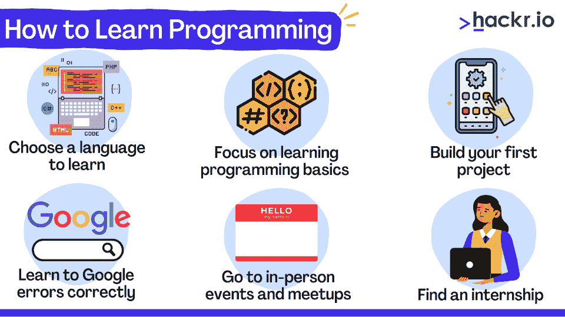
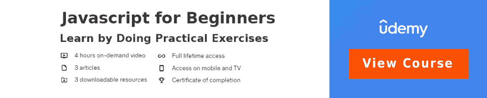
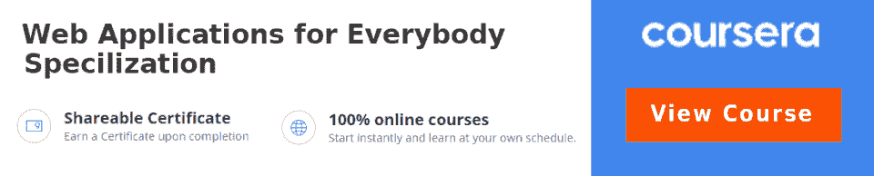

# 如何学习编程:方法、训练营和课程

> 原文：<https://hackr.io/blog/how-to-learn-programming>

随着人工智能技术的数字化和智能化，学习编码已经成为一个时代的需要。编码和编程之间有一些微妙的差别，但是不管怎样，这都是一项重要的技能。

获得优步奖、网上购物、流媒体电影——所有这些都涉及编码和编程。在这里，我们讨论如何学习自己选择的编程语言，以及开始编程之旅的正确方式。

## **如何学习编码**

在我们开始之前，你必须注意到学习编程需要耐心和动力——最重要的是，不管途中有什么挑战，都不要放弃。解决了这个问题，让我们开始学习编程的[基础知识。](https://hackr.io/tutorials/learn-intro-to-programming)

### **学习编程基础知识**

第一步，选择要学习的编程语言。Python 对于初学者来说是个不错的选择，因为它像英语一样简单易学。你可以查看一些[最好的 Python 教程](https://hackr.io/tutorials/learn-python?ref=blog-post)来开始。

但是你也可以选择你感兴趣的语言或者基于你想开发的项目的语言。因此，如果你计划开发一个移动应用程序，你可能想分别从 Android 的 [Java 或 Kotlin](https://hackr.io/blog/kotlin-vs-java) 和 iOS 的 Swift 开始。如果你想建立一个网站，选择 Javascript。

对于数据科学来说， [AI & ML](https://hackr.io/blog/ai-vs-machine-learning) ， [Python & R](https://hackr.io/blog/r-vs-python) 是要学习的语言。学习编程语言主要有两种方法。但是在这两种情况下，你将不得不花费大量的时间来编码——这是无法避免的。

#### **1。通过互动网站**

像 Codecademy 和 Freecodecamp 这样的网站是交互式编码会话的好选择。这些都是基于这样一种想法建立的，即许多初学者都停留在开始阶段——当他们在建立开发环境时开始学习编码。这些网站提供在线文本编辑器和编译器，让你可以立即开始编码。

#### **2。通过视频教程**

如果你喜欢一步一步指导的详细说明，那么我们建议你注册任何一个[在线编程教程](https://hackr.io/)。一些教程和课程还提供证书，可以帮助你申请工作。我们建议初学者教程使用 Pluralsight 和 Lynda。当然，你可能也想看看 Hackr.io 上排名靠前的教程。

### **重点学习编程基础知识**

彻底学习基础知识，通过制造自己的问题并解决它们来接触代码。无论何种语言，以下主题都很重要:

*   数据类型
*   变量
*   功能
*   数组或列表
*   If 语句
*   条件循环
*   类别和对象
*   异常处理
*   树木和地图

### **构建您的第一个项目**

建立一个个人项目是理解你所学知识的最好方法。这给了你一个实际的学习经验，并让你的手进入调试过程。将您的项目添加到您的个人资料或 GitHub 帐户中，因为这有助于您寻找开发工作。

那么如何选择编程项目呢？

### **应该如何选择项目？**

这是大多数人在决策阶段陷入困境的地方，但解决方案相当简单。

#### **1。选择你感兴趣的**

无论是学习还是编程，你都必须做你最感兴趣的事情。你必须享受你所选择的项目领域，这样你才会对它充满热情，它会让你一直参与下去，直到它建成。

如果你选择了你不感兴趣的东西，你可能会中途放弃你的项目，因为你可能最终对它缺乏兴趣。出于这个原因，你应该选择一个与你热爱的事情相关的项目。

例如，如果你喜欢玩游戏，那么你可能只想开发一个简单的视频游戏。如果你是一个业余摄影师或艺术家，你可能想建立一个作品集网站，展示你所有的艺术作品。

#### **2。从简单的事情开始**

对自己的能力有信心是好的，但过于自信就不好了。在开始构建复杂的项目之前，从简单和容易的项目开始探索这种语言。

例如，如果你选择制作一个视频游戏，不要尝试复杂的游戏。相反，从类似[井字游戏](https://hackr.io/blog/python-projects)开始。

#### **3。为自己和社区做些有用的事情**

做一些对你有用的事情，同时让社区感兴趣。这给了你一个机会，让你有几个下载或观众，这样你可以展示你的技能，比其他候选人有优势。

例如，您可以构建一个使监控和处理投资变得更容易的财务应用程序、一个自动告诉我们某件商品何时有货的脚本、一个帮助您提高生产率的 web 应用程序等等。

### **一些初始想法**

如果你仍然有困难，我们会给你一些灵感。你可以从一个提供待办事项列表的简单网站开始。如果你想做一个游戏应用，那么像俄罗斯方块和数独这样的游戏是很好的起点。

Hackr 为您提供了从初级到高级的多种语言的许多项目想法，例如:

### **感觉卡住了？**

编程的时候难免会在某个点卡壳。这可能是任何事情，从得到错误，您的程序崩溃没有任何消息，甚至您的代码执行良好，但没有产生您想要的输出。你会感到沮丧，但不要放弃！

保持动力，用这些建议继续你的项目。

#### **1。学会正确谷歌错误**

这是你必须掌握的关键一步。搜索和浏览代码中的错误可以帮助你在几分钟内纠正代码。一个很好的技巧是，在 Google 上搜索之前，将编译器生成的错误放在双引号(" ")中。这样，谷歌会明确地将错误定位为同一个句子。

#### **2。引导你的热门网站**

像 Stack-Overflow 和 Reddit 这样的网站在这里名列前茅，为世界各地的开发人员提供代码指导。你也应该回答别人提出的问题，这也有助于你学习。

#### **3。活动和聚会**

这一步可能很难开始，因为它需要你离开你的舒适区，但它会产生巨大的差异。从寻找有相似兴趣的人开始，试着向他们学习并和他们一起工作。你可以尝试搜索你所在地区的“编码事件”,或者访问一个 meetup 网站。

### **找份工作或实习**

最后，很多学习编程语言是为了开始职业生涯。当你足够自信或者相信自己懂一些基础编程的时候，你可能会想从实习开始踏入开发行业。实习给了你一个学习和提高技能的机会，有时甚至还能得到报酬。

你可以通过 LinkedIn、招聘会和社交网络找到实习机会。

### 计算机科学学位或训练营:学习编程哪个最好？

训练营是那些开始编码之旅的人的普遍想法。事实是，这完全取决于个人和他们的学习能力。

如果你是一名即将进入大学的高中生，那么计算机科学学位可能会更好。如果你年龄大得多，那么你可能想参加一个你选择的编程语言训练营。

在线课程是免费的，适用于所有编程语言。初学者可能想要一种更简单的语言，所以你可能想看看类似于[最佳 Python 课程](https://hackr.io/blog/best-python-courses)的在线课程。

最好在参加训练营之前，先从在线课程开始，体验一下编程的味道，因为训练营通常很贵。如果你真的对训练营感兴趣，这里是我们列出的 2023 年最佳编码训练营。

## **结论**

希望你现在已经掌握了开始学习和编写第一个项目所需的知识。我们 Hackr.io 列出了你可能想了解的几乎所有[编程语言](https://hackr.io/blog/best-programming-languages-to-learn)的最佳课程。

你有其他的技巧想和编程社区的其他人分享吗？下面让我们了解一下。

## **常见问题解答**

#### **1。我如何开始学习编程？**

通过简单地尝试编码一个简单的项目。你可以查看文档、书面教育资源、YouTube 视频——任何有助于你实际编码的东西。就这么简单。你可以用你选择的语言谷歌初学者编码项目，或者检查上面列出的那些。

#### **2。可以自学编程吗？**

当然，许多人就是这么做的。你所需要的只是学习的意愿、耐心和毅力，以及在网上做研究的能力。

#### **3。你应该从几岁开始编码？**

越年轻越好，因为入门不是很难。编码在提供职业机会和开动你的大脑方面有如此大的潜力。无论如何，大多数孩子对电脑都有些熟悉，所以 8 岁左右可能是理想的年龄。

但是请记住，有许多年过 50 的人还在学习编程——年龄不是障碍！

**人也在读:**