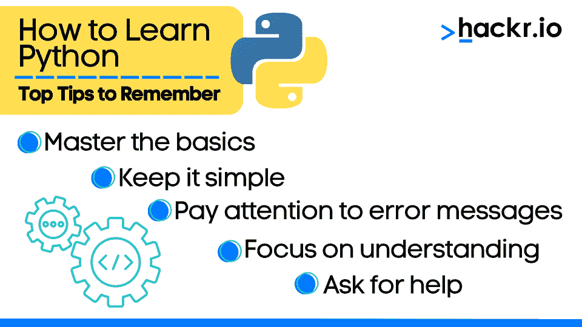
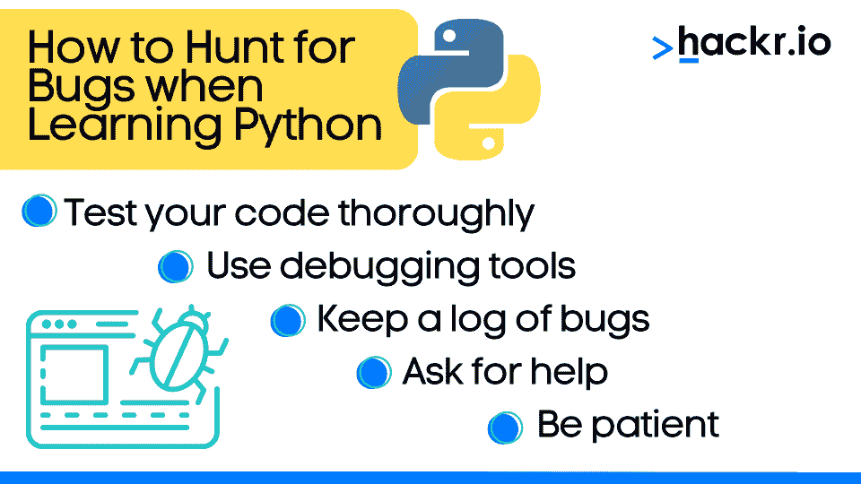

# 2023 年如何学习 Python:终极指南

> 原文：<https://hackr.io/blog/how-to-learn-python>

2023 年，Python 继续成为最受欢迎的编程语言之一，广泛应用于各个领域。无论你对数据科学、web 开发、移动应用、游戏还是机器人感兴趣，学习 Python 都是推进你职业生涯的好方法。

本指南将涵盖如何通过定义你的动机、学习 Python 语法、构建项目、为开源做贡献等等来有效地学习 Python。到最后，你会有一个在 2023 年成为熟练 Python 程序员的详细路线图。

## **如何学习 Python:循序渐进指南**

你准备好了吗？让我们深入研究一下 2023 年如何学习 Python 的详细指南吧！为了保持条理，我们将该路线图分成了单独的步骤。

在你跳过之前，这些步骤是为了帮助你从学习中获得最大收益，但是如果你是一个特立独行的人，喜欢按你的方式做事，那就去做吧！

### **1。了解如何避免常见的 Python 错误**

****

如果你是 Python 新手，你需要注意常见的错误和陷阱。看看这个学习 Python 应该做的事情列表:

*   掌握基础知识 :花时间理解基本概念。
*   保持简单 :避免编写过于复杂的代码，尤其是作为初学者。
*   注意错误信息 :当你遇到错误时，花点时间去理解它们告诉你什么，并学习如何修复它们。
*   **着重理解** :与其死记硬背 Python 的每一个细节，不如着重理解其中的概念，并在实际情况中应用。
*   寻求帮助 :在学习像 Python 这样的新语言时，这可能特别有价值。

### **2。定义你的动机**

对于初学者来说，学习 Python 最重要的一步是确定你的动机。无论是为了职业发展，语言的多功能性，学习的便利性，大型 Python 社区，还是广泛的应用，清楚地了解为什么要学习 Python 可以帮助你保持专注和动力。

考虑你的长期目标也很重要。你是希望专攻某个领域，比如数据科学或 web 开发，还是只是对学习一门新的编程语言感兴趣？

对你的目标有一个清晰的理解将有助于你专注于你想要实现的目标，并且更容易确定你需要的资源和工具。

**好奇 Python 和 JavaScript 相比如何？看一看**

**[Python vs JavaScript](https://hackr.io/blog/python-vs-javascript)**

### **3。学习你需要的 Python 语法(快速)**

学习 Python 的最好方法之一是理解编写代码的规则和结构，因为这将使你的代码具有可读性、结构化，并能被其他人理解。

这里有一些帮助你快速学习 Python 语法的技巧。

*   **从基础开始** :从 Python 语法的基础开始，比如变量、数据类型、运算符、控制结构、函数等。
*   **利用网上资源:** 寻找教程或者阅读 [官方文档](https://docs.python.org/3/) 。
*   练习，练习，练习 :你练习编码越多，你学习语法就越快。
*   **寻求他人的帮助** :如果你正在努力理解 Python 语法的某个方面，请不要犹豫，向 Python 社区的其他人寻求帮助。
*   **使用备忘单** : [Python 备忘单](https://hackr.io/blog/python-cheat-sheet) 简洁易用，当你在处理一个项目或陷入编码问题时，它们是一个有用的工具。

### **4。每天花时间编码**

为初学者编写 Python 代码一开始可能很有趣，但是当你给代码增加更多的复杂性时，就会变得很有挑战性。解决这个问题的最好方法是一致的编码实践。

随着你的熟练程度的提高，学习编写 Python 代码变得更加容易，这可以通过每天练习来实现。这也是一个很好的方法来保留信息，避免忘记你所学的知识。

这里有一些让你的日常编码实践发挥最大效用的技巧。

*   每天留出特定的时间练习用 Python 编程。
*   从要解决的小练习或问题开始。
*   逐渐增加你所解决问题的复杂性。
*   记录你的进步。您可以使用笔记本、代码库或任何其他适合您的工具来跟踪您的进度。
*   定期重构你的代码。
*   不要害怕犯错误。
*   寻求他人对你的代码的反馈。

记住，关键是要坚持不懈地努力。

[查找远程 Python 作业](https://jobs.hackr.io/search/jobs?searchTerm=%22python%22&location=Remote,%20USA)

### **5。关闭自动完成功能**

当学习用 Python 编写代码时，依赖自动完成和其他工具来帮助你更快地编写代码是很诱人的。然而，从长远来看，过于依赖这些工具实际上会减慢你的进度。

通过手动打出代码，强制记忆语法和结构，可以帮助你更好的记忆。这将让你建立一个理解语言的坚实基础，而不是依赖工具来为你写代码。

如果你打算参加技术面试，这一点尤其重要，因为你可能需要在没有自动完成或其他 IDE 提示的帮助下，在白板上写出代码。

当然，随着时间的推移，您可以将这些工具整合到您的工作流程中，使编码变得更容易，但是最初建立一个强大的知识基础是很重要的。

### **6。记笔记**

学习 Python 时，记录你学到的概念、你完成的例子以及你在学习过程中遇到的任何问题是很重要的。

下面是学习 Python 时记笔记的几个好处。

*   加深理解
*   以后使用的参考资料
*   帮助将来排除故障
*   允许你对材料进行批判性思考，并考虑不同的概念和例子是如何结合在一起的

为了从记笔记中获得最大收益，保持条理和一致性很重要。考虑使用笔记本或笔记应用程序，让你的笔记井井有条，便于查阅。

此外，确保以对你有意义的方式记笔记，无论是通过书写还是绘制图表和思维导图。

### **7。互动**

这是一个简单但强大的想法。不只是在编辑器或 IDE 中编写代码，然后运行脚本，而是在终端中启动一个交互式 Python 会话。

通过这样做，你可以试验代码并收到即时反馈。这是一个测试不同特性、寻找破解代码的方法以及一般使用 Python 的好方法。

这样做可以让你更快地了解代码是如何工作的，而不必重写和重新运行 Python 脚本。

### **8。排班中断**

这很简单，但对确保你的大脑能够吸收你正在学习的所有新技能非常重要。例如，你可以每小时休息 10 分钟，或者每两小时休息更长时间。

在休息时间，你可以做一些与编码完全无关的事情，比如伸展运动、散步或看书。

这可以帮助你理清思路，重新精力充沛地投入编码工作。它还可以帮助你有一个清晰的目标，让你更容易集中注意力，保持动力。

此外，知道休息时间即将到来会给你一种紧迫感，让你在休息前完成尽可能多的工作，这实际上会让你更有效率。

### **9。寻找 bug**

****

bug 是软件开发过程中常见且被期待的一部分。它们可能会令人沮丧并具有挑战性，但是找到并修复 bug 对于提高您的编码技能并确保您的程序正确运行是至关重要的。为了帮助你有效地找到并修复 bug，这里有几个小技巧:

*   彻底测试你的代码: 在不同的场景和边缘情况下测试你的代码，以捕捉尽可能多的错误。
*   **使用调试工具:** 这些可以帮助你识别 bug 的根本原因，并找到修复它的最佳方法。
*   记录错误: 这可以帮助你跟踪你的进度，避免重复同样的错误。
*   **寻求帮助:** 无论是从导师、在线论坛，还是程序员社区，获得新的视角可以帮助你更清楚地看到解决方案。
*   耐心点: 修复漏洞可能是一个耗时且具有挑战性的过程，但耐心和坚持是很重要的。

记住，作为一名程序员，bug 是一个学习和成长的机会。拥抱挑战，并把它作为成为更好的程序员的一种方式。

这是学习之旅的一个重要方面。加入一个由志趣相投的人组成的社区可以帮助你保持动力和方向。

以下是加入 Python 学习社区的一些好处:

*   获得丰富的资源
*   合作机会
*   提出问题并获得支持
*   网络机遇

你可以加入许多在线社区，比如论坛、在线小组和社交媒体小组。一些流行的学习 Python 的社区有 Reddit 的[r/learn Python](https://www.reddit.com/r/Python/)，以及[Python Discord server](https://discord.com/invite/python)。

总的来说，加入学习者社区是您 Python 学习之旅中非常宝贵的一部分，因为它可以为您提供支持、动力和机会来继续提高和发展您的技能。

### **11。教别人**

教别人是巩固你所学知识的一个极好的方法。通过教导他人，你被迫以不同的方式思考材料，并以他人易于理解的方式进行解释。此外，教导他人可以帮助你发现你自己需要提高理解的地方。

教导他人也是回报社区的一个好方法。通过分享你的知识，你可以帮助别人学习，在这个过程中，你可以积极地影响这个世界。

### **12。团队编程**

编程时与他人合作是学习和提高技能的一种非常有效的方式。通过与他人合作，您可以学习解决问题的新方法，获得新的编程概念，并获得对您自己工作的有价值的反馈。

如果你是编程新手，并且没有团队合作，考虑加入当地的编码俱乐部，参加在线编码社区，或者参加黑客马拉松或编码挑战。这些小组可以提供一个支持性的环境，在这里你可以与其他人一起练习编码，并与有抱负的程序员联系。

### 13。问好问题

**G:目标导向:** 提出关于特定目标或结果的问题，以获得更相关、更有价值的答案，帮助你在学习过程中取得进步。

**O:开放式:** 避免问那些可以用简单的是或否来回答的问题。问一些可以提供更详细、更丰富答案的问题。

**O: Original:** 试着问一些以前没人问过的独特问题。这有助于你得到一个更个性化的答案，并表明你在寻求帮助之前已经努力研究和理解了这个话题。

直接:确保你的问题清晰直接。避免问难以理解或解释的模糊问题。

### **14。构建项目**

如果你想知道如何用 Python 编程，你必须参与项目。这样做可以让您应用所学的概念，并获得应对实际编码挑战的实践经验。

这里有一些技巧可以帮助你充分利用你的项目建设经验:

*   **从简单的开始:** 作为一个初学 Python 的人，最好从一个你可以相对快速构建的简单项目开始。这会给你一种成就感，帮助你建立自信。
*   选择一个你感兴趣的项目: 找到一个你热爱的项目。这会让你更容易保持动力，专注于手头的任务。
*   编码前做好计划: 这将有助于你保持条理性，并确保你的代码整洁有序。
*   对反馈持开放态度: 这可以帮助你发现需要改进的地方，并学习新技术。
*   从其他项目中学习: 这会给你新的想法，并帮助你了解其他人是如何处理类似问题的。
*   使用版本控制: 这将使你在遇到问题时更容易恢复到早期版本。
*   **不要害怕寻求帮助:** 这是一个向他人学习和成长为程序员的绝佳机会。

#### **要考虑的启动项目想法**

我们有大量的 [带源代码的酷 Python 项目](https://hackr.io/blog/python-projects) 供你选择，但是这里有一些想法可以让你开始:

*   掷骰子发生器
*   刽子手游戏
*   密码强度检查器
*   Tic-Tac-Toe
*   计算器
*   二分搜索法算法

#### **数据科学和机器学习项目**

数据科学和机器学习是 Python 的一个非常受欢迎的应用，非常适合那些有数学或统计学背景的人。

这里有一些你可以在数据科学和机器学习中考虑的项目想法:

*   预测航班延误
*   网飞推荐系统
*   使用 CNN 的图像分类
*   语音识别和转录

#### **用 Python 开发 Web 项目的想法**

使用 Python 构建项目时，Web 开发是另一个值得探索的领域。Python 有几个流行的 web 开发框架，比如 Flask 或 Django。

这是你学习 python 时可以考虑的几个项目思路:

**前端 Python 项目思路:**

*   个人投资组合网站
*   电子商务网站
*   食谱分享网站
*   新闻聚合网站
*   在线论坛网站

**后端 Python 项目思路:**

*   内容管理系统
*   社交网站
*   求职公告板网站
*   房地产上市网站
*   网上预约系统

**全栈 Python 项目思路:**

*   在线市场网站
*   健身追踪器网站
*   活动管理网站
*   在线学习平台
*   音乐流媒体网站

**好奇 Python 和 PHP 的区别？结账**

**[Python vs PHP](https://hackr.io/blog/python-vs-php)**

#### **使用 Python 的游戏项目创意**

你可能无法建立下一个传奇联盟，但是如果你对游戏开发感兴趣，Python 是海龟图形和 PyGame 库的一个很好的起点。这里有一些不同的项目想法需要考虑:

*   基于文字的冒险游戏
*   互动小说
*   基于图形用户界面的游戏
*   多人游戏
*   人工智能游戏

请记住，我们的目标不是创造下一个大型视频游戏，而是构建挑战您的 Python 技能并帮助您学习的项目。所以，不要害怕从小处着手，随着经验的积累，逐步完成更复杂的项目。

#### **机器人技术&用 Python 实现硬件项目创意**

如果你对用 Python 编程硬件系统或机器人感兴趣，那么这里有几个好玩的项目供你考虑:

*   循线机器人
*   避障机器人
*   自主无人机控制
*   声控家庭自动化系统
*   自动植物浇水系统
*   具有面部识别功能的智能安全摄像头

#### **发现引人入胜的项目创意**

想出既吸引人又富有挑战性的项目创意可能会很有挑战性。以下是一些可能有帮助的建议:

*   从你感兴趣的事情开始。
*   解决现实世界的问题。
*   利用网上资源。
*   参加黑客马拉松或编码比赛。

记住，项目创意的关键是保持好奇心，探索不同的主题和感兴趣的领域。不要害怕冒险和尝试新事物。你尝试的越多，你学到的就越多。

### 15。为开源做出贡献

通过参与开源项目，你可以解决现实世界中的问题，建立自己的作品集，并与其他开发者建立联系。自然，GitHub 是一个寻找项目的好地方。

这里有几个步骤可以让你开始为开源项目做贡献:

*   确定你感兴趣的项目。
*   阅读投稿指南。
*   从小处着手。
*   参与社区活动。
*   坚持学习。

通过遵循这些步骤，你可以为开源项目做出有意义的贡献，并将你的编码技能提升到一个新的水平。

## **结论**

学习 Python 是一种有趣且有益的经历，本文为您提供了在 2023 年如何快速有效地学习 Python 的详细路线图。

通过遵循我们列出的技巧，并坚持不懈地努力，您可以在 Python 中打下坚实的基础，并开始构建激动人心的项目，为技术社区做出有意义的贡献。

因此，保持动力，提出好的问题，加入学习者社区，享受旅程吧！

**准备开始学习 Python 了吗？结账**

**[完整的 Python 训练营](https://click.linksynergy.com/deeplink?id=jU79Zysihs4&mid=39197&murl=https%3A%2F%2Fwww.udemy.com%2Fcourse%2Fcomplete-python-bootcamp%2F)**

## **常见问题解答**

#### **1。学 Python 难吗？**

由于其用户友好、简单的语法和优秀的文档，Python 相对容易学习。

当然，还有一个问题是学习 Python 的最好方法是什么。这个问题的答案取决于你的学习方式和空闲时间，但是课程、教程或书籍是很好的起点。

#### **2。可以免费学 Python 吗？**

是的，网上有很多免费学习 Python 的资源。如果您不确定在哪里学习 python，可以考虑课程、书籍和教程。

#### **3。可以从零开始学 Python 吗(没有编码经验)？**

如果您没有编程经验，Python 是一种很好的开始语言，因为它简单的语法和用户友好的编程方法使它成为新手描绘编程基础的极好方法。

如果你不确定如何开始学习 Python，可以考虑参加初级 Python 课程。

#### **4。学习 Python 需要多长时间？**

这取决于不同的因素，比如你在学习上投入了多少时间，你是从头开始学习还是学习另一种语言。一般来说，初学者学习 Python 需要 3 到 6 个月的时间。

#### **5。怎样才能更快的学习 Python？**

要想更快地学习 Python，请遵循我们在本文中提供的提示，专注于动手项目，寻求他人的帮助，练习，练习，再练习！

#### **6。应该学 Python 2 还是 3？**

强烈建议学习 Python 3，因为从 2020 年 1 月起不再支持 Python 2，并且很少在新项目中使用。事实上，由[JetBrains](https://lp.jetbrains.com/python-developers-survey-2021/)进行的一项 Python 开发者调查显示，95%的 Python 开发者使用 Python 3。

#### **7。Python 和数据科学/机器学习之外的相关吗？**

是的，Python 是一种通用的语言，应用于各个领域，包括 web 开发、科学计算、金融、游戏等等。难怪 Python 是最流行的编程语言之一。

#### **8。找工作需要 Python 认证吗？**

拥有 Python 认证并不是找工作的必要条件，但它可以展示你的知识和技能，并对你的简历有所帮助。

**人也在读:**