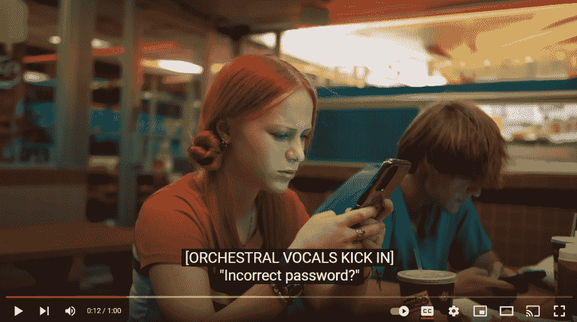
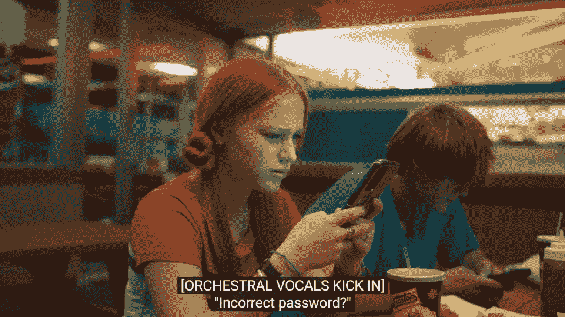
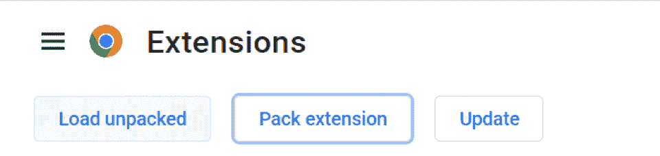
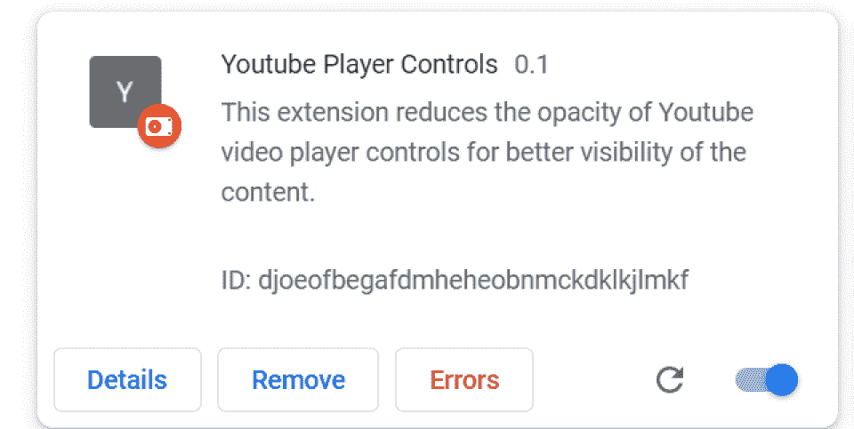

# 如何制作 Chrome 扩展:中级教程

> 原文：<https://hackr.io/blog/how-to-make-a-chrome-extension>

谷歌 Chrome 是当今使用最广泛的网络浏览器，Chrome 扩展是很棒的软件开发工具，可以用新功能扩展 Chrome 的功能。谷歌已经创建了[综合文档](https://developer.chrome.com/extensions/overview)，提供基本信息并开始行动。

但是随着扩展复杂性的增加，我们必须依赖像 Stackoverflow 和 [Hackr.io](https://hackr.io/) 这样的第三方论坛来寻求帮助。

在本文中，我们将介绍创建中级 Chrome 扩展的过程，这将减少 YouTube 网站上视频播放器控件的不透明度，以增加内容的可见性。

在本 Chrome 扩展教程结束时，你将知道如何制作一个 Chrome 扩展。

### 什么是 Chrome 扩展？

Chrome 扩展是你的 Chrome 浏览器的插件。但是你可能会问自己:

为什么首先要构建一个 Chrome 扩展？

Chrome 扩展改进、扩展和定制了浏览器的功能。许多软件解决方案都有“扩展”——也称为“附加组件”或“插件”。

但是 Chrome 让开发扩展变得非常容易。

### 为什么要创建 Chrome 扩展？

如今，程序员依赖大量创新的网络开发理念和其他工具来增强他们的体验。

因此，创建一个 Chrome 扩展是很好的编程实践。

你可以把它添加到你的编程组合中，或者只是开发你梦想中的 Chrome 浏览器。有些人为了工作创建一次性的 Chrome 扩展，而有些人为了好玩开发 Chrome 扩展。

### 你可以从哪里获得 Chrome 扩展的想法？

要创建 Chrome 扩展项目，想一想你可能想在你的 Chrome 浏览器上看到的东西。你也可以看看一些最流行的 Chrome 扩展:

*   [谷歌日历检查器](https://chrome.google.com/webstore/detail/checker-plus-for-google-c/hkhggnncdpfibdhinjiegagmopldibha?hl=en)。使用嵌入式谷歌日历，确保您不会错过日程安排中的任何事情。
*   [语法上](https://chrome.google.com/webstore/detail/grammarly-grammar-checker/kbfnbcaeplbcioakkpcpgfkobkghlhen)。在出售任何电子邮件(或文件)之前，检查其中的语法或拼写错误。
*   [最后一遍](https://chrome.google.com/webstore/detail/lastpass-free-password-ma/hdokiejnpimakedhajhdlcegeplioahd?hl=en-US)。密码管理器非常受欢迎——尤其是在当今这个单点登录和双因素身份验证的世界。

在很大程度上，Chrome 扩展帮助你更容易地完成工作。但是它们也可以用于购物(像 [Honey](https://chrome.google.com/webstore/detail/honey-automatic-coupons-r/bmnlcjabgnpnenekpadlanbbkooimhnj) 优惠券应用)或娱乐(像[编辑任何东西](https://chrome.google.com/webstore/detail/edit-anything/kgkhambjbahgejgoaefmekdchedkihln?hl=en)网络编辑器)。

准备好学习如何构建 Chrome 扩展了吗？继续读。

## **循序渐进:如何为视频播放器控件制作 Chrome 扩展**

成为一个成功的 Chrome 扩展构建者最简单的方法就是实践。让我们从视频播放器控件的 Chrome 扩展开始。

当你暂停了视频，但是视频播放器控件隐藏了视频的内容时，我们的 Chrome 扩展会很有用。

以 YouTube 为例。当您暂停 YouTube 视频时，播放器控制总是可见的，例如这个关于 Chrome OS 的视频:



因此，我们将学习如何创建 Chrome 扩展代码来操作这个覆盖。创建插件后，我们将能够在暂停视频时删除播放器，结果如下:



### **1。创建一个 Manifest.json 文件**

本 Chrome extensions 教程的第一步是创建 manifest.json 文件。

[manifest.json](https://developer.chrome.com/extensions/manifest) 文件包含重要的扩展信息，比如它的名称、版本、动作和权限。每个扩展都必须有一个 manifest.json 文件。

因此，让我们在一个空目录中创建一个 manifest.json 文件，其中包含必需的字段:

```
{
"manifest_version": 2,
"name": "My First Extension",
"version": "0.1"
}
```

这就创建了一个基本的 Chrome 扩展，它只是将扩展加载到 Chrome 中。请记住,“manifest_version”必须始终为 2，因为从 2014 年 1 月开始不再支持版本 1。此外，清单文件必须包含上述三个字段。

### **2。将扩展载入 Chrome**

制作 Chrome 扩展的下一步是将扩展加载到 Chrome 中。\

打开 Chrome 扩展页面。要做到这一点，要么点击右上角的三个点，然后进入“更多工具”，然后“扩展”或者，去地址栏输入:“Chrome://extensions/”

之后，打开右上方的“开发者模式”，然后点击左上方的“加载解包”。



现在，浏览到包含清单文件的目录，然后选择该文件夹。下面的列表不会显示该扩展名。

在对代码进行任何更改之后，您可以通过单击位于*扩展*右侧的小刷新图标来刷新扩展。



### **3。开发您的内容脚本**

根据官方文档，[内容脚本](https://developer.chrome.com/extensions/content_scripts)是在网页上下文中运行的文件。他们可以读取或修改网页，并通过标准文档对象模型(DOM)将信息传递给他们的父扩展。

内容脚本可以与它们的父扩展交换“消息”,因此可以访问它们的父扩展使用的 Chrome APIs。一些常用的 Chrome APIs 包括 onConnect、onMessage 和 sendMessage 等。所有这些对于制作 Chrome 扩展和构建 Chrome 扩展架构都很重要。

内容脚本与外部环境完全隔离，这使它们能够对自己的 Javascript 环境进行更改，而不会影响网页或其他内容脚本。

综上所述，内容脚本可以访问和修改浏览器访问的网页。这将它们与项目中的其他 Javascript 文件区分开来。内容脚本必须在清单文件中声明，连同它们的细节，比如允许它们访问哪个 URL。

### **4。注入你的内容脚本**

内容脚本可以以编程或声明的两种方式注入网页。在这个例子中，我们使用编程注入，因为我们只需要在特定的情况下运行脚本。在我们注入脚本之前，我们必须首先在清单中提供活动选项卡权限，这使得脚本能够在当前活动的选项卡上运行。如果您想在新选项卡上自动执行内容脚本，您必须在清单中声明内容脚本。

所以我们像这样更新 manifest.json 文件:

```
"permissions": ["activeTab"],
"content_scripts": [
{
"matches": ["https://www.YouTube.com/*"],
"js": ["contentScript.js"]
}
]
```

现在我们可以将内容脚本注入到网页中。我们可以注入一部分代码，或者整个文件。在本例中，我们将注入整个 javascript 文件 contentScript.js。注入该文件后，它将修改 YouTube 播放器窗口，以减少播放器控件的不透明度。该文件包含以下代码:

```
//contentScript.js
var s = document.getElementById('stylehidecontrols');
if (s) {
s.remove();
}
else {
s = document.createElement('style');
s.id = 'stylehidecontrols';
var r = '#movie_player .ytp-gradient-top, #movie_player .ytp-gradient-bottom, #movie_player .ytp-Chrome-top, #movie_player .ytp-progress-bar-container, #movie_player .ytp-Chrome-controls';
s.appendChild(document.createTextNode(r));
document.body.appendChild(s);
}
```

首先，我们尝试查找 id 为“stylehidecontrols”的元素如果找到了，我们就把它去掉，使不透明度恢复正常。如果没有找到，那么我们必须降低视频播放器控件的不透明度。为此，我们首先创建一个“style”元素来包含 CSS 样式信息，并为其分配 id“stylehidecontrols”，这是我们之前试图找到的。

现在我们用 YouTube 网站中各种已知元素的 CSS 样式信息创建一个文本，这些元素与视频播放器相关联。然后，我们把它赋给一个变量 r。

注意:我们将所有这些元素的不透明度设置为 0.2，因此它们不会阻挡视图，但仍然可见，并且可以操作。

现在我们用变量“r”创建一个节点，然后把它附加到样式元素“s”上，最后，我们把“s”附加到文档体上。这将使新样式立即生效，并降低视频控件的不透明度。如果再次单击扩展图标，它将从 DOM 中移除样式元素，从而将不透明度恢复到原始状态。

### **5。开发您的背景脚本**

为了以编程方式注入内容脚本，我们需要一个 javascript 文件，它总是在后台运行并监听 click 事件。内容脚本有一些限制，因为它们不能侦听点击事件。因此，我们需要一个可以访问 Chrome API 的后台脚本，但不能访问网页。

这个后台脚本监听特定的事件。然后，它可以将 javascript 代码注入到页面中，进而可以访问和修改网页。我们必须在清单中声明后台脚本文件，如下所示:

```
"background": {
"scripts": ["backgroundScript.js"]
}
```

后台脚本负责监听 click 事件，然后将“contentScript.js”文件注入页面。后台脚本的内容是:

```
//backgroundScript.js
Chrome.browserAction.onClicked.addListener(
function(tab) {
Chrome.tabs.executeScript(tab.id, {
"file": "contentScript.js"
});
});
```

在这个例子中，我们直接将文件注入到页面中。我们还可以使用消息传递来完成这项任务，其中后台脚本将在单击事件时向内容脚本发送一条消息，然后内容脚本将侦听该特定消息。如果收到消息，它将执行代码。

当您编写 Chrome 扩展代码时，内容脚本也可以“以声明方式”注入为此，我们可以在 manifest.json 文件中添加如下内容:

```
"content_scripts": [
{
"matches": ["http://*.mywebsite.com/*"],
"CSS": ["styles.CSS"],
"js": ["contentScript.js"]
}
]
```

CSS 字段是可选的，可用于为匹配的页面注入 CSS 文件。它们按照在数组中声明的顺序被注入。

### **6。创建您的行动**

动作对 Chrome 扩展开发很重要。Chrome 扩展可以有两种类型的动作，页面动作和浏览器动作。与浏览器操作不同，页面操作只能作用于当前页面。我们可以使用动作为扩展包含图标和弹出窗口。要在 Google Chrome 主工具栏中放置图标，请将其添加到 manifest.json 文件中:

```
"browser_action": {
"default_icon": {
"32": "icon.png"
}
}
```

您可以在图像编辑器(如 Photoshop、Illustrator 或 Gimp)中创建任何大小的图标。此外，您可以从互联网上下载所需大小的图标。一旦你有了图标，把它和当前的名字放在根文件夹中。

这在 Chrome 的主工具栏中增加了一个 32 乘 32 大小的图标。我们也可以包括其他大小的图标，但如果没有提供，Chrome 会自动调整图标的大小以适应相应的大小。

### **7。构建完整的 Manifest.json 文件**

这是你开发 Chrome 插件的最后一步。在我们将上述所有字段添加到 manifest.json 文件中之后，它将看起来像这样:

```
//manifest.json
{
"manifest_version": 2,
"name": "Youtube Player Controls",
"version": "0.1",
"description": "This extension reduces the opacity of Youtube video player controls for better visibility of the content.",
"background": {
"scripts": ["backgroundScript.js"]
},
"permissions": ["activeTab"],
"content_scripts": [
{
//"matches": [""],
"matches": ["https://www.YouTube.com/*"],
"js": ["contentScript.js"]
}
],
"browser_action": {
"default_icon": {
"32": "icon.png"
}
}
}
```

最终的目录结构如下:

*   背景脚本. js
*   内容脚本. js
*   icon.png
*   manifest.json

[React & TypeScript Chrome 扩展开发【2023】](https://click.linksynergy.com/link?id=jU79Zysihs4&offerid=1045023.3925774&type=2&murl=https%3A%2F%2Fwww.udemy.com%2Fcourse%2Fchrome-extension%2F)

## **结论:如何开发 Chrome 扩展**

我们已经经历了如何制作 Chrome 扩展的完整分解。

但这只是一个基本的预览。

有关 Chrome 扩展及其后台工作方式的更多信息，请访问[官方文档](https://developer.chrome.com/extensions/overview)或关于如何开发 Chrome 扩展的教程。

需要更多灵感？

[**查看 Chrome 最好的免费 SEO 工具**](https://hackr.io/blog/free-seo-tools)

## **常见问题解答**

#### **1。做 Chrome 扩展容易吗？**

如果你已经是一名程序员，那么制作自己的 Chrome 扩展会非常容易。但在它准备好进入 Chrome 商店之前，你需要对它进行广泛的测试和质量控制。

#### **2。可以自己做 Google 扩展吗？**

任何人都可以制作自己的 Google 扩展。你的谷歌扩展将在你的本地 Chrome 部署(在你自己的电脑上)上运行，除非你将它上传到 Chrome market place——在那里任何人都可以使用它，就像下载 iOS 或 Android 的应用程序一样。

#### **3。谷歌扩展是用什么写的？**

Google 扩展使用流行的 web 技术 HTML、CSS 和 JavaScript。正因为如此，它们是练习构建网站和 web 应用程序的好方法。

#### **4。发布一个 Chrome 扩展需要多少钱？**

发布一个 Chrome 扩展只要 5 美元。但是你应该确保你符合谷歌的质量标准——并且要知道那些下载你的扩展的人也可以评价和审查它！