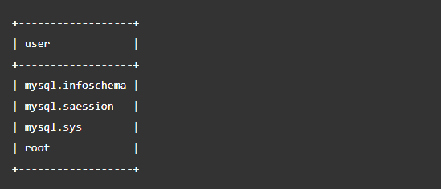
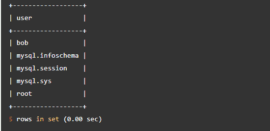
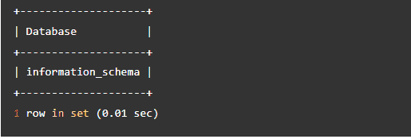
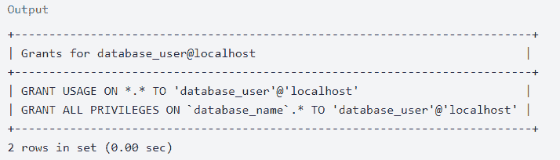
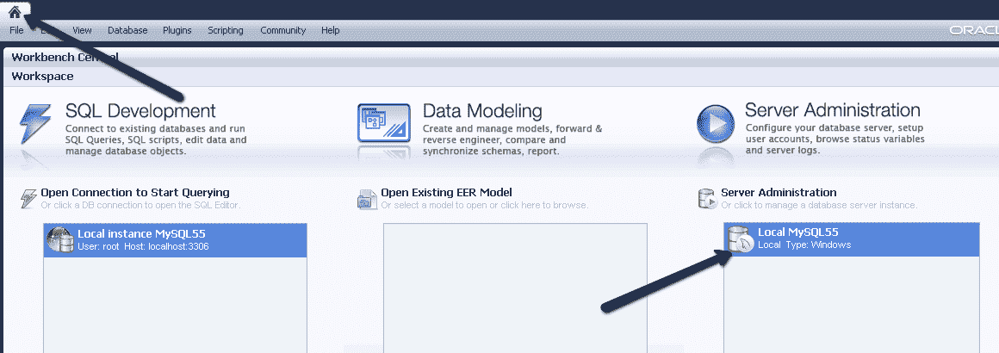
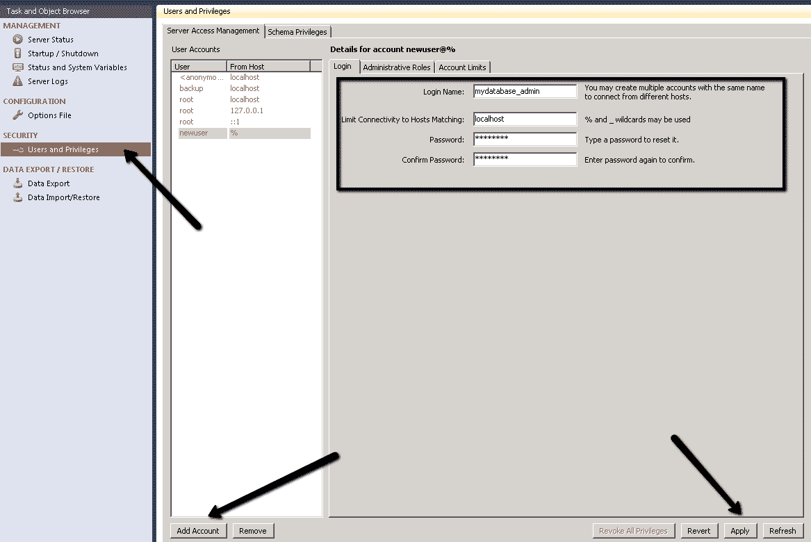
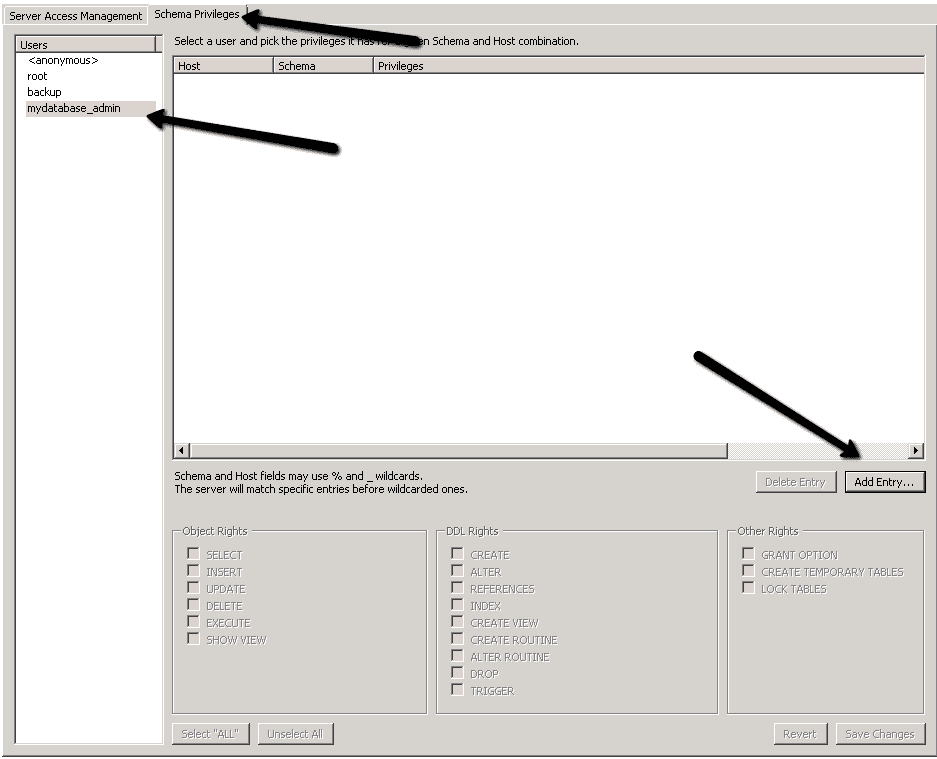
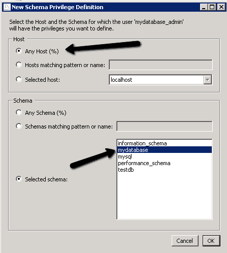
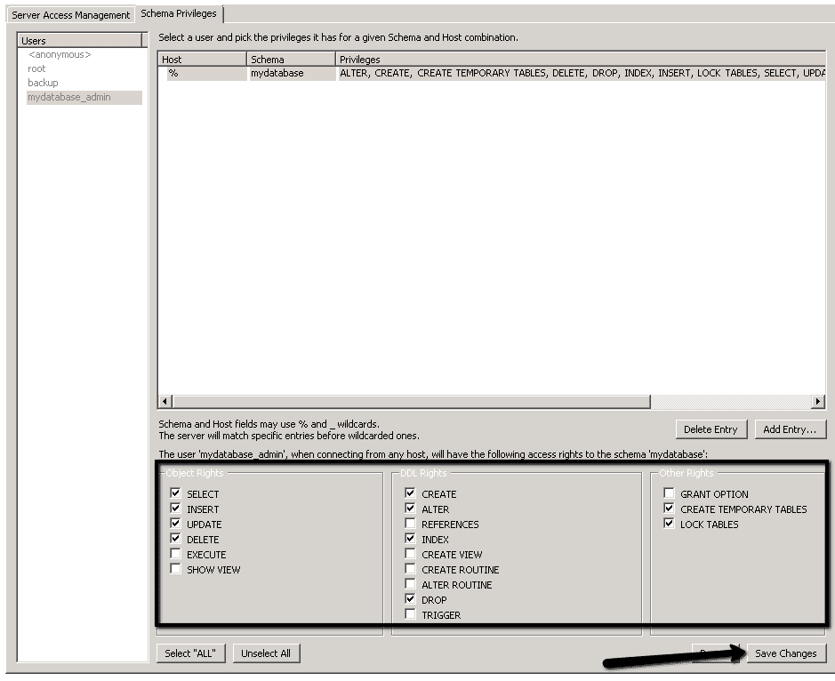

# MySQL 创建用户[如何在 MySQL 中创建新用户]

> 原文：<https://hackr.io/blog/how-to-make-a-new-user-in-MySQL>

MySQL 是最常用的关系数据库管理系统之一，它使我们能够存储、操作和检索数据。它有几个选项来授予特定用户对数据库和表的访问权限。此外，它还提供了在需要时撤销这些权限的选项。

这是一个需要理解的广阔领域，为用户提供适当的访问需要合理的[SQL](https://hackr.io/blog/sql-commands)T2 查询。本文将解释不同的 MySQL 命令和管理方法，例如创建用户、授予和撤销用户权限，以及使用集中式界面提供用户访问。也就是说，本指南将向您展示“MySQL 创建用户和授权”功能。

这里，我们认为用户拥有根级别的访问权限，可以自行管理 MySQL 环境并运行不同的命令。确保您有运行命令的适当权限。

## **先决条件**

对于本文，我们假设用户的系统上有一个 MySQL 或 MariaDB 服务器。要访问 MySQL shell，请输入以下命令，并在需要时使用 root 用户名和密码。为用户创建帐户的最低权限必须是 CREATE USER 和 GRANT。

```
mysql -u root -p
```

## **MySQL 创建数据库和用户**

让我们从 MySQL create DB 和 user 的命令开始。在您的系统上安装 MySQL 服务器之后，您应该在创建用户帐户之前首先创建一个数据库。

要创建一个数据库，您需要以 root 权限登录 MySQL 实例。

在下面的例子中，我们正在创建“数据”数据库。为此，请运行以下命令。

```
mysql> CREATE DATABASE data;
```

如果给定的数据库名称已经存在于 MySQL 实例中，您将在 shell 中看到一个错误。为了消除这个错误，您需要在 CREATE DATABASE 命令中使用“如果不存在”。您可以尝试以下命令:

```
mysql> CREATE DATABASE IF NOT EXISTS data;
```

## **如何删除 MySQL 数据库**

如果要继续删除现有数据库，请使用以下命令:

```
mysql> DROP DATABASE data;
```

删除数据库将永久删除该数据库以及其中存储的所有数据。该命令不会要求确认是否继续删除，而是直接删除。因此，请小心使用这个 drop 命令。

## **MySQL 创建用户:如何创建新的 MySQL 用户帐户**

现在，是时候学习“MySQL 创建新用户”的功能了

MySQL 中的每个用户都有一个用户名和主机名来访问 MySQL 实例。要创建新用户，您需要输入您的用户名和主机名。

在 MySQL 中添加用户非常简单——只需按照以下命令开始:

```
mysql> CREATE USER 'user'@'local_host' IDENTIFIED BY 'password';
```

用户将获得用户名“user ”,用于从其 local_host 访问 MySQL 实例，防止从任何设备直接访问服务器。要打开主机的范围，您可以使用以下命令在授予用户对 MySQL 实例的访问权限时指定通配符:

```
mysql> CREATE USER 'subnet_user'@'10.0.%' IDENTIFIED BY 'password';
```

这里，10.0。% "指定用 IP 地址“10.0”标识的用户可以访问 MySQL 实例。

如果想查看 MySQL 实例中所有用户的详细信息，可以使用 SELECT 命令，如下所示:

```
mysql> SELECT * FROM mysql.user;
```



## **使用密码**创建 MySQL 用户

现在，让我们学习使用下面的命令创建一个名为“bob”的新 MySQL 用户的函数。

```
mysql> create user bob@local_host identified by 'SData1pass!';
```

如果您再次检查 MySQL 实例中的可用用户列表，您将看到新条目。

```
mysql> SELECT * FROM mysql.user;
```



成功创建新用户后，我们现在将看到“bob”可以访问哪些数据库。要以用户“bob”的身份运行命令，您需要登录并输入提供的密码。

以下命令会生成一个“bob”可以访问的数据库。

```
Mysql> show databases;
```



## **MySQL 用户账户管理**

假设您创建了一个没有任何权限的新用户。在这种情况下，用户只能连接到数据库，但没有访问任何数据或执行任何操作所需的权限。

如前所述，MySQL 为用户提供了各种特权。我们将逐一讨论它们，因为每个权限为用户提供不同的访问级别。

### **MySQL 中的常用权限**

权限是用户可以对数据库执行的操作。因此，必须通过检查需要执行什么类型的操作来谨慎地授予特权。这些权限根据其范围分为不同的级别。

*   ‍Global 和管理权限:适用于服务器上的整个数据库。管理权限属于全局权限类别，因为它们允许用户管理 MySQL 服务器的操作，而不受特定数据库的限制。
*   ‍Database 特权:仅适用于 MySQL 实例中可用的特定数据库，包括这些数据库中的所有对象。如果需要，您可以根据需要提供全局数据库权限。
*   ‍Proxy 特权:允许用户拥有其他用户拥有的所有特权。这就像将一个用户的特权镜像到另一个用户。
*   数据库对象特权:一些例子包括访问表、列等。如果需要，可以根据需要全局授予数据库对象特权。

所有与权限相关的访问都存储在“MySQL”数据库中一个名为“grant”的表中。MySQL 中授予所有用户的一些标准权限如下:

*   所有权限:提供除 GRANT OPTION 和 PROXY 之外的所有权限。
*   ALTER:这允许用户修改表或数据库的结构。
*   创建:这允许用户创建新的数据库和表。
*   删除:这允许用户从表中删除整行。
*   INSERT:这允许用户向表中添加行。
*   SELECT:这允许用户运行几个查询来显示表中的内容。
*   更新:这允许用户向表中添加一些行。

## **授予 MySQL 用户帐户权限**

您可以使用以下语法授予特定用户帐户权限。

```
GRANT perm1, perm2 ON db_name.table_name TO 'db_user'@'local_host';
```

下面是一些授予特权的示例，以便更好地理解:

*   授予用户帐户对特定数据库的所有权限。

```
GRANT ALL PRIVILEGES ON db_name.* TO 'db_user'@'local_host';
```

*   授予用户对所有数据库的所有权限。

```
GRANT ALL PRIVILEGES ON *.* TO 'db_user'@'local_host';
```

*   授予用户帐户对特定数据库的特定权限。

```
GRANT SELECT, INSERT, DELETE ON db_name.* TO db_user@'local_host';
```

## **显示 MySQL 用户账户权限**

要确认用户帐户的权限，可以使用以下命令:

```
SHOW GRANTS FOR 'db_user'@'local_host';
```



## **撤销 MySQL 用户帐户的权限**

MySQL 提供了 revoke 命令来删除用户帐户的权限。它的语法类似于 GRANT 命令。除了使用“GRANT”之外，您还需要提到“REVOKE”以及特定的权限，如下所示:

```
mysql> REVOKE INSERT ON data.* FROM 'user'@'local_host';
```

如果提到的权限不在用户帐户列表中，则该命令在用户帐户上没有。

## **如何删除 MySQL 上的用户**

就像您可以在 MySQL 中授予和撤销特定用户的权限一样，您也可以删除该用户。为此，您需要使用 DROP 命令。

如果您想从 MySQL 中删除某个特定用户，可以使用以下命令:

```
mysql> DROP USER 'user'@'local_host';
```

## **更改 MySQL 用户帐户的密码**

不同版本的 MySQL 具有不同的修改用户密码的语法。首先，通过执行以下命令来确认您的系统上是哪个版本的 MySQL。

```
mysql> SELECT version();
```

如果您愿意更改 MySQL 版本 5.76 或更高版本的密码，您可以使用以下命令。

```
‍mysql> ALTER USER 'user'@'local_host' IDENTIFIED BY 'new_password';
```

但是，如果您使用的是旧版本的 MySQL，您可以执行下面的命令。

```
‍mysql>SET PASSWORD FOR 'user'@'local_host' = PASSWORD('new_password');
```

## **为什么管理 MySQL 数据库和用户账户很重要**

管理多个用户、数据库和特权是一项至关重要的任务。用户必须拥有管理一切的数据库的顶级访问权限。随着基础架构的增长，管理变得更加复杂。管理员确保正确的用户拥有适当的访问权限，而不会牺牲安全性。为什么管理 MySQL 数据库和用户帐户很重要

有了控制平面，您可以无缝地管理数据库访问和用户。以下是实现这一目标的一些方法:

*   实施集中式身份认证系统:集中式系统消除了管理单个用户所需的手动工作。您可以使用任何直接与您的身份提供商集成并处理整个身份验证的工具。

*   启用权限管理:有一个集中的界面，允许用户查看和修改访问和权限。选择提供基于角色的权限管理系统的工具。
*   定期检查用户访问:为了质量控制和安全，测试您的数据库访问，并确保您的工具具有记录功能，以维护操作、查询、更改请求和权限更改的记录。

## **结论**

MySQL 是一个关系数据库管理系统，有几个命令用于授予和撤销用户帐户的权限。这些命令的语法可能因版本而异。所以，首先检查 MySQL 的版本，然后开始执行命令是非常必要的。既然您已经理解了 MySQL 的创建用户功能，那么您将能够最大化您的效率。

本文研究了 MySQL 的各种命令，包括添加用户、创建带密码的新用户帐户、授予用户帐户不同的访问权限以及撤销用户帐户权限。

准备好扩展您的 MySQL 知识了吗？查看我们的最佳 MySQL 教程综述。

[完整的 SQL Bootcamp 2023:从零到英雄](https://click.linksynergy.com/link?id=jU79Zysihs4&offerid=1045023.762616&type=2&murl=https%3A%2F%2Fwww.udemy.com%2Fcourse%2Fthe-complete-sql-bootcamp%2F)

## **常见问题解答**

#### **1。如何在 MySQL 中创建新用户？**

如果您想在 MySQL 数据库中创建一个新用户，您需要输入详细信息，例如用户名主机名，用户可以使用密码来访问数据库。

运行以下命令:

```
mysql> CREATE USER 'db_user'@'local_host' IDENTIFIED BY 'pass';
```

#### **2。如何在 MySQL 中创建用户并赋予权限？**

运行以下命令:

```
mysql> CREATE USER 'user'@'local_host' IDENTIFIED BY 'password'; GRANT perm2 ON db_name.table_name TO 'db_user'@'local_host';
```

#### **3。如何在 MySQL Workbench 中授予用户权限？**

按照以下步骤向使用 MySQL Workbench 的用户授予访问权限。



用户和权限->添加帐户->提供详细信息(登录名、本地主机、密码)->应用



模式权限->单击用户帐户->添加条目



选定的模式->选择您的数据库模式。



相应地从下面的复选框中选择特定的权限。



#### **4。如何在 MySQL Workbench 中找到用户？**

在 SQL Workbench 中，很容易找到所有用户。在导航器部分，选择用户和权限。您将在那里获得所有用户的列表。

**人也在读:**