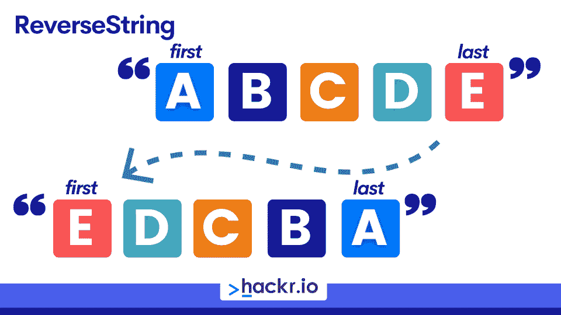
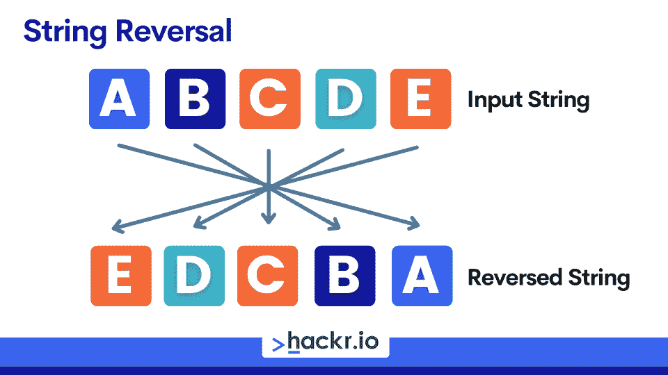
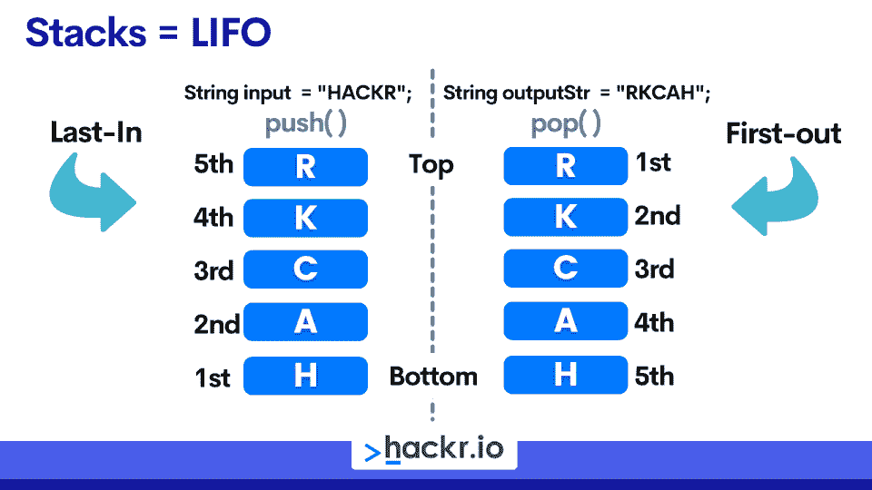

# 如何在 Java 中反转一个字符串:9 种方法及示例[Easy]

> 原文：<https://hackr.io/blog/how-to-reverse-a-string-in-java>

反转字符串是一个常见的编码问题，当你学习算法或者学习一门新的编程语言时经常会遇到这个问题。这也是 Java 开发人员编码面试中最常被问到的问题之一，[面试官可能会问你](https://hackr.io/blog/java-interview-questions)用各种方式反转一个字符串。

在本教程中，我们将全面介绍如何在 Java 中反转字符串。

首先，我们将介绍 Java 字符串数据类型及其特性和属性。然后，我们将展示九种不同的方法，并给出简单而有效的代码示例，您可以用它们来编写一个程序，在 Java 中反转一个字符串。

注意:本教程和我们介绍的方法都是用 Java 8 编写的。

## **Java 中的字符串**

当编写任何需要存储类似文本的数据的应用程序或软件时，字符串是不可避免的数据类型。

[在 Java 中，string 是一个表示字符序列的对象](https://hackr.io/blog/java-cheat-sheet)(Java char 数据类型)。在许多方面，字符串可以被视为一种数据结构，因为它们是字符(chars)的数组(或序列)。和数组一样，字符串是使用最广泛的数据结构之一。

我们使用 Java 字符串类(java.lang.String)来创建一个字符串对象。该类实现了 *Serializable* 、 *Comparable* 和 *CharSequence* 接口，并提供了众多内置方法，如 *compare()、concat()、split()、equals()、length()、replace()、compareTo()、intern()、substring()、*等。

让我们总结一下 Java 字符串的一些最重要的属性:

*   创建 Java 字符串对象有两种方法:
    *   字符串文字:由 Java 虚拟机(JVM)存储和管理在一个特殊的内存区域，称为“字符串常量池”
    *   “new”关键字:字符串对象是由 JVM 在普通(非池)堆内存中创建的

*   Java 确保字符串对象是[不可变的](https://hackr.io/blog/java-cheat-sheet)(不能被改变)，具有以下特性:

*   **ClassLoader** **:** 确保字符串对象类总是被加载
*   **线程安全** **:** 确保一个字符串对象被多个线程共享时的同步
*   **安全性** **:** 确保使用字符串参数定义和操作的类和对象具有确定性和无错误的行为
*   **堆空间:**确保 JVM 有效地使用堆内存

*   Java 还提供了 *StringBuffer* (在 Java 1.0 中引入)和 StringBuilder(在 Java 1.5 中引入)类来创建 string 对象。这些和*字符串*类都实现了 *CharSequence* 接口
*   Java *String* 对象是不可变的，这意味着它们不能被改变。所以，每次我们“改变”一个字符串对象，我们实际上是在产生一个新的字符串实例
*   Java *StringBuilder* 和 *StringBuffer* 类是 *String* 类的可变版本(可以更改)
*   与 *String* 类相比， *StringBuffer* 和 *StringBuilder* 对象在内存管理方面更快更高效
*   *StringBuilder* 和 *StringBuffer* 类有一个内置的。*的 reverse()* 方法，但*的 String* 类却没有

## **Java 中反转字符串的不同技术**

我们将使用 Java *String* 对象来表示一个单词，并且我们将研究最常见的字符串反转方法来反转字符顺序。然后你可以在你自己的 [Java 项目](https://hackr.io/blog/java-projects) *中使用这些技术。*

**

### **1)使用循环反转字符串**

我们需要创建一个新的空的 *String* 对象来存储反转的字符串，因为由于它的不变性，我们不能改变或反转原来的字符串。

通过这个循环，我们可以使用一个*来代替*循环，或者使用一个 *while* 循环来迭代每个字符串字符。在这个例子中，我们将使用 for 循环。

接下来，我们需要配置我们的循环以逆序访问字符串字符。毕竟我们想要一个 Java 程序来反转一个字符串！

我们可以用一个递减循环来实现:从 string 对象的最后一个索引(字符)开始，然后在每次循环中递减，直到到达第 0 个索引(第一个字符)。

为了找到最后一个字符的索引，我们可以使用 Java 的内置*。length()* string 方法找到我们的字符串的长度，然后我们减去 1 来占 0 索引。我们的 *fo* r 循环计数器变量将从这个索引开始，并在每次迭代中递减-1。

设置好循环后，我们可以遍历字符串并以相反的顺序访问字符。最后一步是将字符存储在我们创建的空字符串中。为此，我们将每个字符与字符串的当前版本连接起来。当我们完成后，我们将有一个新的字符串对象，字符是相反的。

**使用 For 循环的代码示例:**

```
public class ReverseStringHackrIO {

  public static void main(String[] args) {

    String stringExample = "HackrIOTutorial";

    System.out.println("Original string: "+stringExample);

    int n = stringExample.length(); // Length of original string

    String reversedString =""; // Empty string to store reversed chars

    char ch; // Char to store current string character

    for (int i = n - 1; i >= 0; i--) {
    	 ch = stringExample.charAt(i); // Return & store current char
    	 reversedString = reversedString + ch; // Append char to end
    }

    System.out.println("Reversed string: "+ reversedString);

   }

}
```

**输出:**

```
Original string: HackrIOTutorial
Reversed string: lairotuTOIrkcaH
```

### **2)通过交换字符反转字符串**

****

对于这种方法，我们将使用内置的。 *toCharArray()* 函数从*字符串*类将一个字符串转换成一个字符数组。然后我们将使用 for 循环迭代数组，但重要的是，我们将在每个循环中从数组的左端和右端“向内”移动。

为此，我们需要通过内置的。length()方法:返回数组中元素的个数。然后，我们从这个值中减去 1，得到最后一个索引位置，我们把它赋给‘fin’。

然后，我们可以设置我们的循环:

*   初始化“开始”计数器变量以表示当前最左边的索引(从 0 开始)
*   检查“start”变量是否小于当前最右边的索引(从最后一个索引开始)

*   如果为真，则将“开始”变量增加 1，并将“结束”变量减少-1

因此，我们将在每次循环中不断调整“开始”和“结束”变量。当我们越来越靠近阵列的中间元素时，这有助于将这想象成“钳形”运动。

但是在我们到达那里之前，我们在每个循环中交换当前最左边和最右边位置的字符。这只是一个例子:

*   将当前“开始”索引处的字符存储在临时变量中
*   将当前“开始”索引中的字符与当前“结束”索引中的字符交换
*   将当前“fin”索引的字符与我们的 temp 变量交换(这是我们最初的“start”索引字符)

循环完元素后，我们将反转数组中的字符。最后，我们将使用内置的 *String.valueOf()* 函数将数组转换回字符串。

```
public class ReverseStringHackrIO {

  public static void main(String[] args) {

    String stringExample = "HackrIOTutorial";
    System.out.println("Original string: " + stringExample);

          // Converting String to Character Array
         char str[] = stringExample.toCharArray();

    int start, fin = 0;

           fin = str.length - 1; // Length of character array

           for (start = 0; start < fin; start++, fin--) {

      // Swap characters from leftmost and rightmost
      char temp = str[start];

      str[start] = str[fin];

      str[fin] = temp;
       }

           // Converting characterArray to String

           String reversedString = String.valueOf(str);

           System.out.println("Reversed string: "+reversedString);	         
  }
} 
```

**输出:**

```
Original string: HackrIOTutorial
Reversed string: lairotuTOIrkcaH
```

### 使用 StringBuilder 类反转一个字符串

在 Java 中**反转字符串的另一种方法是使用 *StringBuilder* 类中内置的 *reverse()* 方法(不能用于 *String* 类)。**

我们首先创建一个空的 *StringBuilder* 对象，我们将使用它来存储我们的原始字符串。然后我们通过调用将我们的*字符串*对象“转换”成一个*字符串生成器*。在空的 *StringBuilder* 上追加()。

接下来就是打电话的问题了。 *reverse()* 在我们的 *StringBuilder* 对象上反转字符串中的字符。这是允许的，因为 *StringBuilder* 对象是可变的，这意味着我们可以就地改变它们。

最后，我们将反转的 *StringBuilder* 转换回一个 *String* 对象并打印结果。

**StringBuilder 代码示例 1:**

```
public class ReverseStringHackrIO {

  public static void main(String[] args) {

    String stringExample = "HackrIOTutorial";

           System.out.println("Original string: " + stringExample);

           // Declaring StringBuilder + converting string to StringBuilder
    StringBuilder reverseString = new StringBuilder();

    reverseString.append(stringExample);

    reverseString.reverse(); // Reversing the StringBuilder

    // Converting StringBuilder to String
    String result = reverseString.toString();

    System.out.println("Reversed string: "+result);  
  }   
}
```

使用 *StringBuilder* 的另一种方法是绕过。*追加()*共。为此，我们只需使用我们最初的*字符串*对象作为 *StringBuilder* 构造函数的参数。然后，我们可以继续代码示例 1 所示的相同步骤:

**StringBuilder 代码示例 2:**

```
public class ReverseStringHackrIO {

  public static void main(String[] args) {

           String stringExample = "HackrIOTutorial";

           System.out.println("Original string: " + stringExample);

           // Declaring StringBuilder + converting string to StringBuilder

    StringBuilder reverseString = new StringBuilder(stringExample);

    reverseString.reverse();  // Reversing the StringBuilder

    // Converting StringBuilder to String
    String result = reverseString.toString();

    System.out.println("Reversed string:" +result);
  }   
}
```

**代码示例 1 和 2 的输出:**

```
Original string: HackrIOTutorial
Reversed string: lairotuTOIrkcaH
```

### **4)使用 ArrayList 对象反转一个字符串**

这次，我们将使用一个字符数组和一个 *ArrayList* 对象(注意我们是如何导入 Java 的 util 的。数组列表包)。

首先，我们将把我们的*字符串*对象用。 *toCharArray()* 方法来自*字符串*类。然后，我们将创建一个新的 *ArrayList* 对象(character 类型),通过 *for* 循环来存储字符数组中的字符。这个循环遍历字符数组中的字符，并将它们添加到数组列表中。

接下来，我们将使用内置的*反转我们的*数组列表*。reverse()* 来自 Java 的 util 的方法。Collections 类(在程序顶部导入)。然后，我们将我们的 *ArrayList* 对象作为参数传递给这个方法，这个方法将元素反转。

最后，我们在一个 *ListIterator* 对象及其。 *listIterator()* 函数(均在程序顶部导入)。为此，我们将创建一个新的 *ListIterator* 实例，并将调用的结果赋给它。在我们的数组列表上。

最后一步是 while 循环，打印出 *ListIterator* 中的每一项，直到没有元素返回。注意这里 System.out.print 的用法，因为我们不希望每个字符后都有新的一行。

**数组列表代码示例:**

```
import java.util.ArrayList;
import java.util.Collections;
import java.util.List;
import java.util.ListIterator;

public class ReverseStringHackrIO {

  public static void main(String[] args) {

           String stringExample = "HackrIOTutorial";

           System.out.println("Original string: " + stringExample);

	char str[] = stringExample.toCharArray();

     // Declare ArrayList of Chars
     List<Character> listChar = new ArrayList<>();

     // Iterate over Character Array & add char to ArrayList
     for(int i = 0; i < str.length; i++){ 
    	  listChar.add(str[i]);
     }

     Collections.reverse(listChar); // Reversing list

     int size = listChar.size(); // size of ArrayList

     System.out.print("Reversed string: ");

     //ListIterator Object to iterate over reversed ArrayList.
     ListIterator<Character> liter = listChar.listIterator();

     while (liter.hasNext()){ 
       // Print characters from reversed ArrayList
       System.out.print(liter.next());
             }
  }   
}
```

**输出:**

```
Original string: HackrIOTutorial
Reversed string: lairotuTOIrkcaH
```

### **5)使用 StringBuffer** 反转一个字符串

在这个例子中，我们使用 *StringBuffer* 类及其内置的 *reverse()* 方法来快速返回 Java 中字符串的反向。这类似于方法 3 中的 *StringBuilder* 方法，因为 *StringBuffer* 也是可变的(可以就地修改)。使用 *StringBuffer* 的另一个优点是与 *String* 类相比，减少了内存需求。

因此，我们通过将字符串作为构造函数参数传递，将我们的*字符串*对象转换为*字符串缓冲*对象。然后我们调用。 *reverse()* 函数对 *StringBuffer* 进行字符串字符的反转。最后，我们打印结果。

**StringBuffer 代码示例:**

```
public class ReverseStringHackrIO {

  public static void main(String[] args) {
           String stringExample = "HackrIOTutorial";

    System.out.println("Original string: " + stringExample);            

    // Conversion from String object to StringBuffer
           StringBuffer reversedSB = new StringBuffer(stringExample); 
    reversedSB.reverse(); // Reverse the string

    System.out.println("Reversed String: " + reversedSB);

  }
}
```

**输出:**

```
Original string: HackrIOTutorial
Reversed string: lairotuTOIrkcaH
```

### **6)使用字节数组**反转一个字符串

这种方法使用一个 *ByteArray* 对象以逆序存储一个*字符串*对象的字节。

我们将从使用。 *getBytes()* string 方法将我们的 *String* 对象编码成一个字节数组，然后我们将它赋给一个 *byte[]* 数组变量。接下来，我们将创建一个名为“result”的临时 *byte[]* 数组，我们将调整其大小，使其等于原始字符串的长度。稍后我们将使用它来逆序存储字节。

最后一步是迭代我们用字符串字节填充的*字节数组*，但是顺序相反。我们通过从*字节数组* -1 的长度中减去循环计数器的值来做到这一点。本质上，这将返回最后一个索引，并不断递减，直到我们到达索引 0。

通过反向迭代，我们可以将这些字节添加到我们的“结果”数组中，该数组反转原始字节。最后，我们将“result”数组转换回一个 *String* 对象来表示我们反转的字符串。

**ByteArray 代码示例:**

```
public class ReverseStringHackrIO {

  public static void main(String[] args) {

          String stringExample = "HackrIOTutorial";

          System.out.println("Original string: " + stringExample);

          byte[] byteArray = stringExample.getBytes();

    byte[] result = new byte[byteArray.length];

    // Store bytes in reverse order
    for (int i = 0; i < byteArray.length; i++){
      result[i] = byteArray[byteArray.length - i - 1];
    }
         System.out.println("Reversed string: " + new String(result));
    }	   
}
```

**输出:**

```
Original string: HackrIOTutorial
Reversed string: lairotuTOIrkcaH
```

### **7)使用 Java 堆栈对象反转字符串**



在这种情况下，我们将使用一个*堆栈*数据结构来反转一个*字符串*对象。我们将导入 Java 的 util。Stack 类来创建我们的堆栈，我们将通过这些步骤得到字符串的反向:

1.  创建一个空的*栈*角色对象
2.  调用栈的内置*。push()* 方法将字符串中的每个字符推送到堆栈上
3.  *从*堆栈*中弹出*字符:这将反向返回它们(堆栈是后进先出= LIFO)
4.  用一个*字符串*对象连接*弹出的*字符，产生一个反向字符串

因此，我们首先创建一个由字符组成的空的*堆栈*，然后我们循环遍历我们的*字符串*中的字符到*将它们推送到*堆栈*中。我们将把从堆栈中弹出的每个字符与一个最初设为空白的*字符串*对象连接起来，这意味着这个字符串将随着每个循环而“增长”。*

我们将使用 while 循环从*堆栈*弹出字符，直到*。isEmpty()* 堆栈方法返回 *true* 。在这一点上，我们已经弹出了所有的字符，堆栈已经清空，我们已经反转了字符串。

**堆栈代码示例:**

```
Import java.util.Stack                                                                                                  
public class ReverseStringHackrIO {

  public static void main(String[] args) {

          String stringExample = "HackrIOTutorial";

          System.out.println("Original string: " + stringExample);        
    // Create empty Stack of chars
    Stack<Character> stack = new Stack<>();                            

    for(int i=0; i < stringExample.length(); i++){
      // Push chars from string onto Stack
      stack.push(stringExample.charAt(i));
    }

    // Empty string to store popped chars
    String reversedString = "";

    // Pop chars from Stack in reverse order
    while(!stack.isEmpty()){
      reversedString += stack.pop();
    }

    System.out.println("Reversed string: "+reversedString);
  }                                                                       
}
```

**输出:**

```
Original string: HackrIOTutorial
Reversed string: lairotuTOIrkcaH
```

### **8)使用递归反转一个字符串**

字符串反转的经典方法是使用递归。这意味着我们需要定义一个递归函数，它不断地调用自己，直到我们到达一个基本情况，这时我们将返回并通过递归调用的 Java 调用栈返回。

为了设计我们的递归函数，我们将使用与方法 2 相似的方法。快速浏览一下来刷新你的记忆:TL-DR，我们通过一个将*向内*移动到数组中间元素的循环来交换当前最左边和最右边的字符。

好的，第一步是设定我们的基本情况。如果我们看看方法 2，当我们碰到数组的中间元素时就停止了。所以把这个作为我们的基本案例是有意义的。

然后，我们需要我们的递归向内移动到中间的元素，这意味着它将是一个“减少”函数。看看方法 2，我们跟踪当前最左边和最右边的元素是有意义的。我们将用一个传递给递归函数的参考值来做这件事，当我们移向中间元素时，这个参考值将被用来*减少*问题。

好了，我们已经有了大致的想法，那么让我们用下面的代码来实现它:

*   查找字符数组的长度，并使用它来查找中间的元素索引
*   检查基本情况:传递的起始索引是否等于中间索引？

*   如果为真，则返回
*   否则，继续下文

*   通过以下方式交换当前最左边和最右边的字符:

*   将 char 存储在临时变量中当前最左边的索引处
*   将当前最左侧索引处的字符与当前最右侧索引处的字符交换
*   用临时变量交换当前最右边索引处的字符

*   递归调用函数:字符数组和索引值增加+1

如果我们看看递归函数的代码，我们需要传入一个字符数组和一个起始索引值作为参数。为了确保我们的递归调用*减少了*的问题，我们传入了增量更大的“开始”索引值。因此，当我们计算当前最左边和最右边的索引值时，这些值将*滑向字符数组的中间。*

当基本情况为真时，函数将最终返回:当开始索引等于中间元素时。此时，字符数组将反映一个反向的字符串。

这就是全部了！当然，我们需要定义我们的输入字符串并将它转换成一个字符数组(使用*)。toCharArray()* )，这将在我们的 Main 方法中实现。我们将把这个数组连同起始索引 0 一起传递给递归函数。

一旦递归完成，我们可以通过打印调用*的结果来反向打印字符串。数组上的*字符串*类中的 valueOf()* 方法。

**递归代码示例:**

```
public class ReverseStringHackrIO {

  static void recursiveReverse(char[] str, int i){
        int n = str.length;

       // Base case: return if start index == middle element
       if (i == n / 2){
            return;										    
        }
   // Swap current leftmost & rightmost characters
        char temp = str[i];
        str[i] = str[n - i - 1];
        str[n - i - 1] = temp;

        // Make recursive call with char array & start index +1
        recursiveReverse(str, i + 1);
        }

  public static void main(String[] args) {

          String stringExample = "HackrIOTutorial";

          System.out.println("Original string: " + stringExample);

    // Convert string to char array
          char[] str = stringExample.toCharArray();
         // Call recursive function with char array & index 0
          recursiveReverse(str,0);

   System.out.println("Reversed string: "+ String.valueOf(str));  
  }

}
```

**输出:**

```
Original string: HackrIOTutorial
Reversed string: lairotuTOIrkcaH
```

### **9)用 Apache 公共库反转一个字符串**

Apache Commons 是一个流行的 Java 库，它提供了几个我们可以用来操作字符串的实用类。在这个例子中，我们将使用库的 *StringUtils* 类及其 *reverse()* 方法(很像 Java *StringBuilder* 和 *StringBuffer* )来反转 Java 中的字符串。

要使用这个库，我们需要使用它的 Maven 依赖项来添加它:

```
<dependency>
<groupId>org.apache.commons</groupId> 			
<artifactId>commons-lang3</artifactId> 		
<version>3.12.0</version> 						
</dependency> 
```

添加完库之后，我们可以轻松地将任何想要反转的 *String* 对象作为参数传递给 *StringUtils.reverse()* 。使用这个库也给了我们“空安全”操作的额外好处，这意味着我们不需要单独处理边缘情况。

## **结论**

在本教程中，我们已经介绍了在 Java 中反转字符串的九种最重要的技术。我们涵盖的选项包括:

*   以逆序访问字符串字符的迭代方法，允许我们将它们“存储”在输出变量中

*   如果我们使用*字符串*对象，我们可以将反转的字符连接成一个空字符串
*   如果我们转换为字符数组，我们可以在结果数组中存储反转的元素或字节

*   迭代方法从当前最左边和最右边的位置将*【swap】*字符
*   具有内置 *reverse()* 函数的可变 *StringBuffer* 和 *StringBuilder* 类
*   Java 集合类及其内置的 *reverse()* 方法用于一个*数组列表*
*   *栈*数据结构及其后进先出特征
*   递归到*‘减少’*我们的问题大小，因为我们从一个字符数组中递归交换当前最左边和最右边的字符
*   第三方 Apache Commons 库，它提供了内置的实用程序类 *reverse()*

在决定如何在 Java 中反转字符串时，您应该考虑的另一件事与性能有关。如果可以，倒串的时候争取[线性时间复杂度](https://hackr.io/blog/big-o-notation-cheat-sheet)总是最好的。这适用于迭代方法、递归方法，或者当使用内置的 Java 类反转方法时。

**也就是说，我们强烈推荐使用来自*****string buffer*****和*****StringBuilder*****类的内置反转方法，以便在 Java 中反转字符串时获得最佳性能。**

如果你是 Java 新手或者刚刚开始学习，请阅读我们的 [Java 备忘单。](https://hackr.io/blog/how-to-learn-java)或者查看 Udemy 上的 [Java Masterclass，帮助您加强对这些字符串反转方法中使用的技术的了解。](https://click.linksynergy.com/deeplink?id=jU79Zysihs4&mid=39197&murl=https%3A%2F%2Fwww.udemy.com%2Fcourse%2Fjava-the-complete-java-developer-course%2F)

[](https://click.linksynergy.com/deeplink?id=jU79Zysihs4&mid=39197&murl=https%3A%2F%2Fwww.udemy.com%2Fcourse%2Fjava-the-complete-java-developer-course%2F)

## **常见问题解答**

#### **1。Java 中的字符串是什么？**

Java 中的字符串是不可变的(不能修改或更改)非原始数据类型，它存储一个字符序列。

#### **2。Java 中有没有反转一个字符串的方法？**

Java *String* 类没有直接反转字符串的内置方法。相反，您可以使用提供了 *reverse()* 函数的 *StringBuffer* 或 *StringBuilder* 类。或者，您也可以使用其他算法和数据结构来反转字符串，而不使用这些方法。

#### **3。在 Java 中有多少种方法可以反转一个字符串？**

您可以使用迭代方法创建新的*字符串*对象来存储反转的字符串，或者使用通过临时变量交换当前最左边和最右边的*字符串*字符的方法。或者，您可以使用 *StringBuffer* 和 *StringBuilder* 类来访问内置的 *reverse()* 函数，或者使用 Collections 类来访问用于 *List* 数据结构的 *reverse()* 方法。您也可以使用递归，或者一个 *Stack* 对象来利用它的 LIFO 属性来反转字符。最后，你也可以使用像 Apache Commons 这样的第三方库。

#### **4。Java 中的逆向方法是什么？**

在处理字符串对象时，没有反向方法。但是，如果我们可以使用 *StringBuffer* 或 *StringBuilder* 类，我们可以使用内置的 *reverse()* 方法。这是允许的，因为这些类是可变的。

#### **5。在 Java 中如何反转一个名字？**

在 Java 中，有多种方法可以反转字符串对象，比如人名。你可以用迭代的方法逆向访问和存储字符，你可以用循环来交换字符；你可以使用来自 *StringBuffer* 、 *StringBuilder、*或 *Collections* 类的内置反向方法；可以用一个*栈*；可以使用*递归*，也可以使用 Apache Commons 这样的第三方库。