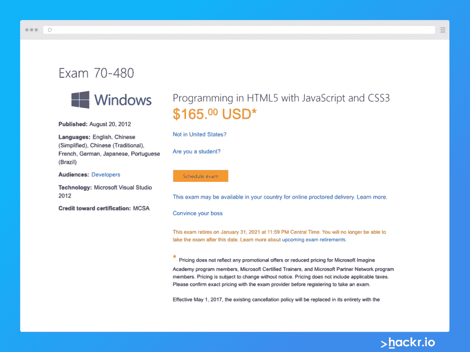
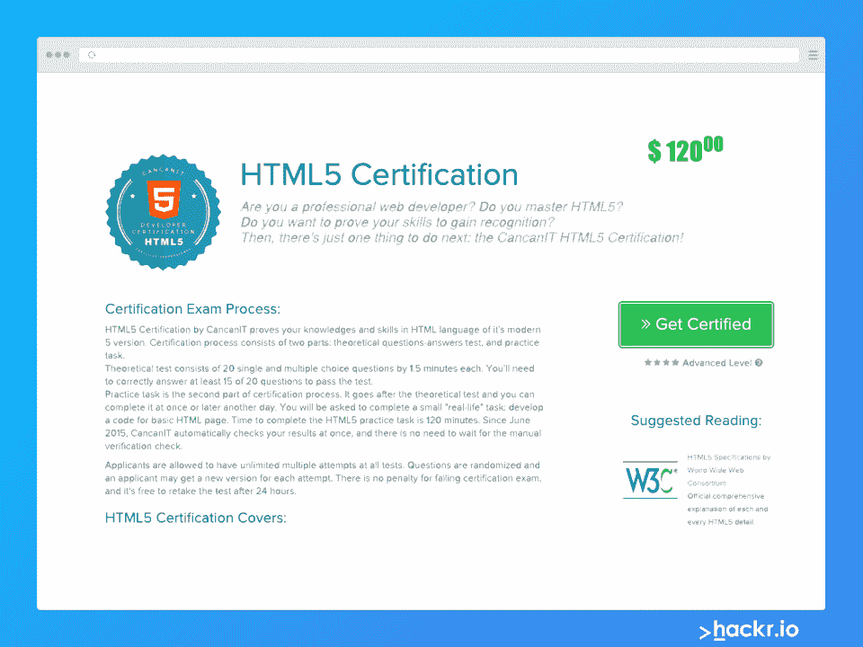
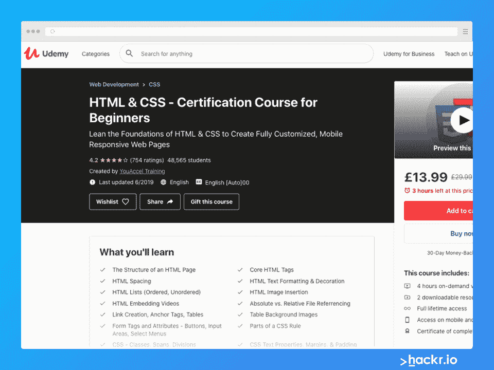
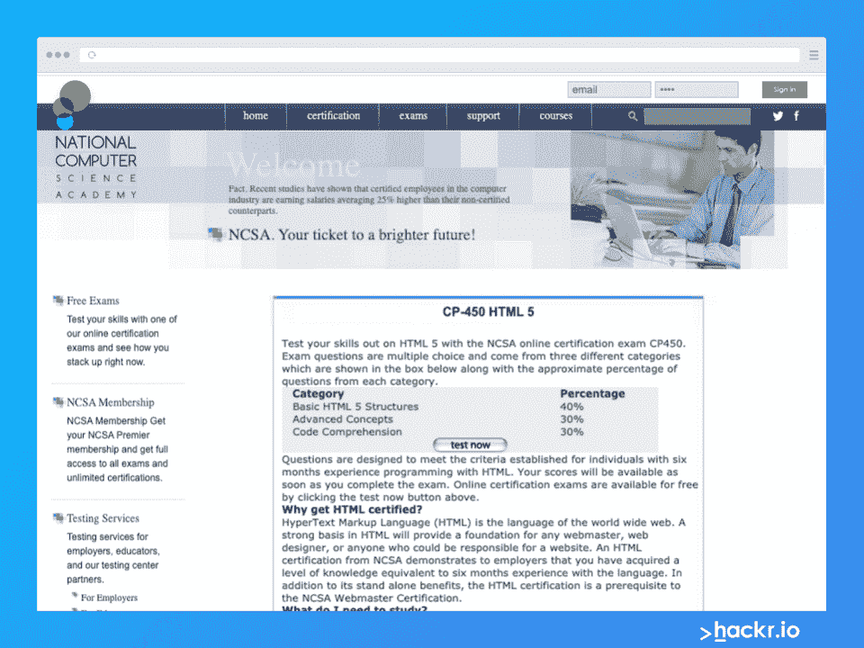
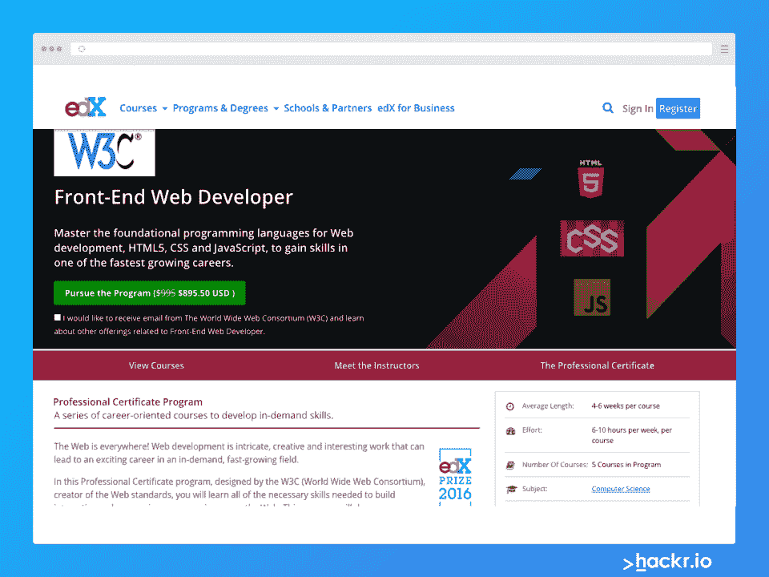
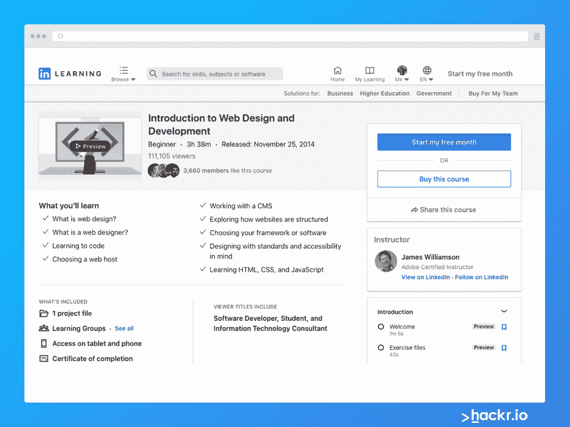
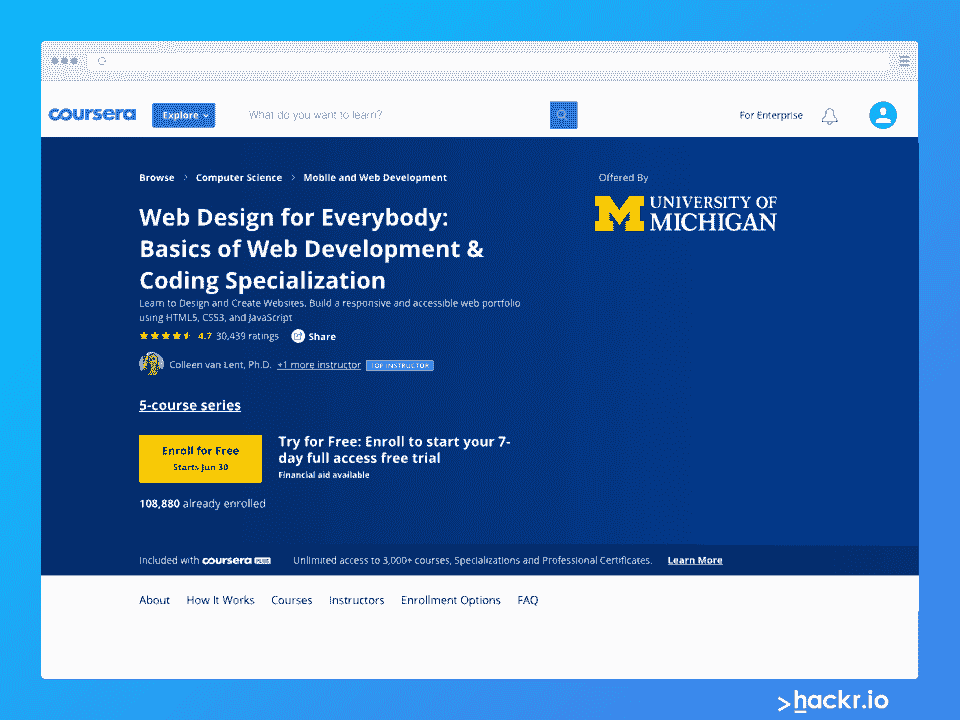
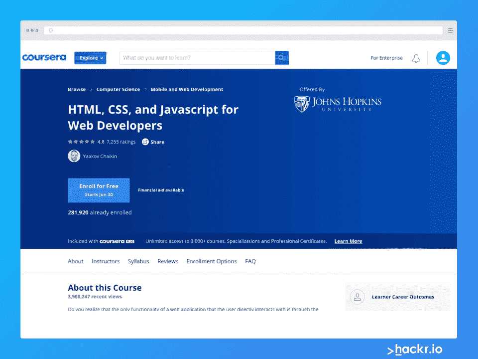

# 成为网站开发者的 9 个最佳 HTML 认证

> 原文：<https://hackr.io/blog/html-certifications>

学习 HTML 是你成为网络开发人员和设计师[的第一块垫脚石。伴随着 HTML 而来的是另外两种语言——CSS 和 JS，它们对于创建交互式网页是必不可少的。整个网络用户界面都是基于这三种语言的，如果你掌握了它们，你一定会得到一份理想的工作、理想的薪水和理想的项目！](https://hackr.io/blog/how-to-become-a-web-developer)

HTML 很好学，用一些好的 [HTML 教程和课程](https://hackr.io/tutorials/learn-html-5) 就可以做到。HTML5 有一些很酷的新功能，使得编写网页比以往任何时候都更容易。

## 什么是 HTML 认证？

虽然有大量的 HTML 课程和教程，但并不是所有的都给你提供了向雇主展示的证书。

HTML 认证为你使用 HTML 的能力提供了实际的证明。三种主要的标记语言之一，HTML 是每个初学 web 开发的人应该首先学习的最基础的语言，然后才是 [CSS](https://hackr.io/tutorials/learn-css) 和[JavaScript](https://hackr.io/tutorials/learn-javascript)。

HTML 规定了网站的结构和外观。没有 HTML，网站的设计元素如视频和图像将无法正常工作。

有了 HTML 认证，你可以让你的简历看起来更吸引网络开发和计算机科学领域的雇主。此外， [研究](http://www.ncsacademy.com/certification/html5.cfm) 显示，有证书的人比没有证书的人多挣 25%左右。

好消息？甚至足不出户就可以在网上获得 HTML 认证！

但是哪个是最好的 HTML 认证呢？我们是否也应该考虑 HTML CSS 证书？还有在哪里可以免费获得 HTML 认证？我们很快会谈到这一点。

## 【HTML 和 HTML5 有什么区别？

在进入我们的列表之前，我们应该概述一下这些认证中的一些是针对 HTML 的，而另一些是针对 HTML5 的。

HTML5 是 HTML 的更高级版本。

这里有一些 HTML5 没有涵盖的东西:

*   支持音频和视频
*   手机友好型
*   使用 SQL 数据库和应用缓存代替 cookie(HTML)存储数据
*   允许 JavaScript 并发运行(HTML 不允许)
*   允许拖放效果
*   允许创建圆形和矩形等形状

浏览认证时，请记住这些差异。如果你精通 HTML5，你可能想通过 HTML5 认证来展示这一点。

## **最佳 HTML 认证**

这里有一些最好的 HTML 认证，包括 HTML5 认证以及 HTML 和 CSS 认证。

#### **考试详情**

考试结构:选择题和实践测试

先决条件:1 年的 HTML、JavaScript 开发经验和基本编程知识

类型:基本

语言:英语、中文、法语、德语、日语、葡萄牙语

价格:127 美元

先决条件:100 小时的经验，熟悉 HTML 和 CSS

模式:在线

#### **考试内容**

*   HTML 基础知识
*   CSS 基础知识
*   HTML 结构
*   HTML 多媒体
*   CSS 样式

**谁应该接受:** 对 HTML 和 CSS 有基本了解，希望在被认证为 [微软黄金合作伙伴](https://docs.microsoft.com/en-us/partner-center/learn-about-competencies?tabs=workspaces-view) 的公司工作的人

**优点:** 仅考试，为有经验的 web 开发人员快速持续，提供模拟测试

**缺点:带指令的学习路径要花钱**

[查看课程](https://docs.microsoft.com/en-us/learn/certifications/exams/98-383)

[****](https://cancanit.com/html5-certification/)

CanCanIT 为精通 HTML5 的有经验的 web 开发人员提供 HTML5 认证。对于企业和公司来说，这是一个很好的选择，因为 CanCanIT 提供 3 人以上的团体认证。考试内容包括:

**考试详情**

#### 测试类型:两部分测试；问&一个理论考试，实际任务； 若干题:20 道单项和多项选择题。

时长:理论考试 30 分钟(每题 1.5 分钟)，实践 120 分钟。

先决条件:无

重拍:24 小时后，无限重拍

费用:120 美元；打印证书的额外 30 美元

**考试内容**

#### 基础、结构和标签

*   元素和元素属性，文档对象模型(DOM)
*   表格和输入类型
*   音频和视频
*   HTML 画布和网络存储
*   **谁应该接手:** 精通 HTML5 的有经验的 web 开发人员。

**优点:** 无限制重考，24 小时后重考，无需额外费用

**反对:** 无

[查看课程](https://cancanit.com/html5-certification/)

[****](https://www.freecodecamp.org/learn)

来自 freecodecamp.org 的认证课程是免费的，可以自定进度。它结合了 HTML5 和 CSS，完成后提供了令人印象深刻的 HTML 和 CSS 认证。

响应式网站设计认证的独特之处在于它包含了一个可访问性部分，这对于确保您的服务覆盖所有受众来说越来越重要。你可以在家学习，建立项目，然后获得认证。

**考试详情**

持续时间:300 小时

费用:免费

语言:英语

类型:自学

先决条件:无

重考:免费，无限制

**考试内容**

#### **基本 HTML 和 HTML5:** 标题、语法、段落、添加链接和图片、表单元素、表单属性、提交、页眉和正文、文档类型

*   **基本 CSS:** CSS 选择器、调整图像大小、颜色、设置字体、添加边框、圆形、边距等元素、内嵌样式、自定义 CSS 变量、浏览器回退
*   **可访问性:** 替代文本、轻松导航、屏幕阅读器注意事项、色盲编码
*   **应用视觉设计** :关于 CSS 属性、文本对齐、框阴影、粗体、斜体、下划线属性、字体属性、浮动元素、z 索引、颜色和渐变、CSS 变换、动画和效果的更多信息
*   **响应式网页设计原则:** 媒体查询、响应式图片、排版、高分辨率展示
*   **CSS Flexbox:**–flex powers、flex-direction、justify-content、align-self、flex-grow、flex-shrink、align-items
*   **CSS 网格:** 网格-模板-行，网格-模板-列，对齐-项，灵活布局，网格内网格
*   **响应式网页设计项目:** 从认证课程中获得最佳收益的 5 个项目，包括构建产品登录页面、调查表、作品集网页等
*   **适合对象:希望通过在线课程学习 HTML、HTML5 和 CSS 并最终获得 HTML 认证的初学者** 。

**优点:** 广泛的课程内容，学历+认证，HTML + CSS

**缺点:** 投入大量时间，对于已经有经验的 web 开发人员来说不是一个好的选择

[查看课程](https://www.freecodecamp.org/learn/)

[****](https://click.linksynergy.com/link?id=jU79Zysihs4&offerid=996030.2410956&type=2&murl=https%3A%2F%2Fwww.udemy.com%2Fcourse%2Fhtml-css-certification-course-for-beginners%2F)

UDemy 的初学 HTML 课程评分为 4.4，是初学者的一个著名选择。在本课程结束时，您将获得一份证书，可以添加到您的简历中。学生将学习 HTML 开发的基础知识和 CSS 的基础知识，并在课程结束时通过动手项目应用他们的课程知识。

**考试详情**

#### 持续时间:4 小时

费用:19.99 美元

语言:英语

类型:带讲师和视频的指导课程，结束时提供认证

结构:4 小时点播视频，70 个 HTML 讲座，31 个 CSS 讲座，两个可下载资源，终身访问课程

先决条件:无

类型:自定进度

**考试内容**

#### **HTML 基础:** 结构、标题、正文、间距、文本格式、列表、链接和锚点

*   **绝对与相对文件引用**

*   **CSS 基础:** 边框、透明度、背景、样式、文本属性、定位、颜色名称和规则、类和跨度

*   **谁应该参加:** 具有 HTML 和 CSS 背景、希望在获得认证之前快速复习的人，以及希望构建移动响应网页的人。

**优点:** 认证的短期承诺和 HTML 和 CSS 的快速回顾

**缺点:** 一些评论者注意到导师匆匆通过了内容

[查看课程](https://click.linksynergy.com/deeplink?id=jU79Zysihs4&mid=39197&murl=https%3A%2F%2Fwww.udemy.com%2Fcourse%2Fhtml-css-certification-course-for-beginners%2F)

[****](http://www.ncsacademy.com/certification/html5.cfm)

由 NCSA(国家计算机科学研究院)提供的这一认证具有许多优点，并以高评级得到广泛认可。NCSA 为初学者提供培训课程，为考试做准备。然而，如果你已经有经验，你可以参加这个免费的认证，而不必参加任何课程或教程。

**考试详情**

#### 持续时间:不清楚，估计几个小时

费用:免费

语言:英语

结构:3 类选择题

级别:中级

费用:免费

先决条件:6 个月 HTML 编程经验

类型:选择题

**考试内容**

#### HTML5 结构(40%)

*   高级概念(30%)
*   代码理解(30%)
*   **谁该接:** 中级网页开发者

**优点:** 为初学者提供的培训课程，为有一点经验的 web 开发人员提供短时间的承诺，以获得认证

**反对:** 无

[查看课程](http://www.ncsacademy.com/certification/html5.cfm)

[****](https://edx.sjv.io/c/2890636/1598007/17728?u=https%3A%2F%2Fwww.edx.org%2Fprofessional-certificate%2Fw3cx-front-end-web-developer)

edX 的这门课程全面覆盖了前端 web 开发，包括 HTML5、CSS 和 JavaScript。该计划包括 5 门课程，提供 HTML 和 CSS 证书，帮助您收集 web 开发的基础知识。

**考试详情**

#### 持续时间:4-6 周

努力:每门课程每周 6-10 小时

课程数量:5

语言:英语

费用:所有课程 895.50 美元

先决条件:初级到中级

类型:自定进度

**考试内容**

#### 5 门课程涵盖:

**HTML5 和 CSS 基础知识:** 基础知识，如何建立一个网站

*   **HTML5 编码要领:** 动画、音视频标签、地理定位、HTML5 特性
*   **HTML5 应用和游戏:** 高级多媒体功能、网络音频和音轨 API、游戏技术和数据存储
*   **JavaScript:** 介绍、调试、CSS 样式

**适合谁:** 希望从 JavaScript 入门开始学习编码基础知识的初学者。

**优点:** 评价高，综合课程

**缺点:** 贵

[查看课程](https://edx.sjv.io/c/2890636/1598007/17728?u=https%3A%2F%2Fwww.edx.org%2Fprofessional-certificate%2Fw3cx-front-end-web-developer)

[****](https://linkedin-learning.pxf.io/15Wedm)

LinkedIn 的这门入门课程涵盖了 HTML、CSS 和 JavaScript 的基础知识。对于活跃在 LinkedIn 的人来说，这是一个特别好的选择，因为招聘人员和关系可以很容易地在平台上看到你的完成徽章。

**考试详情**

#### 语言:英语

等级:初学者

类型:自定进度，可下载

结构:5 个章节测验，1 个项目文件，教学视频

先决条件:无

费用:44.99 美元

重拍:不清楚

**考试内容**

#### **简介:** 探索 HTML、CSS 和 JavaScript，网页设计概述，

*   **使用 HTML:** CMS(内容管理系统)，选择网站主机，注册域名，网站结构
*   **工具:** 代码和图形编辑器、测试工具、框架和 JS 库
*   **可访问性:** 标准和可访问性、多设备世界、网页设计工作流、HTML、CSS 和 JS
*   **谁该拿:** 活跃在 LinkedIn 上的人

**优点:** 评价高，课程和认证费用低

**缺点:** 比其他课程动手少

[查看课程](https://linkedin-learning.pxf.io/15Wedm)

[****](https://coursera.pxf.io/BXVnBW)

由密歇根大学的讲师授课，Coursera 专业化认证提供 5 门课程。认证是 Coursera 的专业化认证，包括 5 门课程，涵盖 HTML5、CSS3、JavaScript 和高级风格。

**考试详情**

#### 语言:英语

等级:基础到高级

结构:完成 5 门课程后的动手项目

期限:6 个月专业

费用:审核免费，证书月费

**考试内容**

#### **JavaScript:** 制作网页互动

*   **CSS3:** 基础知识
*   **DOM:** 修改网页
*   **响应式设计:** 允许在移动、平板和桌面设备上浏览网页

**谁应该学:** 学得比较慢，不急的人；初学者

**优点:** 评价高，覆盖面广

**缺点:** 长期承诺，6 个月

[查看课程](https://coursera.pxf.io/BXVnBW)

[****](https://coursera.pxf.io/WDvygZ)

在美国最佳大学排行榜中排名第九的约翰·霍普斯金大学在 Coursera 上提供免费的 HTML 认证课程。本课程由 Yaakov Chaikin 教授，涵盖了在计算机和移动设备上创建和调整网页所需的基本工具。这是 Coursera 提供的一门基础认证课程，通过这门课程，你将学会网页编码的基本工具。这是一个自定进度的课程，完成后，您将获得一个证书，可以在您的在线个人资料或简历中分享。

**考试详情**

#### 时长:每周 7-11 小时，共 24 小时

语言:英语、韩语

费用:Coursera 有月度计划，而不是课程方面的

先决条件:无

等级:基础

**考试内容**

#### **html 5**简介:设置环境、文档结构、标签

*   **CSS3 简介:** 属性，框模型，浮动，背景，网格，引导
*   **项目** :创建静态网站
*   **JavaScript 简介:** 构造、对象、数组、函数、范围隔离、闭包、构建 web 应用

[查看课程](https://coursera.pxf.io/WDvygZ)

**适合谁:** 想学习 web 开发基础知识的初学者。

**优点:** 评价高，覆盖面广

**缺点:** 一个月的承诺

**结论**

有了证书，你肯定能在任何事情上比其他候选人更有优势——无论是升职、换工作还是另一个团队中的一个挑战性项目。你一定注意到了，大多数 HTML 认证都是 HTML5 认证，也包括 CSS。如果你还没有开始学习 HTML 的基础知识，试试这些为所有水平设计的酷的 [HTML 项目](http://www.hackr.io/blog/html-projects) 。

## 想要建立自己的网站吗？我们建议查看 NameCheap 的[当前交易](https://www.namecheap.com/promos/?clickID=wUoTbQ3KtxyNR9L3K50RiSEKUkAx6nztkXBZwI0&irgwc=1&utm_source=IR&utm_medium=Affiliate&utm_campaign=2890636&affnetwork=ir&ref=ir)来满足你所有的虚拟主机和域名需求。

**人也在读:**

Looking to build your own website? We recommend checking out NameCheap's [current deals](https://www.namecheap.com/promos/?clickID=wUoTbQ3KtxyNR9L3K50RiSEKUkAx6nztkXBZwI0&irgwc=1&utm_source=IR&utm_medium=Affiliate&utm_campaign=2890636&affnetwork=ir&ref=ir) for all your web hosting and domain name needs.

**People are also reading:**