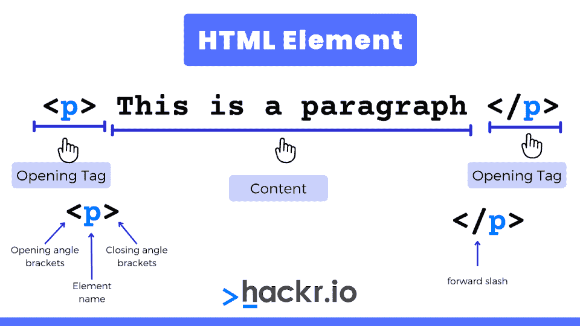

# 2023 年 50+热门 HTML 面试问答[更新]

> 原文：<https://hackr.io/blog/html-interview-questions>

HTML 是 web 开发过程的一部分。很好学，网上有很多教程。然而，面试的经历可能会很不一样，

在这里，我们写下了几个最常见的 **HTML 面试问题和答案**，这些都是你在面试中很可能会被问到的问题。我们将这些问题分为初级、中级和高级 HTML 面试问题。

## **热门 HTML 面试问答**

### **HTML 初学者面试问题**

#### **1。定义 HTML。**

HTML 代表超文本标记语言。HTML 是一种标准的文本格式语言，可以在 web 上创建和显示各种页面。

#### **2。HTML 的组成部分是什么？**

****

HTML 由两部分组成:第一部分是内容，第二部分是标签。它们一起帮助显示包含所需信息的页面。

HTML 标签有助于以正确的格式放置内容。标签分别用< and >打开和关闭。/也用在结束标记中。例如:

```
<head>

</head>
```

不。HTML 标签并不总是成对使用，因为有些标签不需要结束标签。例如，对于标签，不需要结束标签。

[](https://coursera.pxf.io/b3rzD9?subId3=tutorials%2Flearn-html-5_amcid-ZYMisA2xrZI7MONUZM2sx)

#### **5。定义设计页面时参考的标准列表。**

设计页面时参考的标准列表包括以下任一项或多项:

1.  菜单列表
2.  目录列表
3.  有序列表
4.  无序列表
5.  定义列表

#### **6。为什么字符在所有系统上都显示不正确？**

在某些情况下，运行的浏览器不支持该字符，因此该字符显示为框。

#### **7。定义一个图像映射。**

图像地图有助于使用单个图像链接不同种类的网页。图像映射可用于定义图像中的形状，这些形状是图像映射过程的一部分。

#### **8。什么是空白？**

空白是空格字符的空序列。这个空格在 HTML 中被认为是一个空格字符。空白有助于浏览器将多个空格合并成一个空格，从而可以方便地处理文本的缩进行。

#### **9。某些属性值能最好地预定义值吗？**

是的，有些属性值可以设置为预定义的值，但其他属性可以接受任何类型的数值，表示像素大小。

#### 10。我们如何在同一个网页中创建不同部分的链接？

我们可以通过使用标签和#符号在同一个网页中创建几个不同部分的链接。

#### **11。我们能在 HTML 文件中保持列表元素的直线吗？**

是的，我们可以通过使用缩进在 HTML 文件中保持列表元素的直线。缩进也可以用于包含它的父列表的子嵌套列表，以创建更多的列表和元素。

#### **12。哪个网页是杂志上被打印和指向最多的网址？**

顶级页面是最受欢迎的网页，主要作为杂志中的网址打印和指向，因为它帮助用户从同一链接浏览网站上的所有其他页面。

#### 13。为什么我们在图像映射中使用替代文本？

替代文本用于将描述性文本应用于每个热点链接。

#### **14。HTML 文件能在新浏览器上很好地工作吗？**

当然，HTML 文件可以在新的浏览器上工作，但是新的浏览器必须符合 HTML 标准。新的浏览器可能不支持 HTML 的特性，因此不能很好地工作。

#### 15。你认为超链接只适用于文本吗？

不，超链接不仅适用于文本，也适用于图像。这意味着我们可以将一个图像转换成一个链接，当用户点击它的时候，这个链接允许用户访问另一个页面。

#### 16。如果用户的操作系统不支持某个字符，如何表示符号？

符号可以用图像的形式来表示。

#### **17。列表中间的数字类型的两个属性是什么？**

列表中间的数字类型的两个属性包括类型和值。type 属性用于更改任何列表项的编号类型，而 value 属性用于更改任何列表项的编号索引。

#### 18。样式表的目的是什么？

样式表有助于创建定义良好的模板，既一致又可移植。这些样式表模板可以链接到各种网页，这使得维护和更改网页的外观更加容易。

#### **19。有序列表有哪些不同的列表类型？**

有序列表的不同列表类型包括罗马数字和字母。另一方面，无序列表属性可以通过圆形、正方形或圆盘形来设置。

#### 20。我们如何在网页上创建彩色文本？

通过使用 *<字体 color="color" >* 标签为需要应用颜色的文本。

#### **21。将几个复选框分组有什么好处？**

将几个复选框分组有几个好处。其中包括:

1.  组织复选框。
2.  在复选框按钮上应用特定的名称，以便将它们与组区分开来。
3.  支持在单个网页上创建不同名称的复选框组。

HTML 中重叠的标签集导致只识别第一个标签。只有当文本没有显示在浏览器屏幕上时，才会出现此类问题。

#### **23。文本字段大小的限制是什么？**

限制为 13 个字符。size 属性可以设置为低至 1。

### **高级 HTML 面试问题**

#### **24。定义小程序。**

小应用程序是嵌入在网页中的小程序，它们可以执行特定的功能，包括动画、信息处理，甚至计算。小程序是用 Java 语言编写的。

#### **25。您可以在哪里指定表格边框的颜色？**

可以在样式表中指定表格边框的颜色，如果没有，将应用与文本相同的颜色。

#### **26。样式表可以帮助对齐图像和换行吗？**

是的，样式表可以应用表格来定位文本和图像，使它们对齐。

#### **27。你如何改变子弹的颜色？**

项目符号的颜色通常是列表中第一个字符的颜色。但是，如果您使用一组标签更改第一个字符的颜色，那么文本的项目符号颜色和第一个字符颜色将会改变。

#### **28。最大尺寸值是如何确定的？**

最大尺寸值可以由浏览器宽度决定。

#### **29。如果 size 属性设置为零会发生什么？**

如果 size 属性设置为零，那么大小将被设置为 13 个字符的默认大小。

#### 三十岁。边框和嵌线属性有什么相似之处？

如果 border 属性设置为非零值，那么将自动添加一个像素厚度的默认单元格边框。同样，如果 rule 属性被添加到标签中，那么 border 属性将不会被包含，默认的单像素边框将被设置并出现在屏幕上。

#### 31。什么是字幕，如何应用？

字幕有助于设置网页上的滚动文本。要应用选框，您可以使用<marquee>标签。</marquee>

#### 32。文本可以出现在浏览器之外吗？

默认情况下，文本不能出现在浏览器之外，但是，如果文本是具有预定义宽度的表格单元格的一部分，它可以延伸到浏览器窗口之外。

#### 33。样式表可以限制样式定义的数量吗？

不，样式表不限制给定选择器的样式定义的数量，它可以包含在括号中。但是，每个新的样式定义都需要使用分号符号与其他定义分开。

#### 34。样式表中是否遵循层次结构？

是的，在样式表中有一个层次结构，它包括三种不同的样式定义。最接近实际标签的第一个定义优先。第二个定义是内联样式，优先于嵌入的样式表。第三个定义是外部样式表，它优先于其他的。

#### 35。我们可以用不同的类名对各种选择器进行分组吗？

是的，我们可以使用逗号将不同类名和相同样式定义的各种选择器分组。

#### 36。外部 CSS 文件可以在浏览器中打开吗？

不，无法在浏览器中打开外部 CSS 文件，因为该文件具有不同的扩展名。但是，它只能用 HTML 文档中的<link>标签打开。

#### 37。list-style-type 属性会影响段落吗？

不，list-style-type 属性不会影响段落，并且会忽略这个非列表元素。

#### 38。定义画布元素？

canvas 元素支持创建图表和图形。它有助于创建可以通过 HTML5 代码直接放置的 2D 图像。

## **HTML 编码面试问答**

#### 39。编写一个程序来创建 HTML 格式的嵌套网页。

一个网页在另一个网页的里面是一个嵌套的网页。这是使用 iframe 标签完成的，它创建一个内嵌框架。

```
<!DOCTYPE html>
<html>
<body>
<h2>HTML Iframes example</h2>
<p>Use the height and width attributes to specify the size of the iframe:</p>
<iframesrc="https://hackr.io/"height="400"width="600"></iframe>
</body>
</html>
```

#### 40。用 HTML 代码解释 SVG。

HTML SVG 是二维矢量和矢量/光栅图形。SVG 图像及其行为是在 XML 文本文件中定义的。它用于矢量图，如饼图和 X，Y 坐标系中的二维图形。

```
<!DOCTYPE html>
<html>
<body>
<h2>HTML SVG example</h2>
<svg width="400" height="400">
<circle cx="50" cy="50" r="40" stroke="black" stroke-width="6" fill="red" />
</svg>
</body>
</html> 
```

#### 41。借助代码解释按钮标签。

button 标签允许您在网页上的 HTML 表单中创建一个可点击的按钮。

```
<!DOCTYPE html>
<html>
<body>
<h2>HTML Button Tag Example</h2>
<button name="button" type="button">CLICK ME</button>
</body>
</html> 
```

#### **42。HTML 中有哪些不同类型的标题？**

```
<!DOCTYPE html>
<html>
 <head>
<style>
h1{
color: red;
}
h2{
color: blue;
}
h3{
color: green;
}
h4{
color: purple;
}
h5{
color: yellow;
}
h6{
color: orange;
}
</style>
 </head>
<body>
 <h1>This is Heading 1</h1>
 <h2>This is Heading 2</h2>
 <h3>This is Heading 3</h3>
 <h4>This is Heading 4</h4>
 <h5>This is Heading 5</h5>
 <h6>This is Heading 6</h6>
</body>
```

#### **43。解释脚本标签。**

脚本标签嵌入了客户端脚本。它可以在 HTML 代码的 head 或 body 标记中。当浏览器到达文档的该部分时，执行该标签。

```
<!DOCTYPE html>
<html>
<body>
<h2>HTML Script Tag Example</h2>
<script>
var x = 5;
var y = 6;
var result = x + y;
alert("X + Y is equal to " + result);
</script>
</body>
</html>
```

#### **44。如何在 HTML 网页中插入图片？**

```
<!DOCTYPE html>
<html>
<body>
<h2>HTML Image Example</h2>

</body>
</html>
```

#### **45。你如何在网页中插入表情符号？**

```
<!DOCTYPE html>
<html>
 <body>
<h2>HTML Emoji Example</h2>
<p>&#128512;</p>
 </body>
</html> 
```

#### **46。解释 HTML 表单。**

表单被设计用来获取用户输入，这些输入随后可以被发送到服务器进行处理。输入可以以文本或单选按钮的形式给出，并且可以通过单击提交按钮来提交。

```
<!DOCTYPE html>
<html>
<body>
<h2>HTML Form Example</h2>
<form>
 <label for="fname">First name:</label><br>
 <input type="text"id="fname"name="fname"><br>
 <label for="lname">Last name:</label><br>
 <input type="text"id="lname"name="lname">
</form>
<p> </p>
<form>
 <input type="radio"id="male"name="gender"value="male">
 <label for="male">Male</label><br>
 <input type="radio"id="female"name="gender"value="female">
 <label for="female">Female</label><br>
 <input type="radio"id="other"name="gender"value="other">
 <label for="other">Other</label>
 <br> </br>
 <inputtype="submit"value="Submit">
</form>
</body>
</html> 
```

#### **47。如何在网页中插入超链接？**

超链接是用 HTML 标签定义的。

```
<!DOCTYPE html>
<html>
<body>
<h2>HTML Hyperlink Example</h2>
<a href="url">link text</a>
</body>
</html> 
```

#### **48。你如何给文本添加颜色？**

```
<!DOCTYPE html>
<html>
<body>
<h2>HTML Color Text Example</h2>
<h1 style="color:Tomato;">Hello HTML</h1>
<p style="color:DodgerBlue;">Line 1</p>
<p style="color:MediumSeaGreen;">Line 2</p>
</body>
</html> 
```

#### 49。解释有序和无序列表。

一个无序列表是用

*   标签。列表项显示为项目符号。

有序列表写在

1.  标签。列表项显示为数字。

```
<!DOCTYPE html>
<html>
<body>
<h2>HTML List Example</h2> 
<ul>
 <li>Coffee</li>
 <li>Tea</li>
 <li>Milk</li>
</ul> 
<ol>
 <li>Coffee</li>
 <li>Tea</li>
 <li>Milk</li>
</ol>
</body>
</html>
```

#### 50。解释描述列表。

描述列表允许我们为列表中的每个元素添加描述。

标签定义描述列表，

标签定义术语(名称)，

标签描述每个术语。

```
<!DOCTYPE html>
<html>
<body>
<h2>HTML Description List xample</h2>
<dl>
 <dt>Coffee</dt>
 <dd>- black hot drink</dd>
 <dt>Milk</dt>
 <dd>- white cold drink</dd>
</dl>
</body>
</html> 
```

#### 51。定义和实现 alt 属性。

如果图像无法显示，alt 属性指定要显示的替代文本。

```
<!DOCTYPE html>
<html>
<body>
<h2>HTML Alt Example</h2>

</body>
</html> 
```

## **结论**

这些 HTML 和 HTML5 面试问题和答案应该是你开始准备面试所需要的。如果你愿意，可以考虑报名参加这个我的课程。

不要忘记实际编码来测试你的学习。祝你好运！

如果你想利用你的 HTML 技能来建立你自己的网站，我们推荐你使用 NameCheap 来

[buy your domain name](https://www.namecheap.com/?clickID=wUoTbQ3KtxyNR9L3K50RiSEKUkAx6n2NkXBZwI0&irgwc=1&utm_source=IR&utm_medium=Affiliate&utm_campaign=2890636&affnetwork=ir&ref=ir)

和

[web hosting services](https://www.namecheap.com/hosting/shared/?clickID=wUoTbQ3KtxyNR9L3K50RiSEKUkAx6E09kXBZwI0&irgwc=1&utm_source=IR&utm_medium=Affiliate&utm_campaign=2890636&affnetwork=ir&ref=ir)

。它们是业内最好的，而且超级实惠。

## **常见问题解答**

HTML 中有超过 100 个标签。最常用的列在上面的 HTML 问答中。

#### **2。HTML 中的基本面试问题有哪些？**

上面列表顶部的 HTML 基本面试问题几乎涵盖了你需要了解的所有基本知识。

#### **3。HTML 中的 HR 标签是什么？**

HR 标签添加一个水平标尺或主题分隔符。它是使用

* * *

创建的。

**人也在读:**