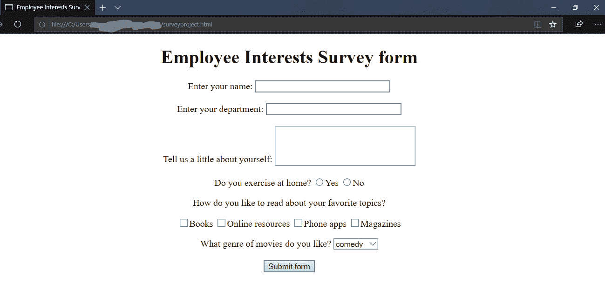
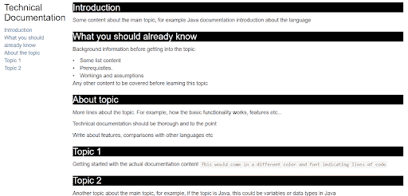
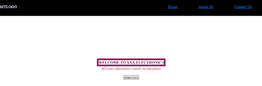
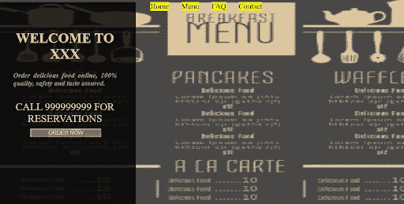

# 增强您的 Web 开发技能的 10 大 HTML 项目

> 原文：<https://hackr.io/blog/html-projects>

## **什么是 HTML？**

HTML 是整个网络的核心。我们在网上看到的任何内容都是基于 HTML 的。如果你简单地右击任何网页，点击查看源代码，你将能够看到大量的标签，第一个是，这意味着该文件是一个 HTML 文件。

HTML 的基本结构:

```
<!DOCTYPE HTML>
<html>
<head>
  <title>Title of the page</title>
</head>
<body>
  <form action="some_action" method="POST">
  </form>
</body>
</html>
```

### 对 HTML 项目有什么期望？

除了 HTML，你应该能够掌握一点(或者很多)CSS 和 JavaScript。三种技术齐头并进，对于下面的项目；尽管你不需要任何 CSS 或 JavaScript 的经验。这些都是简单而强大的项目，会给你很多学习经验。

### **HTML 的特性**

在我们进入项目之前，让我们快速回顾一下要点:

*   独立于平台的标记语言。
*   易于使用和学习。
*   不需要任何设置或安装。
*   链接，图像，视频，音频，动画可以添加很少的编码。
*   不区分大小写。
*   易于用其他语言编写自定义代码并与 HTML 集成。
*   所有浏览器都支持。
*   免费！

## **为什么是 HTML 项目？**

项目是学习任何语言最实用的方法，HTML 也不例外。要建立任何网站，你需要对 HTML 有一个基本的了解，如果你想要交互式定制网站，仅仅知道[备忘单](https://hackr.io/blog/html-cheat-sheet)是不够的——你应该能够实际运用你的知识。

## 10 个最适合初学者的 HTML 项目

现在让我们来看看最好的 HTML 项目，以提高您的 web 开发技能。

### **1。调查表**

调查表是您可以开始的最简单的 HTML 项目之一。在这个项目中，我们将创建一个简单的调查表，然后提交捕获的信息。您可以打开任何文本编辑器来编写代码，并使用。html 扩展。例如，survey.html

您将了解基本的输入标签、表单创建、单选按钮、复选框等。

下面是该项目的源代码，以及对标签的必要解释。您可以一个一个地添加元素，看看它们是如何工作的。

每个文件都应该以标签开始，以结束标签结束。

```
<!DOCTYPE HTML>
<!-- This is how HTML comments look like -->
<html>
<!-- the title will appear on the page-->
<head>
<title>Employee Interests Survey</title>
</head>
<body>
<!-- as it is a survey form, we will need to submit the details, hence we use form -->
<!-- We can give absolute url, or relative url like /nextpage.jsp, and specify POST or GET method -->
<form action="http://google.co.in">
<!-- If we remove this, every thing will move to the left of the page-->
<div align="center">
<!--Adds a heading to the form-->
<h1>Employee Interests Survey form</h1>
Enter your name:
<!-- Input type text for small texts, specify size -->
<input type="text" name="UserName" size=35 maxlength=35 value="">
<!--Adds spaces - remove and see what happens -->
</br></br>
Enter your department:
<input type="text" name="Deptt" size=35 maxlength=35 value=""> </br> </br>
Tell us a little about yourself:
<!-- For writing lot of text like descriptions with text wrapping,
if you dont want text wrapping, you can add wrap = "off" (horizontal scrollbar -->
<textarea name="Comments" cols=30 rows=4></textarea> </br> </br>
Do you exercise at home?
<!-- Radio buttons help you choose one out of the many values -->
<input type="radio" name="exe" value=1>Yes
<input type="radio" name="exe" value=2>No
</p>
How do you like to read about your favorite topics?
<p>
<!--Checkbox lets you select multiple options -->
<input type="checkbox" name="Books">Books
<input type="checkbox" name="Web">Online resources
<input type="checkbox" name="Phone">Phone apps
<input type="checkbox" name="Magazines">Magazines
</p>
What genre of movies do you like?
<!--Select box lets you choose one of the multiple dropdown options-->
<select name="moviepref" ><option>
<option value=1 selected = "true">comedy
<option value=2 >romance
<option value=3 >thriller
<option value=4 >horror
<option value=5 >biopic
</select>
</br></br>
<!--submits the information entered in the form by the user -->
<input type=submit value="Submit form">
</div>
</form>
</body>
</html>
```

以下是您的页面外观:



### **2。网站产品展示**

产品展示或产品登录页面是一个令人兴奋的项目，在这里您将学习如何在网站上以最互动的方式展示产品。

下面的视频展示了多个产品，一个接一个。你会惊讶于页面是如何使用简单的 CSS 样式完全改变的。

[并排展示产品](https://www.youtube.com/watch?v=mtQV5a-JEHo)

在下面提到的另一个视频中，您将学习如何创建产品卡片，即产品的详细信息。

[显示产品信息的产品卡](https://www.youtube.com/watch?v=8qTNDfOKQWY)

这两个是很酷的项目，通过它们你会了解到 HTML 和 CSS 是多么容易地结合在一起创建漂亮的 UI。

### **3。技术文档页**

每一种语言，软件，硬件等等。拥有信息和帮助的技术文档。下面是如何创建一个简单的文档页面，从页面左边的导航到右边的内容有内部链接。可以查看 [Python](https://hackr.io/tutorials/learn-python) 、 [Java](https://hackr.io/tutorials/learn-java) 、 [Arduino](https://hackr.io/tutorials/learn-arduino) 等的文档。请参考这些页面的外观。大多数技术文档都有多个层次和页面；然而，为了简单起见，我们已经创建了一个简单的项目来开始。您可以根据自己的意愿进一步扩展和添加它。如果你刚刚开始你的 HTML 职业生涯，技术文档可能是一个有益的 HTML 项目。

```
<html>
<!--This example uses the default bootstrap stylesheet-->
<link rel="stylesheet" href="https://maxcdn.bootstrapcdn.com/bootstrap/3.3.7/css/bootstrap.min.css"
         integrity="sha384-BVYiiSIFeK1dGmJRAkycuHAHRg32OmUcww7on3RYdg4Va+PmSTsz/K68vbdEjh4u" crossorigin="anonymous">
<!--provides a full-width container that can expand or collapse based on the size of viewport-->
<div class="container-fluid">
   <div class="row">
       <div class="col-md-2 col-sm-12 col-xs-12">
           <nav id="navbar">
               <h3>Technical Documentation</h3>
               <!--content stacking for smaller screens-->
               <ul class="nav nav-pills nav-stacked">
                <!--internal linking to the respective sections-->
                   <a class="nav-link" href="#Introduction" rel="internal">
                       <li>Introduction</li>
                   </a>
                   <a class="nav-link" href="#What_you_should_already_know" rel="internal">
                       <li>What you should already know</li>
                   </a>
                   <a class="nav-link" href="#About_Topic" rel="internal">
                       <li>About the topic</li>
                   </a>
                   <a class="nav-link" href="#Topic_1" rel="internal">
                       <li>Topic 1</li>
                   </a>
                   <a class="nav-link" href="#Topic_2" rel="internal">
                       <li>Topic 2</li>
                   </a>
                </ul>
           </nav>
       </div>
       <div class="col-md-10 col-sm-12 col-xs-12">
           <main id="main-doc">
               <section class="main-section" id="Introduction" >
                <!--basic styling for the headings, better practice to do the same in a css file as the styling is same for all headers-->
                   <h3 style = "background: black; color: white">Introduction</h3>
                   <article>
                   <p>Some content about the main topic, for example Java documentation introduction about the language
                       </article>
               </section>
               <section class="main-section" id="What_you_should_already_know">
                   <h3 style = "background: black; color: white">What you should already know</h3>
                   <article>
                       <p>Background information before getting into the topic:</p>
<!--creating list using html-->
                       <li>Some list content</li>
                       <li>Prerequisites.</li>
                       <li>Workings and assumptions</li>
                       <p>Any other content to be covered before learning this topic</p>
                       </artice>
               </section>
               <section class="main-section" id="About_Topic">
                   <h3 style = "background: black; color: white">About topic</h3>
                   <article>
                       <p>More lines about the topic. For example, how the basic functionality works, features etc...</p>
                       <p>
                       Technical documentation should be thorough and to the point
                       </p>
                       <p>
                       Write about features, comparisons with other languages etc
                       </p>
                   </article>
               </section>
               <section class="main-section" id="Topic_1">
                   <h3 style = "background: black; color: white">Topic 1</h3>
                   <article>
                       Getting started with the actual documentation content
                       <code>This would come in a different color and font indicating lines of code
                       </code>
                   </article>
               </section>
               <section class="main-section" id="Topic_2">
                   <h3 style = "background: black; color: white">Topic 2</h3>
                   <p>
Another topic about the main topic, for example, if the topic is Java, this could be variables or data types in Java
                   </p>
               </section>
           </main>
       </div>
   </div>
</div>
</html>
```

您应该会看到这样一个页面:



### **4。添加动画**

在这个项目中，我们将创建一个简单的页面，其中一辆汽车将出现在道路上。这个简单的项目是如何简单快速地制作动画的完美例子。注意使用<marquee>标签来创建这个简单的动画。尝试添加更多的对象，并使它们朝着不同的方向移动，以获得更多的乐趣。</marquee>

[使用字幕的简单动画](https://www.youtube.com/watch?v=GNqbR0n4TSo)

### **5。动画网站首页**

在这个项目中，我们将创建一个主页，显示一个标志和一些菜单项。您还可以通过动画的关键帧标签获得一些乐趣。请注意导航菜单和页面的其余部分是如何使用 height 属性分隔的。您可以应用背景图像，并将高度更改为 85vh 或 100vh，并查看其差异。

```
<html>
<head>
<title></title>
<!-- Apply styles to html elements -->
<style>
*{
margin:0; padding:0; boxsizing:border-box;
}
header{
width: 100%; height: 100vh;
background-color: white;
background-repeat: no-repeat;
background-size: cover;
}
nav{
width: 100%; height: 15vh;
background: black;
display: flex; justify-content: space-between;
align-items: center;
}
nav .mainmenu{
width: 40%;
display: flex; justify-content: space-around;
}
main{
width: 100%; height: 85vh;
display: flex; justify-content: center;
align-items: center;
text-align: center;
}
section h3{
letter-spacing: 3px; font-weight: 200;
}
section h1{
text-transform: uppercase;
}
section div{
animation:changeborder 10s infinite linear;
border: 7px solid red;
}
@keyframes changeborder{
0%
20%
40%
}
</style>
</head>
<body>
<!--Let us create a simple menu using the navigation tags-->
<!--Use header to indicate that manu will be a part of header -->
<header>
<nav>
<div class = "logo" <h3 style="color:white;">MYLOGO</h3></div>
<!--Lets define the menu items now-->
<div class = "mainmenu">
<a href="https://hackr.io/tutorials/learn-html-5">Home</a>
<a href="https://hackr.io/tutorials/learn-html-5">About Us</a>
<a href="https://hackr.io/tutorials/learn-html-5">Contact Us</a>
</div>
</nav>
<!--Let us create the main section now, if you are not using html5, use div tags-->
<main>
<section>
<!--Check out the styling elements for this div class - change_text -->
<div class = "change_text"><b>WELCOME TO XXX ELECTRONICS</b></div>
<!--make text italic-->
<p><i>All your electronics needs in one place</i></p><br>
<!--create a button, if there is a form, you can specify an action on click-->
<input type = button value = "view more">
</section>
</main>
</header>
</body>
</html>
```

上述代码将产生以下输出。盒子的颜色会有所不同。



### **6。视频背景网站**

这个项目用完整的源代码解释了我们如何在网页上添加视频背景。前景包含一些文本。该项目使用 HTML5。演讲者还讲述了一个避免滚动条的简单技巧。您还将学习在最前面添加文本，并使其显示在页面的中央。如果您调整页面大小，视频也会调整大小，并通过设置简单的 CSS 值来适应屏幕大小。背景中的视频可以给你的网站一个可爱的效果，使其具有互动性。查看代码和解释的视频背景动画。

[https://www.youtube.com/embed/W2y33Q2lf3k](https://www.youtube.com/embed/W2y33Q2lf3k)

视频

### 7 .**。创建一个图像滑块**

图像滑块或幻灯片放映是当今大多数网站都有的功能。在任何网站，例如，时尚，食品，服务等。，你可以观察到大部分内容是通过多个图像显示的。如果您知道如何将图像显示为幻灯片，其他内容可以通过使用普通输入和其他数据类型来开发。整个项目只使用了 HTML 和 CSS，没有使用 JavaScript，因此避免了任何跨浏览器的问题。演讲者在这里详细解释了功能[。](https://www.youtube.com/watch?v=FZrHoAUkHpE)

[https://www.youtube.com/embed/FZrHoAUkHpE](https://www.youtube.com/embed/FZrHoAUkHpE)

视频

### **8。互动餐厅网站**

在这个项目中，我们将创建一个餐馆的交互式主页，当我们将鼠标悬停在菜单选项上时，背景图像会发生变化。例如，如果你悬停在菜单导航上，它会显示一个菜单卡片，如果你悬停在主页上，它会显示默认。您必须给出您的图像名称和位置，这样才能工作。这个功能是通过 jQuery 实现的。同样,“立即订购”按钮会一直闪烁。我们已经通过使用@keyframes 功能做到了这一点，我们在我们的动画网站项目中也使用了该功能。以下是代码:

```
<html>
<head>
   <style>
       body{
  font-size:20px;
           color: white;
           background-size: cover;
       }
        .box{ width: 900px;
      float:right;
      border:1px solid none;}
      .box ul li{
          width: 120px;
          float:left;
          margin: 10px auto;
          text-align: center;
      }
.mainmenu
.mainmenu a
.mainmenu a:hover
.mainmenu img{
position: fixed;
z-index: -1;
top:0px; left:0px; width:100%; height: 100vh;
opacity: 0.9;
/*object-fit:cover;*/
transition: all ease 0.5s;
}
  .wd{
          width: 300px;
          height: 539px;
          background-color: black;
          opacity: 0.8;
          padding: 55px;
      }
      .wd h1{
          text-align: center;
          text-transform: uppercase;
          font-weight: 300px;
      }
      .wd h4{
          text-align: justify;
          color:darkgray;
          font-weight: 100px;
      }
      .wd h2{
          text-align: center;
          text-transform: uppercase;
          font-weight: normal;
          margin: 40px auto;
      }
      .opt form , input[type="button"]{
          background-color: black;
          color:white;
        /* padding:10px;*/
          margin:-14px auto;
          padding-left: 50px;
          padding-right: 50px;
          text-align: center;
          font-size: 16px;
      }
    form, input[type="button"] {
      animation: glowing 300ms infinite;
      font-weight: 500%;
     }
     @keyframes glowing {
0% {
  background-color: red;
}
50% {
  background-color: orange;
}
100% {
  background-color: blue;
}
}
  </style>
</head>
<body>
<script src="https://cdnjs.cloudflare.com/ajax/libs/jquery/3.4.1/jquery.min.js"></script>
<script>
$(function(){
var image = $(".mainmenu").find('img').attr('src');
$(".mainmenu a").mouseover(function(){
var newimg = $(this).attr('data-image');
$(this).parent().find('img').attr("src", newimg);
});
});
</script>
  <div class="box">
<div class="mainmenu">

<a data-image = "food.png" href=""> Home</a>
<a data-image = "menucard.jpg" href=""> Menu</a>
<a href=""> FAQ</a>
<a href=""> Contact</a>
</div>
  </div>
  <div class="wd">
<h1> Welcome to xxx</h1>
<h4> <i>Order delicious food online, 100% quality, safety and taste assured.</i></h4>
<h2> Call 999999999 for reservations</h2>
<div class="opt">
<form action="" method="post">
<input type="button" value="ORDER NOW">
</form>
</div>
</div>
</body>
</html>
```

输出将是:


将鼠标悬停在菜单导航上时，页面看起来像这样:



### **9。电子投票系统**

在这个项目中，您将学习从电子投票系统的用户那里获取各种输入，包括日期，显示为日历。样式已经使用 CSS 完成。您还将学习如何提交表单并重定向到下一页。该项目展示了如何添加不同的 HTML 元素，如输入框，单选按钮，下拉列表等。；但是，您可以在项目视频中给出的代码之上添加更多细节来构建一个成熟的表单。点击观看[视频，了解如何制作该页面并提交信息。](https://www.youtube.com/watch?v=6FTJzXrgg3Q%20%20-)

### 10。网格响应网站布局

这是一个包含多个 HTML 和 CSS 组件的单页网站页面。这是一个有点复杂的项目，但最终，你应该能够自己创建一个带有 CSS 网格的页面。演讲者使用简单的 HTML 和 CSS 元素，并有很好的解释。无论你在其他项目中学到了什么，你都将能够在这个项目中应用到所有这些，甚至更多。该项目还包括如何使网页移动友好。该页面还使用了一些新技术，如 flex 和媒体查询。查看视频:

[https://www.youtube.com/embed/M3qBpPw77qo](https://www.youtube.com/embed/M3qBpPw77qo)

视频

## **结论**

在本文中，我们讨论了一些可以尝试的基本 HTML 项目想法，但是学习并没有到此为止。您可以处理大量其他交互式项目，增加这些项目的复杂性，将这些项目组合成一个项目，并使用不同的标签。

[用 HTML5 和 CSS3 构建反应灵敏的真实世界网站](https://click.linksynergy.com/deeplink?id=SeYHzlfZEmI&mid=39197&murl=https://www.udemy.com/course/design-and-develop-a-killer-website-with-html5-and-css3/)是一门增强你的 HTML 学习的伟大课程。查看更多免费和付费教程[这里](https://hackr.io/tutorials/learn-html-5?ref=blog-post)。

如果你计划托管你的网站，请在 [Namecheap](https://namecheap.pxf.io/c/2890636/624649/5618) 查看这些折扣托管包。他们还提供[域名](https://namecheap.pxf.io/c/2890636/624649/5618)和[其他服务](https://namecheap.pxf.io/c/2890636/624623/5618)。

你有没有尝试过建立自己的东西？下面分享一下你的经历。

**人也在读:**