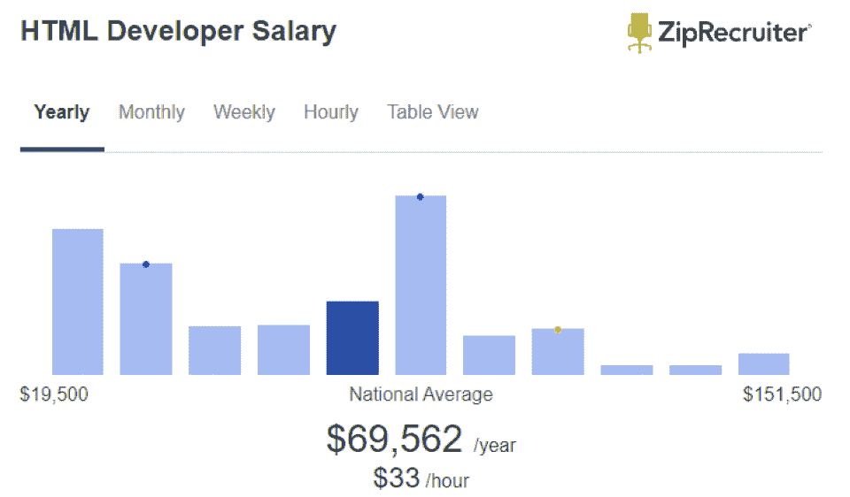
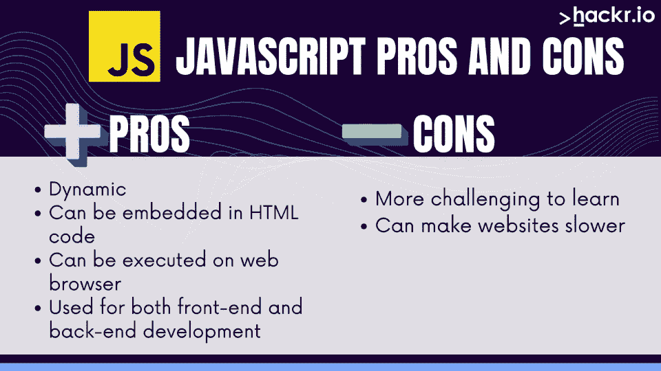
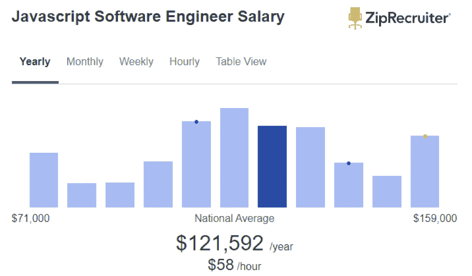

# HTML vs JavaScript:应该学哪个？

> 原文：<https://hackr.io/blog/html-vs-javascript>

对开发网站或应用感兴趣？你必须从某个地方开始。很多程序员在职业生涯的初期就学习 HTML 和 JavaScript。但是你应该先学习哪种语言:HTML 还是 Javascript？

虽然两者都是受欢迎的选择，但它们有着截然不同的目的。对大多数人来说，答案是两者都要学。

让我们来探讨 Javascript 和 HTML 之间的区别，以帮助您决定最适合您的。

## **什么是 HTML？【定义】**

HTML 或超文本标记语言是一种用于创建网页和应用程序的标准标记语言。HTML 是所有网页内容的基础，它决定了网页的结构和布局。可以用 HTML 做前端开发，旁边还有 CSS 和 JavaScript。

## **JavaScript 是什么？** **【定义】**

JavaScript 是一种用于使网页交互的编程语言。JavaScript 代码可以嵌入到 HTML 代码中，并且可以在您的 web 浏览器上执行。您还可以使用 Javascript 开发移动应用程序，以及前端和后端开发。

接下来:HTML 和 Javascript 有什么区别？

## HTML 与 JavaScript:势均力敌的比较

JavaScript 和 HTML 哪个更好？特征明显不同。这里有一个快速对比:

| **参数** | **HTML** | **JavaScript** |
| 发达的 | 1993 年由蒂姆·伯纳斯·李 | 1995 年，作者布伦丹·艾奇 |
| 格式 | 置标语言 | 脚本语言 |
| 内容类型 | 静态 | 动态的 |
| 平台 | 浏览器 | 浏览器 |
| 前端 | 是 | 是 |
| 后端 | 不 | 是 |

HTML 和 JavaScript 有着密切的关系。它们是与万维网的基础主干同时开发的。因此，HTML 和 JavaScript 已经并行发展。但是 Javascript 是 HTML 吗？HTML 是 JavaScript 吗？

## 【HTML 和 JavaScript 的主要区别

如果 HTML 和 JavaScript 一起创建一个网站，HTML 和 JavaScript 的主要区别是什么？

*   HTML 是标记语言，而 JavaScript 是脚本语言。
*   HTML 可以用来设计自己的网站。在大多数情况下，*，* JavaScript 不能，尽管有变通方法。
*   HTML 用于创建网页的结构和布局，而 JavaScript 用于为网页添加交互性和动态内容。
*   HTML 代码是静态的，这意味着它在页面加载时不会改变，而 JavaScript 代码是动态的，这意味着它可以在页面加载时改变。
*   HTML 容易学习和使用，而 JavaScript 可能更难学习。
*   HTML 用于前端开发，JavaScript 用于前端和后端开发。

如你所见，这两种语言差别很大。然而，他们经常一起去。JavaScript 和 HTML 的主要区别在于 JavaScript 是动态的，而 HTML 是静态的。

### HTML:设计漂亮网站的前端

使用 HTML，您可以定义网页的内容，包括文本、图像和链接。虽然 HTML 基本上是静态的，但是你也可以使用 HTML 向你的网页添加一些交互元素，比如表单、按钮和事件处理程序。

HTML 易学易用。如果您对创建网站或 web 应用程序感兴趣，HTML 是一个很好的起点。

#### **HTML 的好处**

*   HTML 易学易用。
*   HTML 无处不在；大多数人最终都需要学习它。
*   HTML 决定了页面的结构和布局。

#### **HTML 的弊端**

*   HTML 无法为您的页面添加显著的交互性或动态内容。

### 谁使用 HTML？

任何创建网站或网络应用程序的人都使用 HTML。甚至动态网站仍然需要 HTML 来格式化。HTML 是网页设计的基础，也是网页开发者学习的第一门语言。

### HTML 开发人员的职业前景

根据 ZipRecruiter 的数据，HTML 开发者的平均收入约为 94491 美元。然而，薪水有一个极端的范围，从 56，500 美元开始到 154，500 美元结束。这个范围可能与 HTML 开发人员知道的其他语言和技术有关。

## **HTML vs HTML5**

虽然 HTML 大部分是静态的(不是动态的或交互式的)，但也有一些例外。例如，表单元素可以用来在页面上产生动态的交互式结果。

HTML5 是 HTML 规范的最新版本。它于 2014 年发布，目前仍在定稿过程中。HTML5 为 HTML 引入了更多的动态和交互式元素，尽管它仍然主要是静态的。

HTML 和 HTML5 的主要[区别在于 HTML5 支持新元素，比如<视频>和<画布>，以及新属性，比如“自动播放”和“海报”HTML5 还支持新的 JavaScript APIs，比如 WebSocket API 和 Geolocation API。](https://hackr.io/blog/difference-between-html-html5-xhtml)

因此，HTML 正在成为一种更强大的语言，但它仍然只是一种标记语言，而不是脚本语言。如果你想比较 JavaScript 和 HTML5，就不会有真正的比较。

## **JavaScript:开发动态交互式网络应用**

JavaScript 允许您定义网页的行为和交互性。您还可以使用 JavaScript 创建在您的 web 浏览器上运行的 web 应用程序。

但是 JavaScript 还做得更多。您可以使用 JavaScript 创建服务器端应用程序和移动应用程序。您还可以使用 JavaScript 连接到数据库并访问数据。JavaScript 是一种非常流行的语言,它可以用于很多应用程序——即使只是通过变通方法。

JavaScript 比 HTML 更难学。如果你想创建动态的、交互式的网站或网络应用，你应该学习 JavaScript。

### **JavaScript 的好处**

*   JavaScript 是一种动态编程语言。
*   JavaScript 代码可以嵌入到 HTML 代码中。
*   JavaScript 可以在您的网络浏览器上执行。
*   JavaScript 用于前端和后端开发。

### **JavaScript 的弊端**

*   JavaScript 可能比 HTML 更难学。
*   JavaScript 代码可以在您的 web 浏览器上执行，这会使您的网站变慢。

### 谁使用 JavaScript？

每个创建动态 web 应用程序的人都使用 JavaScript。前端开发者、后端开发者、全栈开发者都使用 JavaScript。通过框架和库，JavaScript 也可以用于移动应用程序。

### 【JavaScript 开发人员的职业前景

根据 ZipRecruiter 的数据，截至 2022 年，JavaScript 开发人员的平均收入约为 125，436 美元。薪水起价 71500 美元，止价 165000 美元。一般来说，由于语言的复杂性，JavaScript 开发人员比 HTML 开发人员挣得多。

### 推荐的 JavaScript 课程

【JavaScript 全教程 2023:从零到专家！

[创意编码:用 JavaScript 制作视觉效果](https://domestika.sjv.io/c/2890636/1558123/17608?u=https%3A%2F%2Fwww.domestika.org%2Fen%2Fcourses%2F2729-creative-coding-making-visuals-with-javascript&partnerpropertyid=2722169)

### **JavaScript:用 jQuery 扩展，React**

jQuery 是一个库，它使得在网页上使用 JavaScript 变得很容易。React 是一个框架，它使得为您的 web 应用程序创建可重用的组件变得容易。使用 jQuery 和 React，您可以扩展您的 web 页面和应用程序功能。

jQuery 和 React 都是与 JavaScript 交互的流行方法，以至于一些开发人员经常从学习 React Native 或 jQuery 开始。如果你有兴趣成为一名 web 应用程序甚至移动应用程序开发人员，这是需要考虑的事情。

## **CSS、HTML 和 JavaScript**

除了 HTML 和 JavaScript 之外，你可能会看到讨论的第三种语言是 CSS。大多数前端开发人员会同时学习 HTML、JavaScript 和 CSS。

CSS 或级联样式表是一种用于描述 HTML 和 XML 文档表示的样式表语言。使用 CSS，您可以控制 HTML 文档的字体大小、颜色和间距。您还可以使用 CSS 来创建在移动设备上看起来很棒的响应式设计。CSS 位于 HTML 和 JavaScript 之间。

为了创建一个强大的网站，程序员可能会想学习所有三种语言。

## 有 HTML 和 JavaScript 的替代品吗？

如果你对 web 开发感兴趣，你应该学习 HTML 和 JavaScript。然而，这些技术有一些替代方案。其中包括 PHP、Java 和 Python。具体来说，PHP、Java、Python 可以代替 JavaScript 进行后端开发。

但是，如果你想创建动态的、交互式的 web 应用，你应该学习 JavaScript。JavaScript 是唯一可以在你的网络浏览器上执行的语言——它是一种解释型语言。PHP，Java，Python 都需要编译。

## **结论**

HTML 和 JavaScript 最终用于完全不同的任务。但是尽管它们有所不同，对于任何对 web 开发感兴趣的人来说，它们都是必不可少的技术。前端开发人员、后端开发人员、全栈开发人员甚至移动开发人员都在使用这些技术。

那么，如何在 HTML 和 Javascript 之间做出选择呢？

如果你想设计网站的外观和感觉，格式化文本，显示图像，你想学习 HTML。

*   参加 HTML 在线课程。
*   尝试练习 HTML 项目。
*   获得 HTML 认证。

如果你想开发交互式的动态网站，对用户输入做出反应，甚至在数据库中存储信息，你想学习 JavaScript。

大多数有经验的开发人员应该知道足够多的 HTML，但是 JavaScript 是更健壮的语言。如果你想成为一名 web 开发人员或全栈开发人员，你不需要在 CSS、HTML 或 Javascript 之间进行选择。考虑一下同时学习三种基础语言。

如果你想利用你的 HTML 技能建立自己的网站，我们建议你使用 name cheap[购买你的域名](https://www.namecheap.com/?clickID=wUoTbQ3KtxyNR9L3K50RiSEKUkAx6n2NkXBZwI0&irgwc=1&utm_source=IR&utm_medium=Affiliate&utm_campaign=2890636&affnetwork=ir&ref=ir)和[虚拟主机服务](https://www.namecheap.com/hosting/shared/?clickID=wUoTbQ3KtxyNR9L3K50RiSEKUkAx6E09kXBZwI0&irgwc=1&utm_source=IR&utm_medium=Affiliate&utm_campaign=2890636&affnetwork=ir&ref=ir)。它们是业内最好的，而且超级实惠。

## **常见问题解答**

#### **1。我应该先学 JavaScript 还是 HTML？**

如果你渴望成为一名网页开发者，你应该先学习 HTML。如果 web 应用开发是你的梦想，先学 JavaScript。但是不管怎样，你最终都会学习 HTML。

#### **2。HTML 比 JavaScript 简单吗？**

HTML 比 JavaScript 更容易学习和使用。但是 HTML 没有 Javascript 的能力。虽然 HTML 可能很容易学习，但它的范围非常有限。实际上，你可能会在学习 JavaScript 的过程中学习 HTML。

#### **3。Python 可以用 JavaScript 吗？**

是的，你可以在 Python 中使用 JavaScript。事实上，您可以使用 Python 来开发使用 JavaScript 的 web 应用程序。Python 常用于后端开发，JavaScript 用于前端开发。从难度上来说，两者差不多。

#### **4。没有 HTML 和 CSS 可以学习 JavaScript 吗？**

是的，不用 HTML 和 CSS 也可以学习 JavaScript。但是，如果你想创建网站或 web 应用程序，你需要学习 HTML 和 CSS。HTML 用于创建网页的结构和布局，而 CSS 用于设置网页内容的样式。

#### **5。JavaScript 比 HTML 好吗？**

两种语言都不好。它们是用于不同目的的不同语言。大多数程序员最终都需要学习 HTML，但是 JavaScript 要健壮得多。

#### **6。HTML 比 JavaScript 好吗？**

在网站标记和设计上 HTML 比 JavaScript *好，但是在动态和交互设计上 JavaScript 比 HTML 好。HTML 出现在更多的地方，可能会有更多的开发人员知道 HTML，但 HTML 有其局限性。*

#### **7。不用 HTML 可以用 JavaScript 吗？**

对于 web 开发，如果没有 HTML，很大程度上就不能使用 JavaScript。HTML 用于创建网页的结构和布局，而 JavaScript 用于添加交互性和动态内容。但是也有例外:一些框架可以帮助你用 JavaScript 构建完整的 web 应用和移动应用。JavaScript 仍然会生成 HTML 以在 web 浏览器中呈现。

#### **8。JavaScript 像 HTML 吗？**

不，JavaScript 不像 HTML。HTML 是一种标记语言，它规定了 web 应用程序的外观、结构和布局。JavaScript 是一种在动态网络和移动应用中广泛使用的编程语言。

**人也在读:**