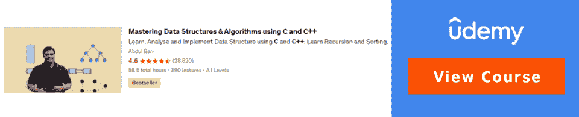
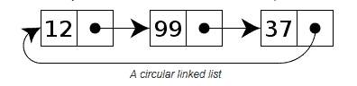

# Infosys 顶级面试问答[技术]

> 原文：<https://hackr.io/blog/infosys-interview-questions>

印孚瑟斯是一家面试官非常友好并尽力让你感到舒适的公司。在这个博客中，我们将讨论很多在个人面试(技术)中常见的问题，以及一些重要的人力资源问题。

人力资源问题非常重要，因为与许多其他公司不同，Infosys 在最后一轮人力资源面试后也会筛选至少 20-30%的候选人。我不会说破解印孚瑟斯面试很容易，但如果你练习得足够多，你就会很自信。自信肯定会在回答中表现出来——这是面试官期待的态度！

## **Infosys 面试中的热门问题**

印孚瑟斯技术面试不是纯粹的技术。他们更关注整体性格和行为方面——例如，你如何应对不同的情况(沟通)，你是否能够进行逻辑思考(推理)，你处理不同类型问题的方法(解决问题)和处理压力(对于有经验的人来说)是一些重要的因素。

典型的面试会以寒暄开始。这些可以是

*   你今天过得怎么样，或者到目前为止你过得怎么样？
*   说说你自己——以前的经历，任何具体的项目，等等
*   你如何度过周末——你的爱好、喜欢的食物、闲逛的地方等等…
*   你最喜欢的编程语言是什么？

即使你选择了一种特定的语言作为你的最爱，面试官也会围绕你在简历中提到的所有语言提出问题。只要你清楚这些基本知识，你就应该准备好了。

请注意，这份清单是根据许多采访整理的，所有这些问题都不是来自一次采访。以下是一些典型的 Infosys 面试问题

### **软件开发**

#### **问题:什么是 SDLC？**

**答:**软件开发生命周期(SDLC)是一个端到端的过程，它定义了从需求阶段到维护和支持阶段的项目开发流程。SDLC 中的阶段是需求分析、计划、定义、设计、开发、测试、部署和支持(维护)。

**阅读更多:** [有哪些不同的 SDLC 方法论？](https://hackr.io/blog/sdlc-methodologies)

#### **问题:你知道什么是瀑布模型吗？(有经验的考生)**

**答:**就像瀑布从上到下一样，这种方法将项目活动分解成不同的阶段。一旦一个阶段完成，序列中的下一个阶段就开始了。每个阶段都依赖于前一阶段的结果。

#### **问题:** **最流行的 SDLC 模型是哪一种？(有经验的考生)**

**回答:**其中一个就是瀑布模型。另一个是敏捷，现在越来越受欢迎，因为它的连续迭代方法在生产环境中不容易出错。

面试官可能会问你敏捷模型和瀑布模型之间的区别，在这里了解它们。

### **C & C++试题**

#### **问题:解释一下 C & C++的一些重要区别。**

**回答:**在面试中，将只检查您的基础知识和关键差异，例如

| **C** | **C++** |
| c 是一种过程语言，因此没有类、对象、继承、封装和多态的概念。 | C++是一种面向对象的语言。多态、封装和继承是 OOPS 的精髓。 |
| 动态内存分配是通过 malloc()和 calloc()函数完成的 | 使用“new”操作符完成内存分配。 |
| 任何其他函数都可以调用 Main 函数。 | 不能从任何其他函数调用 Main 函数。 |
| 没有运算符和函数重载 | 在 C++中很容易实现函数重载和运算符重载 |
| 您不能在 C 中运行 C++代码 | 您可以在 C++中运行大多数 C 代码 |
| 对于输入和输出，分别使用 scanf 和 printf 函数。 | Cin 和 cout 分别用于输入和输出。 |
| 不支持引用变量、虚函数和友元函数 | 这些都是完全支持的 |
| 不支持异常处理 | 完全支持异常处理 |

出于自己的好奇心，你可以阅读[这篇文章](https://hackr.io/blog/difference-between-c-and-cplusplus)来深入了解其中的差异。

[](https://click.linksynergy.com/deeplink?id=Qouy7GhEEFU&mid=39197&murl=https://www.udemy.com/course/datastructurescncpp/)

#### **问题:C++和 Java 有什么区别？你觉得哪个更好，为什么？**

**回答:**两者都是基于 [OOPS 概念](https://hackr.io/blog/oops-concepts-in-java-with-examples)。以下是基本区别——

| **C++** | **JAVA** |
| 平台相关语言 | 您可以编写代码并在任何地方运行它。Java 是独立于平台的。 |
| 用于系统编程，比如 OSs 是用 C++写的。 | 用于应用程序编程，如移动和基于 web 的应用程序。 |
| 支持按值传递和按引用传递 | 只能通过值传递变量 |
| 开发人员可以显式地为指针编写代码。 | Java 在内部使用指针。开发人员不能编写程序，也就是说，对指针的支持是有限的 |
| 支持运算符重载 | 不支持运算符重载 |
| 支持多重继承 | 不支持多重继承。(可以通过一个接口实现) |

当被问及你对哪个更好的看法时，没有对错之分。你可以说你喜欢 C++或者 [Java 多一点](https://click.linksynergy.com/deeplink?id=jU79Zysihs4&mid=39197&murl=https%3A%2F%2Fwww.udemy.com%2Fcourse%2Fmaster-practical-java-development%2F)。比如我不喜欢指针，Java 没有，我可以投 Java。另一方面，C++支持运算符重载和引用传递，而 Java 不支持，所以我可以因为这种灵活性而更喜欢 C++。这个问题只是为了测试你是否能分析和权衡每一个的利弊。

[](https://click.linksynergy.com/deeplink?id=Qouy7GhEEFU&mid=39197&murl=https://www.udemy.com/course/java-and-c-complete-training-course-2022/)

#### **问题:OOPS 概念是什么，在 C++中是如何实现的？**

**回答:** OOPS(或称面向对象编程)是一种编程方法学，在这种方法学中，应用程序的设计将一切都视为对象。它使编程变得容易。[主要的 oops 概念](https://hackr.io/blog/oops-concepts-in-java-with-examples)是

*   **类—**包含方法和变量。您可以通过创建类的对象来使用类。
*   **继承—**当有可以重用的公共属性时，我们可以创建一个父类。然后子类可以继承父类的公共方法和变量。一个很常见的例子就是动物类。如果狗和狮子是两种不同的动物，它们可以继承像 run()、eat()或 makeSound()这样的动物常用方法。狗和狮子的声音不一样，所以各有各的实现。
*   **多态性–**使用不同的实现重新定义某件事情的工作方式。使用重载和重写可以实现多态性。
*   **抽象–**对于复杂的实时程序，并不是所有的细节都需要显示给用户。通过抽象，我们可以将对象做什么和对象如何工作分开，只向用户显示“什么”。
*   **封装–**封装的概念是将数据和代码放在一个单元中，以向最终用户隐藏代码的内部工作原理。例如，一个类封装了几个成员变量和方法，这些变量和方法在类外部可能是不可访问的。

作为延伸，面试官可以要求你描述其中的每一个或任何一个。你可以解释一下基本概念。

#### 问:什么是结构，它们和类有什么不同？

**答案:** Struct 是一种自定义的数据类型，包含其他数据类型。举个例子，

```
struct Student {
int rollNumber;
char section;
void getName();
};

```

*   默认情况下，类的成员是私有的，要使变量成为公共的，我们需要添加 public 修饰符。在结构中，默认情况下成员是公共的，如果我们需要私有成员，我们必须使用修饰符。
*   类可以被继承，但结构不能。

#### **问题:什么是指针？举个例子。**

**答案:**指针是一个变量，存储另一个变量的地址。指针允许使用地址通过引用传递变量。例如–

```
int a = 23;
int *ptr = &a;
cout << ptr;

```

ptr 将存储 a 的地址，这意味着 a 的地址就是 ptr 的值。

```
0x6788f30 0x4563edd81x

```

当我们执行*ptr 时，我们将获得存储在 ptr 引用的地址中的值，即 23。*称为解引用运算符。

#### **问题:引用和指针有什么区别？**

**答案:**指针存储的是变量的地址，但引用只是变量的一个不同名称的副本。引用必须初始化，而指针不需要初始化。为了初始化指针，我们使用解引用操作符，

```
int a;
int *ptr = &a;
// We use the & reference operator to initialize reference variable.
int a = 20;
int &ref = a;

```

在上面的例子中，ptr 存储 a 的地址，ref 存储 a 的值(20)。通过[这篇](https://hackr.io/blog/pass-by-reference-vs-pass-by-pointer)详细的文章了解更多关于引用和指针的信息。

#### **问题:C/C++中动态内存分配是如何做到的？**

**答案:**这个答案我们已经在问题 4(对比)中涉及到了。

#### **问题:什么是虚函数？**

**回答:**假设有一类客户。它有一个标记为虚拟的函数 SendEmail()。现在，任何从 Customer 派生的类都必须有自己的 SendEmail()函数实现。假设 PrivilegedCustomer 类是从 Customer 派生出来的。PrivilegedCustomer 应该覆盖函数 SendEmail()以提供自己的实现。

因此，虚函数是必须被覆盖的函数，并确保调用正确的方法。

#### **问题:给出 C++中数据结构的例子。**

**答案:**c++中有两种类型的数据结构？线性和非线性。

*   **线性—**数据元素按顺序存储。例如，堆栈、队列和链表。
*   **非线性—**不以顺序方式存储的树和图。

#### 问题:告诉我使用 C++的一个缺点。

**回答:**没有内置对线程的支持。如果他们问多了，你可以说不支持垃圾回收。

#### **问题:什么是友元函数/类？**

**答案:**

*   **友元函数–**如果一个函数被标记为某个特定类的“友元”,它可以访问该类的受保护成员和私有成员。
*   **友元类–**与函数相同，如果一个类被标记为另一个类的友元，它可以访问该类的受保护成员和私有成员。

示例–

```
class Student {
private: int roll;
public: friend class Teacher;
};
Class Teacher{
private: float marks;
public: void getRollNumber(Student& stud){
cout << stud.roll;
}
};

```

更多 C++查看问题[查看此处](https://hackr.io/blog/cpp-interview-questions)。

### **常见 Java 问题**

#### **问题:多态在 Java 中是如何实现的？**

**答:**方法重载还是静态多态

这意味着同名的方法可以有不同数量的参数。根据参数列表，将调用适当的方法。举个例子，

**方法重载**

```
print(String name){
//code
}
print(int marks, String name){
//code
}
print(String[] subjects, String name){
//code
}
// in the main program,
if(subjects.length >0){
print(String[] subjects, String name);
}else if(marks>0){
print(int marks, String name);
}else
print(String name);

```

**覆盖或动态多态**

当子类扩展父类时就是这种情况。在运行时创建对象时，将创建适当的方法。你可以举一个流行的披萨店的例子

```
class PizzaShop{
void prepareDough(){
System.out.println(“Pizza shop fresh dough ready!”);
}
}
class IndianPizzaShop extends PizzaShop{
void prepareDough(){
System.out.println(“Welcome to IndianPizza, fresh dough is ready!”);
}
}
In the main class,
public static void main(String[] args) {
PizzaShop pizza = new IndianPizzaShop();
pizza.prepareDough();
}

```

输出将是-欢迎来到 IndianPizza，新鲜的面团准备好了！

这意味着 prepareDough()方法在运行时被子类 IndianPizzaShop 覆盖。

#### **问题:[栈和](https://hackr.io/blog/stack-vs-heap)堆内存有什么区别？**

**答案:**

**堆—**

*   JRE 用它来为对象和 JRE 类分配内存。
*   垃圾收集是在堆内存上完成的
*   在堆上创建的对象是全局可访问的。

**堆栈—**

*   短期引用，如当前执行的线程
*   对堆对象的引用存储在堆栈中
*   当一个方法被调用时，一个新的内存块被创建。一旦执行了这个方法，下一个程序就会使用这个块。

与堆内存相比，堆栈内存较小。

#### 问题:写一个程序来检查一个数是否是质数。

**回答:**传数让我们说 int 数= 47；

```
// set default to not prime
boolean flag = false;
// prime numbers are divisible only by themselves and 1
for(int i = 2; i <= number/2; ++i)
{
// if no remainder
if(number % i == 0)
{
// number is divisible by i, so it is not prime.
flag = true;
// break the loop if the number is not prime
break;
}
}
// if flag is not equal to true
if (!flag)
System.out.println(number + " is prime.");
else
System.out.println(number + " is not prime.");

```

#### **问题:解释继承的概念。**

**答:**继承是一个子类可以访问基类的方法的概念。继承可以通过扩展父类或使用接口来实现。

```
class A{}
class B extends A{}
interface C{}
class D extends A implements C{}

```

#### **问题:C++和 Java 是如何进行异常处理的？**

**回答:** C++和 Java 使用 try/catch 和 throw 关键字处理异常。然而，

*   在 Java 中，只有 Throwable 的实例或 Throwable 的子类可以作为异常抛出。在 C++中，即使是基本类型和指针也允许作为异常抛出。
*   Java 有 finally 块，它在 try-catch 块之后执行。这个块用于执行一些代码，而不管代码中发生了什么(清理、清除变量等)。C++里没有这个规定。
*   为了列出一个方法可以抛出的异常集，Java 使用' throw **s** '关键字，而在 C++中，throw 完成这项工作。
*   在 C++中，所有的异常都是未检查的。Java 可以检查和不检查异常。

#### 问:什么是“null ”,如何为 null 对象分配内存？

**答案:**当一个非本原变量不指向也不引用任何对象时，称为 null。

*   String str = null//声明 null
*   if(str = = null)//确定值是否为 null
*   int length = str . length()；//使用空值将引发 NullPointerException

#### **问题:数组和 ArrayList 有什么区别？**

**答案:**

*   数组的长度是固定的，而 ArrayList 的大小可以随着元素的增加而动态增长。
*   ArrayList 不存储基元。如果我们必须存储 int 元素，那么每个元素都应该被包装成 Integer 对象存储在 ArrayList 中。数组就不是这样了。

#### 问题:你能写一个程序来交换两个数吗？

**答案:**

```
int temp = 0;
temp = number1;
number1 = number2;
number2 = temp;

```

#### **问题:现在不使用临时变量写同样的(上图)程序。可能吗？**

**答案:**

假设数字 1 = 10，数字 2 = 20；

```
number1 = number1 + number2; // number1 is now 30
number2 = number1 - number2; // number2 is now 10(number1)
number1 = number1 - number2; // number1 is now 20(number2)

```

#### **问题:什么是循环链表？**

**答案:**循环链表是每个节点链接到下一个，最后一个(尾)链接到第一个(头)的链表，完成一个循环。



图片来源:[维基百科](https://en.wikipedia.org/wiki/Linked_list)

#### **问题:Java 中有哪些不同的修饰符？**

**答案:** public、private、protected、default 是 Java 中的修饰语。

#### **问题:什么是类？如何创建一个对象？如果一个类是静态的，你能创建一个对象吗？**

**答:**类封装了不同类型和方法的变量，可以组合在一起。

例如，

Class Student 可以拥有与学生相关的所有变量和方法，如姓名、编号、分数、选择的科目等。当应用程序需要学生的详细信息时，可以创建这个类的对象来获取学生的所有详细信息。

```
Student student1 = new Student();

```

在 java 中，只有嵌套类是静态的。顶级(外部)类不能是静态的。

```
public class Outer {
public static class Nested {
}
}

```

是的，静态类的对象可以直接在另一个类中创建，而不需要创建外部类的实例。

```
public class Test {
Outer.Nested obj = new Outer.Nested();
}

```

#### **问题:Java 中有哪些不同类型的循环？**

**回答:** For 循环，While 循环，do while 循环。

### **常见数据库(SQL)面试问题**

#### **问题:什么是数据库模式？**

**答案:** Schema 是整个数据库的逻辑表示或结构。它定义了数据在数据库中是如何组织、关联和存储的。

#### **问题:什么是 RDBMS？**

**答:**关系数据库管理系统(RDBMS)是一组帮助开发人员与数据库进行交互以创建、更新或删除数据的程序。这是通过查询(SQL)完成的。例如，每个数据元素可以是表中的一行。

#### **问题:唯一键、外键和主键有什么区别？**

**答案:**

**主键—**标识表格中的每一行。例如，在学生表中，student_id 可以是用于访问学生详细信息的主键。对于不同的学生，student_id 总是不同的。不能为空。

**唯一键–**一个或多个字段的集合，共同标识数据库记录。这不应该包括主键。唯一键可以有一个空值。例如，student_name 和 batch_number 可共同用于识别最近 3 年的尖子生。

**外键–**引用另一个表的列以建立两个表之间关系的列。大多数情况下，一个表中的主键是另一个表中的外键。例如，book 表可以将 student_id 作为外键，用于确定学生所带书籍的详细信息。

#### **问题:什么是聚集索引？**

**答:**索引是用来加快查询时间以提高性能的。可以把它想象成一本书的索引，它可以让你很容易地浏览到特定的页面或章节。聚集索引维护表中数据的物理顺序。例如，如果在 student 表的 student_id 列上创建了聚集索引，则 student_id 为 5 的学生将存储在第 5 行，id 为 10 的学生将存储在第 10 行，而不考虑数据的插入顺序。

#### **问题:什么是 SQL 连接？如何使用它们从多个表中获取数据？**

**答:**连接用于使用相关表的主键和外键从多个表中获得结果。示例–

| 表格–学生 | 桌上书籍 |
| 学生标识(主键) | book_id(主键) |
| 学生姓名 | 图书 _ 标题 |
| 学生 _ 批次 | 学生标识(外键) |
| 学生 _ 部门 | 图书 _ 作者 |

现在，要获得学生所带书籍的名称，我们可以简单地编写一个查询——

select student.student_name，student.student_batch，book.book_title，book.book_author from student，book where student . student _ id = book . student _ id；

结果将会是

| 学生姓名 | 学生 _ 批次 | 图书 _ 标题 | 图书 _ 作者 |
| 卡兰 | 2008 | 面向初学者的 C++ | Yashwant Kanetkar |
| 卡兰 | 2008 | 傻瓜 Java | 凯西·塞拉 |

#### **问题:什么是 SQL 触发器？**

**答:**触发器是[存储过程](https://hackr.io/blog/stored-procedures)，当数据库中某个特定表上发生插入、更新或删除等事件时，就会调用这些过程。

更多 SQL 面试问题，请阅读[这篇博文](https://hackr.io/blog/top-sql-interview-questions)。

### **常见的 HTML 面试问题**

#### **问题:HTML 的完整形式是什么？**

**答案:**超文本标记语言。

**答案:** ，-主要内容

#### **问题:什么是框架？**

**答案:**框架可以将 html 页面分割成单独的窗口。每个框架都是使用“src”属性加载的不同 html 文档。

### **针对新生的人力资源问题**

#### 问题:说说你自己吧。

**回答:**可以从你的姓名，学历，以前的经历(如果有的话)开始

#### **问题:简历中的一些问题——关于项目、以前的项目等…**

**回答:**带着兴趣给出更多细节，回答后续问题，如果有的话。

#### 问题:你在团队/项目中遇到的最大挑战是什么？

**回答:**这可能是你搁置了几天的代码问题之类的个别问题，也可能是某个项目获得批准之类的外部问题。

#### 问题:你的优势和劣势是什么？

**回答:**要诚实。请举例说明你是如何证明上述优点或缺点的，以支持你的答案。比如“我不能切换到另一个任务，除非我完成了当前的任务。我在之前的项目中体验过。”

#### **问题:你为什么认为印孚瑟斯是你职业生涯的好选择？**

**回答:**这个比较棘手。作为一名新生，你的第一想法会是取消任何能给你带来工作的面试。对于这个问题，你得做点功课。浏览印孚瑟斯的网站，了解他们的工作，找出你的职业目标与他们的愿景是如何匹配的，并就此展开讨论。告诉他们在为公司提供最佳服务的同时，你如何在公司中成长。

#### 问题:你对印孚瑟斯了解多少？

**回答:**同样，你应该访问印孚瑟斯，了解他们的创始人、首席执行官、工作文化、基础设施、培训校园和其他吸引你参加这次面试的有趣信息。

#### 问题:你的长期职业目标是什么？

**回答:**谈谈你对自己未来 5 年或 10 年的看法。这可能很简单，比如买一栋新房子，或者把自己看成是荷兰的项目负责人。这有助于面试官了解你的个人抱负。

#### 问题:我们为什么要雇用你？

**回答:**你可以说说你能给公司带来的价值，以及你所拥有的能帮助公司成长的品质。例如，你从一个更大的角度来看待一个项目——它将如何影响业务，任何改变如何为客户带来更多成功等等。

不要只是说你是一个团队成员或聪明的员工。说一些你独有的东西。

### **针对有经验候选人的人力资源问题**

以下一组问题也可以在技术回合中提出。在这种情况下，你将不会有一个单独的人力资源轮，当你遇到人力资源，他会直接问你对工资的期望和其他一般的东西。这些问题都是主观的，没有对错之分。

每个人处理别人的方式都不一样。这里的主要测试是沟通技巧——你解决问题的透明度和公开程度如何。你会安排一次会面，用事实冷静地解释你的观点，还是只会生闷气，抱怨？当你遇到困难或因为想自己做所有的事情而变得焦躁不安时，你会寻求帮助吗？这些都是个人观点，你必须建立自己的答案，因为这将是你个性的展示。

1.  如果你和你的直属经理有不同意见，你将如何向他解释你的观点？
2.  如果你必须改变过去的一件事，那会是什么？
3.  如果你和你的团队成员之间有冲突，你将如何友好地解决它？
4.  你解决了向你汇报的两个团队成员之间的分歧了吗？你将来会怎么做？
5.  你以前处理过什么团队吗？你会如何激励你的员工？
6.  假设您的经理给了您一项高优先级任务，您的现场协调员打电话给您，说他需要紧急完成一项任务，而您的团队成员正面临一个需要您立即关注的关键问题。你会怎么做？

结局好的一切都好…

除此之外，还会问一些关于你期望的薪水、工作时间、灵活性、地点和个人简介的一般性问题。HR 也会告诉你公司的成长，未来的计划，以及整体的工作文化。自信地去做，积极地去想，诚实地去做。你能破解它！

想多准备点吗？这里有一本破解任何[编程面试](https://hackr.io/blog/programming-interview-questions) : [破解编码面试:189 道编程题及解答](https://geni.us/MmRP)的最佳书籍。

**人也在读:**