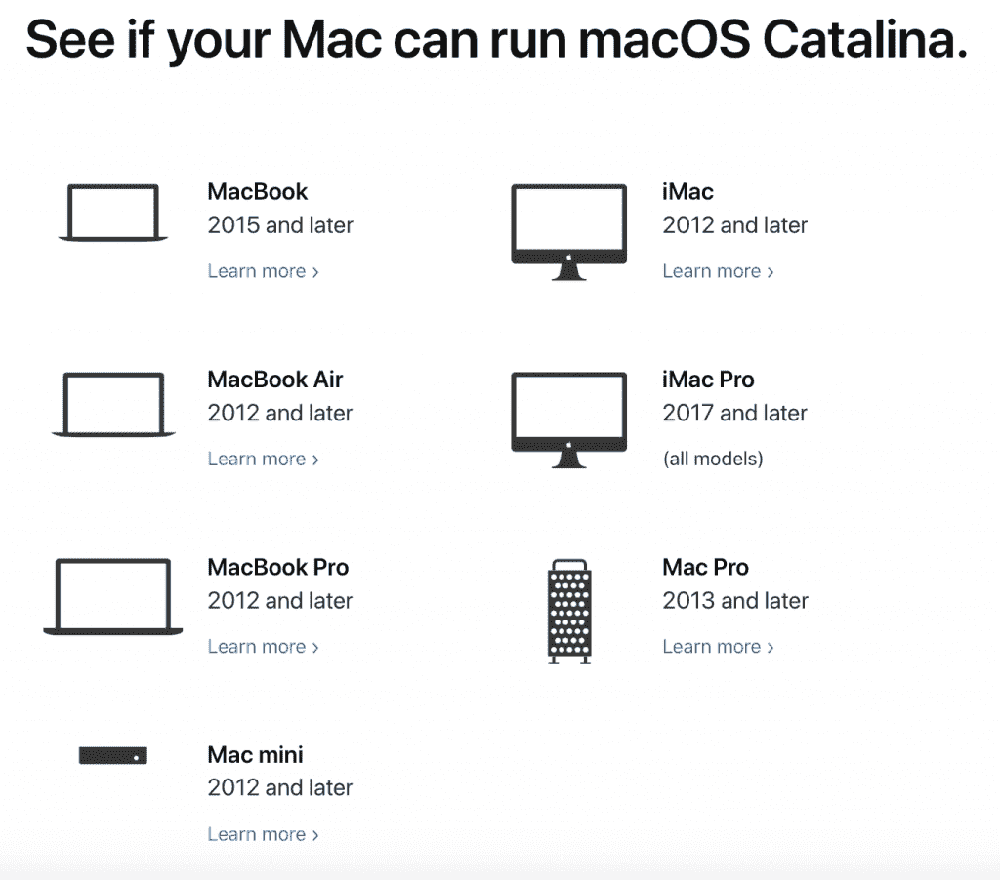
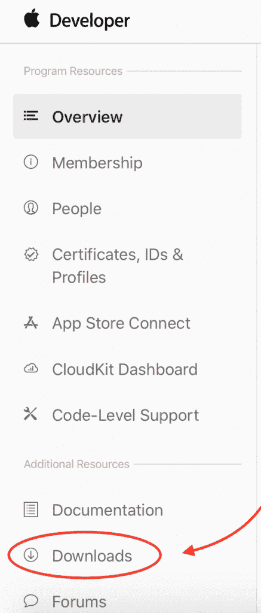
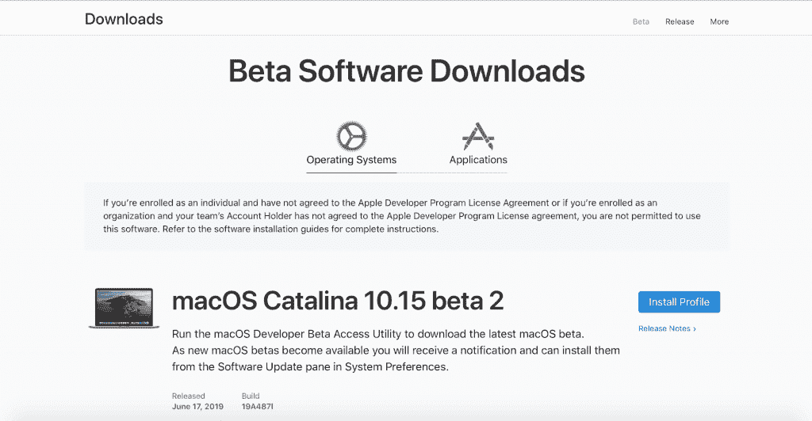
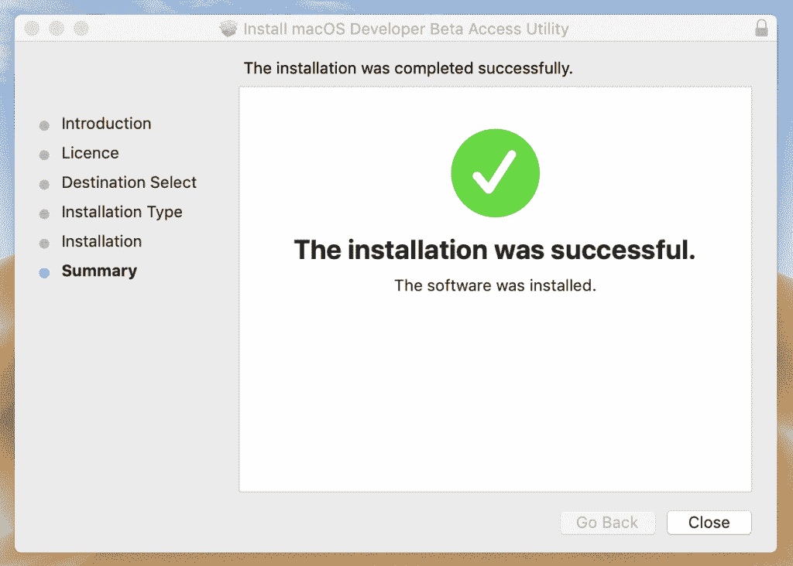
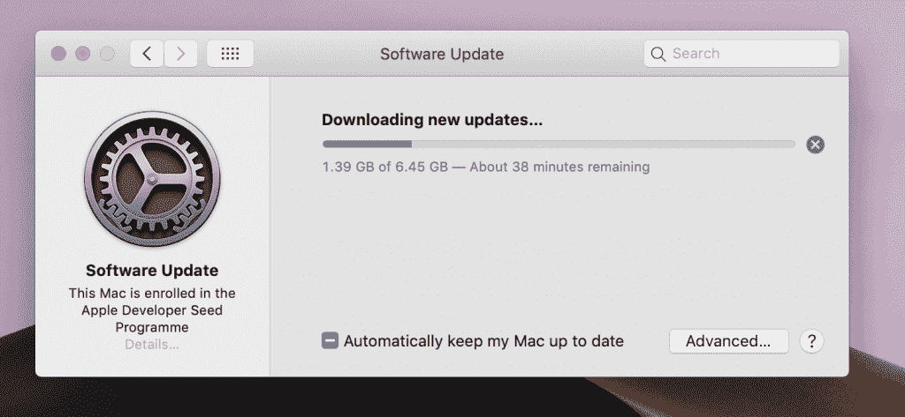
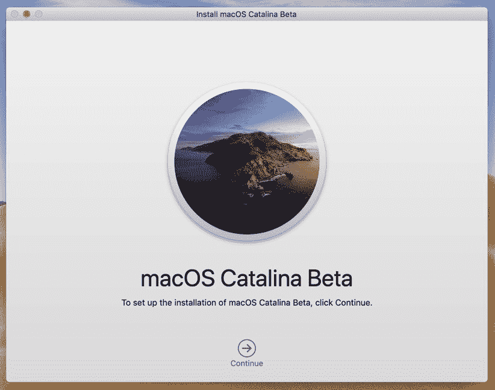

# 如何安装 macOS 10.15 Catalina 公测版

> 原文：<https://hackr.io/blog/install-macos-catalina-10-15-beta>

今年最受期待和最大的活动 WWDC19 展示了一些令人敬畏的技术和高端硬件。所有这些很酷的功能都出来了，你可以马上尝试一下。继 macOS Mojave 之后，6 月 3 日在 WWDC19 上，苹果宣布了新的 macOS - Catalina 10.15。安装并探索 Catalina 的所有新功能。 *走吧！*

## **MAC OS Catalina 10.15 有什么新功能？**

根据苹果在 WWDC19 上的主题演讲，macOS Catalina 是 *世界上最先进的桌面操作系统。* 除了 Mojave 10.14(最新稳定版)的所有炫酷特性，macOS Catalina 还包含:

1.  全新的 **iT** **unes** 其中包括邮件、日历和 Safari，并带有一个可以切换的 dock。
2.  全新 **Apple Music** app，个性化推荐您喜欢的音乐
3.  所有新的专用 **播客** 应用程序，同样带有个性化推荐和 ML 收录搜索。
4.  全新的 **苹果电视** 应用程序，支持 Mac 上的 4K HDR 10 以及杜比视觉全景声
5.  改进的 **媒体同步**——Apple TV、Apple Music 和 Apple Podcasts，三者可以完全无缝地同步所有苹果设备上的内容。
6.  **边车**——现在把你的 iPad 当作你的 mac 的第二台显示器。 *太酷了。*
7.  新增辅助功能， **语音控制，** 只需语音就能控制整台 mac。
8.  **屏幕时间** 。现在，您可以通过应用程序的使用来监控您的屏幕时间。
9.  大规模升级到 **照片应用** ，将显示您的记忆和照片，并自动隐藏重复的照片。除此之外，它现在还有一个功能，可以智能地展示您的最佳照片。
10.  Notes 应用程序、提醒应用程序、Safari 和 Mail 中的设计和功能升级。
11.  macOS 安全可靠。它运行在一个专用的只读系统卷上，与您的所有数据完全分离。
12.  **激活锁** -现在你可以像在 iPhone 和 iPad 上一样删除和重新激活你的数据。激活锁支持适用于所有采用 T2 安全芯片的新款 Mac 电脑
13.  **查找我的设备-** 查找你所有的苹果设备，即使它们处于离线状态。 *Whaaatt？是啊！*
14.  Project Catalyst——有了它，开发者可以轻松地将 iPad 应用发布到他们运行 Catalina 的 MAC 电脑上。

您可以在这里查看新特性的所有细节。

## **1。安装 macOS Catalina**

要在 Mac 上安装 macOS Catalina，请遵循以下步骤:

### 检查你的 Mac 是否能运行新的 macOS Catalina。

### 2。你需要一个开发者账户。 [登录或购买一个](https://developer.apple.com/)

### 3。登录后，点击下载

### 4。单击右侧的安装配置文件按钮。

### 

### 5。下载并运行 DMG 文件，然后按照向导中的步骤进行操作。

### 

### 6。你将能够在你的应用商店中看到新的 macOS Catalina 更新。

### 8。点击 **立即升级** 大功告成

## **结论**

现在，您的 Mac 已经加载了全新的 macOS Catalina 10.15 的所有功能。现在你也可以安装 Xcode 11 (How-to guide 即将推出！)，并为 iOS 13、iPadOS 和 watchOS 6 开发应用。此外，如果你是这个应用程序开发世界的新手，并且对制作 iOS 应用程序感兴趣，Hackr.io 上有一些 [令人敬畏的 Swift 课程](https://hackr.io/tutorials/learn-ios-swift?ref=blog-post)

去学习和编码吧。 *干杯！！*