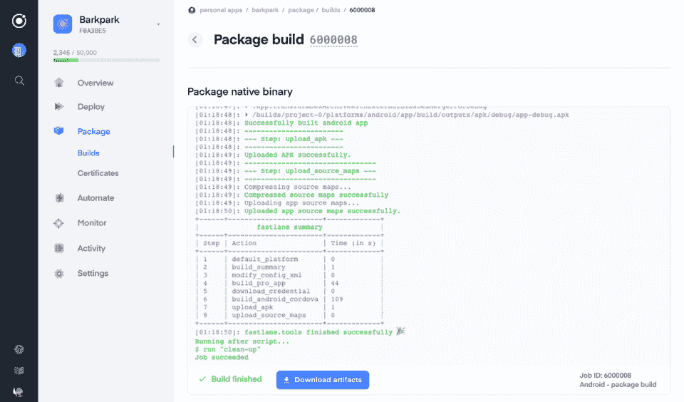
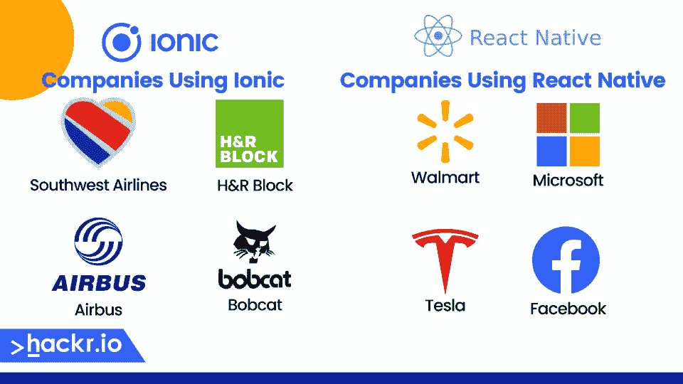

# Ionic vs React Native:势均力敌的比较[2023]

> 原文：<https://hackr.io/blog/ionic-vs-react-native>

您是一名对创建漂亮的、以 UI 为中心的 web 应用程序感兴趣的开发人员。但是你很难在 React Native 和 Ionic Framework 之间做出选择。哪一个是更好的解决方案:离子与自然反应？

今天，我们将向您全面介绍 Ionic 框架与 React Native，包括 Ionic 2 与 React Native 的性能、通用性、语言和整体适用性。

最后，您将理解两者之间的关键差异，以及为什么一个可能比另一个更适合您的项目。



## **什么是离子？【定义】**

Ionic 是一个面向混合移动应用的基于组件的 web 应用框架。本质上，Ionic 开发了一个 web 应用程序，它也可以作为本地应用程序运行。

通过利用 web 组件，Ionic 可以创建跨平台的应用程序——可以移植到 iOS、Android 和 Windows 的应用程序。Ionic 创建了移动、桌面和渐进式 web 应用程序(pwa ),每一个都基于 CSS、HTML5 和 SaSS 的 web 开发。

Ionic 利用基于网络的技术；然而，它仍然是一个框架，这意味着它有自己建模视图的方式。例如，在爱奥尼亚语中，“你好，世界”应该是这样的:

```
<ion-content class="home">
<ion-card>
<ion-card-content>
Hello,World!
</ion-card-content>
</ion-card>
</ion-content>​
```

了解 XML 的开发人员可能会注意到这是一个经典的“标记语言”风格的框架，而不是类似于 [JavaScript](https://hackr.io/blog/how-to-learn-javascript) 的东西。

| **优点** | **缺点** |
| 对 web 开发人员来说很容易

*   完全跨平台
*   广泛的应用
*   无法使用本机功能

 | **什么是 Web App vs Native App？**

*   web 应用程序使用 web 浏览器(或类似的东西)作为编译器，是代码和执行之间的一层。网络应用依赖于浏览器和浏览器标准，而本地应用直接在设备上执行。

 |

### 通知是一个完美的例子。一个本地移动应用程序全天发送通知。直到最近，web 和渐进式 web 应用程序(具有一些原生功能的 web 应用程序，如 Ionic web 应用程序)感觉很像移动应用程序，但如果不能访问设备的通知层，它们就不能向你发送通知。如今，原生应用可以发送通知，但仍然需要通过浏览器来完成。

在许多方面，Ionic 或 web 应用程序看起来像 React 原生应用程序。区别类似于通过你的浏览器启动一个基于云的应用，从你的桌面启动一个桌面应用；它与应用程序是如何开发的、它在哪里以及它可以访问的系统功能有关。

当谈到 Ionic React 本地比较时，两者都不一定更好或更差；相反，它们最适合特定的应用。PWA 的优势在于，您实际上可以为您的网站和移动应用程序保留相同的代码库，从而大大降低多渠道系统的复杂性。

但是，当然，原生应用的优势是你可以使用原生的*特性*。

此外，您可以在设备上安装本地应用程序。React Native 应用程序将“生活”在用户的设备上，并提醒他们使用该应用程序，而你不能安装 PWA 或 Ionic 应用程序。

**什么是 React Native？【定义】**

与 Ionic 相比，React Native 是一个更传统的移动开发框架。React Native 内置于 JavaScript 中，是一个基于组件的框架，用于创建本地移动应用程序。JavaScript 开发人员可以使用 React Native 快速创建美观、功能强大的 ui。这些应用程序可以在 iOS、Android 或移动设备上运行，因为 JavaScript 是一个跨平台的解决方案。

## 以下是你如何创建一个“你好，世界！”React 本机中的程序:

因此，您决定选择 Ionic 还是 React 的主要原因在于您是否需要一个本机应用程序。React Native 为跨平台的原生应用开发提供了一个完整的框架，但是你不能同样使用网站的代码库(至少，不是没有大量的工作)。

**优点**

```
const HelloWorld = () => {
return (
<View>
<Text>Hello, World!</Text>
</View>
)
}​
```

**缺点**

| 对 JavaScript 开发人员来说很容易 | 跨平台解决方案 |
| 完全本土的

*   从网站中分离出来
*   不适用于渐进式网络应用
*   **想建一个 Web App？**

 | React Native 是在 [React](https://hackr.io/blog/react-vs-react-native) 之上设计的。React 实际上是基于组件的 web 应用程序库。您可以使用 React 开发 web 应用程序、渐进式 web 应用程序以及移动站点。

*   React Native 专门用于创建*原生*应用。
*   [](https://imp.i384100.net/n1zBzx)

 |

### 【Ionic 和 React Native 有什么区别？

Web 开发人员使用 Ionic 来创建 web 应用程序，甚至是像本地移动应用程序一样的 web 应用程序。React Native 用于创建本地移动应用程序(安装在设备上的应用程序)。

**使用离子的公司**

**使用 React Native 的公司**

## 西南航空公司

H&R 街区

| 空中巴士 | 山猫 |
|  | 各大公司使用 React Native 开发移动应用。但是，从小型企业到大型企业，都有很多人使用 Ionic 来开发渐进式网络应用。

*   
*   **有多少人使用离子反应土人？**
*   Ionic React vs React Native 的实际受欢迎程度如何？根据 AppBrain 的数据，Ionic 用于 [3.62%的应用](http://appbrain.com/stats/libraries/details/ionic/ionic-framework)。相比之下， [4.81%的 app](https://www.appbrain.com/stats/libraries/details/react_native/react-native)使用 React Native。所以受欢迎程度是相似的，但是 Ionic 正在减少，而 React Native 正在快速增加。
*   **离子与反应原生:势均力敌的比较**

 |

参数

**离子型**

## **反应原生**

**发达**

## 2012

| 2019 | **平台** | 跨平台 |
| 跨平台 | **应用类型** | 网络应用 |
| 移动本地应用 | **人气** | 温和的 |
| 温和的 | **难度** | 容易的 |
| 挑战性的 | **语言** | HTML，CSS |
| Java Script 语言 | Ionic vs React Native:哪个更容易？ | 对于简单的 web 应用程序，Ionic 可能更容易。它使用 HTML 和 CSS 等基础标记技术，尽管您需要了解 JavaScript、Python、 [PHP](https://hackr.io/blog/what-is-php) 或其他后端编程语言来开发更复杂的应用程序。 |
| 对于一个更健壮的 web 应用程序，学习 Ionic 和 React Native 可能同样具有挑战性。React 原生框架运行在 JavaScript 上，这需要你同时学习框架*和* JavaScript 语言。 | **哪个更快？** | Ionic 和 React Native 都是实时解释而不是编译的。这两个平台都强调闪电般的开发和部署，而不是性能、可伸缩性或处理。性能在很大程度上取决于应用程序和开发人员在性能优化上花费的时间。 |

### 与 React Native 相比，Ionic 的开箱重量更轻。因此，如果两个应用都相对简单的话，Ionic 网站可能会比 React 本地应用运行得更快。然而，你越是开发 Ionic 网站或 React 本地应用，就越有可能发现性能下降。

**哪个更百搭？**

Ionic 可以创建 web 应用和渐进式 web 应用。React Native 创建原生应用程序，但是如果你知道 React Native，你也知道 React——你可以将它用于 web 应用程序和渐进式 web 应用程序。因此，React Native 更加通用。

### 不仅如此，React Native 还有一个更大、更活跃的社区。这为网络、工具和资源打开了许多大门。

哪个能创造更好的应用？

假设你只想创建一个伟大的应用程序。你应该用离子型的还是反应型的？

### 只要你有足够的时间，这两个平台都可以帮助你创建类似的应用。Ionic 将帮助您更快地部署应用程序，但 React Native 使创建更强大的交互式应用程序更容易。

如果您主要关心代码质量，那么 React Native 可能是更好的选择。但是如果你是一个开发新手或者想快速创建一个简单的应用程序，Ionic 的简单性会带来更好的结果。

哪个工资高？

### ZipRecruiter 报告称 Ionic 开发人员的平均工资为 124，960 美元。相比之下，React 本地开发人员的平均工资是 [$129，059](https://www.ziprecruiter.com/Salaries/React-Native-Salary)——非常相似。


然而，对于职位空缺来说，情况有所不同。截至 2023 年 8 月，React Native development 大约有 42，700 个职位列表。然而，对于 Ionic 开发人员来说，目前在 ZipRecruiter 上只有 145 个职位。

作为一名 Ionic 开发者，你可以赚很多钱，但是机会却少得多。

### **离子和反应原生的替代品**

假设您想开发一个渐进式 web 应用程序，但不想使用 Ionic。您可以使用几种流行的替代方法，如:

[反应](http://reactjs.org)。React Native 只是 React 的原生移动开发分支。您可以[使用 React](https://hackr.io/tutorials/learn-react) 开发使用健壮的 JavaScript 库的渐进式和常规的 web 应用程序。

[颤振](http://flutter.dev)。Flutter 是 Google 对跨平台 web 应用开发的回答。Flutter 使用编程语言 Dart 来创建可在移动设备上使用的交互式轻量级 web 应用程序。

[科尔多瓦](http://cordova.apache.org)。作为一个 Apache 框架，Cordova 使用 HTML、CSS 和 JavaScript 来创建 web 应用程序和 pwa。科尔多瓦和爱奥尼亚很像，甚至有稍微强一点的社区。

## 另一方面，您可能希望创建一个本地移动应用程序。React Native 也有一些备受瞩目的替代产品:

[SwiftUI](https://developer.apple.com/xcode/swiftui/) 。对于 iOS 开发，没有比去源代码更好的解决方案了。SwiftUI 是一个基于专有 Swift 语言构建的 UI 套件，两者都旨在用于 iOS 上的原生移动应用程序开发。

*   [Xamarin](https://dotnet.microsoft.com/en-us/apps/xamarin) 。Xamarin 是微软创建的跨平台移动应用程序开发解决方案，它使用 C#和。NET 框架在 Windows、iOS 和 Android 上创建本地应用程序。
*   [NativeScript](https://nativescript.org/) 。与 React Native 类似，NativeScript 使用 JavaScript 在 Windows、iOS 和 Android 上进行跨平台开发。React Native 更受欢迎，但许多人认为 NativeScript 给了他们更多的灵活性和控制力。
*   所有这些开发工具包、UI 工具包和框架将使创建原生移动应用程序变得更加容易，尽管并非所有这些都是跨平台的。

[为 WooCommerce 开发 Ionic 4 Angular iOS Android 应用](https://click.linksynergy.com/link?id=jU79Zysihs4&offerid=1045023.2654110&type=2&murl=https%3A%2F%2Fwww.udemy.com%2Fcourse%2Fdevelop-ionic-4-angular-ios-android-apps-for-woocommerce%2F)

*   **结论**
*   在选择 Ionic 还是 React Native 之前，请仔细考虑渐进式 web 应用程序/web 应用程序和原生移动应用程序之间的差异。
*   渐进式网络应用程序是通过一个带有一些本地移动功能的浏览器来访问的。你可以将它们作为快捷方式“安装”在设备上，但与原生移动应用的方式不同。

本地 web 应用程序是直接安装在设备上的 web 应用程序，可以访问所有本地移动功能(具有适当的权限)。它们安装在用户的设备上，并在该设备上运行。

你应该[学习离子](https://hackr.io/tutorials/learn-ionic)如果:

## 你对创建公共福利机构感兴趣。

不需要依赖任何原生的移动功能。

你希望在网站和手机之间保持一个单一的代码库。

如果出现以下情况，您应该[学习 React Native](https://hackr.io/tutorials/learn-react-native) :

你想创建一个本地移动应用。

*   你需要原生的移动功能，比如 Google Lens。
*   你不需要在手机应用程序旁边开发一个网站。
*   这两种解决方案都有很好的理由。作为一名开发人员，您甚至可能想两者都学。任何对 HTML、CSS 和 JavaScript 有扎实理解的人都可以使用 Ionic 的框架。另一方面，React Native 需要深入了解 JavaScript——因此，这实际上是了解每个框架的约定。

您已经熟悉了 React Native 和 Ionic，但是在开始您的移动应用程序开发生涯之前，您还需要学习更多内容。

*   [利用 Divjoy React Codebase & UI 生成器](https://appsumo.8odi.net/doxOb7) 节省 UI、auth、数据库等时间
*   **人也在读:**
*   **常见问题解答**

**1。离子型和反应型哪个好？**

两者都有助于创建健壮的应用程序。不过 Ionic 更适合 web 应用，React Native 更适合原生应用。

**2。为什么选择 React Native 而不是 Ionic？**

出于几个原因，您可以选择 React Native 而不是 Ionic。首先，你的应用可能需要原生的移动特性。如果这是真的，你需要反应自然。第二，你可能希望用户付费安装你的移动应用——如果是这样，你应该在 React Native 里把它开发成一个原生应用。最后，你可能想要重度交互性(比如一个游戏)。虽然您可以在 Ionic 中做到这一点，但在 React Native 中更容易。

## **3。2023 年爱奥尼亚还相关吗？**

#### 离子液体仍然绝对相关，并且在 2023 年仍在使用，但它的受欢迎程度正在下降。移动应用的开发正在蓬勃发展，但是掌上电脑和其他网络应用并没有被如此频繁地使用。

**4。Airbnb 为什么已经停止使用 React Native 了？**

#### 您可能听说过 React Native 最适合小型、简单的应用程序。这可能会令人困惑，因为这是脸书首先开发的。但现实情况是，React Native 仍然是一个跨平台开发的开发框架。对于非常广泛的应用，在平台本身(如 Windows、Android 或 iOS)进行原生开发可能更容易。

You could choose React Native over Ionic for a few reasons. First, you may need native mobile features for your app. If that’s true, you need React Native. Second, you may want users to pay for and install your mobile application—if so, you should develop it as a native application in React Native. Finally, you may want heavy interactivity (such as a game). While you can do this in Ionic, it’s easier in React Native.

#### **3\. Is Ionic Still Relevant in 2023?**

Ionic is absolutely still relevant and still used in 2023, but its popularity is waning. Mobile app development is booming, but PWAs and other web applications aren’t being used as frequently. 

#### **4\. Why Has Airbnb Stopped using React Native?**

You may have heard React Native is best for small, simple applications. That can be confusing, given Facebook first developed it. But the reality is that React Native is still a development framework for cross-platform development. For very extensive applications, it may be easier to develop natively in the platform itself (such as Windows, Android, or iOS).