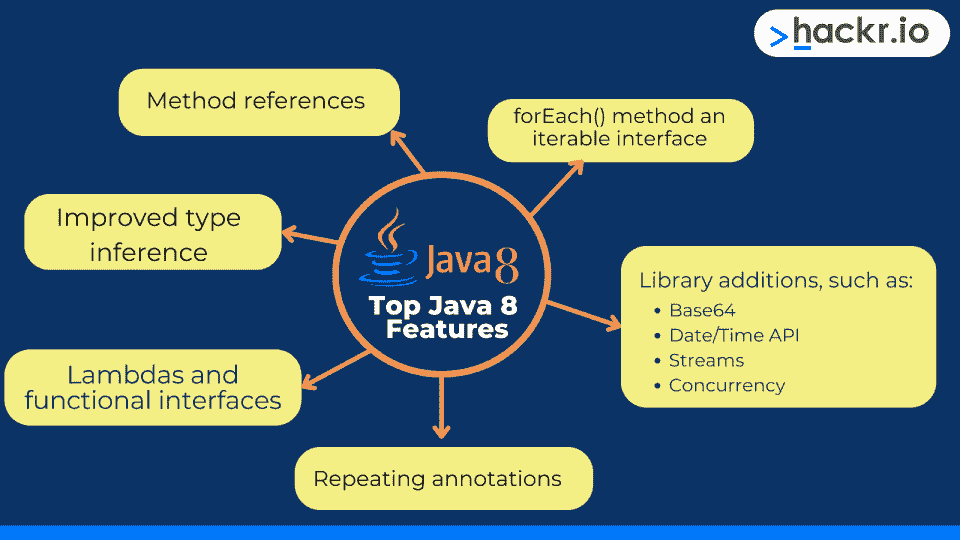

# 你需要知道的 Java 8 的主要特性(附例子)[2023]

> 原文：<https://hackr.io/blog/java-8-features>

Java 8 是较老的 Java 版本，发布于 2014 年 3 月。但是许多程序员认为 Java 8 是使用最广泛的 Java 版本之一。事实上，它非常受欢迎，Oracle 将其支持延长至 2030 年。另外，组织继续发布 Java 8 课程和 T2 书籍。

Java 8 受欢迎有几个原因。首先，它是在与新版本略有不同的许可下发布的。此外，它还有许多新的有用的功能。探索它们的最佳方式是用 [Java 项目](https://hackr.io/blog/java-projects)进行实践。但是如果您想快速浏览 Java 8 的主要特性，我们可以满足您的需求。

今天，我们将介绍一些最重要的 Java 8 特性，以及它们为什么重要。

## Java 8 有什么变化？

****

Java 8 最有趣的特性是对语言本身的补充，例如:

*   Lambdas 和功能接口
*   改进的类型推理
*   forEach()方法是可迭代的接口
*   方法引用
*   重复注释

Java 的库也经历了一些新的增加，包括:

*   Base64
*   日期/时间 API
*   流
*   并发

另一个有用的 Java 8 特性是 jdeps 类依赖分析器，它使得处理大型特性更加容易。

## 【Java 8 的主要新特性及示例

我们可以写一本关于 Java 8 新特性的书。但是在这里，我们将重点介绍一些我们最喜欢的，以及一些 Java 8 编程示例，向您展示它们是如何工作的。

已经熟悉 Java 编程的开发人员应该会发现在他们的代码中使用这些概念和特性很容易。

### **λ表达式**

Lambda 表达式是一个代码块，可以接受一个参数并返回值。它们执行类似于方法的功能，但是它们不需要名字。此外，您可以在现有方法的主体中使用它们。Lambda 表达式有助于使代码更短、更易读。

lambda 表达式可以采用以下形式的单个参数:

```
parameter -> expression
```

或者，在括号中有多个参数:

```
(first_parameter, second_parameter) -> expression
```

Lambda 表达式可以减少相对简单的流程所需的代码量。但是，表达式必须立即返回值。它不能与变量、 **if** 语句或赋值一起使用。但是，您可以使用代码块来代替表达式:

```
(first_parameter, second_parameter) -> { code to execute; }
```

如果代码块必须返回一些东西，那么你必须使用 **return** 命令:

下面是一个 lambda 表达式的示例:

```
import java.util.Collections;
import java.util.List;
import java.util.ArrayList;
import java.util.Comparator;
public class Java8Example {
public static void main(String args[]) {
List<String> shoppingList = new ArrayList<String>();
shoppingList.add("Onions");
shoppingList.add("Bread");
shoppingList.add("Flour");
shoppingList.add("Sugar");
shoppingList.add("Chicken");
Java8Example example = new Java8Example();
example.sortUsingLambda(shoppingList);
System.out.println(shoppingList);
}
private void sortUsingLambda(List<String> shoppingList) {
Collections.sort(shoppingList, (s1, s2) -> s1.compareTo(s2));
}
}
```

### **改良型推理**

类型推断是 Java 编译器推断在调用泛型方法后发送的任何参数的类型的方式。如果未指定数据类型，编译器将使用上下文信息来推断该类型应该是什么。

类型推断对于 Java 8 来说并不是一个新概念。这项功能的有限版本已经推出一段时间了。不过是针对 Java 8 的*改进了*。

类型推断非常有用，因为它保持了 Java 代码的整洁和可读性。在 Java 的早期版本中，没有类型推断，这意味着必须指定数据类型。

例如:

```
List<Integer> ageInYears = new ArrayList<Integer>();
```

Java 7 引入了类型推断，这意味着同一个列表可以使用:

```
ageInYears = new ArrayList<>();
```

当我们在列表中添加年龄时，编译器会自动推断年龄是一个整数，而不是一个字符串。

```
ageInYears.add(30);
```

这在 Java 8 中得到了进一步扩展，允许我们调用泛型方法，而不必指定类型:

```
import java.util.ArrayList;
import java.util.List;
public class TypeInferExample {
public static void main(String[] args) {
addAges(new ArrayList<>(), 12, 12);
}
static void addAges(List<Integer> ageInYears, int firstAge, int secondAge) {
ageInYears.add(firstAge);
ageInYears.add(secondAge);
System.out.println(ageInYears);
}
}
```

### **forEach()方法**

Java 8 增加了 forEach()方法作为一个 **java.lang.Iterable** 接口，帮助开发人员更多地关注程序的逻辑，而不是创建迭代器并使用它遍历集合的具体细节。这有助于提高代码可读性，并降低执行常见任务时出现编译器错误的风险。

我们可以将 forEach()方法用作类的一部分或 lambda 表达式。在本 Java 8 新特性教程的前面，我们使用了一个购物清单示例。如果我们使用相同的示例，我们可以使用 forEach()方法打印列表:

```
public class Java8Example {
public static void main(String args[]) {
List<String> shoppingList = new ArrayList<String>();
shoppingList.add("Onions");
shoppingList.add("Bread");
shoppingList.add("Flour");
shoppingList.add("Sugar");
shoppingList.add("Chicken");
// Print out each item in the shopping list usig Java 8's
// forEach
shoppingList.forEach(item -> System.out.println(item))
}
}
```

### **日期/时间 API**

从 Java 8 开始， **java.time** 包包含了一个新的**日期-时间** API。这个 API 提供了几个有用的特性，包括简化的时区管理和格式。旧的 **Date** 类已经被弃用，所以鼓励开发者使用 **LocalDate** 和 **LocalTime** 来代替。

时区管理通过 **OffsetDate** 、 **OffsetDateTime** 和 **OffsetTime** 处理。

*   **LocalDate:** 表示 yyyy-MM-dd 格式的日期
*   **本地时间:**以 HH-mm-ss-ns 格式表示时间
*   **LocalDateTime:** 使用 yyyy-MM-dd-HH-mm-ss-ns 格式表示日期和时间

使用其他格式，您可以使用 **DateTimeFormatter** 来显示和解析**日期时间**对象。

### **Java 8 中的并发**

从 Java 8 开始，几个主要的变化改进了并发 API，包括 **newWorkStealingPool()** 方法。它创建了一个工作窃取线程池，该线程池可以在所需的并行度级别上使用可用的处理器。

并发 API 的其他改进包括:

*   **ConcurrentHashMap 的新方法:** forEach()，forEachEntry()，forEachValue()，reduce()，merge()和 search()。
*   **CompleteableFuture** 可以显式设置其值和状态

### **批量数据操作的流 API**

Java 8 流 API 用于对集合执行批量数据操作。这可以在 **java.util.Stream** 中找到，可以用于并行和串行执行。Stream API 是 Java 8 最有趣的特性之一，尤其是考虑到大数据日益增长的重要性。它可以轻松、快速地过滤和处理集合中的数据。

集合接口上的两个新方法是 **stream()** 和 **parallelStream()** 。这些默认方法正如它们的名字所暗示的那样工作，其中 **stream()** 允许打开流进行顺序执行，而 **parallelStream()** 用于并行执行。

这些方法可用于打开列表，如下所示:

```
Stream<Integer> sequentialStream = shoppingList.stream();
Stream<Integer> parallelStream = shoppingList.parallelStream();
```

上面的代码将把我们前面例子中的 shoppingList ArrayList 作为一个顺序流或并行流打开。然后列表可以有动作，比如对它执行的 **filter()** 。

#### 为什么要使用流？

并行流是为大型数据收集而设计的。在 Java 8 和 Stream API 之前，处理大型集合需要开发人员编写自己的迭代。

这是一个问题，原因有几个:

1.  开发人员浪费时间编写外部迭代，而不是关注应用程序的业务逻辑。
2.  在大多数情况下，开发人员将最终实现简单的顺序迭代，这不适合处理大型集合。
3.  即使是简单的迭代也需要额外的代码，这会产生技术债务，冒着编译器错误的风险，并使代码更难维护。

Java 8 的流 API 引入了内部迭代。它依赖 Java 的内部方法进行迭代、过滤和映射。Stream API 使用函数接口，因此可以与 lambda 表达式一起使用，从而生成易读、简洁的代码。

记住，流 API 应该使用无状态的 lambda 表达式。如果表达式是有状态的，那么在执行并行处理时可能会遇到意外的结果。但是，对于顺序流来说，这应该不是问题。

开发人员不必重新发明轮子，手动过滤或删除重复项，Java 可以轻松处理这些任务。

但是，也有一些限制。流是可消耗的。不可能创建一个流并多次使用它。然而，并行处理特性允许 Stream API 为大型应用程序提供高性能。此外，特定于类型的类 **IntStream** 、 **DoubleStream** 和 **LongStream** 在处理这些原语时非常有用。

一旦流被打开，几个中间和终端操作是可用的，包括:

*   **Filter():** 根据条件测试流中的每个项目，并生成与过滤器匹配的项目列表。
*   **Map():** 将函数应用于流。
*   **Sorted():** 对流进行排序，排序类型由比较器参数设置。
*   **flatMap():** 从列表流创建一个流，如果它包含数组的话可能会有用。
*   **Count():** 计算流中的项数。
*   **forEach():** 遍历流中的项目，并对每个项目执行一个操作。
*   **findFirst():** 在流中搜索，找到与提供的过滤器匹配的第一个项目，然后终止操作。

以上并不是流 API 特性的完整列表。然而，对于那些处理大型数据集合的人来说，这些新的 Java 8 特性是值得学习的。

### **其他有用的 Java 8 特性**

我们已经介绍了一些最有趣的 Java 8 特性。但是，此版本增加了其他一些有趣的改进，包括:

#### *Java IO 改进*

Java 8 为打开和读取文件提供了几个新特性，包括:

*   **Files.list():** 这需要一个路径并返回一个惰性填充的流，列出目录中的文件
*   **Files.lines():** 读取一个文件并返回一个包含该文件所有行的流
*   **Files.find():** 搜索一个文件并返回一个由文件路径组成的流
*   **BufferedReader.lines():** 打开一个缓冲读取器并返回一个包含从读取器读取的行的流。

#### *Base64 编解码*

新的 **java.util.Base64** 类以 MIME 友好的格式为 Base64 提供编码和解码支持。编码器不会在输出的末尾添加换行符，解码器会拒绝集合之外的任何字符:“A-Za-z0-9+/”。

Java 8 版本引入了新工具，增加了新特性，删除了过时的特性。例如，JDBC-ODBC 桥和 PermGen 内存空间都被删除了。

Java 8 增加了 **jdeps** 命令，这是一个命令行工具和类依赖分析器。jar 文件并枚举包或类级别的依赖关系。

## **结论**

Java 8 在许多程序员的日常工作中仍然很重要。你可以通过探索[Java ide](https://hackr.io/blog/best-java-ides)和课程来保持你的知识。

但这里有一个有趣的事实——Java 8 仍然是科技界新职位的常见工作要求。现在您已经探索了 Java 8 的特性，可以考虑继续为您的下一个职业发展做准备了。

[Java 编程大师班更新到 Java 17](https://click.linksynergy.com/link?id=jU79Zysihs4&offerid=1045023.533682&type=2&murl=https%3A%2F%2Fwww.udemy.com%2Fcourse%2Fjava-the-complete-java-developer-course%2F)

## **常见问题解答**

#### **1。Java 8 是什么意思？**

Java 8 是指 Java 平台的第 8 个版本。这是一个具有扩展支持和几个新的 API 特性、工具和语言变化的主要版本。因为这个版本是如此重要的一个里程碑，所以它很受那些希望为他们的应用程序提供一个稳定平台的开发人员的欢迎。

#### **2。Java 8 有什么特点？**

Java 8 是 Java 的长期支持(LTS)版本。这意味着与大多数其他版本不同，这些版本在发布后仅支持六个月的更新，用户可以期待更长时间的标准支持，之后还可以选择特优、扩展支持。Java 8 已经有八年多的历史了，扩展支持一直持续到 2030 年 12 月。

截至 2019 年 4 月，Java 8 SE 免费用于一般的非商业计算用途。Java 8 U 202 和早期版本不收取许可费。然而，那些希望将 Java 8 SE 用于商业目的的人必须为更新付费。

#### **3。Java 8 特性的优势是什么？**

Java 8 的新特性提供了几个潜在的好处:

*   更容易编写人类可读的代码
*   开发人员有更多的时间关注业务逻辑，而不是重新实现常用的算法
*   降低编译器错误的风险
*   通过 LTS 为开发者和用户提供稳定性

#### **4。Java 的最新版本是什么？**

截至 2022 年 8 月，Java 的最新版本是 2022 年 3 月发布的 Java 18。Java 19 将于 2022 年 9 月取代 Java 18。两者都是非 LTS 发行的。

**人也在读:**