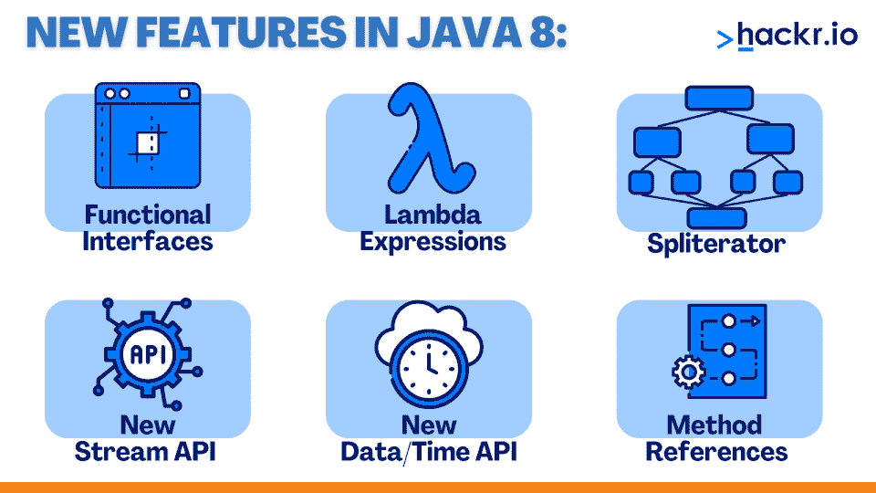
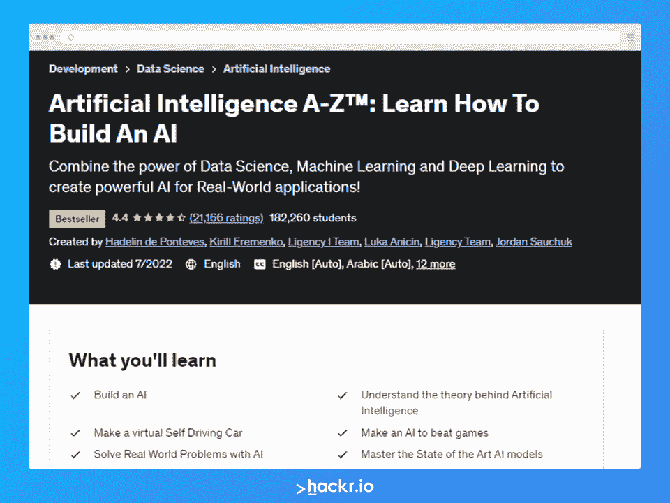
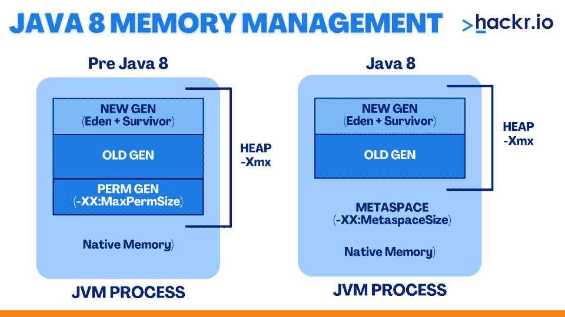

# 2023 年 Java 8 面试问答前 35 名

> 原文：<https://hackr.io/blog/java-8-interview-questions>

Java 以不时添加各种新特性而闻名，Java 8 SE 是这种编程语言的最新版本之一。它于 2014 年 3 月发布，重点是克服早期版本的漏洞和缺点，并添加新的功能和特性。开发 Java 8 SE 的目的是实现 [**函数式编程**](https://hackr.io/blog/functional-programming) ，创建新的 JavaScript 搜索引擎，用新的 API 操纵日期时间，部署新的流 API。

我们在这里列出几个最常见的 **Java 8 面试问答**。我们将问题分为初级和高级问题。

## **Java 8 大面试问答**

### **初学 Java 8 面试问题**

#### **1。Java 是谁开发的？**

甲骨文公司开发了 Java。它继续更新语言，增加特性和便利性。Java 8 SE 版本增加了函数式编程和新的 JavaScript 搜索引擎等特性。

#### **2。Java 的最新版本是什么？**

Java SE 8 是最新版本，引入了诸如函数接口和 lambda 表达式、用于集合上批量数据操作的 Java Stream API、Java Time API 等特性。

#### **3。Java 8 最显著的特点是什么？**

****

Java 8 最独特的[特性包括:](https://hackr.io/blog/features-of-java)

1.  功能界面
2.  λ表达式
3.  分裂器
4.  新流 API
5.  新日期时间 api
6.  方法引用

**4。什么是 Lambda 表达式？**

#### Lambda 表达式是一个匿名函数，它接受不同的输入参数集，并提供各种输出。本质上，它是一种匿名方法。它很有用，因为它提供了一个功能接口。

**5。为什么 Lambda 表达式被认为是一段代码？**

#### Lambda 表达式被认为是一个代码块，因为它没有名称，可以存在，也可以不存在参数和结果。

**6。Lambda 表达式的不同部分是什么？**

#### Lambda 表达式有三个不同的部分:

参数列表

1.  λ体表达式
2.  λ箭头运算符
3.  7 .**。Lambda 表达式的参数列表与 lambda arrow 运算符有何不同？**

lambda 表达式一次可以携带零个或任意数量的参数。lambda arrow 操作符使用图标“->”将这些参数与列表和正文分开。

#### 推荐 Java 课程

[](https://click.linksynergy.com/deeplink?id=jU79Zysihs4&mid=39197&murl=https%3A%2F%2Fwww.udemy.com%2Fjava-the-complete-java-developer-course%2F&u1=tutorials%2Flearn-java_amcid-J7oOgAeose7r7rbes3sN2)

## **8。lambda 表达式的特征是什么？**

lambda 表达式的特征是:

#### 它没有特定的参数。

#### 它返回任何类型的结果。

它的类型是“Java.lang.Runnable”

2.  **9。在 Java SE 8 中定义可选？**
3.  Optional 是最后一个类，它是作为 Java SE8 的组成部分引入的。它是一个 java.util 包，可以有一个值，也可以没有值。

#### 10。Java SE 8 中的 Optional 有什么用？

Java SE 8 中的 Optional 用于表示存在或不存在的可选值。它不支持太多的空检查和 NullPointerException。除此之外，它还避免了运行时 NullPointerExceptions，有助于开发更简洁的 Java APIs。

#### **11。可选的优点是什么？**

可选具有以下优点。

这有助于避免无效检查。

#### 它用于避免“NullPointerException”。

1.  **12。Java 8 中的类型推理是什么？**
2.  类型接口指的是当调用方法时，即在编译时，编译器确定参数类型的能力。

#### 13。默认方法是什么？

默认方法在不破坏实现类的情况下向接口添加功能，并提供向后兼容性。

#### **14。定义流管道。**

Java SE 8 中的流管道技术用于通过分割可以在一个流上发生的操作来将操作链接在一起。流流水线的两个类别是中间操作和终端操作。

#### 15。使用流管道的强制性是什么？

强制使用流管道是因为终端操作的存在，它有助于返回最终值并支持管道的终止。

#### 16。解释谓词和函数以及代码。有哪些相似之处？

谓词和函数都是函数接口。

Predicate 是一个单参数函数，它给出真或假的结果。它的代号是<t>。Function 是一个单参数函数，它以对象的形式给出结果。它的代号是<t r="">。</t></t>

**17。Java SE 8 的核心 API 类有哪些？**

Java SE 8 的核心 API 类包括 LocalDate、LocalTime 和 LocalDateTime。

#### 18。什么取代了 PermGen？

****

PermGen 用于存储类，在 Java SE 8 中已经被 MetaSpace 取代。

**高级 Java 8 面试题**

**19。功能界面是什么？**

函数接口是只携带一个抽象方法的接口。下面的代码示例进一步解释了这一点。

#### 20。功能界面和 SAM 界面有区别吗？

不，功能界面和 SAM 界面没有区别。SAM 接口或单一抽象方法接口是 Java SE 8 API 中定义的一种功能接口。

```
// Java program to demonstrate Implementation of

// functional interface using lambda expressions

class Test

{

 public static void main(String args[])

 {

// lambda expression to create the object

new Thread(()->

).start();

 }

}
```

#### **21。我们能定义一个功能接口吗？如果是，如何实现？**

是的，我们可以定义一个功能接口。可以使用 Java SE 8 的@Functionalinterface 注释来定义它们，以将接口标记为功能接口。

#### **22。功能接口需要遵循的准则是什么？**

功能界面需要遵循以下几个准则。这些是:

该接口应该只使用一个抽象方法来定义。

#### 只能定义一个摘要。

在接口定义中使用@Functionalinterface 注释。

1.  Java.lang.object 类的方法的覆盖不会被视为抽象方法。
2.  任何方法都可以用来定义一个数。

4.  **23。哪两种最流行的方法可用于定义函数接口中的任意数字？**
5.  用于在函数接口中定义任意数字的两种最流行的方法包括静态方法和默认方法。

#### **24。用@Functionalinterface 注释定义一个函数接口是必须的吗？**

不。用@Functionalinterface 注释定义功能接口不是强制性的。

#### **25。函数接口定义中的强制是什么？**

函数接口定义中的强制是当 Java 编译器强制我们在接口中使用一个抽象时。

#### **26。Lambda 表达式和函数接口有什么联系？**

使用 Lambda 表达式意味着我们在使用一个函数接口——它们是相互关联的。lambda 表达式是 functional interface 的一部分，functional interface 是一个承载各种其他特性和表达式的更大的平台。

#### **27。集合 API 和流 API 有什么不同？**

集合 API 和流 API 之间的区别是:

**采集 API**

#### **流 API**

自从引入 Java 1.2 以来，它就可用了

| 它是在 Java SE 8 推出后推出的 | 它有助于存储作为一组对象的数据。 |
| 它有助于计算数据，其中对一组数据对象进行计算。 | 它可用于存储有限数量的元素。 |
| 它可以用来存储无限数量的元素。 | 集合对象的构造是急切完成的。 |
| Stream 对象的构造是延迟完成的。 |  |
| **28。Spliterator 是一个不同的迭代器吗？** | Java SE 8 中的 Spliterator 是一个迭代器接口。以下是 spliterator 和 iterator 之间的区别: |

#### **分割器**

#### **迭代器**

它是与 Java SE 8 一起引入的

| 它是很久以前在 Java 1.2 中引入的 | 它被定义为 Spliterator 迭代器。 |
| 它被定义为非溢出迭代器。 | 它可以在流 API 中使用。 |
| 可以在集合 API 中使用。 | 它有助于并行和顺序地迭代流。 |
| 它只帮助按顺序迭代集合。 | 示例包括 tryAdvance() |
| 示例包括，next()，hasNext()。 |  |
| **29。标准库中常见的功能接口类型有哪些？** | 标准库中常见的功能接口类型包括: |

#### 述语

#### 功能

消费者

1.  供应者
2.  双功能
3.  二元运算符
4.  一元运算符
5.  三十岁。Map 和 FlatMap 流操作的主要区别是什么？
6.  Map 和 FlatMap 流操作之间的主要区别在于，前者将其返回值包装在其序数类型中，而后者没有。

31。地图和平面地图流操作有什么相似之处？

#### Map 和 FlatMap 流操作都是接收函数并将这些函数应用于流的不同元素的中间流操作。

PerGen 的大小是固定的，不能动态增长，而 Metaspace 可以动态增长，并且没有任何类型的大小限制。

中间操作的示例包括以下内容。

极限(长 n)

跳过(长 n)

独特()

过滤器(谓词)

1.  地图(功能)
2.  34。有哪些终端操作的例子？
3.  终端操作的例子有:
4.  最大
5.  福建话

任意匹配

#### AllMatch

减少

1.  ToArray
2.  数数
3.  35。我们可以使用 Java SE 8 特性列出数字并删除列表中的重复元素吗？
4.  是的，我们可以列出数字，并通过应用 stream，然后使用 Collections.toSet()方法将其收集到 set 中来删除列表中的重复元素。
5.  **结论**
6.  你刚刚读了一些最流行的 Java 8 面试问题和答案。还有很多东西需要学习，但这是一个很好的起点。我们希望这些 Java 8 面试问题能帮助你通过面试。
7.  你可以通过关注 Java 8 面试准备的本课程进一步测试你的 Java 8 技能。这些也会对 Java 8 编码面试问题和核心 Java 8 面试问题有所帮助。

你还应该考虑阅读[编码面试问题](https://geni.us/c0Wtk3)来准备与编码背景相关的常见问题。

#### 如果你有任何问题或建议，欢迎在下面留言。

**人也在读:**

## **Conclusion**

You just read some of the most popular Java 8 interview questions and answers. There’s a lot more to learn, but this is a good starting point. We hope these Java 8 interview questions help you get through that interview. 

You can test your Java 8 skills further with [this Udemy course](https://click.linksynergy.com/deeplink?id=jU79Zysihs4&mid=39197&murl=https%3A%2F%2Fwww.udemy.com%2Fcourse%2Fjava-interview-preparation%2F&u1=blog%2Fjava-8-interview-questions_amcid-oip7rxqq6iFiFoeMIE7x6) focusing on Java 8 interview preparation. These will also help with Java 8 coding interview questions and core Java 8 interview questions.

You should also consider reading [Coding Interview Questions](https://geni.us/c0Wtk3) to prepare common questions pertaining to a coding background. 

If you have any questions or suggestions, feel free to drop a comment below.

**People are also reading:**