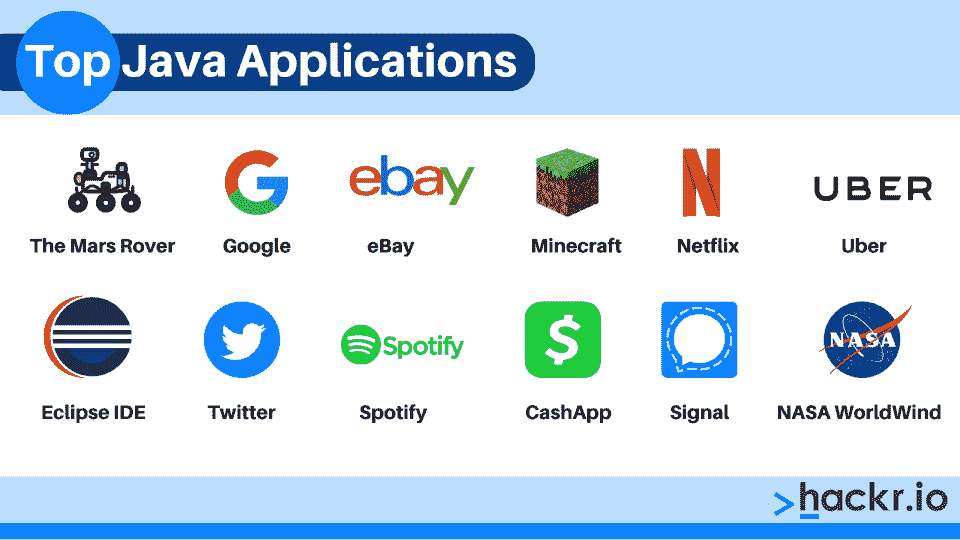

# 2023 年全球使用的前 12 个 Java 应用程序示例

> 原文：<https://hackr.io/blog/java-application>

Java 最初开发于 1995 年，至今仍是全球最受欢迎的编程语言之一。曾经有一段时间，你不能访问一个网站而不看到一个 Java 小程序——今天，开发人员大多将 Java 用于桌面、服务器端和移动应用程序。

当然，这并不意味着 Java 是解决所有问题的最佳工具。对于许多应用程序来说，Java 是一种流行的语言，但对于其他应用程序来说就不那么流行了。让我们看看不同类型的 Java 应用程序，哪些 Java 做得好，哪些 Java 可以做得更好。

*   Java 开发人员构建所有应用程序——从服务器端应用程序到物联网设备。
*   Java 以跨平台、易于学习和面向对象而闻名。
*   Java 最直接的竞争对手是 Python——虽然 C++也很流行。

## **Java 有哪些应用？**

Java 是一种跨平台的通用语言。它是高度可移植的，众所周知的，并且得到了很好的支持。由于其悠久的历史和活跃的社区，Java 经常是程序员学习的第一语言。当 Java 首次发布时，开发人员主要用它来创建嵌入式 web 应用程序。

虽然 Java 看起来很复杂，但学习起来并不困难——只要有合适的老师。通过教程和项目学习 Java 会让你更深入地了解编程及其结构。

Scala 、Ruby 和 [C#](https://hackr.io/blog/c-sharp-interview-questions) 只是少数受到 Java 影响的语言。用 Java 学习这些和其他语言会更容易。

| **是 Java，不是 JavaScript！**JavaScript 是 Java 的可移植运行时变体，这是一个常见的误解。Java 和 JavaScript 是完全不同的语言。虽然 JavaScript 和 Java 是同一年发明的，但它是一个可以解释的 OOP 编程脚本，而 Java 是一种 OOP 语言，必须编译。 |

### 1.Java 桌面应用程序

您的计算机上安装了 Microsoft Word 或 Adobe Photoshop 等桌面应用程序。当然，今天的大多数程序都是基于云的 SaaS 解决方案——但是你可能仍然偶尔会下载像 Slack 这样的软件套件。

历史上，桌面应用程序比 Java 更频繁地用 C++ 编写。但是程序员通常更喜欢 Java 的可移植性，这意味着它是跨平台应用程序的理想选择。开箱即用，Java 有一些内存泄漏问题和安全问题。但是*熟练的手*可以让它变得极其高效和安全。

常见桌面应用程序的示例包括:

*   文字处理套件。
*   网络浏览器。
*   图像编辑软件。

### 2.Java 嵌入式系统应用

嵌入式系统是运行单个程序或应用程序的小型独立计算机。这些设备可能包括交换机、路由器和电视。许多安卓设备(尤其是老款)也属于这一类。但是嵌入式系统甚至可以用于基本服务，比如医疗设备。

今天，许多嵌入式系统都是物联网设备——当嵌入式系统连接到互联网时，它们就变成了物联网设备。

Java 的可移植性使它成为开发嵌入式系统应用程序的首选语言。此外，Java 提供了对许多底层进程的直接访问，在正确编码的情况下提高了系统性能。

嵌入式系统的例子包括:

*   医疗设备，比如胰岛素追踪器。
*   健身追踪器。
*   智能电视。

### 3.Java 移动应用程序

今天，Java 最流行的用例之一是开发 Android 应用程序。但这主要是因为[移动开发](https://hackr.io/blog/how-to-become-a-mobile-app-developer)已经开始让其他应用黯然失色。因此，许多熟悉 Java 开发的开发人员已经转向了移动开发。

新开发人员更有可能使用 Python 或 JavaScript 框架进行快速部署，但新并不一定意味着更好。由于其社区的力量和生态系统的多样性，Java 仍然是移动应用程序开发的有力候选。

移动应用程序的示例包括:

*   手机游戏。
*   银行应用。
*   视频和音乐流。

### 4.Java 大数据应用

程序员喜欢用 Java 开发大数据应用。例如，[Hadoop](https://hackr.io/blog/hadoop-architecture)——最流行的大数据工具集——运行在 Java 上。

除了可移植性，Java 的面向对象设计使其非常适合开发大数据应用程序。但是在将 Java 用于大数据项目时，您可能会遇到一些性能问题。

作为一名新的开发人员，您会听到关于 Java 的性能和可伸缩性的各种说法。事实是 Java 是高度可伸缩和高性能的，但问题是对于一个没有经验的程序员来说，很难创建可伸缩的代码。程序员的经验越多，他们的代码性能就越好。例如，适当的内存管理将减少潜在的内存泄漏——而不正确的内存管理会毁坏一个平台。Java 提供了近乎完全的自由，这是一把双刃剑。

大数据应用的例子包括:

*   NoSQL 数据库管理。
*   机器学习系统。
*   文档管理。

### 5.Java Web 应用程序

虽然 web *是 Java 的一个应用——通常用于服务器端开发——但它已经有点名存实亡了。Java 是一种轻量级、可扩展和可移植的语言。但是它不是开发程序的快速语言*。**

像 Python 这样的语言部署代码的速度比 Java 快得多，这使它成为一个有吸引力的选择，因为开发人员优先考虑尽快将代码推向市场。但是开发人员仍然使用 Java 开发 web 应用程序，特别是当他们需要一种快速、高效和可伸缩的语言时。

web 应用程序的示例包括:

*   软件即服务解决方案。
*   社交媒体网站。
*   博客和新闻网站。

### 6.Java 人工智能应用

Python 是目前[机器学习和人工智能](https://hackr.io/blog/ai-vs-machine-learning)的首选语言。但正如 Java 被用于大数据一样，它也被用于人工智能的开发。Java 抽象度低；它允许访问机器级别的操作。因此，虽然草率的编码可能会导致技术债务，但优雅的代码将是轻量级和可伸缩的…如果有点冗长的话。

对于想开发人工智能的新程序员来说，Java 可能不是理想的语言。但反过来，已经擅长 Java 的程序员不应该觉得他们需要学习一门新语言来开发人工智能。Apache Jena、PowerLoom、Eye 只是 AI 开发的几个 Java 框架。

Java AI 应用程序的示例包括:

*   自然语言处理(聊天机器人)。
*   图像识别软件。
*   恶意软件和威胁检测。

### 7.Java 企业/SaaS 应用程序

除了在 web 上使用之外，Java 在云上也有大量的使用。

云服务不同于 web 服务，因为它们分布在多台计算机上。

Java 用于分布式计算解决方案、企业应用程序和 SaaS 平台。

由于上面讨论的所有原因，Java 特别具有可伸缩性和可移植性——这使得它非常适合快节奏的企业应用程序世界。构建和维护这些云服务对 Java 程序员的需求很大。

Java 企业应用程序的例子包括:

*   SaaS 客户关系管理套件。
*   企业协作解决方案。
*   企业资源规划平台。

| 你还记得苹果吗？即使 Python 现在更频繁地用于 web 应用程序，Java 曾经是最流行的 web 应用程序语言。如果你在互联网早期上网，你会记得一种叫做“Java 小程序”的东西——嵌入式网络应用。 |

## **最受欢迎的 Java 应用程序**

最流行的 Java 平台有哪些？看看 Java 在现实世界中的应用，就更容易理解 Java 的用途了。

### **1。火星漫游车**

嗯，你可能不会每次重启电脑就启动火星探测器。但是火星探测器无疑对人类历史进程具有重要意义。您甚至可以使用 Java 设计的界面运行火星漫游车的模拟模型。Java 在嵌入式系统中有多有用。

### **2。谷歌**

今天的大多数主要平台，如谷歌、YouTube、脸书和亚马逊，都在其服务器端应用程序中使用 Java。然而，值得注意的是，他们也经常使用其他语言——例如，易贝使用 Java、JavaScript 和 Scala。说到易贝…

### **3。易贝**

是的，世界上最大的在线拍卖行在后台使用 Java。Java 经常用于后端开发和数据管理，而像 JacaScript 这样的语言则用于用户界面设计和开发。易贝是一个用 Java 开发的大型、可伸缩、高效网站的优秀例子。

### **4。《我的世界》**

就原始市场饱和而言，《我的世界》可以说是当今最受欢迎的游戏。一个开发人员煞费苦心地用 Java 编写了《《我的世界》》，并于 2009 年发布，尽管开发人员一直将游戏开发到 2020 年代。Java 突出的一个主要缺点是它需要大量的代码来完成工作，但是一个熟练的 Java 程序员几乎可以从头开始开发任何东西。

### **5。网飞**

下次你疯狂观看一个节目时，想想其中涉及的非凡技术。网飞存储和移动海量数据，同时还分析客户行为。它是在一个完全用 Java 和 Python 开发的后端上完成的。

### **6。优步**

搭乘 Java 的顺风车。Java 经常用于 Android 开发，使用合适的软件开发工具包，Java 可以直接移植到 Android 和 iOS 上。虽然原生 iOS 程序员通常会使用 Swift 这样的语言，但用 Java 开发和跨平台编译很容易。优步是用 Java 开发的众多流行移动应用之一。

### **7。Eclipse IDE**

由于 Java 的完全自由性、可移植性和可扩展性，Java 也经常用于软件开发程序。Eclipse IDE 和 NetBeans 是两种流行的编程 IDE(开发环境)的例子。虽然您可以在用 Java 编写的 IDE 上编写 Java，但是 Eclipse IDE 和 NetBeans 也支持其他语言。

Twitter 从 Rails 转向 Java 是为了提高性能——这再次表明，Java 可以在合适的人手里提供出色的资源管理。Twitter 必须非常快速地管理大量数据，但至少这些数据基本上是有组织的。Rails 是由麻省理工学院开发的服务器端框架，和许多框架一样，它使开发过程更快(有时以牺牲现场性能为代价)。

### **9。Spotify**

Spotify 的内幕可能比你想象的要多。它不仅仅是一个音乐档案馆，它还是一个音乐建议引擎。它会记录下你的所有行为(不仅仅是喜欢和不喜欢，还有你听的频率)，提供可能让你一直听下去的音乐。在其后端(由 Java 驱动)，它还必须跟踪版税支付、订阅和广告。

### 10。CashApp

没有一种语言天生是“高度安全的”，但是开发人员对 Java 的细粒度控制使它成为最安全的语言之一。Java 在整个金融服务行业被大量使用，包括广受欢迎的应用 CashApp。你可以把钱存在 CashApp 钱包里，发给朋友(和陌生人，尽管那不太可取)，甚至可以购买加密货币。

### **11。信号**

一个端到端的加密通信通道 Signal 展示了 Java 的多功能性、可移植性和安全性。通过点对点共享和联网的物联网，Signal 使个人即使无法访问更大的互联网也能保持联系。

### **12。美国宇航局世界风**

通过 NASA 的 WorldWind 项目，从任何卫星上访问世界的 3D 模型。WorldWind 是一个开源的 globe，它向开发人员提供世界各地的地形和图像，以及交互式可视化。WorldWind 可以看到卫星能看到的任何东西，包括交通和天气。

想从事 Java 编程吗？讨论任何用于 Java 编程的应用程序如何与 [Java 面试问题](https://hackr.io/blog/java-interview-questions)相关联。如果您要编写上述 Java 应用程序示例平台中的一个，您将如何开始？

## **该不该学 Java？**

Java 仍然是就业市场上最受欢迎的语言之一。根据薪酬等级表，Java 开发人员的平均收入接近 80，000 美元。当然，这几乎等同于一般的 Python 开发者。

Python 可能是当今最流行的编程语言，但 Java 紧随其后。学了 Java 之后学 Python 很容易，但反过来就不是这样了。有趣的是，Python 被视为更“现代”的语言，尽管它是第一个发布的。在很大程度上，这只是因为 Python 支持快速部署和更少的代码行。

### **Java vs Python:短兵相接**

| **特性** |
| **Java** | **Python** | 放 |
| 1995 | 1991 | 开发人员数量 |
| [1000 万](https://www.frgconsulting.com/insights/why-is-java-so-popular-developers) | [700 万](https://www.daxx.com/blog/development-trends/number-software-developers-world) | 平均工资 |
| $80,000 | $80,000 | 在网站中使用 |
| [4.1%](https://w3techs.com/technologies/details/pl-java) | [1.3%](https://w3techs.com/technologies/details/pl-python) | 最终，Java 和 Python 是很好的学习语言。Java 更有可能给你对系统的粒度控制，并培养你作为程序员的技能。 |

相比之下，Python 导致了更快的部署，并且有助于更小的开发管道。

你可以通过[认证课程](https://hackr.io/blog/java-certification-courses)和解决一些[流行的 Java 项目](https://hackr.io/blog/java-projects)来学习 Java。

【Java 用的是哪个软件？

## Eclipse 可能是最流行的 Java 编程应用程序——它是市场上最流行的 Java IDE。大约十年前，用于 Java 程序开发的最流行的应用程序可能是 NetBeans。除了开发环境，还有[流行的 Java 框架](https://hackr.io/blog/java-frameworks)，比如 Spring 和 Struts。

**结论:Java 应用开发**

## Java 应用无处不在。对于上面列出的每一种 Java 用途，还有许多其他用途。开发者可以为从物联网设备到网站的任何东西创建基于 Java 的应用。

那么，什么时候应该使用 Java 呢？

**当您需要一种语言时，请使用 Java:**

便携和平台无关

*   得到繁荣社区的大力支持
*   强健且极具可扩展性
*   **但是不要用 Java，如果你:**

需要快速部署

*   需要开箱即用的高性能
*   想了解更多关于 Java 的知识？

### 这是成为 Java 开发人员的大好时机。Indeed 上有超过 80，000 个面向 Java 开发人员的职位。从训练营、认证和编程项目开始，你会走得很好。

**常见问题解答**

## **1。Java 在我们的日常生活中有什么用？**

#### 我们每天遇到的许多计算系统都运行 Java。从智能电视到银行系统，Java 无处不在——几十年来，它一直是全球最流行的编程语言之一。对于程序员来说，Java 是一种很好的入门语言——虽然它很复杂，但也需要很多训练。

**2。哪些行业使用 Java？**

#### 经常使用基于 Java 的应用程序的行业包括银行和金融服务、零售、电信服务和移动应用程序开发公司。开发人员使用 Java 进行后端系统、服务器端应用程序和一般应用程序开发。

**3。Java 最适合做什么？**

#### Java 最适合服务器端开发、大数据和人工智能。然而，它也经常用于桌面应用程序、web 应用程序和 Android 应用程序开发。实际上，Java 最适合愿意深入研究内存和安全管理的有经验的程序员。

**人也在读:**

**People are also reading:**