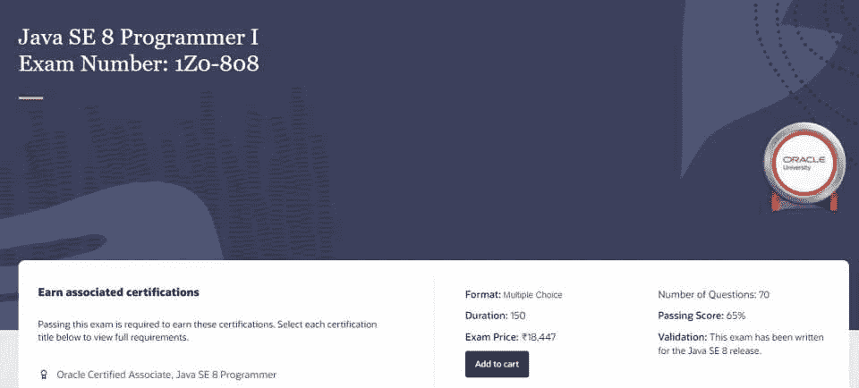
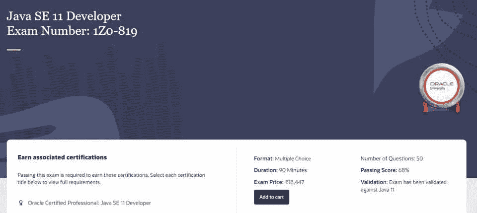
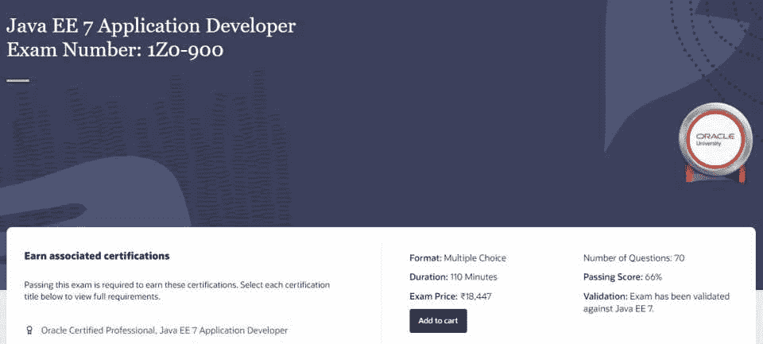
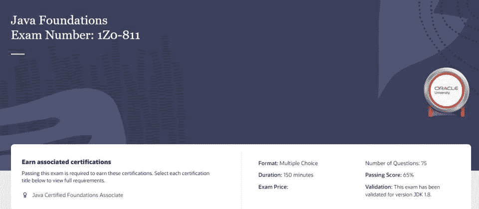
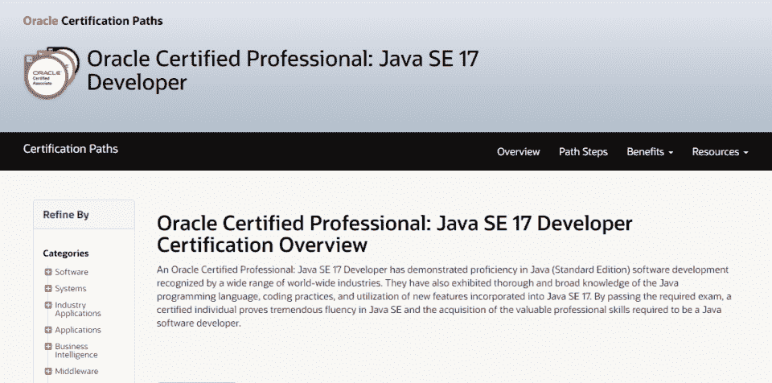

# 2023 年最佳在线 Java 认证-[更新]

> 原文：<https://hackr.io/blog/java-certification-courses>

Java 是 IT 行业中使用最广泛的编程语言之一。个人和组织都在使用它，将来也会如此。

甲骨文公司负责 Java 平台的开发，它的甲骨文 Java 课程是最好的。这里列出的每一门 java 认证课程都来自 Oracle，它验证了特定领域的 Java 专业技能和知识水平。

在我们看最好的在线 Java 认证课程之前，我们先来看一些关于它们的一般性问题。

## **如何准备 Java 认证考试**

您可以考虑几种方法来帮助您准备 Java 认证考试。你可以自己开发一些 Java 应用程序或程序，因为这会给你一些急需的实践经验。你也可以阅读一些最好的 Java 书籍。最后，跟上 Java 平台的最新变化。

## **顶级甲骨文 Java 认证在线课程**

最佳的在线 Java 认证课程将取决于您的具体需求，但是这里列出的课程涵盖了很大的范围。有些是针对初学者的，有些是针对更高级的 Java 程序员的。

| **考试详情** | **教学大纲** |
| **代码:** 1Z0-808**时长:** 150 分钟**及格分数:** 65%**先决条件:**无**问题总数:** 70**类型:**多选费用:244 美元 | Java 基础

*   数据类型
*   运算符和决策结构
*   循环结构
*   方法和封装
*   例外
*   Java API 中的类
*   [Oracle Certified Associate，Java SE 8 程序员认证](https://education.oracle.com/oracle-certified-associate-java-se-8-programmer/trackp_333)是 Java SE 9 开发人员获得专业认证的第一步。它涵盖了 Java 的基础知识。参加并通过该考试后，您必须获得甲骨文认证专家(OCP)资格。

 |

要通过这次考试，你需要彻底了解教学大纲中列出的概念。必要的话可以参加甲骨文提供的 [Java SE 8 培训](https://education.oracle.com/java/java-se/product_267)。

[查看课程](https://education.oracle.com/oracle-certified-associate-java-se-8-programmer/trackp_333)

[**![Oracle Certified Professional Java Programmer (OCPJP) [Java SE 8 Programmer II]](img/1c6423d38d15ab8169adf9e4a6831db5.png)**](https://education.oracle.com/products/trackp_357)

**考试详情**

| **教学大纲** | **代码:** 1Z0-809 |
| **时长:** 150 分钟**通过要求:** 65%先决条件: OCAJP 8**问题总数:** 85**类型:**多选费用:244 美元高级课程设计 | 用 JDBC 构建数据库应用程序

*   并发
*   例外和断言
*   泛型和集合
*   Java 类设计
*   Java 文件 nio.2)
*   Java I/O 基础知识
*   Java 流 API
*   Lambda 内置函数接口
*   本地化
*   使用 Java SE 8 日期/时间 API
*   [甲骨文认证职业 Java 程序员](https://education.oracle.com/products/trackp_357)或 OCPJP 是专业级认证。它验证了候选人在 Java SE 8 中 Java 代码开发的知识和专业技能。这个认证最适合那些有 Java 专业经验的人。
*   这是两个考试中的第二个，第一个是 OCAJP，要求证明拥有成为专业 Java 开发人员所必需的高水平技能。

 |

[查看课程](https://education.oracle.com/products/trackp_357)

[****](https://education.oracle.com/products/trackp_OCPJAV11)

**考试详情**

**教学大纲**

| **代码:** 1Z0-819 | **持续时间:** 90 分钟 |
| **通过要求:** 68%**先决条件:**无**问题总数:** 50**类型:**多选费用:244 美元应用封装创建和使用方法 | 创建简单的 Java 程序

*   描述和使用对象和类
*   处理异常
*   Java 技术和 Java 开发环境
*   通过接口进行抽象编程
*   通过继承重用实现
*   了解模块
*   使用运算符和决策结构
*   使用 Java 数组
*   使用 Java 基本数据类型和字符串 API
*   这个 Java 编程认证和上面提到的那些类似。不过这个是针对 [Java 标准版 11](https://education.oracle.com/products/trackp_OCPJAV11) 的。它还涵盖了 Java 的基础知识，如方法、数据类型和简单 Java 程序的创建。
*   [查看课程](https://education.oracle.com/products/trackp_OCPJAV11)

 |

[****](https://education.oracle.com/oracle-certified-professional-java-ee-7-application-developer/trackp_900)

**考试详情**

**教学大纲**

**代码:** 1Z0-900

| **时长:** 110 分钟 | **通过要求:** 66% |
| 先决条件: OCAJP

*   **问题总数:** 70
*   **类型:**多选
*   费用:244 美元
*   批处理 API
*   CDI 豆
*   并发
*   使用 WebSockets 创建 Java 应用程序

 | 使用 JSP 创建 Java Web 应用程序

*   使用 Servlets 开发 Java Web 应用程序
*   使用 JSFs 开发 Web 应用程序
*   使用 EJB 实现业务逻辑
*   使用 JAX 遥感应用编程接口执行休息服务
*   使用 JAX-WS 和 JAXB APIs 实现 SOAP 服务
*   Java EE 7 架构
*   Java EE 7 安全性
*   Java 消息服务 API
*   使用 JPA 实体和 BeanValidation 管理持久性
*   [Oracle Certified Professional Java EE 7 应用程序开发人员认证](https://education.oracle.com/oracle-certified-professional-java-ee-7-application-developer/trackp_900)验证候选人使用 Java Enterprise Edition 7 开发和部署应用程序的能力。
*   该认证对于 Java 前端和后端应用程序开发人员、架构师和软件工程师来说非常理想，他们在使用 Java EE 7 方面具有中级到高级的专业知识。
*   [查看课程](https://education.oracle.com/oracle-certified-professional-java-ee-7-application-developer/trackp_900)

*   [****](https://education.oracle.com/oracle-certified-foundations-associate-java/trackp_372)

 |

**考试详情**

**教学大纲**

**代码:** 1Z0-811

**时长:** 150 分钟

**及格分数:** 65%

| **先决条件:**无 | **问题总数:** 75 |
| **类型:**多选费用:244 美元Java 基础数据类型运算符和决策结构循环结构方法和封装 | 例外

*   Java 类
*   Oracle 认证基础协会 Java 认证是 Java 编程的一门很好的基础课程。它特别适合年轻的学习者，并且不需要任何实践经验。
*   [查看课程](https://education.oracle.com/oracle-certified-foundations-associate-java/trackp_372)

*   [****](https://education.oracle.com/oracle-certified-professional-java-se-17-developer/trackp_OCPJSE17)
*   **考试详情**
*   **教学大纲**

 |

**代码:** 1Z0-829

**持续时间:** 90 分钟

**及格分数:** 68%

**先决条件:**无

**问题总数:** 50

| **类型:**多选 | 费用:244 美元 |
| 控制程序流程利用 Java 面向对象的方法例外管理并发代码执行使用 Java I/O API使用 JDBC 访问数据库[Oracle 认证专家:Java SE 17 开发人员认证](https://education.oracle.com/oracle-certified-professional-java-se-17-developer/trackp_OCPJSE17)与列表中的其他 Java SE 认证类似，只是它侧重于 SE 17。您将学习并展示 Java SE 17 中包含的特性、实践和概念。 | [查看课程](https://education.oracle.com/oracle-certified-professional-java-se-17-developer/trackp_OCPJSE17)

*   **开始学习这些 Java 认证课程**
*   学习 Java 并不像有些人说的那么难。Java 认证，就像这个列表中提到的那些，可以向你展示这种基于类的、多范例的、高级的、通用的编程语言有多重要。
*   如果你正在为即将到来的 Java 面试做准备，为什么不读一些最常见的 [Java 面试问题](https://hackr.io/blog/java-interview-questions)？或者你可以看看其他平台的 [Java 课程](https://hackr.io/blog/best-java-courses)。
*   [Java 编程大师班更新到 Java 17](https://click.linksynergy.com/link?id=jU79Zysihs4&offerid=1045023.533682&type=2&murl=https%3A%2F%2Fwww.udemy.com%2Fcourse%2Fjava-the-complete-java-developer-course%2F)
*   **常见问题解答**

 |

**考个 Java 认证值得吗？**

获得 Java 认证绝对值得。Java 认证向雇主保证，候选人拥有特定水平的 Java 专业技能和知识，这取决于他们拥有的认证类型。它还让您了解 Java 编程语言的最新发展。

**哪个网上 Java 认证课程最好？**

## 没有具体的最佳 Java 认证课程。每门课程都有自己的侧重点，并为你承担一系列特定的责任做好准备。也就是说，你想参加一个知名认证提供商的课程，比如甲骨文。如果您对此完全陌生，请从基础 Java 认证课程开始。

【Java 认证要多少钱？

一个特定的 Java 证书的确切费用会根据具体的课程、你参加课程的平台以及你所属的国家而有所不同。一般来说，越高级的课程费用越高。对于 Oracle Java 认证课程，比如这里列出的课程，预计费用不到 250 美元。

**Java 认证够就业吗？**

## 只要你有知识和作品展示，你就能很好地找到相关的工作。Java 开发人员证书可以向你的雇主展示你有担任某个职位的技能和专业知识。

### **人也在读:**

Getting a Java certification can be absolutely worth it. A Java certification assures the employer that the candidate has the specified level of Java expertise and knowledge depending on the type of certification they possess. It also keeps you abreast of the latest developments in the Java programming language.

### **Which Online Java Certification Course is the Best?**

There is no specific best Java certification course. Each course will have its own focus and prepare you for a particular set of responsibilities. That said, you want to take a course from a reputed certification provider, like Oracle. If you are completely new to this, start with the basic Java certification course.

### **How Much Does Java Certification Cost?**

The exact cost of a particular Java certificate will vary depending on the specific course, the platform you take the course from, and the country you belong to. Typically the more advanced courses will cost more. For Oracle Java certification courses, like the ones listed here, expect to pay just under $250.

### **Is Java Certification Enough to Get a Job?**

So long as you have the knowledge and a portfolio of work to show, you should be in a good position to get a related job. A certification for Java developers can go a long way in showing your employer that you have the skills and expertise to take up a role.

**People are also reading:**