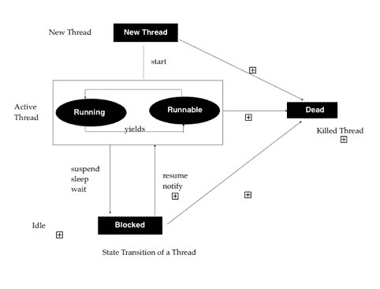
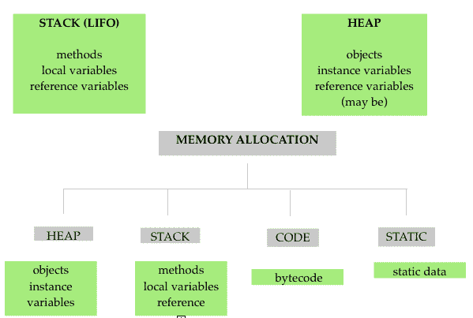
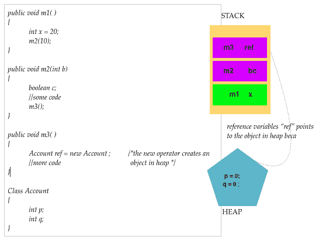

# Java 备忘单:下载 PDF 快速参考

> 原文：<https://hackr.io/blog/java-cheat-sheet>

**面向对象编程语言:**基于“对象”的概念。
**开源:**随时可供开发。
**平台无关:** Java 代码独立于任何特定的硬件或软件。这是因为 Java 代码是由编译器编译并转换成字节码的。因此，字节码是独立于平台的，可以在多个系统上运行。唯一的要求是 Java 需要一个运行时环境，即 JRE，这是一套用于开发 Java 应用程序的工具。
**内存管理:**垃圾回收语言，即内存的解除分配。
**异常处理:**捕捉一系列错误或异常，从而消除系统崩溃的风险。

### **Java 流行语**

考虑到具有以下特性的主要目标，Java 以其最终形式被建模

*   简单、小巧、熟悉
*   面向对象
*   便携且独立于平台
*   编译和解释
*   可扩展性和性能
*   强大而安全
*   建筑中立
*   高性能
*   多线程
*   分布的
*   动态和可扩展

看这里:[Java 编程的主要特点](https://hackr.io/blog/features-of-java)

### **Java** 中的**原始数据类型**

| **数据类型** | **默认值** | **Size (in bytes)****1 字节= 8 位** |
| **布尔型** | 错误的 | 1 位 |
| **字符** | " "(空格) | 2 字节 |
| **字节** | 0 | 1 位元组 |
| **短** | 0 | 2 字节 |
| **输入** | 0 | 4 位元组 |
| **龙** | 0 | 8 字节 |
| **浮动** | 0.0f | 4 字节 |
| **double** | 0.0d | 8 位元组 |

#### **非原始数据类型**

*   **数据类型**
*   **字符串**
*   **数组**
*   **类**
*   **界面**

### **类型转换**

它是将一种数据类型的变量转换为另一种数据类型以正确处理这些变量的方法。

Java 定义了两种类型转换:

*   隐式类型转换(扩大):将较小的数据类型存储到较大的数据类型。
*   显式类型转换(收缩):将较大数据类型的变量存储到较小的数据类型。

### **Java 中的运算符**

Java 支持一组丰富的运算符，可分类如下:

| **操作员类别** | **操作员** |
| 算术运算符 | +,-,/,*,% |
| 关系运算符 | , <=, >=,==, != |
| 逻辑运算符 | && , &#124;&#124; |
| 赋值运算符 | =, +=, −=, ×=, ÷=, %=, &=, ^=, &#124;=, <<=, >>=, >>>= |
| 递增和递减运算符 | ++ , - - |
| 条件运算符 | ？： |
| 按位运算符 | ^, &, &#124; |
| 特殊操作员 | 。(访问类方法的点运算符) |

### **Java IDE 及执行代码:**

在众多 ide 中，最值得推荐的是:

Java 代码也可以在任何文本编辑器中编写，并在终端上用以下命令编译:

```
$ javac [file_name].java
$ java [file_name]

```

**注意**:文件名应该与包含 main()方法的类名相同，扩展名为. java。

访问这里了解更多关于 Java IDE 的信息。

### **Java 中的变量**

变量是内存位置的名称。它是一个容器，在 java 程序执行时保存该值。Java 中的变量有三种类型:

| **局部变量** | **全局或实例变量** | **静态变量** |
| 在方法、块或构造函数体内声明和初始化。 | 在类内部但在方法、块或构造函数外部声明。如果未初始化，默认值为 0。 | 使用“static”关键字声明。它不可能是本地的。 |
| 它只能在声明它的方法中访问，并在以后从块中或当函数调用返回时被销毁。 | 创建类的实例时创建变量，销毁实例时销毁变量。 | 创建变量是为了在类级别的所有对象共享的内存中创建一个副本。 |

```
class TestVariables
{
int data = 20; // instance variable
static int number = 10; //static variable
void someMethod()
{
int num = 30; //local variable
}
}

```

### **保留字**

也称为关键字，特定的单词在 Java 中预定义，不能用作变量或对象名。一些重要的关键词是:

| **关键词** | **用途** |
| 摘要 | 用于声明抽象类。 |
| 捕捉 | 用于捕获 try 语句生成的异常。 |
| 班级 | 用于声明类。 |
| 列举型别 | 定义一组常数 |
| 延伸 | 指示类是继承的 |
| 最后的 | 表示该值不能更改 |
| 最后 | 用于在 try-catch 结构之后执行代码。 |
| 工具 | 用于实现接口。 |
| 新的 | 用于创建新对象。 |
| 静电 | 用于指示变量或方法是类方法。 |
| 极好的 | 用来指父类。 |
| 这 | 用于引用方法或构造函数中的当前对象。 |
| 扔 | 用于显式引发异常。 |
| 投 | 用于声明异常。 |
| 尝试 | 处理异常的代码块 |

### **Java 中的方法**

方法的一般形式:

其中 type -方法的返回类型
name -方法的名称
参数表-由逗号分隔的类型和变量序列
return -向调用例程返回值的语句

```
type name (parameter list)
{
//body of the method
//return value (only if type is not void)
}

```

### **Java 中的条件语句**

#### **1。if-else**

测试条件，如果条件为真，则执行块，否则执行 else 块。

```
class TestIfElse
{
public static void main(String args[])
{
int percent = 75;
if(percent >= 75
{
System.out.println("Passed");
}
else
{
System.out.println("Please attempt again!");
}
}
}

```

#### **2。开关**

测试条件；如果特定情况为真，则控制被传递给该块并执行。其余情况不再考虑，程序跳出循环。

```
class TestSwitch
{
public static void main(String args[])
{
int weather = 0;
switch(weather)
{
case 0 :
System.out.println("Sunny");
break;
case 1 :
System.out.println("Rainy");
break;
case 2 :
System.out.println("Cold");
break;
case 3 :
System.out.println("Windy");
break;
default :
System.out.println("Pleasant");
}
}
}

```

#### **3。Java 中的循环**

循环用于迭代代码特定的次数，直到指定的条件为真。Java 中有三种循环:

| **为循环** | 将代码迭代特定次数，直到条件为真。 |
| 

```
class TestForLoop { public static void main (String args[]) { for(int i=0;i<=5;i++) System.out.println("*"); } } 
```

 | **While 循环** |
| 如果 while 中的条件为真，程序进入循环进行迭代。 | 类 TestWhileLoop

```
{ public static void main (String args[]) { int i = 1; while(i<=10) { System.out.println(i); i++; } } } 
```

 |
| **Do While 循环** |   |
| 不管 while 条件是否为真，程序至少进入一次迭代循环。对于进一步的迭代，它取决于 while 条件是否为真。 | 

```
class TestDoWhileLoop { public static void main (String args[]) { int i = 1; do { System.out.println(i); i++; } while(i<=10); } } 
```

 |
| 面向对象的范例提供了以下概念来简化软件开发和维护。 | **1。对象和类** |

对象是面向对象系统中的基本运行时实体，它包含数据和操作数据的代码。这一整套数据和代码可以使用类概念变成用户定义的数据类型。因此，类是相似数据类型的对象的集合。

#### **例如:**苹果、芒果和橘子都是水果类的成员。

**2。数据抽象和封装**

将数据和方法包装或封装成一个单元称为封装。以药用胶囊为例；我们不知道它含有什么化学物质；我们只关心它的效果。这种防止程序直接访问数据的方法被称为数据隐藏。例如，在使用应用程序时，人们关心的是它们的功能，而不是它们的代码。

#### **3。继承**

继承提供了可重用性的概念；它是一个类(子类或子类)的对象如何继承或派生另一个类(父类)的对象的属性。

#### Java 中的继承类型

**单一继承:**子类从单一父类继承属性和行为。

### **多级继承:**子类从其父类继承属性，而父类又是另一个父类的子类。

*   **多重继承:**当一个子类有两个父类。在 Java 中，这个概念是通过使用接口来实现的。
*   **层次继承:**当一个父类有两个子类继承它的属性时。
*   继承中的一些限制:
*   子类不能派生超类的私有成员。

```
class A
{
int i, j;
void showij() {
System.out.println("i and j: " + i + " " + j);
}
}
// Create a subclass by extending class A.
class B extends A {
int k;
void showk() {
System.out.println("k: " + k);
}
void sum() {
System.out.println("i+j+k: " + (i+j+k));
}
}
class SimpleInheritance {
public static void main(String args[]) {
A objA = new A();
B objB = new B();
// The superclass may be used by itself
objA.i = 10;
objA.j = 20;
System.out.println("Contents of objA: ");
objA.showij();
System.out.println();

/* The subclass can access to all public members of
its superclass. */

objB.i = 7;
objB.j = 8;
objB.k = 9;
System.out.println("Contents of objB: ");
objB.showij();
objB.showk();
System.out.println();
System.out.println("Sum of i, j and k in objB:");
objB.sum();
}
}

```

子类不能继承构造函数。

*   子类可以有一个超类。
*   **4。多态性**
*   定义为采取一种以上形式的能力。多态允许创建清晰易读的代码。

#### 在 Java 多态性中，实现了方法重载和方法覆盖的概念，这是一种动态的方法。

4.1.方法覆盖

在类层次结构中，当子类中的方法与其父类中的方法具有相同的名称和类型签名时，则称子类中的方法覆盖了父类中的方法。

##### 如果我们不覆盖下面代码中的方法，输出将是 ParentMath 类中计算的 4；否则就是 16。

4.2.方法重载

Java 编程可以让同一个类中的两个或多个方法共享同一个名称，只要它们的参数声明不同。这样的方法称为重载，这个过程称为方法重载。

```
class ParentMath
{
void area()
{
int a =2;
System.out.printf("Area of Square with side 2 = %d %n", a * a);
System.out.println();
}
}
class ChildMath extends ParentMath
{
void area()
{
int a =4;
System.out.printf("Area of Square with side 4= %d %n", a * a);
}
public static void main (String args[])
{
ChildMath obj = new ChildMath();
obj.area();
}
}

```

##### 霸王一法的三种方式:

###### 参数数量

参数数量

1.  ###### 参数的数据类型

```
example: add(int, int)
add(int, int, int)

```

2.  ###### 数据类型参数的顺序

```
example add(int, int)
add(int, float)

```

3.  **解释多级继承和方法重载的程序:**

```
example add(int, float)
add(float, int)

```

超类只定义了一个被它的所有子类共享的一般化形式，把它留给每个子类来实现它的方法。

```
class Shape
{
void area()
{
System.out.println("Area of the following shapes are : ");
}
}
class Square extends Shape
{
void area(int length)
{
//calculate area of square
int area = length * length;
System.out.println("Area of square : "+area);
}
}
class Rectangle extends Shape
{
//define a breadth
void area(int length,int breadth)
{
//calculate area of rectangle
int area = length * breadth;
System.out.println("Area of rectangle : " + area);
}
}
class Circle extends Shape
{
void area(int breadth)
{
//calculate area of circle using length of the shape class as radius
float area = 3.14f * breadth * breadth;
System.out.println("Area of circle : " + area);
}
}
class InheritanceOverload
{
public static void main(String[] args)
{
int length = 5;
int breadth = 7;
Shape s = new Shape();
//object of child class square
Square sq = new Square();
//object of child class rectangle
Rectangle rec = new Rectangle();
//object of child class circle
Circle cir = new Circle();
//calling the area methods of all child classes to get the area of different objects
s.area();
sq.area(length);
rec.area(length,breadth);
cir.area(length);
}
}

```

### **接口**

一个类的接口可以使用“interface”关键字从它的实现中完全抽象出来。因此，它们类似于 class，除了它们缺少实例变量，并且它们的方法是在没有任何人的情况下声明的。

```
abstract class A {
abstract void callme();
// concrete methods are still allowed in abstract classes
void callmetoo() {
System.out.println("This is a concrete method.");
}
}
class B extends A {
void callme() {
System.out.println("B's implementation of callme.");
}
}
class Abstract {
public static void main(String args[]) {
B b = new B();
b.callme();
b.callmetoo();
}
}

```

### 几个类可以实现一个接口。

接口用于实现多重继承。

*   变量是公共的、最终的和静态的。
*   类必须创建由接口定义的一整套方法来实现接口。
*   实现接口的类可以定义自己的方法。
*   **Java 中的构造函数**
*   构造函数在创建时初始化对象。

```
interface Area
{
final static float pi = 3.14F;
float compute(float x , float y);
}
class Rectangle implements Area
{
public float compute (float x, float y)
{
return (x*y);
}
}
class Circle implements Area
{
public float compute (float x, float y)
{
return (pi * x * x);
}
}
class InterfaceTest
{
public static void main (String args[])
{
float x = 2.0F;
float y = 6.0F;
Rectangle rect = new Rectangle(); //creating object
Circle cir = new Circle();
float result1 = rect.compute(x,y);
System.out.println("Area of Rectangle = "+ result1);
float result2 = cir.compute(x,y);
System.out.println("Area of Circle = "+ result2);
}
}

```

### 它们与类的名称相同。

*   它们没有任何返回类型，甚至没有 void。
*   构造函数不能是静态的、抽象的或最终的。
*   构造函数可以是:
*   非参数化或默认构造函数:即使未声明也会自动调用。

参数化:用于用用户预定义的值初始化类的字段。

*   了解更多 **[Java 构造器](https://hackr.io/blog/java-constructor)** 。

```
class Box {
double width;
double height;
double depth;
// This is the constructor for Box.
Box() {
System.out.println("Constructing Box");
width = 10;
height = 10;
depth = 10;
}
// compute and return volume
double volume() {
return width * height * depth;
}
}
class BoxVol {
public static void main(String args[]) {
// declare, allocate, and initialize Box objects
Box mybox1 = new Box();
Box mybox2 = new Box();
double vol;
vol = mybox1.volume();
System.out.println("Volume is " + vol);
vol = mybox2.volume();
System.out.println("Volume is " + vol);
}
}

```

*   **Java 中的数组**

```
class Box {
double width;
double height;
double depth;
Box(double w, double h, double d) {
width = w;
height = h;
depth = d;
}
double volume() {
return width * height * depth;
}
}
class BoxVolP {
public static void main(String args[]) {
Box mybox1 = new Box(10, 20, 15);
Box mybox2 = new Box(3, 6, 9);
double vol;
vol = mybox1.volume();
System.out.println("Volume is " + vol);
vol = mybox2.volume();
System.out.println("Volume is " + vol);
}
}

```

数组是一组相似类型的变量，有一个共同的名字，有连续的内存。原始值对象存储在一个数组中。它提供了代码优化，因为我们可以有效地排序数据，也可以随机访问它。唯一的缺陷是我们可以在数组中有一个固定大小的元素。

### Java 中定义了两种数组:

一维:元素存储在一行中

`import java.util.Scanner;`

*   `class SingleArray`

`{`

`public static void main(String args[])`

`{`

`System.out.println("Enter the length in the array: ");`

`Scanner sc = new Scanner(System.in);`

`int len = sc.nextInt();`

`int[] numbers = new int [len];`

`System.out.println("Enter the elements in the array: ");`

`// int n = s.nextInt();`

`for(int i=0;i<len;i++)`

`{`

`numbers[i] = sc.nextInt();`

`}`

`System.out.println("The elements in the array are: ");`

`for(int i=0;i<len;i++)`

`{`

`System.out.print(numbers[i] + " ");`

`}`

`System.out.println();`

`System.out.println("The sum of elements in the array are: ");`

`int sum =0;`

`for(int i=0;i<len;i++)`

`{`

`sum = sum + numbers[i];`

`}`

`System.out.println("Sum of elements = " + sum);`

`}`

`}`

多维:元素以行和列的形式存储

类别矩阵

{

*   公共静态 void main(String args[])

{

int [][] m1 = {{1，2，1}，{2，1，1}，{1，1，2 } }；

int [][] m2 = {{2，2，2}，{1，1，1}，{2，1，2 } }；

int[][]sum = new int[3][3]；

//打印矩阵

System.out.println("给定矩阵为:")；

for(int a = 0；a

{

for(int b = 0；b

{

system . out . print(m1[a][b]+" ")；

}

system . out . println()；

}

system . out . println()；

for(int a = 0；a

{

for(int b = 0；b

{

system . out . print(m2[a][b]+" ")；

}

system . out . println()；

}

//矩阵加法

System.out.println("给定 2 个矩阵之和为:")；

for(int a = 0；a

{

for(int b = 0；b

{

sum[a][b]= m1[a][b]+m2[a][b]；

system . out . print(sum[a][b]+" ")；

}

system . out . println()；

}

}

}

**Java 中的字符串**

字符串是一种表示字符序列的非原始数据类型。

字符串类型用于声明字符串变量。

### 也可以声明字符串数组。

Java 字符串是不可变的；我们不能改变他们。

*   每当创建字符串变量时，都会创建一个新的实例。
*   **创建字符串**
*   **使用文字**
*   **使用新关键字**

#### **String name = " John "；**

| **字符串 s =新字符串()；** | **字符串方法** |
| String 类实现 CharSequence 接口，为字符串操作任务定义了几种方法。下面列出了最常用的字符串方法: | **方法** |

#### **执行的任务**

toLowerCase()

| 将字符串转换为小写 | toUpperCase() |
| 将字符串转换为大写 | 替换(' x '，' y ') |
| 用“y”替换所有出现的“x” | 修剪() |
| 删除开头和结尾的空白 | 等于() |
| 如果字符串相等，则返回“真” | equalsIgnoreCase() |
| 不管字符大小写，如果字符串相等，则返回“真” | 长度() |
| 返回字符串的长度 | 夏拉特语(n) |
| 给出字符串的第 n 个字符 | 比较() |
| 

```
returns negative if string 1 < string 2  positive if string 1 > string 2  zero if string 1 = string 2 
```

 | concat() |
| 连接两个字符串 | 子串 |
| 返回从字符 n 返回的子串 | 子串(n，m) |
| 返回 n 和 ma 字符之间的子字符串。 | toString() |
| 创建对象的字符串表示形式 | indexOf(‘x’) |
| 返回 x 在字符串中第一次出现的位置。 | indexOf(‘x’,n) |
| 返回字符串中第 n 个位置之后的位置 | ValueOf 变量 |
| 将参数值转换为字符串表示形式 | 显示字符串排序的程序: |
| 字符串缓冲区和字符串生成器 | 对于可变字符串，我们可以使用 StringBuilder 和 StringBuffer 类，它们也实现 CharSequence 接口。 |

这些类代表可增长和可写的字符接口。

```
class SortStrings {
static String arr[] = {
"Now", "the", "is", "time", "for", "all", "good", "men",
"to", "come", "to", "the", "aid", "of", "their", "county"
};
public static void main(String args[])
{
for(int j = 0; j < arr.length; j++)
{
for(int i = j + 1; i < arr.length; i++)
{
if(arr[i].compareTo(arr[j]) < 0)
{
String t = arr[j];
arr[j] = arr[i];
arr[i] = t;
}
}
System.out.println(arr[j]);
} }
}

```

它们会自动增长以腾出空间进行添加，并且通常会预分配比实际需要更多的字符以留出增长空间。

*   长度()和容量()之间的差异
*   length():查找 StringBuffer 的长度
*   capacity():查找总的分配容量

/*字符串缓冲区长度与容量*/

*   **StringBuilder 对 StringBuffer**
*   **字符串生成器**

**字符串缓冲器**

```
class StringBufferTest {
public static void main(String args[]) {
StringBuffer sb = new StringBuffer("Hello");
System.out.println("buffer = " + sb);
System.out.println("length = " + sb.length());
System.out.println("capacity = " + sb.capacity());
}
}

```

非同步:因此高效。

| 同步的 | 线程使用多线程。 |
| 线程安全 | **多线程** |
| **多任务:**同时执行多个任务以利用 CPU 的过程。 | 这可以通过两种方式实现: |

基于进程的多任务处理。(多任务处理)

2.  基于线程的多任务处理(多线程)
    2.  **多任务与多线程**
        *   **多任务处理**
        *   **多线程**

### 同时。

| 将一个进程划分为两个或多个同时并行执行的子进程或线程的概念。 | 多个程序可以同时执行。 |
| OS concept in which multiple tasks are performed支持同时执行一个程序的多个部分。 | 该过程必须在不同的程序或过程之间切换。 |
| 处理器需要在程序的不同部分或线程之间切换。 | 效率较低 |
| 高效 | 环境中最小单位的程序或进程 |
| 线程是最小的单位 | 划算的 |
| 昂贵的 | **线程的生命周期** |
| 线程总是处于以下五种状态之一:它可以以多种方式从一种状态转移到另一种状态，如图所示。 | **新线程:**线程对象被创建。可以使用 start()方法安排它运行。 |

### **可运行线程:**线程准备执行，等待处理器。

**正在运行的线程:**它已经得到了执行的处理器。

*   **阻塞线程:**线程被阻止进入可运行状态。
*   **Dead State:** 正在运行的线程在完成执行其 run()方法时结束其生命。
*   **创建线程**
*   扩展线程类
*   实现可运行接口
*   
*   **线程类的常用方法**
*   **方法**

**执行的任务**

**public void run()**

| 线程启动时会调用它。因此，所有的动作都发生在 run()中 | **public void start()** |
| 导致线程进入可运行状态。 | Inherited by class MyThread**公共无效睡眠(长毫秒)** |
| 暂时阻塞或挂起线程，使其进入可运行状态，然后在指定的毫秒内处于运行状态。 | **公共无效收益率** |
| 暂时暂停当前正在执行的线程对象，并允许执行其他线程。 | **public void suspend()** |
| 暂停线程，与 resume()方法一起使用。 | **公开作废简历()** |
| 要恢复挂起的线程 | **公共 void stop()** |
| 导致线程过早死亡，从而使线程进入死状态。 | 使用线程类创建线程的程序。 |
| **实现可运行接口** | run()方法是在 Runnable 接口中声明的，它是在我们的程序中实现线程所必需的。 |

该过程由以下步骤组成:

```
class A extends Thread
{
public void run()
{
for(int i=1;i<=5;i++)
{
System.out.println("From thread A : i " + i);
}
System.out.println("Exit from A ");
}
}
class B extends Thread
{
public void run()
{
for(int i=0;i<=5;i++)
{
System.out.println("From thread B : i " + i);
}
System.out.println("Exit from B ");
}
}
class C extends Thread
{
public void run ()
{
for(int k=1;k<=5;k++)
{
System.out.println("From thread C : k " + k);
}
System.out.println("Exit from C ");
}
}
class ThreadTest
{
public static void main(String args[])
{
new A().start();
new B().start();
new C().start();
}
}

```

实现 Runnable 接口的类声明

2.  实现 run()方法
    2.  通过定义从这个“runnable”类实例化的对象来创建线程是线程的目标。
        *   调用线程的 start()方法来运行线程。
        *   使用可运行接口
        *   **线程类与可运行接口**
        *   **线程类**

**可运行接口**

```
class X implements Runnable
{
public void run()
{
for(int i=0;i<=10;i++)
{
System.out.println("Thread X " + i);
}
System.out.println("End of thread X ");
}
}
class RunnableTest
{
public static void main(String args[])
{
X runnable = new X ();
Thread threadX = new Thread(runnable);
threadX.start();
System.out.println("End of main Thread");
}
}

```

### 扩展线程类的派生类本身就是一个线程对象，并获得对线程生命周期的完全控制。

| runnable 接口只是定义了线程中执行的工作单元，所以它并不控制线程的生命周期。 | 派生类不能扩展其他基类 |
| 允许在必要时扩展基类 | 当程序需要控制线程生命周期时使用 |
| 当程序需要扩展类的灵活性时使用。 | **Java 中的异常处理** |
| 异常是由程序中的运行时错误引起的异常或错误情况；如果这个由错误条件抛出的异常对象没有被捕获和正确处理，解释器将显示一个错误消息。如果我们想避免这种情况，并希望程序继续，我们应该设法捕捉异常。这项任务被称为异常处理。 | **常见的 Java 异常** |

### **异常类型**

异常原因

### **算术异常**

| 由数学错误引起的 | **ArrayIndexOutOfBoundException** |
| 由错误的数组索引导致 | **ArrayStoreException** |
| 当程序试图在数组中存储错误的数据类型时导致 | **FileNotFoundException** |
| 由试图访问不存在的文件引起 | **IOException** |
| 由一般 I/O 故障引起。 | **NullPointerException** |
| 由引用空对象导致。 | **NumberFormatException** |
| 当字符串和数字之间的转换失败时导致。 | **OutOfMemoryException** |
| 当没有足够的内存分配时导致 | **StringIndexOutOfBoundException** |
| 当程序试图访问字符串中不存在的字符位置时导致。 | java 中的异常有两种类型: |
|  | 在 try-catch 块的帮助下，在代码本身中显式处理。 |

从 java 扩展而来。郎。异常类

2.  *   不在程序代码中处理；相反，JVM 处理这样的异常。
    *   从 java.lang.RuntimeException 类扩展

2.  试着抓住
    *   Try 关键字用于引导可能导致错误条件并“引发”异常的代码块。关键字 catch 定义了一个 catch 块“捕捉”由 try 块“抛出”的异常，并适当地处理它。
    *   一个代码在 catch 块中可以有多个 catch 语句；当 try 块中生成异常时，多个 catch 语句被视为 switch 语句中的情况。

#### 使用 Try 和 Catch 进行异常处理

最后

**最后，语句:**用于处理之前任何 catch 语句都没有捕捉到的异常。无论是否引发异常，最终块都保证会执行。

我们可以编辑上面的程序，并添加下面的最终块。

```
class Error
{
public static void main(String args[])
{
int a [] = ;
int b = 5;
try
{
int x = a[2]/b-a[1];
}
catch(ArithmeticException e)
{
System.out.println("Division by zero");
}
catch(ArrayIndexOutOfBoundsException e)
{
System.out.println("ArrayIndexError");
}
catch(ArrayStoreException e)
{
System.out.println("Wrong data type");
}
int y = a[1]/a[0];
System.out.println("y = " + y);
}
}

```

#### 抛出自己的异常

可以使用 throw 关键字定义自己的异常。

**抛出新的可抛出子类；**

```
finally
{
int y = a[1]/a[0];
System.out.println("y = " + y);
}

```

#### /*抛出我们自己的异常*/

**用 Java 管理文件**

在变量和数组中存储数据会带来以下问题:

**临时存储:**当变量超出范围或程序终止时，数据丢失。

```
import java.lang.Exception;
class MyException extends Exception
{
MyException(String message)
{
super(message);
}
}
class TestMyException
{
public static void main(String args[])
{
int x = 5 , y = 1000;
try
{
float z = (float) x / (float) y ;
if(z < 0.01)
{
throw new MyException("Number is too small");
}
}
catch (MyException e)
{
System.out.println("Caught my exception ");
System.out.println(e.getMessage());
}
finally
{
System.out.println("I am always here");
}
}
}

```

### **大数据:**难。

这些问题可以通过使用文件的概念将数据存储在辅助设备上来解决。

*   存储在磁盘特定区域的相关记录的集合，称为文件。文件通过文件处理的概念来存储和管理数据。
*   文件处理包括:

创建文件

更新文件

数据处理

*   Java 在文件管理方面提供了许多功能，例如:
*   数据的读/写可以根据需要在字节级或字符或字段级完成。
*   它还提供了直接读/写对象的能力。

流

*   Java 使用流的概念来表示有序的数据序列，即数据流动的路径。因此，它有一个来源和一个目的地。
*   流分为两种基本类型:

### **输入流:**提取，即从源文件中读取数据并发送给程序。

**输出流:**从程序中取出数据并发送，即写入目的地。

流类

*   它们包含在 java.lang.io 包中。
*   他们被分为两组。

### **字节流类:**支持处理字节的 I/O 操作。

**字符流类:**提供对管理字符 I/O 操作的支持。

字节流类别

*   旨在提供创建和操作流和文件以读取/写入字节的功能。
*   由于流是单向的，因此有两种字节流类:

#### 输入流类

输出流类别

输入流类

*   它们用于读取 8 位字节，包括一个称为 InputStream 的超类。InputStream 是一个抽象类，它定义了输入函数的方法，例如:
*   **方法**

##### **描述**

阅读( )

| 从输入流中读取一个字节 | 读取(字节 b [ ]) |
| 将字节数组读入 b | read(byte b [ ], int n, int m) |
| 从 b 的第 n 个字节开始，将 m 个字节读入 b | 可用( ) |
| 告知输入中可用的字节数 | 跳过 |
| 从输入流中跳过 n 个字节 | 重置( ) |
| 返回到流的开头 | 关闭( ) |
| 关闭输入流 | 输出流类别 |
| 这些类是从基类 OutputStream 派生的。OutputStream 是一个抽象类，定义了输出函数的方法，例如: | **方法** |

#### **描述**

写( )

| 将一个字节写入输出流 | 写入(字节 b[ ]) |
| 将数组 b 中的所有字节写入输出流 | write(byte b[ ], int n, int m) |
| 从数组 b 的第 n 个字节开始写入 m 个字节 | 关闭( ) |
| 关闭输出流 | 齐平( ) |
| 刷新输出流 | 读取/写入字节 |
| 两个常用的子类是 FileInputStream 和 FileOutputStream，它们处理 8 位字节。 | FileOutputStream 用于将字节写入文件，如下所示: |

### //将字节写入文件

FileIntputStream 用于从文件中读取字节，如下所示:

//从文件中读取字节

字符流类别

```
import java.io.*;
class WriteBytes
{
public static void main(String args[])
{
bytes cities [] = {'C','A','L','I','F','O','R','N','I','A', '\n', 'V','E','G','A','S','\n','R','E','N','O','\n'};
//Create output file stream
FileOutputStream outfile = null;
try
{
//connect the outfile stream to "city.txt"
outfile = new FileOutputStream("city.txt");
//Write data to the stream
outfile.write(cities);
outfile.close();
}
catch(IOException ioe)
{
System.out.println(ioe);
System.exit(-1);
}
}
}

```

两种字符流类别:

读者流类别

```
import java.io.*;
class ReadBytes
{
public static void main(String args[])
{
//Create an input file stream
FileInputStream infile = null;
int b;
try
{
//connect the infile stream to required file
infile = new FileInputStream(args [ 0 ]);
//Read and display
while( (b = infile.read ( ) ) !=-1)
{
System.out.print((char) b );
}
infile.close();
}
catch(IOException ioe)
{
System.out.println(ioe);
System.exit(-1);
}
}
}

```

#### 设计用于从文件中读取字符。

类读取器是所有其他类的基类。

##### 这些类类似于输入流类，除了它们的基本信息单元，而读取器流使用字符。

*   编写器流类
*   对文件执行所有输出操作。
*   书写字符

##### Writer 类是一个抽象类，是基类，具有与 OutputStream 相同的方法。

*   读/写字符
*   用于处理文件中字符的 Reader 和 Writer 类的两个子类是 FileReader 和 FileWriter。
*   //将字符从一个文件复制到另一个文件

##### **Java 集合**

集合框架包含在 java.util 包中，它定义了一组接口及其实现来操作集合，集合充当一组对象的容器。

接口

```
import java.io.*;
class CopyCharacters
{
public static void main (String args[])
{
//Declare and create input and output files
File inFile = new File("input.dat");
File outFile = new File("output.dat");
FileReader ins = null; //creates file stream ins
FileWriter outs = null; //creates file stream outs
try
{
ins = new FileReader(inFile); //opens inFile
outs = new FileWriter(outFile); //opens outFile
//Read and write
int ch;
while((ch = ins.read( ))!=-1)
{
outs.write(ch);
}
}
catch(IOException e)
{
System.out.println(e);
System.exit(-1);
}
finally
{
try
{
ins.close();
outs.close();
}
catch (IOException e)
{}
}
}
}

```

### 集合框架包含集合、映射、迭代器等很多接口。

这些接口及其描述如下:

#### **界面**

**描述**

收藏品

| 元素集合 | 列表(扩展集合) |
| 元素序列 | 队列(扩展集合) |
| 特殊类型的列表 | 集合(扩展集合) |
| 独特元素的集合 | 排序集(扩展集) |
| 唯一元素的排序集合 | 地图 |
| 键和值对的集合，它们必须是唯一的 | SortedMap(扩展地图) |
| 键值对的排序集合 | 迭代程序 |
| 用于遍历集合的对象 | 列表(扩展迭代器) |
| 用于遍历序列的对象 | 班级 |
| 集合框架中可用的类实现了集合接口和子接口。它们还实现了映射和迭代器接口。 | 列出了类及其相应的接口: |

#### **类**

**界面**

抽象集合

| 收藏品 | 抽象主义者 |
| 目录 | 摘要 |
| 长队 | 抽象顺序列表 |
| 目录 | 链接列表 |
| List(列表) | ArrayList(数组列表) |
| 列表，可克隆和可序列化 | 抽象集 |
| 一组 | EnumSet |
| 一组 | HashSet(哈希集) |
| Set(设置) | PriorityQueue(优先级队列) |
| 伫列 | 树集 |
| 一组 | 矢量 |
| 列表，可克隆和可序列化 | 堆 |
| 列表，可克隆和可序列化 | 散列表 |
| 映射，可克隆和可序列化 | 数组列表实现 |
| //使用数组列表类的方法 | HashSet 实现 |

#### 树集实现

向量类实现

```
import java.util.*;
class Num
{
public static void main(String args[])
{
ArrayList num = new ArrayList ();
num.add(9);
num.add(12);
num.add(10);
num.add(16);
num.add(6);
num.add(8);
num.add(56);
//printing array list
System.out.println("Elements : ");
num.forEach((s) -> System.out.println(s));
//getting size
System.out.println("Size of array list is: ");
num.size();
//retrieving specific element
int n = (Integer) num.get(2);
System.out.println(n);
//removing an element
num.remove(4);
//printing array list
System.out.println("Elements : ");
num.forEach((s) -> System.out.println(s));
}
}
Linked List Implementation
import java.util.Scanner;
class LinkedList
{
public static void main (String args[])
{
Scanner s = new Scanner(System.in);
List list = new List();
System.out.println("Enter the number of elements you want to enter in LL : ");
int num_elements = s.nextInt();
int x;
for(int i =0;i<=num_elements;i++)
{
System.out.println("Enter element : ");
x = s.nextInt();
list.insert(x);
}
System.out.println(">>>>> LINKED LIST AFTER INSERTION IS : ");
list.print();
int size = list.count();
System.out.println(">>>>> SIZE OF LL => "+size);
System.out.println("Enter the node to be inserted in the middle: ");
int mid_element = s.nextInt();
list.insertMiddle(mid_element);
System.out.println(">>>> LL AFTER INSERTING THE NEW ELEMENT IN THE MIDDLE ");
list.print();
}
}

```

#### 堆栈类实现

```
import java.util.*;
class HashSetExample
{
public static void main(String args[])
{
HashSet hs = new HashSet();
hs.add("D");
hs.add("W");
hs.add("G");
hs.add("L");
hs.add("Y");
System.out.println("The elements available in the hash set are :" + hs);
}
}

```

#### 哈希表类实现

```
import java.util.*;
class TreeSetExample
{
public static void main(String args[])
{
TreeSet ts = new TreeSet();
ts.add("D");
ts.add("W");
ts.add("G");
ts.add("L");
ts.add("Y");
System.out.println("The elements available in the tree set are :" + ts);
}
}

```

#### **Java 中的内存管理**

```
import java.util.*;
class VectorExample
{
public static void main(String args[])
{
Vector fruits = new Vector ();
fruits.add("Apple");
fruits.add("Orange");
fruits.add("Grapes");
fruits.add("Pineapple");
Iterator it = fruits.iterator();
while (it.hasNext())
{
System.out.println(it.next);
}
}
}

```

#### 内存是以二进制格式表示的数据集合。

```
import java.util.*;
public class StackExample
{
public static void main (String args[])
{
Stack st = new Stack ();
st.push("Java");
st.push("Classes");
st.push("Objects");
st.push("Multithreading");
st.push("Programming");
System.out.println("The elements in the Stack : " + st);
System.out.println("The elements at the top of Stack : " + st.peek());
System.out.println("The elements popped out of the Stack : " + st.pop());
System.out.println("The elements in the Stack after pop of the element : " + st);
System.out.println("The result of search : " + st.search ("r e"));
}
}

```

#### 内存管理是:

```
import java.util.*;
public class HashTableExample
{
public static void main (String args[])
{
Hashtable ht = new Hashtable();
ht.put("Item 1","Apple");
ht.put("Item 2","Orange");
ht.put("Item 3","Grapes");
ht.put("Item 4","Pine");
ht.put("Item 5","Kiwi");
Enumeration e = ht.keys();
while(e.hasMoreElements())
{
String str = (String) e.nextElement();
System.out.println(ht.get(str));
}
}
}

```

### 分配新对象的过程

正确移除未使用的对象(垃圾收集)



*   说明内存管理的示例
*   

当一个方法被调用时，框架被创建在栈顶。

一旦一个方法完成，控制流返回到调用方法，并刷新其对应的堆栈帧。

在堆栈中创建局部变量。

*   实例变量是在堆中创建的，并且是它们所属对象的一部分。
*   在堆栈中创建一个引用变量。
*   **一些常见的 Java 编码问题**
*   输入半径并打印直径、周长和面积
*   代码如下:

打印 x 和 y 之间的所有偶数。

#### 代码如下:

检查给定的数是否是质数

```
import java.util.Scanner;
class Circle
{
public static void main (String args [])
{
double r,dia,peri,area ;
System.out.println("Enter the radius of circle : ");
Scanner s = new Scanner (System.in);
r = s.nextDouble();
dia = 2*r;
peri = 2*Math.PI*r;
area = Math.PI*r*r;
System.out.printf("The dia of circle is : %.2f \n", dia);
System.out.printf("The peri of circle is : %.2f \n", peri);
System.out.printf("The area of the circle is : %.2f \n", area);
}
}

```

#### 代码如下:

检查输入的数字是否是回文

```
import java.util.Scanner;
class EvenOdd
{
public static void main (String args[])
{
int x,y;
Scanner s = new Scanner (System.in);
System.out.println("Enter the values x , y : ");
x = s.nextInt();
y = s.nextInt();
System.out.println(" **** EVEN NUMBERS BETWEEN GIVEN RANGE ARE **** >> ");
int count = x;
while(count <=y)
{
if(count % 2 == 0)
{
System.out.println(count);
}
count ++;
}
}
}

```

#### 代码如下:

图案印刷

```
import java.util.Scanner;
class Prime
{
public static void main (String args[])
{
double num;
int n;
boolean isPrime = true;
Scanner s = new Scanner(System.in);
System.out.println("Enter the number to check :");
num=s.nextDouble();
n = (int) Math.sqrt(num);
for(int i=2;i<=n;i++)
{
if(num % i == 0)
{
isPrime = false;
}
else
{
isPrime = true;
}
}
if(isPrime)
{
System.out.println("***** NUMBER IS PRIME !!!! ****** ");
}
else
{
System.out.println("***** NUMBER IS NOT PRIME !!!! ****** ");
}
}
}

```

#### 代码如下:

**总结**

```
import java.util.Scanner;
class Palindrome
{
public static void main(String args[])
{
int num,reverse=0,mode;
Scanner s = new Scanner(System.in);
System.out.println("Enter a number to check for Palindrome: ");
num = s.nextInt();
int number = num;
while(num!=0)
{
//System.out.println(" number entering = "+num);
mode = num % 10;
//System.out.println(" mode = "+mode);
reverse =(reverse * 10 )+ mode;
//System.out.println(" reverse = "+reverse);
num = num/10;
//System.out.println(" new num = "+num);
}
//System.out.println(" reverse out = "+reverse);
if(reverse == number)
{
System.out.println(" **** PALINDROME !!! **** ");
}
else
{
System.out.println(" **** NOT A PALINDROME !!! **** ");
}
}
}

```

#### 创建于 1995 年的面向对象编程 Java 是为了克服模块化编程的缺陷而开发的。Java 引入了抽象、封装等概念来实现健壮和安全的代码。

```
*
* *
* * *
* * * * 
* * * * *

```

[Java 编程大师班更新到 Java 17](https://click.linksynergy.com/link?id=jU79Zysihs4&offerid=1045023.533682&type=2&murl=https%3A%2F%2Fwww.udemy.com%2Fcourse%2Fjava-the-complete-java-developer-course%2F)

```
import java.util.Scanner;
class TriStars
{
public static void main(String args[])
{
for(int i=0;i<=5;i++)
{
for(int j=0;j<i;j++)
{
System.out.print(" * ");
}
System.out.println();
}
System.out.println();
}
}

```

## 类似地，多态、继承和类的概念消除了代码中的冗余。此外，Java 提供了实现数据结构的集合接口，比如数组、列表、HashMap 等等。Java 被用于各种领域，如互联网安全、Android 开发、Web 开发等等。

查看这里:[下载 Java 备忘单 PDF](https://drive.google.com/file/d/1TMHMh9aTqKv4-nx1B27RXWWoyyKzhImM/view?usp=sharing)

你觉得这篇文章有帮助吗？你知道 Java 的其他应用吗？

在下面评论，和我们分享你的学习吧！！

**人也在读:**

Did you find this article helpful? Do you know other applications of Java?

Comment below and share your learning with us!!

**People are also reading:**