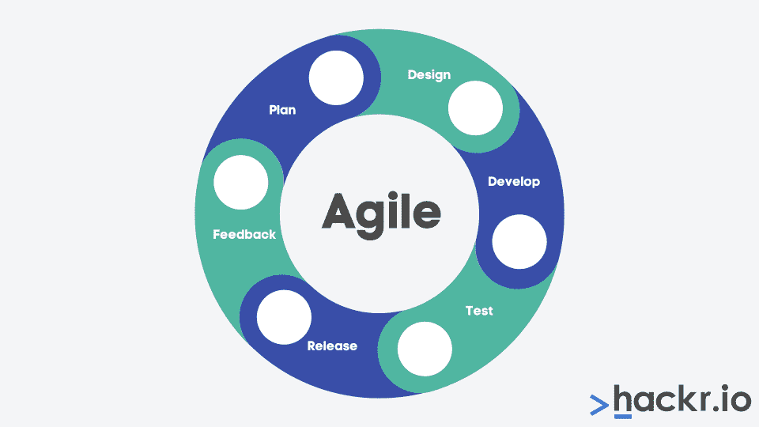
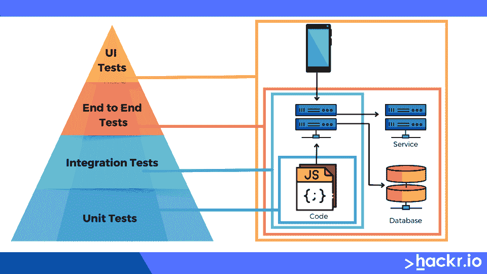

# 2023 年你需要具备的 15 项 Java 开发人员技能

> 原文：<https://hackr.io/blog/java-dev-skills-in-demand>

每个伟大的 Java 应用程序的核心都是伟大的 Java 开发人员。拥有创建健壮和高质量应用程序的技能和培训的 Java 开发人员需求量很大。

无论你是一个希望进入这个领域的初学者，还是一个考虑转向 Java 的有经验的专业人士，你都需要一些 Java 开发人员的技能来获得成功。

## Java 开发人员受欢迎吗？

随着新技术的出现，Java 开发人员的市场在不断增长，企业也继续依靠技术来扩大自己的影响。

这非常适合具有多种技能的 Java 开发人员，例如面向对象编程、数据库设计、代码优化，以及独立工作或作为团队成员工作的能力。

如果您想从事 Java 开发，现在是学习必要技能和技术的绝佳时机。

## 如何成为一名优秀的 Java 开发人员？

伟大的 Java 开发人员没有正确的版本，因为每个人都有自己独特的优势和能力。

然而，成功的一些基本素质包括强大的技术技能、出色的沟通、团队合作、关注细节以及通过不断学习适应的意愿。

你也可以通过上课、参加研讨会和会议，以及在日常工作之外从事个人项目来发展自己的技能。

这个职业的好处是多方面的，从创造有价值的东西的满足感到高需求带来的经济回报。

**刚接触 Java，但不确定从哪里开始或学习什么？看看这些** [**Java 教程**](https://hackr.io/tutorials/learn-java)

## 【Java 开发人员的基本技能

### **1。JDBC 和 SQL**

作为一名 Java 开发人员，您应该致力于对结构化查询语言(SQL)和 Java 数据库连接(JDBC) API 的深入理解。有了这些技能，您将能够与数据库交互、执行查询和检索数据以供应用程序使用。

SQL 和 JDBC 技能是 Java 开发人员中最热门的，因为它们允许您通过数据库以强大的方式存储、组织和操作数据。

这些技能对于开发允许用户访问数据库数据或解决数据库问题的程序也很有帮助。您还可以使用这些技能来提高应用程序的性能和可靠性。

### **2。使用最新的 Java 版本**

Java 版本经常变化，所以 Java 开发人员需要保持最新的版本和发布。

保持当前最新的 Java 版本表明您对自己的技术进行了投资，并为自己的工作感到自豪。您还可以利用最新的功能和错误修复。

然而，在每个新版本中更新您的开发环境和构建工具是非常耗时和昂贵的。您可能还会发现一些依赖项与最新版本不兼容，这可能会引起麻烦。

根据我们的经验，我们发现最好与主要的 Java 版本保持同步(例如， [Java 8](https://hackr.io/blog/java-8-features) ，9，10 等)。)并在每个主要发布周期后更新到最新的次要版本(例如 8u162)。

这使您可以利用新功能和错误修复，而不会出现兼容性问题。当然，这只是一个总的方针；根据您的需求，您的里程可能会有所不同。

### **3。核心技能(面向对象编程、数据结构&算法)**

作为一名 Java 开发人员，对核心编程概念，如面向对象编程、数据结构和算法有深刻的理解是非常重要的。

通过掌握这些概念，您将能够编写具有高级功能的健壮的应用程序，在敏捷团队中有效地工作，并跟上最新的开发趋势和最佳实践。

### **4。Java 框架&库**

Java 框架和库对于 Java 开发人员来说是必不可少的，因为它们使得构建具有各种特性的复杂应用程序变得更加容易。

无论您是在开发 web 应用程序、移动应用程序还是桌面软件，都可能有一个库或框架可以简化开发过程并提高代码质量。

这些通用框架可以帮助您更快地构建健壮的应用程序。

1.  **Spring:** 构建 web 应用和服务。提供了几个强大的工具，包括依赖注入和模型-视图-控制器(MVC)架构
2.  **Hibernate:** 管理关系数据库中的数据
3.  **Spring Boot:** 构建于 Spring 之上，可用于创建微服务、RESTful APIs 和生产就绪应用程序
4.  Struts: 简化了创建 web 应用程序、用户界面、web 服务和管理 web 内容的过程

### **5。JavaFX**

JavaFX 是一个流行的平台，用于创建丰富的交互式 web 应用程序，这些应用程序可以在不同的设备和平台上完美地工作。

无论您是为移动设备、桌面计算机还是 web 进行开发，了解 JavaFX 是一项 Java 技能，它将确保您的应用程序具有吸引力、直观性和用户友好性。

JavaFX 技能主要用于 web 开发或软件设计角色，但是学习如何使用这个平台可能会在 Java 开发的许多领域对您有所帮助。

### **6。敏捷方法学**

****

作为一名 Java 开发人员，无论是通过 Scrum、看板还是其他敏捷方法，在敏捷的工作环境中有效地工作是至关重要的。

通常，你会在开发期间学到这些技能，因为具体细节会根据你公司偏好的[敏捷方法](https://hackr.io/blog/what-is-agile-methodology)而有所不同。

但是一般来说，在敏捷团队中工作意味着擅长收集需求、区分任务的优先级、与他人合作、高效地编写干净的代码、彻底地测试您的代码，以及与利益相关者迭代地工作以确保最终产品满足他们的需求。

精通一些最流行的 Java 开发工具是必不可少的。

*   **Eclipse IDE:** 编写、调试和测试代码
*   Maven: 管理大型项目的依赖关系
*   **Git:** 版本控制软件跟踪你的代码变更
*   Jenkins: 自动化测试和部署流程的持续集成软件

**申请 Java 开发人员职位？准备好这些**

**[Java 面试题](https://hackr.io/blog/java-interview-questions)**

## **高级 Java 开发人员技能**

### **8。多线程&并发**

多线程涉及同时执行多个线程。并发性是同时、顺序或并行运行多个进程的能力，但总是具有非零进度。

假设你想学习 Java 开发人员必备的技能。在这种情况下，这些是必不可少的，因为它们允许您创建同时执行多个任务的应用程序，这对于处理大量数据或处理繁重的工作负载来说是至关重要的。

### **9。设计模式**

设计模式是常见软件开发问题的可重用解决方案。

作为 Java 开发人员，熟悉这些设计模式可以帮助您识别问题并选择正确的解决方案。一些常见的设计模式包括单例、观察者和工厂方法。

### 10。高级 Java

并发性、网络编程、分布式计算和数据存储等高级 Java 概念对于开发满足企业和组织需求的高可伸缩性软件至关重要。

有了这些抢手的 Java 技能，当你成为一名成功的 Java 开发人员时，你也能得到最好的工作。

### **11。阿帕奇 Tomcat &码头网络服务器**

使用 Apache Tomcat 和 Jetty 等流行 web 服务器的经验肯定会帮助您成为一名成功的 Java 开发人员。

这些工具允许您快速、轻松地部署 Java web 应用程序，而无需依赖第三方服务或软件。它们还为您的 web 应用程序提供了管理界面。

### **12。大数据概念&技术**

随着我们产生的数据量继续呈指数级增长，企业越来越依赖大数据技术。

对大数据概念及其流行技术的深刻理解将使您能够有效地处理大量数据，并使用它们来创建创新的应用程序和产品。

*   **Apache Hadoop:** 面向大数据分布式存储和处理的开源框架

*   Apache Spark:快速处理大数据工作负载的开源框架

*   Kafka:面向实时大数据的开源分布式事件流框架

### 13。单元测试

一种流行的单元测试方法是测试驱动开发(TDD)。这个过程要求你在任何生产代码之前编写自动化测试，然后你会遵循一个红/绿/重构的循环。

TDD 要求开发人员从失败的测试开始，然后编写足够的代码来通过测试。然后，开发人员逐步改进、重构和添加代码，同时检查测试失败和边缘案例。

### **14。雅加达 EE(原 Java 企业版)**

Jakarta EE，以前的 Java Enterprise Edition，是一个基于 Java 的框架，非常适合创建应用程序间通信的 API，非常适合基于云的微服务、容器和编排。

在以前的形式中，Java EE 主要用于在企业范围内创建可伸缩的 web 应用程序，这对于根深蒂固于 Java EE 框架的组织来说仍然是可能的。

*   **Jakarta servlet:**HTTP 请求和响应的服务器端处理

*   **Jakarta Faces:** 可重用组件构建 web 应用用户界面

*   **Jakarta RESTful Web 服务:**使用 REST 架构创建 Web 服务的 API

### 15。Linux 操作系统& Windows 服务器环境

Linux(基于 Unix)操作系统和 Windows 服务器环境是许多应用程序运行的主要平台。

对操作系统各个方面的深刻理解将有助于您管理项目，并确保您的代码在不同系统之间是兼容的。

*   **文件系统:**文件系统配置、数据组织和存储、权限管理和网络文件系统的知识
*   **联网:**通过 SSH、SFTP、FTP、TCP/IP 等各种协议远程连接&机器，设置防火墙，加密敏感数据进行网络传输
*   **命令行&外壳脚本:**自动执行任务，执行系统维护，解决系统问题

## **Java 开发人员技能总结:基础到高级**

| **Java 开发人员技能** | **概述** |
| JBDC 和 SQL | 将数据存储、组织和操作到与应用程序交互的数据库中 |
| 面向对象编程 | 将数据组织成可重复使用的类，这些类是“对象”的蓝图 |
| 数据结构和算法 | 为众所周知的编码问题开发适当的解决方案，并实现合适的数据结构 |
| 框架和库 | 借助针对特定目的优化的预构建代码，加快应用程序开发 |
| JavaFx | 开发可以在多个平台上运行的丰富的 web 应用程序和桌面应用程序 |
| 敏捷方法 | 收集需求，区分任务的优先级，并与其他人合作编写和测试干净的代码 |
| 开发工具 | Eclipse IDE 用于编码，Git 用于版本控制，Maven 用于依赖项，Jenkins 用于 CI |
| 多线程和并发 | 创建同时执行多项任务的应用程序 |
| 设计模式 | 识别常见的编码问题并应用常见的模式(单例、观察者、工厂) |
| Apache Tomcat 和 Jetty Web 服务器 | 快速部署 web 应用程序，无需依赖第三方服务或软件 |
| 大数据概念和技术 | 用于处理大数据(分布式和实时)的 Apache Hadoop、Apache Spark 和 Apache Kafka |
| 单元测试 | 在任何代码之前编写自动化测试(失败优先)。应用红色/绿色/重构循环 |
| Jakarta EE | 为基于云的微服务和容器创建 API，或者创建 web 应用程序 |
| Linux 操作系统和 Windows 服务器 | 管理文件系统、网络和实现外壳脚本 |

## **有 Java 技能可以应聘哪些工作？**

### **1。Java 开发者**

Java 开发人员是做什么的？嗯，你将负责编写和测试满足你正在进行的项目需求的代码。您可能还需要与其他团队联系，以确保代码与系统的其余部分适当地集成。

[**平均工资**](https://www.glassdoor.com/Salaries/java-developer-salary-SRCH_KO0,14.htm) **:** $8 万-$ 12.5 万

### **2。软件工程师**

软件工程师类似于 Java 开发人员，他们负责编写和测试代码。然而，软件工程师通常拥有比编码更全面的技能。例如，他们可能参与软件系统的设计和架构。

[**平均工资**](https://www.glassdoor.com/Salaries/united-states-software-engineer-salary-SRCH_IL.0,13_IN1_KO14,31.htm)**:**$ 84000-$ 135000

### **3。开发工程师**

如果你对代码工作感兴趣，但又想远离编码，那么 DevOps 工程师的角色可能很适合你。

DevOps 工程师负责确保代码一经部署就能平稳高效地运行。这包括监控代码性能和识别可能出现的潜在问题。

**:10.5 万-17 万美元**

 **### **4。质量保证工程师**

QA 工程师确保代码在部署之前满足所有必要的质量标准，包括运行测试和编写测试计划。QA 工程师必须对细节有强烈的关注，并有出色的解决问题的能力才能成功。

**:6.6 万美元-10.3 万美元**

 **### **5。技术作家**

不是每个拥有 java 开发技能的人都想成为一名程序员。如果你更喜欢文字工作，考虑成为一名技术作家。

作为一名技术作家，你将负责创建解释代码如何工作以及如何正确使用代码的文档。这份工作需要优秀的沟通技巧和对技术概念的深刻理解。

**:5.3 万美元-8.6 万美元**

 **## **你今天可以申请的最热门的 Java 工作**

你知道 Hackr.io 有一个工作平台，你可以在那里申请世界各地数百个技术职位吗？

这里有一些目前可用的工作的例子(在写作的时候)。没有适合你的职位吗？

[查看完整的 Hackr.io 工作板](https://jobs.hackr.io/)

## **软件工程师，Java，苹果，奥斯汀**

苹果的合作伙伴解决方案团队正在寻找一名经验丰富的 Java 软件工程师来设计和开发一个高度可扩展、可靠的多租户数字资产管理(D.A.M)解决方案。与跨职能团队合作，您将设计、开发、实施和部署企业级高可用性应用程序。

要申请该职位，至少需要八年设计和开发可扩展企业级解决方案的经验，以及 D.A.M 系统的知识和经验，并对使用 Java/J2EE、Java 框架和 Linux 的 web 应用程序开发以及框架和模式的应用程序有扎实的理解。

[**在这里**](https://jobs.hackr.io/job/software-engineer-java-5-at-apple-2?source=article) **获得这个角色的全部细节。**

## **纽约摩根士丹利的 Java 开发人员**

摩根士丹利正在迅速改变做生意的方式，正在寻找一位经验丰富的 Java 开发人员加入这个团队。你将作为全球敏捷开发团队的一员，帮助团队设计和开发一个现代技术栈，为摩根士丹利的数字平台提供动力。您将使用现代编码和测试标准设计和开发现代的模块化应用程序，并参与敏捷仪式，积极地朝着团队的目标前进。

需要四年的经验，以及开发企业 Java 应用程序的经验。

[**在这里获得这份工作的完整说明**](https://jobs.hackr.io/job/java-developer-4-at-morgan-stanley-2?source=article) **。**

## **San Mateo Roblox 基础设施基础软件首席软件工程师**

Roblox 正在聘请一名首席高级工程师来推动基础工具系统的发展和变革，该系统管理着数百万私有和公共基础设施资源，每月支持数亿用户。您将开发突破性的工具和 API 解决方案，帮助团队和系统扩展以满足爆炸式增长，解决重要问题并通过根本原因分析和自动化防止其再次发生，以及创建、影响和改进开发平台、基础设施、标准和方法，以确保可扩展性和高可用性的目标。

要求计算机科学或相关工程领域的学士学位(或同等专业经验)，以及至少五年的实践经验。还需要具备 Go、Node.js、Python、Java 等多种编程语言的经验。

[**在这里得到所有细节**](https://jobs.hackr.io/job/principal-software-engineer-infrastructure-foundation-software-1-at-roblox-2?source=article) **。**

## **结论**

随着技术的发展，企业越来越依赖技术，Java 开发人员的需求比以往任何时候都大，无论是在大数据、游戏开发、Android 应用开发还是 DevOps 领域，不一而足。

[Java 编程大师班更新到 Java 17](https://click.linksynergy.com/link?id=jU79Zysihs4&offerid=1045023.533682&type=2&murl=https%3A%2F%2Fwww.udemy.com%2Fcourse%2Fjava-the-complete-java-developer-course%2F)

所以，如果你是一个有抱负的开发人员，或者是一个在另一种语言方面有经验的专业人员，想要改变，特定的 Java 开发人员技能对你的成功至关重要。

本文概述了 Java 开发人员所需的一系列技能，从 SQL 的基础知识到 Jakarta EE 的高级开发。无论你的目标是什么，在 2023 年投入时间学习这些基本技能是让自己成为一名利润丰厚的 Java 开发人员的最佳方式。

不熟悉编码，或者想将 Java 加入你的技能组合？查看 [**Java 大师班**](https://www.udemy.com/course/java-the-complete-java-developer-course/)

**正在寻找你梦想中的 Java 工作吗？检查一下**

[Hackr.io 工作板](https://jobs.hackr.io/)

## **常见问题解答**

#### **1。一个初级 Java 开发者应该知道什么？**

初级 Java 开发人员应该在编程基础方面有很强的基础，包括像类和对象这样的高级概念。他们还应该能够在团队中有效地工作，与其他开发人员清楚地沟通，并对任务进行优先排序以满足最后期限。

#### **2。Java 有前途吗？**

是啊！毫无疑问，Java 有一个光明的未来。随着在开发人员中的普及，各种各样的工具和资源，以及软件开发的强大生态系统，它将继续成为 2023 年最受欢迎的编程语言之一。

#### **3。谁是优秀的 Java 开发人员？**

没有“合适的”类型的人能成为优秀的 Java 开发人员。典型地，一个成功的 java 开发人员有很强的技术能力，在团队中工作的能力，优秀的沟通和协作能力，以及快速学习新概念的能力。任何其他编程语言的额外经验也是一个很大的优势。******