# 2023 年使用的 10 个最佳 Java 框架[更新]

> 原文：<https://hackr.io/blog/java-frameworks>

Java 是一种健壮的语言，当与框架结合时，Java 可以为任何领域提供最佳的解决方案，无论是电子商务、银行、云计算、金融、大数据、股票市场、it 还是更多。

如果你刚刚开始使用 Java，请看这篇博客中的 [Java live in action](https://hackr.io/blog/what-is-java) ，它将带你了解开始使用**框架**所需的所有重要概念。

## 什么是 Java 框架？

作为模板或框架的预写代码体，开发人员可以使用它来创建应用程序，并根据需要填充他们的代码，使应用程序按照他们的意图工作，这被称为框架。框架的重用使开发人员能够编写他们的应用程序，而不需要从头开始创建每一行代码的人工开销。Java 框架是特定于 Java 编程语言的，用作开发软件应用和 Java 程序的平台。

Java 框架可以包括用于处理、输入和管理硬件设备以及与系统软件交互的预定义类和函数。这取决于框架的类型、程序员的技能水平、他们想要完成的任务以及他们的偏好。

## 为什么是框架？

框架为你的应用程序提供了一个结构。例如，如果我们有一个合适的测试框架，我们可以自动化很多事情，并获得准确和一致的结果。如果有 ORM、web 应用程序、日志、数据管理等框架，也是如此。它将使开发人员的生活变得简单，并帮助他们更专注于业务逻辑，而不是担心跨域或应用程序使用的公共代码。

## 10 个最佳 Java 框架

虽然有很多基于 Java 构建的框架，但是这里有一些非常常用的不同类型的框架——[web 应用](https://hackr.io/blog/web-application-architecture-definition-models-types-and-more)，网络应用，日志，测试，ORM 等。请注意，每种方法都有自己的优点，最适合不同的业务用例。我们不能说哪个更好，因为它们在不同的场景中都是好的。

### 1.春天

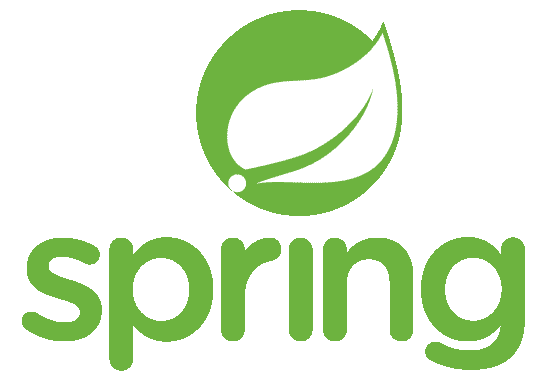

凭借其依赖注入的概念和面向方面的编程特性，Spring 席卷了开发界。它是一个用于企业应用程序的开源框架。

使用 Spring，开发人员可以创建松散耦合的模块，其中的依赖关系由框架处理，而不是依赖于代码中的库。

Spring framework 包罗万象，涵盖了包括安全性和配置在内的很多特性，简单易学。此外，由于它是最流行的 web 框架，您可以找到大量的文档和活跃的社区。

配置好一切后，您的代码将变得清晰易懂。

#### 主要概念:

*   依赖注入(DI)(控制反转)——在这个原则中，不是应用程序顺序控制流程，而是将控制交给驱动流程的外部控制器。外部控制器是事件。当一些事件发生时，应用程序流继续。这为应用程序提供了灵活性。在 Spring 中，IoC 由 DI 完成，有三种类型——setter 注入、方法注入和构造函数注入。
*   bean 和 Spring 上下文——在 Spring 中，对象被称为 bean，有一个 BeanFactory 来管理和配置这些 bean。您可以将 beansfactory 视为实例化、配置和管理 bean 的容器。大多数应用程序使用 xml (beans.xml)进行配置。ApplicationContext 是 BeanFactory 的超集，用于需要事件传播、声明性机制以及与 Spring 的面向方面特性集成的更复杂的应用程序。
*   在这里阅读更多主要的弹簧概念。

### 2.支杆

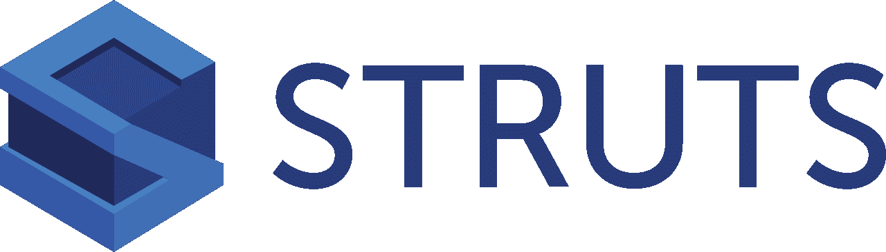

Apache Struts 是 web 应用程序的另一个健壮的开源框架。它遵循 MVC(模型-视图-控制器)模型，并扩展了 JSP API。在传统的 servlet-JSP 方法中，如果用户提交一个包含他的详细信息的表单，那么信息将被传递给 servlet 进行处理，或者控制权将被传递给下一个 JSP(Java Server Pages——您可以在这里用 HTML 编写 Java 代码)。这对于复杂的应用程序来说变得令人困惑，因为“视图”或表示层在理想情况下不应该有业务逻辑。

Struts 将视图、控制器和模型(数据)分开，并通过配置文件 struts-config.xml 提供它们之间的绑定。

控制器是一个 ActionServlet，您可以在其中为视图编写模板，并且使用 ActionForm JavaBean 维护用户数据。动作对象负责转发应用流。

视图由一组丰富的标记库维护。

Struts 易于设置，并且比仅使用 servlets 和 JSP 的传统 MVC 方法提供了更多的灵活性和可扩展性。这可能是你作为一名网页开发者的一个很好的起点。

### 3.冬眠

尽管 Hibernate 不是一个全栈框架，但它完全改变了我们看待数据库的方式。Java 持久性 API (JPA)的实现，Hibernate 是一个用于 Java 应用程序的对象关系映射(ORM)数据库。就像 SQL 一样，Hibernate 中的查询被称为 HQL (Hibernate Query Language)。

Hibernate 直接将 Java 类映射到相应的数据库表，反之亦然。

hibernate 中的主文件是 hibernate.cfg.xml 文件，该文件包含有关将 Java 类与数据库配置进行映射的信息。

Hibernate 解决了 JDBC 的两个主要问题——JDBC 不支持对象级关系，如果您决定迁移到不同的数据库，旧的查询可能无法工作——这意味着大量的更改——即时间和金钱！

Hibernate 提供了一个抽象层，因此代码与数据库是松散耦合的。像建立数据库连接、执行 CRUD 操作之类的事情由 Hibernate 负责——所以开发人员不需要实现这些，从而使代码独立于所使用的数据库。

从[这些初级和高级课程](https://hackr.io/tutorials/learn-hibernate-framework?ref=blog-post)中选择一门或多门，以获得 Hibernate 和 JPA 的完整概述。

### 4.阿帕奇检票口

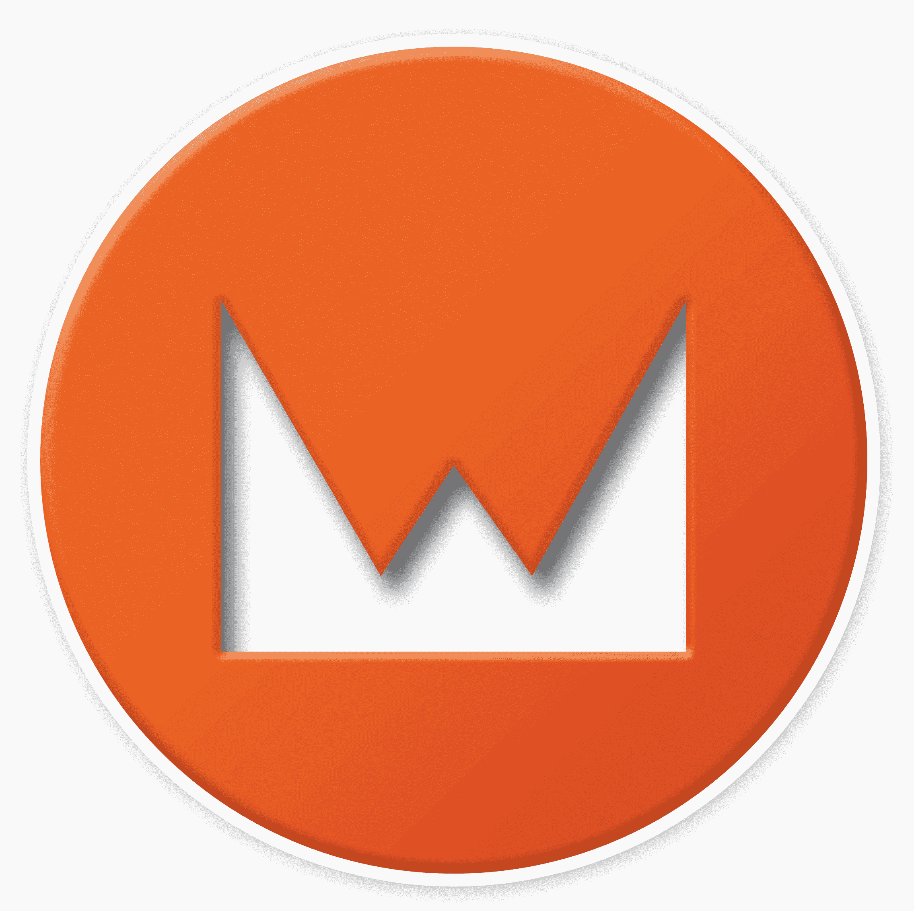

如果您已经使用过 JSP，那么学习 wicket 将会很容易。一个简单的 Java web 框架，Wicket 有一个面向组件的结构，你需要知道的只是 Java 和 HTML。绝对没有 XML 或配置文件！

Wicket 的主要特性是它的 POJO 模型，其中的组件是具有 OOP 特性的简单(普通的)Java 对象。这些组件与图像、按钮、表单、链接、页面、容器、行为等捆绑在一起，作为可重用的包，以便开发人员可以定制它们。

Wicket 是轻量级的，您可以非常快速地构建应用程序。对用 Wicket 编写的代码进行单元测试也很容易。

### 5.JSF (Java 服务器接口)

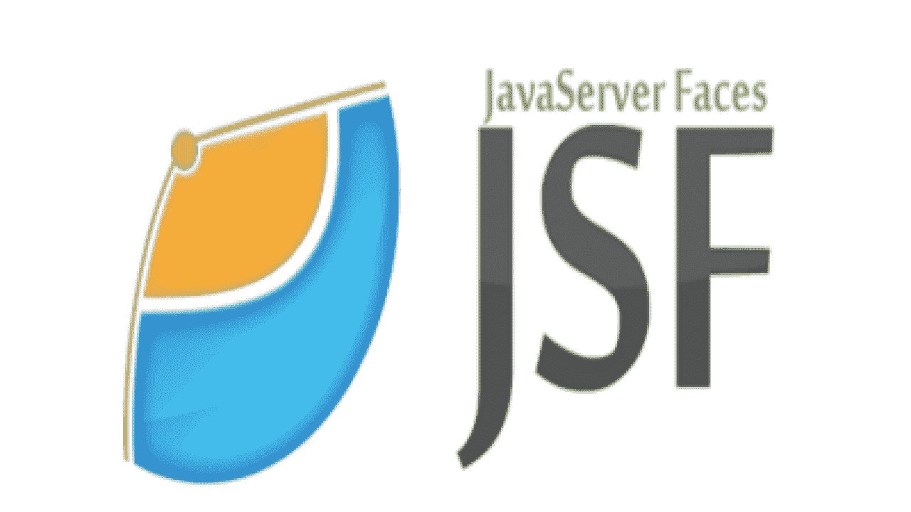

不要把 JSF 和 JSP 混淆，JSP 只是一个可以有静态和动态内容的文本文档。JSF 由 Oracle 开发，是 Java 企业版 7 的一部分。

它是一个基于组件的 MVC 框架，为基于服务器的应用程序提供了可重用的 UI 组件。主要思想是封装各种客户端技术，如 CSS、JavaScript 和 HTML，这将允许开发人员在不深入了解这些技术的情况下创建 UI。他们只需拖放 UI 组件，就可以更专注于他们的表示层细节。

JSF 的默认模板系统是 FaceLets。JSF 与 Struts 非常相似。

JSF 可以进一步与支持 Ajax 的组件无缝集成，通过添加用于验证和方法调用的 AJAX 事件来丰富用户体验。

查看 LinkedIn 课程以了解更多关于 JSF 的信息。

### 6.下拉向导

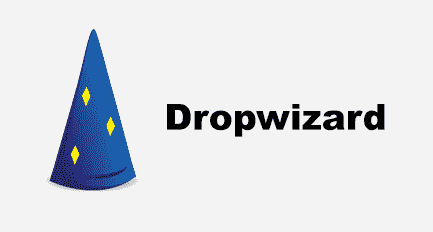

另一个名副其实的 Java 框架——向导。这个轻量级框架让您可以非常快速地完成您的应用程序，因为它提供了对高级配置、日志记录、应用程序指标等的现成支持。您可以创建性能高、稳定可靠的 RESTful web 应用程序。

Dropwizard 特别神奇，因为它将 Jetty、Guava、Jersey、Jackson 和 Metrics 等 Java 生态系统中的许多库整合到一个框架中，为您提供了一个轻量级的精简应用程序。

由于所有配置、安全性和性能相关任务都有集成的库，所以作为开发人员，您需要做的就是构建您的业务逻辑。

Dropwizard 是一个与库捆绑在一起的开源框架，您可以使用 Eclipse IDE 轻松设置它，并创建一个简单的项目来学习(相信我，您可以自己学习 Dropwizard！).Dropwizard 网站上的基础教程将帮助您完成每个步骤。

### 7.Grails

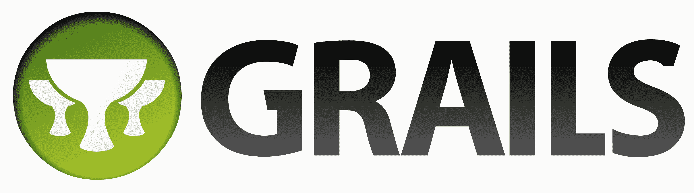

Grails 是一个简单易学的全栈框架，非常适合那些刚刚开始编程生涯的人。虽然 Grails 是用 Groovy 编程语言编写的 web 框架，但它运行在 Java 平台上，并且与 Java 语法完全兼容。该框架基于 MVC 设计模式。

Groovy 类似于 Java，与 Java 相比，它增加了更多的特性。如果你已经知道 Java，学习 Groovy 是非常容易的。

类似于 JSP，在 Grails 中，呈现技术是 GSP (Groovy 服务器页面)。在 Grails 中为视图创建标记既简单又容易。它还使用了 GORM，您可能已经猜到这是 Grails 中使用的 ORM 实现。也可以直接用 Hibernate 代替 GORM。Grails 内置了对 RESTful APIs 的支持，因此创建这样的服务很容易。

最好的部分来了——您可以将现有的 java 代码与 Grails 集成。如果您的应用程序中混合了 Groovy 和 Java 代码，它会工作得很好！

学习 Grails 的最佳方式是使用任何 Java IDE(如 Eclipse、NetBeans 等)建立自己的开发环境，并按照这些教程中的任何一个来构建自己的第一个 web 应用程序。

### 8.ATG

ATG 是一个用 Java 编写的网络商务平台。它是一个可定制和可配置的框架，对于电子商务相关的网站尤其有用。该产品归 Oracle 所有，支持复杂而庞大的 B2B 和 B2C 应用程序。然而，对于小规模的应用来说，这可能是昂贵的。如果你正在开发电子商务网站，ATG 是一个很好的学习框架，将丰富你的技术和领域知识。

ATG 平台可以在三个服务器上运行——Oracle Weblogic、IBM Websphere 和 JBoss。

该框架有 3 个主要层——

*   **Dynamo 应用框架—**它是提供基于 JavaBeans 和 JSP 的开发环境的基础层。所有常见功能都有标准的 ATG 类，甚至可以通过配置文件链接组件 beans 来创建和组装定制的 Java 代码。
*   **个性化模块–**这是为每个用户动态定制内容的地方。该模块有助于控制和维护定义向特定用户显示什么内容的用户配置文件和业务规则。这一层也支持有针对性的电子邮件。
*   **场景模块–**该模块通过引入时间敏感、事件驱动的活动来管理一段时间内网站访问者与内容之间的交互，从而进一步增强了个性化模块的功能。例如，限时优惠、针对特定会员的独家交易等…

ATG 是一个广泛的框架，你需要时间和耐心来学习它。一些大公司，如沃尔玛、梅西百货、百思买、ASDA 等等，都把他们的网站建在了 ATG。

### 9.玩

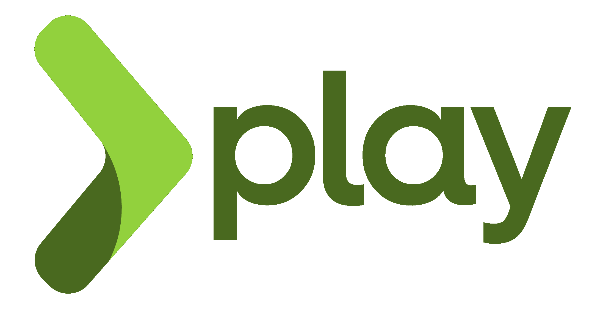

Play 是一种稍微传统和独特的框架类型，它遵循传统胜于配置的方法。它基于 MVC 模式，是一个开源的 web 应用程序框架。除了 Java，你还可以用 Scala 编写 Play web 应用。

Play 类似于 Django 或 Ruby on Rails 或 ASP.NET 架构，不一定遵循 J2EE 网络标准。

游戏的一些特点是

*   异步处理带来的高性能
*   没有容器，没有状态，建立在反应性原则上
*   使用静态类型的语言，所以大多数错误在编译时被捕获，在开发生命周期的早期避免了许多错误。
*   Scala 探索了真正的 OOP 以及一些函数式编程概念。它与 Java 的兼容性造就了一个优秀而强大的系统。
*   在 Play2 中，发布了一个新的强大的构建系统 sbt，它使得与 Maven 项目集成以及创建简单的 JAR 文件变得容易。
*   内置了用于常见功能的大量关系数据库访问库。

### 10.Apache Hadoop

虽然 Apache Hadoop 不是一个全栈框架，但它提供了一个软件框架，并在 MapReduce 编程模型上工作。这些实用程序可以轻松处理海量数据(大数据)，存储、分析和处理它们，以提供更快、更高效的结果。

我将 Hadoop 包括在这个列表中，因为它是当今大数据日益突出的“事物”。

Hadoop 使用主从设计模式来帮助分布式数据存储和处理。主节点(即 NameNode)的 Hadoop HDFS (Hadoop 分布式文件系统)层有数据节点。MapReduce 层有 JobTracker 和 tasktracker。从节点分别有数据节点和任务跟踪者。

HDFS 将文件分成一组数据块，这些数据块在整个群集内复制。

如果您想熟悉大数据和数据科学，Hadoop 是您的起点。通过[这些教程](https://hackr.io/tutorials/learn-hadoop-big-data?ref=blog-post)轻松学习 Hadoop。

## 额外的 Java 框架

### 11.总重量

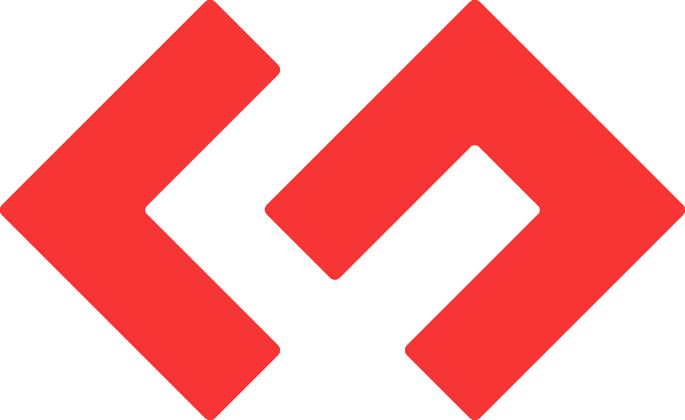

Google Web Toolkit (GWT)显然是由 Google 创建的一个框架，用于用 Java 创建富互联网应用程序。GWT 最好的特性之一是它将 Java 代码转换成 JavaScript 代码——这也是基于浏览器的定制代码。我个人喜欢这个功能，因为在开发期间，我们以前会在浏览器测试上花费大量的时间和精力。有了这套开源工具，我们可以在更短的时间内编写出高性能的 web 应用程序。如果你已经有一个代码库，你可以很容易地将它与 GWT 集成，因为 GWT 与 Eclipse IDE、Maven 和 Junit 也是兼容的。该框架还提供了广泛的小部件库，可以执行大多数任务，即使是 Java 初学者也可以轻松开发业务逻辑，而不必太担心基本的东西。GWT 框架有 3 个主要组件 Java 到 JS 编译器、位于核心 JRE 库之上的 JRE 仿真库，以及包括 UI 组件、历史管理和许多其他功能的 GWT UI 构建库。

从这里开始[学习 GWT](http://www.gwtproject.org/gettingstarted.html)。

### 12.我坚持

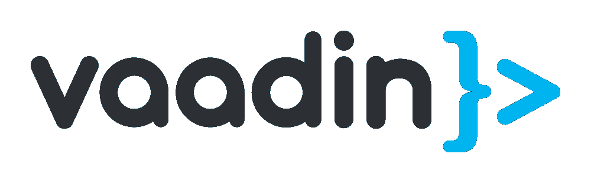

Vaadin 是一个旗舰产品，也是一个开发人员可以使用 Java 实现 HTML5 web UI 的平台。它是一个开源平台，包括 Java web 框架和一组 web 组件，以及应用程序启动器和工具。这些 web 组件构成了 Vaadin 的核心，可以定制，从而为桌面和移动应用程序带来高性能和通用代码。

Vaadin 流是 Vaadin 平台的实际 Java 框架部分，负责客户端-服务器通信以及路由。有了 Vaadin flow，您可以完全用 Java 编写 web 应用程序，而无需使用 JS 或 CSS。UI 组件使用浏览器和服务器之间的自动通信来处理用户的浏览器活动。您可以轻松地将 Vaadin 组件集成到您正在使用的任何 IDE 中，而且它是一个跨平台的框架，因此无需担心将代码迁移到不同的平台。

这是一种全新的构建 Java 应用程序的方法，这样您就可以专注于表示层，而不必担心客户机-服务器通信。它还有数据绑定 API，使用类型安全的 Java 代码和抽象层将 UI 组件映射到数据库，这样您就可以使用 HTML 模板和 Java 在 UI 中构建可重用的组件。

### 13.火花

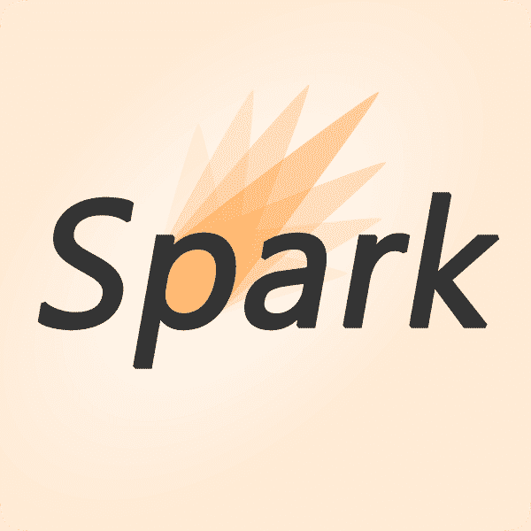

Apache 的另一个杰作 Spark 是一个开源的 web 开发框架，它具有与 Spring、Play 和 JAX-RS 相似的功能，但功能更强大，并且不遵循传统的 MVC 设计模式。

它是一个微观框架，是一种专注于开发速度的领域特定语言。它需要很少的配置和编码。由于内存计算，它在数据处理方面比 Hadoop 快 10 倍。Spark 是一个完全动态的框架，支持惰性初始化和实时数据处理。

它也很容易与 Scala 和 R 集成，这是专注于数据科学和大数据的编程语言。Spark 的主要目标是处理海量数据，同时支持 SQL 查询、机器学习和图形算法的高级分析。

不要认为 Spark 可以取代 Hadoop——它可以是 Hadoop 提供的功能的扩展——如果你进入数据科学领域，学习这两个框架将使你比其他人更有优势。

### 14.OpenXava

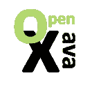

一个以快速方式开发 web 应用程序的低代码平台，您可以在创纪录的时间内启动并运行您的业务应用程序。它由业务组件组成，使得开发人员轻松轻松地构建复杂的应用程序。真正意义上的可扩展、可定制和面向对象，OpenXava 使用 Java 类作为其核心来建模业务问题。这种模型驱动的开发方法确保了封装。开发人员只将模型定义为普通的注释 Java 类，并且必要的功能都是在运行时生成的。

OpenXava 的结构和理念遵循业务组件架构，而不是传统的 MVC 架构。在这里，一切都是一个业务概念，所有对某个业务概念有贡献的工件都在同一个地方，无论是相关的视图、模型还是控制器。

在你学习这个框架之前，你一定要阅读这个语言背后的概念。

### 15.垂直。X

Vert.x 由 Eclipse 开发，是一个事件驱动的应用程序框架，使用了许多语言，如 Java、JS、Groovy、Scala 等等。因此，它在本质上是多语言的。它依赖于异步编程模型，从而使应用程序无阻塞且不受多线程限制。

Vert.x 更像是一个工具包，提供多种语言的 API 来执行所有 web 应用程序需要的异步任务——日志记录、身份验证、监控、数据库连接、多集群支持等。Vert.x 中有两个主要概念——

*   **vertical–**就像任何其他异步模型一样，有一个事件循环，其中包含消息、网络缓冲区、HTTP 请求等事件。事件循环中的每个事件都由 Verticle 处理。
*   **事件总线–**不同的垂直部门使用事件总线相互通信。这是通过异步消息传递完成的。事件总线可以执行不同类型的消息传递，如点对点、广播和请求-响应。

Vert.x 最大的优点是它的非阻塞特性，这使得 web 应用程序具有很高的性能。该框架可用于任何应用程序，无论是小型、中型还是大型。如果您已经了解 Node.js，您将会更加欣赏 Vert.x，因为它拥有 Node.js 的所有功能，加上 Java 虚拟机的优势，这是一个强大而健壮的组合。

### 16.挂毯

从概念上讲，Tapestry 类似于 JSF 和 Wicket。它是一个开源、跨平台、基于组件的 web 应用程序开发框架，可以创建高度可伸缩的应用程序。它建立在丰富的 Java Servlet API 之上，可以在任何容器或应用服务器上工作。Tapestry 是真正的面向对象框架，因为您使用纯 HTML 模板或普通 java 类(对象)创建 HTML 页面。几乎不需要 XML 配置，Tapestry 使用注释，因此代码简单且易于管理。

使用 Tapestry，应用程序的停机时间是最小的，因为即使对 Java 类的任何更改都可以热交换，而不需要重启服务器。Tapestry 还负责 URL 的构造和重定向。与其他框架不同，这里的框架适应代码，而不是相反。

Tapestry 的一些开箱即用的功能是——文件上传、分页、字段验证、日期和日历逻辑、内部化、显示弹出窗口等

将 Tapestry 代码与 Spring、Hibernate 等后端框架集成起来很容易...和测试框架，如 Selenium。

### 17.泽西岛

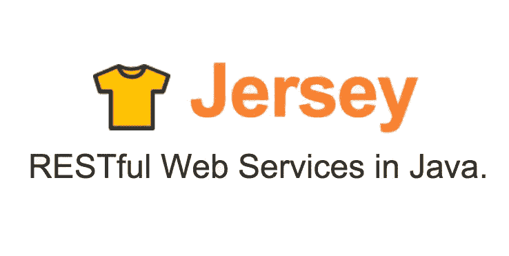

Jersey 是一个 web 服务框架，用于创建 RESTful 服务并支持 JAX-RS API。它通过有用的特性和实用函数极大地简化了 RESTful 服务的开发。Jersey 提供了一种抽象层，因此开发人员不必担心客户端-服务器通信的底层实现，可以专注于主要的 web 服务功能。

与任何其他 RESTful 框架相比，Jersey 的一个显著特点是它允许分块输出，即服务器可以分块或分块向客户端发回响应。当需要发送大量数据，并且可以在准备好整个响应的同时发送数据块时，这非常有用。

Jersey 还配备了简单的测试基础设施。您可以编写主要基于 Junit 的轻量级集成测试。将测试与 Maven 环境集成也很容易。您需要做的就是在 pom.xml 中添加依赖项。

### 18.OSGi

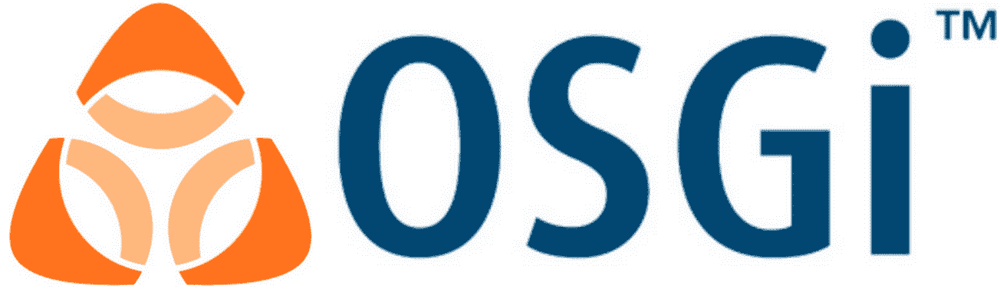

OSGi 或开放服务网关倡议定义了一个基于组件的系统。它是一个流行的 Java 框架，其中每个组件被称为一个 bundle。每个包都有独立的生命周期，不依赖于其他包。把这个包看作是带有特定于 OSGi 的头文件的 jar 文件。捆绑包必须明确声明它们需要访问的包，没有这些包，OSGi 平台将无法启动。

捆绑包使用 JVM 级别的服务注册中心来发现、发布和绑定捆绑包作为服务。这是 OSGi 的精髓——对于一个模块化的应用程序架构来说，它促进了适应性和快速变化，而没有太多的应用程序停机时间(运行时灵活性)。

OSGi 之所以受欢迎，主要是因为它易于与 eclipse 和基于 maven 的项目集成。

OSGi 有一些好的概念和好处，但是由于独立的包，版本可能是一个问题。这可能是使用这个框架的一个主要缺点。然而，在这个框架上投资一些时间是值得的，因为模块化和隔离类加载的好处对开发人员来说是重要的概念。

### 19.流口水

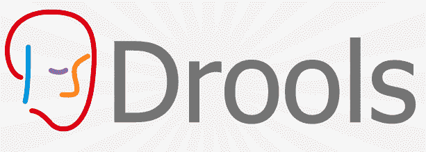

Drools 是一个流行的业务规则管理系统。它有一个业务规则引擎(BRE)、创作、规则管理应用程序以及对决策和符号模型的运行时支持。规则管理应用程序被称为 Drools 工作台。这个项目得到了 RedHat 和 JBoss 的支持。使用 Drools，开发人员可以轻松地将数据与业务逻辑分离开来。Drools 的两个主要步骤是

创作–创建规则文件

运行时——执行规则的地方

Drools 最重要的特性是可以随时删除和添加新规则，而无需重启服务器。

Drools 是依赖于大量条件来实现某种动作的应用程序的合适选择。例如，要检查一个人是否有资格升级他的计划，有一些特定的规则-例如，客户是否存在，客户的账单金额是否大于特定限制等等。这些规则可以定义为决策表，而不是硬编码在代码中。任何更改都不需要另一次构建、完整测试或重新部署！

### 20.米巴蒂斯

作为 Apache 的一款免费软件，MyBatis 是 Java 中的一个持久性框架，其中 Java 方法用 [SQL 语句](https://hackr.io/blog/sql-commands)进行映射，不像 ORM 那样将 Java 对象映射到数据库中的表。映射引擎以声明的方式使用 XML 描述符或注释将 SQL 结果映射到对象树中。

在很多方面，MyBatis 都比 JDBC 和 Hibernate 好。MyBatis 可以[动态生成 SQL 语句](https://github.com/mybatis/mybatis-dynamic-sql)，将它们从代码中分离出来。它还提供查询缓存以方便访问。这个 API 非常简单，您不需要成为 SQL 或数据库专家就能编写 MyBatis 代码。

当您的应用程序不太复杂，并且您希望简单的开箱即用功能(如数据库连接、事务管理、加载数据库驱动程序、管理和释放连接等)由框架完成时，MyBatis 是 Hibernate 和 JDBC 的一个很好的替代品。MyBatis 也可以很容易地与 Spring 框架集成。

### 21\. Apache Mina

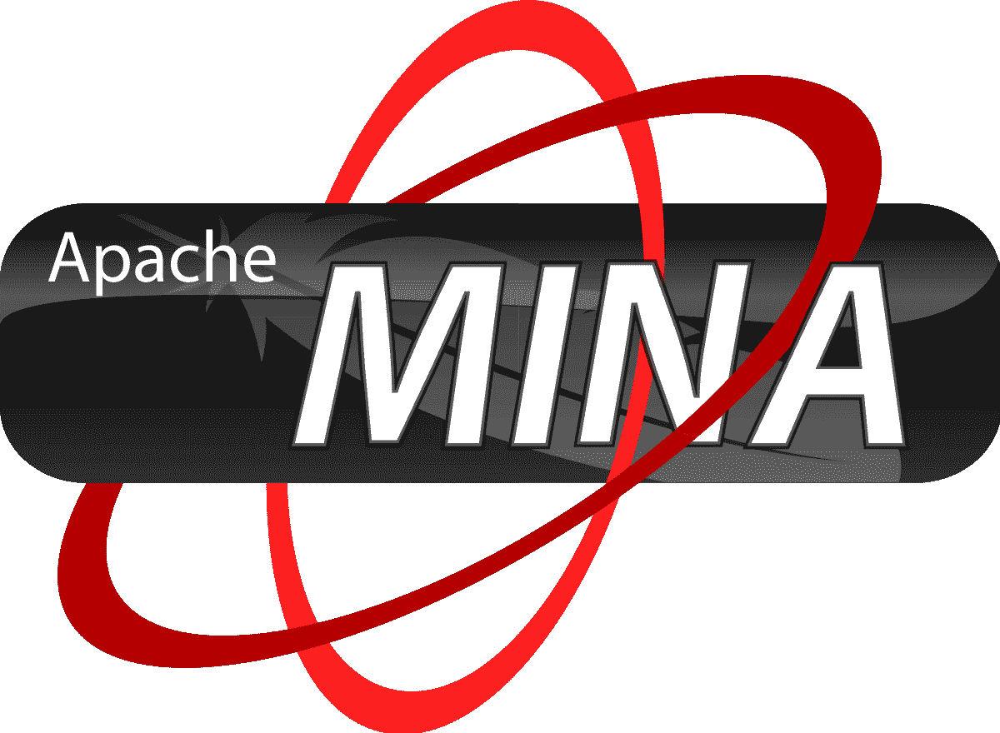

Apache Mina 是一个网络应用程序框架，开发人员可以使用它轻松创建高度可伸缩和高性能的网络应用程序。无论您使用 TCP/IP、UDP、LDAP、NTP、DNS 等，还是自定义协议，Mina 都为所有传输提供统一的 API。该框架可以提供高级和低级网络 API。Mina 完全处理 I/O 操作，帮助开发人员完全专注于业务逻辑和其他应用程序需求。测试在模拟对象的帮助下编写的代码很容易。您可以使用 Eclipse IDE 轻松学习 Mina。它可以与 Spring 和 PicoContainer 等流行框架集成，成为网络应用程序的流行选择。

米娜比肥皂好，更稳定可靠。它有一个丰富的网络库来处理并发线程。

从他们的官方页面了解更多关于 Apache Mina 的信息。

## 结论

还有许多其他 java 框架，它们不是全栈或 web 开发框架，但在每个应用程序中都很有用——比如用于日志记录的 log4j、用于测试的 Junit 和 Selenium 等等。了解这些是很重要的，尽管你可以和上面列表中的其他框架一起学习。

您的应用程序的最佳框架应该满足您的业务需求，提供一定程度的灵活性和最佳性能，并且易于维护和吸收变化。

例如，对于一个[全栈 web 开发框架](https://hackr.io/blog/web-development-frameworks)，如果需要更改某些东西，它应该对应用程序的影响最小，也就是说，您不应该为了小的更改而重新构建和部署应用程序。仅仅一个配置的改变就能创造奇迹。这种应用节省了停机时间并提供了灵活性。

明智地选择 java 框架，享受 Java 提供的特性。

如果你正在学习 Java，那么 udemy 的 [Java 编程大师班](https://click.linksynergy.com/deeplink?id=jU79Zysihs4&mid=39197&murl=https://www.udemy.com/course/java-the-complete-java-developer-course/)课程是一个提升你的 Java 学习曲线的好方法。另外，确保你知道 [Java 框架、文本编辑器和 IDE 之间的区别。](https://programmingmag.com/difference-between-java-framework-text-editor-and-ide/)

**人也在读:**