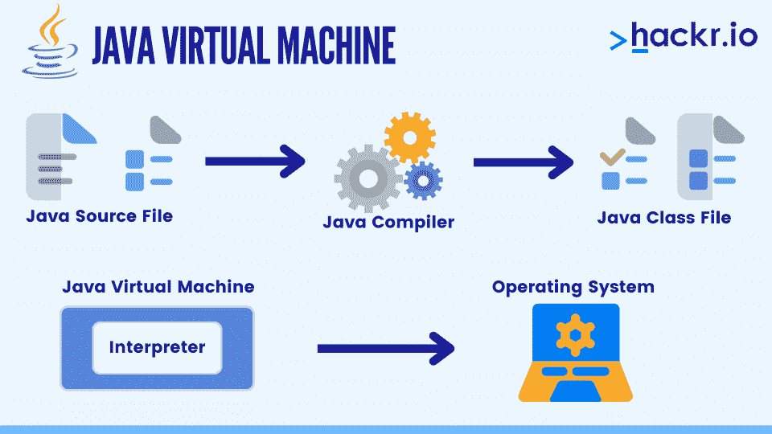
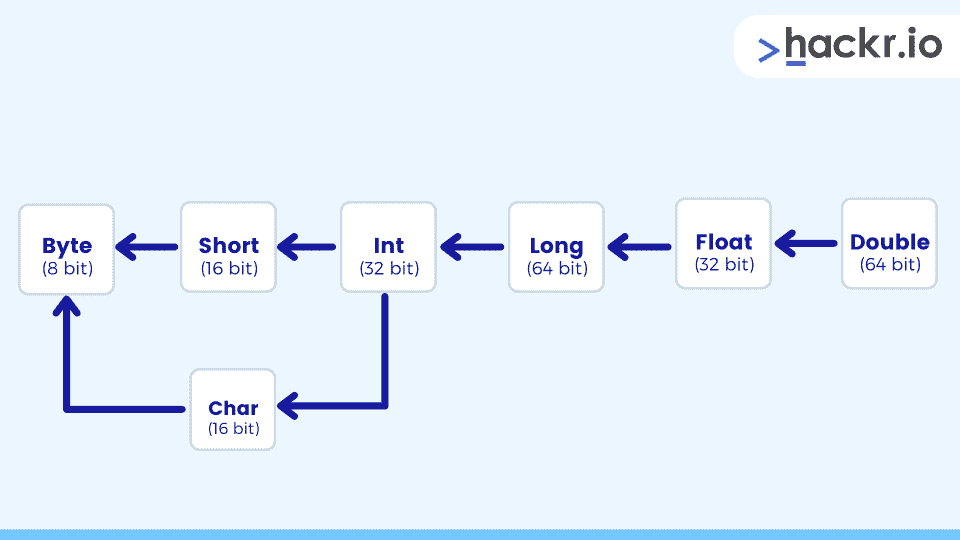
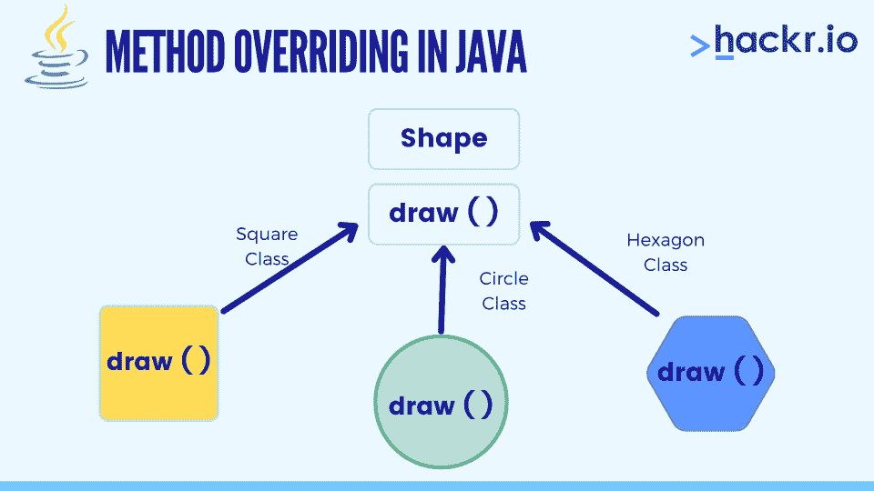
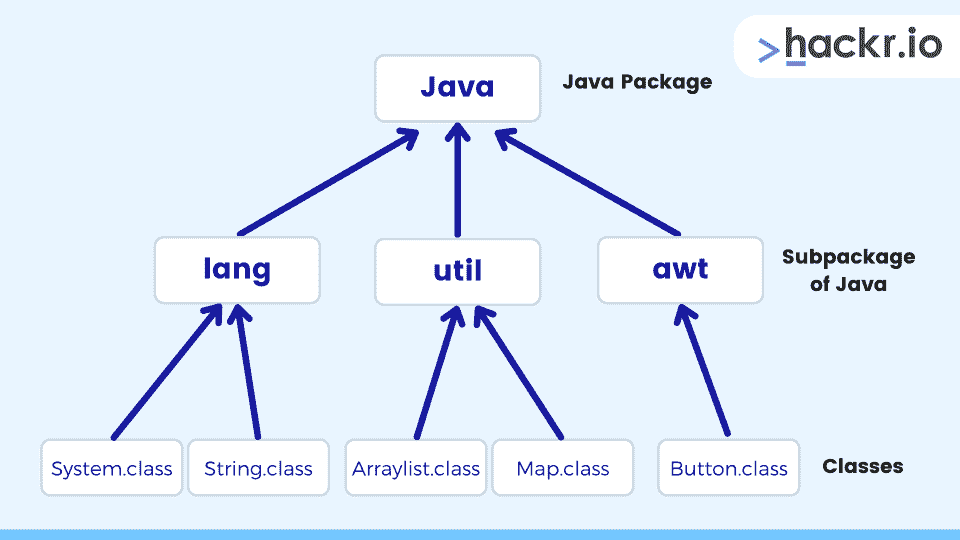
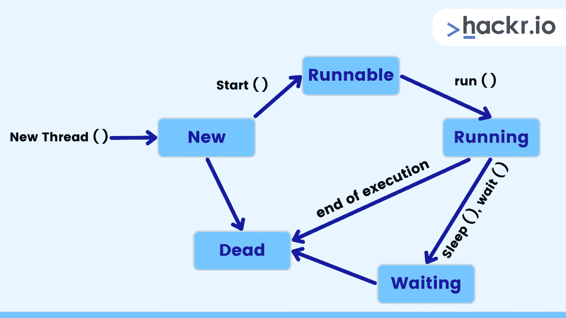
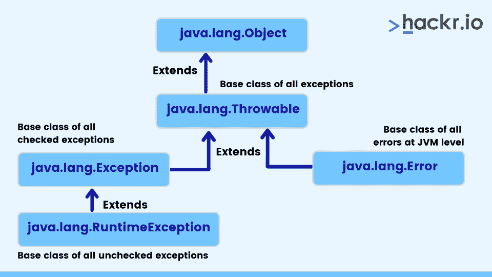
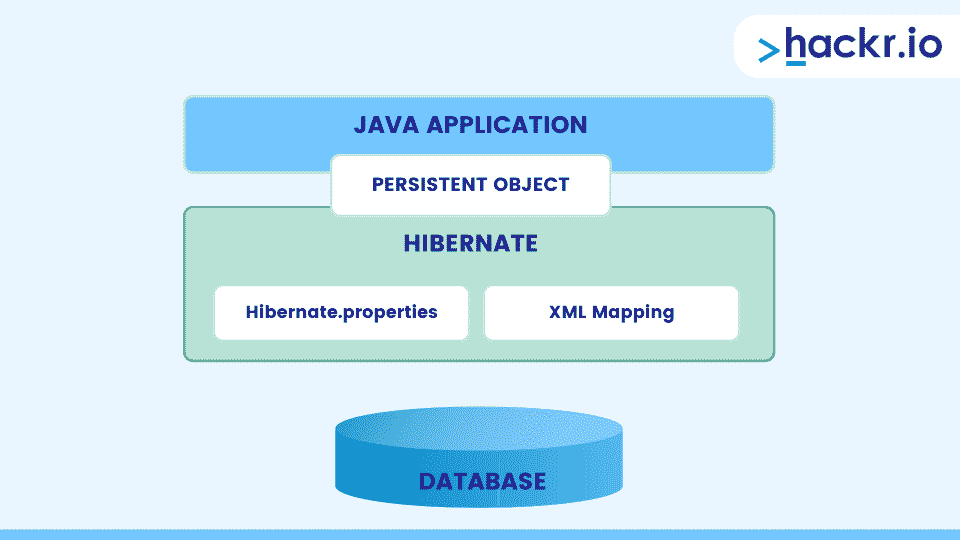

# 80 大 Java 面试问答[2023]

> 原文：<https://hackr.io/blog/java-interview-questions>

毫无疑问，Java 是获得高薪工作的主要编程选择之一。毕竟，基于类的、通用的、面向对象的编程语言是世界上使用最广泛的编程语言之一。

这种编程语言有着太多的优秀特性，不仅是经验丰富的专家喜欢它，编程领域的新手也喜欢它。以下是 Java 面试中最常见的问题和答案，它们将帮助你获得一份 Java 工作，或者至少提高你的学习。

这些 Java 面试问题推荐给初学者和专业人士，也推荐给软件开发人员和 Android 应用程序开发人员。

## **顶级 Java 面试问答**

我们还建议你在开始准备 Java 面试之前，用这个 [Java 备忘单](https://hackr.io/blog/java-cheat-sheet)复习一下你的 Java 技能。

我们把这些面试问题分成了几个部分，包括一个关于编程 Java 面试问题的部分。

### **基础 Java 面试问题**

#### **1。Java 是什么？**

Java 是一种面向对象的高级通用编程语言，最初由詹姆斯·高斯林设计，并由甲骨文公司进一步开发。它是世界上最流行的编程语言之一。

在这里了解更多关于 Java 的知识。

#### **2。什么是 Java 虚拟机？**

****

JVM 是一个解释中间 Java 字节代码并生成所需输出的程序。正是因为有了字节码和 JVM，用 Java 写的程序才具有高度的可移植性。

#### **3。Java 有什么特点？**

以下是 Java 编程语言的各种特性:

*   **高性能:**使用 JIT(实时)编译器可以实现 Java 的高性能。JIT 编译器将 Java 字节码转换成机器语言代码，然后由 JVM 执行。
*   **多线程:**一个线程就是一个执行的流程。JVM 创建一个被称为主线程的线程。Java 允许通过扩展 thread 类或实现 Runnable 接口来创建多个线程。
*   **OOPs 概念:** Java 遵循[各种 OOPs 概念](https://hackr.io/blog/oops-concepts-in-java-with-examples)，即抽象、封装、继承、面向对象和多态
*   平台无关性: Java 使用 Java 虚拟机或 JVM，允许单个 Java 程序在多个平台上运行，无需任何修改。

你可能想在这里查看 Java 特性的详细解释。

#### **4。Java 如何实现高性能？**

在实时编译中，所需的代码在运行时执行。通常，它包括将字节码翻译成机器码，然后直接执行它。它允许高性能。默认情况下，JIT 编译器在 Java 中是启用的，只要一调用方法就会被激活。

然后，它将 Java 方法的字节码编译成本机代码。

之后，JVM 直接调用编译后的代码，而不是解释它。

#### **5。JVM、JRE 和 JDK 之间有什么区别？**

| **参数** | JVM | **JRE** | **JDK** |
| **全格式** | Java 虚拟机 | Java 运行时环境 | Java 开发工具包 |
| **目的** | 它提供了一个运行时环境来执行 Java 字节码。 | 它是一套用于开发 Java 应用程序的软件工具。 | 它是一个用于开发 Java 应用程序的软件开发环境。 |
| **存在** | 它是我们运行 Java 类时创建的运行时实例。 | 它是物理存在的。 | 它是物理存在的。 |
| **实施** | 它的实现被称为 JRE | 它是 JVM 的实现 | 它是 Oracle 公司发布的下列 Java 平台之一的实现:标准版 Java 平台企业版 Java 平台微型版 Java 平台 |

#### **6。什么是 JIT 编译器？**

JIT 编译器在程序执行后运行，将代码编译成更快的形式，托管 CPU 的本机指令集。JIT 可以访问动态运行时信息，而标准编译器不能，并且可以进行更好的优化，比如经常使用的内联函数。

#### 7 .**。什么是 Java IDEs？**

Java IDE 是一种允许 Java 开发人员轻松编写和调试 Java 程序的软件。它基本上是各种编程工具的集合，可以通过一个界面访问，还有一些有用的特性，比如代码完成和语法高亮。

Codenvy、Eclipse 和 NetBeans 是一些最流行的 Java IDEs。

#### **8。Java 是一种平台无关的语言。为什么？**

Java 不依赖于任何特定的硬件或软件，因为它是由编译器编译，然后转换成字节码。字节码是独立于平台的，可以在多个系统上运行。唯一的要求是 Java 需要一个运行时环境，即 JRE，这是一套用于开发 Java 应用的工具。

#### **9。解释类型转换。**

将一种数据类型的变量赋给另一种数据类型的变量的概念。这对于布尔数据类型是不可能的。有两种类型:隐式和显式。

#### 10。类型转换有哪些不同的类型？

****

不同类型的类型转换有:

*   **隐式:**将值从较小的数据类型存储到较大的数据类型。这是由编译器自动完成的。

*   **显式:**将较大数据类型的值存储到较小的数据类型中。这会导致信息丢失:

*   **截断:**将一个值从较大的数据类型转换为较小的数据类型时，多余的数据将被截断。以下代码示例对此进行了解释:

```
float f = 3.14f;

int i = (int) f; 
```

执行后，变量 I 将只包含 3，不包含小数部分。

*   **超出范围:**类型转换不允许赋值超过其范围；如果发生这种情况，数据就会丢失。以下代码示例对此进行了解释:

**long**l = 123456789；

**字节** b = ( **字节**)l；// byte 与 long 的范围不同，因此会有数据丢失。

#### **11。解释 Java 中的访问修饰符。**

访问修饰符是 Java 中预定义的关键字，用于限制对另一个类中的类、方法、构造函数和数据成员的访问。Java 支持四种访问修饰符:

*   默认
*   私人的
*   保护
*   公共

| 修改 | **默认** | **私人** | **受保护的** | **公共** |
| 同班 | 是 | 是 | 是 | 是 |
| 相同的包子类 | 是 | 不 | 是 | 是 |
| 相同的包非子类 | 是 | 不 | 是 | 是 |
| 不同的包子类 | 不 | 不 | 是 | 是 |
| 不同的包非子类 | 不 | 不 | 不 | 是 |

#### **12。局部变量的默认值是什么？**

局部变量没有被初始化为任何默认值，无论是原语还是对象引用。

### **哎呀 Java 面试问题**

#### 13。什么是面向对象编程？

OOPs 是一种以对象而不是函数为中心的编程范式。它不是一种工具或编程语言，而是一种范式，旨在克服[过程化编程](https://hackr.io/blog/procedural-programming)的缺陷。

有许多语言遵循 OOPs 概念——一些流行的语言是 Java、Python 和 Ruby。有些框架也遵循 OOPs 概念，比如 Angular。

#### **14。解释 OOPs 概念。**

以下是各种 OOPS 概念:

*   **抽象:**表现本质特征，不需要给出背景细节。该技术用于为某些特定的应用程序创建新的合适的数据类型。
*   **聚合:**所有对象都有自己独立的生命周期，但所有权是存在的。除了父对象，子对象不能属于其他对象。
*   **关联:**两个对象之间的关系，其中每个对象都有其独立的生命周期。没有所有权。
*   **类:**一组相似的实体。
*   **构成:**也叫死亡关系，它是一种专门的聚合形式。子对象没有生命周期。因此，如果关联的父对象被删除，它们会自动被删除。
*   **封装:**指的是将数据和代码打包成一个实体。这使得一个类的变量只能被父类访问，而不能被其他类访问。
*   **继承:**当一个对象获得了其他某个对象的属性，就叫做继承。它导致了相关班级之间亲子关系的形成。这为组织和构建软件提供了一个健壮和自然的机制。
*   **对象:**表示一个类的实例。任何类都可以有多个实例。对象包含数据以及对数据进行操作的方法
*   **多态性:**指一个方法、对象或变量呈现几种形式的能力。

**决策 Java 面试问题**

#### 15。区分中断和继续。

| **突破** | **继续** |
| 与 loop 和 switch 语句一起使用。 | 仅与循环语句一起使用。 |
| 它终止循环或开关块。 | 它不会终止，而是跳到下一次迭代。 |

### **类、对象、方法 Java 面试题**

#### 16。什么是对象？

Java 类的实例被称为对象。Java 对象的两个重要属性是[行为和状态](https://stackoverflow.com/questions/18219339/trouble-understanding-object-state-behavior-and-identity)。JVM 一遇到 new 关键字就创建一个对象。

#### **17。用 Java 定义类。**

类是相似数据类型的对象的集合。类是用户定义的数据类型，其行为类似于编程语言的内置类型。

**类的语法:**

```
classSample{

membervariables

methods()

}
```

**类别示例:**

```
publicclassShape

{

String Shape name;

voidarea()

{

}

voidvolume ()

{

}

voidnum_sides()

{

}

}
```

#### 18。什么是静态方法和变量？

一个类有两部分:一部分声明变量，另一部分声明方法。它们分别被称为实例变量和实例方法。之所以这样称呼它们，是因为每次实例化一个类时，都会创建它们的新副本。

通过将变量和方法声明为静态的，可以创建所有对象共有的变量和方法，并且无需使用特定的对象就可以访问它们。其他类和方法也可以使用静态成员。

#### **19。你说的构造器是什么意思？**

构造函数是一种与其所属的类同名的方法。一旦创建了一个新对象，就会调用对应于该类的构造函数。尽管用户可以显式地创建构造函数，但一旦创建了类，它就会自己创建。这就是所谓的默认构造函数。构造函数可以重载。

如果显式创建的构造函数有参数，则有必要创建另一个没有参数的构造函数。

#### 20。什么是局部变量和实例变量？

只有声明变量的方法或代码块才能访问的变量称为局部变量。另一方面，实例变量可以被类中的所有方法访问。

虽然局部变量是在方法或代码块内声明的，但实例变量是在类内而不是在方法外声明的。即使没有赋值，实例变量的值也可以是 null、0、0.0 或 false。这与需要赋值的局部变量不同，在局部变量中，不赋值会产生错误。当一个方法被调用时，局部变量被自动创建，一旦方法退出，局部变量就被销毁。为了创建实例变量，必须使用 *new* 关键字。

#### **21。什么是方法重写？**

****

Java 中的方法覆盖允许子类提供已经由父类或超类提供的方法的特定实现。如果子类方法和超类方法具有:

*   相同的名字
*   同样的论点
*   相同的返回类型

#### **22。什么是超载？**

重载是指两个或多个不同的方法(方法重载)或运算符(运算符重载)具有相同表示形式的现象。例如，+运算符将两个整数值相加，但将两个字符串连接起来。类似地，一个名为 Add 的重载函数有两个用途

1.  将两个整数相加
2.  连接两个字符串

与方法重写不同，方法重载要求两个重载方法具有相同的名称和不同的参数。重载函数可能有也可能没有不同的返回类型。

#### **23。final 关键字在 Java 中起什么作用？它对变量、方法和类有什么影响？**

Java 中的 final 关键字是非访问修饰符，仅适用于类、方法或变量。根据使用它的上下文，它有不同的用途。

*   **用一个类:**当一个类被声明为 final 时，它就不能被子类化，也就是说，任何类都不能扩展 final 类。

*   **With a method:** 任何伴随 final 关键字的方法都被限制不能被子类覆盖。

*   **带变量:**后跟 final 关键字的变量不能改变它在程序执行过程中保存的值。所以，它表现得像一个常数。

### **数组、字符串和向量 Java 面试题**

#### **24。画一个 Array 和 ArrayList 的比较。**

数组需要在声明时声明大小，而数组列表不一定需要大小，因为它会动态改变大小。要将一个对象放入数组，需要指定索引。但是，对于数组列表，没有这样的要求。当数组列表被参数化时，数组不被参数化。

#### **25。String、Stringbuilder 和 Stringbuffer 有什么区别？**

字符串变量存储在常量字符串池中。随着字符串引用的改变，不可能删除旧值。例如，如果一个字符串存储了一个值“旧”，那么添加新值“新”不会删除旧值。然而，它仍然会在那里，处于休眠状态。在 Stringbuffer 中，值存储在堆栈中。随着字符串引用的更改，新值将替换旧值。Stringbuffer 是同步的(因此是线程安全的),提供的性能比 StringBuilder 慢，后者也是 Stringbuffer，但不是同步的。因此，Stringbuilder 的性能比 Stringbuffer 更快。

#### **26。什么是串池？**

字符串池是存储在堆内存中的字符串的集合。每当创建新对象时，都会检查它是否已经存在于字符串池中。如果它已经存在，那么相同的引用被返回给变量，否则在字符串池中创建一个新的对象，并返回相应的引用。

## **高级** **Java 面试题**

### **接口和抽象类 Java 面试题**

#### **27。你对界面了解多少？**

Java 接口是一个只有方法声明而没有方法实现的模板。这是在 Java 中实现多重继承的一种变通方法。关于 Java 接口，一些值得记住的要点是:

*   实现接口的类必须为接口中声明的所有方法提供实现。
*   接口中的所有方法都是内部公共的抽象 void。
*   接口中的所有变量都是内部公共的 static final。
*   类不扩展而是实现接口。

#### **28。抽象类和接口有什么不同？**

Java 中的抽象类和接口有几个不同之处，总结如下:

*   抽象类包含实例变量，而接口只能包含常量。
*   **构造函数和实例化:**虽然一个接口既没有构造函数也不能被实例化，但是一个抽象类可以有一个默认的构造函数，当具体的子类被实例化时，这个构造函数就会被调用。
*   **方法的实现—**所有实现接口的类都需要为它包含的所有方法提供一个实现。然而，扩展抽象类的类不需要实现其中包含的所有方法。只有抽象方法需要在具体的子类中实现。
*   **方法类型:**任何抽象类都有抽象和非抽象方法。另一方面，接口只有一个抽象方法。

#### **29。请解释抽象类和抽象方法。**

Java 中的抽象类是不能实例化的类。这种类通常用于为子类提供扩展的基础，以及实现抽象方法和覆盖或使用抽象类中定义的已实现方法。

要创建一个抽象类，后面需要跟 abstract 关键字。任何抽象类都可以有抽象和非抽象方法。Java 中只有声明而没有实现的方法被称为抽象方法。此外，抽象方法名后跟 abstract 关键字。任何扩展抽象类的具体子类都必须提供抽象方法的实现。

#### 三十岁。什么是多重继承？Java 支持多重继承吗？如果不能，如何实现？

如果子类或子类有两个父类，这意味着它从两个基类继承属性；它有多重继承。Java 没有多重继承，因为父类有相同的方法名。然后在运行时，它变得不明确，编译器无法决定从子类中执行哪个方法。

### **打包 Java 面试问题**

#### 31。Java 中的包是什么？陈述一些优点。

****

包是 Java 将各种类和/或接口组合在一起的方式。对象的功能决定了它们的分组方式。打包程序充当类的“容器”。

下面列出了包的优点:

1.  其他程序的类可以重用。
2.  具有相同的两个类可以存在于两个不同的包中。
3.  包可以隐藏类，从而拒绝访问某些仅供内部使用的程序和类。
4.  他们也将设计和编码分开。

### **多线程 Java 面试问题**

#### 32。Java 里怎么做一个线程？举例说明。

要在 Java 中制作一个线程，有两种选择:

*   **扩展线程类**:线程在 java.lang.Thread 类中可用。要创建一个线程，需要扩展一个线程类并覆盖 run 方法。举个例子，

```
publicclassAdditionextendsThread {

publicvoidrun() {

}

}
```

使用 thread 类的一个缺点是无法扩展任何其他类。

尽管如此，还是有可能在类中重载 run()方法

*   **实现 runnable 接口:**另一种在 Java 中创建线程的方法是实现一个 Runnable 接口。为此，需要提供 run()方法的实现，定义如下:

```
interface. Forexample,

publicclassAdditionimplementsRunnable {

publicvoidrun() {

}

}
```

#### 33。我们为什么要用 yield()方法？

yield()方法属于 thread 类。它将当前运行的线程转换为可运行状态，并允许其他线程执行。换句话说，它给同等优先级的线程一个运行的机会。因为 yield()是一个静态方法，所以它不释放任何锁。

#### 34。解释 Java 中的线程生命周期。

****

线程生命周期具有以下状态，并遵循以下顺序:

*   **New:** 在线程生命周期的第一个状态，线程实例被创建，start()方法还没有被调用。线程现在被认为是活动的。
*   **Runnable:** 在调用 start()方法之后，但在调用 run()方法之前，一个线程处于 Runnable 状态。线程也可以从等待或休眠状态返回到可运行状态。
*   **运行:**调用 run()方法后线程进入运行状态。这是线程开始执行的时候。
*   **不可运行:**虽然线程是活动的，但是它不能运行。通常，它会在一段时间后返回到可运行状态。
*   **终止:**一旦 run()方法完成执行，线程就进入终止状态。它现在不活了。

#### 35。什么时候 Runnable 接口优先于 thread 类，反之亦然？

在 Java 中，只能扩展一个类。因此，只有当没有其他类需要扩展时，线程类才会被扩展。如果一个类需要扩展线程类之外的其他类，那么我们需要使用 Runnable 接口。

#### 36。比较 notify()和 notifyAll()方法。

*notify()* 方法用于发送一个信号来唤醒等待池中的一个线程。相反， *notifyAll()* 方法用于发送一个信号来唤醒等待池中的所有线程。

#### 37。你将如何区分进程和线程？

进程和线程之间有几个基本区别，如下所述:

*   定义:进程是程序的执行实例，而线程是进程的子集。
*   **变更:**对父流程的变更不会影响子流程。但是，主线程的变化会导致同一进程中其他线程的行为发生变化。
*   **通信–**虽然进程需要进程间通信来与同级进程通信，但线程可以直接与属于同一进程的其他线程通信。
*   **控制:**进程由操作系统控制，只能控制子进程。相反，线程由程序员控制，并且能够对它们所属的同一进程的线程进行控制。
*   **依赖:**进程是独立实体，线程是依赖实体
*   **内存:**线程运行在共享的内存空间，但是进程运行在独立的内存空间。

#### 38。join()方法是什么？举个例子。

我们使用 join()方法将一个线程与当前正在运行的线程的末尾连接起来。它是非静态方法，并且有一个重载版本。考虑下面的例子:

```
publicstaticvoidmain (String[] args) {

Thread t = new Thread();

t.start();

t.join();

}
```

主线程在上面提到的例子中开始执行。一旦执行到达代码 t.start()，线程 t 就开始执行它的堆栈。JVM 在主线程和那里的线程之间切换。一旦执行到达 t.join()，那么只有线程 t 被执行并被允许完成它的任务。之后，主线程继续执行。

#### 39。在 Java 中如何让一个线程停止？

Java 中有三种方法可以停止线程的执行:

*   **阻塞:**该方法用于将线程置于阻塞状态。一旦满足阻塞条件，执行就会恢复。例如，ServerSocket.accept()是一个阻塞方法，它侦听传入的套接字连接，并仅在建立连接时恢复阻塞的线程。
*   **Sleeping:** 该方法用于将线程的执行延迟一段时间。使用 sleep()方法的线程被称为进入睡眠状态。它一醒来就进入可运行状态，即睡眠状态结束。sleep()方法的大括号中提到了线程需要进入睡眠状态的时间。它是一个静态方法。
*   **Waiting:** 虽然可以在任何 Java 对象上调用，但是 wait()方法只能从 synchronized 块中调用。

### **异常处理 Java 面试问题**

#### 40。有哪些不同类型的异常？你如何处理他们？

Java 提供了两种类型的异常:

*   **检查异常:**扩展 Throwable 类的类，除了运行时异常和错误，都称为检查异常。这种异常由编译器在编译时检查。这些类型的异常必须有适当的 try/catch 块，或者使用 throws 关键字声明。ClassNotFoundException 是一个已检查的异常。
*   **未检查的异常:**这种异常在编译时不会被编译器检查。因此，编译器不需要处理未检查的异常。算术异常和 ArrayIndexOutOfBounds 异常是未检查的异常。

Java 中的异常有两种处理方式:

**声明 throws 关键字:**我们可以在方法的最后使用 throws 关键字声明异常。例如:

```
classExceptionCheck{

publicstaticvoidmain(String[] args){

add();

}

publicvoidadd() throws Exception{

addition();

}

}
```

**使用 try/catch:** 任何预期会产生异常的代码段都被 try 块包围。一旦出现异常，try 块后面的 catch 块就会捕获它。例如:

```
classExceptionCheck{

publicstaticvoidmain (String[] args) {

add();

}

publicvoidadd(){

try{

addition();

}

catch(Exception e)

{

e.printStacktrace();

}

}

}
```

#### 41。绘制 Java 异常层次结构。

****

#### **42。有可能在一个 try 块下写多个 catch 块吗？**

是的，可以在一个 try 块下写几个 catch 块。但是，方法需要从具体到一般。下面的示例演示了这一点:

```
publicclassExample {

publicstaticvoidmain(String args[]) {

try {

int a[]= newint[10];

a[10]= 10/0;

}

catch(ArithmeticException e)

{

System.out.println("Arithmetic exception in first catch block");

}

catch(ArrayIndexOutOfBoundsException e)

{

System.out.println("Array index out of bounds in second catch block");

}

catch(Exception e)

{

System.out.println("Any exception in third catch block");

}

}
```

#### **43。throw 关键字与 throws 关键字有什么不同？**

虽然 throws 关键字允许声明异常，但 throw 关键字用于显式引发异常。

被检查的异常不能只通过 throw 来传播，但是 throw 允许这样做而不需要其他任何东西。

throws 关键字后面是一个类，而 throw 关键字后面是一个实例。throw 关键字在方法中使用，但 throws 关键字与方法签名一起使用。

此外，不能抛出多个异常，但可以声明多个异常。

#### **44。解释 Java 中的各种异常处理关键字。**

Java 中有两个至关重要的异常处理关键字，后面是第三个关键字 final，在处理异常后可能会使用，也可能不会使用。

**试试:**

如果并且当代码段有机会出现异常或错误时，它被放置在 try 块中。引发异常时，catch 块会处理并捕获该异常。

try 块后面必须有 catch()或 final()或两个块。

**捕捉:**

当 try 块中引发异常时，它在 catch 块中处理。

**决赛:**

不管是否有异常，都会执行该块。它可以放在 try{}或 catch {}块之后。

#### **45。解释异常传播。**

如果没有被捕获，堆栈顶部的方法将引发异常。它移动到下一个方法，继续下去，直到被捕获。

示例:

```
public class Sum()

{

publicstaticvoidmain(String args[])

{

addition()

}

publicvoidaddition()

{

add();

}

}
```

上面代码的堆栈是:

```
add()

addition()

main()
```

如果在 add()方法中发生的异常没有被捕获，那么它将转移到 addition()方法。然后，它被移动到 main()方法，执行流程在这里停止。这被称为异常传播。

### **文件处理 Java 面试问题**

#### **46。是一个空文件名。java 扩展名是有效的文件名吗？**

是的，Java 允许我们通过。仅限 java。它由 javac 编译，由 java 类名运行。这里有一个例子:

```
public class Any()

{

publicstaticvoidmain(String args[])

{

System.out.println("Hello Java File here!");

}

}
```

编译:javac.java

要运行:Java Any

### **收藏 Java 面试题**

#### **47。什么是收藏？它们的成分是什么？**

Java 中的一组对象被称为集合。Java.util 包包含日期和时间工具、国际化、遗留集合类等。，用于收集的各种类和接口。或者，集合可以被认为是被设计用于存储对象和操纵存储对象的设计的框架。您可以使用集合对对象执行以下操作:

*   删除
*   插入
*   操纵
*   搜索
*   整理

以下是集合框架的各个组成部分:

*   **类:**数组列表、链表、链表和向量
*   **接口:**集合、列表、映射、队列、集合、排序映射、排序集合
*   **映射:** HashMap、HashTable、LinkedHashMap 和 TreeMap
*   **队列:**优先级队列
*   **集合:**哈希集合、链接哈希集合和树集合

#### **48。如何区分 HashMap 和 HashTable？**

Java 中的 HashMap 是一个基于映射的集合类，用于存储键/值对。它被表示为 HashMap <key value="">或 HashMap <k v="">HashTable 是一个列表的数组，其中每个列表被称为一个桶。</k></key>

哈希表中包含的值是唯一的，并且依赖于键。方法在 HashMap 中是不同步的，而键方法在 HashTable 中是同步的。

但是，HashMap 没有线程安全，而 HashTable 却有。

对于迭代值，HashMap 使用迭代器，HashTable 使用枚举器。HashTable 不允许任何空值，而 HashMap 允许一个空键和几个空值。

从性能上来说，HashTable 比较慢。相比之下，HashMap 更快。

#### **49。什么是地图，有哪些类型？**

Java 映射是将键映射到值的对象。它不能包含重复的键，并且每个键只能映射到一个值。为了确定两个键是相同还是不同，Map 使用 equals()方法。Java 中有 4 种类型的映射，描述如下:

*   HashMap: 这是一个无序且未排序的映射，因此，当不强调顺序时，这是一个很好的选择。HashMap 允许一个空键和多个空值，并且不保持任何插入顺序。
*   **HashTable:** 不允许任何空值，并且有同步的方法。因为它考虑到了线程安全，所以性能很慢。
*   **LinkedHashMap:** 比 HashMap 慢，但保持插入顺序，迭代速度更快。
*   **TreeMap:** 一种排序映射，支持使用构造函数构造排序顺序。

#### 50。什么是优先级队列？

与常规队列一样，优先级队列也是一种抽象数据类型，但是它有一个与其包含的每个元素相关联的优先级。

在优先级队列中，具有高优先级的元素在具有低优先级的元素之前被服务。优先级队列中的元素要么根据比较器排序，要么自然排序。优先级队列中元素的顺序代表了它们的相对优先级。

#### 51。什么是集合？解释 Java 集合中的类型。

在 Java 中，集合是唯一对象的集合。它使用 *equals()* 方法来确定两个对象是否相同。Java 集合中各种类型的集合有:

1.  **Hash 集合:**一个无序且未排序的集合，使用对象的 Hash 代码来添加值。当集合的顺序不重要时使用
2.  **链接散列集:**这是散列集的有序版本，维护所有元素的双向链表。当迭代顺序是必需的时使用。插入顺序与元素添加到集合的顺序相同。
3.  **Tree Set:**Java 中两个排序集合之一，它使用 Read-Black 树结构，并确保元素以升序出现。

#### **52。对于收藏来说，什么是有序和分类的？**

*   **有序:**值以特定的顺序存储在集合中，但顺序与值无关。示例:列表
*   **排序:**集合的顺序取决于元素的值。示例:SortedSet

### 【Java 面试杂题

#### 53。Java 中各种类型的垃圾收集器有哪些？

Java 编程语言有四种类型的垃圾收集器:

1.  **串行垃圾收集器:**仅使用单线程进行垃圾收集，串行垃圾收集器通过持有所有应用程序线程来工作。它是专门为单线程环境设计的。因为串行垃圾收集器在执行垃圾收集时会冻结所有应用程序线程，所以它只适合命令行程序。要使用串行垃圾收集器，需要打开-XX:+UseSerialGC JVM 参数。
2.  **并行垃圾收集器:**也称为吞吐量收集器，并行垃圾收集器是 JVM 的默认垃圾收集器。它使用多线程进行垃圾收集，并且像串行垃圾收集器一样，在垃圾收集期间冻结所有应用程序线程。
3.  **CMS 垃圾收集器:【Concurrent Mark Sweep 的缩写，CMS 垃圾收集器使用多线程来扫描堆内存，以标记要驱逐的实例，然后清除标记的实例。当 CMS 垃圾收集器持有所有应用程序线程时，只有两种情况:**

*   当标记终身世代空间中的被引用对象时。
*   如果在执行垃圾收集时堆内存发生变化，CMS 垃圾收集器通过使用更多的 CPU 资源来确保比并行垃圾收集器更好的应用程序吞吐量。为了使用 CMS 垃圾收集器，需要打开 XX:+USeParNewGC JVM 参数。

*   **G1 垃圾收集器:**用于大堆内存区域，G1 垃圾收集器的工作原理是将堆内存分成多个区域，然后在其中并行执行垃圾收集。与 CMS 垃圾收集器在 [STW(停止世界)情况下](https://stackoverflow.com/questions/16695874/why-does-the-jvm-full-gc-need-to-stop-the-world)压缩内存不同，G1 垃圾收集器在回收内存后立即压缩空闲堆空间。此外，G1 垃圾收集器优先考虑垃圾最多的区域。使用 G1 垃圾收集器需要打开–XX:+use G1 GC JVM 参数。

#### 54。你所理解的同步是什么？它最显著的缺点是什么？

如果几个线程试图访问一个代码块，那么产生不准确结果的可能性就会增加。同步用于防止这种情况。使用 synchronization 关键字会使线程需要一个密钥来访问同步代码。简单地说，同步一次只允许一个线程访问一段代码。每个 Java 对象都有一个锁，并且每个锁只有一个键。只有当线程可以获得对象锁的密钥时，它才能访问同步方法。以下示例演示了同步:

```
publicclassExampleThreadimplementsRunnable {

publicstaticvoidmain (String[] args){

Thread t = new Thread();

t.start();

}

publicvoidrun(){

synchronized(object){

{

}

}
```

**注意**:建议避免对所有方法实现同步。这是因为当只有一个线程可以访问同步代码时，下一个线程需要等待。因此，它会降低程序的性能。

#### **55。execute()、executeQuery()和 executeUpdate()有什么区别？**

*   **execute():** 用于执行 SQL 查询。如果结果是结果集，如运行选择查询，则返回 TRUE 如果结果不是结果集，如运行插入或更新查询，则返回 FALSE。
*   **executeQuery():** 用于执行选择查询。它返回结果集，该结果集不为空，即使没有与查询匹配的记录。执行 select 查询时必须使用 executeQuery()方法，以便当有人试图执行 Insert 或 update 语句时，它会抛出 java.sql.SQLException 以及“executeQuery 方法不能用于更新”消息。
*   **executeUpdate():** 用于执行删除/插入/更新语句或不返回任何内容的 DDL 语句。根据语句是数据操作语言(DML)语句还是数据定义语言(DDL)语句，输出会有所不同。输出是一个整数，前一种情况下等于总行数，后一种情况下等于 0。

**注意**:execute()方法只需要在语句类型不确定的情况下使用。在所有其他情况下，请使用 executeQuery()或 executeUpdate()方法。

#### 56。提供一个 Hibernate 架构的例子。

****

#### **57。你能用一个代码例子演示如何用 JSP 删除一个 cookie 吗？**

以下代码演示了如何在 JSP 中删除 cookie:

```
Cookie mycook = new Cookie("name1","value1");

response.addCookie(mycook1);

Cookie killmycook = new Cookie("mycook1","value1");

killmycook . setMaxAge ( 0 );

killmycook . setPath ("/");

killmycook . addCookie ( killmycook 1 );
```

#### **58。编写适当的代码示例来演示 final、final 和 finalize 的用法。**

**Final:**Final 关键字用于限制类、方法和变量。一个 final 类不能被继承，一个 final 方法被禁止重写，一个 final 变量成为一个常量，即它的值不能被改变。

```
classFinalVarExample {

publicstaticvoidmain( String args[])

{

finalint a=10;

a=50; /* Will result in an error as the value can’t be changed now*/

}
```

**最后:**无论异常是否被处理，最终块中的任何代码都将被执行。

```
classFinallyExample {

publicstaticvoidmain(String args[]){

try {

int x=100;

}

catch(Exception e) {

System.out.println(e);

}

finally {

System.out.println("finally block is executing");}

}

}

}
```

**Finalize:**Finalize 方法在对象被垃圾收集之前执行清理。

```
classFinalizeExample {

publicvoidfinalize() {

System.out.println("Finalize is called");

}

publicstaticvoidmain(String args[])

{

FinalizeExample f1=new FinalizeExample();

FinalizeExample f2=new FinalizeExample();

f1= NULL;

f2=NULL;

System.gc();

}

}
```

#### 59。可变变量的目的是什么？

存储在 volatile 变量中的值不是从线程的缓存中读取的，而是从主内存中读取的。可变变量主要在同步期间使用。

#### 60。请比较序列化和反序列化。

序列化是将 Java 对象转换成字节流的过程。

反序列化是与序列化完全相反的过程，从字节流中检索 Java 对象。

Java 对象通过写入 ObjectOutputStream 进行序列化，通过从 ObjectInputStream 读取进行反序列化。

#### 61。什么是 OutOfMemoryError？

通常，当 JVM 由于内存不足而无法分配对象时，会抛出 OutOfMemoryError 异常。在这种情况下，垃圾收集器无法回收任何内存。

导致 OutOfMemoryError 异常的原因有多种，其中最值得注意的有:

*   拿着东西太久了
*   试图同时处理太多的数据
*   使用缓存字符串的第三方库
*   使用部署后不执行内存清理的应用服务器
*   当无法满足本地分配时

#### 62。解释 Java 中的公共静态 void main(String args[ ])

执行 Java 程序从公共静态 void main(String args[ ])开始，也称为 main()方法。

*   **public:** 它是一个访问修饰符，定义了类或方法的可访问性。任何类都可以访问程序中公共定义的 main()方法。
*   **static:** 关键字表示变量，或者方法是类方法。方法 main()是静态的，这样就可以在不创建类实例的情况下访问它。当 main()方法不是静态的时，编译器会抛出一个错误，因为 main()是 JVM 在创建任何对象之前调用的，只有静态方法可以通过该类直接调用。
*   **void:** 是方法的返回类型。Void 定义了不返回任何类型值的方法。
*   **main:** JVM 在开始执行任何程序时都会搜索这个方法，只使用特定的签名。
*   **String args[]:** 传递给 main 方法的参数。

[Java 编程大师班更新到 Java 17](https://click.linksynergy.com/link?id=jU79Zysihs4&offerid=1045023.533682&type=2&murl=https%3A%2F%2Fwww.udemy.com%2Fcourse%2Fjava-the-complete-java-developer-course%2F)

#### 63。Java 中的包装类是什么？

包装类负责将 Java 原语转换成引用类型(对象)。一个类专用于每一种原始数据类型。它们被称为包装类，因为它们将原始数据类型包装到该类的对象中。它存在于 Java.lang 包中。下表显示了不同的基本类型和包装类。

| **简单类型** | **包装类** |
| 布尔型 | 布尔代数学体系的 |
| 茶 | 性格；角色；字母 |
| 两倍 | 两倍 |
| 漂浮物 | 浮动 |
| （同 Internationalorganizations）国际组织 | 整数 |
| 长的 | 长的 |

#### **64。解释装箱、取消装箱、自动装箱和自动取消装箱的概念。**

*   **装箱:**把一个原始值放在一个对象内部的概念叫做装箱。
*   **拆箱:**从对象中获取原始值。
*   **自动装箱:**直接给整数对象赋值。
*   **自动拆箱:**将原始值直接放入整数对象。

```
publicclassBoxUnbox

{

publicstaticvoidmain(String args[])

{

int i = 5;

Integer ii = new Integer(i); /*Boxing*/

Integer jj = i; /*Unboxing*/

int j = jj.intValue(); /*Unboxing*/

int k = jj; /*AutoUnboxing*/

}

}
```

#### 65。定义单例类。如何使一个类成为单例的？

单例类只允许创建该类的一个实例。可以通过以下步骤使类成为单例类:

1.  使用类创建类的静态实例。
2.  通过定义私有构造函数，不允许用户使用默认构造函数创建实例。
3.  创建静态方法以返回实例的对象。

```
publicclassSingleton

{

publicstaticvoidmain(String args[])

{

Single obj1 = Single.getInstance(); /* both would point to one and same instance of the class */

Single obj2 = Single.getInstance();

}

}

classSingle

{

static Single obj = new Single(); /* step a*/

privateSingle() /* step b*/

{

}

publicstatic Single getInstance()

{

return obj; /* step c*/

}

}
```

#### 66。如果把 public static void 换成 static public void，程序还会运行吗？

是的，由于说明符的顺序无关紧要，所以程序可以编译并运行，不会出现任何错误。

#### **67。==和 equals()有什么区别？**

| **等于()** | **==** |
| 这是一个字符串类的方法 | 它是一个操作员 |
| 内容比较 | 地址比较 |
| 

```
publicclassEquals{  publicstaticvoidmain(String[] args)  {  String s1 = new String("HELLO");  String s2 = new String("HELLO");  System.out.println(s1 == s2);  System.out.println(s1.equals(s2));  }  }
```

 | 

```
publicclassEquals{  publicstaticvoidmain(String[] args)  {  String s1 = new String("HELLO");  String s2 = new String("HELLO");  System.out.println(s1 == s2);  System.out.println(s1.equals(s2));  }  }
```

 |

#### 68。Java 里为什么不用指针？

指针被认为是不安全的，并且增加了程序的复杂性，添加指针的概念可能是矛盾的。还有，JVM 负责隐式内存分配；因此，为了避免用户直接访问内存，Java 中不鼓励使用指针。

#### 69。这个()和 super()有什么区别？

| **本()** | **超级()** |
| 表示类的当前实例 | 表示父/基类的当前实例 |
| 它用于调用同一个类的默认构造函数 | 它用于调用父/基类的默认构造函数。 |
| 访问当前类的方法 | 访问基类的方法 |
| 点当前类实例 | 指向超类实例。 |
| 必须是块的第一行 | 它必须是该块的第一行。 |

### **Java 编码面试问题**

除了对 Java 编程的概念有很好的了解之外，还会测试你用 Java 编程语言编写代码的技能。以下是与新生相关的 Java 编码面试问题，在 Java 编程面试中很受欢迎。

#### 70。看看下面的两个代码片段。两者的重要区别是什么？

**一、**

```
classAdder {

Static intadd(int a, int b)

{

return a+b;

}

Static doubleadd( double a, double b)

{

return a+b;

}

publicstaticvoidmain(String args[])

{

System.out.println(Adder.add(11,11));

System.out.println(Adder.add(12.3,12.6));

}}
```

**二。**

```
classCar {

voidrun(){

System.out.println(“car is running”);

}

Class Audi extends Car{

voidrun()

{

System.out.prinltn(“Audi is running safely with 100km”);

}

publicstaticvoidmain( String args[])

{

Car b=new Audi();

b.run();

}

}
```

代码片段 **i.** 是方法重载的一个例子，而代码片段 **ii。**演示方法覆盖。

#### 71。写一个不使用内置函数的字符串反转程序。

```
publicclassReversal

{

publicstaticvoidmain(String args[])

{

String input = "Java Interview";

System.out.println("Given String -> " + "Java Interview");

char charArray[] = input.toCharArray();

System.out.println("Reversed String -> ");

for(int i = charArray.length-1;i>=0; i--)

{

System.out.print(charArray[i]);

}

System.out.println();

}

}
```

#### 72。写一个程序来删除数组中的重复项。

```
import java.util.ArrayList;

import java.util.LinkedHashSet;

import java.util.List;

import java.util.Set;

classRemoveDuplicates

{

publicstaticvoidmain(String args[])

{

/*create ArrayList with duplicate elements*/

ArrayList duplicate = new ArrayList();

duplicate.add(5);

duplicate.add(7);

duplicate.add(1);

duplicate.add(4);

duplicate.add(1);

duplicate.add(7);

System.out.println("Given array: "+ duplicate);

Set <Integer> withoutDuplicates = new LinkedHashSet<Integer>(duplicate)

duplicate.clear();

duplicate.addAll(withoutDuplicates);

System.out.println("Array without duplicates: "+ duplicate);

}

}
```

#### 73。写一个程序来倒一个数。

```
import java.util.Scanner;

publicclassNumberReversal

{

publicstaticvoidmain(String args[])

{

System.out.println("Please enter the number to be reversed");

Scanner sc = new Scanner (System.in);

int number = sc.nextInt();

int reverse = reverse(number);

System.out.println("Reverse of number: " + number + " is " + reverse(number));

}

publicstaticintreverse(int number){

int reverse = 0;

int remainder = 0;

do{

remainder = number%10;

reverse = reverse*10 + remainder;

number = number/10;

}while(number > 0);

return reverse;

}

}
```

#### 74。写一个实现二分搜索法的程序。

```
import java.util.Scanner;

import java.util.Arrays;

publicclassBinary {

publicstaticvoidmain(String[] args) {

System.out.println("Enter total number of elements : ");

Scanner s = new Scanner (System.in);

int length = s.nextInt();

int[] input = newint[length];

System.out.printf("Enter %d integers", length);

for (int i = 0; i < length; i++) {

input[i] = s.nextInt();

}

/* binary search requires the input array to be sorted so we must sort the array first*/

Arrays.sort(input);

System.out.print("the sorted array is: ");

for(int i= 0; i<= length-1;i++)

{

System.out.println(input[i] + " ,");

}

System.out.println("Please enter number to be searched in sorted array");

int key = s.nextInt();

int index = BSearch(input, key);

if (index == -1) {

System.out.printf("Sorry, %d is not found in array %n", key);

} else {

System.out.printf("%d is found in array at index %d %n", key,

index);

}

}

publicstaticintBSearch(int[] input, int number) {

int low = 0;

int high = input.length - 1;

while (high >= low) {

int middle = (low + high) / 2;

if (input[middle] == number) {

return middle;

} elseif (input[middle] < number) {

low = middle + 1;

} elseif (input[middle] > number) {

high = middle - 1;

}

}

return-1;

}

}
```

#### 75。写一个程序来检查一个数是否是质数。

```
import java.util.Scanner;

publicclassPrime

{

publicstaticvoidmain(String args[])

{

System.out.println("Enter the number to check: ");

Scanner sc = new Scanner(System.in);

int num = sc.nextInt();

boolean isPrime = false;

if(num!=0)

 {

 isPrime = checkPrime(num);

 }else

 {

 System.out.println("Enter valid number");

 }

if(isPrime == false)

 {

 System.out.println(" NOT PRIME!!");

 }

else

 {

 System.out.println("PRIME!!");

 }

}

publicstatic boolean checkPrime(int number)

{

int sqrt = (int) Math.sqrt(number) + 1;

for(int i = 2; i<sqrt; i++)

{

if(number % i== 0)

{

returnfalse;

}

}

returntrue;

}

}
```

#### 76。写一个程序打印斐波那契数列。

```
import java.util.Scanner;

publicclassFibo

{

publicstaticvoidmain(String args[])

{

System.out.println("Enter the number upto which Fibonacci series should be printed ");

Scanner sc = new Scanner(System.in);

int num = sc.nextInt();

System.out.println("Fibonacci Series upto %d is" + num);

for(int i=1; i<=num; i++)

{

System.out.print(fib(i) + " ");

}

}

publicstaticintfib(int n)

{

if(n ==1 || n==2)

{

return1;

}

return fib(n-1) + fib(n-2);

}

}
```

#### **77。写一个程序来检查给定的字符串是否是回文。**

```
import java.util.Scanner;

publicclassPalinDrome

{

publicstaticvoidmain(String args[])

{

System.out.println("Enter the string to check");

Scanner sc = new Scanner(System.in);

String str = sc.nextLine();

boolean isPalindrome;

isPalindrome = checkPalindrome(str);

if(str.equals(" "))

{

System.out.println("Enter valid string");

}

else

{

if(isPalindrome)

{

System.out.println("PALINDROME!!");

}

else

{

System.out.println("NOT A PALINDROME!!");

}

}

}

publicstatic boolean checkPalindrome(String input)

{

int str_length = input.length();

int i=0, j= str_length-1;

while(i<j)

{

if(input.charAt(i) != input.charAt(j))

returnfalse;

i++;

j--;

}

returntrue;

}

}
```

#### 78。写一个程序来打印下面的图案。

*****

*** ***

*** * ***

*** * * ***

*** * * * * ***

**答案:**

```
publicclassPattern

{

publicstaticvoidmain(String args[])

{

for(int i=5; i>=0; i--)

{

System.out.println();

for(int j=i; j<5;j++)

{

System.out.print(" * ");

}

}

System.out.println();

}

}
```

#### 79。写一个程序来交换两个数。

```
import java.util.Scanner;

publicclassSwap

{

publicstaticvoidmain(String args[])

{

Scanner s = new Scanner(System.in);

System.out.println("Enter a number: ");

int a = s.nextInt();

System.out.println("Enter second number: ");

int b = s.nextInt();

System.out.println("Value of a and b before swapping: " + "a = " +a + " b = " + b);

swap(a,b);

}

publicstaticvoidswap(int a , int b)

{

int swap_variable;

swap_variable = a;

a = b;

b = swap_variable;

System.out.println("Value of a and b after swapping: " + "a = " +a + " b = " + b);

}

}
```

#### 80。写一个程序来检查给定的数是否是阿姆斯特朗数。

```
import java.util.Scanner;

publicclassArmstrong

{

publicstaticvoidmain(String args[])

{

Scanner s = new Scanner(System.in);

System.out.println("Enter a number: ");

int number = s.nextInt();

int a=number, sum = 0, num=0;

while(a%10 !=0)

 {

 num = a%10;

 sum = sum + (num*num*num);

a = a/10;

 }

if(sum == number)

 {

 System.out.println("Armstrong Number!");

 }

else

 {

 System.out.println("Not an Armstrong Number!");

 }

}

}
```

# **总结**

这些核心的 Java 面试问题和 Java 编程面试问题是让你为面试做好准备的好方法。

我们还提供了一份 PDF 文件供您准备，以便您可以随时下载、学习和准备:

[**下载 Java 面试题 PDF**](https://drive.google.com/file/d/1kC36TVHz-bsXWN-KxMYBFcsk-1K9HvW9/view?usp=sharing)

你也可以看看这个课程做进一步的阅读，为基于 Java 的面试做准备: [Java 面试指南:200+面试问答](https://www.udemy.com/course/java-interview-questions-and-answers/)

我们推荐这本书来帮助你在未来的 Java 面试中取得成功:[Java 编程面试的要素:内部人员指南第二版](https://geni.us/0gm5K)

## **常见问题解答**

#### **1。面试时问的 Java 基本问题有哪些？**

面试中会出现几个基本的 Java 面试问题。看看我们上面列出的那些来了解一下它们。

#### **2。Java 面试应该怎么准备？**

你应该通过学习理论和练习编码来准备 Java 面试。上面有几个相关的问题。

#### **3。高级 Java 面试问题有哪些？**

高级 Java 面试问题可以有很多种，包括基于理论和编码的问题。查看上面的 java 编程问题列表，看看它们是什么样的。

**人也在读:**