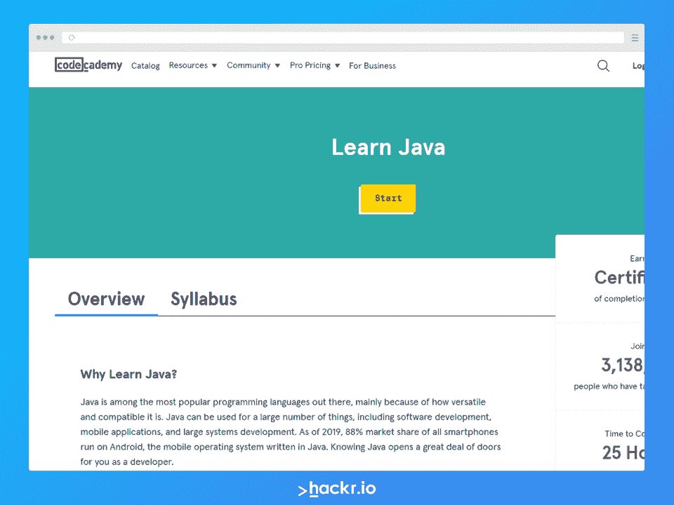

# 10 个最适合初学者的 Java 项目 2023[带源代码]

> 原文：<https://hackr.io/blog/java-projects>

Java 是世界上最常用的编程语言之一，在移动应用程序中尤其流行。然而，它也普遍存在于桌面应用程序、web 服务器和应用程序服务器、游戏和数据库连接中。

Java 有着悠久的历史和几个优点。如果你想成为一名 Java 开发人员，你需要真正开始编码，就像其他编程语言一样。在这里，我们列出了 2023 年最适合初学者的 10 个 Java 项目。

## **Java 是什么？**

Java 是由约翰·高斯林于 1995 年在太阳微系统公司开发和创造的，它是一种通用的、面向对象的编程语言。它的开发旨在遵循 WORA 的概念，即编写一次就可以在任何地方运行，即编译后的 Java 代码可以在所有支持 Java 的平台上运行，而无需重新编译。

它在开发人员中很受欢迎，因为它有以下特点:

*   面向对象
*   轻便的
*   独立于平台
*   担保
*   粗野的
*   建筑中立
*   解释
*   高性能
*   多线程
*   分布的
*   动态的

在这里了解更多关于 Java 的知识。

## **Java ide 开始构建项目**

有大量的 Java IDEs 和在线编辑器可供您开始开发 Java 项目。下面的列表涵盖了一些最流行的编辑器和 ide。

**IDEs:**

*   MyEclipse
*   智能理念
*   NetBeans
*   爪哇博士
*   蓝色 J
*   JDeveloper

**在线编辑:**

*   科迪瓦
*   JDoodle
*   雷克斯测试仪
*   在线 GDB
*   布朗西
*   IDE 一

关于 ide 和编辑器的详细信息，您可能想阅读[Java ide](https://hackr.io/blog/best-java-ides)。

## **初学者的最佳 Java 项目**

下面是为初学者准备的简单 Java 项目，应该很好地涵盖了 Java 的所有基本概念。

在某些情况下，代码太长，无法在文本中包含源代码，所以我们提供了链接。

这一智能城市项目向到访城市的个人介绍酒店、交通设施、机票预订、购物详情、城市新闻等。这是一个用 Java 编程语言开发的基于网络的软件，它解决了任何新游客在来到一个新城市时面临的大部分问题，如寻路、搜索酒店、订票等。

[源代码](https://www.codewithc.com/smart-city-java-project/)

这个货币转换器是一个迷你 Java 项目，它提供了一个基于 web 的接口，用于将货币从一种货币转换为另一种货币。它是使用 Ajax、Java servlets web 特性开发的。这种应用已经在商业行业中使用。

```
/*
* To change this template, choose Tools | Templates
* and open the template in the editor.
*/
package com.exchange;

import java.io.*;
import java.net.*;
import java.util.*;
import javax.servlet.*;
import javax.servlet.http.*;
import java.io.InputStream;
import java.net.*;
import com.google.gson.*;

/**
*
* @author pakallis
*/
class Recv
{
private String lhs;
private String rhs;
private String error;
private String icc;
public Recv(
{
}
public String getLhs()
{
return lhs;
}
public String getRhs()
{
return rhs;
}
}
public class Convert extends HttpServlet {
    /**
	* Processes requests for both HTTP <code>GET</code> and <code>POST</code> methods.
	* @param request servlet request
	* @param response servlet response
	* @throws ServletException if a servlet-specific error occurs
	* @throws IOException if an I/O error occurs
	*/
    protected void processRequest(HttpServletRequest req, HttpServletResponse resp)
            throws ServletException, IOException {
        String query = "";
        String amount = "";
        String curTo = "";
        String curFrom = "";
        String submit = "";
        String res = "";
        HttpSession session;
        resp.setContentType("text/html;charset=UTF-8");
        PrintWriter out = resp.getWriter();
        /*Read request parameters*/
        amount = req.getParameter("amount");
        curTo = req.getParameter("to");
        curFrom = req.getParameter("from");
        /*Open a connection to google and read the result*/

        try {
            query = "http://www.google.com/ig/calculator?hl=en&q=" + amount + curFrom + "=?" + curTo;
            URL url = new URL(query);
            InputStreamReader stream = new InputStreamReader(url.openStream());
            BufferedReader in = new BufferedReader(stream);
            String str = "";
            String temp = "";
            while ((temp = in.readLine()) != null) {
                str = str + temp;
            }

            /*Parse the result which is in json format*/
            Gson gson = new Gson();
            Recv st = gson.fromJson(str, Recv.class);
            String rhs = st.getRhs();
            rhs = rhs.replaceAll("�", "");
            /*we do the check in order to print the additional word(millions,billions etc)*/
            StringTokenizer strto = new StringTokenizer(rhs);
            String nextToken;

            out.write(strto.nextToken());
            nextToken = strto.nextToken();

            if( nextToken.equals("million") || nextToken.equals("billion") || nextToken.equals("trillion"))
            {
                out.println(" "+nextToken);
            }
        } catch (NumberFormatException e) {
            out.println("The given amount is not a valid number");
        }
    }
    // <editor-fold defaultstate="collapsed" desc="HttpServlet methods. Click on the + sign on the left to edit the code.">
    /**
	* Handles the HTTP <code>GET</code> method.
	* @param request servlet request
	* @param response servlet response
	* @throws ServletException if a servlet-specific error occurs
	* @throws IOException if an I/O error occurs
	*/
    @Override
    protected void doGet(HttpServletRequest request, HttpServletResponse response)
            throws ServletException, IOException {
        processRequest(request, response);
    }
    /**
	* Handles the HTTP <code>POST</code> method.
	* @param request servlet request
	* @param response servlet response
	* @throws ServletException if a servlet-specific error occurs
	* @throws IOException if an I/O error occurs
	*/
    @Override
    protected void doPost(HttpServletRequest request, HttpServletResponse response)
            throws ServletException, IOException {
        processRequest(request, response);
    }
    /**
	* Returns a short description of the servlet.
	* @return a String containing servlet description
	*/
    @Override
    public String getServletInfo() {
        return "Short description";
    }// </editor-fold>
} 
```

[Java 编程大师班更新到 Java 17](https://click.linksynergy.com/link?id=jU79Zysihs4&offerid=1045023.533682&type=2&murl=https%3A%2F%2Fwww.udemy.com%2Fcourse%2Fjava-the-complete-java-developer-course%2F)

这个猜数字游戏是一个简短的 Java 项目，允许用户猜测计算机生成的数字。也有几种方法来改变游戏，如增加更多的回合或显示分数。这很简单，使用随机函数生成一个数字。

#### 源代码

```
package guessinggame;
* Java game “Guess a Number” that allows user to guess a random number that has been generated.
*/
import javax.swing.*;

public class GuessingGame {
   public static void main(String[] args) {
       int computerNumber = (int) (Math.random()*100 + 1);
       int userAnswer = 0;
       System.out.println("The correct guess would be " + computerNumber);
        int count = 1;

       while (userAnswer != computerNumber)
       {
           String response = JOptionPane.showInputDialog(null,
               "Enter a guess between 1 and 100", "Guessing Game", 3);
           userAnswer = Integer.parseInt(response);
           JOptionPane.showMessageDialog(null, ""+ determineGuess(userAnswer, computerNumber, count));
           count++;
       }  
   }

   public static String determineGuess(int userAnswer, int computerNumber, int count){
       if (userAnswer <=0 || userAnswer >100) {
           return "Your guess is invalid";
       }
       else if (userAnswer == computerNumber ){
           return "Correct!\nTotal Guesses: " + count;
       }
       else if (userAnswer > computerNumber) {
           return "Your guess is too high, try again.\nTry Number: " + count;
       }
       else if (userAnswer < computerNumber) {
           return "Your guess is too low, try again.\nTry Number: " + count;
       }
       else {
           return "Your guess is incorrect\nTry Number: " + count;
   	}
   }
} 
```

这个砖块打破游戏是许多有趣的 Java 项目之一，它让你尝试打破屏幕顶部的砖块。玩家控制一个放在屏幕底部小平台上的小球，可以使用箭头键从左到右移动它。目标是用你的平台击碎砖块而不漏球。该项目利用了 Java swing 和 [OOPS 概念](https://hackr.io/blog/oops-concepts-in-java-with-examples)等。

[源代码](https://github.com/awaismirza/Java-Game-Brick-Breaker)

[数据可视化](https://hackr.io/blog/what-is-data-visualization)已经变得很重要，因为它使用统计图形和科学可视化来可视化地显示数据，以至于[数据可视化软件](https://hackr.io/blog/data-visualization-tools)已经被创建。本项目以数据可视化的形式展示了网络中的节点连通性。这种节点连接可以通过鼠标或触控板位于不同的位置。

[源代码](https://www.codewithc.com/wp-content/uploads/2014/08/Data-Visualization-Software-Java-Project.zip)

这个有点复杂的 Java 项目由五个不同的类组成，是一个基于控制台的应用程序。当系统启动时，会提示用户输入用户 id 和用户 pin。成功输入详细信息后，自动柜员机功能解锁。

[源代码](https://github.com/DanH957/ATM-Machine)

这个 web 服务器管理系统项目处理 web 服务器的信息、维护和信息管理。它涵盖了几个概念，包括跟踪实体的物理位置，以及识别 URL 授权和名称。

[源代码](https://www.codewithc.com/wp-content/uploads/2014/09/Web-Server-Management-System-Java-Project.zip)

该项目是一个基于网络的项目，采用开放式架构，通过增加新的系统和功能来满足航空公司业务的动态需求。该项目包括在线交易、票价、库存和电子机票业务。

该软件由四个关键模块组成，即用户注册、登录、预订和取消。该应用程序允许通过 TCP/IP 网络协议进行通信，从而促进全球互联网和内部网通信的使用。

[源代码](https://www.codewithc.com/wp-content/uploads/2014/09/Airlines-Reservation-System-Java-Project.zip)

这个项目主要是为书店和商店开发的，用于数字化图书采购流程。目标是创建一个高效可靠的在线图书销售平台。它还在数据库中自动记录销售和库存书籍。

[源代码](https://www.codewithc.com/wp-content/uploads/2014/12/Online-Book-Store-Project-in-JAVA.zip)

如果你是 90 年代的孩子或成年人，你可能在手机上玩过这个游戏。这个游戏的目标是让蛇吃掉代币，而不要让蛇碰到屏幕上的边界。每当蛇吃掉代币，分数就会更新。当蛇触及边界时，玩家输了，并显示最终得分。

[源代码](https://github.com/hexadeciman/Snake)

## **开始练习这些 Java 项目**

无论是玩游戏、从 ATM 机取钱、网上购物，甚至是预订机票，Java 都能帮上忙。它是一种健壮且安全的语言，这也是 It 开发人员最喜欢执行此类项目的原因。

**如果你是一个完全的初学者，在代码学院学习 Java】**

[****](https://www.pntrs.com/t/TUJGR0lLR0JHRklKSkdCR0ZISk1N?url=https%3A%2F%2Fwww.codecademy.com%2Flearn%2Flearn-java)

## **常见问题解答**

#### **1。Java 用于什么类型的项目？**

Java 被用于各种应用程序中。然而，它主导着移动应用程序开发。它还用于 web 服务器、游戏和桌面应用程序。

#### **2。有哪些初学 Java 的项目？**

有几个初级 java 项目，包括一个图书管理系统、一个航空票务管理系统和一个贪吃蛇游戏。上面的列表很好地涵盖了初学者的 Java 项目想法。

#### **3。实施这些项目有多容易？**

实现 Java 项目的难度根据项目的复杂程度而有所不同。上面初学者列表中的一些项目比其他项目更难，但大多数都相当容易实现。列表中的项目是带源代码的 Java 项目，这样会更容易些。

**人也在读:**