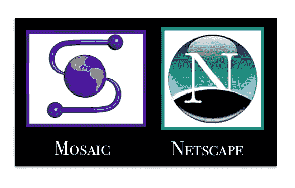

# Java 与 JavaScript:你应该知道的区别

> 原文：<https://hackr.io/blog/java-vs-javascript>

Java 和 Javascript，两者听起来可能很相似，因为“Java”这个词在两者中都很常见，但这两者完全不同。尽管 Java 和 JavaScript 都用于开发 web 和移动应用程序，但是 Java 和 Javascript 之间还是有很大的区别。在本文中，我们将研究 Java 和 Javascript 之间的差异，以及它们之间的相似之处。

让我们从这两种语言的一些概述开始。

## **Java 是什么？**

****

Java 是一种基于类、面向对象的通用编程语言，旨在尽可能减少实现依赖。它最初是由太阳微系统公司的詹姆斯·高斯林开发的，于 1995 年发布。Java 在几个领域有几个应用，web 开发和移动应用开发是它的主要应用。除此之外，它还用于嵌入式系统、桌面和科学应用等。Java 支持全球 30 亿台设备，包括计算机、智能手机、打印机、ATM、家庭安全系统等等。

## **Java 的历史**

****

*   该项目是由詹姆斯·高斯林、迈克·谢里丹和帕特里克·诺顿发起的。
*   Sun Microsystems 在 1995 年发布了它，公共实现在 1996 年作为 Java 1.0 发布。
*   它承诺 WORA(一次编写，随处运行)功能，在流行的平台上提供免费运行时间。
*   Java 1.0 编译器是 Arthur van Hoff 用 Java 重新编写的。
*   Java 2 于 1998 年 12 月发布，为不同的平台构建了多种配置。后来改名为 Java EE，Java ME，Java SE。
*   1997 年，Sun Microsystems 接触了各种标准团体，如 ISO/IEC JTC 1 和 Ecma 国际，以使其正式化，但很快就退出了该过程。
*   2006 年 11 月，JVM 发布。

### **Java 的特性**

*   **简单的**语法，简单易学。
*   **面向对象，遵循继承、抽象、多态、封装等概念。**
***   ***健壮*** 为其努力消除易错代码。此外，Java 通过自动垃圾收集器和异常处理来提供内存管理和错误处理异常。*   ***平台无关*** ，它通过 JRE 的帮助(Java 运行时环境)在任何平台上运行来遵循其 WORA 功能*   ***安全*** *，* Java 的安全特性使我们能够开发一个无病毒、无恶意的系统。*   ***多线程*** ，Java 的多线程特性使得编写一个程序同时做许多任务成为可能。因此，它利用相同的内存和其他资源来同时执行多个线程。*   ***架构中性*** *，*编译器生成字节码，与特定的计算机架构无关。*   ***高性能*** ，Java 通过使用即时编译器来实现高性能。*   ***分布式*** *如同*程序可以被设计成在计算机网络上运行。**

 **## **JavaScript 是什么？**

****

JavaScript 也缩写为 JS，是符合 ECMAScript 规范的高级、即时编译、多范例编程语言。它由花括号语法、动态类型、基于原型的面向对象和一级函数组成。JS 为万维网的核心技术做出了贡献，许多网站用它来处理客户端页面行为。作为一种多范式语言。JS 支持并启用事件驱动、函数式和命令式编程风格来构建交互式 web 页面。它提供了处理文本、日期、正则表达式、数据结构和文档对象模型(DOM)的 API。

### 推荐 JavaScript 课程

【JavaScript 全教程 2023:从零到专家！

### **JavaScript 的历史**

****

*   1993 年，Mosaic Web 浏览器发布，这是第一款带有 GUI 的浏览器
*   1994 年，Netscape Navigator 发布了一款精美的网络浏览器
*   1995 年，Netscape 决定在 navigator 中加入脚本语言来制作动态网页。
*   1995 年 9 月，一种新的语言&它的解释器被设计出来了&最初被称为 LiveScript，三个月后被改为 JavaScript。

### **JavaScript 的特性**

*   以对象为中心的脚本语言:它支持多态等特性，即一个对象可以有多种形式。
*   **客户端边缘技术:**客户端是指与用户相关的 Web 浏览器。客户端可以完全控制内容，由于客户端在 Java 脚本中的 edge 技术，内容在服务器中更新。
*   **用户输入的验证:**表单验证允许用户通过网页填写表单与客户端进行交互。
*   **Else 和 IF 语句:**执行逻辑表达式。
*   **以解释器为中心:**脚本语言是以解释器为中心构建的，允许用户在不使用编译器的情况下获得输出。
*   **执行内置函数的能力:** JS 提供了很多内置函数，比如 isNAN()、Number()、parseFloat()和 parseInt()。
*   **区分大小写格式:**以大写或小写格式编写的代码以同样的方式处理。
*   **轻量级和精致:** JavaScript 不包含变量，只使用对象来执行操作，从而提供轻量级和精致的代码。
*   **语句循环:**在 repeat 上执行相同的操作，即相同的代码在 repeat 中运行未指定或指定的时间量。
*   **处理事件:**JavaScript 具有控制网站响应的能力。它可以控制用户何时尝试执行由客户端处理的任何服务器操作，如点击链接和选项、网站上的交互响应等。

## 【Java 和 JavaScript 的相似之处

**面向对象编程:**两种语言都可以使用 [OOPs 概念](https://hackr.io/blog/oops-concepts-in-java-with-examples)，例如抽象、继承和多态，这些概念要求开发人员在彼此的上下文中编码对象及其关系。

**前端开发:** Java 和 JS 都在前端开发中扩展应用。JS 可以直接嵌入 HTML，实现为框架或者库；而 Java 是作为 Java 小程序使用的。

后端开发:两种语言都提供服务器端支持。Java 支持主要的后端技术，如 JBoss、Apache 和 WebSphere。Node.js 服务于 JavaScript 驱动的服务器。

## **Java 与 JavaScript:主要区别**

现在让我们看看 Java 和 JavaScript 之间的主要区别。

### **编程范例**

这两种语言之间的显著区别是它们的[编程范例](https://hackr.io/blog/programming-paradigms)，也就是说，一种编程语言解决问题的方式。Java 是一种基于对象概念的面向对象语言。另一方面，JS 是一种多范式语言，可以用作 OOP、过程语言或脚本语言。

### **型式检查**

类型检查验证变量的“类型”。JS 是一种动态类型语言，即变量的类型在程序编译之前是未知的。相反，Java 是一种静态类型语言，所以每个变量在声明时都必须与一个类型相关联。

### **继承**

继承的概念允许一个实体继承或派生另一个实体的属性。Java 允许一个类派生另一个类的属性。它还支持多重继承，即:一个类可以从多个类派生属性。

JS 基于原型的概念，不支持多重继承。

### **函数重载**

函数重载允许编程语言定义两个或多个同名函数来执行不同的任务。然而，函数根据它们的参数而不同。Java 支持函数重载，而 JS 不支持。

### **多线程**

多线程通过同时执行程序的多个部分来减少执行时间，从而利用 CPU 的能力。Java 支持多线程，而 JS 不支持，因为浏览器内部的解释器是单线程的。

## Java 与 JavaScript:面对面的比较

| 

### **参数**

 | 

### **Java**

 | 

### **JavaScript**

 |
| **编程范例** | 严格面向对象。 | 这种语言是多范式的。它可以作为面向对象的程序，或脚本。 |
| **型式检查** | 在编译之前，必须指定强类型变量的类型。 | 弱类型，变量的类型在编译之前是未知的。 |
| **代码执行** | Java 应用程序可以在任何 JVM 或浏览器上运行。 | JS 代码是特定于浏览器的，因为它只为浏览器开发。 |
| **物体** | Java 对象是基于类的。 | JS 中的对象是基于原型的。 |
| **文件扩展名** | 。Java 语言（一种计算机语言，尤用于创建网站） | 。射流研究… |
| **内存使用量** | 内存使用比较多。 | 内存使用较少。 |
| **多线程** | 支持多线程。 | 不支持多线程。 |
| **语言独立性** | Java 是一种独立的语言。 | JS 包含在网页中，嵌入在 HTML 中。 |
| **实现并发的方法** | Java 有一个基于线程的并发方法。 | JS 有一个基于事件的并发方法。 |
| **关闭** | 不支持闭包。 | 支持闭包。 |

## **结论**

Java 和 JavaScript 是开发行业中使用最广泛的语言。这两种语言都提供了面向对象的概念，如抽象、多态，以使 web 应用程序具有交互性和安全性。你可能想要学习使用这些语言的 web 开发，你可能想要查看[最佳 Web 开发课程](https://hackr.io/blog/best-web-development-courses)或者考虑通过 Hackr.io 推荐的 [JS 教程](https://hackr.io/tutorials/learn-javascript?ref=blog-post)来学习。您可以学习 web 应用程序的前端编程或后端编程，因为 Java 和 JavaScript 都支持 web 开发的这两个领域。

Java 和 JavaScript 之间还有其他不同之处吗？下面评论。

**人也在读:****