# 初学者和专业人士的 16 本最佳 JavaScript 书籍[2023]

> 原文：<https://hackr.io/blog/javascript-books>

让我们承认——JavaScript 是最大和最广泛使用的编程语言之一。事实上，它是如此受欢迎，以至于今天几乎 95%的*网站*都在使用它。

是的，是真的。JavaScript 是前端 web 开发的领先名称之一，这使它成为 2023 年学习的[最佳编程语言之一，也是全球 web 开发人员最喜欢的语言之一。](https://hackr.io/blog/best-programming-languages-to-learn-2021-jobs-future)

如果您有兴趣学习 JavaScript 语言来扩展您的技能，那么您很幸运。有很多种方法可以让你快速开始学习，从教程到课程和大学学位。

这可能感觉违反直觉，但如果你想学习 JavaScript，书籍仍然可以派上用场。他们有，而且很可能永远会有，学习 JavaScript 的绝佳途径。

一本好的 JavaScript 书能给你提供你以前可能不知道的独特见解。这些书可以作为方便的参考和指南，同时也允许你在需要的时候更新你的知识。如果你想找一两本书放在书架上，那你来对地方了。

在本文中，我们列出了 2023 年提供的一些最好的 JavaScript 书籍。无论你是想学习更多关于异步编程还是面向对象的 JavaScript，下面的书都很有见地。我们开始吧！

## **2023 年最好的 JavaScript 书籍**

下面的列表向你展示了每个类别中最好的书。

## 什么是最好的 JavaScript 书籍？

如果你不知道如何确定哪些书适合你，拥有一大堆最好的 JS 书籍是没有用的。当然，在买东西之前你应该考虑的一件事是价格。但在这种情况下，还有其他的东西要看。这个标准列表可以帮助您确定哪些书值得您花费时间，无论您是第一次学习 JS 还是增强您现有的 JavaScript 知识。

*   调查一本你感兴趣的书的作者总是一个好主意。他们是这方面的专家吗？换句话说，他们有没有可信度和资格来教你 JavaScript？如果这本书是由一个不确定的作者或者一个不确定的爱好者写的，你在购买前可能要三思。相反，如果一本书是由 web 开发人员尊敬的人写的，这表明它可能是一本好书。
*   在你购买或开始阅读任何书籍之前，你必须先弄清楚自己的技能水平。建议你在自己的技能水平范围内购买一本书(如果你需要挑战，也可以稍微高一点)，因为这能让你更容易按照自己的速度学习。随着技能的提高，以后可以借用或购买额外的 JavaScript 教材。
*   这本书写得够好吗？例如，课程是否写得足够清晰和简明，让你能够理解？JavaScript 可能是一门很难学的课程，尤其是对新手来说。因此，寻找对你来说更容易学习的书籍是有好处的。
*   书籍固然很好，但有时你需要一些其他资源来更有效地学习一些东西。这本书有任何额外的资源吗比如练习或一个配套网站？如果单独阅读感觉不尽如人意，似乎不是最好的学习方式，可以考虑提供辅助学习材料的书籍。

最后，虽然这并不总是必要的，但寻找一本可以让学习变得有趣的书可能会让你受益——毕竟，当你快乐的时候，你就不太可能发现学习是一种拖累。有些书的语气没有其他书那么严肃，这也有助于减轻你的经历。您可能会发现这些是学习 JavaScript 的最佳书籍！

## **2023 年最好的 JavaScript 书籍**

无论您是 JavaScript 开发新手，还是希望进一步提高技能的高级人员，以下书籍都值得考虑。

### **初学者最佳 JavaScript 书籍**

**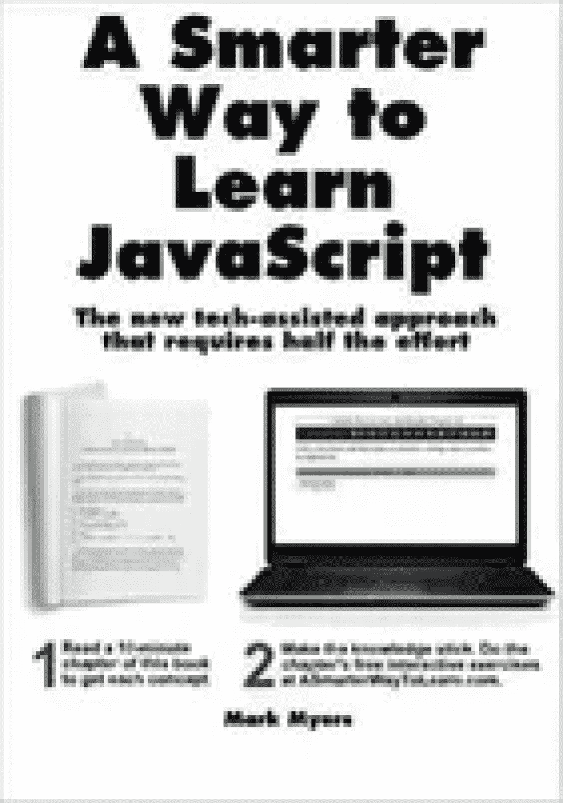**

**评级**–4.6/5

**作者**——马克·迈尔斯

**最新版本**–第一版

**出版商**–打造空间独立出版平台

根据《学习 JavaScript 的更聪明的方法》一书的作者 Mark Myers 的观点，愿意学习 JavaScript 的人面临两个重要问题:记忆和理解。迈尔斯写这本书来解决这两个问题并不奇怪，这本书成为了学习 JavaScript 的最佳书籍。

整本 256 页长的书被分成简短的，容易理解的章节。在作者的网站上，每一章后面都有 20 个免费的和无限可重复的示例练习。

[立即购买](https://geni.us/3ftAT)

想在课程中学习 JavaScript 吗？在 Udemy 查看[完整的 JavaScript 课程 2023:从零到专家](https://click.linksynergy.com/deeplink?id=jU79Zysihs4&mid=39197&murl=https%3A%2F%2Fwww.udemy.com%2Fcourse%2Fthe-complete-javascript-course%2F)。

**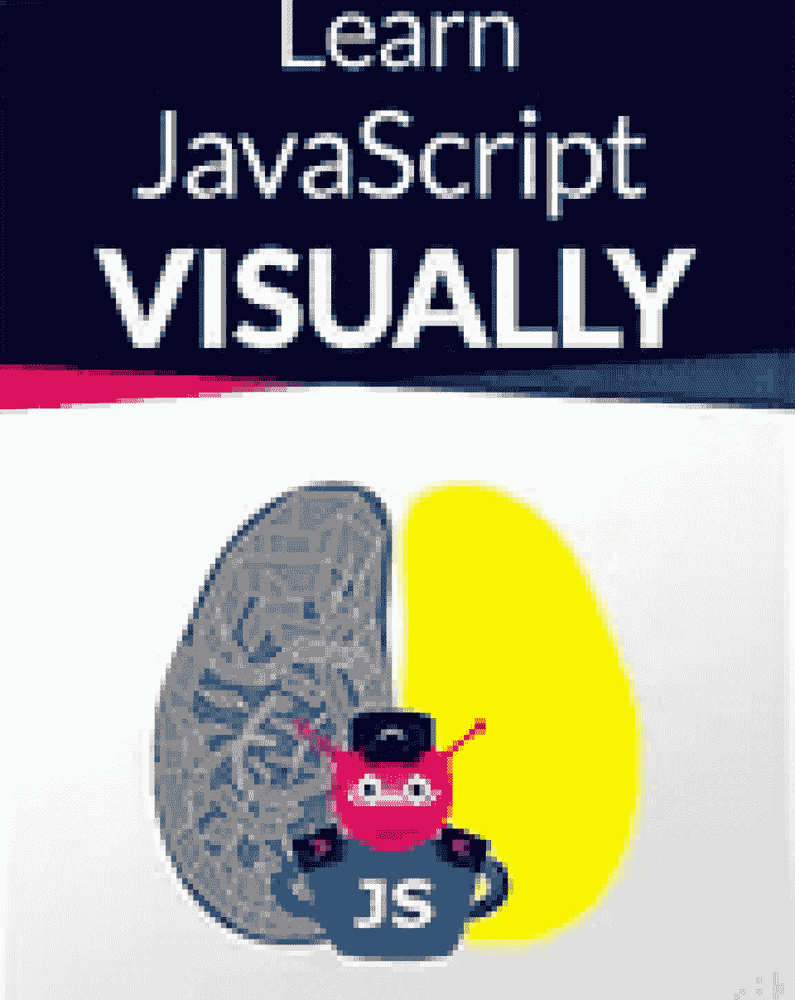**

**评级**–4.3/5

**作者**——艾夫林·德米罗夫

**最新版本**–第一版

**出版商**——奈公司。

你是视觉学习者吗？我们中的一些人只是通过演示、图片、例子等等来更好地学习。对于想要快速掌握 JS 基础知识的视觉初学者来说,《视觉学习 JavaScript》是关于 JavaScript 的最佳书籍。作者 Ivelin Demirov 采用的可视化方法有助于分解更复杂的主题。

[立即购买](https://geni.us/idA3HR)

**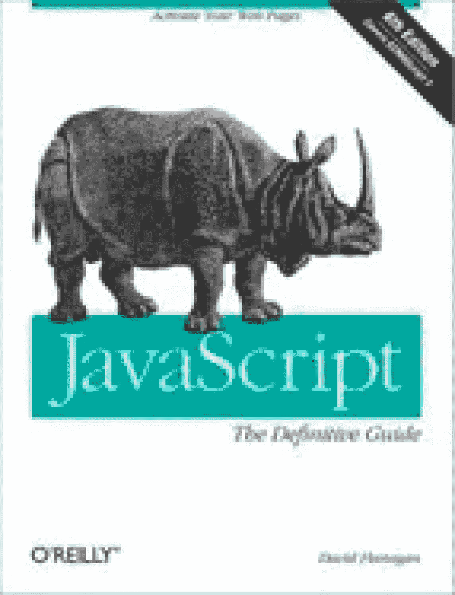**

**评级**–4.5/5

作者——大卫·弗拉纳根

**最新版**–第六版

**出版商**–奥莱利

JavaScript:权威指南是另一本初学者友好的书，适合任何对构建强大的 web 应用感兴趣的人。它探讨了几个针对 web 应用程序开发的 JS 和 web 平台 API 特性。阅读这本书可以帮助你深入理解闭包、图形、原型等的工作原理。

[立即购买](https://geni.us/EGjBG7)

另外，杜克大学在 Coursera 开设了这门关于 Java 编程和软件工程的课程。

**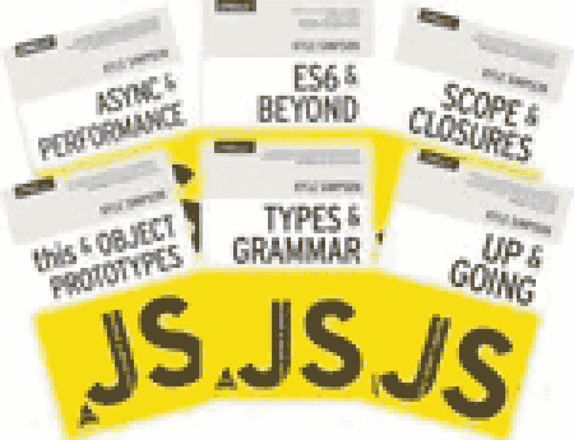**

**评级**–4.7/5

**作者**——凯尔·辛普森

**最新版本**–第一版

**出版商**–奥莱利媒体

《你不知道 JS》不像这个列表中的其他书籍那样是一本书，而是一个系列丛书，旨在帮助读者熟悉 JavaScript 最微妙的技术方面。《你不知道的 JS》系列共 6 本书，从 JavaScript 基础开始，然后是闭包、对象、作用域，最后是 ES2016 的变化。

任何阅读《你不知道的 JS》一书的人肯定会对 JavaScript 有一个基本的理解和欣赏，这种理解和欣赏只会随着时间的推移而加深。

[立即购买](https://geni.us/AmYXwy1)

****

**评级**–4.4/5

作者:杰里米·麦克皮克和保罗·威尔顿

**最新版**–第五版

**发布者**–Wrox

Paul Wilton 和 Jeremy McPeak 的《JavaScript 入门》是初学者的绝佳起点。这本书是专门为帮助初学者理解这门语言的基础而写的，帮助他们踏上成为一名 JavaScript 开发人员的旅程。

[立即购买](https://geni.us/R6lezV)

**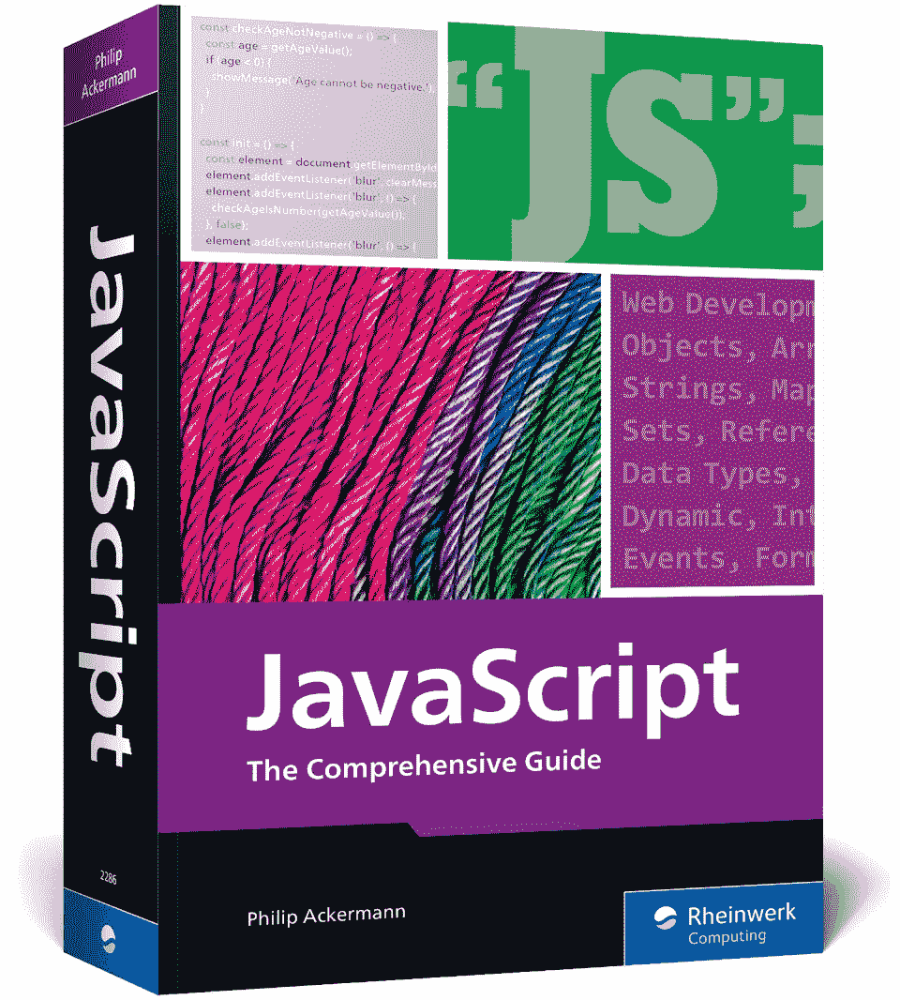**

**评分—** 4.9/5

**作者—** 菲利普·阿克曼

**最新版—** 第一版(2022 年 8 月)

**出版商—** 莱茵沃克计算

这本 JavaScript 书将教你使用 JavaScript 编程的基础知识。有些练习要求你熟悉 HTML 和 CSS。它还有关于高级编程主题的章节，如面向对象和函数式编程。

这本书包括构建前端和后端应用的章节。您还将学习如何使用 React 和 Iconic 开发移动应用程序。以及使用 Electron.js 的桌面 app 开发

这本书的一个优点是它有一个精心制作的索引。这便于学习者导航和交叉引用。

[立即购买](https://geni.us/JavaScriptBook)

我们还找到了一门主要关注项目的课程。你可以在 Udemy 注册[初级 JavaScript】。](https://click.linksynergy.com/deeplink?id=jU79Zysihs4&mid=39197&murl=https%3A%2F%2Fwww.udemy.com%2Fcourse%2Fjavascript-for-beginners-introduction-learn-fast-easy%2F)

### **高级学习者最佳 JavaScript 书籍**

**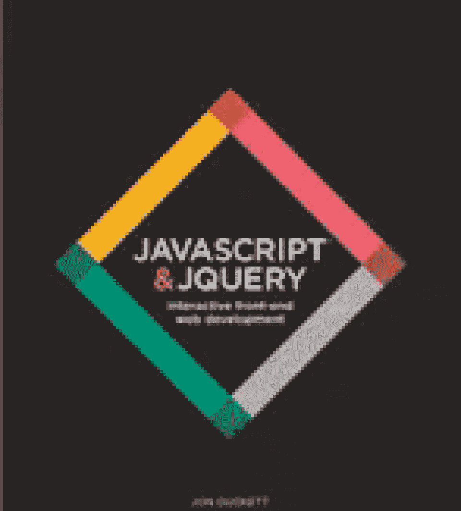**

**评级**–4.6/5

**作者**——乔恩·达克特

**最新版本**–第一版

**出版商**–威利

有兴趣一起学习 JavaScript 和 jQuery 来开始 web 开发吗？JavaScript 和 JQuery:交互式前端 Web 开发是我们的首要推荐。

前进到下一个概念不是随机的，而是遵循本书中的逻辑方向。从 JavaScript 到 jQuery 的过渡是一个很好的例子，说明了如何以正确的方式完成这项工作。

[立即购买](https://geni.us/BSWCCoZ)

**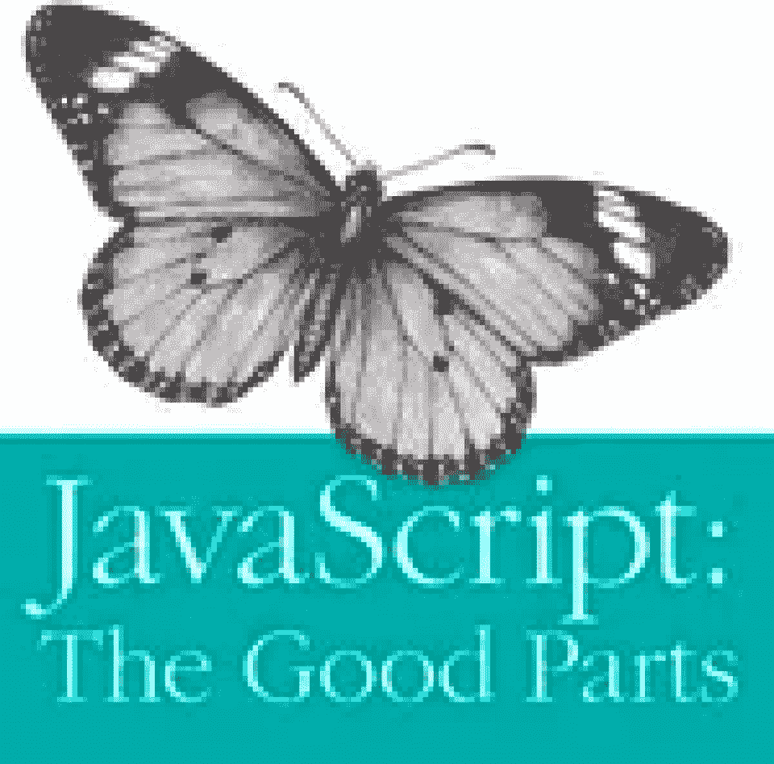**

**评级**–4.5/5

**作者**——道格拉斯·克洛克福特

**最新版本**–第一版

**出版商**–奥莱利

在《JavaScript:优点》一书中，作者道格拉斯·克洛克福特重点介绍了 JavaScript 的一些鲜为人知但却很受欢迎的基础知识。直到最近，这些隐藏的特性才得到编程社区应有的重视。

在最初撰写《JavaScript:精彩部分》时，JavaScript 是一种新生的编程语言，被认为是浏览器中的一种微型脚本语言。在此期间，开发人员开始探索用于严肃应用程序开发的浏览器。

在此之前，很少能看到真正的应用程序在浏览器中运行。浏览器与我们今天使用的浏览器完全不同。它没有交互性，严重依赖页面重新加载，并且没有任何内置存储容量。

这本书追溯了 JS 从那时到现在的发展。

[立即购买](https://geni.us/eOn7Loo)

****

**评级**–4.6/5

**作者**——大卫·赫尔曼，由布伦丹·艾奇作序

**最新版本**–第一版

**出版商**–艾迪森·韦斯利

这本 JavaScript 书将带领读者深入了解高级解释编程语言。

作者大卫·赫尔曼是一位经验丰富的程序员。通过这本书，他分享了他的技术经验，通过现实和精心制作的例子。

有效的 JavaScript: 68 种利用 JavaScript 能力的具体方法向读者介绍了动态、基于原型和弱类型编程语言的几个优点，从浮点数精度到分号插入和类型强制。

它进一步探讨了在使用 API 设计、数组、并发性、函数、库和对象时要记住的最佳实践。

[立即购买](https://geni.us/zAdYU)

**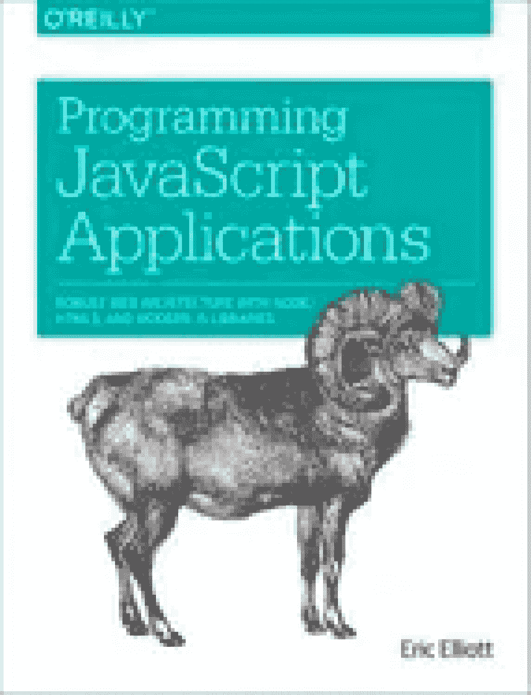**

**评级**–4.2/5

**评级**–埃里克·埃利奥特

**最新版本**–第一版

**出版商**–奥莱利

不像其他 JS 书籍回答“我如何使用 JavaScript？”JavaScript 应用程序编程回答:“我如何使用 JavaScript 来构建一个真实世界的应用程序？”

《JavaScript 应用程序编程》是一本很好的书，它提供了 JavaScript 应用程序架构的精确概述。它涵盖了函数式编程的基本概念、JS 最佳实践、原型介绍和对象组合。

除了扩展对 JS 的理解，它还涵盖了身份验证和授权、特性切换系统、日志记录、节点基础和 RESTful APIs。

[立即购买](https://geni.us/y9Z6j)

### **最佳儿童 JavaScript 书籍**

**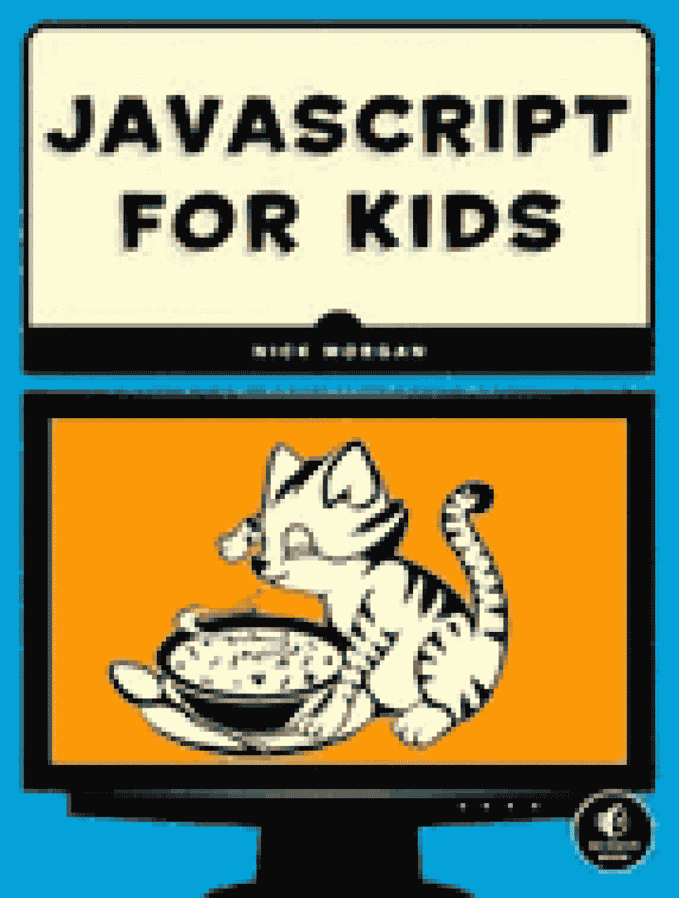**

**评级**–4.6/5

**作者**——尼克·摩根

**最新版本**–第一版

**出版商**–无淀粉出版社

面向儿童的 JavaScript:有趣的编程入门提供了对各种基本编程概念的奇特探索。它还深入探讨了一些 JavaScript 概念和 JavaScript 编程，为孩子们提供了宝贵的基础知识。

全书分为三个部分，分别是:

*   **第一部分:**基础——涵盖基本元素和关键 JavaScript 概念，包括条件语句、数据类型、函数和循环。关于创建简单的 HTML 网页以及基于文本版本的刽子手游戏的细节。
*   **第二部分:**高级 JavaScript——介绍建立在第一部分基础之上的高级技术。该部分的内容包括 jQuery、面向对象编程、响应浏览器事件以及用计时器间隔运行代码。整个部分归结为建设找到埋藏的宝藏！游戏。
*   第三部分:Canvas——关于 HTML5 canvas 元素的细节，如何在 Canvas 上绘图，如何制作动画，以及如何使用键盘控制动画。总结了创建经典的蛇游戏的练习部分。

中级 JavaScript 开发人员可能想看看别处，因为这本书比其他任何书都涵盖了更多的基础知识。

[立即购买](https://geni.us/GAcN82)

**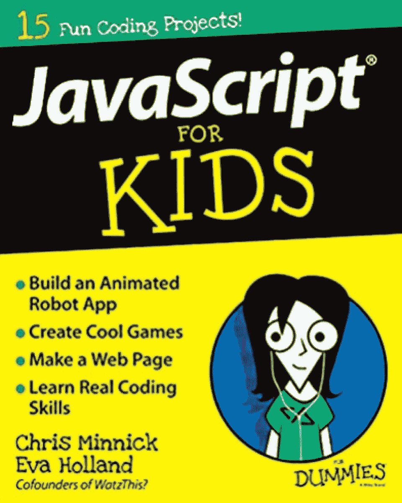**

**评级**–4.5/5

作者:克里斯·明尼克和伊娃·霍兰德

**最新版本**–第一版

**出版商**——针对假人

面向儿童和青少年的 JavaScript 向他们介绍了编程语言 JavaScript。如果你想让你的孩子学习这门语言的基础知识，那么这本学习 JavaScript 的最佳书籍肯定会被竞争。我们很乐意称之为最好的 JavaScript 编程书籍之一，因为尽管它面向年轻读者，但即使是成年人也能从中受益。

为了巩固所学的知识，学生们做一些小的面向目标的编码项目，进一步推动 JavaScript home 的关键概念。这些项目有助于提供一些实践经验，同时学生可以在制作游戏、应用等方面获得乐趣。

旨在让学习变得有趣的 JavaScript For Kids For Dummies 让学生们创建一个计算器应用程序、一个柠檬水摊应用程序和一个 mad-libs 风格的游戏。

[立即购买](https://geni.us/tQfGBO)

### **最佳免费 JavaScript 书籍**

**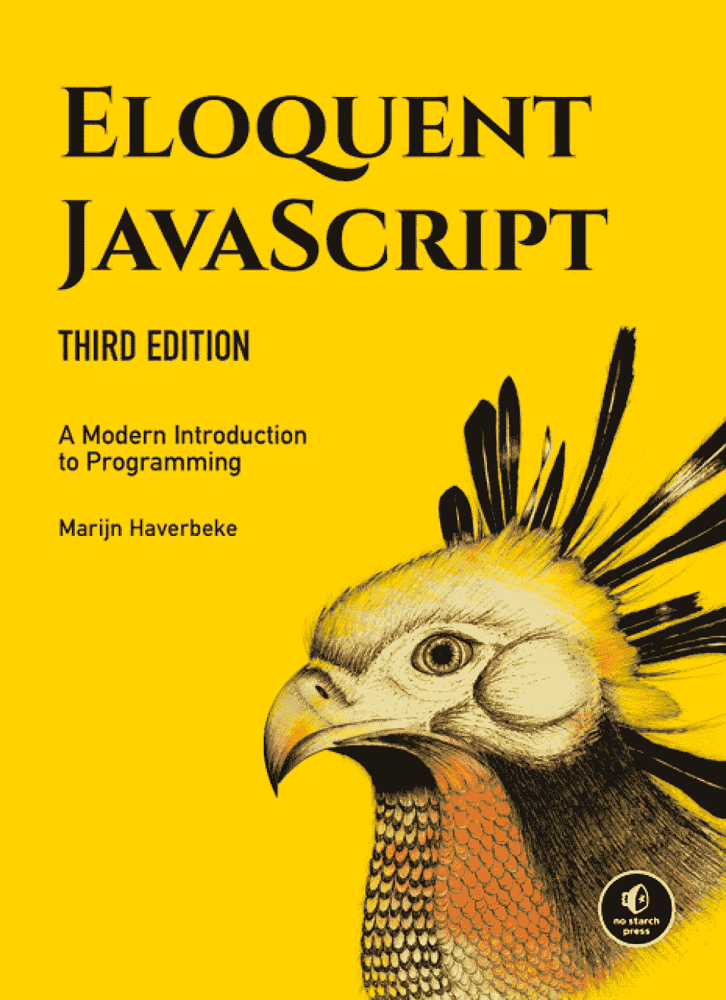**

**评级**–4.5/5

**作者**——马金·哈弗贝克

**最新版本**–第三版

**出版商**–无淀粉出版社

《雄辩的 JavaScript:现代编程入门》中最突出的可能是大量使用练习。

雄辩的 JavaScript 让读者很容易消化所有的知识，这要归功于它的编写方式。虽然本质上不是一本 JavaScript 书，但它提供了使用 JavaScript 编程的介绍。

[立即购买](https://eloquentjavascript.net/)

**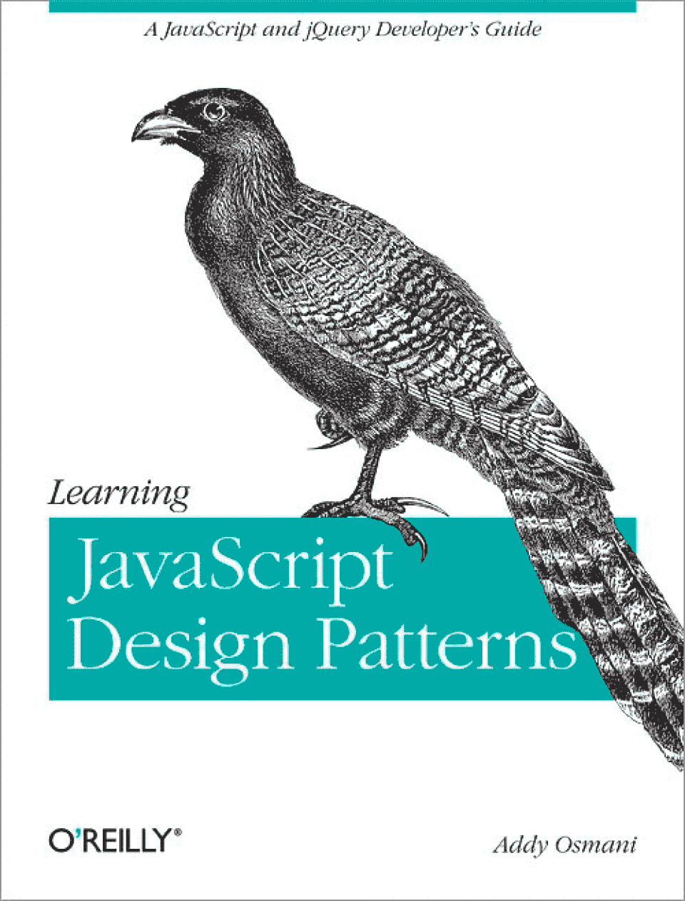**

**评级**–4.4/5

**作者**–艾迪·奥斯马尼

Addy Osmani 是一名 Google 开发者项目工程师，他决定用 JavaScript 编写设计模式。这本书涵盖了设计中所谓的“四人帮”模式，包括 jQuery 插件设计、命名空间模式等等。设计模式是软件设计中常见问题的可重用解决方案。学习 JavaScript 设计模式探究经典和现代 JavaScript 设计模式。

这本书本身基于 Addy Osmani 以及其他知识渊博的专家发表的博客帖子和文章。在某种程度上，它将大量有用的信息汇集到一个地方，这样你就不必浪费时间浏览几个页面来阅读相同的信息。

[立即购买](https://www.patterns.dev/posts/classic-design-patterns/)

****

**评级**–4.6/5

**作者**–JavaScript . info

虽然不一定是一本书，但现代 JavaScript 教程仍然是学习这种极其流行的编程语言的绝佳资源。它甚至可能是你唯一需要的 JS 教程。

现代 JavaScript 教程分为三个不同的部分，每个部分涵盖了语言学习的不同方面:

*   第 1 部分:JavaScript 语言
*   第 2 部分:浏览器:文档、事件、界面
*   第 3 部分:附加条款

这个教程组织得很好。因此，即使这个资源可能会让人感到有点害怕，你可能会发现开始时并没有你最初想的那么麻烦。如果您想了解异步编程、错误处理、面向对象的 JavaScript 等等，可以从这里开始。

[立即购买](https://javascript.info/)

**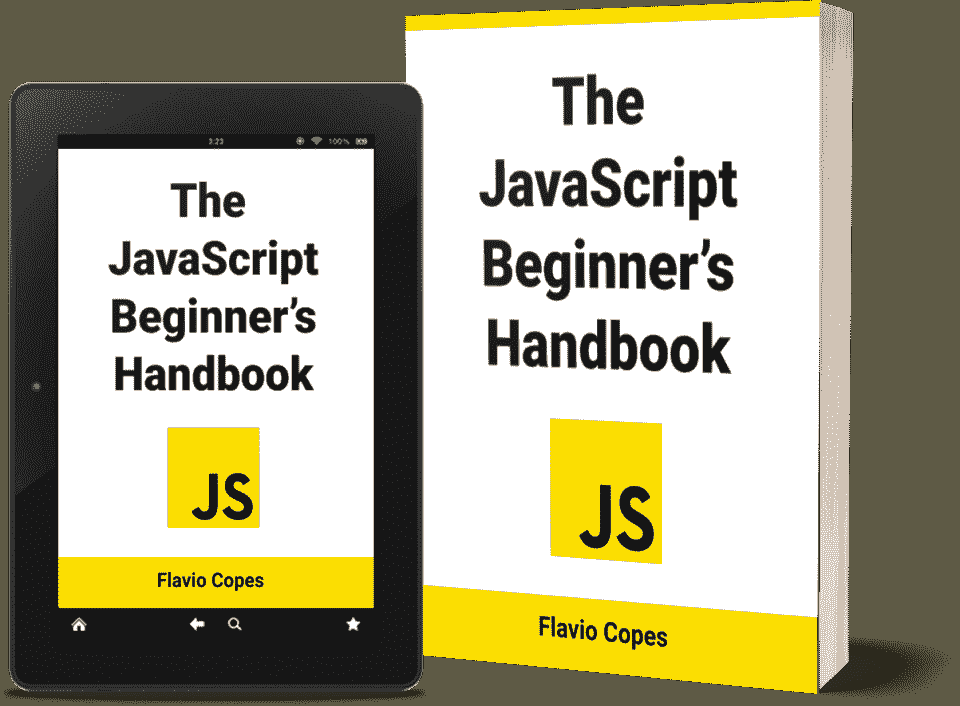**

**评级**–4.6/5

**作者**–弗拉维奥·科普斯

如果你想免费学习更多关于 JavaScript 的知识，JavaScript 初学者手册是一个很好的起点。这本书由 Flavio Copes 编写，对于那些想要扩展 JavaScript 知识的人来说是一个极好的资源。我们很乐意称之为学习 JavaScript 的最佳书籍之一，尤其是因为它是 100%免费的！

虽然这本书叫做《初学者手册》,但它不一定是为初学者编写的。在本书中，您将了解值、语法、字符串、变量、对象等等——如果不是全部，也是大部分成为一名有效的开发人员所需学习的内容。

如果你喜欢《JavaScript 初学者手册》,也许值得看看 Flavio Copes 的其他书。如果你在他的网站上注册订阅时事通讯，他目前有 15 份免费的。

[立即购买](https://www.freecodecamp.org/news/the-complete-javascript-handbook-f26b2c71719c/)

## **其他值得一读的内容**

尽管我们在上面列出了一些非常好的 JavaScript 书籍，但这并不意味着这些是唯一值得一读的。还有无数其他书籍充满了洞察力和知识，可以帮助网站开发人员的职业生涯。

以下书籍适合 web 开发人员、初级或中级 Javascript 开发人员，甚至高级专业人员。它们涵盖了关键的 JavaScript 概念、JavaScript 函数等等。

## **结论**

书籍永远是一个很好的学习方式，尽管如果你想学习像 JavaScript 这样复杂的东西，你可能想找一些有补充资源的书籍。尽管如此，阅读一本书可以让你了解 JavaScript 框架和 T2 集成开发环境。

有各种各样的 JavaScript 书籍供您随时挑选。通过这些书，您可以收集成为一名成功的 JavaScript 开发人员所需的所有知识，从面向对象的 JavaScript 到错误处理等等。

我们希望这份 JavaScript 最佳书籍清单能帮助你找到下一本书。如果你认为我们错过了一个应该包括在内的，请在下面的评论中告诉我们！

你准备好开始你的开发者生涯了吗？考虑通过获得 [**最佳 JavaScript 认证**](https://hackr.io/blog/best-javascript-certification) **之一来改善你的简历。**

## **常见问题解答**

#### **1。JavaScript 初学者看哪本书最好？**

如果你是一个想要学习的新手，你可以看看 JavaScript:权威指南。如果你想找一个免费的版本，你可以看看 JavaScript 初学者手册。

#### **2。一周能学会 JavaScript 吗？**

你当然可以，尽管在这个时间线内你可能不会超越基础太多。这取决于你有多少编码经验，你花了多少时间来学习 JavaScript 语言。如果你参加训练营，这是一个高强度的 JavaScript 课程，你可以加速你的学习。

#### **3。可以从书上学 JavaScript 吗？**

阅读学习 JavaScript 的书籍是精通 JS 编码的一种非常有效的方法。然而，仅仅阅读是不够的——还要确保你做练习和项目来获得一些实践经验。边做边学是真正掌握新技能的最好方法之一。

#### **4。3 个月能学会 JavaScript 吗？**

我们已经确定，如果有足够的投入，在一周内学会 JavaScript 是可能的(可能通过参加训练营或课程)。所以答案是肯定的，你可以在 3 个月内学会 JavaScript，只要你投入足够的时间和精力！