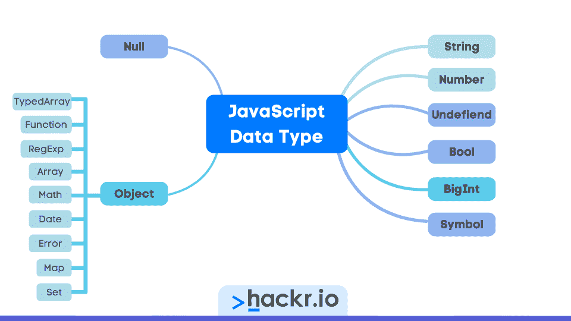
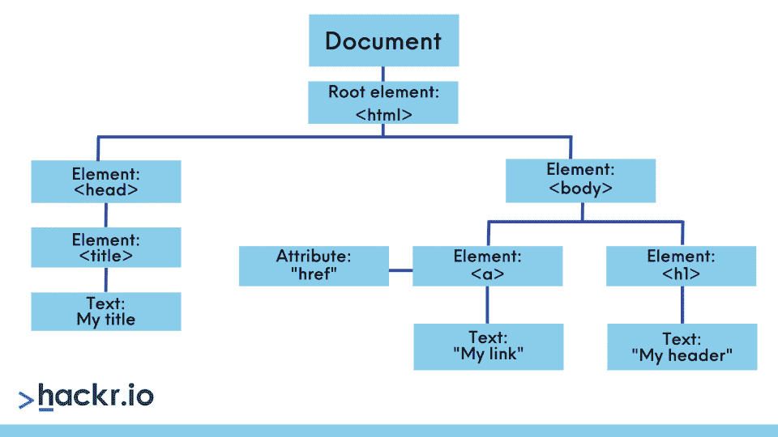
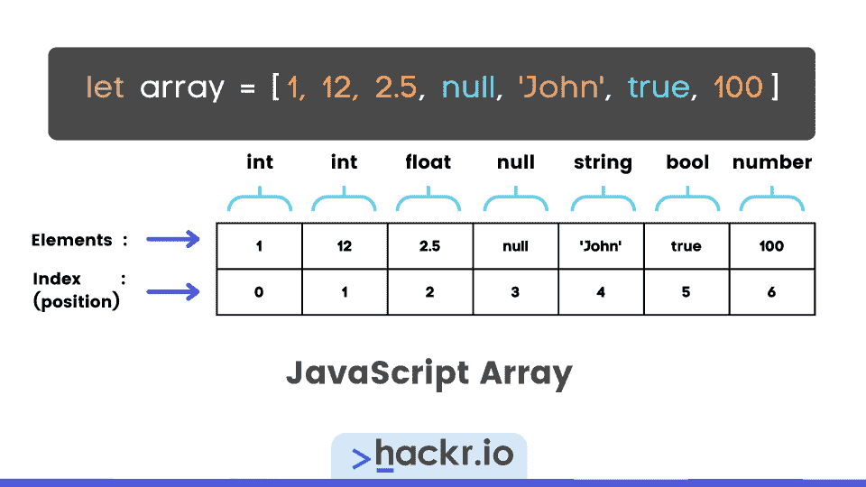
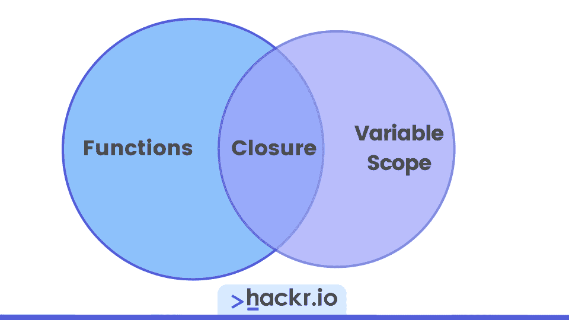
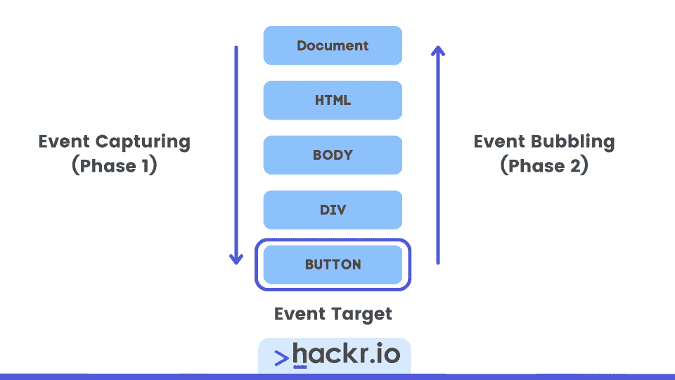

# 2023 年 60 大 JavaScript 面试问答

> 原文：<https://hackr.io/blog/javascript-interview-questions>

JavaScript 仍然是有抱负的软件开发人员和经验丰富的专业人员的最爱，正如它在年度[栈溢出开发者调查](https://survey.stackoverflow.co/2022/#most-popular-technologies-language)中排名第一所示。

无论你是一名 JavaScript 新手还是一名经验丰富的工程师，准备在新公司接受新的挑战，准备面试都是令人头疼的事情！但是如果你准备好了 JavaScript 的面试问题，你就会自信地准备好他们可能会问的任何问题。

所以，如果你正在寻找 JavaScript 面试的帮助，你来对地方了。我们整理了一份 60 个顶级 JavaScript 面试问题和答案的列表，从初级到高级不等。因此，请抓紧时间，将这篇文章或下载的 PDF 文件作为建立信心的资源，为下一次 JavaScript 面试做准备。

**[下载 Hackr.io 的 JavaScript 面试问答 PDF](https://drive.google.com/file/d/1BNz3rcZPn-3cDwtSYPRaHaHtWFo9wzSi/view)**

**想学 JavaScript？结账**

**[最好的 JavaScript 课程](https://hackr.io/blog/best-javascript-courses)**

## **基础 JavaScript 面试问题**

### **1。JavaScript 是什么？**

JavaScript 是一种流行的 web 脚本语言，用于客户端和服务器端开发。JavaScript 可以插入到 HTML 页面中，并由 web 浏览器执行。

除了 web 开发，它还用于移动应用程序开发、游戏开发、查询数据库等等。

*注意:这是最基本的 JavaScript 问题，所以不要忽视它是很重要的。*

### **2。列出 JavaScript 的一些关键特性。**

*   具有面向对象编程(OOP)的轻量级解释语言
*   动态类型化
*   独立于平台
*   提供客户端验证

### **3。JavaScript 和 Java 有什么不同？**

虽然它们的名字中有一些相同的字母，但它们并不相通，而且是为不同的目的而设计的。Java 是一种面向对象的语言，而 JavaScript 是一种面向对象的脚本。这意味着 JavaScript 是用文本写的，然后解释，Java 是编译的。在 app 方面，Java 用于在设备或浏览器上创建 app，JavaScript 主要用于 HTML 文档和浏览器。

对于一行注释，使用两个正斜杠符号(//)

```
// Add a single line of comment
```

对于多行注释，用斜线和星号(/* */)将它们括起来

```
/*
Adding
multiple lines
of comments
*/
```

注意这是最基本的 JavaScript 编程问题之一，所以请确保你知道它。

### **5。未声明的&未定义变量有什么区别？**

未声明的变量没有在代码中的任何地方声明，所以所说的变量不存在。如果试图读取未声明的变量，JavaScript 会抛出错误。

程序中声明了一个未定义的变量，但没有赋值。这意味着变量存在，但其值尚未定义。

### **6。总结基本的 JavaScript 数据类型。**

*   **字符串:**表示文本，用单引号、双引号或反勾号表示
*   **数字:**表示数字(整数&浮点值)
*   **BigInt:** 精确表示非常大的数字
*   **布尔**:代表真&假值
*   **Null:** 表示空的、没有任何内容的、未知类型的值
*   **符号:**用于创建对象的唯一标识符
*   **未定义:**当一个变量被声明但尚未赋值时



### **7。如何从一个 JavaScript 文件中导入所有命名的导出？**

您可以使用 import 关键字和星号(*)符号。

```
Import * as objectName from'./file-path.js';
```

*注意，这是 JavaScript 编码面试中的一个问题，最好知道。*

### **8。描述使用 JavaScript 最重要的优势。**

*   增强的交互性:允许创建对用户输入做出反应的界面
*   **即时反馈:**访问者不需要等待页面重新加载来查看他们是否忘记输入重要的细节
*   **低服务器交互:**允许在向服务器发送数据之前验证用户输入，减少服务器流量和负载
*   丰富的界面:像拖放组件和滑块这样的项目增强了 UX

### **9。属性和属性的区别是什么？**

属性可以是各种数据类型，并且与 JavaScript DOM 对象相关，很像 DOM 元素的实例变量。

属性是 HTML 的一部分，与属性不同，它是一种*字符串*数据类型。

### 10。如何在 HTML 文件中嵌入 Javascript 代码？

1.  使用

```
<!DOCTYPE html>
<html>
  <head>
    <script>
      console.log("This is JS code.");
    </script>
  </head>
  <body>
  </body>
</html>
```

2.  在扩展名为. js 的外部文件中编写 JavaScript 代码，然后在 Script 标签中使用 *src* 属性。

```
<!DOCTYPE html>
<html>
  <head>
    <script src="file_path.js"></script>
  </head>
  <body>
  </body>
</html>
```

**11。解释双倍(==)和三倍(===)等于的区别。**

双等于(==)用于比较值，不考虑类型，三等于(===)用于比较值，同时也考虑类型。

如下例所示，firstValue 的值*大致等于 secondValue 的值*，second value 为 double equals 返回 true。

但是当我们对三重 equals 使用严格相等时，它返回 false，因为当它们都具有值 1 时，firstValue 是一个*数字*类型，secondValue 是一个*字符串*类型。

```
var firstValue = 1;
var secondValue = "1";

console.log(firstValue == secondValue); // true
console.log(firstValue === secondValue); // false
```

### **12。JavaScript 中的正无穷大&负无穷大是什么？**

这些是 JavaScript 中 Number 对象的属性，其中正数 _INFINITY 高于任何其他数字，负数 _INFINITY 低于任何其他数字。这些只能用作 Number 对象的属性。

```
Number.POSITIVE_INFINITY;
Number.NEGATIVE_INFINITY;
```

### 13。画一个简单的 JavaScript Dom(文档对象模型)。

****

### **14。JavaScript 中的 NaN 是什么？**

NaN，或“非数字”，表示 JavaScript 不将该值识别为合法数字。可以用 *isNaN()* 函数检查一个值是否为 NaN。

```
console.log(isNaN("John Doe")); //true
console.log(isNaN(25)); // false
```

### 15。JavaScript 中有哪些循环结构？

*   对于循环
*   While 循环
*   Do-while 循环

### 16。什么是提示框？

带有标签和文本字段的输入容器，允许用户输入内容。

### **17。警告&确认框有什么区别？**

警告框向用户显示一个“确定”按钮，而确认框显示两个按钮“确定”和“取消”。

### 18。JavaScript 区分大小写吗？

是的。名为 sayHello 的变量和名为 sayhello 的变量将被视为两个独立的变量。

### **19。如何用 Javascript 处理异常？**

你使用 *try…catch…finally* 语法。

*   **try 语句:**定义你想要运行的代码
*   **catch 语句:**处理错误
*   **finally 语句:**不管任何错误都要运行的代码

```
try {
// code to run
}

catch(err) {
// code to handle errors
}

finally {
// code to run regardless of try / catch result
}
```

20。如何运行一个 JavaScript 文件？

在 HTML 文件的*头*或*体*元素中添加一个*脚本*元素，然后使用脚本元素的 *src 属性*链接到一个外部脚本。

要在终端中运行 JavaScript 文件，必须在计算机上安装 Node。打开您的终端并导航到。您想要运行的 js 文件。然后，运行下面的命令。

```
node file_name.js
```

**JavaScript 新手？查看我们在**上的文章

**[如何学习 JavaScript](https://hackr.io/blog/how-to-learn-javascript)**

### **21。如何用 Javascript 创建数组？**

1.  用*新的*关键字:

    ```
    let myArray = newArray('value1', 'value2',..., 'valueN');​
    ```

    创建一个实例
2.  使用 *Array.of()* 方法:

    ```
    let myArray = Array.of('value1', 'value2',..., 'valueN');​
    ```

3.  使用数组文字:

    ```
    let myArray = [value1, value2,...., valueN];​
    ```

**

确保你已经准备好回答 JavaScript array 面试问题，因为这些问题很容易回答！

### **22。在 Javascript 中如何检查一个值是否在数组中？**

1.使用*。包含()*

```
let myArray = [1, 2, 3, 4, 5,];
console.log(myArray.includes(1)); // true
console.log(myArray.includes(7)); // false
```

2.使用 **。*index of()*

```
let myArray = [1, 2, 3, 4, 5];
console.log(myArray.indexOf(1) !== -1); // true
console.log(myArray.indexOf(7) !== -1) // false
```

3.使用*。find()*

```
let myArray = [1, 2, 3, 4, 5];
console.log(myArray.find(value => value === 1)); // 1
console.log(myArray.find(value => value === 7)); // undefined
```

### **23。JavaScript 中的函数是对象吗？**

函数是 JavaScript 中的类对象，因为它们可以传递给其他函数或从其他函数返回，可以分配给变量或属性，并且它们像所有对象一样具有属性和方法。

### **24。JavaScript 中的类是什么？**

创建对象的蓝图，它提供了定义对象方法和属性的方法。您可以用*类*关键字来定义它们。

```
class Person {
  constructor(name) {
    this.name = name;
  }

  sayHi() {
    console.log(`Hi ${this.name}`);
  }
}

const user = new Person("Jane");
user.sayHi(); // "Hi Jane"
```

### **25。JavaScript 是基于类的语言吗？**

不，它是基于原型的语言。JavaScript 使用原型来定义对象属性，对象不是类的实例，而是从创建原型链的其他对象继承属性和方法。

在基于类的语言中，对象是类的实例，类定义对象属性和方法。

注意这是一个棘手的 JavaScript 面试问题，所以确保你知道它。

### **26。JavaScript 中的提升是什么？**

函数或变量声明被提升到其作用域的顶部，不管它们位于代码中的什么位置。

这只适用于用 *var* 关键字声明的变量，不适用于 *let* 或 *const* 变量。

### **27。Async/Await &承诺有什么区别？**

这两者都处理异步代码。Promises 使用一个 *then()* 方法处理解析的值，使用一个 *catch()* 方法处理错误。Async/await 是 promisethat 周围的一个*语法包装器*，它使用 *try/catch* 块来处理错误，使用 *await* 关键字来等待解析的值。

### **28。如何用 JavaScript 创建一个新对象？**

1.  使用对象文字

```
const user = {
  name: "Jane Doe",
  age: 25
};
```

2.  使用*新的*关键字

```
const user = newObject();
user.name = "Jane Doe";
user.age = 25;
```

这是一个需要知道的又好又简单的 JavaScript 编码问题。

### **29。JavaScript 中的构造函数是什么？**

构造函数用于创建类的对象实例。要调用构造函数，可以使用 *new* 关键字。

```
function User(name) {
  this.name = name;
}

let firstUser = new User('John Doe');
```

三十岁。如何从指定的索引中返回一个字符？

使用 *charAt()* 方法。在下面的例子中，我们可以检索索引为 0 的第一个字符来获取 *J* 。

```
let userName = "John";
console.log(userName.charAt(0)); // "J"
```

### 31。使用外部 JavaScript 文件有什么好处？

它将 HTML 和 JS 代码分开，提高了代码的可读性，使重用代码变得容易，并通过缓存 JS 文件提高了页面加载速度。

### 32。JavaScript 中的“This”关键字是什么？

这允许您引用用于进行函数调用的对象。

### 33。这是为了什么...JavaScript 中的 In 循环？

这用于迭代 JavaScript 对象的属性。每个属性都返回一个键，用于访问值。

### 34。Var，Let，& Const 关键词有什么区别？

*   **Var:** 声明的变量是函数范围的，或者在函数外声明时是全局范围的。您可以重新分配新值并重新声明它们。

*   Let: 声明的变量是块范围的，这意味着它们只能在它们的声明范围内被访问。可以给它们重新分配不同的值，但是不能重新声明它们。

*   **Const:** 这些是常量，意味着它们是块范围的，不能重新赋值或重新声明。

### 35。什么是一级函数？

像任何其他变量一样被查看的函数，这意味着它们可以被赋给其他变量，作为函数参数传递，或者由另一个函数返回。

### 36。什么是高阶函数？

能够接受其他函数作为参数并能够返回函数作为返回值的函数。

### 37。JavaScript 中有哪些转义字符？

当我们想要实际打印或记录这些字符时，我们在特殊字符前使用反斜杠。例如，这种组合将打印双引号\ " \ "

### 38。JavaScript 中的垃圾收集是什么？

这种类型的*自动内存管理*监控内存分配，以回收和释放 JavaScript 程序不再需要的已分配内存块。

### 39。列出 JavaScript 中的 7 种错误类型。

*   **EvalError:** 关于全局函数 *eval()* 的错误
*   **内部错误:**JS 引擎内部错误(堆栈溢出等)
*   **范围错误:**数值变量或参数超出有效范围
*   **引用错误:**无效的变量引用
*   **语法错误:**在 *eval()* 中解析代码时出现语法错误
*   **类型错误:**参数或变量不是有效类型
*   **URIError:** 传递给 *decodeURI()* 或 *encodeURI()* 的参数无效

想要加强面试准备吗？结账

**[最好的 JavaScript 书籍](https://hackr.io/blog/javascript-books)**

## **高级 JavaScript 面试问题**

### 40。解释 JavaScript 中调试器的使用。

调试器通过执行测试运行、设置断点和检查不同阶段的变量值来帮助开发人员识别代码错误。流行的网络浏览器，如 Safari、Chrome、Firefox、Opera 等。，有内置调试器。

JavaScript 也有一个*调试器*关键字来复制断点，但它只有在 web 浏览器设置中启用调试时才起作用。

### 41。JavaScript 中的工厂函数是什么？

一个创建并返回其他函数的函数——就像一个函数制造商，因此有术语工厂。这些通常是闭包，可以访问其父作用域中的值。

工厂函数有助于创建类似的函数，只需稍作修改。例如，执行类似操作但输入不同的函数，如下所示。

```
function makeMultiplier(multiplier) {
    return function(x) {
        return x * multiplier;
    }
}

let double = makeMultiplier(2);
console.log(double(5)); // prints 10

let triple = makeMultiplier(3);
console.log(triple(5)); // prints 15
```

### **42。解释自调用函数及其语法。**

这些函数即使没有被调用，也会立即运行。自调用函数的语法如下所示。请注意，必须用括号将函数括起来，并且必须在末尾添加()。

```
(function sayHello () {
  console.log("Hello World!")
}) ();
```

### **43。函数声明和表达式有什么区别？**

| **功能声明** | **函数表达式** |
| 必须有名字。 | 可以在没有名称的情况下声明。 |
| 托管未托管 | 可以在函数定义前后访问。 |
| 当执行到达它时创建，并且只能在定义后访问。 | **44。你将如何使用 JavaScript 创建、读取、&删除一个 Cookie？** |

### **创建 cookie:**

要创建一个 cookie，必须给文档的 cookie 属性分配一个字符串。

**读饼干:**

```
document.cookie = "username=John Doe";
```

要读取 cookie 值，需要调用 document 对象的 cookie 属性。

**删除 cookie:**

```
let my_cookie = document.cookie;
```

当用户关闭浏览器时，默认情况下会删除 Cookies。您还可以设置带有截止日期的删除时间，并且*过期*参数。

**45。JavaScript 中的闭包是什么？**

```
document.cookie = "username=John Doe; expires=Thu, 26 Jan 2023 00:00:00 GMT"; 
```

### ****

这是一种可以访问其父作用域内的变量的函数，即使在父函数返回后也是如此，如下所示。

闭包通常在 JavaScript 中用于私有变量和方法以及工厂函数。

**46。JavaScript 中的箭头函数是什么？**

```
function parentFunc(name) {
  let message = `Hello ${name}`;

  function childFunc() {
    console.log(message);
  }
  return childFunc;
}

let closure = parentFunc(`Jane`);
console.log(closure()); // "Hello Jane"
```

### 这些是编写函数表达式的简短方法，通常更适合于非方法函数。一般语法如下所示。

**47。JavaScript 中的原型继承是什么？**

```
const functionName = () => { };
```

### JavaScript 中对象从其他对象继承属性和方法的一种方式。当一个对象被创建时，它有一个对另一个对象的引用，这个对象称为它的原型，它可以访问这个原型对象的属性和方法。

**48。如何在 JavaScript 中清空数组？**

### 将空数组指定为新值

1.  指定数组长度为 0

```
let myArray = [1, 2, 3, 4];
myArray = [];
console.log(myArray); // []
```

2.  当长度大于零时，应用 pop 方法

```
let myArray = [1, 2, 3, 4];
myArray.length = 0;
console.log(myArray); // []
```

3.  使用拼接方法

```
let myArray = [1, 2, 3, 4];
while(myArray.length > 0) {
  myArray.pop();
}
console.log(myArray); // []
```

4.  **49。解释事件冒泡和事件捕获。**

```
let myArray = [1, 2, 3, 4];
myArray.splice(0, myArray.length);
console.log(myArray); // []
```

### 这些与 JavaScript 事件监听器从父节点到子节点的传播有关，反之亦然。

**事件捕获:**事件由最外面的元素处理，然后传播到最里面的元素

*   **事件冒泡:**事件首先由最里面的元素处理，然后传播到最外面的元素(与事件捕获相反)

*   

50。Javascript 引擎& Javascript 运行时有什么区别？

### JavaScript 引擎将 JavaScript 代码转换为可由计算机执行的机器代码，而 JavaScript 运行时是代码执行的环境，如 web 浏览器或 Node.js

51。如何从 Javascript 数组中删除重复项？

### **使用** ***filter():*** 这需要三个参数，数组、当前元素和当前元素的索引，它返回通过给定条件的所有元素。

1.  **使用 forEach():** 您需要创建一个空数组，然后使用 *forEach()* 遍历该数组，如果它还不是成员，就向空数组添加元素。

```
function removeDuplicates(arr) {
  return arr.filter((elem,
    index) => arr.indexOf(elem) === index);
  }
console.log(removeDuplicates([1,2,2,3,3])); // [1, 2, 3]
```

2.  **使用 Set:** 最简单的方法，这是一个用于在数组中存储唯一值的内置对象。

```
function removeDuplicates(arr) {
  let uniqueArray = [];
    arr.forEach(element => {
      if (!uniqueArray.includes(element)) {
        uniqueArray.push(element);
      }
    });
    return uniqueArray;
}
console.log(removeDuplicates([1, 2, 2, 3, 3, 3])); // [1, 2, 3]
```

3.  **52。JavaScript 中的事件循环是什么？**

```
let arrayWithDuplicates = [1, 2, 2, 3, 3];
let uniqueArray = [...new Set(arrayWithDuplicates)];
console.log(uniqueArray);
```

### 一种机制，通过不断检查消息队列并执行队列中等待的任何代码，允许代码的非阻塞执行。

53。JavaScript 中什么是严格模式，如何启用它？

### 这是一种自愿选择受限 JavaScript 变体的方式，这也意味着您已经退出了“草率模式”。**使用严格模式**进行的关键更改:

通过使静默 JavaScript 错误成为抛出的错误来删除它们

*   修复阻止 JavaScript 引擎执行优化的错误
*   防止使用将在未来 ECMAScript 版本中定义的语法
*   54。延迟脚本在 JavaScript 中起什么作用？

### 使用延迟脚本会导致 HTML 解析器运行时脚本执行的延迟。这确保了在执行脚本之前首先解析 HTML，从而减少了网页的加载时间。

**55。什么是屏幕对象？陈述它们的各种属性。**

### 屏幕对象从客户端的屏幕上读取数据，其**属性包括:**

**AvailHeight:** 客户端屏幕高度(不包括任务栏)

*   **AvailWidth:** 客户端屏幕宽度(不包括任务栏)
*   **ColorDepth:** 客户端屏幕支持的图像的位深度
*   **高度:**客户端屏幕的总高度
*   **宽度:**客户端屏幕的总宽度
*   56。JSON 是什么？

### JavaScript Object Notation，或 JSON，使用 JavaScript 的对象语法通过网络发送数据，文件扩展名为。json 和一个“应用程序/JSON”MIME 类型。

**57。如何优化 Javascript 应用程序的性能？**

### 尽量减少全局变量的使用

*   使用缓存和记忆
*   压缩代码
*   使用对象和数组文字而不是构造函数
*   避免不必要的函数调用
*   **58。什么是去抖功能？**

### 去抖功能延迟一个函数的执行，直到一段时间没有调用它。

通过对函数的调用量进行速率限制，可以确保更好的性能并防止浏览器挂起问题。要在 JavaScript 中实现去抖功能，请使用 *setTimeOut()* 方法。

59。如何衡量一个 JavaScript 函数的性能？

### 您可以使用 *performance.now()* 返回以毫秒为单位的高分辨率时间戳，从而计算执行一个函数所需的时间，如下所示。

如果你是一个更有经验的开发人员，这是你应该知道的 JavaScript 编程问题之一。

```
const start = performance.now();
myFunction();
const end = performance.now();
console.log(`Time taken: ${end - start} milliseconds`);
```

60。JavaScript 中的记忆化是什么？

### 记忆化是一种存储昂贵的函数调用结果的技术，然后当相同的输入再次出现时返回缓存的结果。这有助于通过避免不必要的重新计算和降低时间复杂度来优化函数性能。

**面试成功的额外提示**

## **和朋友一起练习:**面试是一种技巧。而且和任何技能一样，练一练就能变好。所以继续练习。你也可以和朋友一起练习。交换面试官和被面试者的角色，因为这将帮助你在准备真正的面试时增加自信。

*   **解决编码难题:**大多数 JavaScript 面试都会包括一个技术面试阶段，在这个阶段你要解决编码难题。雇主用这个来衡量候选人如何处理和解决问题。有很多网站可以免费练习编码挑战，包括 [HackerRank](https://www.hackerrank.com/) 、 [CodeWars](https://www.codewars.com/) 和 [Leetcode](https://leetcode.com/) 。
*   **了解最新的 JavaScript:** 订阅 JavaScript 时事通讯和博客，如 JavaScript weekly 和 Node.js weekly。你也可以参加聚会和会议，参加在线社区和论坛。
*   调查雇主:这将有助于你了解雇主的使命、价值观和文化。浏览该公司的网站和社交媒体页面，查看最近是否有关于该公司的文章或新闻发布会在面试中出现。
*   **准备行为问题:**光有技术技能不足以打动潜在雇主，所以一定要好好温习你的软技能。几乎所有的面试都包括某种形式的行为面试，你需要通过这些问题来获得你梦想中的工作。
*   想要你的简历脱颖而出吗？结账

**[最佳 JavaScript 认证](https://hackr.io/blog/best-javascript-certification)**

**结论**

## 这就是 2023 年你需要知道的 60 个最常见的 JS 面试问题和答案，从初学者到有经验的开发人员的 JavaScript 面试问题。

无论是寻找入门级开发职位，还是寻找新角色的有经验的 JavaScript 开发人员，您都希望通过这 60 个 JavaScript 面试问题来刷新您对基本 JavaScript 概念的记忆。

如果您需要复习 JavaScript 知识，可以随时将该页面加入书签并返回。或者更好， [**下载 PDF，**](https://drive.google.com/file/d/1BNz3rcZPn-3cDwtSYPRaHaHtWFo9wzSi/view?usp=sharing) 这样就随时准备好了！

**寻找 JS 课程成为 JavaScript 专家？我们推荐:**

**常见问题解答**

## **1。如何准备 JavaScript 面试？**

#### 研究 JavaScript 的关键概念，练习常见的 JS 面试问题，熟悉 JavaScript 编码挑战。随着你的练习，你的信心会增加。你会为下一次面试做好准备。

**2。有哪些基本的 JavaScript 问题？**

#### 常见的 JavaScript 面试问题可能包括基本的语法、结构和编程概念，如范围和事件处理。其他潜在的讨论主题可能包括数据类型、面向对象的设计模式或性能优化策略。

**3。JavaScript 对编码面试好吗？**

#### 是的，当你[学习 JavaScript](https://hackr.io/blog/how-to-learn-javascript) 时，由于它的灵活性和多功能性，你可以在你的编码面试中使用它。除非面试官特别要求你使用 JavaScript 之外的语言，否则 JS 非常适合轻松演示不同的编程概念和技术。

**人也在读书:**

**People are also reading:**