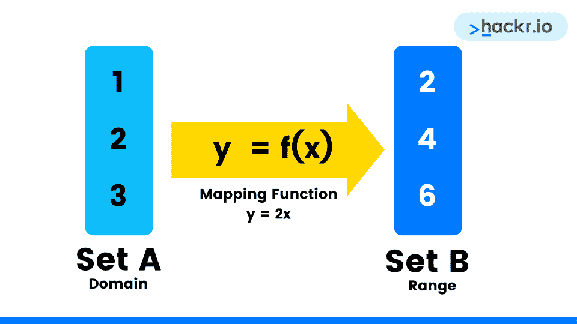
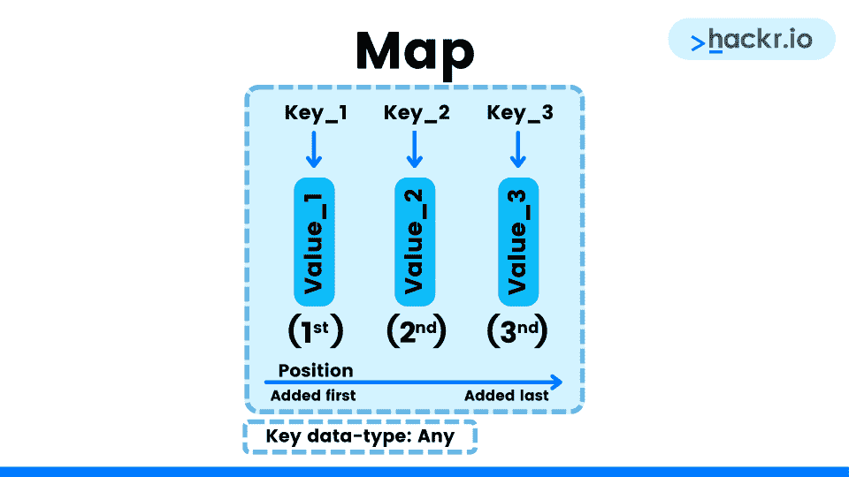
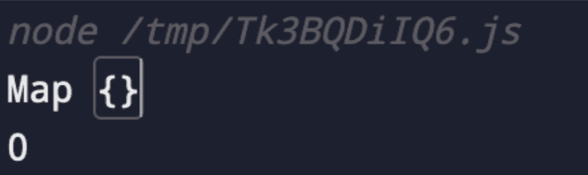
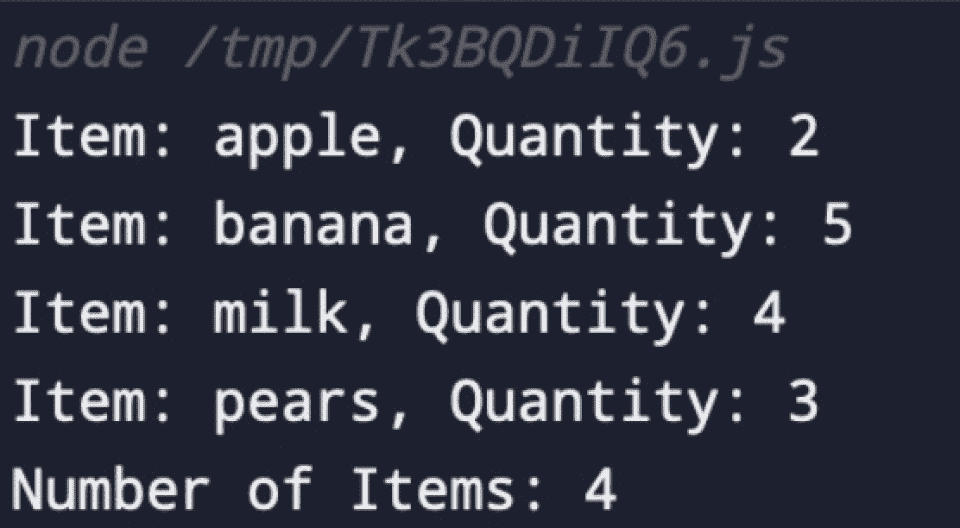
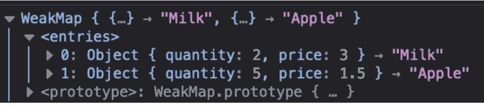
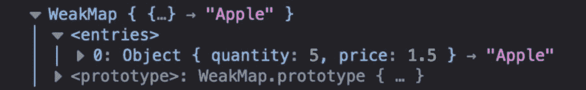

# JavaScript Map Array | Array Map()方法入门指南

> 原文：<https://hackr.io/blog/javascript-map>

JavaScript array.map()方法创建一个由元素组成的**新数组**，这些元素是对调用数组中的每个元素调用回调函数的结果。

当您需要对数组的元素应用一些逻辑，但又想保持原始数组不变时，此方法很有用。因此，当我们应用这个方法时，我们用修改后的元素生成一个新的数组，同时保留原来的数组。

*   原始数组不会改变，因为它是一种复制方法
*   回调函数只在非空数组索引上调用



阅读完本文后，您将对 JavaScript Array Map()方法及其用例、语法和示例有所了解。您还将了解 JavaScript Map(在 ES6 中引入)，以及它的用例、语法和示例。我们还将查看 WeakMaps 和对象，并将它们与 JavaScript Map 进行比较。

## **array . map()**的语法

```
// array
const arr = [1, 4, 9]

// Arrow function
arr.map((element) => { /* execute this */ })
arr.map((element, index) => { /* execute this */ })
arr.map((element, index, arr) => { /* execute this */ })
arr.map((element, index, arr) => { /* execute this */ }, thisVal)

// Inline callback function
arr.map(function(element) { /* execute this */ })
arr.map(function(element, index) { /* execute this */ })
arr.map(function(element, index, arr) { /* execute this */ })
arr.map(function(element, index, arr) { /* execute this */ }, thisVal)

// Callback Function
arr.map(callBackFunction)
arr.map(callBackFunction, thisVal)
```

## **参数**

*   **callBackFunction()** -在每个数组元素上调用的函数。(必需)
*   **元素** -当前元素的值。(必需)
*   **索引** -当前元素的索引。(可选)
*   **arr** -当前元素的数组。(可选)
*   **thisVal** -传递给函数用作“this”的值。如果未提供该参数，**未定义的**将被用作“此”值。

## **Javascript array.map()示例**

**使用箭头功能:**

```
const array1 = [1, 2, 8, 10, 15];

// Arrow function to map
const map1 = array1.map(x => x * 2);

console.log(map1);
// expected output: Array [2, 4, 16, 20, 30] 
```

**使用回调函数:**

```
const callBackFunction = (arr) => {
   return arr + 1;
};

const array1 = [1, 2, 8, 10, 15];

// pass a function to map
const map1 = array1.map(callBackFunction);

console.log(map1);
// expected output: Array [2, 3, 9, 11, 16] 
```

预期结果:map1 = [ 2，3，9，11，16 ]

**在物体上使用 map()**

**代表购物清单的对象数组:**

```
let shoppingList = [
   { item_name: "Apple", quantity: 5 },
   { item_name: "Banana", quantity: 2 },
   { item_name: "Milk", quantity: 4 },
   { item_name: "Pears", quantity: 3 }
]; 
```

迭代对象数组:

*   对象数组中的每个对象都作为回调函数中的函数参数进行访问。地图()
*   对象属性可以被分解或直接访问。

```
// Iterating over array of objects
shoppingList.map(({ item_name, quantity }) => {
   console.log(`Item name: ${item_name}, Quantity: ${quantity}`);
  }
);
// Expected Output
// Item name: Apple, Quantity: 5
// Item name: Banana, Quantity: 2
// Item name: Milk, Quantity: 4
// Item name: Pears, Quantity: 3 
```

向每个购物清单对象添加一个属性:

*   为了给购物列表中的每个对象添加一个新属性，您可以在 return 语句中使用 JavaScript **spread** 操作符
*   JavaScript spread 运算符返回对象的现有属性和值
*   将现有属性与新属性组合，用添加的属性填充新数组

```
shoppingList = shoppingList.map(
   (item) => {
       // New Price Property
       const newProperty = "New Property";
       return {...item, newProperty: newProperty};
   }
);

console.log(shoppingList);
// Expected Output
// Shopping List with new property
// Item name: Apple, Quantity: 5, newProperty: New Property
// Item name: Banana, Quantity: 2, newProperty: New Property
// Item name: Milk, Quantity: 4, newProperty: New Property
// Item name: Pears, Quantity: 3, newProperty: New Property 
```

从每个购物清单对象中删除属性:

*   迭代数组中的每个对象，以永久删除该属性

```
shoppingList = shoppingList.map(
   (item) => {
       delete item.newProperty;
       return item;
   }
);

console.log(shoppingList);
// Expected Output
// Item name: Apple, Quantity: 5
// Item name: Banana, Quantity: 2
// Item name: Milk, Quantity: 4
// Item name: Pears, Quantity: 3 
```

**JavaScript (ES6) - Map**

2015 年，JavaScript (ES6)引入了一种新的数据结构，称为**映射**。不要与**混淆。map()** array 方法我们刚刚讨论过，这是一个内置的数据结构，可以用来将数据存储为不同的有序键值对的集合。



创建新地图的一般语法:

```
let items = new Map();
```

这将创建一个名为 **items** 的变量，其值为 **new Map()** 。

我们创建的 **items** 变量包含一个空地图。

```
let items = new Map();

console.log(items)
console.log(items.size)
```

**输出:**

****

虽然这个新地图目前是空的，但在开始填充地图后，我们可以使用一些方法来处理数据。

**地图方法**

*   map.set() -向映射添加一个键值对
*   map.has() -在检查指定的键当前是否在映射中后返回一个布尔值
*   map.get() -返回给定键的相应值
*   map.delete() -从映射中删除给定的键值对
*   map.clear() -从映射中删除所有键值对

**使用地图方法**

我们将使用之前的购物清单示例来探索地图数据结构。

**使用 map.set()**

```
let shoppingList = new Map();

shoppingList.set("apple", 2);
shoppingList.set("banana", 5);
shoppingList.set("milk", 4);
shoppingList.set("pears", 3);

// iterating the Map
shoppingList.forEach((val, key) => {
   console.log(`Item: ${key}, Quantity: ${val}`);
   }
);
// logging the Map size
console.log(`Number of Items: ${shoppingList.size}`);
```

**输出:**

****

在对 Map 进行迭代之后，我们可以看到设置的每个键-值对。我们还可以访问 size 属性来查看它是如何被更新以反映新数据的。

**使用 map.has()**

```
console.log(shoppingList.has("milk")); // True
console.log(shoppingList.has('oranges')); // False
```

**输出:**

```
node /tmp/Tk3BQDiIQ6.js
true
false 
```

这表明对于 Map 对象中的键返回 true，对于不在 Map 中的键返回 false。

**使用 map.get()**

```
console.log(shoppingList.get("apple")); // 2
console.log(shoppingList.get("oranges")); // undefined
```

**输出:**

```
node /tmp/Tk3BQDiIQ6.js
2
undefined 
```

这里我们可以看到。当我们传递一个不在映射内的键时，get()返回 undefined。

**使用 map.delete()**

```
// deleting the milk from the Map
shoppingList.delete("milk");
// iterating the Map
shoppingList.forEach((val, key) => {
   console.log(`Item: ${key}, Quantity: ${val}`);
   }
);
// logging the Map size
console.log(`Number of Items: ${shoppingList.size}`);
```

**输出:**

```
node /tmp/Tk3BQDiIQ6.js
Item: apple, Quantity: 2
Item: banana, Quantity: 5
Item: pears, Quantity: 3
Number of Items: 3 
```

更新后的地图反映出“milk”键的数据已被删除。

**使用 map.clear()**

```
shoppingList.clear();
console.log(shoppingList);
console.log(shoppingList.size);
```

**输出:**

```
node /tmp/Tk3BQDiIQ6.js
Map {}
0 
```

现在我们可以看到整个地图都被清空了，这意味着地图是空的，大小为零。

## **ES6 JavaScript 地图 vs 对象**

JavaScript 对象非常类似于 ES6 映射，因为它们都允许您存储键-值对的集合、检索值、删除键，以及检测是否有东西存储在键级别。

长期以来，JavaScript 对象一直被用来表示地图。然而，在对象和贴图之间有一些重要的区别，你在决定两者之间的时候应该考虑。

### **地图的优点**

*   对象键只能是字符串、整数和符号数据类型，而映射键可以是任何数据类型
*   地图的大小可以很容易地获取，而对象的大小必须手动跟踪
*   Map.has('key ')方法允许您检查具有特定键的元素是否存在
*   该地图具有按顺序迭代的功能，其中元素的原始顺序保持不变。这确保了在所有浏览器中的相同性能

### **地图的缺点**

*   地图需要更多的内存
*   JSON 支持对象，但不支持地图
*   Map 纯粹是一个哈希表，而对象为其元素提供逻辑功能

## **ES6 JavaScript 地图 vs WeakMap**

与 JavaScript Map 非常相似，WeakMap 也在 ES6 中引入。这允许您存储一组键值对，并且它采用 Map 对象的相同属性。

两者的主要区别在于 WeakMap 键必须是 Object 数据类型。另一个区别是 WeakMap 的键是**弱**引用的。这意味着当一个对象被用作 WeakMap 键时，它可以被垃圾回收。

例如，如果对一个对象的引用丢失了(对象引用被赋值为 NULL)，那么 JavaScript 垃圾收集器会检测到该对象不再被使用，并将它从内存中释放出来。

**weak map 方法:**

*   。delete() -删除与键相关联的任何值
*   。set() -设置 WeakMap 中给定键的值
*   。get() -返回与键相关联的值，如果键不存在，则返回“未定义”
*   。has() -在检查指定的键当前是否在 WeakMap 中后返回一个布尔值

### **WeakMap 示例**

```
// Creating a WeakMap
const shoppingList = new WeakMap();
```

上面的代码创建了一个新的 WeakMap。

**使用 weakmap.set()**

```
appleObj = { "quantity": 5, "price": 1.5 };
milkObj = { "quantity": 2, "price": 3 };

shoppingList.set(appleObj, "Apple");
shoppingList.set(milkObj, "Milk");
```

这里我们创建了两个对象，一个是苹果，一个是牛奶。这些被作为钥匙添加到了 WeakMap 中。

**记录 WeakMap:**

```
// Print the WeakMap
console.log(shoppingList); 
```

**输出:**

****

在控制台记录了 WeakMap 的数据之后，我们可以看到添加到 WeakMap 中的每个密钥对条目。

**利用。get()**

```
// Using get() function to get
// specific element in WeakMap
console.log(shoppingList.get(appleObj));
```

**输出:**

```
Apple
```

打电话。appleObj 键上的 get()返回存储的值“Apple”。

**利用。删除()**

```
// Use delete() function
shoppingList.delete(milkObj);
// Pring the WeakMap
console.log(shoppingList)
```

**输出:**

****

打完电话。delete()在 milkObj 键上，我们已经从 WeakMap 中删除了键和相关的值。我们可以看到 WeakMap 中唯一的条目是 appleObj 键和相关的值“Apple”。

**Using.has()**

```
// Using has() function to check
// if a particular element is
// present in WeakMap or not.
console.log(shoppingList.has(milkObj)); // False
console.log(shoppingList.has(appleObj)); // True
```

**输出:**

```
node /tmp/Tk3BQDiIQ6.js
false
true 
```

我们可以看到，对于 milkObj 键，控制台日志输出显示 false，因为它已被删除，但是对于 appleObj 键，它输出 true，因为它仍然存在于我们的 WeakMap 中。

## **摘要- JavaScript Map 数组| JavaScript ES6 Map**

总之，我们已经知道 JavaScript Map Array 是一种迭代方法，在调用数组的元素上执行回调函数后返回一个新数组。然后我们讨论了这种方法的语法和用例。我们还学习了 ES6 JavaScript Map 和 WeakMap，它们是键值对的内置 JavaScript 数据结构。然后我们讨论了这些结构的语法、用例以及方法。

考虑看看这些[最好的 JavaScript 教程](https://hackr.io/tutorials/learn-javascript?ref=blog-post)来帮助你进一步提高你的 JS 技能。

有任何与 JavaScript Map 相关的查询吗？请在评论中告诉我们！我们会尽力帮助你。

[ES6 的完整现代 Javascript 课程](https://click.linksynergy.com/link?id=jU79Zysihs4&offerid=1045023.1345036&type=2&murl=https%3A%2F%2Fwww.udemy.com%2Fcourse%2Fthe-complete-javascript-development-course-%2F)

## **常见问题解答**

#### **1。什么是 JavaScript 地图？**

JavaScript 映射是具有键值对构造函数的可迭代对象，该构造函数看起来像 2D 数组，但行为像一个对象。它们为键提供了比对象更好的灵活性，因为它们可以是任何数据类型。(不要与 JavaScript 数组映射方法混淆)

#### **2。如何在 JavaScript 中映射一个元素？**

我们可以使用数组映射方法映射 JavaScript 数组中的每个元素:array . map((current value)= > {*/* execute this */*})

#### **3。地图是 ES6 的一部分吗？**

作为 ES6 版本的一部分，JavaScript 社区引入了一个名为 Map 的新数据集合。与 JavaScript 对象类似，Map 保存任何类型的键-值对，并且它还维护迭代的键插入顺序。

#### **4。地图比物体快吗？**

在存储大型数据集时，JavaScript Maps 的性能往往优于对象，尤其是在运行时才知道键的情况下，以及键的数据类型和值的数据类型都相同的情况下。

#### **5。JavaScript 映射是散列表吗？**

JavaScript 映射可以表示为哈希表抽象数据类型。

**人也在读:**