# 15 个最适合初学者的 JavaScript 项目[附源代码]

> 原文：<https://hackr.io/blog/javascript-projects>

JavaScript (JS)是最流行的编程语言[之一，在所有 web 应用程序中用于验证、呈现动态内容、交互式图形和地图等等。随着](https://hackr.io/blog/best-programming-languages-to-learn) [HTML](https://developers.google.com/apps-script/guides/html) 和 CSS 的出现，JS 有能力构建完整、健壮的网络应用。

JS 允许用户与网页中有趣的元素进行交互。但是如果你是一个 JS 经验有限的新手，你从哪里开始呢？

通过实践，你会学到最好的东西，这就是基本 JavaScript 项目的用武之地。如果你需要 JavaScript 项目创意方面的帮助，不要担心；我们已经为初学者收集了一些顶级的 JavaScript 项目，还有一些更难的项目，等你掌握了窍门就可以使用了！

准备好练习 JavaScript 项目了吗？让我们开始吧。

## **为什么是 JavaScript 项目？**

JS 是任何 web 应用程序的核心。对 JS 的深刻理解带来了许多挑战性和有趣的职业选择，包括移动应用开发、动态 web 开发、UI/UX 设计和[全栈开发。](https://hackr.io/roadmaps/full-stack-developer-roadmap)由于这种语言无止境的交互性，人们很容易从 JavaScript 中获得乐趣。

如果你了解 JavaScript 的基础知识，项目就是你在简历中添加明星的下一步。如果没有任何编程经验，可以看 [JS 书籍](https://hackr.io/blog/javascript-books)或者上基础的 [JavaScript 课程](https://hackr.io/blog/best-javascript-courses)，以后再回到这些项目。如果你理解 HTML 和 CSS，你就会理解大多数 JavaScript 项目，因为源代码已经提供了。

在我们进入实际项目之前，这里提醒一下 JavaScript 的重要特性:

*   在客户端和服务器端使用，以创建交互式 web 内容。
*   通过动态功能极大地改善了用户体验。
*   具有面向对象能力的轻量级语言。
*   解释的、开放的和跨平台的语言。
*   与 **Java 和 HTML** 无缝集成。

## **最适合初学者的 JavaScript 项目**

您可以用 JavaScript 做很多事情，但是我们不想让您不知所措。幸运的是，有相当多的 javascript 初学者项目可以尝试。

我们将从这些带有源代码的 JavaScript 项目开始，慢慢来，这样您就可以轻松地开始了:

### **1。JavaScript 计算器**

**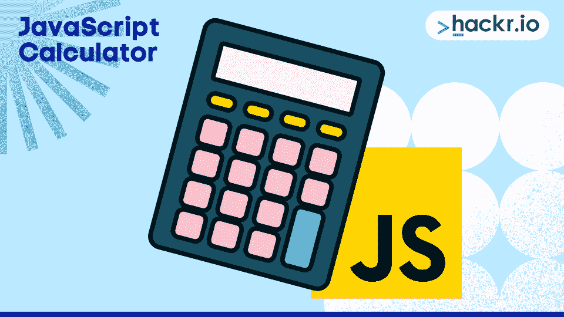**

计算器是我们列表中最简单的 JavaScript 项目之一。我们将使用简单的 HTML 和 CSS，并使用基本的 JavaScript 函数创建所有功能组件。我们将继续使用 HTML 来显示按钮，并使用 CSS 来改进表示。最后，我们需要使用 JavaScript 来确保按钮执行正确的功能。

主函数是 eval()，一个求解 JS 代码的全局 JS 函数。display()函数将在计算器屏幕上显示所选的数字。请注意，该程序将只适用于鼠标事件。以下是完整的代码，分为 HTML、CSS 和 JS 三个部分:

**HTML:**

```
<div class="calculator">

  <input type="text" class="calculator-screen" value="" disabled />

  <div class="calculator-keys">

    <button type="button" class="operator" value="+">+</button>
    <button type="button" class="operator" value="-">-</button>
    <button type="button" class="operator" value="*">&times;</button>
    <button type="button" class="operator" value="/">&divide;</button>

    <button type="button" value="7">7</button>
    <button type="button" value="8">8</button>
    <button type="button" value="9">9</button>

    <button type="button" value="4">4</button>
    <button type="button" value="5">5</button>
    <button type="button" value="6">6</button>

    <button type="button" value="1">1</button>
    <button type="button" value="2">2</button>
    <button type="button" value="3">3</button>

    <button type="button" value="0">0</button>
    <button type="button" class="decimal" value=".">.</button>
    <button type="button" class="all-clear" value="all-clear">AC</button>

    <button type="button" class="equal-sign operator" value="=">=</button>

  </div>
</div> 
```

**CSS:**

```
html {
  font-size: 62.5%;
  box-sizing: border-box;
}

*, *::before, *::after {
  margin: 0;
  padding: 0;
  box-sizing: inherit;
}

.calculator {
  border: 1px solid #ccc;
  border-radius: 5px;
  position: absolute;
  top: 50%;
  left: 50%;
  transform: translate(-50%, -50%);
  width: 400px;
}

.calculator-screen {
  width: 100%;
  font-size: 5rem;
  height: 80px;
  border: none;
  background-color: #252525;
  color: #fff;
  text-align: right;
  padding-right: 20px;
  padding-left: 10px;
}

button {
  height: 60px;
  background-color: #fff;
  border-radius: 3px;
  border: 1px solid #c4c4c4;
  background-color: transparent;
  font-size: 2rem;
  color: #333;
  background-image: linear-gradient(to bottom,transparent,transparent 50%,rgba(0,0,0,.04));
  box-shadow: inset 0 0 0 1px rgba(255,255,255,.05), inset 0 1px 0 0 rgba(255,255,255,.45), inset 0 -1px 0 0 rgba(255,255,255,.15), 0 1px 0 0 rgba(255,255,255,.15);
  text-shadow: 0 1px rgba(255,255,255,.4);
}

button:hover {
  background-color: #eaeaea;
}

.operator {
  color: #337cac;
}

.all-clear {
  background-color: #f0595f;
  border-color: #b0353a;
  color: #fff;
}

.all-clear:hover {
  background-color: #f17377;
}

.equal-sign {
  background-color: #2e86c0;
  border-color: #337cac;
  color: #fff;
  height: 100%;
  grid-area: 2 / 4 / 6 / 5;
}

.equal-sign:hover {
  background-color: #4e9ed4;
}

.calculator-keys {
  display: grid;
  grid-template-columns: repeat(4, 1fr);
  grid-gap: 20px;
  padding: 20px;
} 
```

**JavaScript:**

```
const calculator = {
  displayValue: '0',
  firstOperand: null,
  waitingForSecondOperand: false,
  operator: null,
};

function inputDigit(digit) {
  const { displayValue, waitingForSecondOperand } = calculator;

  if (waitingForSecondOperand === true) {
    calculator.displayValue = digit;
    calculator.waitingForSecondOperand = false;
  } else {
    calculator.displayValue = displayValue === '0' ? digit : displayValue + digit;
  }
}

function inputDecimal(dot) {
  if (calculator.waitingForSecondOperand === true) {
  	calculator.displayValue = "0."
    calculator.waitingForSecondOperand = false;
    return
  }

  if (!calculator.displayValue.includes(dot)) {
    calculator.displayValue += dot;
  }
}

function handleOperator(nextOperator) {
  const { firstOperand, displayValue, operator } = calculator
  const inputValue = parseFloat(displayValue);

  if (operator && calculator.waitingForSecondOperand)  {
    calculator.operator = nextOperator;
    return;
  }

  if (firstOperand == null && !isNaN(inputValue)) {
    calculator.firstOperand = inputValue;
  } else if (operator) {
    const result = calculate(firstOperand, inputValue, operator);

    calculator.displayValue = `${parseFloat(result.toFixed(7))}`;
    calculator.firstOperand = result;
  }

  calculator.waitingForSecondOperand = true;
  calculator.operator = nextOperator;
}

function calculate(firstOperand, secondOperand, operator) {
  if (operator === '+') {
    return firstOperand + secondOperand;
  } else if (operator === '-') {
    return firstOperand - secondOperand;
  } else if (operator === '*') {
    return firstOperand * secondOperand;
  } else if (operator === '/') {
    return firstOperand / secondOperand;
  }

  return secondOperand;
}

function resetCalculator() {
  calculator.displayValue = '0';
  calculator.firstOperand = null;
  calculator.waitingForSecondOperand = false;
  calculator.operator = null;
}

function updateDisplay() {
  const display = document.querySelector('.calculator-screen');
  display.value = calculator.displayValue;
}

updateDisplay();

const keys = document.querySelector('.calculator-keys');
keys.addEventListener('click', event => {
  const { target } = event;
  const { value } = target;
  if (!target.matches('button')) {
    return;
  }

  switch (value) {
    case '+':
    case '-':
    case '*':
    case '/':
    case '=':
      handleOperator(value);
      break;
    case '.':
      inputDecimal(value);
      break;
    case 'all-clear':
      resetCalculator();
      break;
    default:
      if (Number.isInteger(parseFloat(value))) {
        inputDigit(value);
      }
  }

  updateDisplay();
}); 
```

### **2。刽子手游戏**

**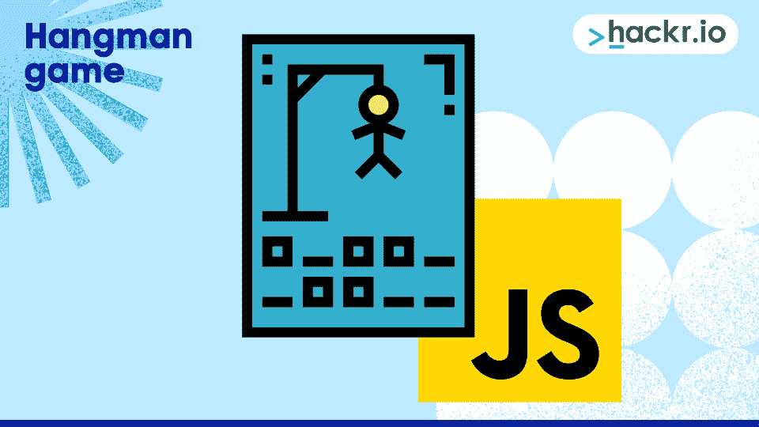
**

Hangman 是一款知名游戏，也是我们简单的 JS 项目之一。您可以使用 JavaScript、HTML 和 CSS 在瞬间开发它。注意，主要功能是使用 JS 定义的。HTML 是用来显示的，CSS 做的是美化内容的工作。

JS 代码中定义了许多方法，所以看起来可能有点复杂，但是一旦你彻底阅读了代码，你就会意识到这很简单。您也可以运行代码并逐行查看执行情况。

在这里检查代码和执行[。](https://code.sololearn.com/WyyBylG1NvdU/#js)

### **3。井字游戏**

**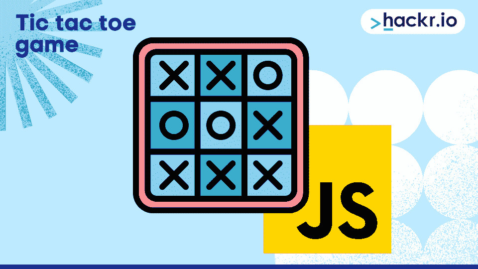
**

JavaScript 让你自己开发井字游戏变得很容易。你可以在这里看完整的代码[，它解释了如何一步一步地构建一个 3x3 井字游戏。然后，您可以在以后扩展到 NxN，进行自己的实践和学习。该项目的 HTML 和 CSS 非常简单。作者首先从伪代码开始，然后逐个解释每个函数。](https://dev.to/bornasepic/pure-and-simple-tic-tac-toe-with-javascript-4pgn)

### **4。JavaScript 天气应用**

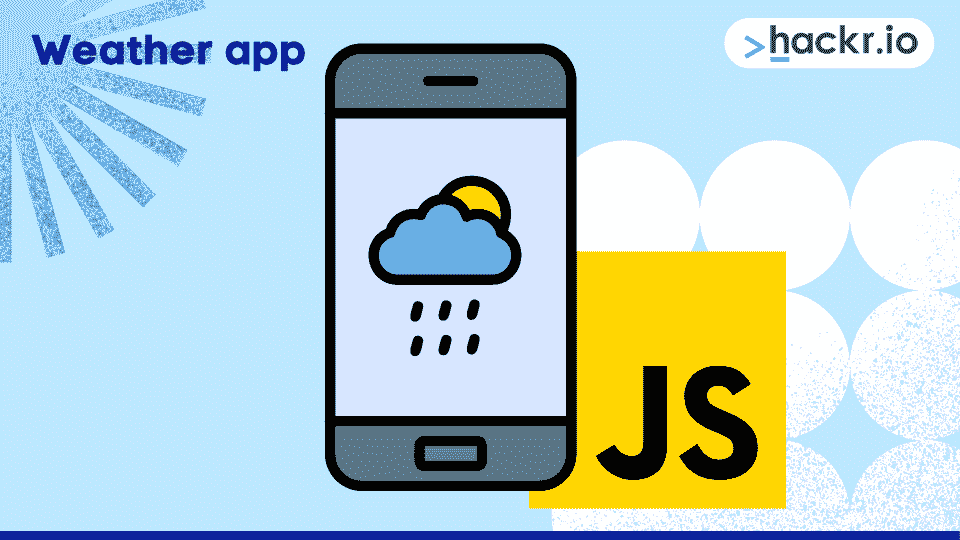

天气应用也是流行的 JavaScript 项目。一旦您更改了此项目中的位置名称，天气显示会立即更改，无需刷新页面。UI 也相当圆滑。

请注意，大多数天气应用程序使用 API 来获取天气数据。我们将使用流行且最常见的 API OpenWeatherMap。

看看这个 Youtube 视频，它详细解释了天气应用程序的代码和功能。通常有三个文件:index.html、main.js 和 main.css。虽然您可以将所有代码放在一个文件(HTML)中，但维护单独的文件更方便。

### 推荐 JavaScript 课程

【JavaScript 全教程 2023:从零到专家！

### 5.JavaScript 音乐事件

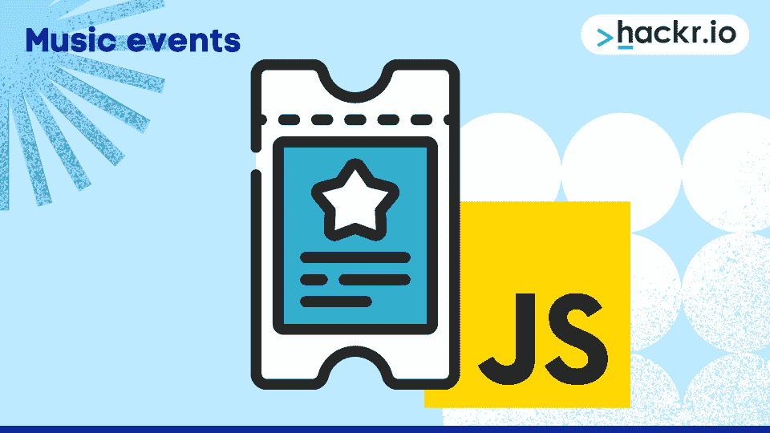

在这里，我们将向您介绍将作用于键盘事件的事件监听器。例如，如果按下“S”键，将会发生一个事件。每一个都有不同的代码和动作。

除了事件监听器，我们还将学习如何添加和播放音频文件。请注意，我们添加了非常基本的 CSS，因为这里的重点是 JavaScript。你必须导入你自己的声音和背景图像，程序才能完全正常工作。

```
<html>
<head>
 <meta charset="UTF-8">
 <meta name="viewport" content="width=device-width, initial-scale=1">
 <title>KeyBoard Music</title>
</head>
<body>
 <div class="keys">
   <div data-key="65" class="key">
     <kbd>A</kbd>
   </div>
   <div data-key="83" class="key">
     <kbd>S</kbd>
   </div>
   <div data-key="68" class="key">
     <kbd>D</kbd>
   </div>
   <div data-key="70" class="key">
     <kbd>F</kbd>
   </div>
   <div data-key="71" class="key">
     <kbd>G</kbd>
   </div>
   <div data-key="72" class="key">
     <kbd>H</kbd>
   </div>
   <div data-key="74" class="key">
     <kbd>J</kbd>
   </div>
   <div data-key="75" class="key">
     <kbd>K</kbd>
   </div>
   <div data-key="76" class="key">
     <kbd>L</kbd>
   </div>
 </div>
 <audio data-key="65" src="sounds/clap.wav"></audio>
 <audio data-key="83" src="sounds/chord.wav"></audio>
 <audio data-key="68" src="sounds/ride.wav"></audio>
 <audio data-key="70" src="sounds/openhat.wav"></audio>
 <audio data-key="71" src="sounds/tink.wav"></audio>
 <audio data-key="72" src="sounds/kick.wav"></audio>
 <audio data-key="74" src="sounds/swipe.wav"></audio>
 <audio data-key="75" src="sounds/tom.wav"></audio>
 <audio data-key="76" src="sounds/boom.wav"></audio>
</body>
<script>
function removeTransition(event) {
 if (event.propertyName !== 'transform') return
 event.target.classList.remove('playing')
}
function playSound(event) {
 const audio = document.querySelector(`audio[data-key="${event.keyCode}"]`)
 const key = document.querySelector(`div[data-key="${event.keyCode}"]`)
 if (!audio) return
 key.classList.add('playing')
 audio.currentTime = 0
 audio.play()
}
const keys = Array.from(document.querySelectorAll('.key'))
keys.forEach((key) => key.addEventListener('transitionend', removeTransition))
window.addEventListener('keydown', playSound)
</script>
<style>
html {
 font-size: 12px;
 background: url('drums.jpg') top center;
 background-size: 80%;
}
.keys {
 display: flex;
 flex: 1;
 align-items: top;
 justify-content: center;
}
.key {
 border: 0.4rem solid blue;
 border-radius: 0.5rem;
 margin: 1rem;
 font-size: 2rem;
 padding: 1rem 0.5rem;
 transition: all 0.01s ease;
 width: 5rem;
 text-align: center;
 color: black;
 text-shadow: 0 0 0.5rem yellow;
}
</style>
</html>
```

### **6。JavaScript 表单验证**

**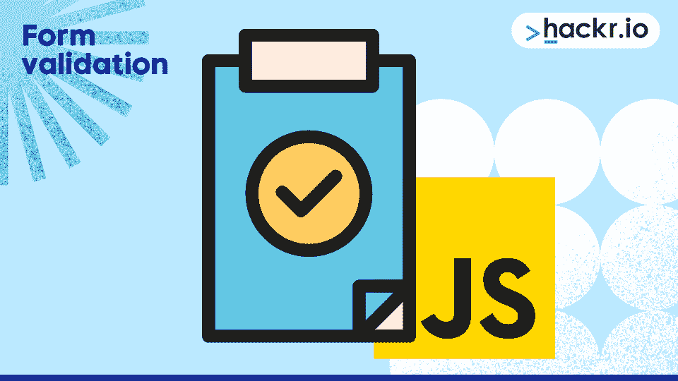
**

表单验证是一个非常有用的方面，许多网站都使用它在客户端验证用户信息，比如名片和地址信息。例如，如果有一个强制输入字段名称，用户可以键入一个数字，将该字段留空，或者只键入一个字母。JS 可以验证这些信息。

下面的项目涉及简单的表单验证。当然，这个项目也需要 HTML 元素。我们没有进行任何广泛的样式设计，只是在 HTML 本身中包含了一些基本的元素。

下面是带有基本验证的简单表单的完整代码:

```
<html>
  <head>
     <title>Form Validation</title>
        <script type = "text/javascript">
        function validate() {
        var text;
           if( document.myForm.name.value == "" ) {
             text = "Name cannot be empty";
              document.getElementById("demo").innerHTML = text;
              document.myForm.name.focus() ;
              return false;
           }
           if( document.myForm.email.value == "" ) {
             text = "E-mail cannot be empty";
              document.getElementById("demo").innerHTML = text;
              document.myForm.email.focus() ;
              return false;
           }
      var emailID = document.myForm.email.value;
      atposn = emailID.indexOf("@");
      dotposn = emailID.lastIndexOf(".");
      if (atposn < 1 || ( dotposn - atposn < 2 )) {
      text = "Please enter valid email ID";
      document.getElementById("demo").innerHTML = text;
      document.myForm.email.focus() ;
      return false;
    }
           if( document.myForm.phone.value == "" || isNaN( document.myForm.phone.value ) ||
              document.myForm.phone.value.length != 10 ) {
              text = "Please enter a valid 10-digit phone number";
              document.getElementById("demo").innerHTML = text;
              document.myForm.phone.focus() ;
              return false;
           }
           if( document.myForm.subject.value == "0" ) {
              text = "Please provide your area of expertise";
              document.getElementById("demo").innerHTML = text;
              return false;
           }
           return( true );
        }
     </script>
  </head>
  <body>
     <form action = "" name = "myForm" onsubmit = "return(validate());">
   	 <h1 align="center">USER REGISTRATION</H1>
        <table align="center" cellspacing = "3" cellpadding = "3" border = "3">
           <tr>
              <td align = "right">Name</td>
              <td><input type = "text" name = "name" /></td>
           </tr>
           <tr>
              <td align = "right">E-mail</td>
              <td><input type = "text" name = "email" /></td>
           </tr>
           <tr>
              <td align = "right">Phone Number</td>
              <td><input type = "text" name = "phone" /></td>
           </tr>
           <tr>
              <td align = "right">Subject</td>
              <td>
                 <select name = "subject">
                    <option value = "0" selected>Select</option>
                    <option value = "1">HTML</option>
                    <option value = "2">JavaScript</option>
                    <option value = "3">CSS</option>
                    <option value = "4">JSP</option>
                 </select>
              </td>
           </tr>
        </table>
        <p id="demo" style="color:red; text-align:center"></p>
  <div style="text-align:center"><input type = "submit" value = "Submit" /></div>
     </form>
  </body>
</html>
```

### **7。JavaScript 照片细节显示**

**
**

这里，我们将在网页上显示一些图像。一旦用户将鼠标悬停在图像上，就会出现更多的细节。你可以从任何地方下载图片或者使用你已经有的图片。

同样，我们使用了基本的 HTML 和 CSS 以及 JS。后者执行大部分工作。你将通过这个项目学习鼠标悬停事件是如何工作的。

```
<!DOCTYPE html>
<html>
 <head>
   <title>My Sun Sign Infos</title>
 </head>
 <script>
 function display(element){
   document.getElementById('image').innerHTML = element.alt;
 }
 function revert(){
   document.getElementById('image').innerHTML = "Hover over a sunsign image to display details.";
 }
</script>
 <style>
 #image{
     width: 650px;
     height: 70px;
     border:5px solid pink;
     background-color: black;
     background-repeat: no-repeat;
     color:white;
     background-size: 100%;
     font-family: Didot;
     font-size: 150%;
     line-height: 60px;
     text-align: center;
 }
 img{
 width: 200px;
 height: 200px;
 border-radius: 50%;
 }
 </style>
 <body>
   <div>
   <p id = "image">Hover over a sunsign image to display details.<p>
   
   
   
   
   </div>
 </body>
</html>
```

为了让这个项目更复杂，可以试试 W3Schools 的这个[幻灯片项目。您可以将 onClick 事件更改为 onmousehover 和 onmouseout 事件，在这种情况下，一旦用户将鼠标悬停在图像上，图像就会发生变化。](https://www.w3schools.com/howto/howto_js_slideshow.asp)

### **8。建立一个互动的登陆页面**

**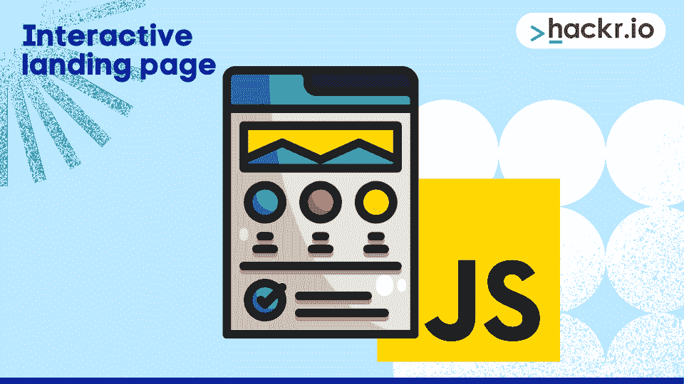
**

这个项目包括建立一个动态的登录页面，存储你的名字和写在本地存储的文本，并根据当天的时间向你显示适当的图像和问候信息。这个 [YouTube 视频](https://www.youtube.com/watch?v=fSTQzlprGLI&feature=emb_logo)将帮助你了解这个项目的 JS 组件。

**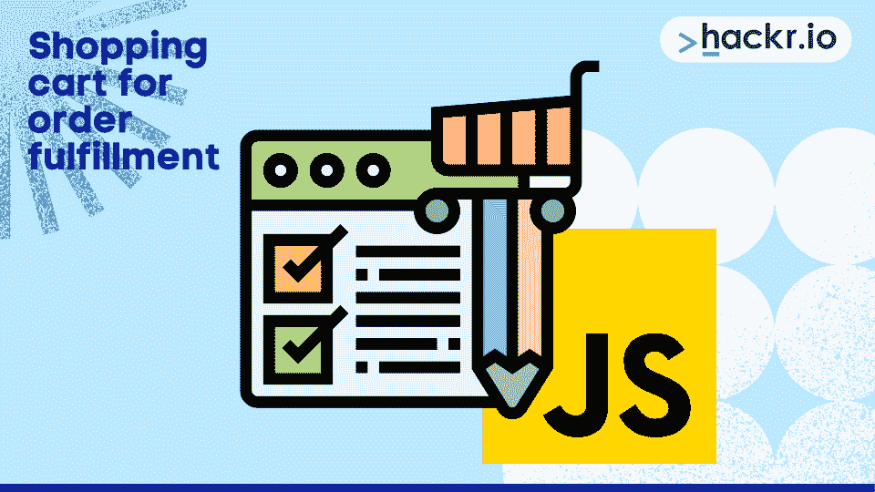
**

到目前为止，我们已经完成了纯 JS、HTML 和 CSS 的小型项目。在这里，作者为订单履行构建了一个成熟的购物车，该项目也使用了 jQuery。

您可以将此作为学习 jQuery 的重要[概念的机会。这将是一个很好的项目，因为购物网站在今天非常受欢迎，因为数字购物已经变得非常流行。这个项目需要时间，但是值得！](https://hackr.io/tutorials/learn-jquery?ref=blog-post)

### 10。单页应用程序

**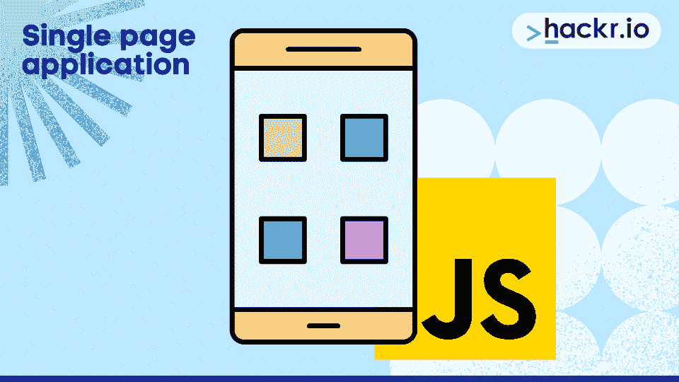
**

这里，页面不会在导航侧边链接时重新加载，但是内容会改变。同样，我们将使用 eventListeners 将视图从一个链接更改为另一个链接。查看这段 [YouTube 视频](https://www.youtube.com/watch?v=6BozpmSjk-Y)的代码和解释。

### **11。JavaScript 浏览器代码编辑器**

**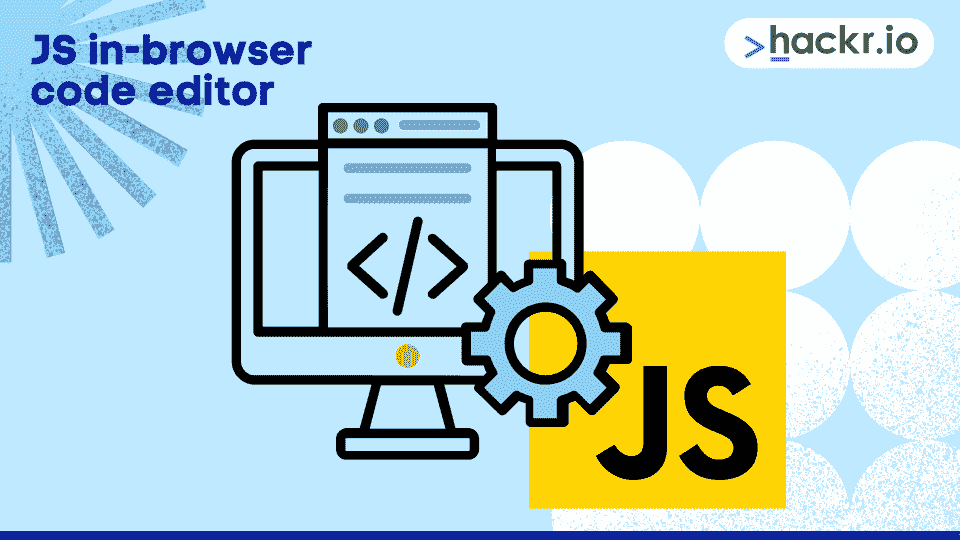**

虽然您已经有足够多的 JS 代码编辑器可供选择，但是能够创建自己的编辑器总是很好的。JS 允许你创建一个浏览器内的代码编辑器，这就是这个项目的目的。它使用了一些有用的 JS 方法——甚至还突出了语法！

这个项目的源代码可以在[这里](https://codepen.io/kazzkiq/pen/xGXaKR)找到。

### **12。实时聊天应用**

****

聊天应用程序制作起来相对简单，您可以使用 JavaScript 自己创建一个。这个项目同时使用了 React 和 Node.js，所以可能有点吓人。然而，这是一个很好的方法来让你的手脏起来，并学习如何使用这些无价的工具。

可以在 GitHub 上查看[源代码](https://github.com/adrianhajdin/project_chat_application)。

### 13。2D 平台游戏

**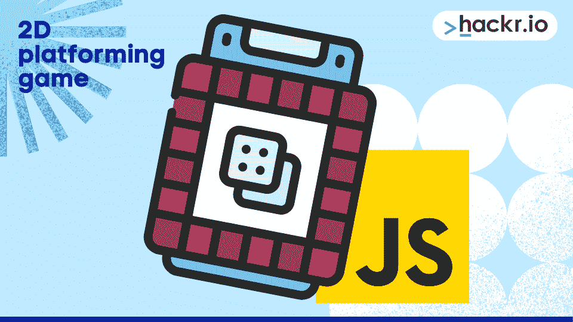**

游戏是学习 JS 的一种极好的有趣的方式。这就是为什么你会看到这么多围绕游戏的项目。这个项目教你如何创建一个 2D 平台游戏——全部使用 JS、HTML 和 CSS。您将利用 [OOPs 概念](https://hackr.io/blog/oops-concepts-in-java-with-examples)和一个 API，这两项技能都很方便。

点击查看源代码[。](https://www.youtube.com/watch?v=w-OKdSHRlfA)

### **14。照片分享应用**

**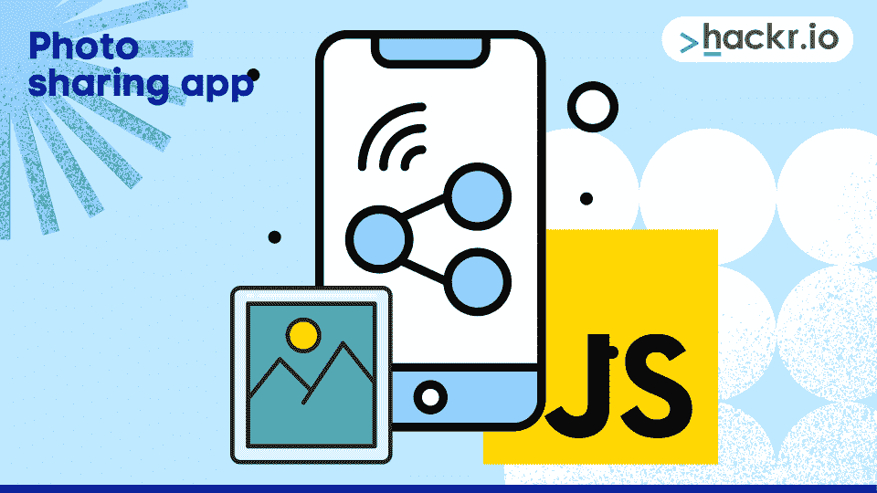**

Instagram 大家都知道。它有很多功能，但从根本上说，它是一个照片分享应用程序。您可以使用 JS 创建一个类似但规模较小的版本。这是一个庞大的项目，你会发现自己在使用 React、Node.js 和 Postgres 等工具。

这里看一下源代码[。](https://github.com/bzapata95/instagram-clone.git)

### 15。文件共享应用

**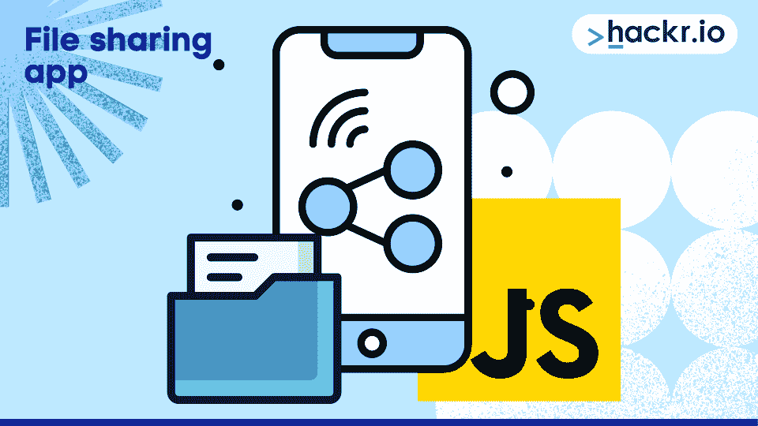**

学习如何共享文件是另一项有用的技能。您将使用 JavaScript 中的 Virgil 加密库来创建这个应用程序。它是安全的，您可以下载、解密和查看加密的媒体文件。

这里看一下源代码[。](https://github.com/VirgilSecurity/demo-sharing-js.git)

## 今天就开始编写 JavaScript 项目吧！

我们只讨论了大量酷 JavaScript 项目中的 15 个。然而，这些 JavaScript 示例项目可以为您的投资组合注入大量的价值，并且几乎涵盖了您需要了解的关于 JS 的所有重要概念。

渴望了解更多关于 JavaScript 的知识吗？通过我们的 [HTML 项目](https://hackr.io/blog/html-projects)，加深您对它如何与 HTML 交互的了解。一旦你感到自信了？

[**探索 JavaScript 教程**](https://hackr.io/tutorials/learn-javascript?ref=blog-post)

## **常见问题解答**

#### **1。用 JavaScript 可以做什么项目？**

用 JavaScript 编写项目代码有几种选择。对于初学者来说，像计算器和带有事件监听器的项目可能是一个好的起点。查看上面的列表，了解更多信息。

#### **2。我如何开始一个 JavaScript 项目？**

你从编码开始！一个流行的第一步是 JavaScript 计算器项目。看看上面的 JavaScript 项目列表就可以开始了。

#### **3。初学者学习 JavaScript 从哪里开始？**

可以通过 Hackr.io 上的资源开始学习 JavaScript，比如最好的 [JavaScript 认证](https://hackr.io/blog/best-javascript-certification)。互联网上有大量的资源等着你去利用！这包括可以立即开始的简单 JavaScript 项目。

#### **4。哪里可以得到 JavaScript 项目？**

您可以查看上面的初级 JavaScript 项目，了解一些不错的项目。你也可以在网上搜索更简单的项目想法。

**人也在读:**