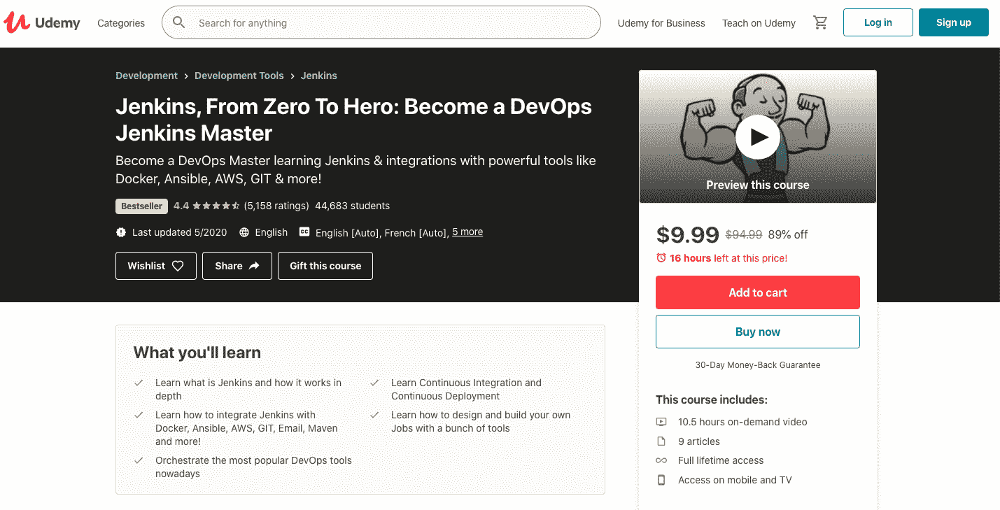
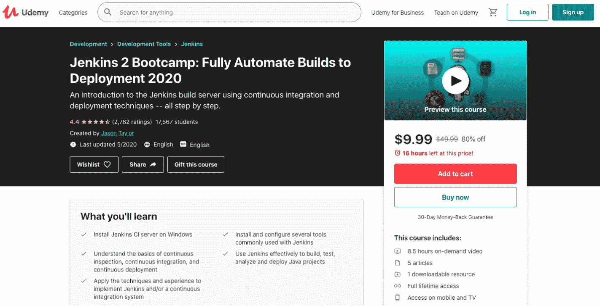
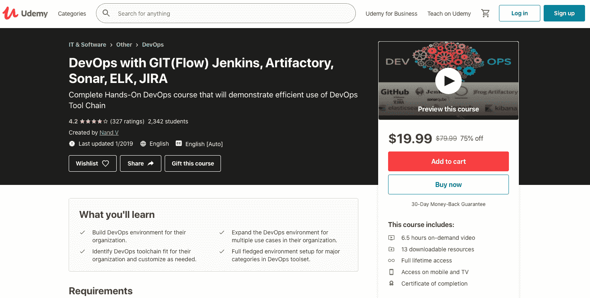
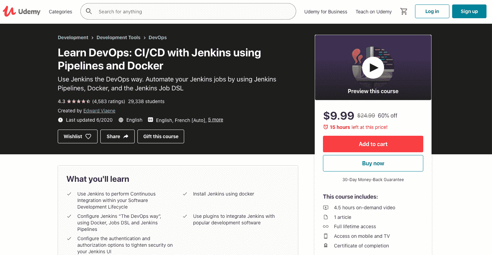
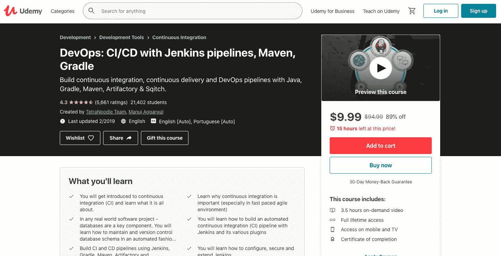

# 2023 年要知道的 10 个最佳 Jenkins 认证[更新]

> 原文：<https://hackr.io/blog/jenkins-certification>

如果您听说过很多关于 Jenkins 认证的事情，但不知道课程的具体内容、费用、完成本课程的期限以及在专业领域可以预期的收益，那么我们可以为您提供所有问题的答案。我们将帮助您了解课程的持续时间、成本、周期以及在 IT 职业中可能获得的潜在好处。我们的研究和来自专家的意见帮助构建了以下关于 Jenkins 认证的详细信息。

## **关于詹金斯认证**

Jenkins 认证是一种高度专业级的认证，证明个人拥有利用 Jenkins 编程语言的所有预期技能和经验。詹金斯认证包括两种认证，称为注册詹金斯工程师(CJE)和注册詹金斯平台工程师(CJPE)。这些认证承认你是处理计算机编程语言的专家，具有专业知识和诚信。

Jenkins 是最顶级的开源自动化服务器之一，它为用户提供了几个插件来支持在项目中构建、部署和应用自动化的过程。安装计算机编程语言很容易，但需要高水平的专业知识来构建和集成用于自动化任务的服务器。非常流行的 CI 和 CD 工具是我们在 IT 界经常听到的 Jenkins 的成果。

## **詹金斯的 10 大认证是什么？**

Jenkins 的十大认证包括以下内容:

Udemy 的这门课程将帮助你了解 Jenkins，并将知识与 Docker、AWS、GIT、Email、Maven、Ansible 等进行整合。您将获得编排 DevOps 工具的能力。除了理解持续集成和部署方法之外。课程内容将有 174 堂课，时间长达 10 小时 37 分 23 秒。课程内容将包括以下内容:

*   介绍和安装
*   Jenkins 入门
*   詹金斯和多克
*   詹金斯和 AWS
*   詹金斯和安西布尔
*   詹金斯和保安
*   詹金斯和电子邮件
*   詹金斯和梅文
*   詹金斯和吉特
*   詹金斯提示和技巧

**评分:** 4.4
**时长:** 10.5 小时
**费用:** $6
**语言:**英语
**认证:**
**先决条件:**计算机基础知识

**等级:**初学者

你可以在这里注册。

Udemy 的这个课程将帮助你学习在 window 上安装 Jenkins CI 服务器。您将学习持续检查、集成和部署的基础知识。您将获得应用各种技术的知识，并获得在集成系统中实施 Jenkins 的经验。这门课程将有 86 堂课，时间长达 6 小时 23 分 49 秒。课程内容将包括以下内容:

*   介绍
*   完全安装
*   基础知识
*   Maven 项目
*   连续检验的测试和质量分析
*   发布构建工件到工件仓库
*   与 Jenkins 一起构建工件部署
*   詹金斯的安全
*   课程勘误表和更新

**评分:** 4.3
**时长:** 6.5 小时
**费用:**【3.5 美元
**语言:**英语
**认证:**提供
**先决条件:**计算机基础知识
**水平:**中级

该课程的先决条件包括基本的计算机知识，能够访问和安装软件，以及求知欲。

你可以在这里注册。

Udemy 的这门课程将帮助你为组织构建一个 DevOps 环境，识别工具链，应用多个用例，并在 DevOps 工具集中设置主要类别。该课程的要求将是一个 6.5 小时的点播视频，有 13 个可下载的资源和终身访问。该课程的基本要求是对 SDLC 生命周期、源代码管理以及使用 Spring boot 和 Maven 等工具的 [Java 编程语言](https://hackr.io/blog/what-is-java)的基本理解。

*   詹金斯基础知识
*   Maven 项目
*   连续检验的测试和质量分析
*   发布构建工件到工件仓库
*   与 Jenkins 一起构建工件部署
*   詹金斯的安全
*   课程勘误表和更新

**评分** : 4.2
**时长:** 6.5 小时
**费用:** $5
**语言:**英语
**认证:**
**先决条件:**计算机基础知识
**水平:**初学者

你可以在这里注册。

本课程将帮助你提高在 Jenkins 的管理效率。您将通过应用重要的源特性来学习应用最佳实践。课程时间长达 8 小时。课程内容包括以下内容:

*   詹金斯的安装
*   使用管理 Jenkins 屏幕
*   管理插件
*   构建通知。
*   主服务器、节点和代理
*   安全性
*   文件夹
*   监视
*   备份
*   使用 CLI 和 API 自动执行任务。

**评分:** 4.2
**时长:** 8 小时
**费用:** $0
**语言:**英语
**认证:**提供
**先决条件:**高级计算机知识
**水平:**高级

先决条件包括 Docker、Git、JAVA、Apache Groovy 和 Apache Maven 的知识。

你可以在这里注册。

Udemy 的这门课程将帮助您学习使用 Jenkins 在您的[软件开发生命周期](https://hackr.io/blog/sdlc-methodologies)内执行持续集成，使用 Docker、Jobs DSL 和 Jenkins 管道配置 Jenkins。您还将了解配置身份验证和授权过程的方法，以加强 Jenkins 用户界面的安全性。认证后，您将能够使用 Docker 安装 Jenkins，并应用插件将 Jenkins 与流行的开发软件集成。本课程包括 52 堂课，时间长达 4 小时 40 分 56 秒。课程内容将包括以下内容。

*   詹金斯简介
*   构建 NodeJS 应用程序
*   作为代码和自动化的基础设施
*   詹金斯工作 DSL
*   詹金斯管道公司
*   詹金斯集成公司
*   高级 Jenkins 用法

**评分:** 4.1
**时长:** 4.5 小时
**费用:** $5
**语言:**英语
**认证:**提供
**先决条件:**计算机基础知识
**水平:**初学者

本课程的要求是对软件开发流程和[云计算](https://hackr.io/blog/what-is-cloud-computing-beginners-guide)有一个大致的了解。

你可以在这里注册。

Udemy 的这门课程将帮助您了解 Jenkins 遵循的持续集成流程。您将学习真实世界的软件应用程序，并获得关于使用 Roundhouse 以自动化方式控制数据库模式的知识。本课程将有 30 堂课，时间长达 3 小时 27 分 28 秒。课程内容将包括以下内容:

*   詹金斯简介
*   CI/CD 或与 Jenkins 的持续集成和持续交付
*   Jenkins、Gradle 和 Artifactory 的 CI 和 CD 管道
*   Jenkins 和 Maven 的 CI 和 CD 渠道
*   Jenkins 的操作注意事项

**评分:** 4.0
**时长:** 3.5 小时
**费用:** $3
**语言:**英语
**认证:**提供
**先决条件:**计算机基础知识
**水平:**初学者

本课程的要求是能够使用安装了所需软件的计算机系统。关于软件开发过程的基本信息将是一个额外的优势。

你可以在这里注册。

CloudBees 大学的这门课程将帮助你获得使用蓝海编辑器创建和运行声明式管道的知识。您将学习控制执行流程，保存和使用文件，并获得为管道提供合适和完善的能力。课程时间长达 8 小时。课程内容包括以下内容:

*   詹金斯简介
*   管道介绍
*   创建骨架管线
*   创建简单的管道
*   中间管道
*   管道安装和修整
*   高级功能

**评分:** 3.9
**时长:** 8 小时
**费用:** $0
**语言:**英语
**认证:**提供
**先决条件:**计算机基础知识
**等级:**初学者

本课程的先决条件包括熟悉 Docker、Git、Apache Maven、Gradle 和 NPM。

你可以在这里注册。

CloudBees 大学的这门课程将帮助您创建、运行、分析和保存脚本化管道、共享库和自由链接到管道的作业。您将了解包括 Maven、Gradle 和 NPM 在内的管道工具。课程时间长达 8 小时。课程内容包括以下内容:

*   Jenkins 概述
*   码头工人
*   为共享库做准备
*   创建共享库
*   使用的共享库
*   最佳实践

**评分:** 3.9
**时长:** 8 小时
**费用:** $0
**语言:**英语
**认证:**提供
**先决条件:**中级计算机知识
**水平:**中级

先决条件包括 Docker、Git、Apache Maven 和 Apache Groove 的知识。

你可以在这里注册。

现在，是享受的时候了，你可以参加 Jenkins 的免费基础课程和认证。如果你不确定，那么你可以试试这个免费的课程，它可以让你对 Jenkins 的学习经历有一个免费的了解。CloudBees 大学的这门课程将帮助您了解 Jenkins 在软件开发周期过程中的作用。您将获得关于 Jenkins 仪表板的知识，以管理 Jenkins 实例、控制安全性和应用插件。还可以学习使用管道构建软件，并使用 build Oceans 和 Jenkins dashboard 监控构建。

课程内容将包括以下内容:

*   詹金斯简介
*   构建 NodeJS 应用程序
*   作为代码和自动化的基础设施
*   詹金斯工作 DSL
*   詹金斯管道公司
*   詹金斯集成公司
*   高级 Jenkins 用法

**评分:** 3.8
**时长:** 4.5 小时
**费用:** $0
**语言:**英语
**认证:**
**先决条件:**中级詹金斯知识
**水平:**中级

你可以在这里注册。

CloudBees 大学的这门课程将帮助您提高成为 Jenkins 管理员的效率，并应用最佳实践和所需的其他信息。您将获得 Jenkins 中可用的开源特性。该课程时间长达 8 小时。课程内容包括以下内容:

*   詹金斯简介
*   管道介绍
*   创建骨架管线
*   创建简单的管道
*   中间管道
*   管道安装和修整
*   高级功能

**评分:** 3.8
**时长:** 8 小时
**费用:** $0
**语言:**英语
**认证**:提供
**先决条件:**计算机基础知识
**等级:**初学者

先决条件包括了解 Docker、Apache Groove、Apache maven、Gradle、Git 和 Java。

你可以在这里注册。

## **结论**

Jenkins 认证比其他任何认证花费的时间都少，但会为 IT 专业人员提供一个前沿优势。你所需要的是组织好你的日常日程，并在詹金斯认证的学习和实践中付出真诚的努力。这样你很快就会成为这种[编程语言](https://hackr.io/blog/what-is-programming-language)的专家，并获得职业成长和发展的全新机会。

如果您对 Jenkins 认证有任何疑问，请在评论框中回复。我们的专家团队将尽快给出最佳建议。

你愿意推荐其他不在列表中的 Jenkins 认证吗？下面评论。

**人也在读:**